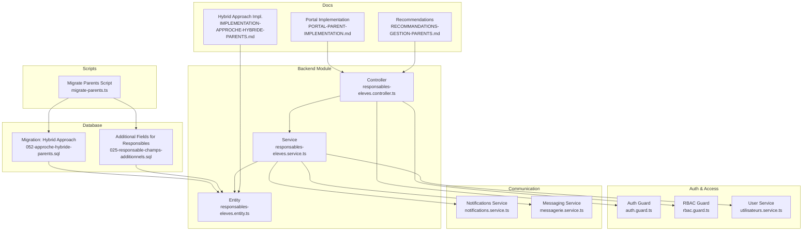
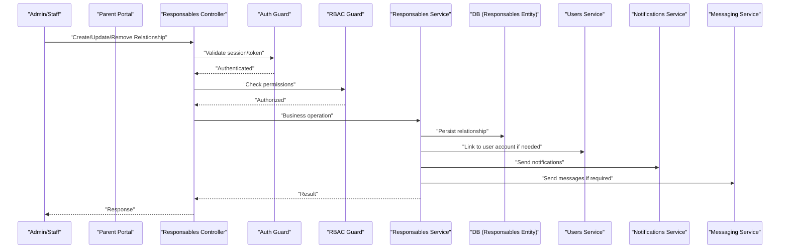
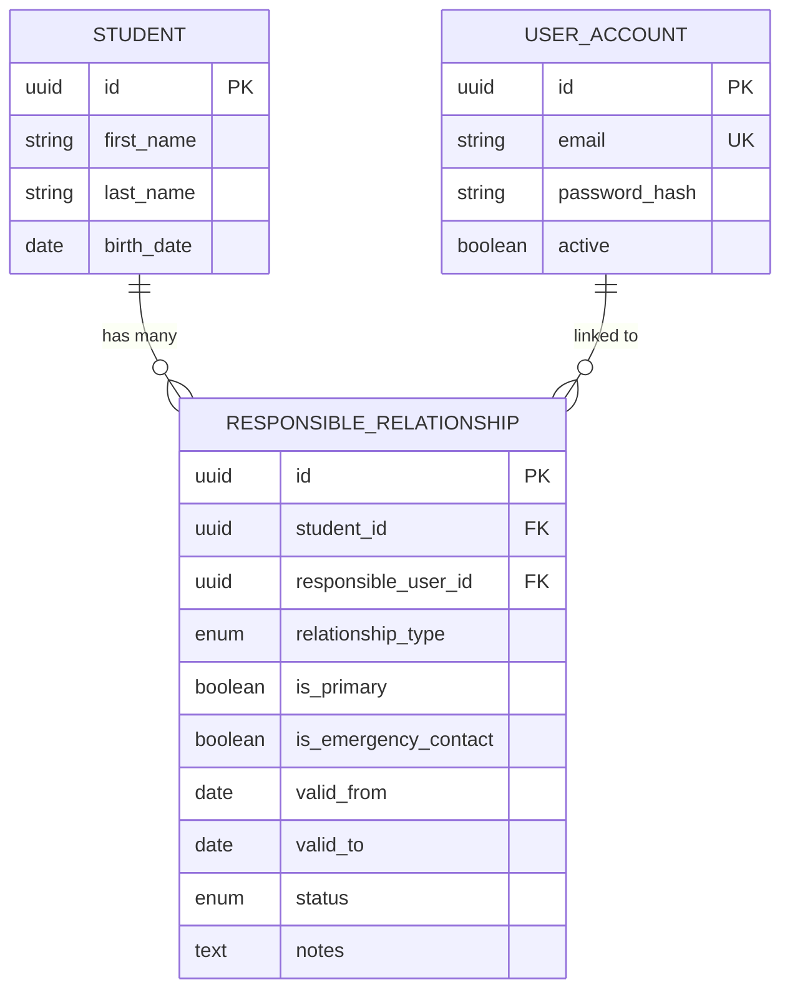
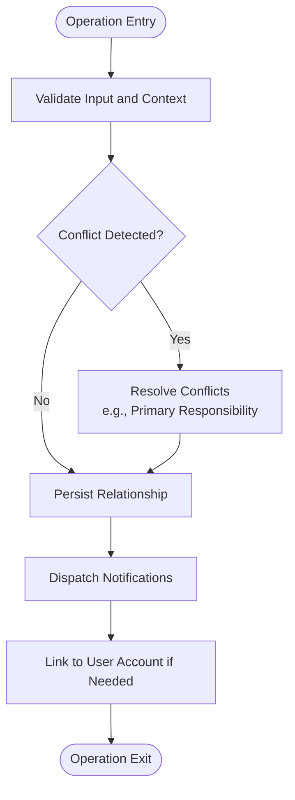
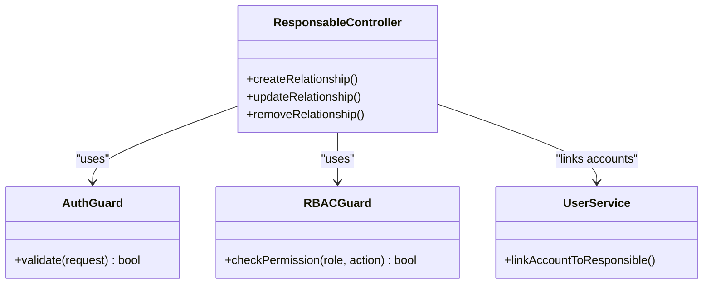
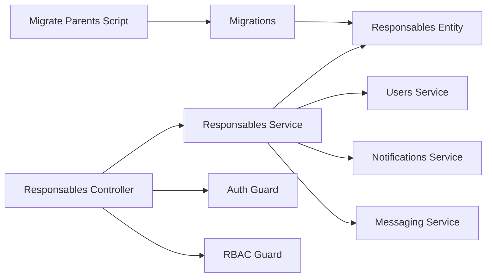

# Parent & Guardian Relationships

<cite>
**Referenced Files in This Document**
- [052-approche-hybride-parents.sql](file://backend/database/migrations/052-approche-hybride-parents.sql)
- [25-responsable-champs-additionnels.sql](file://backend/database/migrations/025-responsable-champs-additionnels.sql)
- [migrate-parents.ts](file://backend/scripts/migrate-parents.ts)
- [responsables-eleves.service.ts](file://backend/src/modules/responsables-eleves/services/responsables-eleves.service.ts)
- [responsables-eleves.controller.ts](file://backend/src/modules/responsables-eleves/controllers/responsables-eleves.controller.ts)
- [responsables-eleves.entity.ts](file://backend/src/modules/responsables-eleves/entities/responsables-eleves.entity.ts)
- [auth.guard.ts](file://backend/src/common/guards/auth.guard.ts)
- [rbac.guard.ts](file://backend/src/common/guards/rbac.guard.ts)
- [utilisateurs.service.ts](file://backend/src/modules/utilisateurs/services/utilisateurs.service.ts)
- [notifications.service.ts](file://backend/src/modules/notifications/services/notifications.service.ts)
- [messagerie.service.ts](file://backend/src/modules/messagerie/services/messagerie.service.ts)
- [PORTAL-PARENT-IMPLEMENTATION.md](file://docs/autres/_divers/PORTAL-PARENT-IMPLEMENTATION.md)
- [RECOMMANDATIONS-GESTION-PARENTS.md](file://docs/autres/_divers/RECOMMANDATIONS-GESTION-PARENTS.md)
- [IMPLEMENTATION-APPROCHE-HYBRIDE-PARENTS.md](file://docs/implementations/IMPLEMENTATION-APPROCHE-HYBRIDE-PARENTS.md)
</cite>

## Table of Contents
1. [Introduction](#introduction)
2. [Project Structure](#project-structure)
3. [Core Components](#core-components)
4. [Architecture Overview](#architecture-overview)
5. [Detailed Component Analysis](#detailed-component-analysis)
6. [Dependency Analysis](#dependency-analysis)
7. [Performance Considerations](#performance-considerations)
8. [Troubleshooting Guide](#troubleshooting-guide)
9. [Conclusion](#conclusion)
10. [Appendices](#appendices)

## Introduction
This document explains the hybrid approach to family relationships used by the system, focusing on how students can have multiple responsible parents or guardians with distinct relationship types (for example, father, mother, legal guardian). It covers:
- The hybrid parent model combining traditional parent-child relationships and flexible guardian assignments
- Responsible parents data model and migration history
- Parent account creation, authentication, and access control
- Practical examples for establishing, modifying, and removing relationships
- Communication channels between parents/guardians and the school
- Notification preferences and permission inheritance
- Complex scenarios such as shared custody, temporary guardianship, and emergency contacts
- Parent portal access and data visibility controls

The goal is to provide both technical and operational guidance for administrators, developers, and end users managing family relationships within the platform.

## Project Structure
The parent and guardian functionality spans database migrations, backend modules, scripts, and documentation:
- Database schema and evolution are defined in SQL migrations under the database/migrations directory
- Backend logic resides in a dedicated module for student responsible parties
- Scripts support data migration and setup tasks
- Documentation provides implementation details and recommendations

**Diagram sources**
- [052-approche-hybride-parents.sql](file://backend/database/migrations/052-approche-hybride-parents.sql)
- [025-responsable-champs-additionnels.sql](file://backend/database/migrations/025-responsable-champs-additionnels.sql)
- [responsables-eleves.controller.ts](file://backend/src/modules/responsables-eleves/controllers/responsables-eleves.controller.ts)
- [responsables-eleves.service.ts](file://backend/src/modules/responsables-eleves/services/responsables-eleves.service.ts)
- [responsables-eleves.entity.ts](file://backend/src/modules/responsables-eleves/entities/responsables-eleves.entity.ts)
- [auth.guard.ts](file://backend/src/common/guards/auth.guard.ts)
- [rbac.guard.ts](file://backend/src/common/guards/rbac.guard.ts)
- [utilisateurs.service.ts](file://backend/src/modules/utilisateurs/services/utilisateurs.service.ts)
- [notifications.service.ts](file://backend/src/modules/notifications/services/notifications.service.ts)
- [messagerie.service.ts](file://backend/src/modules/messagerie/services/messagerie.service.ts)
- [migrate-parents.ts](file://backend/scripts/migrate-parents.ts)
- [PORTAL-PARENT-IMPLEMENTATION.md](file://docs/autres/_divers/PORTAL-PARENT-IMPLEMENTATION.md)
- [RECOMMANDATIONS-GESTION-PARENTS.md](file://docs/autres/_divers/RECOMMANDATIONS-GESTION-PARENTS.md)
- [IMPLEMENTATION-APPROCHE-HYBRIDE-PARENTS.md](file://docs/implementations/IMPLEMENTATION-APPROCHE-HYBRIDE-PARENTS.md)

**Section sources**
- [052-approche-hybride-parents.sql](file://backend/database/migrations/052-approche-hybride-parents.sql)
- [025-responsable-champs-additionnels.sql](file://backend/database/migrations/025-responsable-champs-additionnels.sql)
- [responsables-eleves.controller.ts](file://backend/src/modules/responsables-eleves/controllers/responsables-eleves.controller.ts)
- [responsables-eleves.service.ts](file://backend/src/modules/responsables-eleves/services/responsables-eleves.service.ts)
- [responsables-eleves.entity.ts](file://backend/src/modules/responsables-eleves/entities/responsables-eleves.entity.ts)
- [auth.guard.ts](file://backend/src/common/guards/auth.guard.ts)
- [rbac.guard.ts](file://backend/src/common/guards/rbac.guard.ts)
- [utilisateurs.service.ts](file://backend/src/modules/utilisateurs/services/utilisateurs.service.ts)
- [notifications.service.ts](file://backend/src/modules/notifications/services/notifications.service.ts)
- [messagerie.service.ts](file://backend/src/modules/messagerie/services/messagerie.service.ts)
- [migrate-parents.ts](file://backend/scripts/migrate-parents.ts)
- [PORTAL-PARENT-IMPLEMENTATION.md](file://docs/autres/_divers/PORTAL-PARENT-IMPLEMENTATION.md)
- [RECOMMANDATIONS-GESTION-PARENTS.md](file://docs/autres/_divers/RECOMMANDATIONS-GESTION-PARENTS.md)
- [IMPLEMENTATION-APPROCHE-HYBRIDE-PARENTS.md](file://docs/implementations/IMPLEMENTATION-APPROCHE-HYBRIDE-PARENTS.md)

## Core Components
- Hybrid Relationship Model: Supports multiple responsible parties per student with explicit relationship types and roles, enabling both biological/legal parents and designated guardians.
- Responsible Parties Entity: Central entity linking students to responsible persons, including fields for relationship type, status, validity periods, and flags for emergency contact or primary responsibility.
- Controller Layer: Exposes endpoints to create, update, list, and remove responsible relationships; enforces tenant scoping and validation.
- Service Layer: Implements business rules for relationship establishment, modification, removal, conflict resolution, and notification dispatch.
- Authentication and Authorization: Guards ensure only authenticated users can access endpoints; RBAC guards enforce permissions based on roles and scopes.
- User Management Integration: Links responsible persons to user accounts when applicable, supporting login and portal access.
- Communication Services: Integrates notifications and messaging to inform responsible parties about events and updates.

**Section sources**
- [responsables-eleves.entity.ts](file://backend/src/modules/responsables-eleves/entities/responsables-eleves.entity.ts)
- [responsables-eleves.controller.ts](file://backend/src/modules/responsables-eleves/controllers/responsables-eleves.controller.ts)
- [responsables-eleves.service.ts](file://backend/src/modules/responsables-eleves/services/responsables-eleves.service.ts)
- [auth.guard.ts](file://backend/src/common/guards/auth.guard.ts)
- [rbac.guard.ts](file://backend/src/common/guards/rbac.guard.ts)
- [utilisateurs.service.ts](file://backend/src/modules/utilisateurs/services/utilisateurs.service.ts)
- [notifications.service.ts](file://backend/src/modules/notifications/services/notifications.service.ts)
- [messagerie.service.ts](file://backend/src/modules/messagerie/services/messagerie.service.ts)

## Architecture Overview
The hybrid parent model integrates with authentication, authorization, and communication services to deliver a comprehensive family management experience.

**Diagram sources**
- [responsables-eleves.controller.ts](file://backend/src/modules/responsables-eleves/controllers/responsables-eleves.controller.ts)
- [auth.guard.ts](file://backend/src/common/guards/auth.guard.ts)
- [rbac.guard.ts](file://backend/src/common/guards/rbac.guard.ts)
- [responsables-eleves.service.ts](file://backend/src/modules/responsables-eleves/services/responsables-eleves.service.ts)
- [responsables-eleves.entity.ts](file://backend/src/modules/responsables-eleves/entities/responsables-eleves.entity.ts)
- [utilisateurs.service.ts](file://backend/src/modules/utilisateurs/services/utilisateurs.service.ts)
- [notifications.service.ts](file://backend/src/modules/notifications/services/notifications.service.ts)
- [messagerie.service.ts](file://backend/src/modules/messagerie/services/messagerie.service.ts)

## Detailed Component Analysis

### Data Model and Migration History
- Hybrid Approach Migration: Introduces tables and constraints to support multiple responsible parties per student, relationship types, and role-based attributes.
- Additional Fields Migration: Enriches responsible party records with extra fields for flexibility (for example, contact details, validity dates, emergency flags).
- Migration Script: Automates data transformation and seeding to align legacy data with the new hybrid model.

**Diagram sources**
- [052-approche-hybride-parents.sql](file://backend/database/migrations/052-approche-hybride-parents.sql)
- [025-responsable-champs-additionnels.sql](file://backend/database/migrations/025-responsable-champs-additionnels.sql)
- [responsables-eleves.entity.ts](file://backend/src/modules/responsables-eleves/entities/responsables-eleves.entity.ts)

**Section sources**
- [052-approche-hybride-parents.sql](file://backend/database/migrations/052-approche-hybride-parents.sql)
- [025-responsable-champs-additionnels.sql](file://backend/database/migrations/025-responsable-champs-additionnels.sql)
- [migrate-parents.ts](file://backend/scripts/migrate-parents.ts)
- [responsables-eleves.entity.ts](file://backend/src/modules/responsables-eleves/entities/responsables-eleves.entity.ts)

### Controller Layer Responsibilities
- Endpoint Exposure: Provides REST endpoints for CRUD operations on responsible relationships.
- Validation and Scoping: Ensures requests include required fields and are scoped to the current institution context.
- Response Formatting: Returns standardized responses for success and error cases.

**Section sources**
- [responsables-eleves.controller.ts](file://backend/src/modules/responsables-eleves/controllers/responsables-eleves.controller.ts)

### Service Layer Business Logic
- Relationship Establishment: Validates inputs, checks for conflicts (for example, duplicate primary responsibilities), and persists new relationships.
- Modification Operations: Updates relationship attributes, adjusts validity periods, and manages status transitions.
- Removal Operations: Soft-deletes or archives relationships while preserving audit trails.
- Notifications: Dispatches relevant notifications to affected responsible parties upon changes.
- User Linking: Associates responsible persons with user accounts when they become portal users.

**Diagram sources**
- [responsables-eleves.service.ts](file://backend/src/modules/responsables-eleves/services/responsables-eleves.service.ts)
- [notifications.service.ts](file://backend/src/modules/notifications/services/notifications.service.ts)
- [utilisateurs.service.ts](file://backend/src/modules/utilisateurs/services/utilisateurs.service.ts)

**Section sources**
- [responsables-eleves.service.ts](file://backend/src/modules/responsables-eleves/services/responsables-eleves.service.ts)
- [notifications.service.ts](file://backend/src/modules/notifications/services/notifications.service.ts)
- [utilisateurs.service.ts](file://backend/src/modules/utilisateurs/services/utilisateurs.service.ts)

### Authentication and Access Control
- Authentication Guard: Verifies user sessions/tokens before allowing access to protected endpoints.
- RBAC Guard: Enforces role-based permissions to restrict actions based on user roles and scopes.
- Permission Inheritance: Responsible parties inherit certain permissions tied to their relationship type and status, controlling data visibility and actions within the portal.

**Diagram sources**
- [auth.guard.ts](file://backend/src/common/guards/auth.guard.ts)
- [rbac.guard.ts](file://backend/src/common/guards/rbac.guard.ts)
- [responsables-eleves.controller.ts](file://backend/src/modules/responsables-eleves/controllers/responsables-eleves.controller.ts)
- [utilisateurs.service.ts](file://backend/src/modules/utilisateurs/services/utilisateurs.service.ts)

**Section sources**
- [auth.guard.ts](file://backend/src/common/guards/auth.guard.ts)
- [rbac.guard.ts](file://backend/src/common/guards/rbac.guard.ts)
- [responsables-eleves.controller.ts](file://backend/src/modules/responsables-eleves/controllers/responsables-eleves.controller.ts)
- [utilisateurs.service.ts](file://backend/src/modules/utilisateurs/services/utilisateurs.service.ts)

### Communication Channels and Preferences
- Notifications Service: Sends alerts for academic updates, attendance, grades, and administrative notices to responsible parties.
- Messaging Service: Enables direct messaging between staff and responsible parties for personalized communication.
- Preference Management: Allows responsible parties to configure notification channels and frequency via the portal.

**Section sources**
- [notifications.service.ts](file://backend/src/modules/notifications/services/notifications.service.ts)
- [messagerie.service.ts](file://backend/src/modules/messagerie/services/messagerie.service.ts)
- [PORTAL-PARENT-IMPLEMENTATION.md](file://docs/autres/_divers/PORTAL-PARENT-IMPLEMENTATION.md)

### Practical Examples
- Establishing a Relationship: Create a new responsible relationship with specified relationship type, set primary flag, define validity period, and optionally mark as emergency contact.
- Modifying a Relationship: Update relationship attributes such as status, validity dates, or emergency contact flag; handle conflicts if changing primary responsibility.
- Removing a Relationship: Archive or soft-delete an existing relationship while maintaining audit records and notifying affected parties.

These operations are implemented through controller endpoints and service methods that validate inputs, enforce business rules, and persist changes.

**Section sources**
- [responsables-eleves.controller.ts](file://backend/src/modules/responsables-eleves/controllers/responsables-eleves.controller.ts)
- [responsables-eleves.service.ts](file://backend/src/modules/responsables-eleves/services/responsables-eleves.service.ts)

### Complex Scenarios
- Shared Custody: Assign multiple responsible parties with equal authority; manage primary vs. secondary responsibilities carefully to avoid conflicts.
- Temporary Guardianship: Use validity periods to limit the duration of guardianship; automatically deactivate after expiration.
- Emergency Contacts: Mark specific responsible parties as emergency contacts to prioritize urgent communications.

Operational guidance and best practices are documented in the recommendations and implementation guides.

**Section sources**
- [RECOMMANDATIONS-GESTION-PARENTS.md](file://docs/autres/_divers/RECOMMANDATIONS-GESTION-PARENTS.md)
- [IMPLEMENTATION-APPROCHE-HYBRIDE-PARENTS.md](file://docs/implementations/IMPLEMENTATION-APPROCHE-HYBRIDE-PARENTS.md)

### Parent Portal Access and Data Visibility
- Portal Implementation: Defines how parents/guardians log in, view student information, and interact with school services.
- Data Visibility Controls: Restricts access to student data based on relationship type, status, and permissions; ensures privacy and compliance.
- Role-Based Features: Differentiates capabilities among fathers, mothers, legal guardians, and temporary guardians.

**Section sources**
- [PORTAL-PARENT-IMPLEMENTATION.md](file://docs/autres/_divers/PORTAL-PARENT-IMPLEMENTATION.md)
- [IMPLEMENTATION-APPROCHE-HYBRIDE-PARENTS.md](file://docs/implementations/IMPLEMENTATION-APPROCHE-HYBRIDE-PARENTS.md)

## Dependency Analysis
The parent and guardian system depends on core infrastructure components for security, user management, and communication.

**Diagram sources**
- [responsables-eleves.controller.ts](file://backend/src/modules/responsables-eleves/controllers/responsables-eleves.controller.ts)
- [responsables-eleves.service.ts](file://backend/src/modules/responsables-eleves/services/responsables-eleves.service.ts)
- [responsables-eleves.entity.ts](file://backend/src/modules/responsables-eleves/entities/responsables-eleves.entity.ts)
- [auth.guard.ts](file://backend/src/common/guards/auth.guard.ts)
- [rbac.guard.ts](file://backend/src/common/guards/rbac.guard.ts)
- [utilisateurs.service.ts](file://backend/src/modules/utilisateurs/services/utilisateurs.service.ts)
- [notifications.service.ts](file://backend/src/modules/notifications/services/notifications.service.ts)
- [messagerie.service.ts](file://backend/src/modules/messagerie/services/messagerie.service.ts)
- [052-approche-hybride-parents.sql](file://backend/database/migrations/052-approche-hybride-parents.sql)
- [025-responsable-champs-additionnels.sql](file://backend/database/migrations/025-responsable-champs-additionnels.sql)
- [migrate-parents.ts](file://backend/scripts/migrate-parents.ts)

**Section sources**
- [responsables-eleves.controller.ts](file://backend/src/modules/responsables-eleves/controllers/responsables-eleves.controller.ts)
- [responsables-eleves.service.ts](file://backend/src/modules/responsables-eleves/services/responsables-eleves.service.ts)
- [responsables-eleves.entity.ts](file://backend/src/modules/responsables-eleves/entities/responsables-eleves.entity.ts)
- [auth.guard.ts](file://backend/src/common/guards/auth.guard.ts)
- [rbac.guard.ts](file://backend/src/common/guards/rbac.guard.ts)
- [utilisateurs.service.ts](file://backend/src/modules/utilisateurs/services/utilisateurs.service.ts)
- [notifications.service.ts](file://backend/src/modules/notifications/services/notifications.service.ts)
- [messagerie.service.ts](file://backend/src/modules/messagerie/services/messagerie.service.ts)
- [052-approche-hybride-parents.sql](file://backend/database/migrations/052-approche-hybride-parents.sql)
- [025-responsable-champs-additionnels.sql](file://backend/database/migrations/025-responsable-champs-additionnels.sql)
- [migrate-parents.ts](file://backend/scripts/migrate-parents.ts)

## Performance Considerations
- Indexing: Ensure indexes on foreign keys and frequently queried fields (student_id, responsible_user_id, relationship_type, status) to optimize lookups.
- Pagination: Apply pagination for listing relationships to reduce payload size and improve response times.
- Caching: Cache static configuration and relationship metadata where appropriate to minimize repeated queries.
- Batch Operations: Use batch processing for bulk updates or migrations to reduce database load.

[No sources needed since this section provides general guidance]

## Troubleshooting Guide
Common issues and resolutions:
- Authentication Failures: Verify token validity and session state; check guard configurations and environment secrets.
- Permission Denied: Confirm RBAC roles and permissions are correctly assigned to the user’s role and scope.
- Duplicate Primary Responsibility: Resolve conflicts by ensuring only one primary responsible per student at any time.
- Notification Delivery Problems: Inspect notification provider settings and message queues; verify recipient contact information.
- Data Consistency After Migration: Run migration verification scripts and reconcile discrepancies using provided tools.

**Section sources**
- [auth.guard.ts](file://backend/src/common/guards/auth.guard.ts)
- [rbac.guard.ts](file://backend/src/common/guards/rbac.guard.ts)
- [responsables-eleves.service.ts](file://backend/src/modules/responsables-eleves/services/responsables-eleves.service.ts)
- [notifications.service.ts](file://backend/src/modules/notifications/services/notifications.service.ts)
- [migrate-parents.ts](file://backend/scripts/migrate-parents.ts)

## Conclusion
The hybrid parent and guardian model enables flexible, robust management of family relationships within the school system. By combining traditional parent-child links with dynamic guardian assignments, the platform supports diverse family structures and complex scenarios. Robust authentication, authorization, and communication integrations ensure secure and effective interactions for parents and guardians through the portal.

[No sources needed since this section summarizes without analyzing specific files]

## Appendices
- References to implementation guides and recommendations for operational best practices
- Guidance on configuring notification preferences and managing emergency contacts
- Steps for migrating legacy data to the hybrid model and validating integrity

**Section sources**
- [IMPLEMENTATION-APPROCHE-HYBRIDE-PARENTS.md](file://docs/implementations/IMPLEMENTATION-APPROCHE-HYBRIDE-PARENTS.md)
- [RECOMMANDATIONS-GESTION-PARENTS.md](file://docs/autres/_divers/RECOMMANDATIONS-GESTION-PARENTS.md)
- [PORTAL-PARENT-IMPLEMENTATION.md](file://docs/autres/_divers/PORTAL-PARENT-IMPLEMENTATION.md)