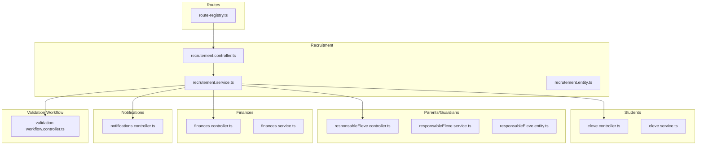
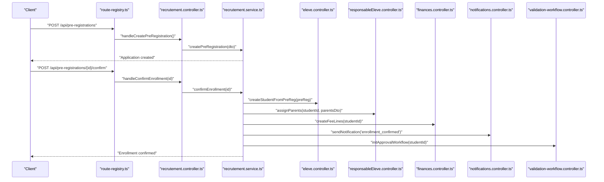
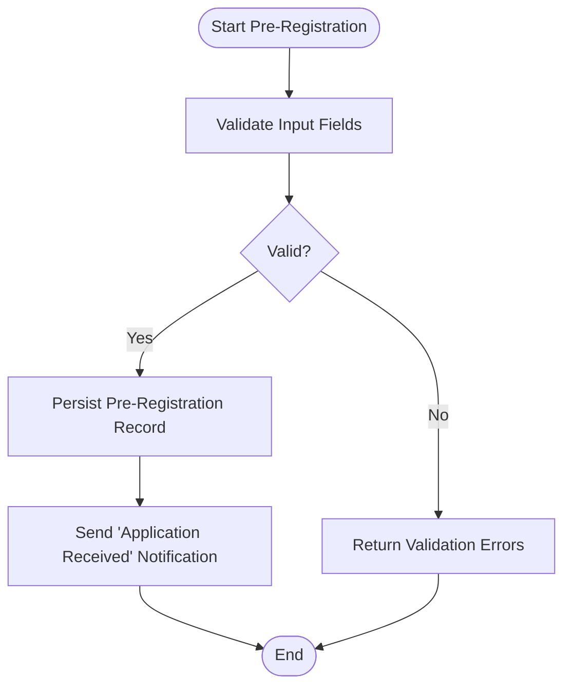
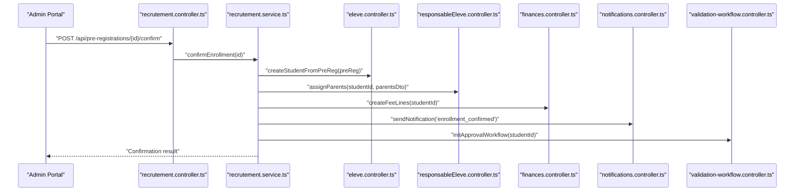
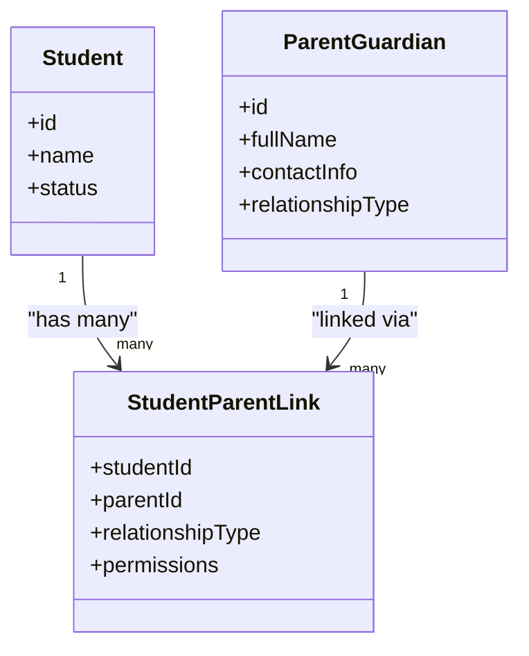
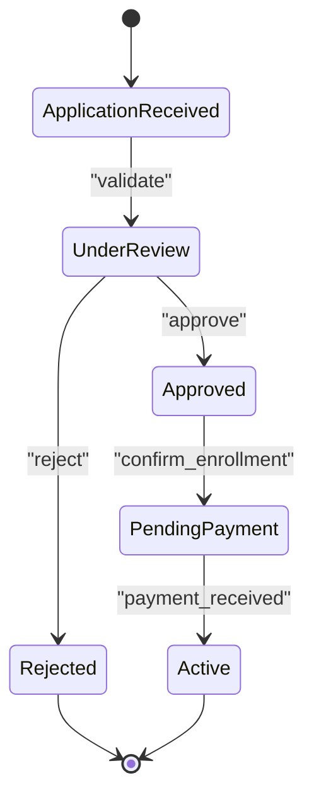
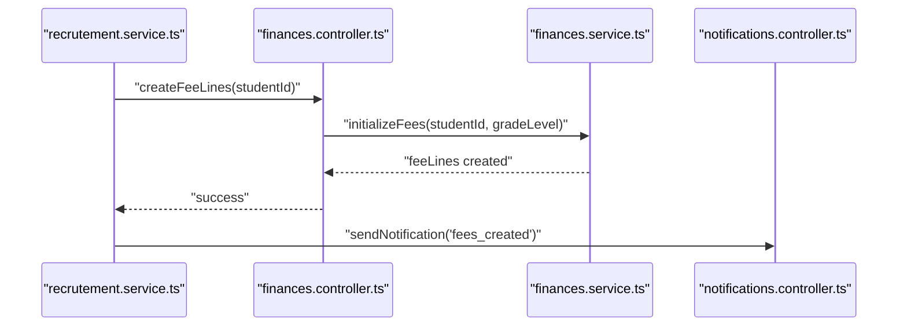
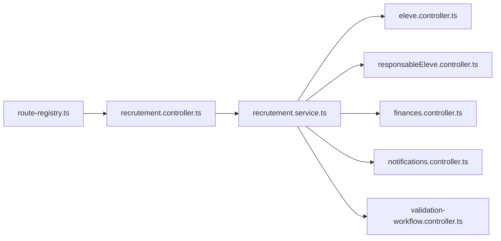

# Student Enrollment Workflow

<cite>
**Referenced Files in This Document**
- [051-champs-preinscription-enrichis.sql](file://backend/database/migrations/051-champs-preinscription-enrichis.sql)
- [052-approche-hybride-parents.sql](file://backend/database/migrations/052-approche-hybride-parents.sql)
- [049-ameliorations-inscription-finances.sql](file://backend/database/migrations/049-ameliorations-inscription-finances.sql)
- [050-ameliorations-inscription-relances.sql](file://backend/database/migrations/050-ameliorations-inscription-relances.sql)
- [recrutement.controller.ts](file://backend/src/modules/recrutement/controllers/recrutement.controller.ts)
- [recrutement.service.ts](file://backend/src/modules/recrutement/services/recrutement.service.ts)
- [recrutement.entity.ts](file://backend/src/modules/recrutement/entities/recrutement.entity.ts)
- [responsableEleve.controller.ts](file://backend/src/modules/responsables-eleves/controllers/responsableEleve.controller.ts)
- [responsableEleve.service.ts](file://backend/src/modules/responsables-eleves/services/responsableEleve.service.ts)
- [responsableEleve.entity.ts](file://backend/src/modules/responsables-eleves/entities/responsableEleve.entity.ts)
- [eleve.controller.ts](file://backend/src/modules/eleves/controllers/eleve.controller.ts)
- [eleve.service.ts](file://backend/src/modules/eleves/services/eleve.service.ts)
- [finances.controller.ts](file://backend/src/modules/finances/controllers/finances.controller.ts)
- [finances.service.ts](file://backend/src/modules/finances/services/finances.service.ts)
- [notifications.controller.ts](file://backend/src/modules/notifications/controllers/notifications.controller.ts)
- [validation-workflow.controller.ts](file://backend/src/modules/validation-workflow/controllers/validation-workflow.controller.ts)
- [route-registry.ts](file://backend/src/routes/route-registry.ts)
</cite>

## Table of Contents
1. [Introduction](#introduction)
2. [Project Structure](#project-structure)
3. [Core Components](#core-components)
4. [Architecture Overview](#architecture-overview)
5. [Detailed Component Analysis](#detailed-component-analysis)
6. [Dependency Analysis](#dependency-analysis)
7. [Performance Considerations](#performance-considerations)
8. [Troubleshooting Guide](#troubleshooting-guide)
9. [Conclusion](#conclusion)
10. [Appendices](#appendices)

## Introduction
This document describes the end-to-end Student Enrollment Workflow in eLISAschool, covering pre-registration with enriched fields and validation, registration confirmation including parent assignment and account creation, multi-parent support with relationship types, enrollment status management and approvals, notifications, payment integration for fees, and common scenarios such as transfers and re-enrollments. It provides API references, data validation rules, and diagrams to help both technical and non-technical users understand and implement the workflow.

## Project Structure
The enrollment workflow spans several modules:
- Recruitment (pre-registration and application lifecycle)
- Students (student records and enrollment state)
- Parents/Guardians (multi-parent relationships and roles)
- Finances (fees, payments, reminders)
- Notifications (alerts and messages)
- Validation Workflow (approvals and transitions)
- Routes (API exposure)

**Diagram sources**
- [route-registry.ts](file://backend/src/routes/route-registry.ts)
- [recrutement.controller.ts](file://backend/src/modules/recrutement/controllers/recrutement.controller.ts)
- [recrutement.service.ts](file://backend/src/modules/recrutement/services/recrutement.service.ts)
- [eleve.controller.ts](file://backend/src/modules/eleves/controllers/eleve.controller.ts)
- [responsableEleve.controller.ts](file://backend/src/modules/responsables-eleves/controllers/responsableEleve.controller.ts)
- [finances.controller.ts](file://backend/src/modules/finances/controllers/finances.controller.ts)
- [notifications.controller.ts](file://backend/src/modules/notifications/controllers/notifications.controller.ts)
- [validation-workflow.controller.ts](file://backend/src/modules/validation-workflow/controllers/validation-workflow.controller.ts)

**Section sources**
- [route-registry.ts](file://backend/src/routes/route-registry.ts)

## Core Components
- Pre-registration (Recruitment): Captures applicant details, supports enriched fields, validates inputs, and persists applications.
- Registration Confirmation: Converts a pre-registration into an enrolled student, assigns parents/guardians, creates user accounts if needed, and triggers notifications.
- Multi-Parent Support: Allows multiple guardians per student with distinct relationship types and permissions.
- Status Management and Approvals: Manages enrollment states and approval workflows via the validation module.
- Payment Integration: Creates fee lines and processes payments upon successful enrollment or per policy.
- Notifications: Sends alerts at key events (application received, approved, pending payment, etc.).

Key implementation references:
- Pre-registration entity and controller/service: [recrutement.entity.ts](file://backend/src/modules/recrutement/entities/recrutement.entity.ts), [recrutement.controller.ts](file://backend/src/modules/recrutement/controllers/recrutement.controller.ts), [recrutement.service.ts](file://backend/src/modules/recrutement/services/recrutement.service.ts)
- Parent-guardian relationships: [responsableEleve.entity.ts](file://backend/src/modules/responsables-eleves/entities/responsableEleve.entity.ts), [responsableEleve.controller.ts](file://backend/src/modules/responsables-eleves/controllers/responsableEleve.controller.ts), [responsableEleve.service.ts](file://backend/src/modules/responsables-eleves/services/responsableEleve.service.ts)
- Student enrollment: [eleve.controller.ts](file://backend/src/modules/eleves/controllers/eleve.controller.ts), [eleve.service.ts](file://backend/src/modules/eleves/services/eleve.service.ts)
- Payments and fees: [finances.controller.ts](file://backend/src/modules/finances/controllers/finances.controller.ts), [finances.service.ts](file://backend/src/modules/finances/services/finances.service.ts)
- Notifications: [notifications.controller.ts](file://backend/src/modules/notifications/controllers/notifications.controller.ts)
- Approval workflow: [validation-workflow.controller.ts](file://backend/src/modules/validation-workflow/controllers/validation-workflow.controller.ts)

**Section sources**
- [recrutement.entity.ts](file://backend/src/modules/recrutement/entities/recrutement.entity.ts)
- [recrutement.controller.ts](file://backend/src/modules/recrutement/controllers/recrutement.controller.ts)
- [recrutement.service.ts](file://backend/src/modules/recrutement/services/recrutement.service.ts)
- [responsableEleve.entity.ts](file://backend/src/modules/responsables-eleves/entities/responsableEleve.entity.ts)
- [responsableEleve.controller.ts](file://backend/src/modules/responsables-eleves/controllers/responsableEleve.controller.ts)
- [responsableEleve.service.ts](file://backend/src/modules/responsables-eleves/services/responsableEleve.service.ts)
- [eleve.controller.ts](file://backend/src/modules/eleves/controllers/eleve.controller.ts)
- [eleve.service.ts](file://backend/src/modules/eleves/services/eleve.service.ts)
- [finances.controller.ts](file://backend/src/modules/finances/controllers/finances.controller.ts)
- [finances.service.ts](file://backend/src/modules/finances/services/finances.service.ts)
- [notifications.controller.ts](file://backend/src/modules/notifications/controllers/notifications.controller.ts)
- [validation-workflow.controller.ts](file://backend/src/modules/validation-workflow/controllers/validation-workflow.controller.ts)

## Architecture Overview
The enrollment workflow is orchestrated by the recruitment service, which coordinates students, parents, finances, notifications, and approvals.

**Diagram sources**
- [route-registry.ts](file://backend/src/routes/route-registry.ts)
- [recrutement.controller.ts](file://backend/src/modules/recrutement/controllers/recrutement.controller.ts)
- [recrutement.service.ts](file://backend/src/modules/recrutement/services/recrutement.service.ts)
- [eleve.controller.ts](file://backend/src/modules/eleves/controllers/eleve.controller.ts)
- [responsableEleve.controller.ts](file://backend/src/modules/responsables-eleves/controllers/responsableEleve.controller.ts)
- [finances.controller.ts](file://backend/src/modules/finances/controllers/finances.controller.ts)
- [notifications.controller.ts](file://backend/src/modules/notifications/controllers/notifications.controller.ts)
- [validation-workflow.controller.ts](file://backend/src/modules/validation-workflow/controllers/validation-workflow.controller.ts)

## Detailed Component Analysis

### Pre-Registration Process
- Purpose: Collect applicant information with enriched fields, validate inputs, and persist a pre-registration record.
- Enriched Fields: Additional attributes beyond basic identity are supported via dedicated migrations that extend pre-registration fields.
- Validation Rules: Required fields include personal identifiers, contact info, academic preferences, and guardian details where applicable. Custom validations enforce format and business constraints.
- Data Collection: Supports attachments and optional medical or background information as configured.

Implementation references:
- Enriched pre-registration fields migration: [051-champs-preinscription-enrichis.sql](file://backend/database/migrations/051-champs-preinscription-enrichis.sql)
- Controller and service handling pre-registration endpoints: [recrutement.controller.ts](file://backend/src/modules/recrutement/controllers/recrutement.controller.ts), [recrutement.service.ts](file://backend/src/modules/recrutement/services/recrutement.service.ts)
- Entity model for pre-registration: [recrutement.entity.ts](file://backend/src/modules/recrutement/entities/recrutement.entity.ts)

**Diagram sources**
- [recrutement.controller.ts](file://backend/src/modules/recrutement/controllers/recrutement.controller.ts)
- [recrutement.service.ts](file://backend/src/modules/recrutement/services/recrutement.service.ts)
- [051-champs-preinscription-enrichis.sql](file://backend/database/migrations/051-champs-preinscription-enrichis.sql)

**Section sources**
- [051-champs-preinscription-enrichis.sql](file://backend/database/migrations/051-champs-preinscription-enrichis.sql)
- [recrutement.controller.ts](file://backend/src/modules/recrutement/controllers/recrutement.controller.ts)
- [recrutement.service.ts](file://backend/src/modules/recrutement/services/recrutement.service.ts)
- [recrutement.entity.ts](file://backend/src/modules/recrutement/entities/recrutement.entity.ts)

### Registration Confirmation Workflow
- Purpose: Convert a pre-registration into an active enrollment, assign parents/guardians, create user accounts if required, initialize fees, and trigger notifications and approvals.
- Parent Assignment: Uses the multi-parent system to link one or more guardians to the newly created student record.
- Account Creation: If not present, creates user accounts for parents/guardians and links them to the student.
- Fee Initialization: Creates fee lines based on school policies and grade level.
- Approval Initiation: Starts the validation workflow for final approval if configured.

Implementation references:
- Confirmation endpoint and orchestration: [recrutement.controller.ts](file://backend/src/modules/recrutement/controllers/recrutement.controller.ts), [recrutement.service.ts](file://backend/src/modules/recrutement/services/recrutement.service.ts)
- Student creation: [eleve.controller.ts](file://backend/src/modules/eleves/controllers/eleve.controller.ts), [eleve.service.ts](file://backend/src/modules/eleves/services/eleve.service.ts)
- Parent assignment: [responsableEleve.controller.ts](file://backend/src/modules/responsables-eleves/controllers/responsableEleve.controller.ts), [responsableEleve.service.ts](file://backend/src/modules/responsables-eleves/services/responsableEleve.service.ts)
- Fees creation: [finances.controller.ts](file://backend/src/modules/finances/controllers/finances.controller.ts), [finances.service.ts](file://backend/src/modules/finances/services/finances.service.ts)
- Notifications: [notifications.controller.ts](file://backend/src/modules/notifications/controllers/notifications.controller.ts)
- Approval workflow: [validation-workflow.controller.ts](file://backend/src/modules/validation-workflow/controllers/validation-workflow.controller.ts)

**Diagram sources**
- [recrutement.controller.ts](file://backend/src/modules/recrutement/controllers/recrutement.controller.ts)
- [recrutement.service.ts](file://backend/src/modules/recrutement/services/recrutement.service.ts)
- [eleve.controller.ts](file://backend/src/modules/eleves/controllers/eleve.controller.ts)
- [responsableEleve.controller.ts](file://backend/src/modules/responsables-eleves/controllers/responsableEleve.controller.ts)
- [finances.controller.ts](file://backend/src/modules/finances/controllers/finances.controller.ts)
- [notifications.controller.ts](file://backend/src/modules/notifications/controllers/notifications.controller.ts)
- [validation-workflow.controller.ts](file://backend/src/modules/validation-workflow/controllers/validation-workflow.controller.ts)

**Section sources**
- [recrutement.controller.ts](file://backend/src/modules/recrutement/controllers/recrutement.controller.ts)
- [recrutement.service.ts](file://backend/src/modules/recrutement/services/recrutement.service.ts)
- [eleve.controller.ts](file://backend/src/modules/eleves/controllers/eleve.controller.ts)
- [responsableEleve.controller.ts](file://backend/src/modules/responsables-eleves/controllers/responsableEleve.controller.ts)
- [finances.controller.ts](file://backend/src/modules/finances/controllers/finances.controller.ts)
- [notifications.controller.ts](file://backend/src/modules/notifications/controllers/notifications.controller.ts)
- [validation-workflow.controller.ts](file://backend/src/modules/validation-workflow/controllers/validation-workflow.controller.ts)

### Multi-Parent Support System
- Purpose: Allow multiple guardians per student with different relationship types and permissions.
- Relationship Types: Supports various relationships (e.g., mother, father, legal guardian, other).
- Permissions: Each parent can have specific access levels and responsibilities.
- Data Model: The hybrid approach migration introduces flexible linking between students and parents.

Implementation references:
- Hybrid multi-parent model migration: [052-approche-hybride-parents.sql](file://backend/database/migrations/052-approche-hybride-parents.sql)
- Parent-guardian entity and services: [responsableEleve.entity.ts](file://backend/src/modules/responsables-eleves/entities/responsableEleve.entity.ts), [responsableEleve.service.ts](file://backend/src/modules/responsables-eleves/services/responsableEleve.service.ts)
- Parent-guardian controller: [responsableEleve.controller.ts](file://backend/src/modules/responsables-eleves/controllers/responsableEleve.controller.ts)

**Diagram sources**
- [responsableEleve.entity.ts](file://backend/src/modules/responsables-eleves/entities/responsableEleve.entity.ts)
- [052-approche-hybride-parents.sql](file://backend/database/migrations/052-approche-hybride-parents.sql)

**Section sources**
- [052-approche-hybride-parents.sql](file://backend/database/migrations/052-approche-hybride-parents.sql)
- [responsableEleve.entity.ts](file://backend/src/modules/responsables-eleves/entities/responsableEleve.entity.ts)
- [responsableEleve.controller.ts](file://backend/src/modules/responsables-eleves/controllers/responsableEleve.controller.ts)
- [responsableEleve.service.ts](file://backend/src/modules/responsables-eleves/services/responsableEleve.service.ts)

### Enrollment Status Management and Approval Workflows
- Status Lifecycle: Tracks stages from application to enrollment, including pending, approved, rejected, and active.
- Approval Triggers: Certain actions initiate approval checks before finalizing enrollment.
- Workflow Control: The validation workflow module manages transitions and conditions.

Implementation references:
- Validation workflow controller: [validation-workflow.controller.ts](file://backend/src/modules/validation-workflow/controllers/validation-workflow.controller.ts)
- Recruitment service orchestrating transitions: [recrutement.service.ts](file://backend/src/modules/recrutement/services/recrutement.service.ts)

**Diagram sources**
- [validation-workflow.controller.ts](file://backend/src/modules/validation-workflow/controllers/validation-workflow.controller.ts)
- [recrutement.service.ts](file://backend/src/modules/recrutement/services/recrutement.service.ts)

**Section sources**
- [validation-workflow.controller.ts](file://backend/src/modules/validation-workflow/controllers/validation-workflow.controller.ts)
- [recrutement.service.ts](file://backend/src/modules/recrutement/services/recrutement.service.ts)

### Payment Integration for Fee Processing
- Purpose: Create fee lines upon enrollment confirmation and process payments according to school policies.
- Reminders: Automated follow-ups for unpaid fees.
- Migrations: Enhancements to enrollment finance features and reminders.

Implementation references:
- Finance enhancements and reminders: [049-ameliorations-inscription-finances.sql](file://backend/database/migrations/049-ameliorations-inscription-finances.sql), [050-ameliorations-inscription-relances.sql](file://backend/database/migrations/050-ameliorations-inscription-relances.sql)
- Finance controller and service: [finances.controller.ts](file://backend/src/modules/finances/controllers/finances.controller.ts), [finances.service.ts](file://backend/src/modules/finances/services/finances.service.ts)

**Diagram sources**
- [recrutement.service.ts](file://backend/src/modules/recrutement/services/recrutement.service.ts)
- [finances.controller.ts](file://backend/src/modules/finances/controllers/finances.controller.ts)
- [finances.service.ts](file://backend/src/modules/finances/services/finances.service.ts)
- [notifications.controller.ts](file://backend/src/modules/notifications/controllers/notifications.controller.ts)
- [049-ameliorations-inscription-finances.sql](file://backend/database/migrations/049-ameliorations-inscription-finances.sql)
- [050-ameliorations-inscription-relances.sql](file://backend/database/migrations/050-ameliorations-inscription-relances.sql)

**Section sources**
- [049-ameliorations-inscription-finances.sql](file://backend/database/migrations/049-ameliorations-inscription-finances.sql)
- [050-ameliorations-inscription-relances.sql](file://backend/database/migrations/050-ameliorations-inscription-relances.sql)
- [finances.controller.ts](file://backend/src/modules/finances/controllers/finances.controller.ts)
- [finances.service.ts](file://backend/src/modules/finances/services/finances.service.ts)

### Practical API Examples
- Pre-registration endpoints:
  - POST /api/pre-registrations: Create a new pre-registration with enriched fields and validation.
  - GET /api/pre-registrations/{id}: Retrieve pre-registration details.
  - PUT /api/pre-registrations/{id}: Update pre-registration data.
- Confirmation endpoints:
  - POST /api/pre-registrations/{id}/confirm: Confirm enrollment, assign parents, create fees, send notifications, and start approvals.
- Parent management endpoints:
  - POST /api/students/{studentId}/parents: Assign additional parents/guardians to a student.
  - PUT /api/students/{studentId}/parents/{parentId}: Update parent relationship type or permissions.
- Finance endpoints:
  - POST /api/students/{studentId}/fees: Initialize fee lines for a student.
  - POST /api/payments: Record a payment against student fees.
- Notifications endpoints:
  - POST /api/notifications/send: Trigger a notification event (used internally by services).
- Validation workflow endpoints:
  - POST /api/workflows/{entityId}/approve: Approve a pending workflow step.
  - POST /api/workflows/{entityId}/reject: Reject a pending workflow step.

Note: These examples reflect typical REST patterns used across modules; consult each controller for exact signatures and payloads.

**Section sources**
- [recrutement.controller.ts](file://backend/src/modules/recrutement/controllers/recrutement.controller.ts)
- [responsableEleve.controller.ts](file://backend/src/modules/responsables-eleves/controllers/responsableEleve.controller.ts)
- [finances.controller.ts](file://backend/src/modules/finances/controllers/finances.controller.ts)
- [notifications.controller.ts](file://backend/src/modules/notifications/controllers/notifications.controller.ts)
- [validation-workflow.controller.ts](file://backend/src/modules/validation-workflow/controllers/validation-workflow.controller.ts)

### Common Enrollment Scenarios
- Transfers:
  - Move an existing student to a new school year or section while preserving history.
  - Requires updating enrollment status and possibly re-initializing fees.
- Re-enrollments:
  - Reactivate a previously enrolled student who left mid-year.
  - May involve resetting certain statuses and recalculating fees.
- Special Cases:
  - Conditional enrollment pending documentation or health clearance.
  - Partial payments or installment plans configured via finance settings.

These scenarios are handled by combining recruitment confirmations, student updates, parent assignments, and finance operations through the same orchestration flow.

[No sources needed since this section doesn't analyze specific files]

## Dependency Analysis
The enrollment workflow depends on coordinated interactions among recruitment, students, parents, finances, notifications, and validation workflow modules.

**Diagram sources**
- [route-registry.ts](file://backend/src/routes/route-registry.ts)
- [recrutement.controller.ts](file://backend/src/modules/recrutement/controllers/recrutement.controller.ts)
- [recrutement.service.ts](file://backend/src/modules/recrutement/services/recrutement.service.ts)
- [eleve.controller.ts](file://backend/src/modules/eleves/controllers/eleve.controller.ts)
- [responsableEleve.controller.ts](file://backend/src/modules/responsables-eleves/controllers/responsableEleve.controller.ts)
- [finances.controller.ts](file://backend/src/modules/finances/controllers/finances.controller.ts)
- [notifications.controller.ts](file://backend/src/modules/notifications/controllers/notifications.controller.ts)
- [validation-workflow.controller.ts](file://backend/src/modules/validation-workflow/controllers/validation-workflow.controller.ts)

**Section sources**
- [route-registry.ts](file://backend/src/routes/route-registry.ts)
- [recrutement.controller.ts](file://backend/src/modules/recrutement/controllers/recrutement.controller.ts)
- [recrutement.service.ts](file://backend/src/modules/recrutement/services/recrutement.service.ts)
- [eleve.controller.ts](file://backend/src/modules/eleves/controllers/eleve.controller.ts)
- [responsableEleve.controller.ts](file://backend/src/modules/responsables-eleves/controllers/responsableEleve.controller.ts)
- [finances.controller.ts](file://backend/src/modules/finances/controllers/finances.controller.ts)
- [notifications.controller.ts](file://backend/src/modules/notifications/controllers/notifications.controller.ts)
- [validation-workflow.controller.ts](file://backend/src/modules/validation-workflow/controllers/validation-workflow.controller.ts)

## Performance Considerations
- Batch Operations: When assigning multiple parents or initializing multiple fee lines, prefer batch endpoints to reduce round trips.
- Indexing: Ensure database indexes exist on frequently queried fields (e.g., studentId, parentId, enrollmentStatus).
- Caching: Cache static configuration like fee templates and relationship types to minimize repeated lookups.
- Asynchronous Notifications: Offload notification sending to background jobs to avoid blocking enrollment confirmation.

[No sources needed since this section provides general guidance]

## Troubleshooting Guide
- Validation Failures:
  - Check input payloads against required fields and formats.
  - Review enrichment migrations for additional constraints.
- Parent Assignment Issues:
  - Verify relationship types and permissions are correctly set.
  - Ensure the hybrid parent model migration has been applied.
- Payment Problems:
  - Confirm fee lines were created and linked to the student.
  - Inspect reminder configurations and notification triggers.
- Approval Delays:
  - Validate workflow steps and conditions.
  - Ensure approvers have necessary permissions.

**Section sources**
- [051-champs-preinscription-enrichis.sql](file://backend/database/migrations/051-champs-preinscription-enrichis.sql)
- [052-approche-hybride-parents.sql](file://backend/database/migrations/052-approche-hybride-parents.sql)
- [049-ameliorations-inscription-finances.sql](file://backend/database/migrations/049-ameliorations-inscription-finances.sql)
- [050-ameliorations-inscription-relances.sql](file://backend/database/migrations/050-ameliorations-inscription-relances.sql)
- [recrutement.controller.ts](file://backend/src/modules/recrutement/controllers/recrutement.controller.ts)
- [responsableEleve.controller.ts](file://backend/src/modules/responsables-eleves/controllers/responsableEleve.controller.ts)
- [finances.controller.ts](file://backend/src/modules/finances/controllers/finances.controller.ts)
- [validation-workflow.controller.ts](file://backend/src/modules/validation-workflow/controllers/validation-workflow.controller.ts)

## Conclusion
The Student Enrollment Workflow integrates pre-registration, confirmation, multi-parent support, status management, approvals, notifications, and payments into a cohesive pipeline. By leveraging the recruitment service as the orchestrator and coordinating with students, parents, finances, notifications, and validation workflow modules, the system ensures robust and configurable enrollment processes suitable for diverse school contexts.

[No sources needed since this section summarizes without analyzing specific files]

## Appendices
- Migration References:
  - Enriched pre-registration fields: [051-champs-preinscription-enrichis.sql](file://backend/database/migrations/051-champs-preinscription-enrichis.sql)
  - Hybrid multi-parent model: [052-approche-hybride-parents.sql](file://backend/database/migrations/052-approche-hybride-parents.sql)
  - Finance enhancements and reminders: [049-ameliorations-inscription-finances.sql](file://backend/database/migrations/049-ameliorations-inscription-finances.sql), [050-ameliorations-inscription-relances.sql](file://backend/database/migrations/050-ameliorations-inscription-relances.sql)

**Section sources**
- [051-champs-preinscription-enrichis.sql](file://backend/database/migrations/051-champs-preinscription-enrichis.sql)
- [052-approche-hybride-parents.sql](file://backend/database/migrations/052-approche-hybride-parents.sql)
- [049-ameliorations-inscription-finances.sql](file://backend/database/migrations/049-ameliorations-inscription-finances.sql)
- [050-ameliorations-inscription-relances.sql](file://backend/database/migrations/050-ameliorations-inscription-relances.sql)