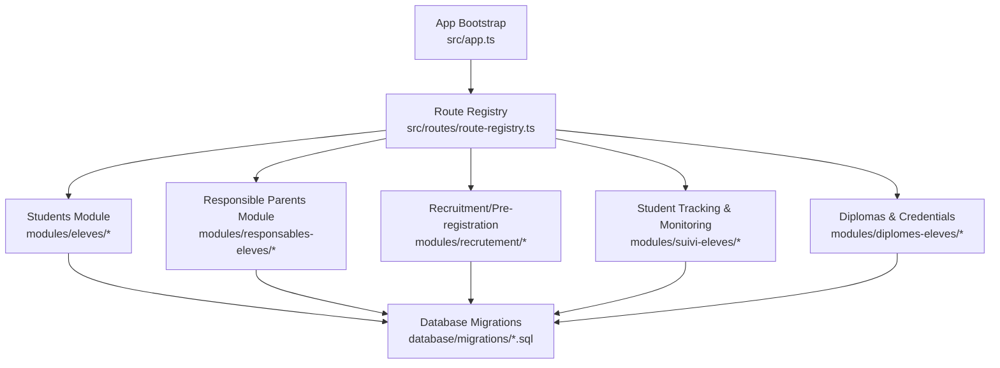
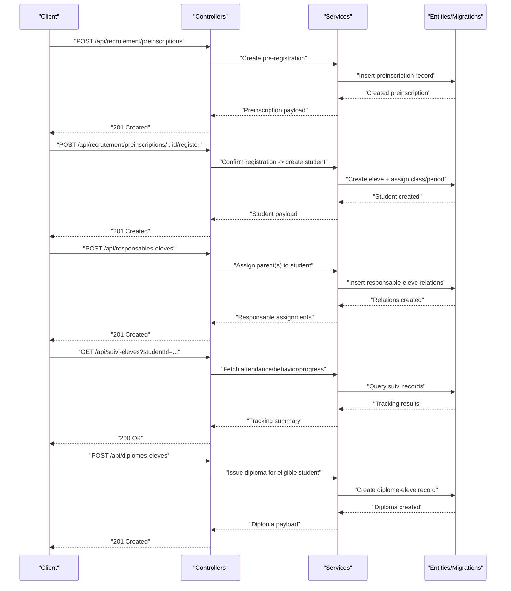
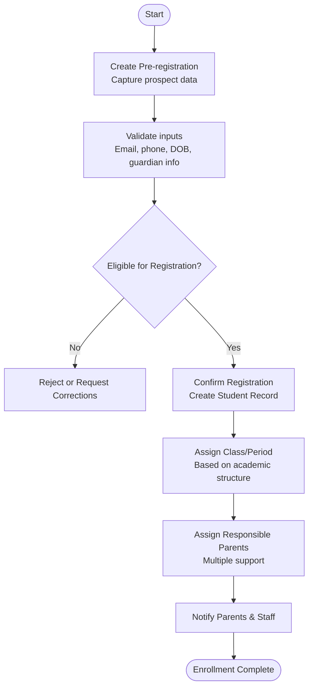
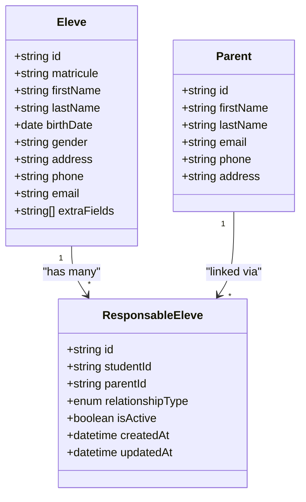
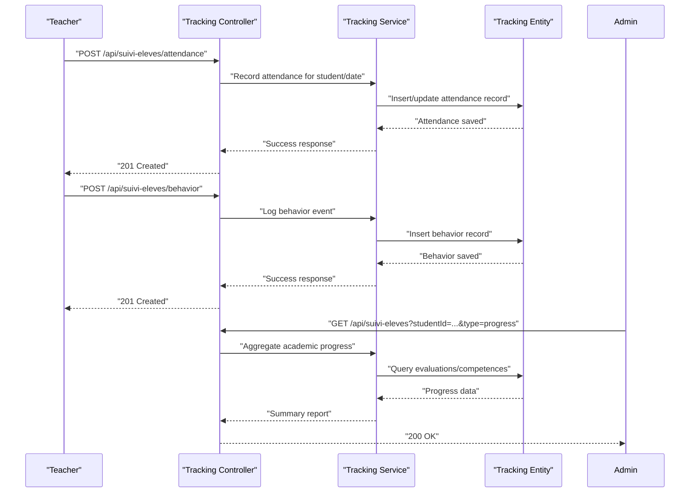
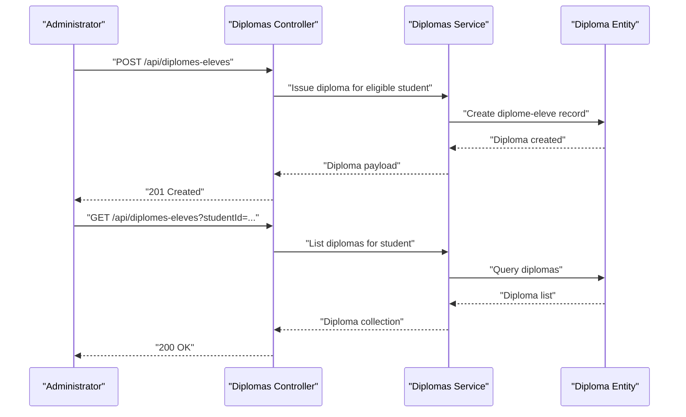
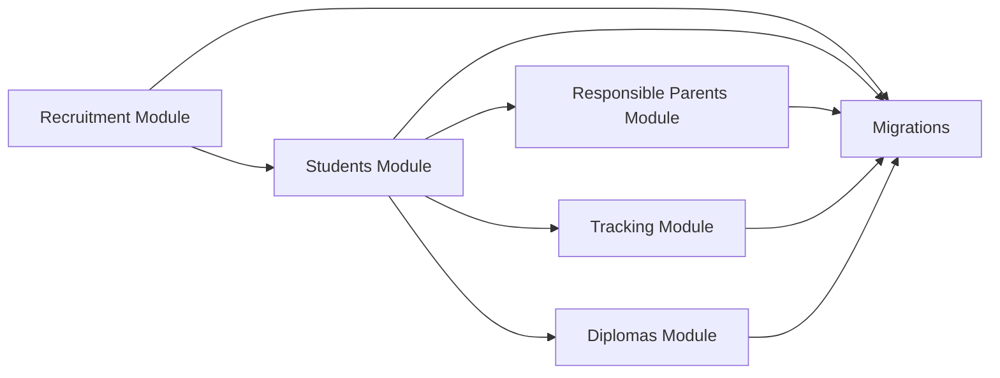

# Student Information System

<cite>
**Referenced Files in This Document**
- [app.ts](file://backend/src/app.ts)
- [index.ts](file://backend/src/index.ts)
- [route-registry.ts](file://backend/src/routes/route-registry.ts)
- [eleves.controller.ts](file://backend/src/modules/eleves/controllers/eleves.controller.ts)
- [eleves.service.ts](file://backend/src/modules/eleves/services/eleves.service.ts)
- [eleves.entity.ts](file://backend/src/modules/eleves/entities/eleves.entity.ts)
- [responsables-eleves.controller.ts](file://backend/src/modules/responsables-eleves/controllers/responsables-eleves.controller.ts)
- [responsables-eleves.service.ts](file://backend/src/modules/responsables-eleves/services/responsables-eleves.service.ts)
- [responsable-eleve.entity.ts](file://backend/src/modules/responsables-eleves/entities/responsable-eleve.entity.ts)
- [diplomes-eleves.controller.ts](file://backend/src/modules/diplomes-eleves/controllers/diplomes-eleves.controller.ts)
- [diplomes-eleves.service.ts](file://backend/src/modules/diplomes-eleves/services/diplomes-eleves.service.ts)
- [diplome-eleve.entity.ts](file://backend/src/modules/diplomes-eleves/entities/diplome-eleve.entity.ts)
- [suivi-eleves.controller.ts](file://backend/src/modules/suivi-eleves/controllers/suivi-eleves.controller.ts)
- [suivi-eleves.service.ts](file://backend/src/modules/suivi-eleves/services/suivi-eleves.service.ts)
- [suivi-eleve.entity.ts](file://backend/src/modules/suivi-eleves/entities/suivi-eleve.entity.ts)
- [recrutement.controller.ts](file://backend/src/modules/recrutement/controllers/recrutement.controller.ts)
- [recrutement.service.ts](file://backend/src/modules/recrutement/services/recrutement.service.ts)
- [preinscription.entity.ts](file://backend/src/modules/recrutement/entities/preinscription.entity.ts)
- [051-champs-preinscription-enrichis.sql](file://backend/database/migrations/051-champs-preinscription-enrichis.sql)
- [052-approche-hybride-parents.sql](file://backend/database/migrations/052-approche-hybride-parents.sql)
- [030-suivi-eleves.sql](file://backend/database/migrations/030-suivi-eleves.sql)
- [045-module-recrutement.sql](file://backend/database/migrations/045-module-recrutement.sql)
- [024-eleve-champs-additionnels.sql](file://backend/database/migrations/024-eleve-champs-additionnels.sql)
- [025-responsable-champs-additionnels.sql](file://backend/database/migrations/025-responsable-champs-additionnels.sql)
</cite>

## Table of Contents
1. [Introduction](#introduction)
2. [Project Structure](#project-structure)
3. [Core Components](#core-components)
4. [Architecture Overview](#architecture-overview)
5. [Detailed Component Analysis](#detailed-component-analysis)
6. [Dependency Analysis](#dependency-analysis)
7. [Performance Considerations](#performance-considerations)
8. [Troubleshooting Guide](#troubleshooting-guide)
9. [Conclusion](#conclusion)
10. [Appendices](#appendices)

## Introduction
This document explains the eLISAschool Student Information System with a focus on the end-to-end student lifecycle: enrollment, profile management, responsible parents, tracking and monitoring, and diploma issuance. It describes how data flows across modules, the validation rules applied during key operations, and integration patterns with academic modules such as classes, subjects, evaluations, and scheduling. The goal is to provide both technical and operational clarity for administrators, developers, and school staff.

## Project Structure
The backend organizes functionality by feature modules under src/modules. Each module typically includes controllers (HTTP endpoints), services (business logic), entities (data models), and DTOs/validation schemas. Routes are registered centrally. Database schema changes are managed via migrations.

**Diagram sources**
- [app.ts](file://backend/src/app.ts)
- [route-registry.ts](file://backend/src/routes/route-registry.ts)
- [eleves.controller.ts](file://backend/src/modules/eleves/controllers/eleves.controller.ts)
- [responsables-eleves.controller.ts](file://backend/src/modules/responsables-eleves/controllers/responsables-eleves.controller.ts)
- [recrutement.controller.ts](file://backend/src/modules/recrutement/controllers/recrutement.controller.ts)
- [suivi-eleves.controller.ts](file://backend/src/modules/suivi-eleves/controllers/suivi-eleves.controller.ts)
- [diplomes-eleves.controller.ts](file://backend/src/modules/diplomes-eleves/controllers/diplomes-eleves.controller.ts)
- [051-champs-preinscription-enrichis.sql](file://backend/database/migrations/051-champs-preinscription-enrichis.sql)
- [052-approche-hybride-parents.sql](file://backend/database/migrations/052-approche-hybride-parents.sql)
- [030-suivi-eleves.sql](file://backend/database/migrations/030-suivi-eleves.sql)
- [045-module-recrutement.sql](file://backend/database/migrations/045-module-recrutement.sql)
- [024-eleve-champs-additionnels.sql](file://backend/database/migrations/024-eleve-champs-additionnels.sql)
- [025-responsable-champs-additionnels.sql](file://backend/database/migrations/025-responsable-champs-additionnels.sql)

**Section sources**
- [app.ts](file://backend/src/app.ts)
- [index.ts](file://backend/src/index.ts)
- [route-registry.ts](file://backend/src/routes/route-registry.ts)

## Core Components
- Students (eleves): Central entity representing enrolled students; supports additional fields and relationships to classes, periods, and other academic structures.
- Responsible Parents (responsables-eleves): Manages one or more legal guardians per student with relationship types and permissions.
- Recruitment (recrutement): Pre-registration workflow capturing prospective student data and transitioning to formal enrollment.
- Student Tracking (suivi-eleves): Attendance, behavior, and academic progress records over time.
- Diplomas (diplomes-eleves): Issuance and storage of graduation certificates and academic credentials.

Key responsibilities:
- Controllers expose REST endpoints for CRUD and workflow actions.
- Services implement business rules, validations, and orchestrate cross-module interactions.
- Entities define database schema and constraints.
- Migrations evolve the schema safely over time.

**Section sources**
- [eleves.controller.ts](file://backend/src/modules/eleves/controllers/eleves.controller.ts)
- [eleves.service.ts](file://backend/src/modules/eleves/services/eleves.service.ts)
- [eleves.entity.ts](file://backend/src/modules/eleves/entities/eleves.entity.ts)
- [responsables-eleves.controller.ts](file://backend/src/modules/responsables-eleves/controllers/responsables-eleves.controller.ts)
- [responsables-eleves.service.ts](file://backend/src/modules/responsables-eleves/services/responsables-eleves.service.ts)
- [responsable-eleve.entity.ts](file://backend/src/modules/responsables-eleves/entities/responsable-eleve.entity.ts)
- [recrutement.controller.ts](file://backend/src/modules/recrutement/controllers/recrutement.controller.ts)
- [recrutement.service.ts](file://backend/src/modules/recrutement/services/recrutement.service.ts)
- [preinscription.entity.ts](file://backend/src/modules/recrutement/entities/preinscription.entity.ts)
- [suivi-eleves.controller.ts](file://backend/src/modules/suivi-eleves/controllers/suivi-eleves.controller.ts)
- [suivi-eleves.service.ts](file://backend/src/modules/suivi-eleves/services/suivi-eleves.service.ts)
- [suivi-eleve.entity.ts](file://backend/src/modules/suivi-eleves/entities/suivi-eleve.entity.ts)
- [diplomes-eleves.controller.ts](file://backend/src/modules/diplomes-eleves/controllers/diplomes-eleves.controller.ts)
- [diplomes-eleves.service.ts](file://backend/src/modules/diplomes-eleves/services/diplomes-eleves.service.ts)
- [diplome-eleve.entity.ts](file://backend/src/modules/diplomes-eleves/entities/diplome-eleve.entity.ts)

## Architecture Overview
The system follows a modular architecture where each domain area is encapsulated in its own module. Controllers handle HTTP requests, delegate to services for business logic, and persist data through TypeORM entities backed by PostgreSQL. Migrations manage schema evolution. Cross-module integrations occur via service calls and shared references (e.g., studentId).

**Diagram sources**
- [recrutement.controller.ts](file://backend/src/modules/recrutement/controllers/recrutement.controller.ts)
- [recrutement.service.ts](file://backend/src/modules/recrutement/services/recrutement.service.ts)
- [preinscription.entity.ts](file://backend/src/modules/recrutement/entities/preinscription.entity.ts)
- [eleves.controller.ts](file://backend/src/modules/eleves/controllers/eleves.controller.ts)
- [eleves.service.ts](file://backend/src/modules/eleves/services/eleves.service.ts)
- [eleves.entity.ts](file://backend/src/modules/eleves/entities/eleves.entity.ts)
- [responsables-eleves.controller.ts](file://backend/src/modules/responsables-eleves/controllers/responsables-eleves.controller.ts)
- [responsables-eleves.service.ts](file://backend/src/modules/responsables-eleves/services/responsables-eleves.service.ts)
- [responsable-eleve.entity.ts](file://backend/src/modules/responsables-eleves/entities/responsable-eleve.entity.ts)
- [suivi-eleves.controller.ts](file://backend/src/modules/suivi-eleves/controllers/suivi-eleves.controller.ts)
- [suivi-eleves.service.ts](file://backend/src/modules/suivi-eleves/services/suivi-eleves.service.ts)
- [suivi-eleve.entity.ts](file://backend/src/modules/suivi-eleves/entities/suivi-eleve.entity.ts)
- [diplomes-eleves.controller.ts](file://backend/src/modules/diplomes-eleves/controllers/diplomes-eleves.controller.ts)
- [diplomes-eleves.service.ts](file://backend/src/modules/diplomes-eleves/services/diplomes-eleves.service.ts)
- [diplome-eleve.entity.ts](file://backend/src/modules/diplomes-eleves/entities/diplome-eleve.entity.ts)

## Detailed Component Analysis

### Student Profile Management
Covers personal information, academic history, and family relationships.

- Personal Information: Stored in the student entity with additional fields enabled via migration. Includes identifiers, demographics, contact details, and optional custom attributes.
- Academic History: Linked to classes, periods, and evaluation outcomes. Enrollment transitions from recruitment to active student status.
- Family Relationships: Managed via the responsible parents module, supporting multiple parents per student with typed relationships.

Operational highlights:
- Create/Update student profiles with validation for required fields and referential integrity.
- Enroll students into classes and periods based on academic structure configuration.
- Query comprehensive student profiles including linked parents and academic records.

Practical examples:
- Retrieve a student’s full profile with parents and current class assignment.
- Update student personal details while preserving audit timestamps.
- Validate email and phone formats before persistence.

Validation rules:
- Required fields enforced at controller/service layer and database constraints.
- Unique constraints on matricule/student ID within an establishment context.
- Date-of-birth and age calculations validated against policy.

Integration patterns:
- Links to classes and periods for academic context.
- Triggers notifications to assigned parents upon profile updates.
- Feeds analytics dashboards for enrollment and retention metrics.

**Section sources**
- [eleves.controller.ts](file://backend/src/modules/eleves/controllers/eleves.controller.ts)
- [eleves.service.ts](file://backend/src/modules/eleves/services/eleves.service.ts)
- [eleves.entity.ts](file://backend/src/modules/eleves/entities/eleves.entity.ts)
- [024-eleve-champs-additionnels.sql](file://backend/database/migrations/024-eleve-champs-additionnels.sql)

### Enrollment Workflow
End-to-end process from pre-registration to confirmation and parent assignment.

**Diagram sources**
- [recrutement.controller.ts](file://backend/src/modules/recrutement/controllers/recrutement.controller.ts)
- [recrutement.service.ts](file://backend/src/modules/recrutement/services/recrutement.service.ts)
- [preinscription.entity.ts](file://backend/src/modules/recrutement/entities/preinscription.entity.ts)
- [eleves.controller.ts](file://backend/src/modules/eleves/controllers/eleves.controller.ts)
- [eleves.service.ts](file://backend/src/modules/eleves/services/eleves.service.ts)
- [eleves.entity.ts](file://backend/src/modules/eleves/entities/eleves.entity.ts)
- [responsables-eleves.controller.ts](file://backend/src/modules/responsables-eleves/controllers/responsables-eleves.controller.ts)
- [responsables-eleves.service.ts](file://backend/src/modules/responsables-eleves/services/responsables-eleves.service.ts)
- [responsable-eleve.entity.ts](file://backend/src/modules/responsables-eleves/entities/responsable-eleve.entity.ts)
- [051-champs-preinscription-enrichis.sql](file://backend/database/migrations/051-champs-preinscription-enrichis.sql)
- [052-approche-hybride-parents.sql](file://backend/database/migrations/052-approche-hybride-parents.sql)
- [045-module-recrutement.sql](file://backend/database/migrations/045-module-recrutement.sql)

Key steps:
- Pre-registration captures prospect details and initial guardian information.
- Validation ensures completeness and correctness before proceeding.
- Confirmation creates the official student record and assigns academic placement.
- Parent assignment links one or more responsible parties to the student.
- Notifications inform stakeholders of enrollment completion.

Validation rules:
- Email format and uniqueness checks.
- Phone number normalization and country code validation.
- Age eligibility based on grade level policies.
- Duplicate pre-registration prevention.

Integration patterns:
- Academic structure lookup for valid class/period combinations.
- Financial module integration for fee obligations at enrollment.
- Messaging module for automated notifications.

**Section sources**
- [recrutement.controller.ts](file://backend/src/modules/recrutement/controllers/recrutement.controller.ts)
- [recrutement.service.ts](file://backend/src/modules/recrutement/services/recrutement.service.ts)
- [preinscription.entity.ts](file://backend/src/modules/recrutement/entities/preinscription.entity.ts)
- [051-champs-preinscription-enrichis.sql](file://backend/database/migrations/051-champs-preinscription-enrichis.sql)
- [045-module-recrutement.sql](file://backend/database/migrations/045-module-recrutement.sql)

### Responsible Parents System
Supports multiple parents per student with typed relationships and permissions.

**Diagram sources**
- [eleves.entity.ts](file://backend/src/modules/eleves/entities/eleves.entity.ts)
- [responsable-eleve.entity.ts](file://backend/src/modules/responsables-eleves/entities/responsable-eleve.entity.ts)
- [responsables-eleves.controller.ts](file://backend/src/modules/responsables-eleves/controllers/responsables-eleves.controller.ts)
- [responsables-eleves.service.ts](file://backend/src/modules/responsables-eleves/services/responsables-eleves.service.ts)
- [025-responsable-champs-additionnels.sql](file://backend/database/migrations/025-responsable-champs-additionnels.sql)
- [052-approche-hybride-parents.sql](file://backend/database/migrations/052-approche-hybride-parents.sql)

Features:
- Multiple parents per student with relationship types (e.g., mother, father, guardian).
- Active/inactive status for managing current vs historical relationships.
- Additional fields for extended parent attributes.

Operational highlights:
- Add/remove parents and update relationship types.
- Query all parents for a given student.
- Enforce permission scoping so only authorized users can modify parent assignments.

Validation rules:
- Relationship type must be from allowed enum values.
- Parent identity uniqueness per student constraint.
- Contact information format validation.

Integration patterns:
- Notification triggers when parents are added or updated.
- Access control integrates with RBAC to restrict sensitive operations.
- Reporting uses parent-student mappings for communication campaigns.

**Section sources**
- [responsables-eleves.controller.ts](file://backend/src/modules/responsables-eleves/controllers/responsables-eleves.controller.ts)
- [responsables-eleves.service.ts](file://backend/src/modules/responsables-eleves/services/responsables-eleves.service.ts)
- [responsable-eleve.entity.ts](file://backend/src/modules/responsables-eleves/entities/responsable-eleve.entity.ts)
- [025-responsable-champs-additionnels.sql](file://backend/database/migrations/025-responsable-champs-additionnels.sql)
- [052-approche-hybride-parents.sql](file://backend/database/migrations/052-approche-hybride-parents.sql)

### Student Tracking and Monitoring
Tracks attendance, behavior, and academic progress over time.

**Diagram sources**
- [suivi-eleves.controller.ts](file://backend/src/modules/suivi-eleves/controllers/suivi-eleves.controller.ts)
- [suivi-eleves.service.ts](file://backend/src/modules/suivi-eleves/services/suivi-eleves.service.ts)
- [suivi-eleve.entity.ts](file://backend/src/modules/suivi-eleves/entities/suivi-eleve.entity.ts)
- [030-suivi-eleves.sql](file://backend/database/migrations/030-suivi-eleves.sql)

Capabilities:
- Attendance logging with daily granularity and reason codes.
- Behavior events categorized by type and severity.
- Academic progress aggregation across evaluations and competencies.

Validation rules:
- Attendance dates must fall within active period boundaries.
- Behavior types restricted to predefined categories.
- Progress entries require valid evaluation references.

Integration patterns:
- Links to classes and periods for contextual reporting.
- Feeds dashboards for early intervention and performance insights.
- Notifies parents for significant behavior or attendance anomalies.

**Section sources**
- [suivi-eleves.controller.ts](file://backend/src/modules/suivi-eleves/controllers/suivi-eleves.controller.ts)
- [suivi-eleves.service.ts](file://backend/src/modules/suivi-eleves/services/suivi-eleves.service.ts)
- [suivi-eleve.entity.ts](file://backend/src/modules/suivi-eleves/entities/suivi-eleve.entity.ts)
- [030-suivi-eleves.sql](file://backend/database/migrations/030-suivi-eleves.sql)

### Diploma Management
Handles issuance of graduation certificates and academic credentials.

**Diagram sources**
- [diplomes-eleves.controller.ts](file://backend/src/modules/diplomes-eleves/controllers/diplomes-eleves.controller.ts)
- [diplomes-eleves.service.ts](file://backend/src/modules/diplomes-eleves/services/diplomes-eleves.service.ts)
- [diplome-eleve.entity.ts](file://backend/src/modules/diplomes-eleves/entities/diplome-eleve.entity.ts)

Features:
- Create diplomas for students meeting graduation criteria.
- Store credential metadata and issue timestamps.
- Retrieve diplomas by student or batch export.

Validation rules:
- Eligibility checks against completed requirements and academic standing.
- Uniqueness constraints per diploma type and year.
- Referential integrity with student and academic period.

Integration patterns:
- Uses academic structure to verify completion of cycles/levels.
- Integrates with printing templates for certificate generation.
- Audits issuance for compliance and reporting.

**Section sources**
- [diplomes-eleves.controller.ts](file://backend/src/modules/diplomes-eleves/controllers/diplomes-eleves.controller.ts)
- [diplomes-eleves.service.ts](file://backend/src/modules/diplomes-eleves/services/diplomes-eleves.service.ts)
- [diplome-eleve.entity.ts](file://backend/src/modules/diplomes-eleves/entities/diplome-eleve.entity.ts)

## Dependency Analysis
Module dependencies and relationships:

**Diagram sources**
- [recrutement.controller.ts](file://backend/src/modules/recrutement/controllers/recrutement.controller.ts)
- [eleves.controller.ts](file://backend/src/modules/eleves/controllers/eleves.controller.ts)
- [responsables-eleves.controller.ts](file://backend/src/modules/responsables-eleves/controllers/responsables-eleves.controller.ts)
- [suivi-eleves.controller.ts](file://backend/src/modules/suivi-eleves/controllers/suivi-eleves.controller.ts)
- [diplomes-eleves.controller.ts](file://backend/src/modules/diplomes-eleves/controllers/diplomes-eleves.controller.ts)
- [051-champs-preinscription-enrichis.sql](file://backend/database/migrations/051-champs-preinscription-enrichis.sql)
- [052-approche-hybride-parents.sql](file://backend/database/migrations/052-approche-hybride-parents.sql)
- [030-suivi-eleves.sql](file://backend/database/migrations/030-suivi-eleves.sql)
- [045-module-recrutement.sql](file://backend/database/migrations/045-module-recrutement.sql)
- [024-eleve-champs-additionnels.sql](file://backend/database/migrations/024-eleve-champs-additionnels.sql)
- [025-responsable-champs-additionnels.sql](file://backend/database/migrations/025-responsable-champs-additionnels.sql)

Observations:
- Recruitment depends on Students to transition prospects to enrolled students.
- Students depend on Responsible Parents for family linkage.
- Tracking and Diplomas depend on Students for context and eligibility.
- All modules rely on migrations for schema consistency.

**Section sources**
- [route-registry.ts](file://backend/src/routes/route-registry.ts)
- [051-champs-preinscription-enrichis.sql](file://backend/database/migrations/051-champs-preinscription-enrichis.sql)
- [052-approche-hybride-parents.sql](file://backend/database/migrations/052-approche-hybride-parents.sql)
- [030-suivi-eleves.sql](file://backend/database/migrations/030-suivi-eleves.sql)
- [045-module-recrutement.sql](file://backend/database/migrations/045-module-recrutement.sql)
- [024-eleve-champs-additionnels.sql](file://backend/database/migrations/024-eleve-champs-additionnels.sql)
- [025-responsable-champs-additionnels.sql](file://backend/database/migrations/025-responsable-champs-additionnels.sql)

## Performance Considerations
- Indexing strategies: Ensure indexes on frequently queried columns such as studentId, matricule, date fields, and foreign keys used in joins.
- Pagination: Apply server-side pagination for large lists (students, tracking records, diplomas).
- Caching: Cache static lookups (classes, periods, relationship types) to reduce database load.
- Batch operations: Use batch inserts/updates for bulk enrollment and tracking imports.
- Query optimization: Avoid N+1 queries by using eager loading or explicit joins in services.

[No sources needed since this section provides general guidance]

## Troubleshooting Guide
Common issues and resolutions:
- Enrollment failures due to invalid class/period combinations: Verify academic structure configuration and ensure valid references exist.
- Parent assignment conflicts: Check for duplicate parent-student relationships and enforce unique constraints.
- Tracking entry errors: Confirm that attendance dates fall within active periods and behavior types are valid.
- Diploma issuance rejections: Validate graduation eligibility criteria and ensure all required academic milestones are met.

Debugging tips:
- Inspect controller logs for request payloads and error responses.
- Review service-layer validations and exception messages.
- Use database query logs to identify slow or failing queries.
- Validate migration state and schema consistency.

**Section sources**
- [eleves.service.ts](file://backend/src/modules/eleves/services/eleves.service.ts)
- [responsables-eleves.service.ts](file://backend/src/modules/responsables-eleves/services/responsables-eleves.service.ts)
- [suivi-eleves.service.ts](file://backend/src/modules/suivi-eleves/services/suivi-eleves.service.ts)
- [diplomes-eleves.service.ts](file://backend/src/modules/diplomes-eleves/services/diplomes-eleves.service.ts)

## Conclusion
The eLISAschool Student Information System provides a robust, modular foundation for managing the complete student lifecycle. From pre-registration to graduation, it enforces strong validation, supports multiple responsible parents, tracks student progress, and manages diplomas. Its architecture promotes clear separation of concerns, maintainability, and extensibility for future enhancements.

[No sources needed since this section summarizes without analyzing specific files]

## Appendices

### Practical Examples of Student Data Operations
- Create a new pre-registration with enriched fields and validate contact information.
- Confirm registration to create a student and assign them to a class and period.
- Add multiple responsible parents with distinct relationship types.
- Log daily attendance and behavior events for a student.
- Issue a diploma once graduation criteria are satisfied.

These operations map to controller endpoints and service methods referenced above.

**Section sources**
- [recrutement.controller.ts](file://backend/src/modules/recrutement/controllers/recrutement.controller.ts)
- [recrutement.service.ts](file://backend/src/modules/recrutement/services/recrutement.service.ts)
- [eleves.controller.ts](file://backend/src/modules/eleves/controllers/eleves.controller.ts)
- [eleves.service.ts](file://backend/src/modules/eleves/services/eleves.service.ts)
- [responsables-eleves.controller.ts](file://backend/src/modules/responsables-eleves/controllers/responsables-eleves.controller.ts)
- [responsables-eleves.service.ts](file://backend/src/modules/responsables-eleves/services/responsables-eleves.service.ts)
- [suivi-eleves.controller.ts](file://backend/src/modules/suivi-eleves/controllers/suivi-eleves.controller.ts)
- [suivi-eleves.service.ts](file://backend/src/modules/suivi-eleves/services/suivi-eleves.service.ts)
- [diplomes-eleves.controller.ts](file://backend/src/modules/diplomes-eleves/controllers/diplomes-eleves.controller.ts)
- [diplomes-eleves.service.ts](file://backend/src/modules/diplomes-eleves/services/diplomes-eleves.service.ts)