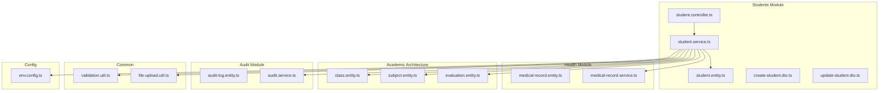
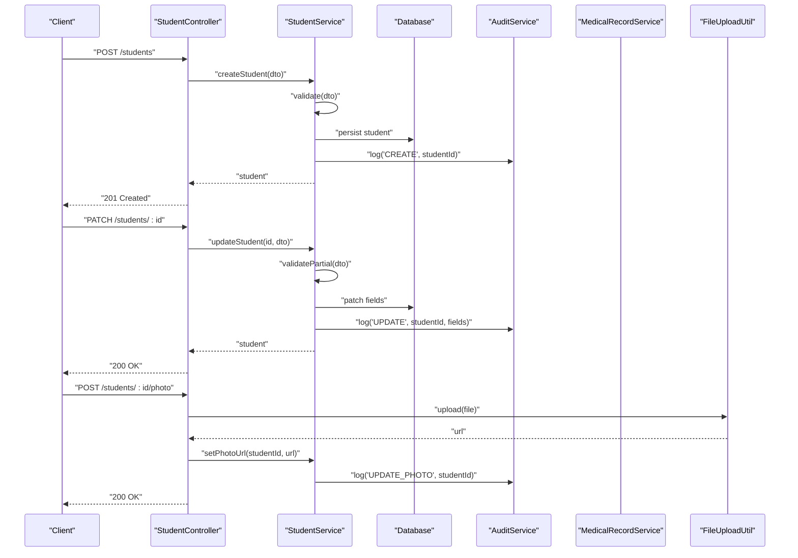
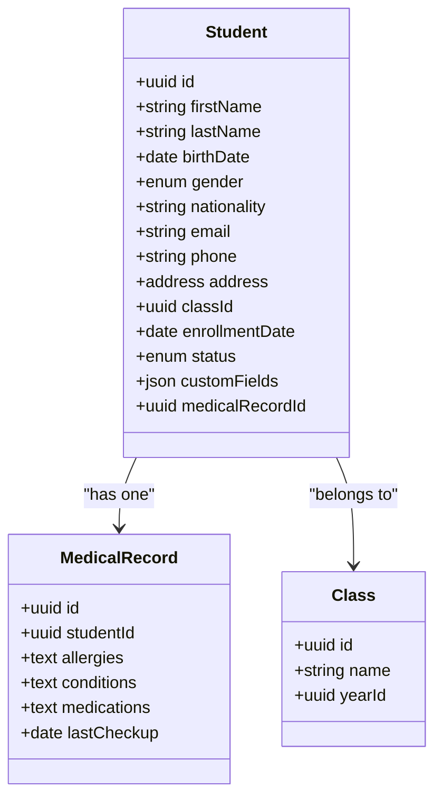
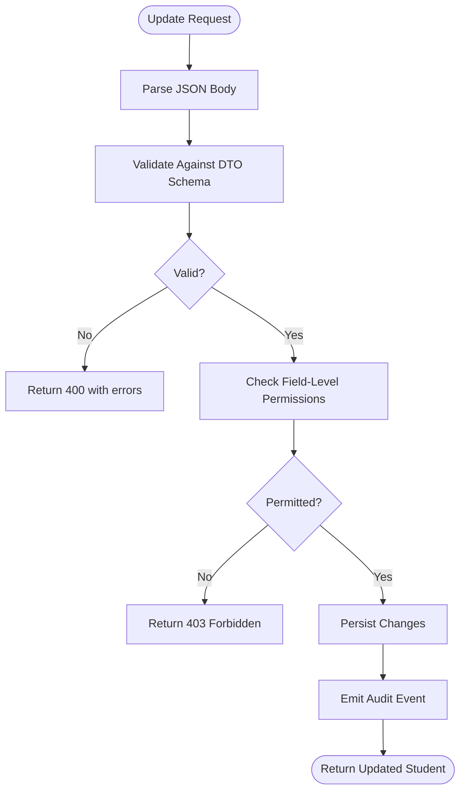
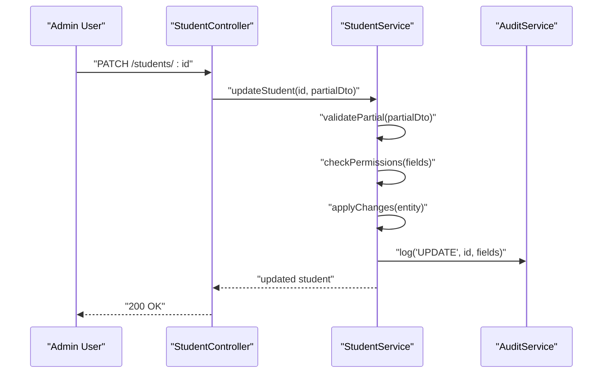
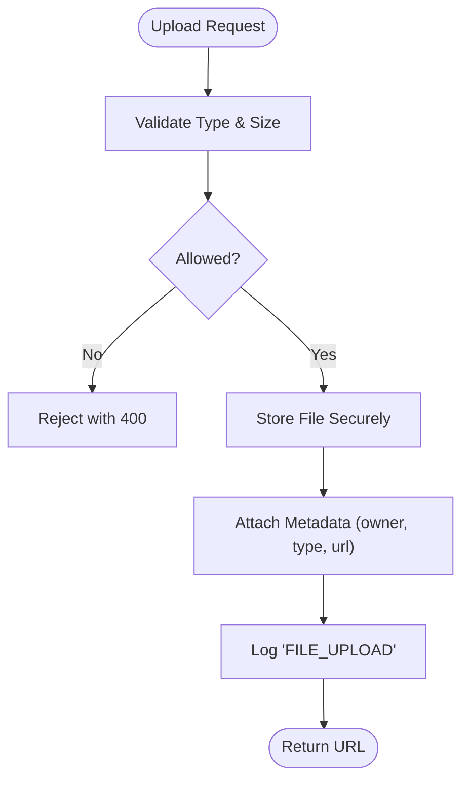
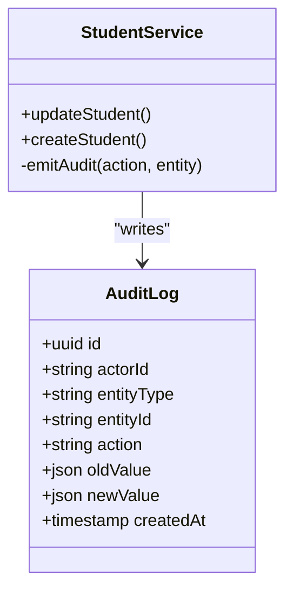
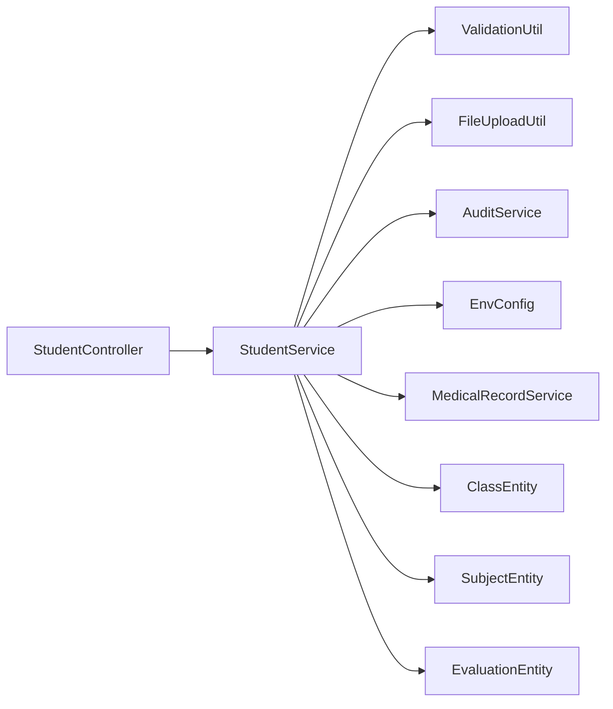

# Student Profile Management

<cite>
**Referenced Files in This Document**
- [backend/src/modules/eleves/entities/student.entity.ts](file://backend/src/modules/eleves/entities/student.entity.ts)
- [backend/src/modules/eleves/dto/create-student.dto.ts](file://backend/src/modules/eleves/dto/create-student.dto.ts)
- [backend/src/modules/eleves/dto/update-student.dto.ts](file://backend/src/modules/eleves/dto/update-student.dto.ts)
- [backend/src/modules/eleves/controllers/student.controller.ts](file://backend/src/modules/eleves/controllers/student.controller.ts)
- [backend/src/modules/eleves/services/student.service.ts](file://backend/src/modules/eleves/services/student.service.ts)
- [backend/database/migrations/024-eleve-champs-additionnels.sql](file://backend/database/migrations/024-eleve-champs-additionnels.sql)
- [backend/database/migrations/032-sante.sql](file://backend/database/migrations/032-sante.sql)
- [backend/database/migrations/088-refactorisation-architecture-academique.sql](file://backend/database/migrations/088-refactorisation-architecture-academique.sql)
- [backend/database/migrations/091-peuplement-architecture-academique.sql](file://backend/database/migrations/091-peuplement-architecture-academique.sql)
- [backend/src/modules/sante/entities/medical-record.entity.ts](file://backend/src/modules/sante/entities/medical-record.entity.ts)
- [backend/src/modules/sante/services/medical-record.service.ts](file://backend/src/modules/sante/services/medical-record.service.ts)
- [backend/src/modules/classes/entities/class.entity.ts](file://backend/src/modules/classes/entities/class.entity.ts)
- [backend/src/modules/matieres/entities/subject.entity.ts](file://backend/src/modules/matieres/entities/subject.entity.ts)
- [backend/src/modules/bulletins/entities/evaluation.entity.ts](file://backend/src/modules/bulletins/entities/evaluation.entity.ts)
- [backend/src/modules/audit/entities/audit-log.entity.ts](file://backend/src/modules/audit/entities/audit-log.entity.ts)
- [backend/src/modules/audit/services/audit.service.ts](file://backend/src/modules/audit/services/audit.service.ts)
- [backend/src/common/utils/validation.util.ts](file://backend/src/common/utils/validation.util.ts)
- [backend/src/common/utils/file-upload.util.ts](file://backend/src/common/utils/file-upload.util.ts)
- [backend/src/config/env.config.ts](file://backend/src/config/env.config.ts)
</cite>

## Table of Contents
1. [Introduction](#introduction)
2. [Project Structure](#project-structure)
3. [Core Components](#core-components)
4. [Architecture Overview](#architecture-overview)
5. [Detailed Component Analysis](#detailed-component-analysis)
6. [Dependency Analysis](#dependency-analysis)
7. [Performance Considerations](#performance-considerations)
8. [Troubleshooting Guide](#troubleshooting-guide)
9. [Conclusion](#conclusion)
10. [Appendices](#appendices)

## Introduction
This document provides comprehensive guidance for managing student profiles within the system. It covers the student entity structure, personal and academic information, medical records, custom fields, profile update operations, validation rules, field-level permissions, relationships with classes, subjects, and evaluations, as well as practical examples for CRUD, bulk updates, import/export, photo/document management, privacy, audit logging, and compliance considerations.

## Project Structure
Student Profile Management is implemented across multiple modules:
- Students module: core student data, DTOs, controller, service
- Health (Santé) module: medical records linked to students
- Academic architecture: classes, subjects, evaluations
- Audit module: change tracking and compliance
- Common utilities: validation and file handling
- Configuration: environment-driven settings



**Diagram sources**
- [backend/src/modules/eleves/controllers/student.controller.ts](file://backend/src/modules/eleves/controllers/student.controller.ts)
- [backend/src/modules/eleves/services/student.service.ts](file://backend/src/modules/eleves/services/student.service.ts)
- [backend/src/modules/eleves/entities/student.entity.ts](file://backend/src/modules/eleves/entities/student.entity.ts)
- [backend/src/modules/eleves/dto/create-student.dto.ts](file://backend/src/modules/eleves/dto/create-student.dto.ts)
- [backend/src/modules/eleves/dto/update-student.dto.ts](file://backend/src/modules/eleves/dto/update-student.dto.ts)
- [backend/src/modules/sante/entities/medical-record.entity.ts](file://backend/src/modules/sante/entities/medical-record.entity.ts)
- [backend/src/modules/sante/services/medical-record.service.ts](file://backend/src/modules/sante/services/medical-record.service.ts)
- [backend/src/modules/classes/entities/class.entity.ts](file://backend/src/modules/classes/entities/class.entity.ts)
- [backend/src/modules/matieres/entities/subject.entity.ts](file://backend/src/modules/matieres/entities/subject.entity.ts)
- [backend/src/modules/bulletins/entities/evaluation.entity.ts](file://backend/src/modules/bulletins/entities/evaluation.entity.ts)
- [backend/src/modules/audit/entities/audit-log.entity.ts](file://backend/src/modules/audit/entities/audit-log.entity.ts)
- [backend/src/modules/audit/services/audit.service.ts](file://backend/src/modules/audit/services/audit.service.ts)
- [backend/src/common/utils/validation.util.ts](file://backend/src/common/utils/validation.util.ts)
- [backend/src/common/utils/file-upload.util.ts](file://backend/src/common/utils/file-upload.util.ts)
- [backend/src/config/env.config.ts](file://backend/src/config/env.config.ts)

**Section sources**
- [backend/src/modules/eleves/controllers/student.controller.ts](file://backend/src/modules/eleves/controllers/student.controller.ts)
- [backend/src/modules/eleves/services/student.service.ts](file://backend/src/modules/eleves/services/student.service.ts)
- [backend/src/modules/eleves/entities/student.entity.ts](file://backend/src/modules/eleves/entities/student.entity.ts)
- [backend/src/modules/eleves/dto/create-student.dto.ts](file://backend/src/modules/eleves/dto/create-student.dto.ts)
- [backend/src/modules/eleves/dto/update-student.dto.ts](file://backend/src/modules/eleves/dto/update-student.dto.ts)
- [backend/src/modules/sante/entities/medical-record.entity.ts](file://backend/src/modules/sante/entities/medical-record.entity.ts)
- [backend/src/modules/sante/services/medical-record.service.ts](file://backend/src/modules/sante/services/medical-record.service.ts)
- [backend/src/modules/classes/entities/class.entity.ts](file://backend/src/modules/classes/entities/class.entity.ts)
- [backend/src/modules/matieres/entities/subject.entity.ts](file://backend/src/modules/matieres/entities/subject.entity.ts)
- [backend/src/modules/bulletins/entities/evaluation.entity.ts](file://backend/src/modules/bulletins/entities/evaluation.entity.ts)
- [backend/src/modules/audit/entities/audit-log.entity.ts](file://backend/src/modules/audit/entities/audit-log.entity.ts)
- [backend/src/modules/audit/services/audit.service.ts](file://backend/src/modules/audit/services/audit.service.ts)
- [backend/src/common/utils/validation.util.ts](file://backend/src/common/utils/validation.util.ts)
- [backend/src/common/utils/file-upload.util.ts](file://backend/src/common/utils/file-upload.util.ts)
- [backend/src/config/env.config.ts](file://backend/src/config/env.config.ts)

## Core Components
- Student Entity: Represents the central student record including personal details, academic associations, and links to medical records and attachments.
- DTOs: Create and Update Data Transfer Objects enforce input validation and shape API payloads.
- Controller: Exposes REST endpoints for student profile operations.
- Service: Orchestrates business logic, validation, relationships, and audit logging.
- Medical Record: Encapsulates sensitive health information associated with a student.
- Academic Entities: Class, Subject, Evaluation define the academic context and performance records.
- Audit Log: Records changes to student profiles for compliance and traceability.
- Utilities: Validation helpers and file upload utilities support robust processing.

Key responsibilities:
- Enforce validation rules on create/update
- Manage relationships with class, subjects, and evaluations
- Handle photos and documents securely
- Emit audit events for sensitive fields
- Support bulk operations and import/export flows

**Section sources**
- [backend/src/modules/eleves/entities/student.entity.ts](file://backend/src/modules/eleves/entities/student.entity.ts)
- [backend/src/modules/eleves/dto/create-student.dto.ts](file://backend/src/modules/eleves/dto/create-student.dto.ts)
- [backend/src/modules/eleves/dto/update-student.dto.ts](file://backend/src/modules/eleves/dto/update-student.dto.ts)
- [backend/src/modules/eleves/controllers/student.controller.ts](file://backend/src/modules/eleves/controllers/student.controller.ts)
- [backend/src/modules/eleves/services/student.service.ts](file://backend/src/modules/eleves/services/student.service.ts)
- [backend/src/modules/sante/entities/medical-record.entity.ts](file://backend/src/modules/sante/entities/medical-record.entity.ts)
- [backend/src/modules/sante/services/medical-record.service.ts](file://backend/src/modules/sante/services/medical-record.service.ts)
- [backend/src/modules/classes/entities/class.entity.ts](file://backend/src/modules/classes/entities/class.entity.ts)
- [backend/src/modules/matieres/entities/subject.entity.ts](file://backend/src/modules/matieres/entities/subject.entity.ts)
- [backend/src/modules/bulletins/entities/evaluation.entity.ts](file://backend/src/modules/bulletins/entities/evaluation.entity.ts)
- [backend/src/modules/audit/entities/audit-log.entity.ts](file://backend/src/modules/audit/entities/audit-log.entity.ts)
- [backend/src/modules/audit/services/audit.service.ts](file://backend/src/modules/audit/services/audit.service.ts)
- [backend/src/common/utils/validation.util.ts](file://backend/src/common/utils/validation.util.ts)
- [backend/src/common/utils/file-upload.util.ts](file://backend/src/common/utils/file-upload.util.ts)

## Architecture Overview
The Student Profile Management follows a layered architecture:
- Presentation layer: Controller exposes endpoints
- Business layer: Service implements orchestration and policy enforcement
- Data layer: Entities map to database tables via migrations
- Cross-cutting concerns: Validation, file handling, audit logging, configuration



**Diagram sources**
- [backend/src/modules/eleves/controllers/student.controller.ts](file://backend/src/modules/eleves/controllers/student.controller.ts)
- [backend/src/modules/eleves/services/student.service.ts](file://backend/src/modules/eleves/services/student.service.ts)
- [backend/src/modules/audit/services/audit.service.ts](file://backend/src/modules/audit/services/audit.service.ts)
- [backend/src/modules/sante/services/medical-record.service.ts](file://backend/src/modules/sante/services/medical-record.service.ts)
- [backend/src/common/utils/file-upload.util.ts](file://backend/src/common/utils/file-upload.util.ts)

## Detailed Component Analysis

### Student Entity and Custom Fields
The student entity includes:
- Personal details: name, date of birth, gender, nationality, contact info
- Academic information: current class, enrollment dates, status
- Medical records link: foreign key to health module
- Additional custom fields: extensible JSON or dedicated columns for school-specific needs

Custom fields are supported by migration that adds additional columns to the student table.



**Diagram sources**
- [backend/src/modules/eleves/entities/student.entity.ts](file://backend/src/modules/eleves/entities/student.entity.ts)
- [backend/src/modules/sante/entities/medical-record.entity.ts](file://backend/src/modules/sante/entities/medical-record.entity.ts)
- [backend/src/modules/classes/entities/class.entity.ts](file://backend/src/modules/classes/entities/class.entity.ts)
- [backend/database/migrations/024-eleve-champs-additionnels.sql](file://backend/database/migrations/024-eleve-champs-additionnels.sql)

**Section sources**
- [backend/src/modules/eleves/entities/student.entity.ts](file://backend/src/modules/eleves/entities/student.entity.ts)
- [backend/database/migrations/024-eleve-champs-additionnels.sql](file://backend/database/migrations/024-eleve-champs-additionnels.sql)
- [backend/database/migrations/032-sante.sql](file://backend/database/migrations/032-sante.sql)

### DTOs and Validation Rules
Create and Update DTOs define required fields, formats, and constraints:
- Required fields: first name, last name, birth date, class assignment
- Optional fields: email, phone, address, custom fields
- Validation rules: email format, phone regex, date ranges, enum values
- Partial updates: allow selective field updates with safe defaults

Validation utilities provide reusable checks and error mapping.



**Diagram sources**
- [backend/src/modules/eleves/dto/create-student.dto.ts](file://backend/src/modules/eleves/dto/create-student.dto.ts)
- [backend/src/modules/eleves/dto/update-student.dto.ts](file://backend/src/modules/eleves/dto/update-student.dto.ts)
- [backend/src/common/utils/validation.util.ts](file://backend/src/common/utils/validation.util.ts)

**Section sources**
- [backend/src/modules/eleves/dto/create-student.dto.ts](file://backend/src/modules/eleves/dto/create-student.dto.ts)
- [backend/src/modules/eleves/dto/update-student.dto.ts](file://backend/src/modules/eleves/dto/update-student.dto.ts)
- [backend/src/common/utils/validation.util.ts](file://backend/src/common/utils/validation.util.ts)

### Relationships: Classes, Subjects, Evaluations
Students are linked to:
- Class: current academic placement
- Subjects: through curriculum and evaluation records
- Evaluations: grades and competencies recorded per period

Migration files define the academic architecture and populate initial data.

```mermaid
erDiagram
STUDENT {
uuid id PK
string first_name
string last_name
uuid class_id FK
}
CLASS {
uuid id PK
string name
uuid year_id FK
}
SUBJECT {
uuid id PK
string name
uuid establishment_id FK
}
EVALUATION {
uuid id PK
uuid student_id FK
uuid subject_id FK
uuid class_id FK
decimal score
date date_evaluated
}
STUDENT ||--o{ EVALUATION : "has many"
CLASS ||--o{ EVALUATION : "contains"
SUBJECT ||--o{ EVALUATION : "assessed in"
```

**Diagram sources**
- [backend/src/modules/classes/entities/class.entity.ts](file://backend/src/modules/classes/entities/class.entity.ts)
- [backend/src/modules/matieres/entities/subject.entity.ts](file://backend/src/modules/matieres/entities/subject.entity.ts)
- [backend/src/modules/bulletins/entities/evaluation.entity.ts](file://backend/src/modules/bulletins/entities/evaluation.entity.ts)
- [backend/database/migrations/088-refactorisation-architecture-academique.sql](file://backend/database/migrations/088-refactorisation-architecture-academique.sql)
- [backend/database/migrations/091-peuplement-architecture-academique.sql](file://backend/database/migrations/091-peuplement-architecture-academique.sql)

**Section sources**
- [backend/src/modules/classes/entities/class.entity.ts](file://backend/src/modules/classes/entities/class.entity.ts)
- [backend/src/modules/matieres/entities/subject.entity.ts](file://backend/src/modules/matieres/entities/subject.entity.ts)
- [backend/src/modules/bulletins/entities/evaluation.entity.ts](file://backend/src/modules/bulletins/entities/evaluation.entity.ts)
- [backend/database/migrations/088-refactorisation-architecture-academique.sql](file://backend/database/migrations/088-refactorisation-architecture-academique.sql)
- [backend/database/migrations/091-peuplement-architecture-academique.sql](file://backend/database/migrations/091-peuplement-architecture-academique.sql)

### Profile Update Operations
Operations include:
- Create student profile with full payload
- Update specific fields safely
- Assign or reassign to a class
- Link or update medical record
- Attach or replace photo/documents

Field-level permissions restrict sensitive updates (e.g., medical, personal identifiers).



**Diagram sources**
- [backend/src/modules/eleves/controllers/student.controller.ts](file://backend/src/modules/eleves/controllers/student.controller.ts)
- [backend/src/modules/eleves/services/student.service.ts](file://backend/src/modules/eleves/services/student.service.ts)
- [backend/src/modules/audit/services/audit.service.ts](file://backend/src/modules/audit/services/audit.service.ts)

**Section sources**
- [backend/src/modules/eleves/controllers/student.controller.ts](file://backend/src/modules/eleves/controllers/student.controller.ts)
- [backend/src/modules/eleves/services/student.service.ts](file://backend/src/modules/eleves/services/student.service.ts)

### Data Import/Export and Bulk Updates
- Import: CSV/JSON ingestion pipeline validates rows, maps to DTOs, persists in batches, and logs failures
- Export: Query filtered students and serialize to CSV/JSON with optional masking for sensitive fields
- Bulk updates: Apply allowed fields to multiple students with permission checks and audit entries

Implementation references:
- Import/export utilities and batch persistence patterns
- Validation and error aggregation for large datasets

**Section sources**
- [backend/src/modules/eleves/services/student.service.ts](file://backend/src/modules/eleves/services/student.service.ts)
- [backend/src/common/utils/validation.util.ts](file://backend/src/common/utils/validation.util.ts)

### Photo and Document Management
Capabilities:
- Upload student photo with size/type restrictions
- Store document attachments (PDF, images) with metadata
- Replace or remove existing files
- Generate secure URLs and access controls

Security measures:
- File type whitelisting
- Size limits enforced via configuration
- Virus scanning hooks (optional)
- Access restricted by role and establishment scope



**Diagram sources**
- [backend/src/common/utils/file-upload.util.ts](file://backend/src/common/utils/file-upload.util.ts)
- [backend/src/config/env.config.ts](file://backend/src/config/env.config.ts)

**Section sources**
- [backend/src/common/utils/file-upload.util.ts](file://backend/src/common/utils/file-upload.util.ts)
- [backend/src/config/env.config.ts](file://backend/src/config/env.config.ts)

### Privacy, Audit Logging, and Compliance
Privacy considerations:
- Mask sensitive fields in responses based on user roles
- Restrict access to medical records to authorized personnel
- Enforce establishment-scoped isolation

Audit logging:
- Record who changed what, when, and why
- Capture before/after snapshots for critical fields
- Immutable log entries with tamper detection

Compliance requirements:
- Retention policies for sensitive data
- Right to erasure workflows
- Consent tracking for medical data



**Diagram sources**
- [backend/src/modules/audit/entities/audit-log.entity.ts](file://backend/src/modules/audit/entities/audit-log.entity.ts)
- [backend/src/modules/audit/services/audit.service.ts](file://backend/src/modules/audit/services/audit.service.ts)
- [backend/src/modules/eleves/services/student.service.ts](file://backend/src/modules/eleves/services/student.service.ts)

**Section sources**
- [backend/src/modules/audit/entities/audit-log.entity.ts](file://backend/src/modules/audit/entities/audit-log.entity.ts)
- [backend/src/modules/audit/services/audit.service.ts](file://backend/src/modules/audit/services/audit.service.ts)
- [backend/src/modules/eleves/services/student.service.ts](file://backend/src/modules/eleves/services/student.service.ts)

## Dependency Analysis
High-level dependencies among components:
- Controller depends on Service for business logic
- Service depends on Entities, Validation, File Upload, Audit, and Environment config
- Medical records depend on Student linkage
- Academic entities relate to evaluations and subjects



**Diagram sources**
- [backend/src/modules/eleves/controllers/student.controller.ts](file://backend/src/modules/eleves/controllers/student.controller.ts)
- [backend/src/modules/eleves/services/student.service.ts](file://backend/src/modules/eleves/services/student.service.ts)
- [backend/src/common/utils/validation.util.ts](file://backend/src/common/utils/validation.util.ts)
- [backend/src/common/utils/file-upload.util.ts](file://backend/src/common/utils/file-upload.util.ts)
- [backend/src/modules/audit/services/audit.service.ts](file://backend/src/modules/audit/services/audit.service.ts)
- [backend/src/config/env.config.ts](file://backend/src/config/env.config.ts)
- [backend/src/modules/sante/services/medical-record.service.ts](file://backend/src/modules/sante/services/medical-record.service.ts)
- [backend/src/modules/classes/entities/class.entity.ts](file://backend/src/modules/classes/entities/class.entity.ts)
- [backend/src/modules/matieres/entities/subject.entity.ts](file://backend/src/modules/matieres/entities/subject.entity.ts)
- [backend/src/modules/bulletins/entities/evaluation.entity.ts](file://backend/src/modules/bulletins/entities/evaluation.entity.ts)

**Section sources**
- [backend/src/modules/eleves/controllers/student.controller.ts](file://backend/src/modules/eleves/controllers/student.controller.ts)
- [backend/src/modules/eleves/services/student.service.ts](file://backend/src/modules/eleves/services/student.service.ts)
- [backend/src/common/utils/validation.util.ts](file://backend/src/common/utils/validation.util.ts)
- [backend/src/common/utils/file-upload.util.ts](file://backend/src/common/utils/file-upload.util.ts)
- [backend/src/modules/audit/services/audit.service.ts](file://backend/src/modules/audit/services/audit.service.ts)
- [backend/src/config/env.config.ts](file://backend/src/config/env.config.ts)
- [backend/src/modules/sante/services/medical-record.service.ts](file://backend/src/modules/sante/services/medical-record.service.ts)
- [backend/src/modules/classes/entities/class.entity.ts](file://backend/src/modules/classes/entities/class.entity.ts)
- [backend/src/modules/matieres/entities/subject.entity.ts](file://backend/src/modules/matieres/entities/subject.entity.ts)
- [backend/src/modules/bulletins/entities/evaluation.entity.ts](file://backend/src/modules/bulletins/entities/evaluation.entity.ts)

## Performance Considerations
- Use pagination and filtering for list endpoints
- Batch inserts/updates for import/export
- Indexes on frequently queried fields (classId, enrollmentDate, status)
- Avoid N+1 queries by eager loading related entities where appropriate
- Stream large exports to reduce memory footprint

[No sources needed since this section provides general guidance]

## Troubleshooting Guide
Common issues and resolutions:
- Validation errors: Review DTO schema and input payloads; check error messages returned by validation utilities
- Permission denied: Verify field-level permissions and role assignments; ensure establishment scoping
- File upload failures: Confirm file type and size limits; inspect storage backend connectivity
- Audit gaps: Ensure audit service is initialized and write permissions granted
- Relationship integrity: Validate foreign keys for class and medical record associations

**Section sources**
- [backend/src/common/utils/validation.util.ts](file://backend/src/common/utils/validation.util.ts)
- [backend/src/common/utils/file-upload.util.ts](file://backend/src/common/utils/file-upload.util.ts)
- [backend/src/modules/audit/services/audit.service.ts](file://backend/src/modules/audit/services/audit.service.ts)
- [backend/src/modules/eleves/services/student.service.ts](file://backend/src/modules/eleves/services/student.service.ts)

## Conclusion
Student Profile Management integrates personal, academic, and medical data with strong validation, permissions, and audit capabilities. The modular design supports extensibility through custom fields and clear separation of concerns. Adhering to privacy and compliance practices ensures responsible handling of sensitive student information.

[No sources needed since this section summarizes without analyzing specific files]

## Appendices

### Practical Examples

- Create a student profile
  - Endpoint: POST /students
  - Payload: Full DTO fields (name, birth date, class assignment, etc.)
  - Response: Created student with ID and timestamps
  - References:
    - [backend/src/modules/eleves/controllers/student.controller.ts](file://backend/src/modules/eleves/controllers/student.controller.ts)
    - [backend/src/modules/eleves/dto/create-student.dto.ts](file://backend/src/modules/eleves/dto/create-student.dto.ts)
    - [backend/src/modules/eleves/services/student.service.ts](file://backend/src/modules/eleves/services/student.service.ts)

- Update specific fields
  - Endpoint: PATCH /students/:id
  - Payload: Partial DTO with allowed fields
  - Response: Updated student snapshot
  - References:
    - [backend/src/modules/eleves/controllers/student.controller.ts](file://backend/src/modules/eleves/controllers/student.controller.ts)
    - [backend/src/modules/eleves/dto/update-student.dto.ts](file://backend/src/modules/eleves/dto/update-student.dto.ts)
    - [backend/src/modules/eleves/services/student.service.ts](file://backend/src/modules/eleves/services/student.service.ts)

- Assign or reassign to a class
  - Endpoint: PATCH /students/:id
  - Payload: { classId }
  - Response: Updated student with new class association
  - References:
    - [backend/src/modules/eleves/services/student.service.ts](file://backend/src/modules/eleves/services/student.service.ts)
    - [backend/src/modules/classes/entities/class.entity.ts](file://backend/src/modules/classes/entities/class.entity.ts)

- Link or update medical record
  - Endpoint: PATCH /students/:id
  - Payload: { medicalRecordId }
  - Response: Updated student with medical record reference
  - References:
    - [backend/src/modules/eleves/services/student.service.ts](file://backend/src/modules/eleves/services/student.service.ts)
    - [backend/src/modules/sante/services/medical-record.service.ts](file://backend/src/modules/sante/services/medical-record.service.ts)

- Upload student photo
  - Endpoint: POST /students/:id/photo
  - Payload: Multipart file
  - Response: Photo URL and metadata
  - References:
    - [backend/src/common/utils/file-upload.util.ts](file://backend/src/common/utils/file-upload.util.ts)
    - [backend/src/config/env.config.ts](file://backend/src/config/env.config.ts)

- Bulk update students
  - Endpoint: POST /students/bulk-update
  - Payload: Array of { id, fields }
  - Response: Summary with successes and failures
  - References:
    - [backend/src/modules/eleves/services/student.service.ts](file://backend/src/modules/eleves/services/student.service.ts)

- Import students from CSV/JSON
  - Endpoint: POST /students/import
  - Payload: File stream
  - Response: Import report with counts and errors
  - References:
    - [backend/src/modules/eleves/services/student.service.ts](file://backend/src/modules/eleves/services/student.service.ts)
    - [backend/src/common/utils/validation.util.ts](file://backend/src/common/utils/validation.util.ts)

- Export students to CSV/JSON
  - Endpoint: GET /students/export?format=csv|json&filters...
  - Response: File download
  - References:
    - [backend/src/modules/eleves/services/student.service.ts](file://backend/src/modules/eleves/services/student.service.ts)