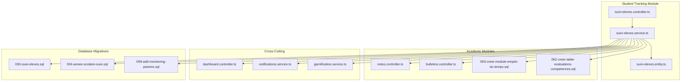
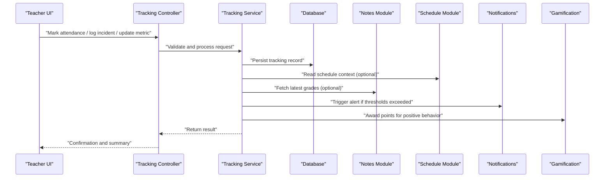
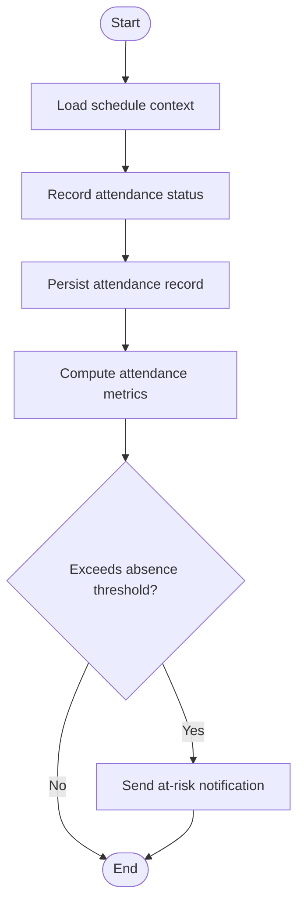
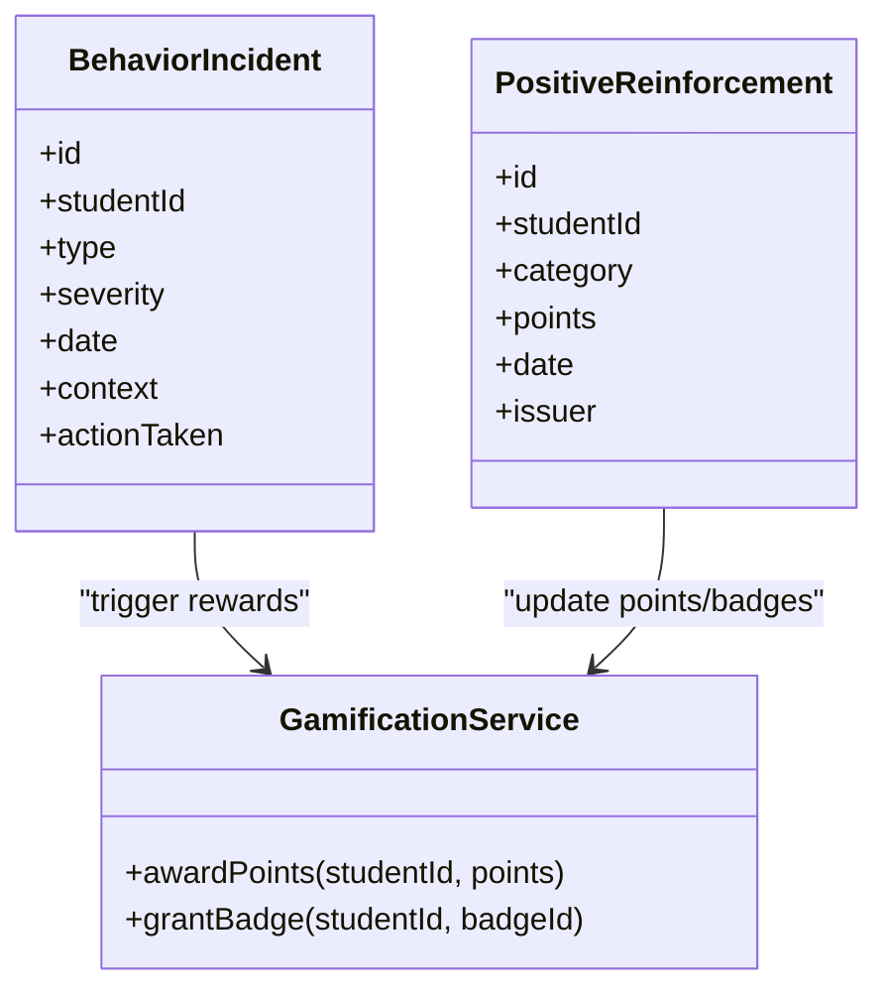
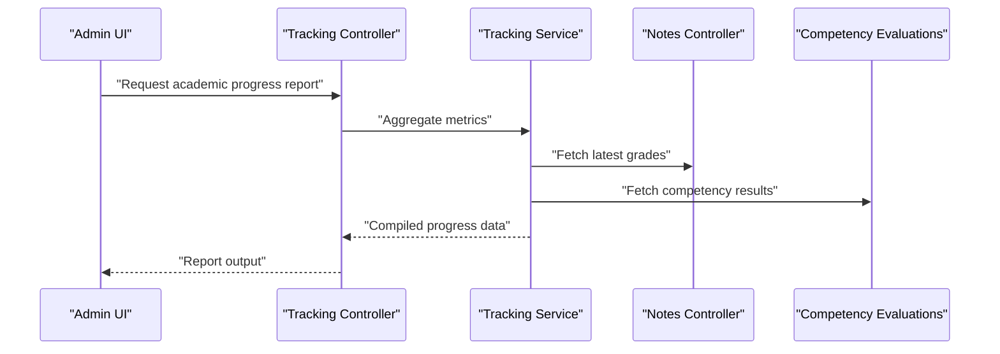
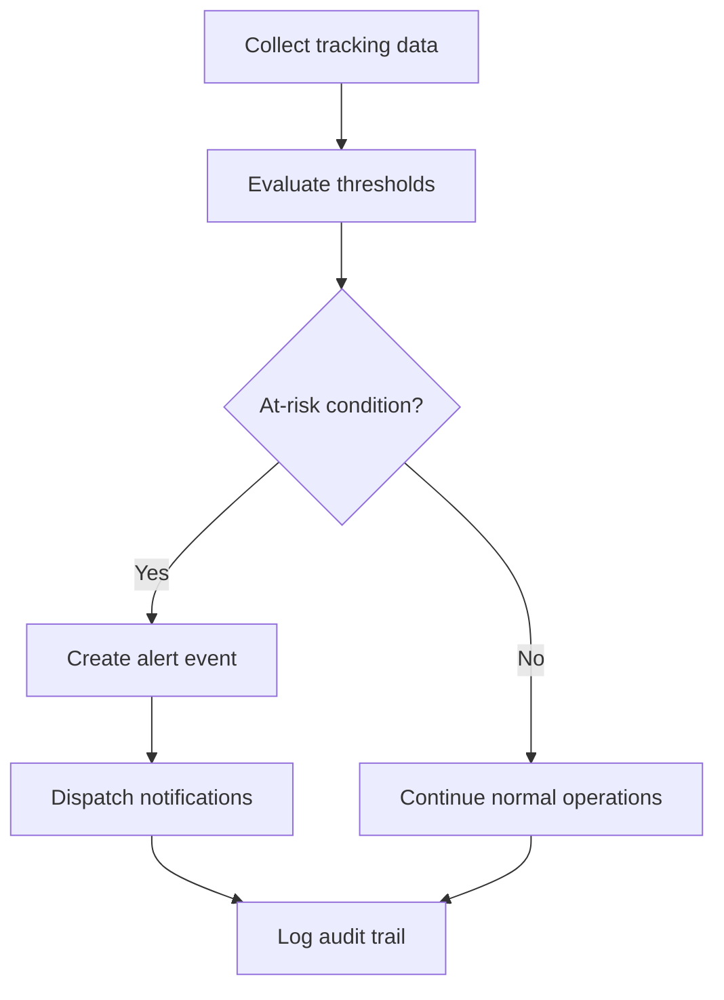
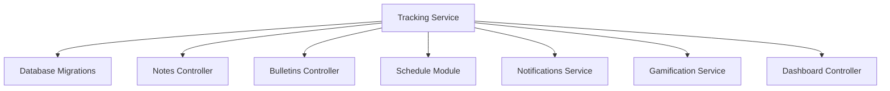

# Student Tracking & Monitoring

<cite>
**Referenced Files in This Document**
- [030-suivi-eleves.sql](file://backend/database/migrations/030-suivi-eleves.sql)
- [034-annee-scolaire-suivi.sql](file://backend/database/migrations/034-annee-scolaire-suivi.sql)
- [062-creer-table-evaluations-competences.sql](file://backend/database/migrations/062-creer-table-evaluations-competences.sql)
- [063-creer-module-emploi-du-temps.sql](file://backend/database/migrations/063-creer-module-emploi-du-temps.sql)
- [099-add-monitoring-params.sql](file://backend/database/migrations/099-add-monitoring-params.sql)
- [suivi-eleves.controller.ts](file://backend/src/modules/suivi-eleves/controllers/suivi-eleves.controller.ts)
- [suivi-eleves.service.ts](file://backend/src/modules/suivi-eleves/services/suivi-eleves.service.ts)
- [suivi-eleves.entity.ts](file://backend/src/modules/suivi-eleves/entities/suivi-eleves.entity.ts)
- [notes.controller.ts](file://backend/src/modules/notes/controllers/notes.controller.ts)
- [bulletins.controller.ts](file://backend/src/modules/bulletins/controllers/bulletins.controller.ts)
- [dashboard.controller.ts](file://backend/src/modules/dashboard/controllers/dashboard.controller.ts)
- [notifications.service.ts](file://backend/src/modules/notifications/services/notifications.service.ts)
- [gamification.service.ts](file://backend/src/modules/gamification/services/gamification.service.ts)
</cite>

## Table of Contents
1. [Introduction](#introduction)
2. [Project Structure](#project-structure)
3. [Core Components](#core-components)
4. [Architecture Overview](#architecture-overview)
5. [Detailed Component Analysis](#detailed-component-analysis)
6. [Dependency Analysis](#dependency-analysis)
7. [Performance Considerations](#performance-considerations)
8. [Troubleshooting Guide](#troubleshooting-guide)
9. [Conclusion](#conclusion)
10. [Appendices](#appendices)

## Introduction
This document explains the Student Tracking & Monitoring capabilities for comprehensive student progress and behavior tracking. It covers attendance monitoring (daily marking, absence tracking, analytics), behavioral incident recording, positive reinforcement tracking, disciplinary action logging, academic progress monitoring (grades, competencies, learning outcomes), practical examples (data entry, reports, alerts), integrations with academic modules (automatic grade updates, schedule-based attendance), privacy and compliance considerations, and guidance for custom metrics and automated reporting workflows.

## Project Structure
The student tracking system is implemented as a dedicated module with database migrations, entities, services, and controllers. Related data and integrations are spread across academic modules such as notes, bulletins, scheduling, gamification, and notifications.

**Diagram sources**
- [suivi-eleves.controller.ts](file://backend/src/modules/suivi-eleves/controllers/suivi-eleves.controller.ts)
- [suivi-eleves.service.ts](file://backend/src/modules/suivi-eleves/services/suivi-eleves.service.ts)
- [suivi-eleves.entity.ts](file://backend/src/modules/suivi-eleves/entities/suivi-eleves.entity.ts)
- [030-suivi-eleves.sql](file://backend/database/migrations/030-suivi-eleves.sql)
- [034-annee-scolaire-suivi.sql](file://backend/database/migrations/034-annee-scolaire-suivi.sql)
- [099-add-monitoring-params.sql](file://backend/database/migrations/099-add-monitoring-params.sql)
- [062-creer-table-evaluations-competences.sql](file://backend/database/migrations/062-creer-table-evaluations-competences.sql)
- [063-creer-module-emploi-du-temps.sql](file://backend/database/migrations/063-creer-module-emploi-du-temps.sql)
- [notes.controller.ts](file://backend/src/modules/notes/controllers/notes.controller.ts)
- [bulletins.controller.ts](file://backend/src/modules/bulletins/controllers/bulletins.controller.ts)
- [dashboard.controller.ts](file://backend/src/modules/dashboard/controllers/dashboard.controller.ts)
- [notifications.service.ts](file://backend/src/modules/notifications/services/notifications.service.ts)
- [gamification.service.ts](file://backend/src/modules/gamification/services/gamification.service.ts)

**Section sources**
- [030-suivi-eleves.sql](file://backend/database/migrations/030-suivi-eleves.sql)
- [034-annee-scolaire-suivi.sql](file://backend/database/migrations/034-annee-scolaire-suivi.sql)
- [099-add-monitoring-params.sql](file://backend/database/migrations/099-add-monitoring-params.sql)
- [062-creer-table-evaluations-competences.sql](file://backend/database/migrations/062-creer-table-evaluations-competences.sql)
- [063-creer-module-emploi-du-temps.sql](file://backend/database/migrations/063-creer-module-emploi-du-temps.sql)
- [suivi-eleves.controller.ts](file://backend/src/modules/suivi-eleves/controllers/suivi-eleves.controller.ts)
- [suivi-eleves.service.ts](file://backend/src/modules/suivi-eleves/services/suivi-eleves.service.ts)
- [suivi-eleves.entity.ts](file://backend/src/modules/suivi-eleves/entities/suivi-eleves.entity.ts)
- [notes.controller.ts](file://backend/src/modules/notes/controllers/notes.controller.ts)
- [bulletins.controller.ts](file://backend/src/modules/bulletins/controllers/bulletins.controller.ts)
- [dashboard.controller.ts](file://backend/src/modules/dashboard/controllers/dashboard.controller.ts)
- [notifications.service.ts](file://backend/src/modules/notifications/services/notifications.service.ts)
- [gamification.service.ts](file://backend/src/modules/gamification/services/gamification.service.ts)

## Core Components
- Attendance tracking: daily presence/absence marking per student and class, absence history, and aggregated analytics.
- Behavioral incidents: records of infractions, disciplinary actions, and positive reinforcement events.
- Academic progress: integration with grades and competency evaluations to measure learning outcomes.
- Alerts and notifications: at-risk student detection and automated notifications.
- Reporting: dashboards and exportable summaries for administrators and teachers.

Key implementation anchors:
- Database schema and configuration for student tracking and monitoring parameters.
- Service layer orchestrating business logic and cross-module interactions.
- Controller endpoints exposing APIs for UI and integrations.
- Entities modeling core tracking aggregates.

**Section sources**
- [030-suivi-eleves.sql](file://backend/database/migrations/030-suivi-eleves.sql)
- [034-annee-scolaire-suivi.sql](file://backend/database/migrations/034-annee-scolaire-suivi.sql)
- [099-add-monitoring-params.sql](file://backend/database/migrations/099-add-monitoring-params.sql)
- [suivi-eleves.service.ts](file://backend/src/modules/suivi-eleves/services/suivi-eleves.service.ts)
- [suivi-eleves.controller.ts](file://backend/src/modules/suivi-eleves/controllers/suivi-eleves.controller.ts)
- [suivi-eleves.entity.ts](file://backend/src/modules/suivi-eleves/entities/suivi-eleves.entity.ts)

## Architecture Overview
The Student Tracking & Monitoring architecture centers on a service-driven module that persists tracking data via dedicated tables and integrates with academic modules for grades, schedules, and competency assessments. Notifications and gamification provide feedback loops for positive reinforcement and at-risk alerts. Dashboards aggregate insights for decision-making.

**Diagram sources**
- [suivi-eleves.controller.ts](file://backend/src/modules/suivi-eleves/controllers/suivi-eleves.controller.ts)
- [suivi-eleves.service.ts](file://backend/src/modules/suivi-eleves/services/suivi-eleves.service.ts)
- [063-creer-module-emploi-du-temps.sql](file://backend/database/migrations/063-creer-module-emploi-du-temps.sql)
- [notes.controller.ts](file://backend/src/modules/notes/controllers/notes.controller.ts)
- [notifications.service.ts](file://backend/src/modules/notifications/services/notifications.service.ts)
- [gamification.service.ts](file://backend/src/modules/gamification/services/gamification.service.ts)

## Detailed Component Analysis

### Attendance Monitoring
- Daily attendance marking: record presence/absence per student per session or day.
- Absence tracking: maintain historical absence records with reasons and categories.
- Attendance analytics: compute rates by period, class, and student; identify trends and patterns.

Implementation anchors:
- Schema definitions for attendance and related metadata.
- Service methods to create, query, and aggregate attendance data.
- Integration with schedule module to align attendance with classes and sessions.

**Diagram sources**
- [030-suivi-eleves.sql](file://backend/database/migrations/030-suivi-eleves.sql)
- [034-annee-scolaire-suivi.sql](file://backend/database/migrations/034-annee-scolaire-suivi.sql)
- [063-creer-module-emploi-du-temps.sql](file://backend/database/migrations/063-creer-module-emploi-du-temps.sql)
- [suivi-eleves.service.ts](file://backend/src/modules/suivi-eleves/services/suivi-eleves.service.ts)
- [notifications.service.ts](file://backend/src/modules/notifications/services/notifications.service.ts)

**Section sources**
- [030-suivi-eleves.sql](file://backend/database/migrations/030-suivi-eleves.sql)
- [034-annee-scolaire-suivi.sql](file://backend/database/migrations/034-annee-scolaire-suivi.sql)
- [063-creer-module-emploi-du-temps.sql](file://backend/database/migrations/063-creer-module-emploi-du-temps.sql)
- [suivi-eleves.service.ts](file://backend/src/modules/suivi-eleves/services/suivi-eleves.service.ts)
- [notifications.service.ts](file://backend/src/modules/notifications/services/notifications.service.ts)

### Behavioral Incident Recording and Positive Reinforcement
- Incident logging: capture details of behavioral infractions, including type, severity, date, and context.
- Disciplinary actions: record measures taken and outcomes.
- Positive reinforcement: award recognition points or badges for commendable behavior.

Integration points:
- Gamification module for point awards and badges.
- Notifications for parent/teacher alerts when incidents occur.

**Diagram sources**
- [030-suivi-eleves.sql](file://backend/database/migrations/030-suivi-eleves.sql)
- [gamification.service.ts](file://backend/src/modules/gamification/services/gamification.service.ts)
- [notifications.service.ts](file://backend/src/modules/notifications/services/notifications.service.ts)

**Section sources**
- [030-suivi-eleves.sql](file://backend/database/migrations/030-suivi-eleves.sql)
- [gamification.service.ts](file://backend/src/modules/gamification/services/gamification.service.ts)
- [notifications.service.ts](file://backend/src/modules/notifications/services/notifications.service.ts)

### Academic Progress Monitoring
- Grade tracking: integrate with the notes module to pull latest scores and averages.
- Competency assessment: link evaluations and competencies to track mastery over time.
- Learning outcome measurement: aggregate performance indicators across subjects and periods.

Integrations:
- Notes controller for grade retrieval and updates.
- Competency evaluation schema for structured assessments.

**Diagram sources**
- [notes.controller.ts](file://backend/src/modules/notes/controllers/notes.controller.ts)
- [062-creer-table-evaluations-competences.sql](file://backend/database/migrations/062-creer-table-evaluations-competences.sql)
- [suivi-eleves.controller.ts](file://backend/src/modules/suivi-eleves/controllers/suivi-eleves.controller.ts)
- [suivi-eleves.service.ts](file://backend/src/modules/suivi-eleves/services/suivi-eleves.service.ts)

**Section sources**
- [notes.controller.ts](file://backend/src/modules/notes/controllers/notes.controller.ts)
- [062-creer-table-evaluations-competences.sql](file://backend/database/migrations/062-creer-table-evaluations-competences.sql)
- [suivi-eleves.controller.ts](file://backend/src/modules/suivi-eleves/controllers/suivi-eleves.controller.ts)
- [suivi-eleves.service.ts](file://backend/src/modules/suivi-eleves/services/suivi-eleves.service.ts)

### At-Risk Alerts and Automated Reporting
- Threshold-based detection: flags students exceeding absence limits or showing declining performance.
- Notification dispatch: sends alerts to parents, teachers, and counselors.
- Reporting workflows: generate periodic summaries and exportable datasets.

**Diagram sources**
- [notifications.service.ts](file://backend/src/modules/notifications/services/notifications.service.ts)
- [dashboard.controller.ts](file://backend/src/modules/dashboard/controllers/dashboard.controller.ts)
- [suivi-eleves.service.ts](file://backend/src/modules/suivi-eleves/services/suivi-eleves.service.ts)

**Section sources**
- [notifications.service.ts](file://backend/src/modules/notifications/services/notifications.service.ts)
- [dashboard.controller.ts](file://backend/src/modules/dashboard/controllers/dashboard.controller.ts)
- [suivi-eleves.service.ts](file://backend/src/modules/suivi-eleves/services/suivi-eleves.service.ts)

### Practical Examples
- Data entry:
  - Daily attendance: use the attendance endpoint to mark present/absent per student and session.
  - Behavioral incident: submit an incident record with type, severity, and context.
  - Positive reinforcement: log a reward event to trigger gamification points.
- Report generation:
  - Request a student progress report combining attendance, grades, and competencies.
  - Export analytics for administrative review.
- Alert systems:
  - Configure thresholds for absences and performance drops.
  - Receive notifications when conditions are met.

[No sources needed since this section provides general usage guidance]

### Integrations with Academic Modules
- Automatic grade updates:
  - Pull latest grades from the notes module during progress aggregation.
- Schedule-based attendance:
  - Use schedule context to associate attendance with specific classes and sessions.

**Section sources**
- [notes.controller.ts](file://backend/src/modules/notes/controllers/notes.controller.ts)
- [063-creer-module-emploi-du-temps.sql](file://backend/database/migrations/063-creer-module-emploi-du-temps.sql)
- [suivi-eleves.service.ts](file://backend/src/modules/suivi-eleves/services/suivi-eleves.service.ts)

### Privacy and Compliance Considerations
- Data minimization: collect only necessary student information for tracking purposes.
- Access control: enforce role-based permissions for viewing and editing sensitive data.
- Auditability: maintain logs for changes to attendance, incidents, and grades.
- Retention policies: define retention periods aligned with educational regulations.
- Consent and transparency: ensure parents and guardians understand how data is used.

[No sources needed since this section provides general compliance guidance]

### Custom Tracking Metrics and Automated Workflows
- Define custom metrics:
  - Extend monitoring parameters to include new indicators (e.g., participation rate).
- Automated workflows:
  - Schedule periodic computations for metrics and reports.
  - Trigger notifications based on dynamic thresholds.

**Section sources**
- [099-add-monitoring-params.sql](file://backend/database/migrations/099-add-monitoring-params.sql)
- [suivi-eleves.service.ts](file://backend/src/modules/suivi-eleves/services/suivi-eleves.service.ts)

## Dependency Analysis
The tracking module depends on academic modules and cross-cutting services. The following diagram illustrates key dependencies and relationships.

**Diagram sources**
- [suivi-eleves.service.ts](file://backend/src/modules/suivi-eleves/services/suivi-eleves.service.ts)
- [notes.controller.ts](file://backend/src/modules/notes/controllers/notes.controller.ts)
- [bulletins.controller.ts](file://backend/src/modules/bulletins/controllers/bulletins.controller.ts)
- [063-creer-module-emploi-du-temps.sql](file://backend/database/migrations/063-creer-module-emploi-du-temps.sql)
- [notifications.service.ts](file://backend/src/modules/notifications/services/notifications.service.ts)
- [gamification.service.ts](file://backend/src/modules/gamification/services/gamification.service.ts)
- [dashboard.controller.ts](file://backend/src/modules/dashboard/controllers/dashboard.controller.ts)

**Section sources**
- [suivi-eleves.service.ts](file://backend/src/modules/suivi-eleves/services/suivi-eleves.service.ts)
- [notes.controller.ts](file://backend/src/modules/notes/controllers/notes.controller.ts)
- [bulletins.controller.ts](file://backend/src/modules/bulletins/controllers/bulletins.controller.ts)
- [063-creer-module-emploi-du-temps.sql](file://backend/database/migrations/063-creer-module-emploi-du-temps.sql)
- [notifications.service.ts](file://backend/src/modules/notifications/services/notifications.service.ts)
- [gamification.service.ts](file://backend/src/modules/gamification/services/gamification.service.ts)
- [dashboard.controller.ts](file://backend/src/modules/dashboard/controllers/dashboard.controller.ts)

## Performance Considerations
- Indexing: ensure indexes on frequently queried fields (studentId, date, classId) to optimize attendance and incident lookups.
- Aggregation efficiency: precompute common metrics where possible and cache dashboard results.
- Batch operations: support batch attendance marking to reduce API overhead.
- Pagination: implement pagination for large datasets in reporting endpoints.

[No sources needed since this section provides general guidance]

## Troubleshooting Guide
Common issues and resolutions:
- Missing schedule context: verify that schedule entries exist for the intended class and date before marking attendance.
- Duplicate attendance records: enforce idempotency checks to prevent double-marking.
- Notification delivery failures: check notification provider configuration and retry mechanisms.
- Inconsistent metrics: validate threshold configurations and re-run aggregation jobs.

**Section sources**
- [063-creer-module-emploi-du-temps.sql](file://backend/database/migrations/063-creer-module-emploi-du-temps.sql)
- [notifications.service.ts](file://backend/src/modules/notifications/services/notifications.service.ts)
- [suivi-eleves.service.ts](file://backend/src/modules/suivi-eleves/services/suivi-eleves.service.ts)

## Conclusion
The Student Tracking & Monitoring system provides a robust foundation for comprehensive student oversight. By integrating attendance, behavior, and academic progress with automated alerts and reporting, it supports timely interventions and informed decision-making. Adhering to privacy and compliance standards ensures responsible handling of sensitive data while enabling scalable, customizable tracking workflows.

[No sources needed since this section summarizes without analyzing specific files]

## Appendices
- Example API workflows:
  - Attendance marking sequence.
  - Incident logging flow.
  - Progress report generation.
- Configuration references:
  - Monitoring parameters extension.
  - Threshold settings for alerts.

[No sources needed since this section provides general reference material]