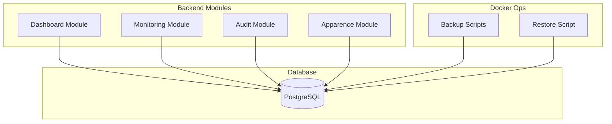
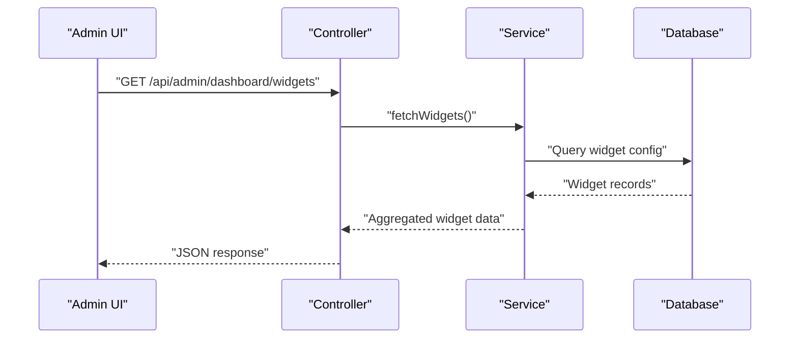
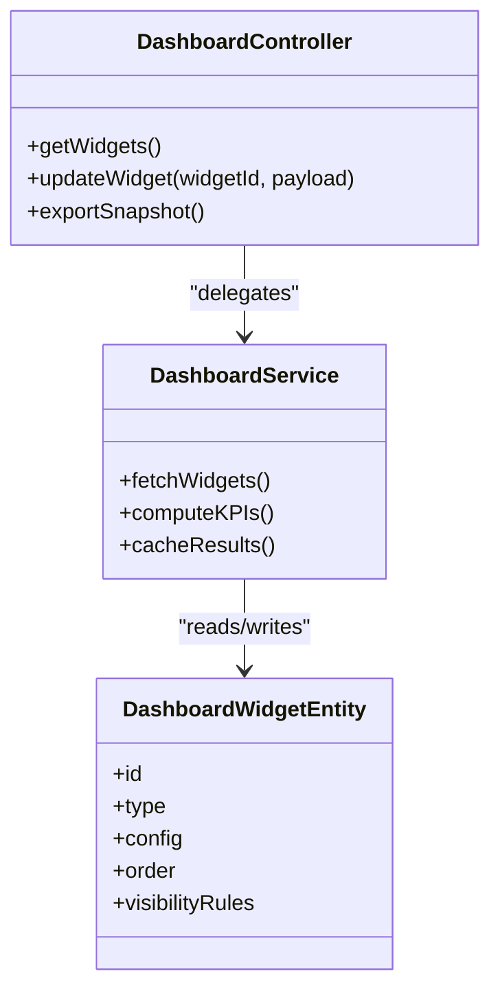
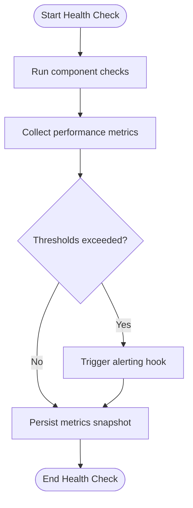
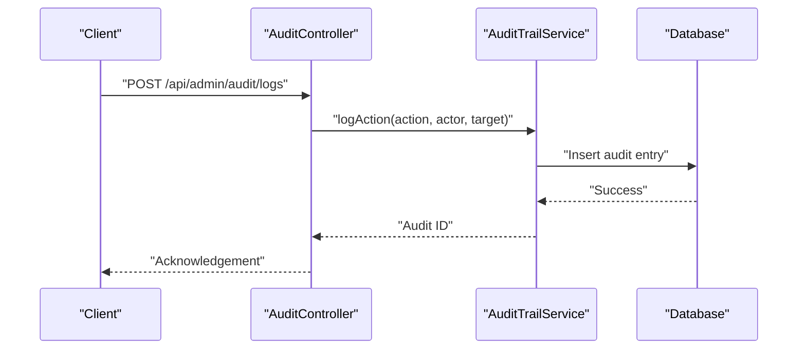
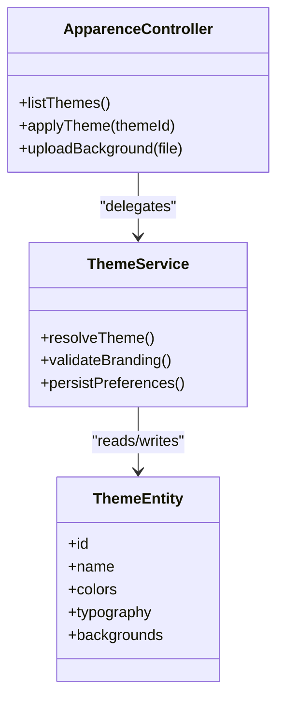
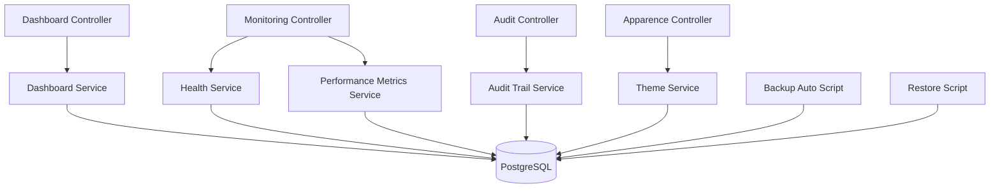

# Administrative Tools

<cite>
**Referenced Files in This Document**
- [backend/src/modules/dashboard/README.md](file://backend/src/modules/dashboard/README.md)
- [backend/src/modules/dashboard/controllers/dashboard.controller.ts](file://backend/src/modules/dashboard/controllers/dashboard.controller.ts)
- [backend/src/modules/dashboard/services/dashboard.service.ts](file://backend/src/modules/dashboard/services/dashboard.service.ts)
- [backend/src/modules/dashboard/entities/dashboard-widget.entity.ts](file://backend/src/modules/dashboard/entities/dashboard-widget.entity.ts)
- [backend/src/modules/monitoring/controllers/monitoring.controller.ts](file://backend/src/modules/monitoring/controllers/monitoring.controller.ts)
- [backend/src/modules/monitoring/services/system-health.service.ts](file://backend/src/modules/monitoring/services/system-health.service.ts)
- [backend/src/modules/monitoring/services/performance-metrics.service.ts](file://backend/src/modules/monitoring/services/performance-metrics.service.ts)
- [backend/src/modules/audit/controllers/audit.controller.ts](file://backend/src/modules/audit/controllers/audit.controller.ts)
- [backend/src/modules/audit/services/audit-trail.service.ts](file://backend/src/modules/audit/services/audit-trail.service.ts)
- [backend/src/modules/audit/entities/audit-log.entity.ts](file://backend/src/modules/audit/entities/audit-log.entity.ts)
- [backend/src/modules/apparence/controllers/apparence.controller.ts](file://backend/src/modules/apparence/controllers/apparence.controller.ts)
- [backend/src/modules/apparence/services/theme.service.ts](file://backend/src/modules/apparence/services/theme.service.ts)
- [backend/src/modules/apparence/entities/theme.entity.ts](file://backend/src/modules/apparence/entities/theme.entity.ts)
- [backend/database/migrations/046-dashboard-config.sql](file://backend/database/migrations/046-dashboard-config.sql)
- [backend/database/migrations/099-add-monitoring-params.sql](file://backend/database/migrations/099-add-monitoring-params.sql)
- [backend/database/migrations/081-module-apparence-fonds.sql](file://backend/database/migrations/081-module-apparence-fonds.sql)
- [docker/scripts/backup-auto.sh](file://docker/scripts/backup-auto.sh)
- [docker/scripts/restore.sh](file://docker/scripts/restore.sh)
- [docker/scripts/cron-backup.txt](file://docker/scripts/cron-backup.txt)
</cite>

## Table of Contents
1. [Introduction](#introduction)
2. [Project Structure](#project-structure)
3. [Core Components](#core-components)
4. [Architecture Overview](#architecture-overview)
5. [Detailed Component Analysis](#detailed-component-analysis)
6. [Dependency Analysis](#dependency-analysis)
7. [Performance Considerations](#performance-considerations)
8. [Troubleshooting Guide](#troubleshooting-guide)
9. [Conclusion](#conclusion)
10. [Appendices](#appendices)

## Introduction
This document provides comprehensive guidance for eLISAschool’s administrative tools, focusing on:
- Real-time dashboard analytics with customizable widgets and KPI tracking
- System monitoring including health checks, performance metrics, and alerting
- Comprehensive audit trail for user actions and system changes
- Appearance customization covering themes, backgrounds, and branding
It also includes practical configuration examples, maintenance procedures (backups), and performance optimization techniques.

## Project Structure
The administrative features are implemented as modular backend components under src/modules, each exposing controllers, services, entities, and migrations. Key modules:
- Dashboard: widget configuration, KPI aggregation, and data visualization endpoints
- Monitoring: health checks, metrics collection, and alerting hooks
- Audit: immutable logging of user actions and system changes
- Apparence: theme and background management for branding

[No sources needed since this diagram shows conceptual workflow, not actual code structure]

## Core Components
- Dashboard Analytics
  - Widget-based layout with configurable types and data sources
  - KPI definitions and aggregation logic
  - REST endpoints to fetch and update dashboard state
- System Monitoring
  - Health check endpoints for service readiness
  - Performance metrics collection and reporting
  - Alerting integration points for notifications or webhooks
- Audit Trail
  - Centralized logging of user actions and system changes
  - Queryable logs with filters and pagination
  - Immutable storage with retention policies
- Appearance Customization
  - Theme management (colors, typography, layouts)
  - Background catalog and per-tenant branding options
  - API to apply and persist appearance settings

**Section sources**
- [backend/src/modules/dashboard/controllers/dashboard.controller.ts](file://backend/src/modules/dashboard/controllers/dashboard.controller.ts)
- [backend/src/modules/dashboard/services/dashboard.service.ts](file://backend/src/modules/dashboard/services/dashboard.service.ts)
- [backend/src/modules/monitoring/controllers/monitoring.controller.ts](file://backend/src/modules/monitoring/controllers/monitoring.controller.ts)
- [backend/src/modules/monitoring/services/system-health.service.ts](file://backend/src/modules/monitoring/services/system-health.service.ts)
- [backend/src/modules/monitoring/services/performance-metrics.service.ts](file://backend/src/modules/monitoring/services/performance-metrics.service.ts)
- [backend/src/modules/audit/controllers/audit.controller.ts](file://backend/src/modules/audit/controllers/audit.controller.ts)
- [backend/src/modules/audit/services/audit-trail.service.ts](file://backend/src/modules/audit/services/audit-trail.service.ts)
- [backend/src/modules/apparence/controllers/apparence.controller.ts](file://backend/src/modules/apparence/controllers/apparence.controller.ts)
- [backend/src/modules/apparence/services/theme.service.ts](file://backend/src/modules/apparence/services/theme.service.ts)

## Architecture Overview
Administrative tools follow a layered architecture:
- Controllers expose REST endpoints
- Services encapsulate business logic and orchestrate data access
- Entities define database schemas
- Migrations manage schema evolution
- Docker scripts support operational tasks like backups and restores

**Diagram sources**
- [backend/src/modules/dashboard/controllers/dashboard.controller.ts](file://backend/src/modules/dashboard/controllers/dashboard.controller.ts)
- [backend/src/modules/dashboard/services/dashboard.service.ts](file://backend/src/modules/dashboard/services/dashboard.service.ts)
- [backend/database/migrations/046-dashboard-config.sql](file://backend/database/migrations/046-dashboard-config.sql)

**Section sources**
- [backend/src/modules/dashboard/controllers/dashboard.controller.ts](file://backend/src/modules/dashboard/controllers/dashboard.controller.ts)
- [backend/src/modules/dashboard/services/dashboard.service.ts](file://backend/src/modules/dashboard/services/dashboard.service.ts)
- [backend/src/modules/monitoring/controllers/monitoring.controller.ts](file://backend/src/modules/monitoring/controllers/monitoring.controller.ts)
- [backend/src/modules/monitoring/services/system-health.service.ts](file://backend/src/modules/monitoring/services/system-health.service.ts)
- [backend/src/modules/monitoring/services/performance-metrics.service.ts](file://backend/src/modules/monitoring/services/performance-metrics.service.ts)
- [backend/src/modules/audit/controllers/audit.controller.ts](file://backend/src/modules/audit/controllers/audit.controller.ts)
- [backend/src/modules/audit/services/audit-trail.service.ts](file://backend/src/modules/audit/services/audit-trail.service.ts)
- [backend/src/modules/apparence/controllers/apparence.controller.ts](file://backend/src/modules/apparence/controllers/apparence.controller.ts)
- [backend/src/modules/apparence/services/theme.service.ts](file://backend/src/modules/apparence/services/theme.service.ts)

## Detailed Component Analysis

### Dashboard Analytics
- Purpose: Provide real-time dashboards with customizable widgets and KPIs
- Key capabilities:
  - Widget CRUD and ordering
  - Data source binding and refresh intervals
  - KPI calculation and caching strategies
  - Export and snapshot functionality
- Data model highlights:
  - Widgets stored with type, configuration, and visibility rules
  - Aggregation queries optimized via indexes
- Example flows:
  - Fetch dashboard layout and compute KPIs
  - Update widget configuration and persist changes

**Diagram sources**
- [backend/src/modules/dashboard/controllers/dashboard.controller.ts](file://backend/src/modules/dashboard/controllers/dashboard.controller.ts)
- [backend/src/modules/dashboard/services/dashboard.service.ts](file://backend/src/modules/dashboard/services/dashboard.service.ts)
- [backend/src/modules/dashboard/entities/dashboard-widget.entity.ts](file://backend/src/modules/dashboard/entities/dashboard-widget.entity.ts)
- [backend/database/migrations/046-dashboard-config.sql](file://backend/database/migrations/046-dashboard-config.sql)

**Section sources**
- [backend/src/modules/dashboard/controllers/dashboard.controller.ts](file://backend/src/modules/dashboard/controllers/dashboard.controller.ts)
- [backend/src/modules/dashboard/services/dashboard.service.ts](file://backend/src/modules/dashboard/services/dashboard.service.ts)
- [backend/src/modules/dashboard/entities/dashboard-widget.entity.ts](file://backend/src/modules/dashboard/entities/dashboard-widget.entity.ts)
- [backend/database/migrations/046-dashboard-config.sql](file://backend/database/migrations/046-dashboard-config.sql)

### System Monitoring
- Purpose: Ensure system reliability through health checks, metrics, and alerts
- Key capabilities:
  - Health endpoint aggregating component status
  - Metrics collection (CPU, memory, DB latency, queue depth)
  - Alerting hooks for critical thresholds
- Example flows:
  - Periodic health checks and metric snapshots
  - Threshold evaluation and alert dispatch

**Diagram sources**
- [backend/src/modules/monitoring/controllers/monitoring.controller.ts](file://backend/src/modules/monitoring/controllers/monitoring.controller.ts)
- [backend/src/modules/monitoring/services/system-health.service.ts](file://backend/src/modules/monitoring/services/system-health.service.ts)
- [backend/src/modules/monitoring/services/performance-metrics.service.ts](file://backend/src/modules/monitoring/services/performance-metrics.service.ts)
- [backend/database/migrations/099-add-monitoring-params.sql](file://backend/database/migrations/099-add-monitoring-params.sql)

**Section sources**
- [backend/src/modules/monitoring/controllers/monitoring.controller.ts](file://backend/src/modules/monitoring/controllers/monitoring.controller.ts)
- [backend/src/modules/monitoring/services/system-health.service.ts](file://backend/src/modules/monitoring/services/system-health.service.ts)
- [backend/src/modules/monitoring/services/performance-metrics.service.ts](file://backend/src/modules/monitoring/services/performance-metrics.service.ts)
- [backend/database/migrations/099-add-monitoring-params.sql](file://backend/database/migrations/099-add-monitoring-params.sql)

### Audit Trail
- Purpose: Maintain an immutable record of user actions and system changes
- Key capabilities:
  - Action logging with actor, target, and context
  - Filtering by date range, entity, and action type
  - Retention and archival strategies
- Example flows:
  - Intercept mutations and append audit entries
  - Query logs for compliance and troubleshooting

**Diagram sources**
- [backend/src/modules/audit/controllers/audit.controller.ts](file://backend/src/modules/audit/controllers/audit.controller.ts)
- [backend/src/modules/audit/services/audit-trail.service.ts](file://backend/src/modules/audit/services/audit-trail.service.ts)
- [backend/src/modules/audit/entities/audit-log.entity.ts](file://backend/src/modules/audit/entities/audit-log.entity.ts)

**Section sources**
- [backend/src/modules/audit/controllers/audit.controller.ts](file://backend/src/modules/audit/controllers/audit.controller.ts)
- [backend/src/modules/audit/services/audit-trail.service.ts](file://backend/src/modules/audit/services/audit-trail.service.ts)
- [backend/src/modules/audit/entities/audit-log.entity.ts](file://backend/src/modules/audit/entities/audit-log.entity.ts)

### Appearance Customization
- Purpose: Manage themes, backgrounds, and branding across tenants
- Key capabilities:
  - Theme creation and assignment
  - Background catalog management
  - Branding parameters (logo, colors, fonts)
- Example flows:
  - Upload background assets and register them
  - Apply theme to tenant and persist preferences

**Diagram sources**
- [backend/src/modules/apparence/controllers/apparence.controller.ts](file://backend/src/modules/apparence/controllers/apparence.controller.ts)
- [backend/src/modules/apparence/services/theme.service.ts](file://backend/src/modules/apparence/services/theme.service.ts)
- [backend/src/modules/apparence/entities/theme.entity.ts](file://backend/src/modules/apparence/entities/theme.entity.ts)
- [backend/database/migrations/081-module-apparence-fonds.sql](file://backend/database/migrations/081-module-apparence-fonds.sql)

**Section sources**
- [backend/src/modules/apparence/controllers/apparence.controller.ts](file://backend/src/modules/apparence/controllers/apparence.controller.ts)
- [backend/src/modules/apparence/services/theme.service.ts](file://backend/src/modules/apparence/services/theme.service.ts)
- [backend/src/modules/apparence/entities/theme.entity.ts](file://backend/src/modules/apparence/entities/theme.entity.ts)
- [backend/database/migrations/081-module-apparence-fonds.sql](file://backend/database/migrations/081-module-apparence-fonds.sql)

### Practical Examples

- Dashboard Configuration
  - Define new widget types and bind to data sources
  - Set refresh intervals and cache durations
  - Configure KPI formulas and thresholds
  - Validate layout persistence and ordering

- Monitoring Setup
  - Enable health checks for core services
  - Configure metric collection intervals
  - Define alert thresholds and notification channels
  - Review metrics dashboards and export reports

- Audit Log Analysis
  - Filter logs by actor, entity, and time window
  - Identify high-frequency actions and anomalies
  - Export logs for compliance reviews
  - Implement retention policies and archival

- Appearance Customization
  - Create custom themes with brand colors and fonts
  - Upload and assign background images
  - Apply theme at tenant level and verify rendering
  - Maintain fallback defaults for missing assets

[No sources needed since this section provides general guidance]

## Dependency Analysis
Administrative modules depend on shared infrastructure such as the database and optional caching layers. Operational scripts interact with the database for backup and restore operations.

**Diagram sources**
- [backend/src/modules/dashboard/controllers/dashboard.controller.ts](file://backend/src/modules/dashboard/controllers/dashboard.controller.ts)
- [backend/src/modules/dashboard/services/dashboard.service.ts](file://backend/src/modules/dashboard/services/dashboard.service.ts)
- [backend/src/modules/monitoring/controllers/monitoring.controller.ts](file://backend/src/modules/monitoring/controllers/monitoring.controller.ts)
- [backend/src/modules/monitoring/services/system-health.service.ts](file://backend/src/modules/monitoring/services/system-health.service.ts)
- [backend/src/modules/monitoring/services/performance-metrics.service.ts](file://backend/src/modules/monitoring/services/performance-metrics.service.ts)
- [backend/src/modules/audit/controllers/audit.controller.ts](file://backend/src/modules/audit/controllers/audit.controller.ts)
- [backend/src/modules/audit/services/audit-trail.service.ts](file://backend/src/modules/audit/services/audit-trail.service.ts)
- [backend/src/modules/apparence/controllers/apparence.controller.ts](file://backend/src/modules/apparence/controllers/apparence.controller.ts)
- [backend/src/modules/apparence/services/theme.service.ts](file://backend/src/modules/apparence/services/theme.service.ts)
- [docker/scripts/backup-auto.sh](file://docker/scripts/backup-auto.sh)
- [docker/scripts/restore.sh](file://docker/scripts/restore.sh)

**Section sources**
- [backend/src/modules/dashboard/controllers/dashboard.controller.ts](file://backend/src/modules/dashboard/controllers/dashboard.controller.ts)
- [backend/src/modules/monitoring/controllers/monitoring.controller.ts](file://backend/src/modules/monitoring/controllers/monitoring.controller.ts)
- [backend/src/modules/audit/controllers/audit.controller.ts](file://backend/src/modules/audit/controllers/audit.controller.ts)
- [backend/src/modules/apparence/controllers/apparence.controller.ts](file://backend/src/modules/apparence/controllers/apparence.controller.ts)
- [docker/scripts/backup-auto.sh](file://docker/scripts/backup-auto.sh)
- [docker/scripts/restore.sh](file://docker/scripts/restore.sh)

## Performance Considerations
- Indexing strategy for frequently queried fields (e.g., timestamps, entity IDs)
- Caching layer for dashboard KPIs and theme resolution
- Batch processing for large audit log exports
- Connection pooling and query optimization for monitoring metrics
- Asynchronous alerting to avoid blocking request paths

[No sources needed since this section provides general guidance]

## Troubleshooting Guide
- Dashboard
  - Verify widget configuration integrity and data source connectivity
  - Inspect cache invalidation and refresh schedules
- Monitoring
  - Confirm health check endpoints respond within expected latency
  - Validate metric collection pipelines and threshold evaluations
- Audit
  - Ensure write permissions for audit tables
  - Check retention policies and archive availability
- Appearance
  - Validate asset URLs and fallback mechanisms
  - Confirm tenant-scoped theme application

**Section sources**
- [backend/src/modules/dashboard/services/dashboard.service.ts](file://backend/src/modules/dashboard/services/dashboard.service.ts)
- [backend/src/modules/monitoring/services/system-health.service.ts](file://backend/src/modules/monitoring/services/system-health.service.ts)
- [backend/src/modules/monitoring/services/performance-metrics.service.ts](file://backend/src/modules/monitoring/services/performance-metrics.service.ts)
- [backend/src/modules/audit/services/audit-trail.service.ts](file://backend/src/modules/audit/services/audit-trail.service.ts)
- [backend/src/modules/apparence/services/theme.service.ts](file://backend/src/modules/apparence/services/theme.service.ts)

## Conclusion
eLISAschool’s administrative tools provide robust capabilities for analytics, monitoring, auditing, and appearance customization. By leveraging modular design, clear APIs, and operational scripts, administrators can maintain system health, ensure compliance, and tailor the user experience effectively.

[No sources needed since this section summarizes without analyzing specific files]

## Appendices

### Maintenance Procedures
- Backup
  - Automated daily backups using cron-driven scripts
  - Manual backup triggers for pre-deployment safety
- Restore
  - Restore from latest or specific backup file
  - Validate database integrity post-restore
- Cron scheduling
  - Configure periodic jobs for backups and cleanup tasks

**Section sources**
- [docker/scripts/backup-auto.sh](file://docker/scripts/backup-auto.sh)
- [docker/scripts/restore.sh](file://docker/scripts/restore.sh)
- [docker/scripts/cron-backup.txt](file://docker/scripts/cron-backup.txt)