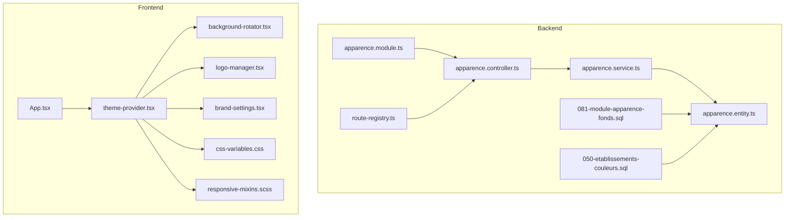
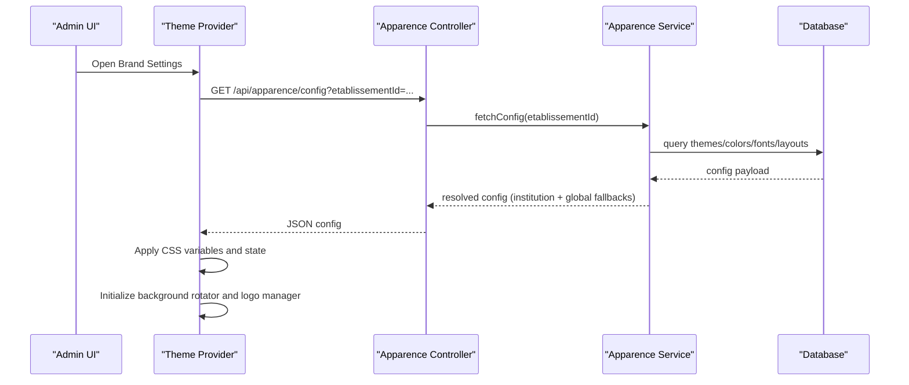
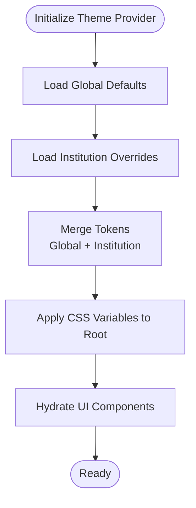
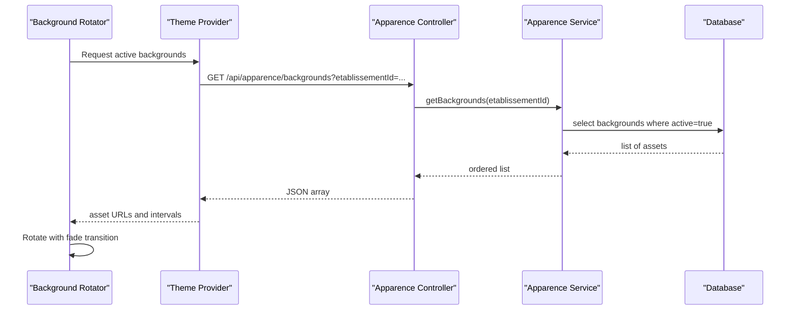
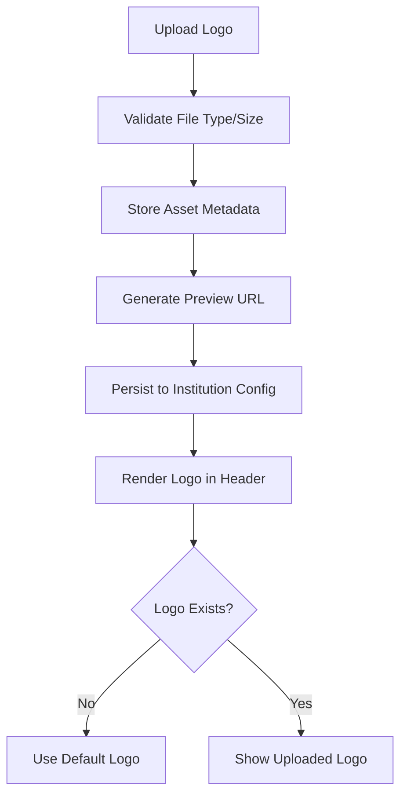
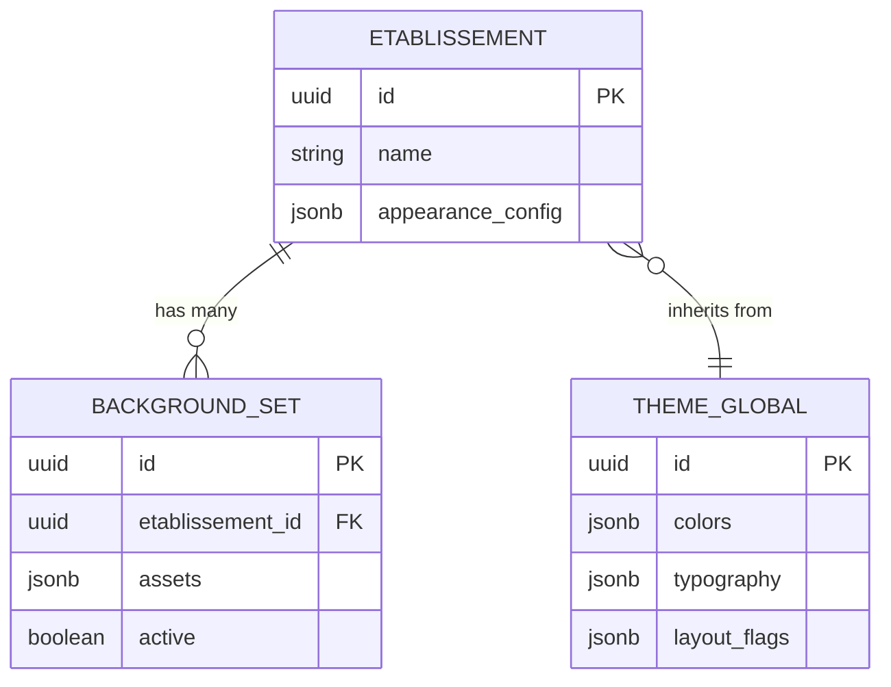
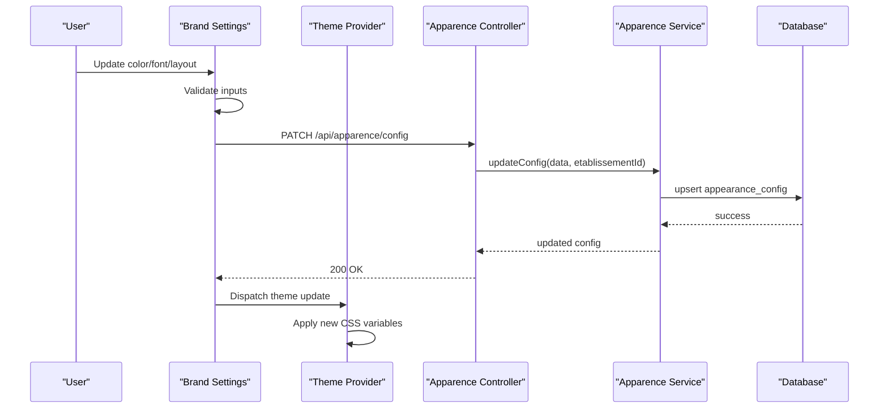
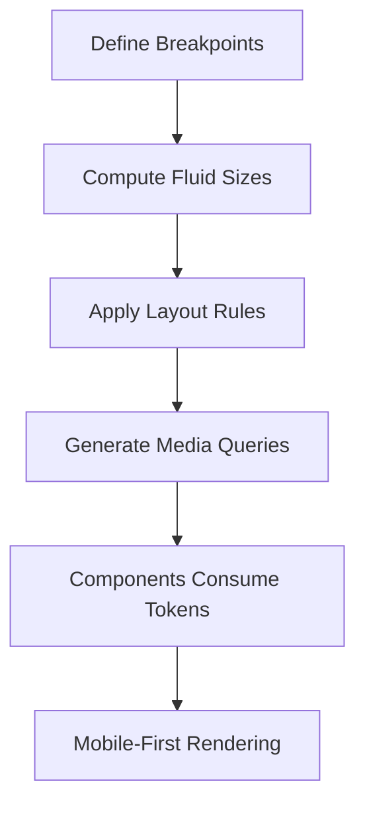
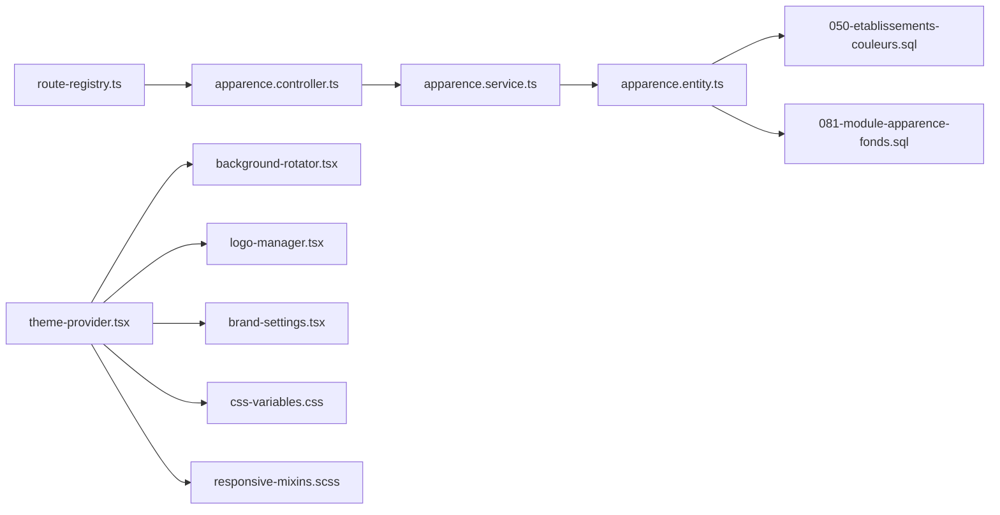

# Appearance & Branding

<cite>
**Referenced Files in This Document**
- [081-module-apparence-fonds.sql](file://backend/database/migrations/081-module-apparence-fonds.sql)
- [050-etablissements-couleurs.sql](file://backend/database/migrations/050-etablissements-couleurs.sql)
- [apparence.controller.ts](file://backend/src/modules/apparence/controllers/apparence.controller.ts)
- [apparence.service.ts](file://backend/src/modules/apparence/services/apparence.service.ts)
- [apparence.entity.ts](file://backend/src/modules/apparence/entities/apparence.entity.ts)
- [apparence.module.ts](file://backend/src/modules/apparence/apparence.module.ts)
- [route-registry.ts](file://backend/src/routes/route-registry.ts)
- [App.tsx](file://frontend/src/App.tsx)
- [theme-provider.tsx](file://frontend/src/components/ui/theme-provider.tsx)
- [background-rotator.tsx](file://frontend/src/features/apparence/background-rotator.tsx)
- [logo-manager.tsx](file://frontend/src/features/apparence/logo-manager.tsx)
- [brand-settings.tsx](file://frontend/src/features/apparence/brand-settings.tsx)
- [css-variables.css](file://frontend/src/styles/css-variables.css)
- [responsive-mixins.scss](file://frontend/src/styles/responsive-mixins.scss)
</cite>

## Table of Contents
1. [Introduction](#introduction)
2. [Project Structure](#project-structure)
3. [Core Components](#core-components)
4. [Architecture Overview](#architecture-overview)
5. [Detailed Component Analysis](#detailed-component-analysis)
6. [Dependency Analysis](#dependency-analysis)
7. [Performance Considerations](#performance-considerations)
8. [Troubleshooting Guide](#troubleshooting-guide)
9. [Conclusion](#conclusion)
10. [Appendices](#appendices)

## Introduction
This document explains eLISAschool’s appearance and branding customization system. It covers theme management (color schemes, typography, layout variations), background image rotation, logo management, institutional branding, per-institution settings, global configuration, responsive design adaptations, CSS variables, component styling overrides, mobile-responsive patterns, theme inheritance and fallbacks, and accessibility compliance.

## Project Structure
The appearance and branding feature spans backend modules for persistence and API, frontend components for UI and runtime theming, and stylesheets for CSS variables and responsive utilities.

**Diagram sources**
- [apparence.controller.ts](file://backend/src/modules/apparence/controllers/apparence.controller.ts)
- [apparence.service.ts](file://backend/src/modules/apparence/services/apparence.service.ts)
- [apparence.entity.ts](file://backend/src/modules/apparence/entities/apparence.entity.ts)
- [apparence.module.ts](file://backend/src/modules/apparence/apparence.module.ts)
- [route-registry.ts](file://backend/src/routes/route-registry.ts)
- [081-module-apparence-fonds.sql](file://backend/database/migrations/081-module-apparence-fonds.sql)
- [050-etablissements-couleurs.sql](file://backend/database/migrations/050-etablissements-couleurs.sql)
- [App.tsx](file://frontend/src/App.tsx)
- [theme-provider.tsx](file://frontend/src/components/ui/theme-provider.tsx)
- [background-rotator.tsx](file://frontend/src/features/apparence/background-rotator.tsx)
- [logo-manager.tsx](file://frontend/src/features/apparence/logo-manager.tsx)
- [brand-settings.tsx](file://frontend/src/features/apparence/brand-settings.tsx)
- [css-variables.css](file://frontend/src/styles/css-variables.css)
- [responsive-mixins.scss](file://frontend/src/styles/responsive-mixins.scss)

**Section sources**
- [apparence.controller.ts](file://backend/src/modules/apparence/controllers/apparence.controller.ts)
- [apparence.service.ts](file://backend/src/modules/apparence/services/apparence.service.ts)
- [apparence.entity.ts](file://backend/src/modules/apparence/entities/apparence.entity.ts)
- [apparence.module.ts](file://backend/src/modules/apparence/apparence.module.ts)
- [route-registry.ts](file://backend/src/routes/route-registry.ts)
- [081-module-apparence-fonds.sql](file://backend/database/migrations/081-module-apparence-fonds.sql)
- [050-etablissements-couleurs.sql](file://backend/database/migrations/050-etablissements-couleurs.sql)
- [App.tsx](file://frontend/src/App.tsx)
- [theme-provider.tsx](file://frontend/src/components/ui/theme-provider.tsx)
- [background-rotator.tsx](file://frontend/src/features/apparence/background-rotator.tsx)
- [logo-manager.tsx](file://frontend/src/features/apparence/logo-manager.tsx)
- [brand-settings.tsx](file://frontend/src/features/apparence/brand-settings.tsx)
- [css-variables.css](file://frontend/src/styles/css-variables.css)
- [responsive-mixins.scss](file://frontend/src/styles/responsive-mixins.scss)

## Core Components
- Theme provider: Supplies theme tokens (colors, typography, spacing) via context and applies CSS variables to the DOM.
- Background rotator: Fetches institution-specific backgrounds and rotates them with safe transitions and performance controls.
- Logo manager: Uploads, previews, and persists logos per institution; provides fallbacks when assets are missing.
- Brand settings: UI for configuring colors, fonts, layouts, and other appearance preferences at global or per-institution scope.
- Backend apparence module: Exposes endpoints to read/write theme and brand data, backed by entities and migrations.

Key responsibilities:
- Centralized token application through CSS variables.
- Per-institution scoping with global defaults.
- Asset handling for logos and backgrounds.
- Responsive behavior driven by mixins and media queries.

**Section sources**
- [theme-provider.tsx](file://frontend/src/components/ui/theme-provider.tsx)
- [background-rotator.tsx](file://frontend/src/features/apparence/background-rotator.tsx)
- [logo-manager.tsx](file://frontend/src/features/apparence/logo-manager.tsx)
- [brand-settings.tsx](file://frontend/src/features/apparence/brand-settings.tsx)
- [apparence.controller.ts](file://backend/src/modules/apparence/controllers/apparence.controller.ts)
- [apparence.service.ts](file://backend/src/modules/apparence/services/apparence.service.ts)
- [apparence.entity.ts](file://backend/src/modules/apparence/entities/apparence.entity.ts)

## Architecture Overview
The system follows a layered architecture:
- Frontend theme provider injects tokens into CSS variables.
- Feature components consume tokens and manage assets.
- Backend controller/service layer persists configurations and assets metadata.
- Database schema stores color schemes, typography, layout flags, and background sets per institution.

**Diagram sources**
- [apparence.controller.ts](file://backend/src/modules/apparence/controllers/apparence.controller.ts)
- [apparence.service.ts](file://backend/src/modules/apparence/services/apparence.service.ts)
- [apparence.entity.ts](file://backend/src/modules/apparence/entities/apparence.entity.ts)
- [theme-provider.tsx](file://frontend/src/components/ui/theme-provider.tsx)
- [background-rotator.tsx](file://frontend/src/features/apparence/background-rotator.tsx)
- [logo-manager.tsx](file://frontend/src/features/apparence/logo-manager.tsx)

## Detailed Component Analysis

### Theme Provider and CSS Variables
- Applies theme tokens to CSS custom properties on the root element.
- Supports light/dark modes and per-institution overrides.
- Provides hooks for components to subscribe to theme changes.

**Diagram sources**
- [theme-provider.tsx](file://frontend/src/components/ui/theme-provider.tsx)
- [css-variables.css](file://frontend/src/styles/css-variables.css)

**Section sources**
- [theme-provider.tsx](file://frontend/src/components/ui/theme-provider.tsx)
- [css-variables.css](file://frontend/src/styles/css-variables.css)

### Background Image Rotation System
- Fetches a list of backgrounds for the current institution.
- Rotates images with fade transitions and respects user motion preferences.
- Implements lazy loading and caching strategies to reduce bandwidth.

**Diagram sources**
- [background-rotator.tsx](file://frontend/src/features/apparence/background-rotator.tsx)
- [apparence.controller.ts](file://backend/src/modules/apparence/controllers/apparence.controller.ts)
- [apparence.service.ts](file://backend/src/modules/apparence/services/apparence.service.ts)
- [081-module-apparence-fonds.sql](file://backend/database/migrations/081-module-apparence-fonds.sql)

**Section sources**
- [background-rotator.tsx](file://frontend/src/features/apparence/background-rotator.tsx)
- [081-module-apparence-fonds.sql](file://backend/database/migrations/081-module-apparence-fonds.sql)

### Logo Management
- Uploads logos per institution with validation and preview.
- Persists metadata and serves optimized variants.
- Falls back to default logo when none is configured.

**Diagram sources**
- [logo-manager.tsx](file://frontend/src/features/apparence/logo-manager.tsx)
- [apparence.controller.ts](file://backend/src/modules/apparence/controllers/apparence.controller.ts)
- [apparence.service.ts](file://backend/src/modules/apparence/services/apparence.service.ts)

**Section sources**
- [logo-manager.tsx](file://frontend/src/features/apparence/logo-manager.tsx)

### Institutional Branding and Per-Institution Settings
- Stores color schemes, typography, and layout flags per institution.
- Merges with global defaults to produce final theme.
- Uses database fields introduced by migrations for colors and backgrounds.

**Diagram sources**
- [050-etablissements-couleurs.sql](file://backend/database/migrations/050-etablissements-couleurs.sql)
- [081-module-apparence-fonds.sql](file://backend/database/migrations/081-module-apparence-fonds.sql)
- [apparence.entity.ts](file://backend/src/modules/apparence/entities/apparence.entity.ts)

**Section sources**
- [050-etablissements-couleurs.sql](file://backend/database/migrations/050-etablissements-couleurs.sql)
- [081-module-apparence-fonds.sql](file://backend/database/migrations/081-module-apparence-fonds.sql)
- [apparence.entity.ts](file://backend/src/modules/apparence/entities/apparence.entity.ts)

### Brand Settings UI
- Presents controls for colors, fonts, layout toggles, and background selection.
- Validates inputs and persists changes via API.
- Reflects immediate updates using theme provider.

**Diagram sources**
- [brand-settings.tsx](file://frontend/src/features/apparence/brand-settings.tsx)
- [apparence.controller.ts](file://backend/src/modules/apparence/controllers/apparence.controller.ts)
- [apparence.service.ts](file://backend/src/modules/apparence/services/apparence.service.ts)
- [theme-provider.tsx](file://frontend/src/components/ui/theme-provider.tsx)

**Section sources**
- [brand-settings.tsx](file://frontend/src/features/apparence/brand-settings.tsx)
- [apparence.controller.ts](file://backend/src/modules/apparence/controllers/apparence.controller.ts)
- [apparence.service.ts](file://backend/src/modules/apparence/services/apparence.service.ts)
- [theme-provider.tsx](file://frontend/src/components/ui/theme-provider.tsx)

### Responsive Design Adaptations
- Mixins provide consistent breakpoints and fluid sizing.
- Components adapt layout and typography based on screen size.
- Backgrounds and logos scale appropriately across devices.

**Diagram sources**
- [responsive-mixins.scss](file://frontend/src/styles/responsive-mixins.scss)
- [theme-provider.tsx](file://frontend/src/components/ui/theme-provider.tsx)

**Section sources**
- [responsive-mixins.scss](file://frontend/src/styles/responsive-mixins.scss)

## Dependency Analysis
- Controllers depend on services for business logic and data access.
- Services depend on entities and database schema defined by migrations.
- Frontend components depend on theme provider and styles.
- Route registry wires controllers to HTTP endpoints.

**Diagram sources**
- [route-registry.ts](file://backend/src/routes/route-registry.ts)
- [apparence.controller.ts](file://backend/src/modules/apparence/controllers/apparence.controller.ts)
- [apparence.service.ts](file://backend/src/modules/apparence/services/apparence.service.ts)
- [apparence.entity.ts](file://backend/src/modules/apparence/entities/apparence.entity.ts)
- [050-etablissements-couleurs.sql](file://backend/database/migrations/050-etablissements-couleurs.sql)
- [081-module-apparence-fonds.sql](file://backend/database/migrations/081-module-apparence-fonds.sql)
- [theme-provider.tsx](file://frontend/src/components/ui/theme-provider.tsx)
- [background-rotator.tsx](file://frontend/src/features/apparence/background-rotator.tsx)
- [logo-manager.tsx](file://frontend/src/features/apparence/logo-manager.tsx)
- [brand-settings.tsx](file://frontend/src/features/apparence/brand-settings.tsx)
- [css-variables.css](file://frontend/src/styles/css-variables.css)
- [responsive-mixins.scss](file://frontend/src/styles/responsive-mixins.scss)

**Section sources**
- [route-registry.ts](file://backend/src/routes/route-registry.ts)
- [apparence.controller.ts](file://backend/src/modules/apparence/controllers/apparence.controller.ts)
- [apparence.service.ts](file://backend/src/modules/apparence/services/apparence.service.ts)
- [apparence.entity.ts](file://backend/src/modules/apparence/entities/apparence.entity.ts)
- [050-etablissements-couleurs.sql](file://backend/database/migrations/050-etablissements-couleurs.sql)
- [081-module-apparence-fonds.sql](file://backend/database/migrations/081-module-apparence-fonds.sql)
- [theme-provider.tsx](file://frontend/src/components/ui/theme-provider.tsx)
- [background-rotator.tsx](file://frontend/src/features/apparence/background-rotator.tsx)
- [logo-manager.tsx](file://frontend/src/features/apparence/logo-manager.tsx)
- [brand-settings.tsx](file://frontend/src/features/apparence/brand-settings.tsx)
- [css-variables.css](file://frontend/src/styles/css-variables.css)
- [responsive-mixins.scss](file://frontend/src/styles/responsive-mixins.scss)

## Performance Considerations
- Prefer CSS variables over inline styles to minimize reflows.
- Lazy-load background images and use appropriate sizes.
- Debounce theme updates during rapid configuration changes.
- Cache theme payloads client-side with short TTLs.
- Optimize logo uploads with compression and multiple resolutions.

[No sources needed since this section provides general guidance]

## Troubleshooting Guide
Common issues and resolutions:
- Missing institution colors: Ensure migration 050 has been applied and that appearance_config contains required keys.
- Backgrounds not rotating: Verify active flag in backgrounds table and network responses from the controller.
- Logo not displaying: Check upload validation results and fallback logic in the logo manager.
- Theme not applying: Confirm CSS variables are set on the root element and no overriding styles exist.

**Section sources**
- [050-etablissements-couleurs.sql](file://backend/database/migrations/050-etablissements-couleurs.sql)
- [081-module-apparence-fonds.sql](file://backend/database/migrations/081-module-apparence-fonds.sql)
- [apparence.controller.ts](file://backend/src/modules/apparence/controllers/apparence.controller.ts)
- [logo-manager.tsx](file://frontend/src/features/apparence/logo-manager.tsx)
- [theme-provider.tsx](file://frontend/src/components/ui/theme-provider.tsx)

## Conclusion
eLISAschool’s appearance and branding system provides a robust, multi-tenant theming solution. It centralizes tokens via CSS variables, supports per-institution overrides, manages assets efficiently, and adapts responsively. The layered backend ensures reliable persistence and resolution of global and institutional configurations.

[No sources needed since this section summarizes without analyzing specific files]

## Appendices

### Practical Examples

- Creating a custom theme:
  - Define color tokens and typography in the brand settings UI.
  - Save configuration; the theme provider applies CSS variables immediately.
  - Reference tokens in components via CSS variables.

- Uploading brand assets:
  - Use the logo manager to upload institution logos.
  - Validate file types and sizes; preview before saving.
  - Assets persist with metadata and serve optimized variants.

- Configuring appearance preferences:
  - Adjust layout flags and background sets per institution.
  - Verify changes via API responses and UI hydration.

- Accessibility compliance:
  - Ensure sufficient contrast ratios for all color combinations.
  - Respect reduced motion preferences in background rotation.
  - Provide keyboard-accessible controls in brand settings.

[No sources needed since this section provides general guidance]