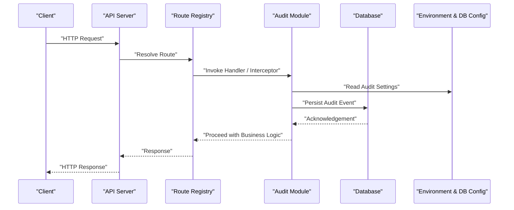
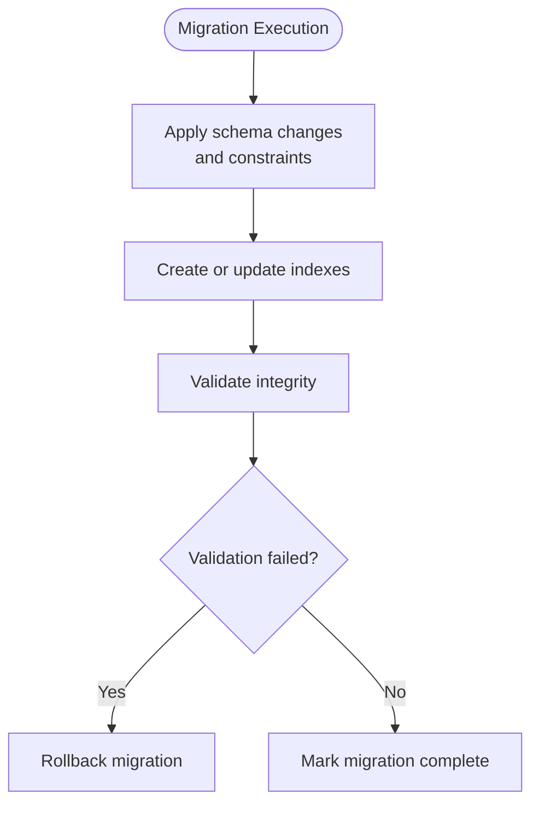
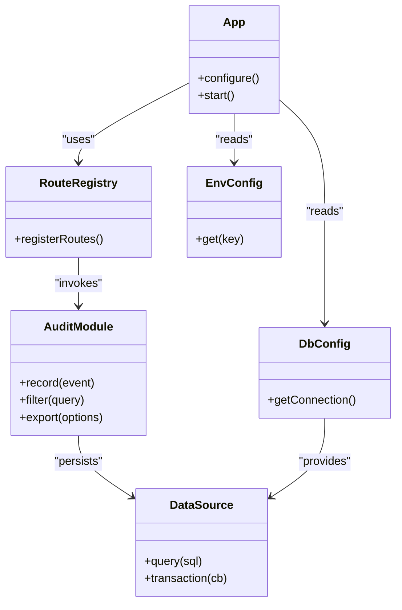
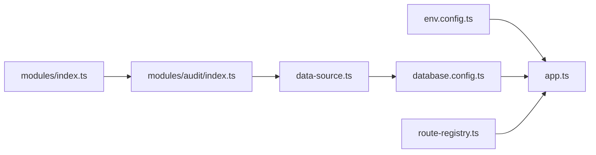

# Audit & Compliance

<cite>
**Referenced Files in This Document**
- [audit-trail.md](file://backend/docs/audit-trail.md)
- [IMPLEMENTATION-AUDIT-TRAIL.md](file://docs/implementations/IMPLEMENTATION-AUDIT-TRAIL.md)
- [AUDIT-FRONTEND-STRUCTURE-ACADEMIQUE-COMPLET.md](file://docs/audits/AUDIT-FRONTEND-STRUCTURE-ACADEMIQUE-COMPLET.md)
- [AUDIT-INSTRUMENTATION-GUIDE.md](file://docs/audits/AUDIT-INSTRUMENTATION-GUIDE.md)
- [ANALYSE-PERMISSIONS-CONFIGURATION-AUDIT.md](file://docs/analyses/ANALYSE-PERMISSIONS-CONFIGURATION-AUDIT.md)
- [RAPPORT-AUDIT-COHÉRENCE-NOUVELLES-FONCTIONNALITES.md](file://docs/rapports/RAPPORT-AUDIT-COHÉRENCE-NOUVELLES-FONCTIONNALITES.md)
- [037-gamification-tracabilite.ts](file://backend/database/migrations/037-gamification-tracabilite.ts)
- [038-index-performance-gamification-suivi.ts](file://backend/database/migrations/038-index-performance-gamification-suivi.ts)
- [046-preferences-utilisateur-et-config.sql](file://backend/database/migrations/046-preferences-utilisateur-et-config.sql)
- [046-organisation-performance-avancee.sql](file://backend/database/migrations/046-organisation-performance-avancee.sql)
- [099-add-monitoring-params.sql](file://backend/database/migrations/099-add-monitoring-params.sql)
- [app.ts](file://backend/src/app.ts)
- [index.ts](file://backend/src/index.ts)
- [route-registry.ts](file://backend/src/routes/route-registry.ts)
- [data-source.ts](file://backend/src/database/data-source.ts)
- [env.config.ts](file://backend/src/config/env.config.ts)
- [database.config.ts](file://backend/src/config/database.config.ts)
- [index.ts](file://backend/src/modules/index.ts)
- [audit/index.ts](file://backend/src/modules/audit/index.ts)
</cite>

## Table of Contents
1. [Introduction](#introduction)
2. [Project Structure](#project-structure)
3. [Core Components](#core-components)
4. [Architecture Overview](#architecture-overview)
5. [Detailed Component Analysis](#detailed-component-analysis)
6. [Dependency Analysis](#dependency-analysis)
7. [Performance Considerations](#performance-considerations)
8. [Troubleshooting Guide](#troubleshooting-guide)
9. [Conclusion](#conclusion)
10. [Appendices](#appendices)

## Introduction
This document describes eLISAschool’s audit and compliance system, focusing on comprehensive audit trail logging for user actions, system changes, and data modifications. It explains the audit log structure, retention and archival strategies, filtering and search capabilities, reporting features, GDPR-related privacy controls, security measures around audit logs, and techniques for analysis, trend identification, and forensic investigations. Practical guidance is included for implementing custom audit interceptors, configuring audit rules, and generating compliance reports.

## Project Structure
The audit and compliance functionality spans documentation, database migrations, and backend modules:
- Documentation and guides provide conceptual overviews, implementation notes, and operational procedures.
- Database migrations introduce or enhance tables and indexes related to auditability and monitoring.
- Backend application wiring integrates configuration, routes, and module initialization.

```mermaid
graph TB
subgraph "Documentation"
D1["audit-trail.md"]
D2["IMPLEMENTATION-AUDIT-TRAIL.md"]
D3["AUDIT-INSTRUMENTATION-GUIDE.md"]
D4["AUDIT-FRONTEND-STRUCTURE-ACADEMIQUE-COMPLET.md"]
D5["ANALYSE-PERMISSIONS-CONFIGURATION-AUDIT.md"]
D6["RAPPORT-AUDIT-COHÉRENCE-NOUVELLES-FONCTIONNALITES.md"]
end
subgraph "Database Migrations"
M1["037-gamification-tracabilite.ts"]
M2["038-index-performance-gamification-suivi.ts"]
M3["046-preferences-utilisateur-et-config.sql"]
M4["046-organisation-performance-avancee.sql"]
M5["099-add-monitoring-params.sql"]
end
subgraph "Backend App"
A1["app.ts"]
A2["index.ts"]
A3["routes/route-registry.ts"]
A4["config/env.config.ts"]
A5["config/database.config.ts"]
A6["database/data-source.ts"]
A7["modules/index.ts"]
A8["modules/audit/index.ts"]
end
D1 --> A8
D2 --> A8
D3 --> A8
D4 --> A8
D5 --> A8
D6 --> A8
M1 --> A6
M2 --> A6
M3 --> A6
M4 --> A6
M5 --> A6
A1 --> A3
A1 --> A4
A1 --> A5
A1 --> A6
A2 --> A1
A7 --> A8
```

**Diagram sources**
- [audit-trail.md](file://backend/docs/audit-trail.md)
- [IMPLEMENTATION-AUDIT-TRAIL.md](file://docs/implementations/IMPLEMENTATION-AUDIT-TRAIL.md)
- [AUDIT-INSTRUMENTATION-GUIDE.md](file://docs/audits/AUDIT-INSTRUMENTATION-GUIDE.md)
- [AUDIT-FRONTEND-STRUCTURE-ACADEMIQUE-COMPLET.md](file://docs/audits/AUDIT-FRONTEND-STRUCTURE-ACADEMIQUE-COMPLET.md)
- [ANALYSE-PERMISSIONS-CONFIGURATION-AUDIT.md](file://docs/analyses/ANALYSE-PERMISSIONS-CONFIGURATION-AUDIT.md)
- [RAPPORT-AUDIT-COHÉRENTE-NOUVELLES-FONCTIONNALITES.md](file://docs/rapports/RAPPORT-AUDIT-COHÉRENCE-NOUVELLES-FONCTIONNALITES.md)
- [037-gamification-tracabilite.ts](file://backend/database/migrations/037-gamification-tracabilite.ts)
- [038-index-performance-gamification-suivi.ts](file://backend/database/migrations/038-index-performance-gamification-suivi.ts)
- [046-preferences-utilisateur-et-config.sql](file://backend/database/migrations/046-preferences-utilisateur-et-config.sql)
- [046-organisation-performance-avancee.sql](file://backend/database/migrations/046-organisation-performance-avancee.sql)
- [099-add-monitoring-params.sql](file://backend/database/migrations/099-add-monitoring-params.sql)
- [app.ts](file://backend/src/app.ts)
- [index.ts](file://backend/src/index.ts)
- [route-registry.ts](file://backend/src/routes/route-registry.ts)
- [data-source.ts](file://backend/src/database/data-source.ts)
- [env.config.ts](file://backend/src/config/env.config.ts)
- [database.config.ts](file://backend/src/config/database.config.ts)
- [index.ts](file://backend/src/modules/index.ts)
- [audit/index.ts](file://backend/src/modules/audit/index.ts)

**Section sources**
- [audit-trail.md](file://backend/docs/audit-trail.md)
- [IMPLEMENTATION-AUDIT-TRAIL.md](file://docs/implementations/IMPLEMENTATION-AUDIT-TRAIL.md)
- [AUDIT-INSTRUMENTATION-GUIDE.md](file://docs/audits/AUDIT-INSTRUMENTATION-GUIDE.md)
- [AUDIT-FRONTEND-STRUCTURE-ACADEMIQUE-COMPLET.md](file://docs/audits/AUDIT-FRONTEND-STRUCTURE-ACADEMIQUE-COMPLET.md)
- [ANALYSE-PERMISSIONS-CONFIGURATION-AUDIT.md](file://docs/analyses/ANALYSE-PERMISSIONS-CONFIGURATION-AUDIT.md)
- [RAPPORT-AUDIT-COHÉRENCE-NOUVELLES-FONCTIONNALITES.md](file://docs/rapports/RAPPORT-AUDIT-COHÉRENCE-NOUVELLES-FONCTIONNALITES.md)
- [037-gamification-tracabilite.ts](file://backend/database/migrations/037-gamification-tracabilite.ts)
- [038-index-performance-gamification-suivi.ts](file://backend/database/migrations/038-index-performance-gamification-suivi.ts)
- [046-preferences-utilisateur-et-config.sql](file://backend/database/migrations/046-preferences-utilisateur-et-config.sql)
- [046-organisation-performance-avancee.sql](file://backend/database/migrations/046-organisation-performance-avancee.sql)
- [099-add-monitoring-params.sql](file://backend/database/migrations/099-add-monitoring-params.sql)
- [app.ts](file://backend/src/app.ts)
- [index.ts](file://backend/src/index.ts)
- [route-registry.ts](file://backend/src/routes/route-registry.ts)
- [data-source.ts](file://backend/src/database/data-source.ts)
- [env.config.ts](file://backend/src/config/env.config.ts)
- [database.config.ts](file://backend/src/config/database.config.ts)
- [index.ts](file://backend/src/modules/index.ts)
- [audit/index.ts](file://backend/src/modules/audit/index.ts)

## Core Components
- Audit Trail Documentation: Provides conceptual foundations, terminology, and recommended practices for capturing and retaining audit events across the platform.
- Implementation Guide: Details how audit trails are integrated into modules, including patterns for recording events and associating them with users and tenants.
- Instrumentation Guide: Describes instrumentation points, naming conventions, and metrics that support auditing and observability.
- Frontend Audit Notes: Highlights frontend considerations for consistent audit context propagation (e.g., session identifiers).
- Permissions and Configuration Audit Analysis: Explains how permissions and configuration changes are tracked and audited.
- Coherence Report: Summarizes audit coverage across new features and identifies gaps.
- Database Migrations: Introduce or optimize structures and indexes used by auditability and monitoring components.
- Application Wiring: Integrates environment configuration, database connectivity, route registration, and module initialization where audit services may be consumed.

Key responsibilities:
- Capture: Record user-initiated actions, system-triggered changes, and data modifications with sufficient context.
- Persist: Store audit records securely with integrity-preserving fields and timestamps.
- Query: Provide efficient filtering and search capabilities for administrators.
- Retain: Enforce retention policies and archive mechanisms for long-term compliance.
- Secure: Protect audit logs from tampering and unauthorized access.
- Analyze: Support trend identification and forensic investigation workflows.

**Section sources**
- [audit-trail.md](file://backend/docs/audit-trail.md)
- [IMPLEMENTATION-AUDIT-TRAIL.md](file://docs/implementations/IMPLEMENTATION-AUDIT-TRAIL.md)
- [AUDIT-INSTRUMENTATION-GUIDE.md](file://docs/audits/AUDIT-INSTRUMENTATION-GUIDE.md)
- [AUDIT-FRONTEND-STRUCTURE-ACADEMIQUE-COMPLET.md](file://docs/audits/AUDIT-FRONTEND-STRUCTURE-ACADEMIQUE-COMPLET.md)
- [ANALYSE-PERMISSIONS-CONFIGURATION-AUDIT.md](file://docs/analyses/ANALYSE-PERMISSIONS-CONFIGURATION-AUDIT.md)
- [RAPPORT-AUDIT-COHÉRENCE-NOUVELLES-FONCTIONNALITES.md](file://docs/rapports/RAPPORT-AUDIT-COHÉRENCE-NOUVELLES-FONCTIONNALITES.md)
- [037-gamification-tracabilite.ts](file://backend/database/migrations/037-gamification-tracabilite.ts)
- [038-index-performance-gamification-suivi.ts](file://backend/database/migrations/038-index-performance-gamification-suivi.ts)
- [046-preferences-utilisateur-et-config.sql](file://backend/database/migrations/046-preferences-utilisateur-et-config.sql)
- [046-organisation-performance-avancee.sql](file://backend/database/migrations/046-organisation-performance-avancee.sql)
- [099-add-monitoring-params.sql](file://backend/database/migrations/099-add-monitoring-params.sql)
- [app.ts](file://backend/src/app.ts)
- [index.ts](file://backend/src/index.ts)
- [route-registry.ts](file://backend/src/routes/route-registry.ts)
- [data-source.ts](file://backend/src/database/data-source.ts)
- [env.config.ts](file://backend/src/config/env.config.ts)
- [database.config.ts](file://backend/src/config/database.config.ts)
- [index.ts](file://backend/src/modules/index.ts)
- [audit/index.ts](file://backend/src/modules/audit/index.ts)

## Architecture Overview
The audit architecture captures events at multiple layers and persists them with strong integrity guarantees. The following diagram maps key runtime components and their interactions.

**Diagram sources**
- [app.ts](file://backend/src/app.ts)
- [route-registry.ts](file://backend/src/routes/route-registry.ts)
- [audit/index.ts](file://backend/src/modules/audit/index.ts)
- [env.config.ts](file://backend/src/config/env.config.ts)
- [database.config.ts](file://backend/src/config/database.config.ts)
- [data-source.ts](file://backend/src/database/data-source.ts)

## Detailed Component Analysis

### Audit Log Structure and Semantics
- Purpose: Provide a canonical record of who did what, when, where, and why.
- Typical fields include: event identifier, timestamp, actor identity, tenant scope, resource type and identifier, action type, outcome, correlation identifiers, and optional payload deltas.
- Integrity: Immutable append-only semantics; cryptographic hashing or checksums can be applied at storage boundaries.
- Context: Correlation IDs propagate across requests to link related events.

Operational implications:
- Deterministic event types improve filtering and reporting.
- Tenant scoping ensures multi-tenant isolation.
- Minimal payloads reduce storage overhead while preserving traceability.

**Section sources**
- [audit-trail.md](file://backend/docs/audit-trail.md)
- [IMPLEMENTATION-AUDIT-TRAIL.md](file://docs/implementations/IMPLEMENTATION-AUDIT-TRAIL.md)
- [AUDIT-INSTRUMENTATION-GUIDE.md](file://docs/audits/AUDIT-INSTRUMENTATION-GUIDE.md)

### Retention Policies and Archival Mechanisms
- Retention: Define minimum retention periods aligned with legal and institutional requirements.
- Tiering: Hot storage for recent events; cold storage for older archives.
- Archival: Periodic export to immutable storage with verifiable checksums.
- Purging: Automated deletion after retention expiry with audit of purge operations.

Implementation considerations:
- Policy-driven jobs scheduled via cron or task queues.
- Export formats suitable for compliance review (e.g., CSV, JSON lines).
- Indexes optimized for time-range queries and actor-based lookups.

**Section sources**
- [audit-trail.md](file://backend/docs/audit-trail.md)
- [IMPLEMENTATION-AUDIT-TRAIL.md](file://docs/implementations/IMPLEMENTATION-AUDIT-TRAIL.md)

### Filtering, Search, and Reporting
- Filters: By date range, actor, tenant, resource type, action type, outcome, and correlation ID.
- Search: Full-text search over contextual fields; faceted navigation for common dimensions.
- Reports: Scheduled exports and ad-hoc queries for compliance dashboards.
- Access Control: Role-based access to audit views and exports.

Performance tips:
- Pre-aggregated summaries for high-cardinality filters.
- Materialized views for frequent report queries.
- Pagination and cursor-based traversal for large result sets.

**Section sources**
- [AUDIT-INSTRUMENTATION-GUIDE.md](file://docs/audits/AUDIT-INSTRUMENTATION-GUIDE.md)
- [ANALYSE-PERMISSIONS-CONFIGURATION-AUDIT.md](file://docs/analyses/ANALYSE-PERMISSIONS-CONFIGURATION-AUDIT.md)
- [RAPPORT-AUDIT-COHÉRENCE-NOUVELLES-FONCTIONNALITES.md](file://docs/rapports/RAPPORT-AUDIT-COHÉRENCE-NOUVELLES-FONCTIONNALITES.md)

### Custom Audit Interceptors and Rules
- Interceptors: Middleware or decorators that capture request/response metadata and business outcomes.
- Rules: Declarative configurations specifying which actions to audit, sensitive field masking, and conditional inclusion.
- Extensibility: Pluggable providers for different persistence backends.

Best practices:
- Avoid capturing secrets or unnecessary PII.
- Normalize event schemas across modules.
- Ensure idempotency for retry scenarios.

**Section sources**
- [IMPLEMENTATION-AUDIT-TRAIL.md](file://docs/implementations/IMPLEMENTATION-AUDIT-TRAIL.md)
- [AUDIT-INSTRUMENTATION-GUIDE.md](file://docs/audits/AUDIT-INSTRUMENTATION-GUIDE.md)

### GDPR Compliance, Data Privacy Controls, and Security
- Minimization: Limit captured personal data to what is necessary.
- Consent and Lawful Basis: Align audit triggers with processing purposes.
- Right to Erasure: Anonymize or redact personal data in historical logs per policy.
- Access Controls: Strict RBAC for audit log access; encryption at rest and in transit.
- Integrity: Append-only storage, checksum verification, and tamper-evident archives.

Operational safeguards:
- Masking of sensitive fields by default.
- Separate secure channels for audit exports.
- Regular audits of audit log access.

**Section sources**
- [audit-trail.md](file://backend/docs/audit-trail.md)
- [ANALYSE-PERMISSIONS-CONFIGURATION-AUDIT.md](file://docs/analyses/ANALYSE-PERMISSIONS-CONFIGURATION-AUDIT.md)

### Analysis, Trend Identification, and Forensic Investigation
- Trend Analysis: Identify spikes in specific actions, anomalous actors, or unusual resource access patterns.
- Forensics: Reconstruct timelines using correlation IDs and cross-reference events across modules.
- Dashboards: Real-time and historical views for SOC and compliance teams.
- Alerts: Threshold-based notifications for critical audit events.

Data preparation:
- Time-series indexes for efficient aggregation.
- Normalized taxonomies for actions and resources.
- Standardized correlation identifiers.

**Section sources**
- [AUDIT-INSTRUMENTATION-GUIDE.md](file://docs/audits/AUDIT-INSTRUMENTATION-GUIDE.md)
- [RAPPORT-AUDIT-COHÉRENCE-NOUVELLES-FONCTIONNALITES.md](file://docs/rapports/RAPPORT-AUDIT-COHÉRENCE-NOUVELLES-FONCTIONNALITES.md)

### Database Structures and Indexing for Auditability
Migrations relevant to auditability and performance:
- Tracing and tracking enhancements for gamification and follow-up activities.
- Performance indexes to accelerate query patterns typical in audit retrieval.
- Preferences and configuration structures that influence audit behavior.
- Organization performance optimizations that benefit audit workloads.
- Monitoring parameters that complement audit telemetry.

**Diagram sources**
- [037-gamification-tracabilite.ts](file://backend/database/migrations/037-gamification-tracabilite.ts)
- [038-index-performance-gamification-suivi.ts](file://backend/database/migrations/038-index-performance-gamification-suivi.ts)
- [046-preferences-utilisateur-et-config.sql](file://backend/database/migrations/046-preferences-utilisateur-et-config.sql)
- [046-organisation-performance-avancee.sql](file://backend/database/migrations/046-organisation-performance-avancee.sql)
- [099-add-monitoring-params.sql](file://backend/database/migrations/099-add-monitoring-params.sql)

**Section sources**
- [037-gamification-tracabilite.ts](file://backend/database/migrations/037-gamification-tracabilite.ts)
- [038-index-performance-gamification-suivi.ts](file://backend/database/migrations/038-index-performance-gamification-suivi.ts)
- [046-preferences-utilisateur-et-config.sql](file://backend/database/migrations/046-preferences-utilisateur-et-config.sql)
- [046-organisation-performance-avancee.sql](file://backend/database/migrations/046-organisation-performance-avancee.sql)
- [099-add-monitoring-params.sql](file://backend/database/migrations/099-add-monitoring-params.sql)

### Application Integration Points
- Environment and database configuration drive audit settings and connectivity.
- Route registry centralizes endpoint definitions, enabling consistent interception and logging.
- Module initialization wires audit services into feature modules.

**Diagram sources**
- [app.ts](file://backend/src/app.ts)
- [route-registry.ts](file://backend/src/routes/route-registry.ts)
- [audit/index.ts](file://backend/src/modules/audit/index.ts)
- [env.config.ts](file://backend/src/config/env.config.ts)
- [database.config.ts](file://backend/src/config/database.config.ts)
- [data-source.ts](file://backend/src/database/data-source.ts)

**Section sources**
- [app.ts](file://backend/src/app.ts)
- [index.ts](file://backend/src/index.ts)
- [route-registry.ts](file://backend/src/routes/route-registry.ts)
- [data-source.ts](file://backend/src/database/data-source.ts)
- [env.config.ts](file://backend/src/config/env.config.ts)
- [database.config.ts](file://backend/src/config/database.config.ts)
- [index.ts](file://backend/src/modules/index.ts)
- [audit/index.ts](file://backend/src/modules/audit/index.ts)

## Dependency Analysis
The audit subsystem depends on configuration, routing, and database layers. The following diagram highlights these relationships.

**Diagram sources**
- [env.config.ts](file://backend/src/config/env.config.ts)
- [database.config.ts](file://backend/src/config/database.config.ts)
- [data-source.ts](file://backend/src/database/data-source.ts)
- [app.ts](file://backend/src/app.ts)
- [route-registry.ts](file://backend/src/routes/route-registry.ts)
- [audit/index.ts](file://backend/src/modules/audit/index.ts)
- [index.ts](file://backend/src/modules/index.ts)

**Section sources**
- [env.config.ts](file://backend/src/config/env.config.ts)
- [database.config.ts](file://backend/src/config/database.config.ts)
- [data-source.ts](file://backend/src/database/data-source.ts)
- [app.ts](file://backend/src/app.ts)
- [route-registry.ts](file://backend/src/routes/route-registry.ts)
- [audit/index.ts](file://backend/src/modules/audit/index.ts)
- [index.ts](file://backend/src/modules/index.ts)

## Performance Considerations
- Indexing: Use composite indexes on timestamp, actor, tenant, and resource type to optimize common audit queries.
- Batching: Batch writes for high-throughput scenarios to reduce transaction overhead.
- Partitioning: Consider time-based partitioning for large audit tables to improve maintenance and query performance.
- Caching: Cache hot aggregates and frequently accessed reference data for reporting.
- Backpressure: Implement rate limiting and queueing to protect the database during spikes.

[No sources needed since this section provides general guidance]

## Troubleshooting Guide
Common issues and resolutions:
- Missing audit events: Verify interceptor registration and route-level hooks; ensure correlation IDs propagate.
- Slow queries: Review indexes and query plans; add missing composite indexes for filter combinations.
- Excessive payload size: Adjust rule configuration to mask or exclude non-essential fields.
- Retention failures: Check scheduled job status and storage availability; validate archival checksums.
- Access denials: Confirm RBAC assignments for audit endpoints and export functions.

Diagnostic steps:
- Inspect environment variables controlling audit behavior.
- Validate database connectivity and schema version.
- Review error logs around audit persistence and archival jobs.

**Section sources**
- [AUDIT-INSTRUMENTATION-GUIDE.md](file://docs/audits/AUDIT-INSTRUMENTATION-GUIDE.md)
- [ANALYSE-PERMISSIONS-CONFIGURATION-AUDIT.md](file://docs/analyses/ANALYSE-PERMISSIONS-CONFIGURATION-AUDIT.md)

## Conclusion
eLISAschool’s audit and compliance system provides a robust foundation for capturing, storing, querying, and analyzing audit events across the platform. With clear retention and archival strategies, strong privacy and security controls, and extensible interception and rule mechanisms, it supports both day-to-day operations and rigorous compliance requirements. Continuous improvement through indexing, partitioning, and analytics enables effective trend identification and forensic investigations.

[No sources needed since this section summarizes without analyzing specific files]

## Appendices

### Practical Examples and How-To References
- Implementing custom audit interceptors: See the implementation guide for patterns and best practices.
- Configuring audit rules: Refer to the instrumentation guide for rule syntax and examples.
- Generating compliance reports: Consult the coherence report and instrumentation guide for report templates and scheduling.

**Section sources**
- [IMPLEMENTATION-AUDIT-TRAIL.md](file://docs/implementations/IMPLEMENTATION-AUDIT-TRAIL.md)
- [AUDIT-INSTRUMENTATION-GUIDE.md](file://docs/audits/AUDIT-INSTRUMENTATION-GUIDE.md)
- [RAPPORT-AUDIT-COHÉRENCE-NOUVELLES-FONCTIONNALITES.md](file://docs/rapports/RAPPORT-AUDIT-COHÉRENCE-NOUVELLES-FONCTIONNALITES.md)