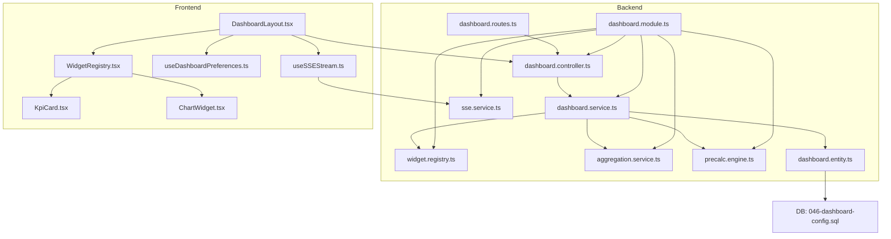
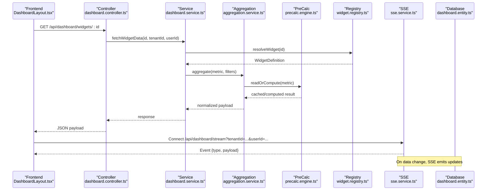
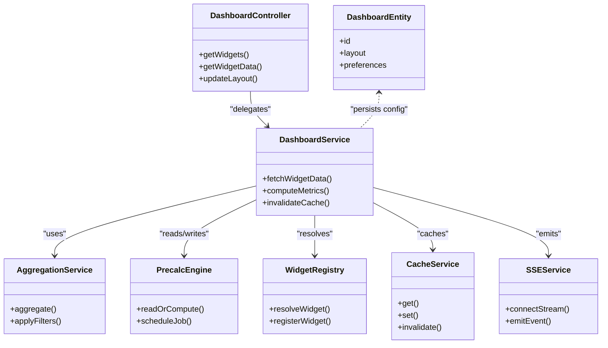
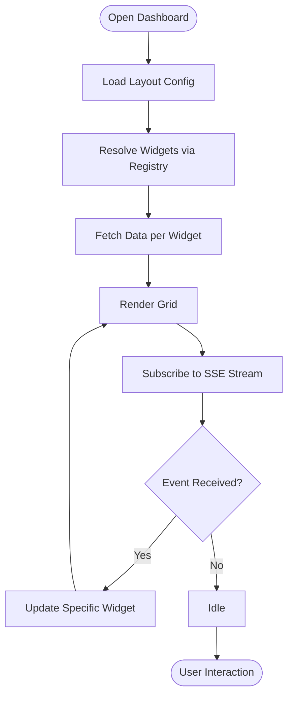
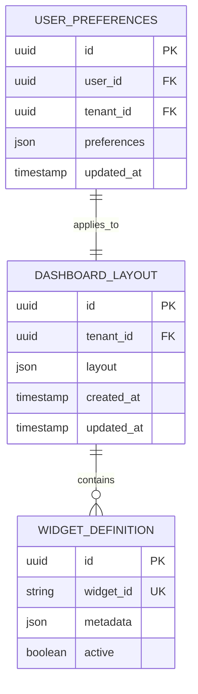
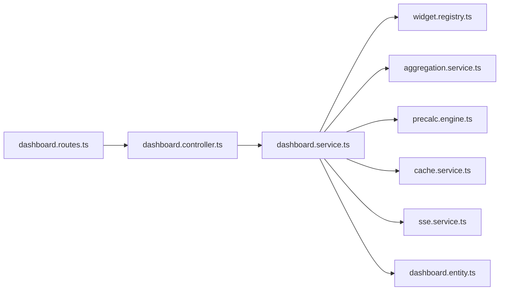

# Dashboard & Analytics

<cite>
**Referenced Files in This Document**
- [DASHBOARD-SYSTEM.md](file://backend/docs/DASHBOARD-SYSTEM.md)
- [DASHBOARD-FRONTEND-INTEGRATION.md](file://backend/docs/DASHBOARD-FRONTEND-INTEGRATION.md)
- [DASHBOARD-IMPLEMENTATION-SUMMARY.md](file://backend/docs/DASHBOARD-IMPLEMENTATION-SUMMARY.md)
- [046-dashboard-config.sql](file://backend/database/migrations/046-dashboard-config.sql)
- [dashboard.controller.ts](file://backend/src/modules/dashboard/controllers/dashboard.controller.ts)
- [dashboard.service.ts](file://backend/src/modules/dashboard/services/dashboard.service.ts)
- [dashboard.entity.ts](file://backend/src/modules/dashboard/entities/dashboard.entity.ts)
- [dashboard.module.ts](file://backend/src/modules/dashboard/dashboard.module.ts)
- [sse.service.ts](file://backend/src/modules/dashboard/services/sse.service.ts)
- [cache.service.ts](file://backend/src/modules/dashboard/services/cache.service.ts)
- [widget.registry.ts](file://backend/src/modules/dashboard/services/widget.registry.ts)
- [aggregation.service.ts](file://backend/src/modules/dashboard/services/aggregation.service.ts)
- [precalc.engine.ts](file://backend/src/modules/dashboard/services/precalc.engine.ts)
- [dashboard.routes.ts](file://backend/src/routes/dashboard.routes.ts)
- [DashboardLayout.tsx](file://frontend/src/features/dashboard/components/DashboardLayout.tsx)
- [WidgetRegistry.tsx](file://frontend/src/features/dashboard/components/WidgetRegistry.tsx)
- [KpiCard.tsx](file://frontend/src/features/dashboard/components/KpiCard.tsx)
- [ChartWidget.tsx](file://frontend/src/features/dashboard/components/ChartWidget.tsx)
- [useDashboardPreferences.ts](file://frontend/src/features/dashboard/hooks/useDashboardPreferences.ts)
- [useSSEStream.ts](file://frontend/src/features/dashboard/hooks/useSSEStream.ts)
</cite>

## Table of Contents
1. [Introduction](#introduction)
2. [Project Structure](#project-structure)
3. [Core Components](#core-components)
4. [Architecture Overview](#architecture-overview)
5. [Detailed Component Analysis](#detailed-component-analysis)
6. [Dependency Analysis](#dependency-analysis)
7. [Performance Considerations](#performance-considerations)
8. [Troubleshooting Guide](#troubleshooting-guide)
9. [Conclusion](#conclusion)
10. [Appendices](#appendices)

## Introduction
This document explains eLISAschool’s dashboard and analytics system, focusing on real-time dashboards with customizable widgets, KPI tracking, and data visualization. It covers the widget registry, data aggregation services, pre-calculation engine for performance, layout configuration, user preferences, responsive design, SSE-based real-time updates, caching strategies, monitoring, security, permissions, and multi-tenant isolation. Practical examples are included to help you create custom widgets, configure layouts, and integrate new data sources.

## Project Structure
The dashboard spans backend modules (controllers, services, entities, routes), database migrations for persistence, and frontend features (components, hooks). The backend exposes REST endpoints and SSE streams; the frontend renders a configurable grid of widgets and subscribes to live events.

**Diagram sources**
- [dashboard.controller.ts](file://backend/src/modules/dashboard/controllers/dashboard.controller.ts)
- [dashboard.service.ts](file://backend/src/modules/dashboard/services/dashboard.service.ts)
- [widget.registry.ts](file://backend/src/modules/dashboard/services/widget.registry.ts)
- [aggregation.service.ts](file://backend/src/modules/dashboard/services/aggregation.service.ts)
- [precalc.engine.ts](file://backend/src/modules/dashboard/services/precalc.engine.ts)
- [sse.service.ts](file://backend/src/modules/dashboard/services/sse.service.ts)
- [dashboard.entity.ts](file://backend/src/modules/dashboard/entities/dashboard.entity.ts)
- [dashboard.module.ts](file://backend/src/modules/dashboard/dashboard.module.ts)
- [dashboard.routes.ts](file://backend/src/routes/dashboard.routes.ts)
- [046-dashboard-config.sql](file://backend/database/migrations/046-dashboard-config.sql)
- [DashboardLayout.tsx](file://frontend/src/features/dashboard/components/DashboardLayout.tsx)
- [WidgetRegistry.tsx](file://frontend/src/features/dashboard/components/WidgetRegistry.tsx)
- [KpiCard.tsx](file://frontend/src/features/dashboard/components/KpiCard.tsx)
- [ChartWidget.tsx](file://frontend/src/features/dashboard/components/ChartWidget.tsx)
- [useDashboardPreferences.ts](file://frontend/src/features/dashboard/hooks/useDashboardPreferences.ts)
- [useSSEStream.ts](file://frontend/src/features/dashboard/hooks/useSSEStream.ts)

**Section sources**
- [DASHBOARD-SYSTEM.md](file://backend/docs/DASHBOARD-SYSTEM.md)
- [DASHBOARD-FRONTEND-INTEGRATION.md](file://backend/docs/DASHBOARD-FRONTEND-INTEGRATION.md)
- [DASHBOARD-IMPLEMENTATION-SUMMARY.md](file://backend/docs/DASHBOARD-IMPLEMENTATION-SUMMARY.md)
- [046-dashboard-config.sql](file://backend/database/migrations/046-dashboard-config.sql)

## Core Components
- Widget Registry: Centralized catalog of available widgets, their metadata, rendering props, and data contracts. Supports dynamic registration at runtime.
- Aggregation Service: Orchestrates data collection from multiple domain services, applies filters (e.g., tenant, period), and returns normalized payloads for widgets.
- Pre-calculation Engine: Periodically computes heavy metrics and stores results for fast retrieval, reducing query load during peak usage.
- SSE Service: Manages server-sent event channels per tenant/user context, broadcasting incremental updates when underlying data changes.
- Cache Service: Provides in-memory or Redis-backed caching for aggregated results and pre-calculated values with TTLs and invalidation hooks.
- Dashboard Controller: Exposes REST endpoints for layout CRUD, widget data queries, and SSE channel management.
- Dashboard Entity and Migration: Persisted schema for dashboard configurations, widget definitions, and user preferences.

**Section sources**
- [widget.registry.ts](file://backend/src/modules/dashboard/services/widget.registry.ts)
- [aggregation.service.ts](file://backend/src/modules/dashboard/services/aggregation.service.ts)
- [precalc.engine.ts](file://backend/src/modules/dashboard/services/precalc.engine.ts)
- [sse.service.ts](file://backend/src/modules/dashboard/services/sse.service.ts)
- [cache.service.ts](file://backend/src/modules/dashboard/services/cache.service.ts)
- [dashboard.controller.ts](file://backend/src/modules/dashboard/controllers/dashboard.controller.ts)
- [dashboard.entity.ts](file://backend/src/modules/dashboard/entities/dashboard.entity.ts)
- [046-dashboard-config.sql](file://backend/database/migrations/046-dashboard-config.sql)

## Architecture Overview
The dashboard architecture separates concerns across layers:
- Presentation layer (frontend) renders a responsive grid of widgets and subscribes to SSE streams for live updates.
- API layer (controller) validates requests, enforces permissions, and delegates to services.
- Services layer orchestrates aggregation, caching, and pre-calculation.
- Persistence layer stores dashboard configs and widget metadata.

**Diagram sources**
- [dashboard.controller.ts](file://backend/src/modules/dashboard/controllers/dashboard.controller.ts)
- [dashboard.service.ts](file://backend/src/modules/dashboard/services/dashboard.service.ts)
- [widget.registry.ts](file://backend/src/modules/dashboard/services/widget.registry.ts)
- [aggregation.service.ts](file://backend/src/modules/dashboard/services/aggregation.service.ts)
- [precalc.engine.ts](file://backend/src/modules/dashboard/services/precalc.engine.ts)
- [sse.service.ts](file://backend/src/modules/dashboard/services/sse.service.ts)
- [dashboard.entity.ts](file://backend/src/modules/dashboard/entities/dashboard.entity.ts)

## Detailed Component Analysis

### Backend: Dashboard Module
- Controller: Handles REST endpoints for dashboard layout and widget data. Applies RBAC checks and tenant scoping.
- Service: Coordinates calls to aggregation, registry, cache, and pre-calculation. Normalizes responses and handles errors.
- SSE Service: Creates and manages event streams per tenant/user, emitting structured events for widget refreshes.
- Cache Service: Wraps caching operations with keys scoped by tenant and metric, supports TTL and invalidation.
- Pre-calculation Engine: Schedules periodic jobs to compute heavy metrics and store them for fast reads.
- Widget Registry: Maintains a map of widget IDs to definitions, including required permissions and data schemas.

**Diagram sources**
- [dashboard.controller.ts](file://backend/src/modules/dashboard/controllers/dashboard.controller.ts)
- [dashboard.service.ts](file://backend/src/modules/dashboard/services/dashboard.service.ts)
- [aggregation.service.ts](file://backend/src/modules/dashboard/services/aggregation.service.ts)
- [precalc.engine.ts](file://backend/src/modules/dashboard/services/precalc.engine.ts)
- [widget.registry.ts](file://backend/src/modules/dashboard/services/widget.registry.ts)
- [sse.service.ts](file://backend/src/modules/dashboard/services/sse.service.ts)
- [cache.service.ts](file://backend/src/modules/dashboard/services/cache.service.ts)
- [dashboard.entity.ts](file://backend/src/modules/dashboard/entities/dashboard.entity.ts)

**Section sources**
- [dashboard.controller.ts](file://backend/src/modules/dashboard/controllers/dashboard.controller.ts)
- [dashboard.service.ts](file://backend/src/modules/dashboard/services/dashboard.service.ts)
- [sse.service.ts](file://backend/src/modules/dashboard/services/sse.service.ts)
- [cache.service.ts](file://backend/src/modules/dashboard/services/cache.service.ts)
- [widget.registry.ts](file://backend/src/modules/dashboard/services/widget.registry.ts)
- [aggregation.service.ts](file://backend/src/modules/dashboard/services/aggregation.service.ts)
- [precalc.engine.ts](file://backend/src/modules/dashboard/services/precalc.engine.ts)
- [dashboard.entity.ts](file://backend/src/modules/dashboard/entities/dashboard.entity.ts)

### Frontend: Dashboard UI
- DashboardLayout: Renders a responsive grid, loads layout configuration, and manages drag-and-drop reordering.
- WidgetRegistry: Maps widget IDs to React components and data adapters.
- KpiCard: Displays key performance indicators with trend indicators and thresholds.
- ChartWidget: Visualizes time-series or categorical data using charting libraries.
- useDashboardPreferences: Persists user preferences (theme, density, visibility) and syncs with backend.
- useSSEStream: Subscribes to SSE events and triggers targeted widget updates without full page reloads.

**Diagram sources**
- [DashboardLayout.tsx](file://frontend/src/features/dashboard/components/DashboardLayout.tsx)
- [WidgetRegistry.tsx](file://frontend/src/features/dashboard/components/WidgetRegistry.tsx)
- [KpiCard.tsx](file://frontend/src/features/dashboard/components/KpiCard.tsx)
- [ChartWidget.tsx](file://frontend/src/features/dashboard/components/ChartWidget.tsx)
- [useDashboardPreferences.ts](file://frontend/src/features/dashboard/hooks/useDashboardPreferences.ts)
- [useSSEStream.ts](file://frontend/src/features/dashboard/hooks/useSSEStream.ts)

**Section sources**
- [DashboardLayout.tsx](file://frontend/src/features/dashboard/components/DashboardLayout.tsx)
- [WidgetRegistry.tsx](file://frontend/src/features/dashboard/components/WidgetRegistry.tsx)
- [KpiCard.tsx](file://frontend/src/features/dashboard/components/KpiCard.tsx)
- [ChartWidget.tsx](file://frontend/src/features/dashboard/components/ChartWidget.tsx)
- [useDashboardPreferences.ts](file://frontend/src/features/dashboard/hooks/useDashboardPreferences.ts)
- [useSSEStream.ts](file://frontend/src/features/dashboard/hooks/useSSEStream.ts)

### Database Schema for Dashboards
The migration defines tables for dashboard configurations, widget definitions, and user preferences, including fields for tenant isolation and versioning.

**Diagram sources**
- [046-dashboard-config.sql](file://backend/database/migrations/046-dashboard-config.sql)

**Section sources**
- [046-dashboard-config.sql](file://backend/database/migrations/046-dashboard-config.sql)

## Dependency Analysis
The dashboard module depends on shared services (cache, SSE), domain aggregation services, and the widget registry. Routes wire the controller into the application router.

**Diagram sources**
- [dashboard.routes.ts](file://backend/src/routes/dashboard.routes.ts)
- [dashboard.controller.ts](file://backend/src/modules/dashboard/controllers/dashboard.controller.ts)
- [dashboard.service.ts](file://backend/src/modules/dashboard/services/dashboard.service.ts)
- [widget.registry.ts](file://backend/src/modules/dashboard/services/widget.registry.ts)
- [aggregation.service.ts](file://backend/src/modules/dashboard/services/aggregation.service.ts)
- [precalc.engine.ts](file://backend/src/modules/dashboard/services/precalc.engine.ts)
- [cache.service.ts](file://backend/src/modules/dashboard/services/cache.service.ts)
- [sse.service.ts](file://backend/src/modules/dashboard/services/sse.service.ts)
- [dashboard.entity.ts](file://backend/src/modules/dashboard/entities/dashboard.entity.ts)

**Section sources**
- [dashboard.routes.ts](file://backend/src/routes/dashboard.routes.ts)
- [dashboard.controller.ts](file://backend/src/modules/dashboard/controllers/dashboard.controller.ts)
- [dashboard.service.ts](file://backend/src/modules/dashboard/services/dashboard.service.ts)

## Performance Considerations
- Pre-calculation: Schedule periodic computation of heavy metrics; serve from cache to reduce latency under load.
- Caching Strategy: Use short TTLs for volatile metrics and longer TTLs for stable aggregates; implement invalidation on write paths.
- SSE Efficiency: Emit granular events keyed by widget ID to avoid unnecessary client-side re-renders.
- Query Optimization: Ensure indexes exist for frequently filtered columns (tenant_id, period, entity_id).
- Frontend Rendering: Lazy-load charts and defer non-critical widgets; debounce SSE-driven updates.

[No sources needed since this section provides general guidance]

## Troubleshooting Guide
- Real-time Updates Not Appearing: Verify SSE connection parameters (tenantId, userId), check server logs for stream creation, and ensure events are emitted after data mutations.
- Stale Data: Inspect cache TTLs and invalidation hooks; confirm pre-calculation jobs are running and writing correct keys.
- Permission Errors: Confirm RBAC guards allow access to dashboard endpoints and that tenant scoping is applied consistently.
- Widget Not Found: Validate widget registry entries and ensure frontend mappings match backend widget IDs.

**Section sources**
- [sse.service.ts](file://backend/src/modules/dashboard/services/sse.service.ts)
- [cache.service.ts](file://backend/src/modules/dashboard/services/cache.service.ts)
- [precalc.engine.ts](file://backend/src/modules/dashboard/services/precalc.engine.ts)
- [widget.registry.ts](file://backend/src/modules/dashboard/services/widget.registry.ts)
- [dashboard.controller.ts](file://backend/src/modules/dashboard/controllers/dashboard.controller.ts)

## Conclusion
The eLISAschool dashboard integrates a robust backend with a flexible frontend to deliver real-time, customizable analytics. By leveraging a widget registry, aggregation services, pre-calculation, and SSE streaming, it achieves both responsiveness and scalability. Security and multi-tenancy are enforced through RBAC and tenant-scoped storage, while caching and indexing optimize performance.

[No sources needed since this section summarizes without analyzing specific files]

## Appendices

### Creating a Custom Widget
- Define a backend widget entry in the registry with metadata and required permissions.
- Implement an aggregation function to compute the widget’s data, integrating with existing domain services.
- Add a frontend component mapped to the widget ID, handling data shape and rendering.
- Register the widget in the frontend registry and include it in layout configurations.

**Section sources**
- [widget.registry.ts](file://backend/src/modules/dashboard/services/widget.registry.ts)
- [aggregation.service.ts](file://backend/src/modules/dashboard/services/aggregation.service.ts)
- [WidgetRegistry.tsx](file://frontend/src/features/dashboard/components/WidgetRegistry.tsx)
- [KpiCard.tsx](file://frontend/src/features/dashboard/components/KpiCard.tsx)
- [ChartWidget.tsx](file://frontend/src/features/dashboard/components/ChartWidget.tsx)

### Configuring Dashboard Layouts
- Create or update layout JSON via the dashboard controller endpoint.
- Persist layout with tenant isolation and associate with user preferences.
- Use the frontend layout loader to render the configured grid.

**Section sources**
- [dashboard.controller.ts](file://backend/src/modules/dashboard/controllers/dashboard.controller.ts)
- [DashboardLayout.tsx](file://frontend/src/features/dashboard/components/DashboardLayout.tsx)
- [useDashboardPreferences.ts](file://frontend/src/features/dashboard/hooks/useDashboardPreferences.ts)
- [046-dashboard-config.sql](file://backend/database/migrations/046-dashboard-config.sql)

### Integrating New Data Sources
- Extend the aggregation service to query the new source, applying tenant and period filters.
- Optionally add pre-calculation for expensive computations and register cache keys.
- Emit SSE events when underlying data changes to trigger widget updates.

**Section sources**
- [aggregation.service.ts](file://backend/src/modules/dashboard/services/aggregation.service.ts)
- [precalc.engine.ts](file://backend/src/modules/dashboard/services/precalc.engine.ts)
- [cache.service.ts](file://backend/src/modules/dashboard/services/cache.service.ts)
- [sse.service.ts](file://backend/src/modules/dashboard/services/sse.service.ts)

### SSE Implementation Details
- Establish a stream per tenant/user context.
- Emit structured events with widget identifiers and payloads.
- Handle client reconnects and backoff strategies.

**Section sources**
- [sse.service.ts](file://backend/src/modules/dashboard/services/sse.service.ts)
- [useSSEStream.ts](file://frontend/src/features/dashboard/hooks/useSSEStream.ts)

### Security and Multi-Tenant Isolation
- Enforce RBAC at controller level for all dashboard endpoints.
- Scope all queries and writes by tenant_id.
- Validate user permissions against widget requirements before serving data.

**Section sources**
- [dashboard.controller.ts](file://backend/src/modules/dashboard/controllers/dashboard.controller.ts)
- [dashboard.entity.ts](file://backend/src/modules/dashboard/entities/dashboard.entity.ts)
- [046-dashboard-config.sql](file://backend/database/migrations/046-dashboard-config.sql)