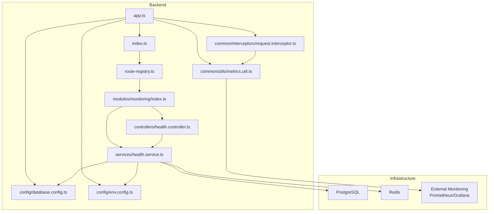
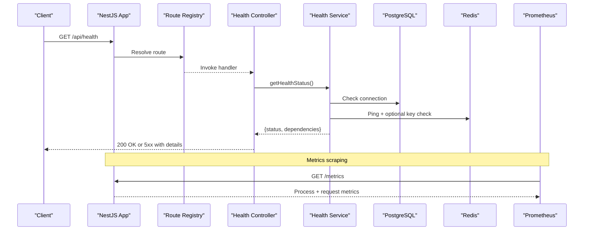
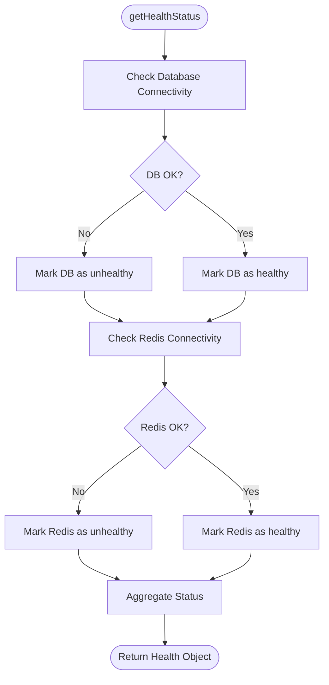
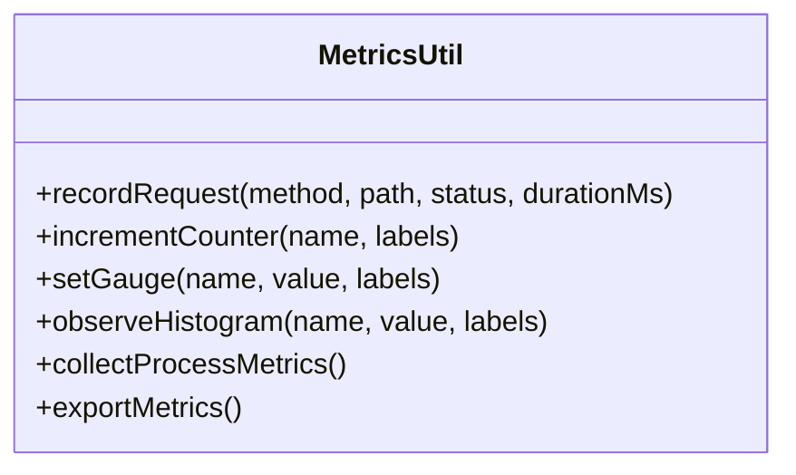
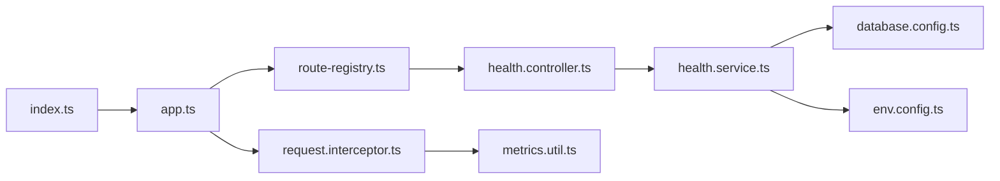

# Monitoring & Health Checks

<cite>
**Referenced Files in This Document**
- [backend/src/modules/monitoring/index.ts](file://backend/src/modules/monitoring/index.ts)
- [backend/src/modules/monitoring/controllers/health.controller.ts](file://backend/src/modules/monitoring/controllers/health.controller.ts)
- [backend/src/modules/monitoring/services/health.service.ts](file://backend/src/modules/monitoring/services/health.service.ts)
- [backend/src/config/database.config.ts](file://backend/src/config/database.config.ts)
- [backend/src/config/env.config.ts](file://backend/src/config/env.config.ts)
- [backend/src/common/utils/metrics.util.ts](file://backend/src/common/utils/metrics.util.ts)
- [backend/src/common/interceptors/request.interceptor.ts](file://backend/src/common/interceptors/request.interceptor.ts)
- [backend/src/routes/route-registry.ts](file://backend/src/routes/route-registry.ts)
- [backend/src/app.ts](file://backend/src/app.ts)
- [backend/src/index.ts](file://backend/src/index.ts)
- [backend/package.json](file://backend/package.json)
- [docker/docker-compose.yml](file://docker/docker-compose.yml)
- [docker/scripts/validate-infrastructure.sh](file://docker/scripts/validate-infrastructure.sh)
- [backend/docs/GUIDE-MONITORING-PERFORMANCE-RBAC.md](file://backend/docs/GUIDE-MONITORING-PERFORMANCE-RBAC.md)
</cite>

## Table of Contents
1. [Introduction](#introduction)
2. [Project Structure](#project-structure)
3. [Core Components](#core-components)
4. [Architecture Overview](#architecture-overview)
5. [Detailed Component Analysis](#detailed-component-analysis)
6. [Dependency Analysis](#dependency-analysis)
7. [Performance Considerations](#performance-considerations)
8. [Troubleshooting Guide](#troubleshooting-guide)
9. [Conclusion](#conclusion)
10. [Appendices](#appendices)

## Introduction
This document explains eLISAschool’s monitoring and health check system. It covers:
- Health checks for database connectivity, Redis cache status, and service availability
- Metrics collection for application performance, memory usage, and request processing times
- Alerting mechanisms, log aggregation, and diagnostic tools for administrators
- Practical examples to set up health endpoints, configure thresholds, and interpret metrics
- Integration with external monitoring tools and custom metric definitions
- Performance profiling, bottleneck identification, and capacity planning considerations

The goal is to provide a clear, actionable guide for operators and developers to monitor, diagnose, and optimize the platform.

## Project Structure
Monitoring-related code is organized under a dedicated module and shared utilities:
- Module entrypoint and routing registration
- Health controller exposing HTTP endpoints
- Health service implementing dependency checks (database, Redis)
- Metrics utility for collecting process and request-level metrics
- Interceptors for request timing and error tracking
- Route registry wiring health endpoints into the app
- App bootstrap and server startup
- Environment configuration for enabling/disabling features and setting thresholds
- Docker compose and validation scripts for infrastructure readiness

**Diagram sources**
- [backend/src/app.ts](file://backend/src/app.ts)
- [backend/src/index.ts](file://backend/src/index.ts)
- [backend/src/routes/route-registry.ts](file://backend/src/routes/route-registry.ts)
- [backend/src/modules/monitoring/index.ts](file://backend/src/modules/monitoring/index.ts)
- [backend/src/modules/monitoring/controllers/health.controller.ts](file://backend/src/modules/monitoring/controllers/health.controller.ts)
- [backend/src/modules/monitoring/services/health.service.ts](file://backend/src/modules/monitoring/services/health.service.ts)
- [backend/src/common/interceptors/request.interceptor.ts](file://backend/src/common/interceptors/request.interceptor.ts)
- [backend/src/common/utils/metrics.util.ts](file://backend/src/common/utils/metrics.util.ts)
- [backend/src/config/database.config.ts](file://backend/src/config/database.config.ts)
- [backend/src/config/env.config.ts](file://backend/src/config/env.config.ts)

**Section sources**
- [backend/src/modules/monitoring/index.ts](file://backend/src/modules/monitoring/index.ts)
- [backend/src/modules/monitoring/controllers/health.controller.ts](file://backend/src/modules/monitoring/controllers/health.controller.ts)
- [backend/src/modules/monitoring/services/health.service.ts](file://backend/src/modules/monitoring/services/health.service.ts)
- [backend/src/common/utils/metrics.util.ts](file://backend/src/common/utils/metrics.util.ts)
- [backend/src/common/interceptors/request.interceptor.ts](file://backend/src/common/interceptors/request.interceptor.ts)
- [backend/src/routes/route-registry.ts](file://backend/src/routes/route-registry.ts)
- [backend/src/app.ts](file://backend/src/app.ts)
- [backend/src/index.ts](file://backend/src/index.ts)
- [backend/src/config/database.config.ts](file://backend/src/config/database.config.ts)
- [backend/src/config/env.config.ts](file://backend/src/config/env.config.ts)

## Core Components
- Health Controller: Exposes HTTP endpoints for liveness/readiness and detailed health status.
- Health Service: Performs dependency checks against PostgreSQL and Redis, aggregates results, and returns structured status.
- Metrics Utility: Collects process metrics (memory, CPU), request durations, and exposes counters/gauges/histograms.
- Request Interceptor: Wraps requests to measure latency, track errors, and emit metrics per route/method/status.
- Route Registry: Registers health endpoints and ensures they are available at well-known paths.
- Configuration: Provides environment-driven toggles and thresholds for monitoring behavior.

Key responsibilities:
- Database connectivity checks via configured data source
- Redis ping and optional key-based sanity checks
- Service availability summary (liveness vs readiness)
- Metrics emission for Prometheus-compatible scraping or export

**Section sources**
- [backend/src/modules/monitoring/controllers/health.controller.ts](file://backend/src/modules/monitoring/controllers/health.controller.ts)
- [backend/src/modules/monitoring/services/health.service.ts](file://backend/src/modules/monitoring/services/health.service.ts)
- [backend/src/common/utils/metrics.util.ts](file://backend/src/common/utils/metrics.util.ts)
- [backend/src/common/interceptors/request.interceptor.ts](file://backend/src/common/interceptors/request.interceptor.ts)
- [backend/src/routes/route-registry.ts](file://backend/src/routes/route-registry.ts)
- [backend/src/config/env.config.ts](file://backend/src/config/env.config.ts)

## Architecture Overview
The monitoring stack integrates with the NestJS application lifecycle:
- On startup, the app initializes configuration, database, and Redis connections.
- The route registry mounts health endpoints.
- The request interceptor measures incoming requests and emits metrics.
- The health service performs dependency probes on demand.
- External systems scrape metrics and poll health endpoints.

**Diagram sources**
- [backend/src/routes/route-registry.ts](file://backend/src/routes/route-registry.ts)
- [backend/src/modules/monitoring/controllers/health.controller.ts](file://backend/src/modules/monitoring/controllers/health.controller.ts)
- [backend/src/modules/monitoring/services/health.service.ts](file://backend/src/modules/monitoring/services/health.service.ts)
- [backend/src/config/database.config.ts](file://backend/src/config/database.config.ts)

## Detailed Component Analysis

### Health Controller
Responsibilities:
- Provide liveness endpoint (process alive)
- Provide readiness endpoint (dependencies healthy)
- Optionally expose a detailed health report including dependency statuses

Operational notes:
- Liveness should be lightweight and always return quickly
- Readiness should reflect actual dependency states (DB, Redis)
- Return consistent JSON structure for automated consumers

Example endpoints:
- GET /api/health/liveness
- GET /api/health/readiness
- GET /api/health (optional aggregate)

**Section sources**
- [backend/src/modules/monitoring/controllers/health.controller.ts](file://backend/src/modules/monitoring/controllers/health.controller.ts)
- [backend/src/routes/route-registry.ts](file://backend/src/routes/route-registry.ts)

### Health Service
Responsibilities:
- Validate database connectivity using configured data source
- Validate Redis connectivity and optionally perform a write/read sanity check
- Aggregate results into a unified health object
- Respect environment flags to skip expensive checks when needed

Implementation patterns:
- Use try/catch around dependency calls to avoid crashing the process
- Cache short-lived results if appropriate (e.g., readiness every few seconds)
- Include dependency-specific diagnostics (latency, last success time)

**Diagram sources**
- [backend/src/modules/monitoring/services/health.service.ts](file://backend/src/modules/monitoring/services/health.service.ts)
- [backend/src/config/database.config.ts](file://backend/src/config/database.config.ts)

**Section sources**
- [backend/src/modules/monitoring/services/health.service.ts](file://backend/src/modules/monitoring/services/health.service.ts)
- [backend/src/config/database.config.ts](file://backend/src/config/database.config.ts)

### Metrics Utility
Responsibilities:
- Capture process metrics (heapUsed, heapTotal, rss, cpu usage)
- Track request duration histograms by route/method/status
- Maintain counters for total requests, errors, and slow requests
- Export metrics in a format consumable by Prometheus or similar tools

Usage patterns:
- Initialize metrics once during app bootstrap
- Increment counters and update gauges within interceptors or services
- Provide a /metrics endpoint or integrate with an exporter

**Diagram sources**
- [backend/src/common/utils/metrics.util.ts](file://backend/src/common/utils/metrics.util.ts)

**Section sources**
- [backend/src/common/utils/metrics.util.ts](file://backend/src/common/utils/metrics.util.ts)

### Request Interceptor
Responsibilities:
- Measure request start/end timestamps
- Compute duration and classify slow requests based on thresholds
- Emit metrics for each request (counters, histograms)
- Attach correlation IDs for log tracing

Integration points:
- Global NestJS interceptor applied to all routes
- Uses MetricsUtil to record timings and counts
- Respects environment settings to enable/disable instrumentation overhead

**Section sources**
- [backend/src/common/interceptors/request.interceptor.ts](file://backend/src/common/interceptors/request.interceptor.ts)
- [backend/src/common/utils/metrics.util.ts](file://backend/src/common/utils/metrics.util.ts)

### Route Registry and App Bootstrap
Responsibilities:
- Register health endpoints under /api/health
- Ensure middleware and interceptors are applied before controllers
- Initialize configuration and modules that depend on env variables

Startup flow:
- Load environment config
- Initialize database and Redis connections
- Register routes and global interceptors
- Start HTTP server

**Section sources**
- [backend/src/routes/route-registry.ts](file://backend/src/routes/route-registry.ts)
- [backend/src/app.ts](file://backend/src/app.ts)
- [backend/src/index.ts](file://backend/src/index.ts)
- [backend/src/config/env.config.ts](file://backend/src/config/env.config.ts)

## Dependency Analysis
High-level dependencies:
- Health Controller depends on Health Service
- Health Service depends on Database Config and Environment Config
- Request Interceptor depends on Metrics Utility
- Route Registry wires Health Controller into the application
- App Bootstrap initializes configuration and starts the server

**Diagram sources**
- [backend/src/routes/route-registry.ts](file://backend/src/routes/route-registry.ts)
- [backend/src/modules/monitoring/controllers/health.controller.ts](file://backend/src/modules/monitoring/controllers/health.controller.ts)
- [backend/src/modules/monitoring/services/health.service.ts](file://backend/src/modules/monitoring/services/health.service.ts)
- [backend/src/config/database.config.ts](file://backend/src/config/database.config.ts)
- [backend/src/config/env.config.ts](file://backend/src/config/env.config.ts)
- [backend/src/common/interceptors/request.interceptor.ts](file://backend/src/common/interceptors/request.interceptor.ts)
- [backend/src/common/utils/metrics.util.ts](file://backend/src/common/utils/metrics.util.ts)
- [backend/src/app.ts](file://backend/src/app.ts)
- [backend/src/index.ts](file://backend/src/index.ts)

**Section sources**
- [backend/src/routes/route-registry.ts](file://backend/src/routes/route-registry.ts)
- [backend/src/modules/monitoring/controllers/health.controller.ts](file://backend/src/modules/monitoring/controllers/health.controller.ts)
- [backend/src/modules/monitoring/services/health.service.ts](file://backend/src/modules/monitoring/services/health.service.ts)
- [backend/src/common/interceptors/request.interceptor.ts](file://backend/src/common/interceptors/request.interceptor.ts)
- [backend/src/common/utils/metrics.util.ts](file://backend/src/common/utils/metrics.util.ts)
- [backend/src/app.ts](file://backend/src/app.ts)
- [backend/src/index.ts](file://backend/src/index.ts)

## Performance Considerations
- Keep liveness checks minimal; use readiness for dependency health
- Avoid heavy work inside health checks; consider caching readiness results briefly
- Instrument only necessary routes to reduce overhead; use sampling for high-volume endpoints
- Set sensible histogram buckets for request durations to capture tail latencies
- Monitor memory growth trends and alert on sustained increases
- Profile hotspots using built-in profilers or sampling profilers in production
- Capacity planning:
  - Track P95/P99 latencies and error rates
  - Observe queue lengths and worker utilization
  - Plan scaling based on throughput and resource saturation

[No sources needed since this section provides general guidance]

## Troubleshooting Guide
Common issues and resolutions:
- Database connectivity failures:
  - Verify credentials, network access, and firewall rules
  - Check connection pool exhaustion and query timeouts
  - Review health service logs for specific error messages
- Redis connectivity failures:
  - Confirm host/port and authentication settings
  - Validate Redis availability and memory limits
  - Test basic ping and key operations
- High latency or timeouts:
  - Inspect request duration histograms and identify slow routes
  - Correlate with database query plans and indexes
  - Check for lock contention or long-running transactions
- Memory leaks:
  - Track heapUsed and rss over time
  - Identify objects retained across requests
  - Use heap snapshots for deep analysis
- Log aggregation:
  - Ensure structured logging with correlation IDs
  - Forward logs to centralized collectors (e.g., filebeat, fluentd)
  - Create dashboards for error rates and slow endpoints

Practical steps:
- Use health endpoints to validate service state
- Scrape metrics and build Grafana panels for real-time visibility
- Configure alerts for critical thresholds (error rate, latency, memory)
- Run docker validation script to verify infrastructure readiness

**Section sources**
- [docker/scripts/validate-infrastructure.sh](file://docker/scripts/validate-infrastructure.sh)
- [backend/docs/GUIDE-MONITORING-PERFORMANCE-RBAC.md](file://backend/docs/GUIDE-MONITORING-PERFORMANCE-RBAC.md)

## Conclusion
eLISAschool’s monitoring and health check system provides essential observability through:
- Robust health endpoints for liveness and readiness
- Comprehensive metrics for process and request performance
- Structured logging and correlation for diagnostics
- Clear integration points for external monitoring tools

Adopting these practices enables proactive detection of issues, informed capacity planning, and reliable operation at scale.

[No sources needed since this section summarizes without analyzing specific files]

## Appendices

### Practical Examples

- Setting up health check endpoints:
  - Ensure route registry includes health routes
  - Access /api/health/liveness and /api/health/readiness from orchestrators
  - Configure Kubernetes or Docker health probes accordingly

- Configuring monitoring thresholds:
  - Adjust slow request thresholds in environment configuration
  - Tune histogram buckets for request durations
  - Set memory and CPU alerts based on observed baselines

- Interpreting system metrics:
  - Track request count, error rate, and latency percentiles
  - Monitor memory usage trends and GC activity
  - Correlate spikes with deployments or traffic changes

- Integrating with external monitoring tools:
  - Expose metrics endpoint for Prometheus scraping
  - Build Grafana dashboards for key indicators
  - Define alerting rules for critical conditions

- Custom metric definitions:
  - Add domain-specific counters and gauges via MetricsUtil
  - Label metrics with tenant/module identifiers for multi-tenant insights
  - Document metric semantics and retention policies

- Performance profiling and bottleneck identification:
  - Enable sampling profiler in staging/prod
  - Analyze flame graphs for hot functions
  - Optimize database queries and add indexes where needed

- Capacity planning considerations:
  - Model expected load and resource requirements
  - Plan horizontal scaling based on stateless service design
  - Evaluate vertical scaling for DB and Redis nodes

**Section sources**
- [backend/src/routes/route-registry.ts](file://backend/src/routes/route-registry.ts)
- [backend/src/config/env.config.ts](file://backend/src/config/env.config.ts)
- [backend/src/common/utils/metrics.util.ts](file://backend/src/common/utils/metrics.util.ts)
- [docker/docker-compose.yml](file://docker/docker-compose.yml)
- [backend/package.json](file://backend/package.json)