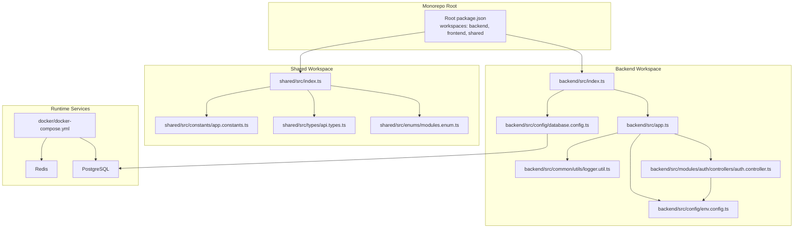
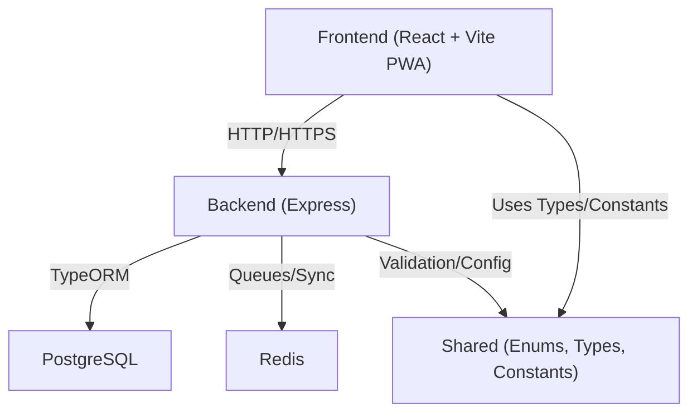
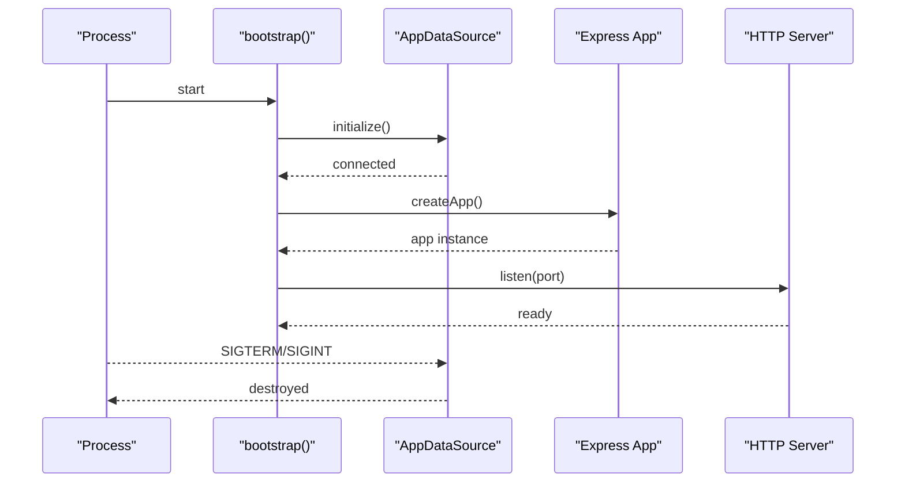
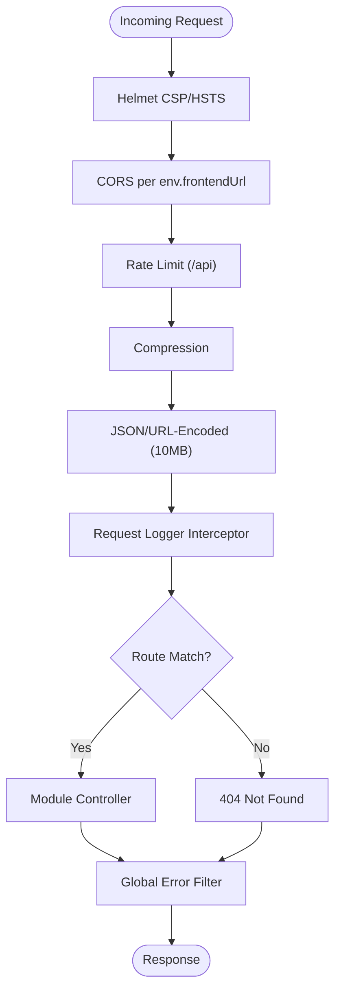
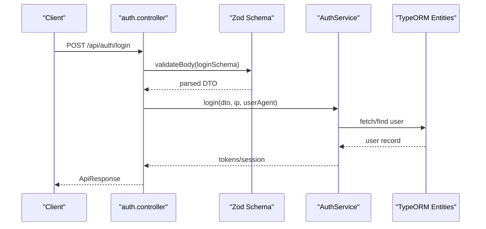
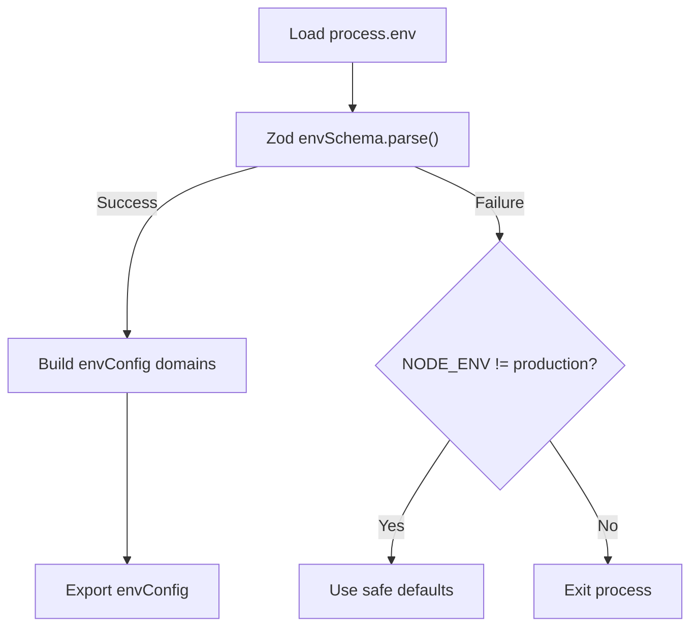
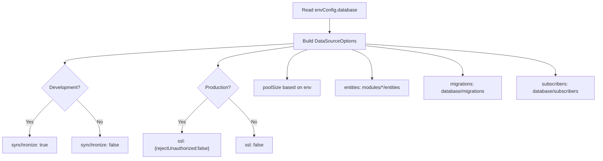
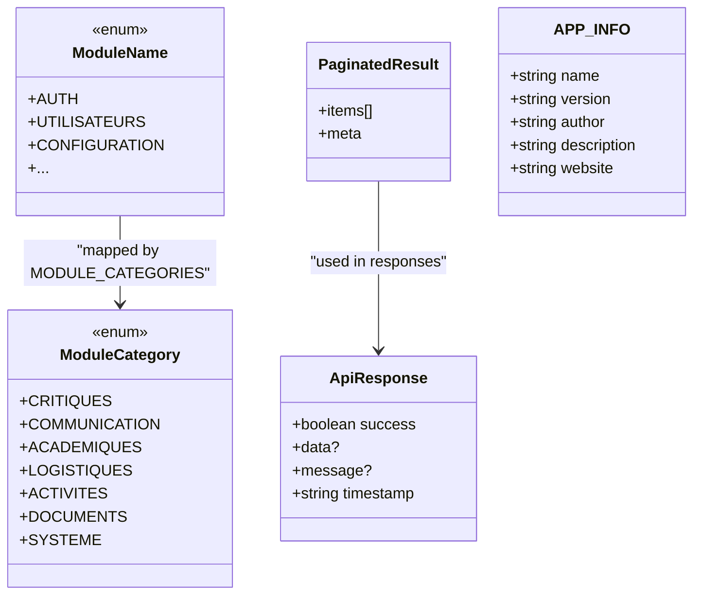
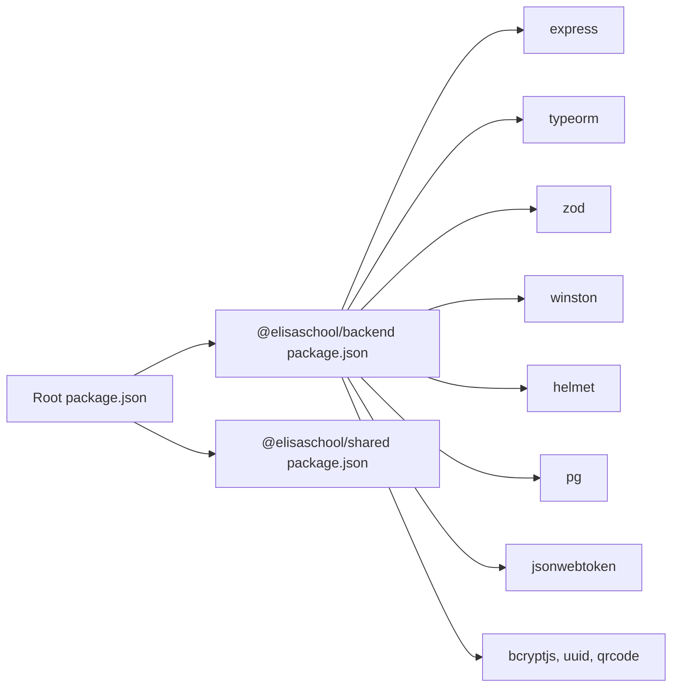

# Architecture Overview

<cite>
**Referenced Files in This Document**
- [README.md](file://README.md)
- [package.json](file://package.json)
- [docker/docker-compose.yml](file://docker/docker-compose.yml)
- [backend/src/index.ts](file://backend/src/index.ts)
- [backend/src/app.ts](file://backend/src/app.ts)
- [backend/src/config/env.config.ts](file://backend/src/config/env.config.ts)
- [backend/src/config/database.config.ts](file://backend/src/config/database.config.ts)
- [backend/src/common/utils/logger.util.ts](file://backend/src/common/utils/logger.util.ts)
- [backend/src/modules/auth/controllers/auth.controller.ts](file://backend/src/modules/auth/controllers/auth.controller.ts)
- [shared/src/index.ts](file://shared/src/index.ts)
- [shared/src/enums/modules.enum.ts](file://shared/src/enums/modules.enum.ts)
- [shared/src/types/api.types.ts](file://shared/src/types/api.types.ts)
- [shared/src/constants/app.constants.ts](file://shared/src/constants/app.constants.ts)
</cite>

## Table of Contents
1. [Introduction](#introduction)
2. [Project Structure](#project-structure)
3. [Core Components](#core-components)
4. [Architecture Overview](#architecture-overview)
5. [Detailed Component Analysis](#detailed-component-analysis)
6. [Dependency Analysis](#dependency-analysis)
7. [Performance Considerations](#performance-considerations)
8. [Troubleshooting Guide](#troubleshooting-guide)
9. [Conclusion](#conclusion)
10. [Appendices](#appendices)

## Introduction
This document presents the architecture of eLISAschool, a Progressive Web App (PWA) designed for school administration in Sub-Saharan Africa. It describes the high-level system design, modular backend built with Express and TypeScript, shared components architecture, and the PostgreSQL-backed persistence model. It also explains the separation of concerns across frontend, backend, and shared modules, system boundaries, data flows, integration patterns, and the PWA-related constraints and capabilities implied by the current repository structure.

## Project Structure
The repository follows a monorepo layout with three primary workspaces:
- backend: Express server with TypeScript, modular controllers/services/entities, and shared configuration.
- frontend: React + Vite PWA workspace (not analyzed here).
- shared: Shared TypeScript packages for enums, constants, types, validators, and configuration.

**Diagram sources**
- [package.json:1-33](file://package.json#L1-L33)
- [backend/src/index.ts:1-62](file://backend/src/index.ts#L1-L62)
- [backend/src/app.ts:1-205](file://backend/src/app.ts#L1-L205)
- [backend/src/config/env.config.ts:1-168](file://backend/src/config/env.config.ts#L1-L168)
- [backend/src/config/database.config.ts:1-54](file://backend/src/config/database.config.ts#L1-L54)
- [backend/src/common/utils/logger.util.ts:1-91](file://backend/src/common/utils/logger.util.ts#L1-L91)
- [backend/src/modules/auth/controllers/auth.controller.ts:1-268](file://backend/src/modules/auth/controllers/auth.controller.ts#L1-L268)
- [shared/src/index.ts:1-14](file://shared/src/index.ts#L1-L14)
- [shared/src/enums/modules.enum.ts:1-107](file://shared/src/enums/modules.enum.ts#L1-L107)
- [shared/src/types/api.types.ts:1-66](file://shared/src/types/api.types.ts#L1-L66)
- [shared/src/constants/app.constants.ts:1-81](file://shared/src/constants/app.constants.ts#L1-L81)
- [docker/docker-compose.yml:1-109](file://docker/docker-compose.yml#L1-L109)

**Section sources**
- [README.md:18-27](file://README.md#L18-L27)
- [package.json:8-12](file://package.json#L8-L12)
- [docker/docker-compose.yml:8-101](file://docker/docker-compose.yml#L8-L101)

## Core Components
- Backend entrypoint initializes environment, connects to PostgreSQL via TypeORM, and starts the HTTP server.
- Express application configures security middleware (Helmet, CORS, rate limiting), request parsing, logging, and mounts modular routes.
- Environment configuration is validated using Zod and grouped by domain (app, database, JWT, encryption, Redis, email, logging).
- Database configuration is driven by environment variables and supports development vs production differences (e.g., synchronization, SSL).
- Shared workspace exports enums, constants, types, validators, and configuration for reuse across backend and frontend.

Key implementation references:
- Backend bootstrap and server lifecycle: [backend/src/index.ts:22-58](file://backend/src/index.ts#L22-L58)
- Express app creation and route mounting: [backend/src/app.ts:58-204](file://backend/src/app.ts#L58-L204)
- Environment validation and typed config: [backend/src/config/env.config.ts:68-165](file://backend/src/config/env.config.ts#L68-L165)
- Database configuration options: [backend/src/config/database.config.ts:15-51](file://backend/src/config/database.config.ts#L15-L51)
- Logger setup: [backend/src/common/utils/logger.util.ts:58-82](file://backend/src/common/utils/logger.util.ts#L58-L82)
- Shared module exports: [shared/src/index.ts:9-14](file://shared/src/index.ts#L9-L14)

**Section sources**
- [backend/src/index.ts:22-58](file://backend/src/index.ts#L22-L58)
- [backend/src/app.ts:58-204](file://backend/src/app.ts#L58-L204)
- [backend/src/config/env.config.ts:68-165](file://backend/src/config/env.config.ts#L68-L165)
- [backend/src/config/database.config.ts:15-51](file://backend/src/config/database.config.ts#L15-L51)
- [backend/src/common/utils/logger.util.ts:58-82](file://backend/src/common/utils/logger.util.ts#L58-L82)
- [shared/src/index.ts:9-14](file://shared/src/index.ts#L9-L14)

## Architecture Overview
High-level system boundaries and interactions:
- Frontend (React + Vite PWA) communicates with the backend over HTTP/HTTPS.
- Backend exposes REST-style endpoints under /api and integrates with PostgreSQL for persistence and Redis for queues/synchronization.
- Shared workspace provides type-safe contracts and constants used by both backend and frontend.

**Diagram sources**
- [README.md:29-34](file://README.md#L29-L34)
- [docker/docker-compose.yml:10-46](file://docker/docker-compose.yml#L10-L46)
- [backend/src/app.ts:150-185](file://backend/src/app.ts#L150-L185)
- [shared/src/index.ts:9-14](file://shared/src/index.ts#L9-L14)

## Detailed Component Analysis

### Backend Bootstrapping and Runtime Lifecycle
The backend initializes environment variables, establishes a database connection, creates the Express app, and starts listening on the configured port. Graceful shutdown hooks destroy the database connection on termination signals.

**Diagram sources**
- [backend/src/index.ts:22-58](file://backend/src/index.ts#L22-L58)
- [backend/src/app.ts:124-143](file://backend/src/app.ts#L124-L143)

**Section sources**
- [backend/src/index.ts:22-58](file://backend/src/index.ts#L22-L58)
- [backend/src/app.ts:124-143](file://backend/src/app.ts#L124-L143)

### Express App Security and Middleware Pipeline
The Express app applies security middleware (CORS, Helmet, rate limiting), compression, JSON/URL encoding parsing, request logging, and mounts modular routes. It also registers global error handlers.

**Diagram sources**
- [backend/src/app.ts:65-118](file://backend/src/app.ts#L65-L118)
- [backend/src/app.ts:149-198](file://backend/src/app.ts#L149-L198)

**Section sources**
- [backend/src/app.ts:65-118](file://backend/src/app.ts#L65-L118)
- [backend/src/app.ts:149-198](file://backend/src/app.ts#L149-L198)

### Authentication Controller Flow
The authentication controller validates payloads with Zod schemas, delegates to the AuthService, and returns standardized API responses. It also enforces middleware for protected routes.

**Diagram sources**
- [backend/src/modules/auth/controllers/auth.controller.ts:55-74](file://backend/src/modules/auth/controllers/auth.controller.ts#L55-L74)
- [backend/src/modules/auth/controllers/auth.controller.ts:39-49](file://backend/src/modules/auth/controllers/auth.controller.ts#L39-L49)

**Section sources**
- [backend/src/modules/auth/controllers/auth.controller.ts:39-49](file://backend/src/modules/auth/controllers/auth.controller.ts#L39-L49)
- [backend/src/modules/auth/controllers/auth.controller.ts:55-74](file://backend/src/modules/auth/controllers/auth.controller.ts#L55-L74)

### Environment Configuration and Validation
Environment variables are validated using Zod and exposed as a strongly typed configuration object grouped by domain. Defaults are applied in development when missing.

**Diagram sources**
- [backend/src/config/env.config.ts:68-112](file://backend/src/config/env.config.ts#L68-L112)
- [backend/src/config/env.config.ts:120-165](file://backend/src/config/env.config.ts#L120-L165)

**Section sources**
- [backend/src/config/env.config.ts:68-112](file://backend/src/config/env.config.ts#L68-L112)
- [backend/src/config/env.config.ts:120-165](file://backend/src/config/env.config.ts#L120-L165)

### Database Configuration and TypeORM Options
TypeORM is configured from environment variables with development vs production differences (e.g., synchronize, SSL, logging). Entities, migrations, and subscribers are discovered via glob patterns.

**Diagram sources**
- [backend/src/config/database.config.ts:15-51](file://backend/src/config/database.config.ts#L15-L51)

**Section sources**
- [backend/src/config/database.config.ts:15-51](file://backend/src/config/database.config.ts#L15-L51)

### Shared Types and Contracts
The shared workspace centralizes:
- Module enumerations and categories for module taxonomy.
- Standardized API response types and pagination interfaces.
- Application constants (limits, currencies, languages).

**Diagram sources**
- [shared/src/enums/modules.enum.ts:14-106](file://shared/src/enums/modules.enum.ts#L14-L106)
- [shared/src/types/api.types.ts:12-61](file://shared/src/types/api.types.ts#L12-L61)
- [shared/src/constants/app.constants.ts:12-80](file://shared/src/constants/app.constants.ts#L12-L80)

**Section sources**
- [shared/src/enums/modules.enum.ts:14-106](file://shared/src/enums/modules.enum.ts#L14-L106)
- [shared/src/types/api.types.ts:12-61](file://shared/src/types/api.types.ts#L12-L61)
- [shared/src/constants/app.constants.ts:12-80](file://shared/src/constants/app.constants.ts#L12-L80)

## Dependency Analysis
- Backend depends on Express, TypeORM, Zod, Winston, Helmet, CORS, compression, bcrypt, pg, uuid, qrcode, jsonwebtoken, dotenv, reflect-metadata.
- Root workspace orchestrates builds/tests/linting across backend, frontend, and shared.
- Docker Compose defines services for PostgreSQL, Redis, backend, and frontend, wiring environment variables and volumes.

**Diagram sources**
- [package.json:8-12](file://package.json#L8-L12)
- [backend/package.json:23-39](file://backend/package.json#L23-L39)
- [shared/package.json:15-17](file://shared/package.json#L15-L17)

**Section sources**
- [package.json:8-12](file://package.json#L8-L12)
- [backend/package.json:23-39](file://backend/package.json#L23-L39)
- [shared/package.json:15-17](file://shared/package.json#L15-L17)

## Performance Considerations
- Compression middleware reduces payload sizes.
- Rate limiting protects against abuse.
- Connection pooling and SSL tuning in production improve throughput and reliability.
- Logging levels differ by environment to balance observability and overhead.
- Large payload limits are set for JSON/URL-encoded bodies to accommodate images and documents.

[No sources needed since this section provides general guidance]

## Troubleshooting Guide
- Health checks: Use the /api/health endpoint to verify service availability.
- Logging: Review console output and files under logs/ for error stacks and metadata.
- Environment validation: Misconfigured variables cause immediate startup failures with formatted error messages.
- Database connectivity: Ensure PostgreSQL is healthy and reachable; confirm credentials and network configuration.

**Section sources**
- [backend/src/app.ts:124-131](file://backend/src/app.ts#L124-L131)
- [backend/src/common/utils/logger.util.ts:58-82](file://backend/src/common/utils/logger.util.ts#L58-L82)
- [backend/src/config/env.config.ts:71-112](file://backend/src/config/env.config.ts#L71-L112)
- [docker/docker-compose.yml:25-29](file://docker/docker-compose.yml#L25-L29)

## Conclusion
eLISAschool employs a clean monorepo architecture with a modular Express backend, a shared package for types and constants, and a clear separation of concerns. The backend leverages environment-driven configuration, robust security middleware, and TypeORM for persistence. While the repository snapshot does not include the frontend PWA source, the documented backend and shared components provide a strong foundation for a scalable, maintainable system aligned with modern practices.

[No sources needed since this section summarizes without analyzing specific files]

## Appendices

### System Boundaries and Integration Patterns
- Internal boundaries: backend modules encapsulate controllers/services/entities; shared provides contracts reused by backend and frontend.
- External integrations: PostgreSQL for persistence, Redis for queues/sync, SMTP for email (configurable), and QR code generation utilities.
- API surface: REST-like endpoints under /api with standardized responses and pagination.

**Section sources**
- [backend/src/app.ts:149-185](file://backend/src/app.ts#L149-L185)
- [backend/src/config/env.config.ts:151-157](file://backend/src/config/env.config.ts#L151-L157)
- [backend/src/modules/auth/controllers/auth.controller.ts:55-74](file://backend/src/modules/auth/controllers/auth.controller.ts#L55-L74)