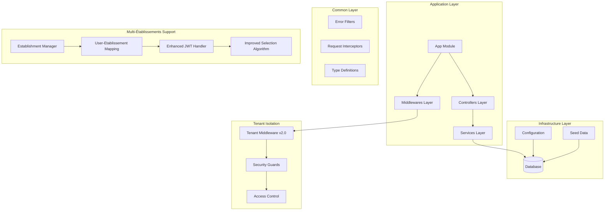
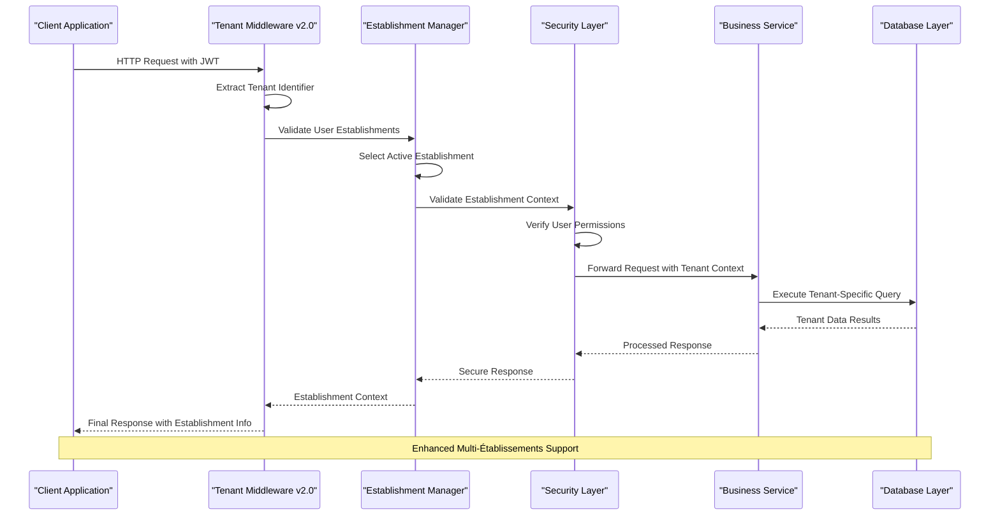
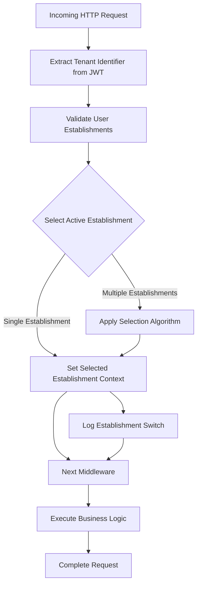
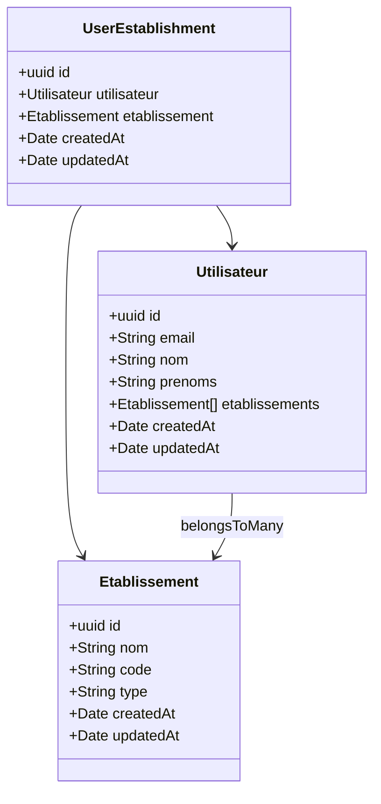
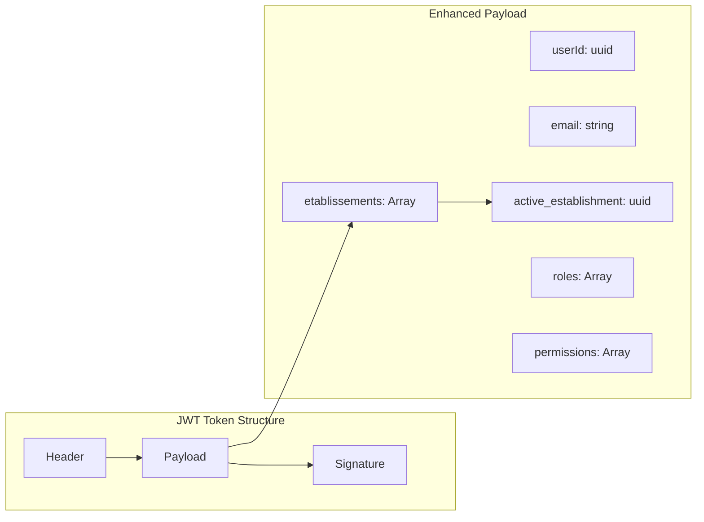
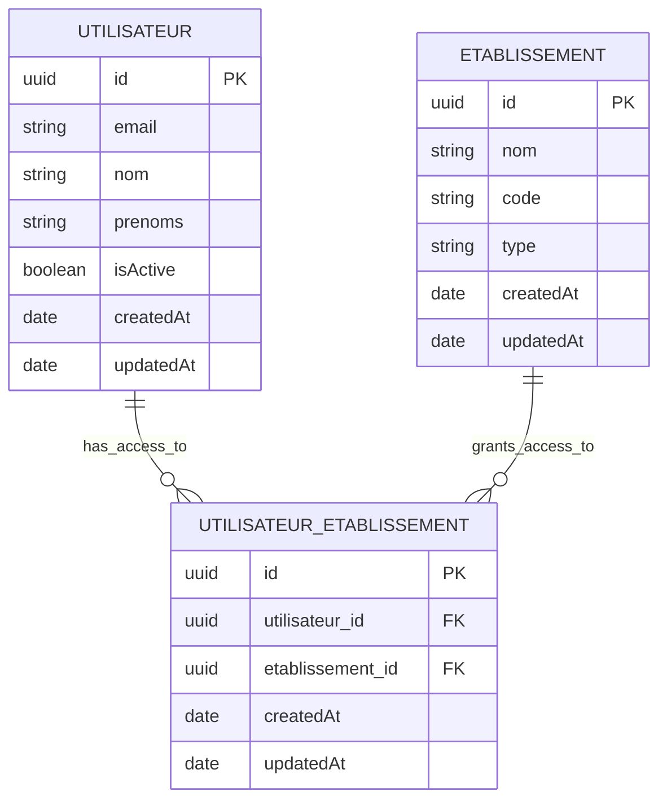

# Multi-Tenant Architecture

<cite>
**Referenced Files in This Document**
- [tenant.middleware.ts](file://backend/src/common/middlewares/tenant.middleware.ts)
- [index.ts](file://backend/src/common/middlewares/index.ts)
- [database.config.ts](file://backend/src/config/database.config.ts)
- [data-source.ts](file://backend/src/database/data-source.ts)
- [env.config.ts](file://backend/src/config/env.config.ts)
- [initial.seed.ts](file://backend/src/database/seeds/initial.seed.ts)
- [run-seeds.ts](file://backend/src/database/seeds/run-seeds.ts)
- [app.ts](file://backend/src/app.ts)
- [express.d.ts](file://backend/src/common/types/express.d.ts)
- [002-multi-etablissements.sql](file://backend/src/database/migrations/002-multi-etablissements.sql)
- [utilisateur-etablissement.controller.ts](file://backend/src/modules/auth/controllers/utilisateur-etablissement.controller.ts)
- [utilisateur-etablissement.entity.ts](file://backend/src/modules/auth/entities/utilisateur-etablissement.entity.ts)
- [utilisateur-etablissement.service.ts](file://backend/src/modules/auth/services/utilisateur-etablissement.service.ts)
- [etablissement.controller.ts](file://backend/src/modules/etablissement/controllers/etablissement.controller.ts)
- [etablissement.entity.ts](file://backend/src/modules/etablissement/entities/etablissement.entity.ts)
- [etablissement.service.ts](file://backend/src/modules/etablissement/services/etablissement.service.ts)
</cite>

## Update Summary
**Changes Made**
- Added comprehensive documentation for multi-établissements (multi-establishment) support
- Updated JWT structure documentation to reflect etablissements array implementation
- Enhanced tenant middleware v2.0 documentation with improved selection algorithm
- Added new establishment management components and user-establishment relationships
- Updated database schema documentation to include multi-establishment migration

## Table of Contents
1. [Introduction](#introduction)
2. [Project Structure](#project-structure)
3. [Core Components](#core-components)
4. [Architecture Overview](#architecture-overview)
5. [Detailed Component Analysis](#detailed-component-analysis)
6. [Multi-Établissements Implementation](#multi-établissements-implementation)
7. [Enhanced Tenant Management](#enhanced-tenant-management)
8. [Database Configuration](#database-configuration)
9. [Security and Access Control](#security-and-access-control)
10. [Performance Considerations](#performance-considerations)
11. [Troubleshooting Guide](#troubleshooting-guide)
12. [Conclusion](#conclusion)

## Introduction

The eLISAschool project implements a comprehensive multi-tenant architecture designed to serve multiple educational institutions (schools) from a single application deployment. This architecture ensures data isolation between tenants while maintaining operational efficiency and scalability. The system supports various tenant types including schools, administrative bodies, and educational networks, each with distinct data requirements and access patterns.

**Updated** The architecture now includes enhanced multi-établissements (multi-establishment) support, enabling users to manage multiple educational establishments within a single account. This enhancement introduces a new JWT structure with an etablissements array and an improved tenant middleware v2.0 with sophisticated selection algorithms.

The multi-tenant approach enables the platform to serve diverse educational environments while maintaining compliance with data privacy regulations and institutional autonomy requirements. Each tenant operates within its own isolated data domain, preventing cross-tenant data leakage while allowing centralized management and monitoring capabilities.

## Project Structure

The multi-tenant architecture is organized across several key structural layers within the backend application, now enhanced with multi-establishment capabilities:



**Diagram sources**
- [app.ts](file://backend/src/app.ts)
- [tenant.middleware.ts](file://backend/src/common/middlewares/tenant.middleware.ts)
- [database.config.ts](file://backend/src/config/database.config.ts)
- [utilisateur-etablissement.controller.ts](file://backend/src/modules/auth/controllers/utilisateur-etablissement.controller.ts)
- [utilisateur-etablissement.entity.ts](file://backend/src/modules/auth/entities/utilisateur-etablissement.entity.ts)

**Section sources**
- [app.ts](file://backend/src/app.ts)
- [env.config.ts](file://backend/src/config/env.config.ts)

## Core Components

The multi-tenant architecture consists of several interconnected components working together to ensure proper tenant isolation and management, now enhanced with multi-establishment capabilities:

### Enhanced Tenant Middleware System
The central tenant identification and isolation mechanism operates through a sophisticated middleware pipeline that intercepts all incoming requests and establishes the appropriate tenant context. The v2.0 implementation includes improved selection algorithms for handling users with multiple establishments.

### Multi-Établissements Management
A comprehensive system for managing users with access to multiple educational establishments, including establishment selection, context switching, and role-based access control across establishments.

### Enhanced JWT Structure
New JWT tokens include an etablissements array containing all establishments a user has access to, enabling seamless establishment switching and context management.

### Database Abstraction Layer
A flexible database configuration system supports multiple connection strategies while maintaining tenant-specific data boundaries through logical separation mechanisms.

### Security and Access Control
Comprehensive security measures ensure that tenant data remains isolated while providing appropriate access controls based on user roles and permissions within each tenant context.

### Configuration Management
Centralized configuration systems manage tenant-specific settings, preferences, and operational parameters without compromising data isolation.

**Section sources**
- [tenant.middleware.ts](file://backend/src/common/middlewares/tenant.middleware.ts)
- [database.config.ts](file://backend/src/config/database.config.ts)
- [env.config.ts](file://backend/src/config/env.config.ts)
- [utilisateur-etablissement.entity.ts](file://backend/src/modules/auth/entities/utilisateur-etablissement.entity.ts)

## Architecture Overview

The multi-tenant architecture follows a layered approach with clear separation of concerns and robust tenant isolation mechanisms, enhanced with multi-establishment support:



**Diagram sources**
- [tenant.middleware.ts](file://backend/src/common/middlewares/tenant.middleware.ts)
- [app.ts](file://backend/src/app.ts)
- [utilisateur-etablissement.service.ts](file://backend/src/modules/auth/services/utilisateur-etablissement.service.ts)

The architecture ensures that every request passes through enhanced tenant validation and establishment selection before any business logic is executed, providing comprehensive protection against unauthorized access attempts and seamless establishment switching capabilities.

## Detailed Component Analysis

### Enhanced Tenant Middleware Implementation

The tenant middleware serves as the cornerstone of the multi-tenant architecture, implementing sophisticated logic for tenant identification, validation, and context establishment with improved selection algorithms:



**Diagram sources**
- [tenant.middleware.ts](file://backend/src/common/middlewares/tenant.middleware.ts)
- [utilisateur-etablissement.service.ts](file://backend/src/modules/auth/services/utilisateur-etablissement.service.ts)

The middleware implementation includes comprehensive error handling, logging capabilities, and support for various tenant identification methods including subdomain-based routing, header-based identification, and path-based tenant specification. The v2.0 version now includes intelligent establishment selection algorithms for users with multiple establishments.

### Multi-Établissements User Management

The system now supports users with access to multiple establishments through a comprehensive user-establishment relationship management system:



**Diagram sources**
- [utilisateur-etablissement.entity.ts](file://backend/src/modules/auth/entities/utilisateur-etablissement.entity.ts)
- [etablissement.entity.ts](file://backend/src/modules/etablissement/entities/etablissement.entity.ts)
- [utilisateur.entity.ts](file://backend/src/modules/auth/entities/utilisateur.entity.ts)

**Section sources**
- [tenant.middleware.ts](file://backend/src/common/middlewares/tenant.middleware.ts)
- [utilisateur-etablissement.entity.ts](file://backend/src/modules/auth/entities/utilisateur-etablissement.entity.ts)
- [utilisateur-etablissement.service.ts](file://backend/src/modules/auth/services/utilisateur-etablissement.service.ts)

## Multi-Établissements Implementation

The multi-établissements implementation represents a significant enhancement to the multi-tenant architecture, enabling users to manage multiple educational establishments within a single account:

### User-Etablissement Relationship Management

The system implements a many-to-many relationship between users and establishments through the UserEstablishment entity, allowing users to have access to multiple establishments while maintaining proper data isolation:

#### Establishment Selection Algorithm

The enhanced selection algorithm determines the active establishment based on several factors:

1. **Explicit Selection**: User manually selects an establishment from their available establishments
2. **Most Recent Usage**: Automatically selects the establishment most recently accessed
3. **Primary Establishment**: Defaults to a user's primary establishment if set
4. **First Available**: Falls back to the first establishment in the user's list

### Enhanced JWT Structure

The JWT tokens now include an etablissements array containing all establishments a user has access to, enabling seamless establishment switching and context management:



**Diagram sources**
- [utilisateur-etablissement.controller.ts](file://backend/src/modules/auth/controllers/utilisateur-etablissement.controller.ts)
- [utilisateur-etablissement.service.ts](file://backend/src/modules/auth/services/utilisateur-etablissement.service.ts)

### Establishment Management Controllers

The system includes dedicated controllers for managing establishment-related operations:

- **Establishment Controller**: Handles establishment creation, updates, and management
- **User-Etablissement Controller**: Manages user-establishment relationships and establishment switching
- **Establishment Services**: Provides business logic for establishment operations and user-establishment validation

**Section sources**
- [utilisateur-etablissement.controller.ts](file://backend/src/modules/auth/controllers/utilisateur-etablissement.controller.ts)
- [utilisateur-etablissement.entity.ts](file://backend/src/modules/auth/entities/utilisateur-etablissement.entity.ts)
- [utilisateur-etablissement.service.ts](file://backend/src/modules/auth/services/utilisateur-etablissement.service.ts)
- [etablissement.controller.ts](file://backend/src/modules/etablissement/controllers/etablissement.controller.ts)
- [etablissement.entity.ts](file://backend/src/modules/etablissement/entities/etablissement.entity.ts)

## Enhanced Tenant Management

The tenant management system has been significantly enhanced to support multi-establishment scenarios with improved selection algorithms and context management:

### Improved Tenant Selection Algorithm

The v2.0 tenant middleware implements a sophisticated selection algorithm that handles users with multiple establishments:

```mermaid
stateDiagram-v2
[*] --> RequestReceived
RequestReceived --> ExtractJWT[Extract JWT Token]
ExtractJWT --> ParseEstablishments[Parsed etablissements Array]
ParseEstablishments --> ValidateUser[Validate User Establishments]
ValidateUser --> HasMultiple{Has Multiple Establishments?}
HasMultiple --> |Yes| CheckActive[Check active_establishment]
HasMultiple --> |No| SetSingle[Set Single Establishment]
CheckActive --> ActiveExists{Active Exists?}
ActiveExists --> |Yes| ValidateActive[Validate Active Establishment]
ActiveExists --> |No| ApplyAlgorithm[Apply Selection Algorithm]
ValidateActive --> ValidActive{Valid & Active?}
ValidActive --> |Yes| SetContext[Set Active Context]
ValidActive --> |No| ApplyAlgorithm
ApplyAlgorithm --> SelectMethod[Select Establishment Method]
SelectMethod --> ExplicitSelection[Explicit Selection]
SelectMethod --> MostRecent[Most Recent Usage]
SelectMethod --> PrimaryDefault[Primary Establishment]
SelectMethod --> FirstAvailable[First Available]
ExplicitSelection --> SetContext
MostRecent --> SetContext
PrimaryDefault --> SetContext
FirstAvailable --> SetContext
SetSingle --> SetContext
SetContext --> BusinessProcessing
BusinessProcessing --> [*]
```

**Diagram sources**
- [tenant.middleware.ts](file://backend/src/common/middlewares/tenant.middleware.ts)
- [utilisateur-etablissement.service.ts](file://backend/src/modules/auth/services/utilisateur-etablissement.service.ts)

### Establishment Context Management

Each request establishes a comprehensive establishment context that propagates through the entire request lifecycle:

1. **JWT Validation**: Validates JWT token and extracts establishment information
2. **Establishment Verification**: Verifies user has access to the requested establishment
3. **Context Establishment**: Sets up establishment-specific context for the request
4. **Audit Logging**: Logs establishment switching and access patterns

### Data Isolation Enhancements

The system implements multiple layers of data isolation specifically designed for multi-establishment scenarios:

1. **Establishment-Specific Filtering**: Tenant-specific filtering at query level per establishment
2. **Cross-Establishment Prevention**: Prevents data leakage between establishments
3. **Establishment Boundaries**: Middleware enforcement of establishment-specific boundaries
4. **Audit Trail Enhancement**: Comprehensive tracking of establishment-specific operations

**Section sources**
- [tenant.middleware.ts](file://backend/src/common/middlewares/tenant.middleware.ts)
- [express.d.ts](file://backend/src/common/types/express.d.ts)

## Database Configuration

The database configuration system provides flexible support for various multi-tenant deployment strategies, enhanced with multi-establishment considerations:

### Multi-Établissements Migration Support

The database schema has been enhanced to support multi-establishment scenarios through the 002-multi-etablissements.sql migration:



**Diagram sources**
- [002-multi-etablissements.sql](file://backend/src/database/migrations/002-multi-etablissements.sql)
- [utilisateur-etablissement.entity.ts](file://backend/src/modules/auth/entities/utilisateur-etablissement.entity.ts)
- [etablissement.entity.ts](file://backend/src/modules/etablissement/entities/etablissement.entity.ts)

### Connection Pool Management

The system manages database connections efficiently while maintaining tenant isolation and supporting multi-establishment operations:

- **Connection Pooling**: Optimizes database connection reuse across establishments
- **Establishment-Specific Pools**: Supports separate pools per establishment when needed
- **Connection Validation**: Ensures connection health and validity for multi-establishment queries
- **Automatic Reconnection**: Handles connection failures gracefully in multi-establishment context

### Schema Management Enhancements

The database schema supports tenant-specific data organization with enhanced multi-establishment capabilities:

- **Establishment Prefixes**: Optional table prefixes for logical separation by establishment
- **Shared Schemas**: Common tables for shared data across establishments
- **Establishment-Specific Tables**: Isolated tables for establishment-specific data
- **Multi-Etablissement Migrations**: Automated migration support for establishment schemas

**Section sources**
- [database.config.ts](file://backend/src/config/database.config.ts)
- [data-source.ts](file://backend/src/database/data-source.ts)
- [002-multi-etablissements.sql](file://backend/src/database/migrations/002-multi-etablissements.sql)

## Security and Access Control

The security framework implements comprehensive tenant-aware access control mechanisms, enhanced for multi-establishment scenarios:

### Enhanced Role-Based Access Control (RBAC)

Tenant-specific role definitions and permission management now support establishment-level access control:

- **Establishment Roles**: Roles defined within establishment context
- **Cross-Establishment Permissions**: Hierarchical permission structures across establishments
- **Dynamic Permission Evaluation**: Runtime permission checking per establishment
- **Role Assignment**: Flexible role assignment mechanisms per establishment

### Multi-Etablissements Authentication

Multi-layered authentication supporting establishment contexts:

- **Establishment-Aware Authentication**: Authentication tied to establishment context
- **Enhanced Token Validation**: JWT token validation with establishment information
- **Session Management**: Secure session handling per establishment
- **Credential Storage**: Encrypted credential storage mechanisms with establishment awareness

### Establishment Context Security

Additional security measures for establishment-specific operations:

- **Establishment Switching Security**: Secure establishment switching mechanisms
- **Cross-Establishment Prevention**: Prevention of unauthorized establishment access
- **Establishment Audit Trails**: Comprehensive tracking of establishment-specific activities
- **Context Validation**: Continuous validation of establishment context throughout requests

**Section sources**
- [tenant.middleware.ts](file://backend/src/common/middlewares/tenant.middleware.ts)

## Performance Considerations

The multi-tenant architecture incorporates several performance optimization strategies, enhanced for multi-establishment scenarios:

### Enhanced Caching Strategies

- **Establishment-Specific Caches**: Isolated caching per establishment
- **Multi-Etablissements Caching**: Efficient caching of multi-establishment data
- **Cache Invalidation**: Granular cache invalidation per establishment
- **Intelligent Cache Preloading**: Smart preloading of frequently accessed establishment data

### Multi-Etablissements Connection Optimization

- **Connection Pooling**: Efficient database connection management across establishments
- **Establishment-Aware Lazy Loading**: Deferred loading of establishment resources
- **Batch Operations**: Optimized batch processing for establishment operations
- **Connection Multiplexing**: Shared connections for read-only establishment operations

### Enhanced Monitoring and Metrics

- **Establishment Performance Metrics**: Individual establishment performance tracking
- **Multi-Etablissements Analytics**: Cross-establishment performance analysis
- **Resource Usage Monitoring**: Resource consumption per establishment
- **Latency Analysis**: Request latency per establishment context
- **Error Rate Tracking**: Error rates specific to establishment operations

## Troubleshooting Guide

Common issues and their resolution strategies for the enhanced multi-établissements implementation:

### Multi-Etablissements Issues

**Symptoms**: Users unable to switch between establishments or access establishment-specific data
**Causes**: JWT token validation failures, establishment access issues, context switching problems
**Solutions**:
- Verify JWT token contains proper etablissements array
- Check establishment access permissions for the user
- Review establishment switching logs for errors
- Validate establishment context in middleware

### Establishment Identification Failures

**Symptoms**: Requests failing with establishment validation errors
**Causes**: Incorrect establishment identifier extraction, missing establishment configuration
**Solutions**:
- Verify establishment identification headers and JWT tokens
- Check establishment configuration in the database
- Review middleware logging for establishment identification failures

### Enhanced Connection Issues

**Symptoms**: Database connection failures for specific establishments
**Causes**: Connection pool exhaustion, establishment-specific database issues
**Solutions**:
- Monitor connection pool utilization across establishments
- Check establishment database availability
- Review connection timeout configurations for multi-establishment context

### Performance Degradation in Multi-Etablissements

**Symptoms**: Slow response times under multi-establishment load
**Causes**: Inefficient establishment queries, insufficient caching, connection bottlenecks
**Solutions**:
- Implement establishment-specific query optimization strategies
- Increase cache memory allocation for establishment data
- Optimize connection pool sizing for multi-establishment operations

**Section sources**
- [tenant.middleware.ts](file://backend/src/common/middlewares/tenant.middleware.ts)
- [database.config.ts](file://backend/src/config/database.config.ts)
- [utilisateur-etablissement.service.ts](file://backend/src/modules/auth/services/utilisateur-etablissement.service.ts)

## Conclusion

The eLISAschool multi-tenant architecture, enhanced with multi-établissements support, provides a robust foundation for serving multiple educational institutions while maintaining strict data isolation and operational efficiency. The implementation demonstrates best practices in tenant management, security, and performance optimization, now extended to support complex multi-establishment scenarios.

Key strengths of the enhanced architecture include comprehensive multi-establishment isolation mechanisms, flexible establishment switching capabilities, enhanced JWT structure with establishment arrays, and sophisticated selection algorithms for optimal user experience. The modular design allows for easy extension and customization while maintaining system stability and security across multiple establishments.

The v2.0 tenant middleware introduces intelligent establishment selection algorithms that handle users with multiple establishments seamlessly, while the enhanced JWT structure provides comprehensive establishment context management. These enhancements position the system to support complex educational environments where users may need to manage multiple establishments within a single account.

Future enhancements could include advanced establishment provisioning automation, enhanced cross-establishment analytics, and support for additional multi-establishment deployment patterns. The current enhanced architecture provides an excellent foundation for continued growth and adaptation to evolving multi-tenant requirements, particularly in complex educational environments with multiple institutional structures.