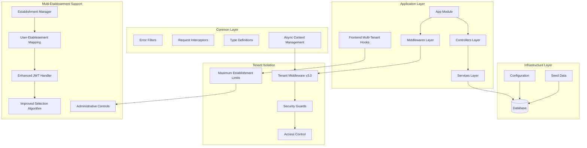
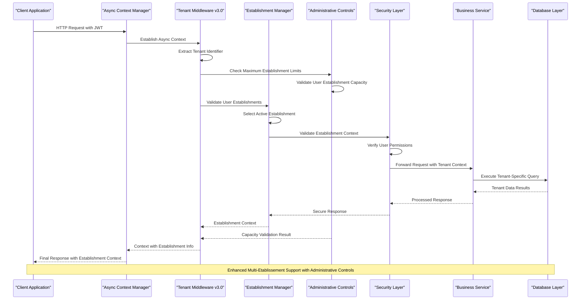
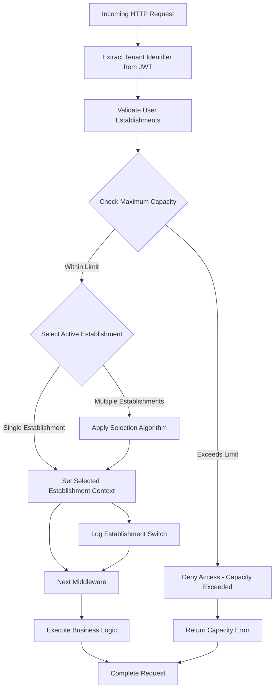
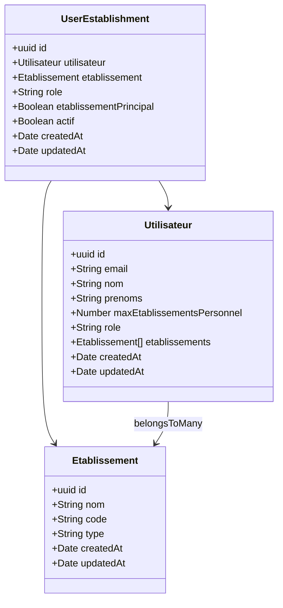
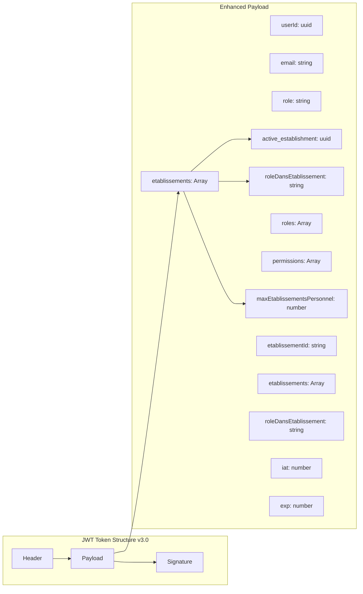
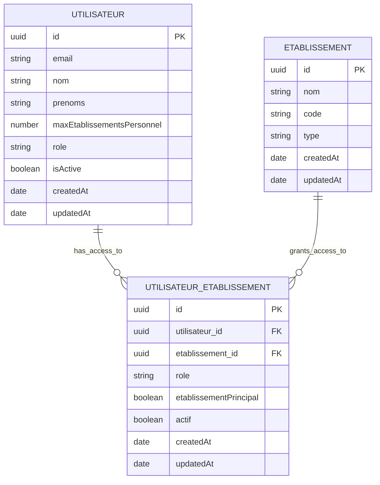

# Multi-Tenant Architecture

<cite>
**Referenced Files in This Document**
- [tenant.middleware.ts](file://backend/src/common/middlewares/tenant.middleware.ts)
- [index.ts](file://backend/src/common/middlewares/index.ts)
- [database.config.ts](file://backend/src/config/database.config.ts)
- [data-source.ts](file://backend/src/database/data-source.ts)
- [env.config.ts](file://backend/src/config/env.config.ts)
- [initial.seed.ts](file://backend/src/database/seeds/initial.seed.ts)
- [run-seeds.ts](file://backend/src/database/seeds/run-seeds.ts)
- [app.ts](file://backend/src/app.ts)
- [express.d.ts](file://backend/src/common/types/express.d.ts)
- [002-multi-etablissements.sql](file://backend/src/database/migrations/002-multi-etablissements.sql)
- [050-multi-tenant-v3-max-etablissements.sql](file://backend/database/migrations/050-multi-tenant-v3-max-etablissements.sql)
- [utilisateur-etablissement.controller.ts](file://backend/src/modules/auth/controllers/utilisateur-etablissement.controller.ts)
- [utilisateur-etablissement.entity.ts](file://backend/src/modules/auth/entities/utilisateur-etablissement.entity.ts)
- [utilisateur-etablissement.service.ts](file://backend/src/modules/auth/services/utilisateur-etablissement.service.ts)
- [etablissement.controller.ts](file://backend/src/modules/etablissement/controllers/etablissement.controller.ts)
- [etablissement.entity.ts](file://backend/src/modules/etablissement/entities/etablissement.entity.ts)
- [etablissement.service.ts](file://backend/src/modules/etablissement/services/etablissement.service.ts)
- [auth.dto.ts](file://backend/src/modules/auth/dto/auth.dto.ts)
- [use-multi-tenant.ts](file://frontend/src/hooks/use-multi-tenant.ts)
- [token.service.ts](file://backend/src/modules/auth/services/token.service.ts)
- [context.middleware.ts](file://backend/src/common/middlewares/context.middleware.ts)
- [auth-multi-etablissement.spec.ts](file://backend/test/integration/auth-multi-etablissement.spec.ts)
</cite>

## Update Summary
**Changes Made**
- Updated to reflect comprehensive multi-tenant architecture implementation with establishment-centric design
- Enhanced tenant middleware v3.0 with establishment management controls and maximum establishment limits
- Updated JWT structure documentation to include establishment arrays and role-specific payloads
- Added new maximum establishment constraints and administrative controls
- Enhanced frontend multi-tenant hook with optimized caching and establishment-specific optimizations

## Table of Contents
1. [Introduction](#introduction)
2. [Project Structure](#project-structure)
3. [Core Components](#core-components)
4. [Architecture Overview](#architecture-overview)
5. [Detailed Component Analysis](#detailed-component-analysis)
6. [Multi-Etablissement Implementation](#multi-etablissement-implementation)
7. [Enhanced Tenant Management](#enhanced-tenant-management)
8. [Database Configuration](#database-configuration)
9. [Security and Access Control](#security-and-access-control)
10. [Performance Considerations](#performance-considerations)
11. [Troubleshooting Guide](#troubleshooting-guide)
12. [Conclusion](#conclusion)

## Introduction

The eLISAschool project implements a comprehensive multi-tenant architecture designed to serve multiple educational institutions (schools) from a single application deployment. This architecture ensures data isolation between tenants while maintaining operational efficiency and scalability. The system supports various tenant types including schools, administrative bodies, and educational networks, each with distinct data requirements and access patterns.

**Updated** The architecture now includes enhanced multi-établissements (multi-establishment) support with establishment-centric design principles, tenant middleware v3.0 featuring maximum establishment limits, and an enhanced JWT structure with establishment arrays and role-specific payloads. The v3.0 implementation introduces administrative controls for establishing user limits, ensuring optimal resource utilization while maintaining flexibility for multi-establishment scenarios.

The multi-tenant approach enables the platform to serve diverse educational environments while maintaining compliance with data privacy regulations and institutional autonomy requirements. Each tenant operates within its own isolated data domain, preventing cross-tenant data leakage while allowing centralized management and monitoring capabilities.

## Project Structure

The multi-tenant architecture is organized across several key structural layers within the backend application, now enhanced with establishment-centric capabilities:



**Diagram sources**
- [app.ts](file://backend/src/app.ts)
- [tenant.middleware.ts](file://backend/src/common/middlewares/tenant.middleware.ts)
- [database.config.ts](file://backend/src/config/database.config.ts)
- [use-multi-tenant.ts](file://frontend/src/hooks/use-multi-tenant.ts)
- [050-multi-tenant-v3-max-etablissements.sql](file://backend/database/migrations/050-multi-tenant-v3-max-etablissements.sql)

**Section sources**
- [app.ts](file://backend/src/app.ts)
- [env.config.ts](file://backend/src/config/env.config.ts)

## Core Components

The multi-tenant architecture consists of several interconnected components working together to ensure proper tenant isolation and management, now enhanced with establishment-centric capabilities:

### Enhanced Tenant Middleware System (v3.0)
The central tenant identification and isolation mechanism operates through a sophisticated middleware pipeline that intercepts all incoming requests and establishes the appropriate tenant context. The v3.0 implementation includes improved selection algorithms for handling users with multiple establishments and administrative controls for maximum establishment limits.

### Multi-Etablissement Management
A comprehensive system for managing users with access to multiple educational establishments, including establishment selection, context switching, and role-based access control across establishments with configurable limits.

### Enhanced JWT Structure
New JWT tokens include an etablissements array containing all establishments a user has access to, enabling seamless establishment switching and context management, plus role-specific payloads for establishment-level permissions.

### Maximum Establishment Constraints
Administrative controls that limit the number of establishments users can belong to, with special provisions for SUPER_ADMIN users who have unlimited access.

### Database Abstraction Layer
A flexible database configuration system supports multiple connection strategies while maintaining tenant-specific data boundaries through logical separation mechanisms and establishment-specific indexing.

### Security and Access Control
Comprehensive security measures ensure that tenant data remains isolated while providing appropriate access controls based on user roles and permissions within each tenant context, with establishment-level granularity.

### Configuration Management
Centralized configuration systems manage tenant-specific settings, preferences, and operational parameters without compromising data isolation, including establishment-specific policies.

**Section sources**
- [tenant.middleware.ts](file://backend/src/common/middlewares/tenant.middleware.ts)
- [database.config.ts](file://backend/src/config/database.config.ts)
- [env.config.ts](file://backend/src/config/env.config.ts)
- [utilisateur-etablissement.entity.ts](file://backend/src/modules/auth/entities/utilisateur-etablissement.entity.ts)
- [050-multi-tenant-v3-max-etablissements.sql](file://backend/database/migrations/050-multi-tenant-v3-max-etablissements.sql)

## Architecture Overview

The multi-tenant architecture follows a layered approach with clear separation of concerns and robust tenant isolation mechanisms, enhanced with establishment-centric support:



**Diagram sources**
- [tenant.middleware.ts](file://backend/src/common/middlewares/tenant.middleware.ts)
- [context.middleware.ts](file://backend/src/common/middlewares/context.middleware.ts)
- [app.ts](file://backend/src/app.ts)
- [050-multi-tenant-v3-max-etablissements.sql](file://backend/database/migrations/050-multi-tenant-v3-max-etablissements.sql)

The architecture ensures that every request passes through enhanced tenant validation, administrative capacity checks, and establishment selection before any business logic is executed, providing comprehensive protection against unauthorized access attempts and seamless establishment switching capabilities with proper resource management.

## Detailed Component Analysis

### Enhanced Tenant Middleware Implementation (v3.0)

The tenant middleware serves as the cornerstone of the multi-tenant architecture, implementing sophisticated logic for tenant identification, validation, and context establishment with improved selection algorithms and administrative controls:



**Diagram sources**
- [tenant.middleware.ts](file://backend/src/common/middlewares/tenant.middleware.ts)
- [050-multi-tenant-v3-max-etablissements.sql](file://backend/database/migrations/050-multi-tenant-v3-max-etablissements.sql)
- [utilisateur-etablissement.service.ts](file://backend/src/modules/auth/services/utilisateur-etablissement.service.ts)

The middleware implementation includes comprehensive error handling, logging capabilities, and support for various tenant identification methods including subdomain-based routing, header-based identification, and path-based tenant specification. The v3.0 version now includes intelligent establishment selection algorithms for users with multiple establishments and administrative capacity validation.

### Multi-Etablissement User Management

The system now supports users with access to multiple establishments through a comprehensive user-establishment relationship management system with administrative controls:



**Diagram sources**
- [utilisateur-etablissement.entity.ts](file://backend/src/modules/auth/entities/utilisateur-etablissement.entity.ts)
- [etablissement.entity.ts](file://backend/src/modules/etablissement/entities/etablissement.entity.ts)
- [utilisateur.entity.ts](file://backend/src/modules/auth/entities/utilisateur.entity.ts)
- [050-multi-tenant-v3-max-etablissements.sql](file://backend/database/migrations/050-multi-tenant-v3-max-etablissements.sql)

**Section sources**
- [tenant.middleware.ts](file://backend/src/common/middlewares/tenant.middleware.ts)
- [utilisateur-etablissement.entity.ts](file://backend/src/modules/auth/entities/utilisateur-etablissement.entity.ts)
- [utilisateur-etablissement.service.ts](file://backend/src/modules/auth/services/utilisateur-etablissement.service.ts)
- [050-multi-tenant-v3-max-etablissements.sql](file://backend/database/migrations/050-multi-tenant-v3-max-etablissements.sql)

## Multi-Etablissement Implementation

The multi-établissements implementation represents a significant enhancement to the multi-tenant architecture, enabling users to manage multiple educational establishments within a single account with administrative controls:

### User-Etablissement Relationship Management

The system implements a many-to-many relationship between users and establishments through the UserEstablishment entity, allowing users to have access to multiple establishments while maintaining proper data isolation:

#### Maximum Establishment Capacity Controls

The v3.0 implementation introduces administrative controls for establishing user limits:

1. **maxEtablissementsPersonnel Column**: Tracks maximum establishments per user
2. **SUPER_ADMIN Unlimited Access**: Special provision for unlimited establishment access
3. **Capacity Validation**: Middleware validates establishment access against user limits
4. **Index Optimization**: Database indexes for efficient capacity queries

#### Enhanced Establishment Selection Algorithm

The enhanced selection algorithm determines the active establishment based on several factors:

1. **Explicit Selection**: User manually selects an establishment from their available establishments
2. **Most Recent Usage**: Automatically selects the establishment most recently accessed
3. **Primary Establishment**: Defaults to a user's primary establishment if set
4. **First Available**: Falls back to the first establishment in the user's list
5. **Capacity Validation**: Ensures selected establishment is within user's capacity limits

### Enhanced JWT Structure

The JWT tokens now include an etablissements array containing all establishments a user has access to, enabling seamless establishment switching and context management:



**Diagram sources**
- [auth.dto.ts](file://backend/src/modules/auth/dto/auth.dto.ts)
- [utilisateur-etablissement.controller.ts](file://backend/src/modules/auth/controllers/utilisateur-etablissement.controller.ts)
- [utilisateur-etablissement.service.ts](file://backend/src/modules/auth/services/utilisateur-etablissement.service.ts)

### Establishment Management Controllers

The system includes dedicated controllers for managing establishment-related operations:

- **Establishment Controller**: Handles establishment creation, updates, and management
- **User-Etablissement Controller**: Manages user-establishment relationships and establishment switching
- **Establishment Services**: Provides business logic for establishment operations and user-establishment validation

**Section sources**
- [utilisateur-etablissement.controller.ts](file://backend/src/modules/auth/controllers/utilisateur-etablissement.controller.ts)
- [utilisateur-etablissement.entity.ts](file://backend/src/modules/auth/entities/utilisateur-etablissement.entity.ts)
- [utilisateur-etablissement.service.ts](file://backend/src/modules/auth/services/utilisateur-etablissement.service.ts)
- [etablissement.controller.ts](file://backend/src/modules/etablissement/controllers/etablissement.controller.ts)
- [etablissement.entity.ts](file://backend/src/modules/etablissement/entities/etablissement.entity.ts)
- [050-multi-tenant-v3-max-etablissements.sql](file://backend/database/migrations/050-multi-tenant-v3-max-etablissements.sql)

## Enhanced Tenant Management

The tenant management system has been significantly enhanced to support multi-establishment scenarios with improved selection algorithms, administrative controls, and establishment-centric design:

### Improved Tenant Selection Algorithm (v3.0)

The v3.0 tenant middleware implements a sophisticated selection algorithm that handles users with multiple establishments and validates against maximum capacity limits:

```mermaid
stateDiagram-v2
[*] --> RequestReceived
RequestReceived --> ExtractJWT[Extract JWT Token]
ExtractJWT --> ParseEstablishments[Parsed etablissements Array]
ParseEstablishments --> ValidateUser[Validate User Establishments]
ValidateUser --> CheckCapacity[Check Maximum Establishment Capacity]
CheckCapacity --> HasMultiple{Has Multiple Establishments?}
HasMultiple --> |Yes| CheckActive[Check active_establishment]
HasMultiple --> |No| SetSingle[Set Single Establishment]
CheckActive --> ActiveExists{Active Exists?}
ActiveExists --> |Yes| ValidateActive[Validate Active Establishment]
ActiveExists --> |No| ApplyAlgorithm[Apply Selection Algorithm]
ValidateActive --> ValidActive{Valid & Active?}
ValidActive --> |Yes| CapacityCheck[Check Establishment Capacity]
ValidActive --> |No| ApplyAlgorithm
ApplyAlgorithm --> SelectMethod[Select Establishment Method]
SelectMethod --> ExplicitSelection[Explicit Selection]
SelectMethod --> MostRecent[Most Recent Usage]
SelectMethod --> PrimaryDefault[Primary Establishment]
SelectMethod --> FirstAvailable[First Available]
ExplicitSelection --> CapacityCheck
MostRecent --> CapacityCheck
PrimaryDefault --> CapacityCheck
FirstAvailable --> CapacityCheck
SetSingle --> CapacityCheck
CapacityCheck --> WithinLimit{Within Capacity?}
WithinLimit --> |Yes| SetContext[Set Active Context]
WithinLimit --> |No| CapacityError[Return Capacity Error]
SetContext --> BusinessProcessing
BusinessProcessing --> [*]
CapacityError --> ErrorHandler[Handle Capacity Error]
ErrorHandler --> [*]
```

**Diagram sources**
- [tenant.middleware.ts](file://backend/src/common/middlewares/tenant.middleware.ts)
- [050-multi-tenant-v3-max-etablissements.sql](file://backend/database/migrations/050-multi-tenant-v3-max-etablissements.sql)
- [utilisateur-etablissement.service.ts](file://backend/src/modules/auth/services/utilisateur-etablissement.service.ts)

### Establishment Context Management

Each request establishes a comprehensive establishment context that propagates through the entire request lifecycle:

1. **JWT Validation**: Validates JWT token and extracts establishment information
2. **Capacity Validation**: Checks user's maximum establishment capacity
3. **Establishment Verification**: Verifies user has access to the requested establishment
4. **Context Establishment**: Sets up establishment-specific context for the request
5. **Audit Logging**: Logs establishment switching and access patterns

### Data Isolation Enhancements

The system implements multiple layers of data isolation specifically designed for multi-establishment scenarios:

1. **Establishment-Specific Filtering**: Tenant-specific filtering at query level per establishment
2. **Cross-Establishment Prevention**: Prevents data leakage between establishments
3. **Establishment Boundaries**: Middleware enforcement of establishment-specific boundaries
4. **Capacity Enforcement**: Administrative controls preventing establishment overload
5. **Audit Trail Enhancement**: Comprehensive tracking of establishment-specific operations

**Section sources**
- [tenant.middleware.ts](file://backend/src/common/middlewares/tenant.middleware.ts)
- [express.d.ts](file://backend/src/common/types/express.d.ts)
- [050-multi-tenant-v3-max-etablissements.sql](file://backend/database/migrations/050-multi-tenant-v3-max-etablissements.sql)

## Database Configuration

The database configuration system provides flexible support for various multi-tenant deployment strategies, enhanced with multi-establishment considerations and administrative controls:

### Multi-Etablissement Migration Support (v3.0)

The database schema has been enhanced to support multi-establishment scenarios through the 050-multi-tenant-v3-max-etablissements.sql migration:



**Diagram sources**
- [050-multi-tenant-v3-max-etablissements.sql](file://backend/database/migrations/050-multi-tenant-v3-max-etablissements.sql)
- [utilisateur-etablissement.entity.ts](file://backend/src/modules/auth/entities/utilisateur-etablissement.entity.ts)
- [etablissement.entity.ts](file://backend/src/modules/etablissement/entities/etablissement.entity.ts)

### Connection Pool Management

The system manages database connections efficiently while maintaining tenant isolation and supporting multi-establishment operations:

- **Connection Pooling**: Optimizes database connection reuse across establishments
- **Establishment-Specific Pools**: Supports separate pools per establishment when needed
- **Connection Validation**: Ensures connection health and validity for multi-establishment queries
- **Automatic Reconnection**: Handles connection failures gracefully in multi-establishment context

### Schema Management Enhancements

The database schema supports tenant-specific data organization with enhanced multi-establishment capabilities:

- **Establishment Prefixes**: Optional table prefixes for logical separation by establishment
- **Shared Schemas**: Common tables for shared data across establishments
- **Establishment-Specific Tables**: Isolated tables for establishment-specific data
- **Multi-Etablissement Migrations**: Automated migration support for establishment schemas
- **Capacity Indexes**: Optimized indexes for establishment capacity queries

**Section sources**
- [database.config.ts](file://backend/src/config/database.config.ts)
- [data-source.ts](file://backend/src/database/data-source.ts)
- [050-multi-tenant-v3-max-etablissements.sql](file://backend/database/migrations/050-multi-tenant-v3-max-etablissements.sql)

## Security and Access Control

The security framework implements comprehensive tenant-aware access control mechanisms, enhanced for multi-establishment scenarios with administrative controls:

### Enhanced Role-Based Access Control (RBAC)

Tenant-specific role definitions and permission management now support establishment-level access control:

- **Establishment Roles**: Roles defined within establishment context
- **Cross-Establishment Permissions**: Hierarchical permission structures across establishments
- **Dynamic Permission Evaluation**: Runtime permission checking per establishment
- **Role Assignment**: Flexible role assignment mechanisms per establishment
- **Role-Specific Payloads**: Establishment-specific role information in JWT

### Multi-Etablissement Authentication

Multi-layered authentication supporting establishment contexts with capacity validation:

- **Establishment-Aware Authentication**: Authentication tied to establishment context
- **Enhanced Token Validation**: JWT token validation with establishment information and capacity limits
- **Session Management**: Secure session handling per establishment
- **Credential Storage**: Encrypted credential storage mechanisms with establishment awareness
- **Capacity Enforcement**: Real-time validation of establishment access limits

### Establishment Context Security

Additional security measures for establishment-specific operations:

- **Establishment Switching Security**: Secure establishment switching mechanisms
- **Cross-Establishment Prevention**: Prevention of unauthorized establishment access
- **Establishment Audit Trails**: Comprehensive tracking of establishment-specific activities
- **Context Validation**: Continuous validation of establishment context throughout requests
- **Capacity Monitoring**: Real-time tracking of establishment usage limits

**Section sources**
- [tenant.middleware.ts](file://backend/src/common/middlewares/tenant.middleware.ts)
- [050-multi-tenant-v3-max-etablissements.sql](file://backend/database/migrations/050-multi-tenant-v3-max-etablissements.sql)

## Performance Considerations

The multi-tenant architecture incorporates several performance optimization strategies, enhanced for multi-establishment scenarios with administrative controls:

### Enhanced Caching Strategies

- **Establishment-Specific Caches**: Isolated caching per establishment
- **Multi-Etablissements Caching**: Efficient caching of multi-establishment data
- **Cache Invalidation**: Granular cache invalidation per establishment
- **Intelligent Cache Preloading**: Smart preloading of frequently accessed establishment data
- **Capacity-Aware Caching**: Establishment capacity information caching

### Multi-Etablissement Connection Optimization

- **Connection Pooling**: Efficient database connection management across establishments
- **Establishment-Aware Lazy Loading**: Deferred loading of establishment resources
- **Batch Operations**: Optimized batch processing for establishment operations
- **Connection Multiplexing**: Shared connections for read-only establishment operations
- **Capacity-Based Connection Limits**: Dynamic connection limits based on establishment capacity

### Enhanced Monitoring and Metrics

- **Establishment Performance Metrics**: Individual establishment performance tracking
- **Multi-Etablissements Analytics**: Cross-establishment performance analysis
- **Resource Usage Monitoring**: Resource consumption per establishment
- **Latency Analysis**: Request latency per establishment context
- **Error Rate Tracking**: Error rates specific to establishment operations
- **Capacity Utilization Monitoring**: Real-time tracking of establishment usage limits

### Frontend Multi-Tenant Optimizations

The frontend includes specialized hooks for optimized multi-tenant performance:

- **Establishment-Specific Caching**: Separate cache management per establishment
- **Intelligent Query Optimization**: Automatic query parameter filtering and optimization
- **Retry Strategies**: Establishment-aware retry mechanisms
- **Performance Monitoring**: Built-in performance tracking for establishment operations

**Section sources**
- [use-multi-tenant.ts](file://frontend/src/hooks/use-multi-tenant.ts)
- [050-multi-tenant-v3-max-etablissements.sql](file://backend/database/migrations/050-multi-tenant-v3-max-etablissements.sql)

## Troubleshooting Guide

Common issues and their resolution strategies for the enhanced multi-établissements implementation:

### Multi-Etablissement Issues

**Symptoms**: Users unable to switch between establishments or access establishment-specific data
**Causes**: JWT token validation failures, establishment access issues, context switching problems, capacity limit violations
**Solutions**:
- Verify JWT token contains proper etablissements array and establishment capacity information
- Check establishment access permissions for the user
- Review establishment switching logs for errors
- Validate establishment context in middleware
- Check user's maximum establishment capacity limits

### Establishment Identification Failures

**Symptoms**: Requests failing with establishment validation errors
**Causes**: Incorrect establishment identifier extraction, missing establishment configuration, capacity limit exceeded
**Solutions**:
- Verify establishment identification headers and JWT tokens
- Check establishment configuration in the database
- Review middleware logging for establishment identification failures
- Validate user's establishment capacity limits

### Enhanced Connection Issues

**Symptoms**: Database connection failures for specific establishments
**Causes**: Connection pool exhaustion, establishment-specific database issues, capacity-based connection limits
**Solutions**:
- Monitor connection pool utilization across establishments
- Check establishment database availability
- Review connection timeout configurations for multi-establishment context
- Validate establishment capacity-based connection limits

### Performance Degradation in Multi-Etablissements

**Symptoms**: Slow response times under multi-establishment load
**Causes**: Inefficient establishment queries, insufficient caching, connection bottlenecks, capacity limit violations
**Solutions**:
- Implement establishment-specific query optimization strategies
- Increase cache memory allocation for establishment data
- Optimize connection pool sizing for multi-establishment operations
- Review establishment capacity limits and adjust as needed

### Capacity Limit Issues

**Symptoms**: Users receiving capacity exceeded errors when accessing establishments
**Causes**: User has reached maximum establishment limit, administrative restrictions
**Solutions**:
- Check user's maxEtablissementsPersonnel setting
- Verify SUPER_ADMIN status for unlimited access
- Adjust user capacity limits if appropriate
- Review establishment assignment policies

**Section sources**
- [tenant.middleware.ts](file://backend/src/common/middlewares/tenant.middleware.ts)
- [database.config.ts](file://backend/src/config/database.config.ts)
- [utilisateur-etablissement.service.ts](file://backend/src/modules/auth/services/utilisateur-etablissement.service.ts)
- [050-multi-tenant-v3-max-etablissements.sql](file://backend/database/migrations/050-multi-tenant-v3-max-etablissements.sql)

## Conclusion

The eLISAschool multi-tenant architecture, enhanced with multi-établissements support and establishment-centric design, provides a robust foundation for serving multiple educational institutions while maintaining strict data isolation and operational efficiency. The implementation demonstrates best practices in tenant management, security, and performance optimization, now extended to support complex multi-establishment scenarios with administrative controls.

Key strengths of the enhanced architecture include comprehensive multi-establishment isolation mechanisms, flexible establishment switching capabilities, enhanced JWT structure with establishment arrays and role-specific payloads, sophisticated selection algorithms for optimal user experience, and administrative controls for establishing user capacity limits. The modular design allows for easy extension and customization while maintaining system stability and security across multiple establishments.

The v3.0 tenant middleware introduces intelligent establishment selection algorithms that handle users with multiple establishments seamlessly, while the enhanced JWT structure provides comprehensive establishment context management with role-specific information. The addition of maximum establishment capacity controls ensures optimal resource utilization while maintaining flexibility for complex educational environments.

Future enhancements could include advanced establishment provisioning automation, enhanced cross-establishment analytics with capacity insights, support for additional multi-establishment deployment patterns, and real-time capacity monitoring dashboards. The current enhanced architecture provides an excellent foundation for continued growth and adaptation to evolving multi-tenant requirements, particularly in complex educational environments with multiple institutional structures and administrative oversight needs.