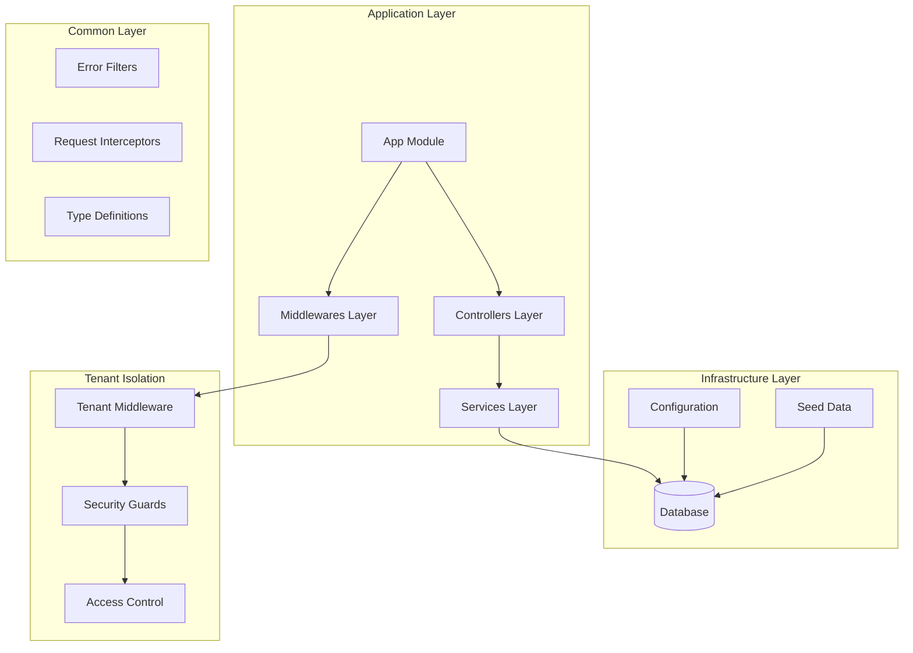
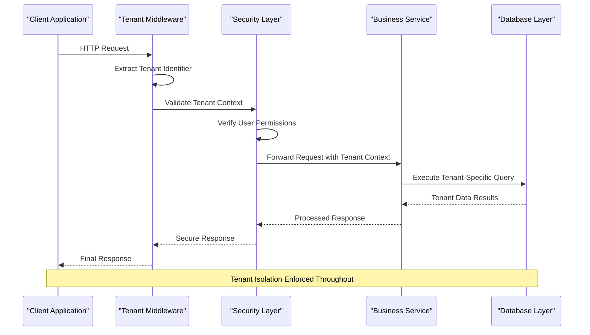
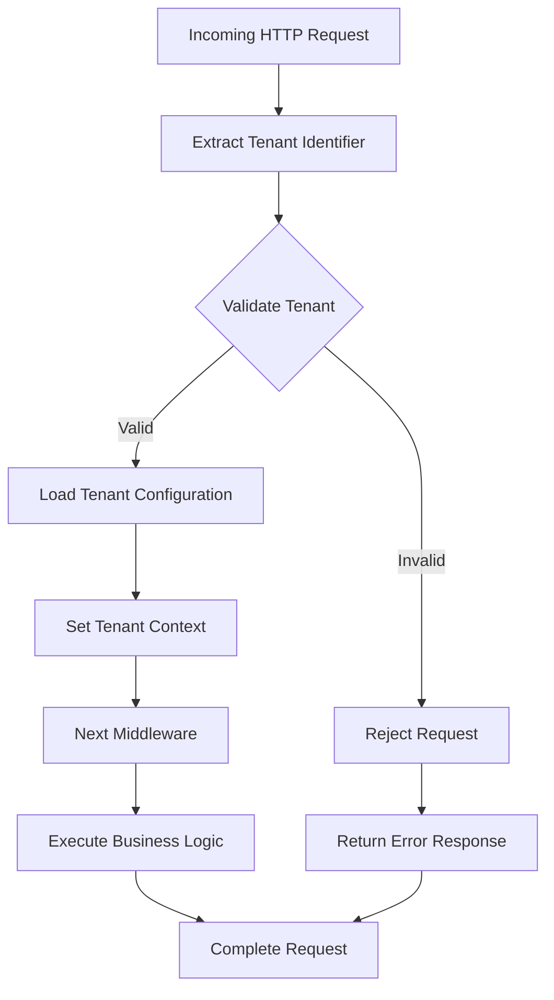
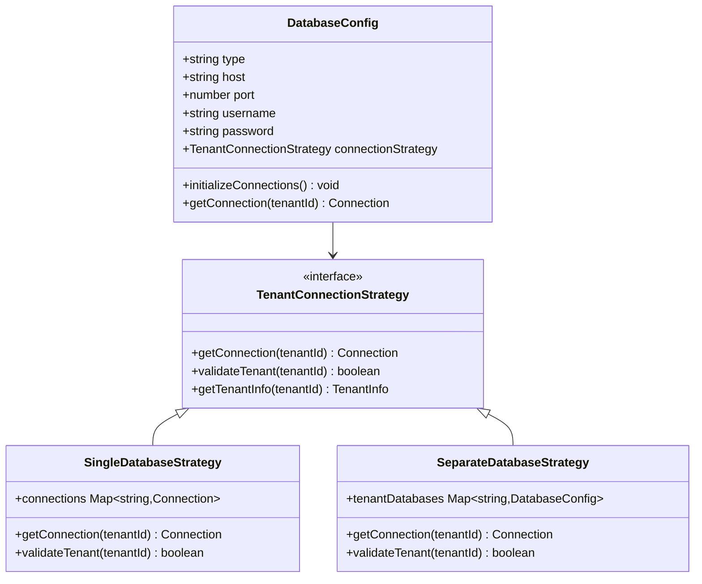
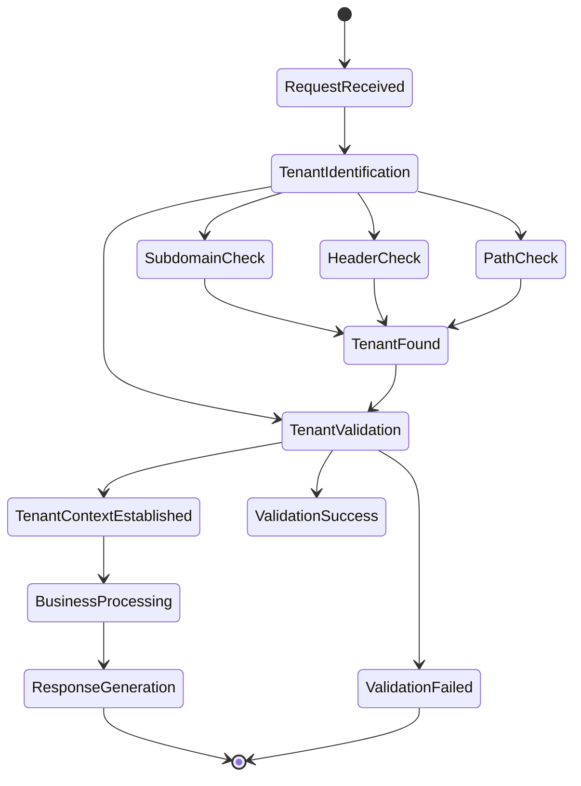

# Multi-Tenant Architecture

<cite>
**Referenced Files in This Document**
- [tenant.middleware.ts](file://backend/src/common/middlewares/tenant.middleware.ts)
- [index.ts](file://backend/src/common/middlewares/index.ts)
- [database.config.ts](file://backend/src/config/database.config.ts)
- [data-source.ts](file://backend/src/database/data-source.ts)
- [env.config.ts](file://backend/src/config/env.config.ts)
- [initial.seed.ts](file://backend/src/database/seeds/initial.seed.ts)
- [run-seeds.ts](file://backend/src/database/seeds/run-seeds.ts)
- [app.ts](file://backend/src/app.ts)
- [express.d.ts](file://backend/src/common/types/express.d.ts)
</cite>

## Table of Contents
1. [Introduction](#introduction)
2. [Project Structure](#project-structure)
3. [Core Components](#core-components)
4. [Architecture Overview](#architecture-overview)
5. [Detailed Component Analysis](#detailed-component-analysis)
6. [Tenant Management Implementation](#tenant-management-implementation)
7. [Database Configuration](#database-configuration)
8. [Security and Access Control](#security-and-access-control)
9. [Performance Considerations](#performance-considerations)
10. [Troubleshooting Guide](#troubleshooting-guide)
11. [Conclusion](#conclusion)

## Introduction

The eLISAschool project implements a comprehensive multi-tenant architecture designed to serve multiple educational institutions (schools) from a single application deployment. This architecture ensures data isolation between tenants while maintaining operational efficiency and scalability. The system supports various tenant types including schools, administrative bodies, and educational networks, each with distinct data requirements and access patterns.

The multi-tenant approach enables the platform to serve diverse educational environments while maintaining compliance with data privacy regulations and institutional autonomy requirements. Each tenant operates within its own isolated data domain, preventing cross-tenant data leakage while allowing centralized management and monitoring capabilities.

## Project Structure

The multi-tenant architecture is organized across several key structural layers within the backend application:

**Diagram sources**
- [app.ts](file://backend/src/app.ts)
- [tenant.middleware.ts](file://backend/src/common/middlewares/tenant.middleware.ts)
- [database.config.ts](file://backend/src/config/database.config.ts)

**Section sources**
- [app.ts](file://backend/src/app.ts)
- [env.config.ts](file://backend/src/config/env.config.ts)

## Core Components

The multi-tenant architecture consists of several interconnected components working together to ensure proper tenant isolation and management:

### Tenant Middleware System
The central tenant identification and isolation mechanism operates through a sophisticated middleware pipeline that intercepts all incoming requests and establishes the appropriate tenant context.

### Database Abstraction Layer
A flexible database configuration system supports multiple connection strategies while maintaining tenant-specific data boundaries through logical separation mechanisms.

### Security and Access Control
Comprehensive security measures ensure that tenant data remains isolated while providing appropriate access controls based on user roles and permissions within each tenant context.

### Configuration Management
Centralized configuration systems manage tenant-specific settings, preferences, and operational parameters without compromising data isolation.

**Section sources**
- [tenant.middleware.ts](file://backend/src/common/middlewares/tenant.middleware.ts)
- [database.config.ts](file://backend/src/config/database.config.ts)
- [env.config.ts](file://backend/src/config/env.config.ts)

## Architecture Overview

The multi-tenant architecture follows a layered approach with clear separation of concerns and robust tenant isolation mechanisms:

**Diagram sources**
- [tenant.middleware.ts](file://backend/src/common/middlewares/tenant.middleware.ts)
- [app.ts](file://backend/src/app.ts)

The architecture ensures that every request passes through tenant validation before any business logic is executed, providing comprehensive protection against unauthorized access attempts.

## Detailed Component Analysis

### Tenant Middleware Implementation

The tenant middleware serves as the cornerstone of the multi-tenant architecture, implementing sophisticated logic for tenant identification, validation, and context establishment:

**Diagram sources**
- [tenant.middleware.ts](file://backend/src/common/middlewares/tenant.middleware.ts)

The middleware implementation includes comprehensive error handling, logging capabilities, and support for various tenant identification methods including subdomain-based routing, header-based identification, and path-based tenant specification.

### Database Configuration and Connection Management

The database configuration system supports multiple connection strategies optimized for tenant isolation and performance:

**Diagram sources**
- [database.config.ts](file://backend/src/config/database.config.ts)
- [data-source.ts](file://backend/src/database/data-source.ts)

**Section sources**
- [database.config.ts](file://backend/src/config/database.config.ts)
- [data-source.ts](file://backend/src/database/data-source.ts)

## Tenant Management Implementation

The tenant management system encompasses several critical components working together to maintain tenant isolation and operational efficiency:

### Tenant Identification Strategies

The system supports multiple tenant identification approaches to accommodate different deployment scenarios and client requirements:

1. **Subdomain-Based Identification**: Utilizes subdomain patterns to automatically identify tenants
2. **Header-Based Identification**: Supports custom headers for tenant specification
3. **Path-Based Identification**: Uses URL path segments for tenant determination
4. **Cookie-Based Identification**: Maintains tenant context through session cookies

### Tenant Context Management

Each request establishes a tenant context that propagates through the entire request lifecycle:

**Diagram sources**
- [tenant.middleware.ts](file://backend/src/common/middlewares/tenant.middleware.ts)

### Data Isolation Mechanisms

The system implements multiple layers of data isolation to prevent cross-tenant data leakage:

1. **Logical Isolation**: Tenant-specific filtering at query level
2. **Physical Separation**: Separate database schemas or instances per tenant
3. **Application-Level Filtering**: Middleware enforcement of tenant boundaries
4. **Audit Logging**: Comprehensive tracking of tenant-specific operations

**Section sources**
- [tenant.middleware.ts](file://backend/src/common/middlewares/tenant.middleware.ts)
- [express.d.ts](file://backend/src/common/types/express.d.ts)

## Database Configuration

The database configuration system provides flexible support for various multi-tenant deployment strategies:

### Connection Pool Management

The system manages database connections efficiently while maintaining tenant isolation:

- **Connection Pooling**: Optimizes database connection reuse
- **Tenant-Specific Pools**: Supports separate pools per tenant when needed
- **Connection Validation**: Ensures connection health and validity
- **Automatic Reconnection**: Handles connection failures gracefully

### Schema Management

The database schema supports tenant-specific data organization:

- **Tenant Prefixes**: Optional table prefixes for logical separation
- **Shared Schemas**: Common tables for shared data across tenants
- **Tenant-Specific Tables**: Isolated tables for tenant-specific data
- **Schema Migration**: Automated migration support for tenant schemas

**Section sources**
- [database.config.ts](file://backend/src/config/database.config.ts)
- [data-source.ts](file://backend/src/database/data-source.ts)

## Security and Access Control

The security framework implements comprehensive tenant-aware access control mechanisms:

### Role-Based Access Control (RBAC)

Tenant-specific role definitions and permission management:

- **Tenant Roles**: Roles defined within tenant context
- **Permission Inheritance**: Hierarchical permission structures
- **Dynamic Permission Evaluation**: Runtime permission checking
- **Role Assignment**: Flexible role assignment mechanisms

### Request Authentication

Multi-layered authentication supporting tenant contexts:

- **Tenant-Aware Authentication**: Authentication tied to tenant context
- **Token Validation**: JWT token validation with tenant information
- **Session Management**: Secure session handling per tenant
- **Credential Storage**: Encrypted credential storage mechanisms

**Section sources**
- [tenant.middleware.ts](file://backend/src/common/middlewares/tenant.middleware.ts)

## Performance Considerations

The multi-tenant architecture incorporates several performance optimization strategies:

### Caching Strategies

- **Tenant-Specific Caches**: Isolated caching per tenant
- **Shared Resource Caching**: Efficient caching of shared resources
- **Cache Invalidation**: Granular cache invalidation per tenant
- **Cache Preloading**: Intelligent preloading of frequently accessed tenant data

### Connection Optimization

- **Connection Pooling**: Efficient database connection management
- **Lazy Loading**: Deferred loading of tenant resources
- **Batch Operations**: Optimized batch processing for tenant operations
- **Connection Multiplexing**: Shared connections for read-only operations

### Monitoring and Metrics

- **Tenant Performance Metrics**: Individual tenant performance tracking
- **Resource Usage Monitoring**: Resource consumption per tenant
- **Latency Analysis**: Request latency per tenant context
- **Error Rate Tracking**: Error rates specific to tenant operations

## Troubleshooting Guide

Common issues and their resolution strategies:

### Tenant Identification Failures

**Symptoms**: Requests failing with tenant validation errors
**Causes**: Incorrect tenant identifier extraction, missing tenant configuration
**Solutions**: 
- Verify tenant identification headers and subdomains
- Check tenant configuration in the database
- Review middleware logging for identification failures

### Connection Issues

**Symptoms**: Database connection failures for specific tenants
**Causes**: Connection pool exhaustion, tenant-specific database issues
**Solutions**:
- Monitor connection pool utilization
- Check tenant database availability
- Review connection timeout configurations

### Performance Degradation

**Symptoms**: Slow response times under multi-tenant load
**Causes**: Inefficient queries, insufficient caching, connection bottlenecks
**Solutions**:
- Implement query optimization strategies
- Increase cache memory allocation
- Optimize connection pool sizing

**Section sources**
- [tenant.middleware.ts](file://backend/src/common/middlewares/tenant.middleware.ts)
- [database.config.ts](file://backend/src/config/database.config.ts)

## Conclusion

The eLISAschool multi-tenant architecture provides a robust foundation for serving multiple educational institutions while maintaining strict data isolation and operational efficiency. The implementation demonstrates best practices in tenant management, security, and performance optimization.

Key strengths of the architecture include comprehensive tenant isolation mechanisms, flexible deployment strategies, and scalable performance characteristics. The modular design allows for easy extension and customization while maintaining system stability and security.

Future enhancements could include advanced tenant provisioning automation, enhanced monitoring capabilities, and support for additional deployment patterns. The current architecture provides an excellent foundation for continued growth and adaptation to evolving multi-tenant requirements.