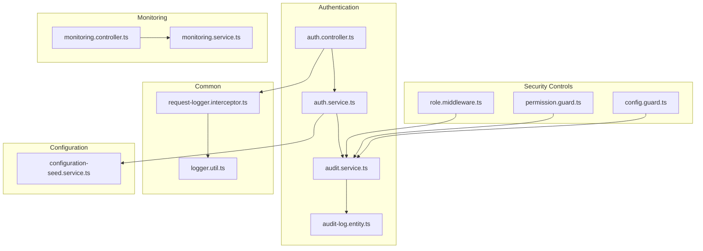
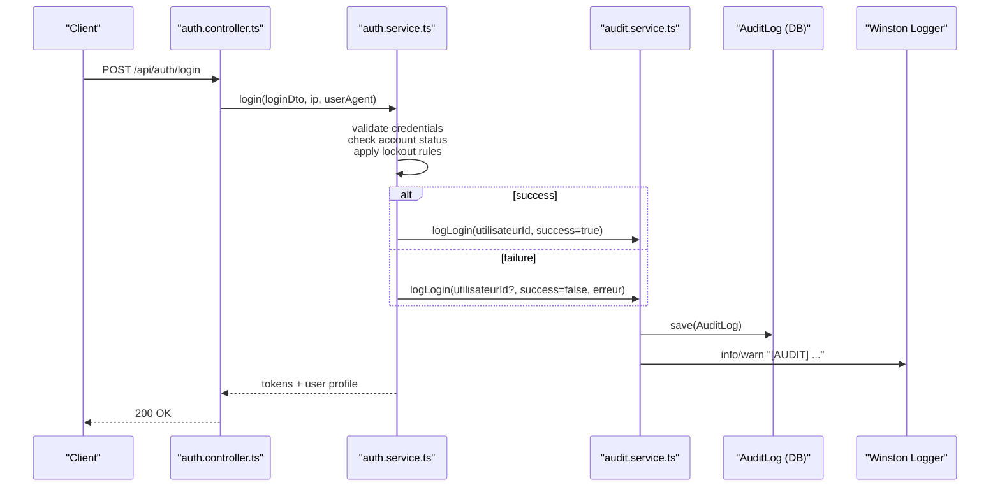
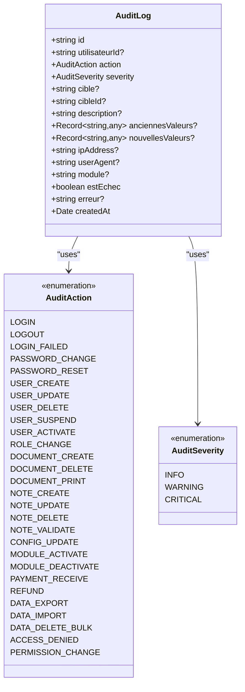
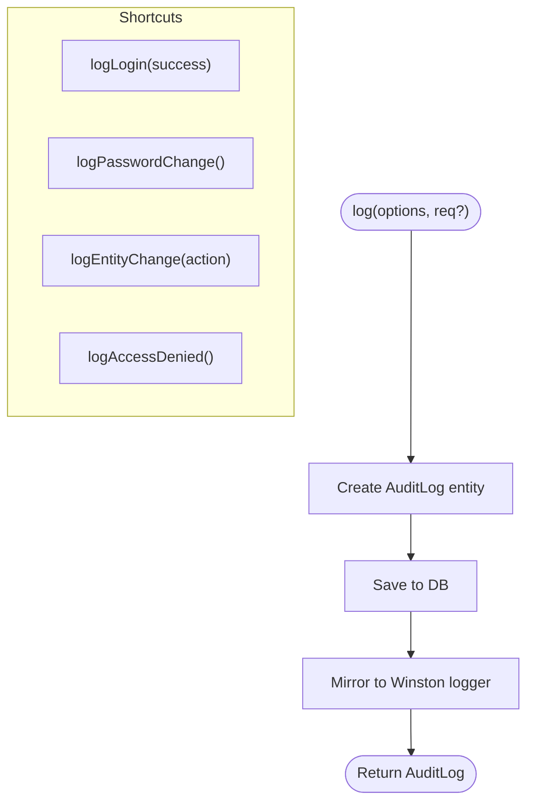
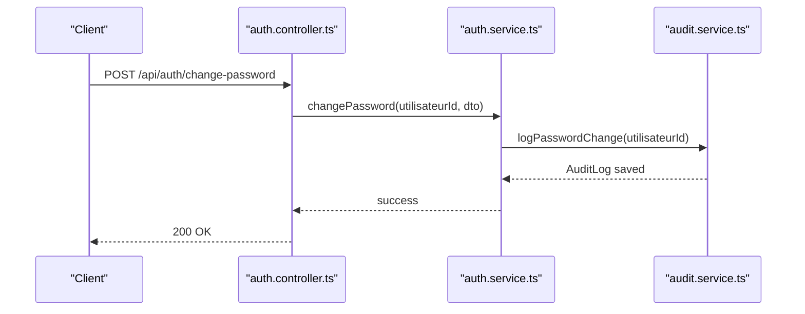
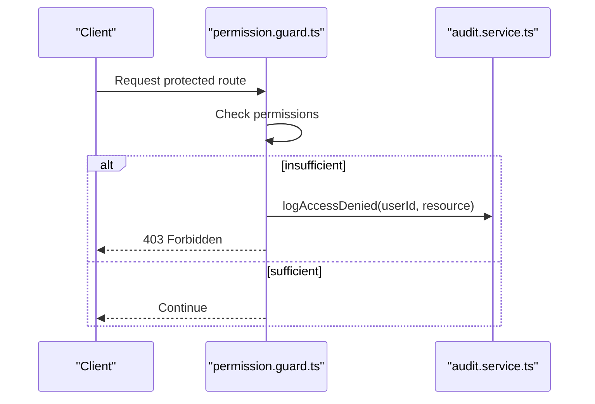
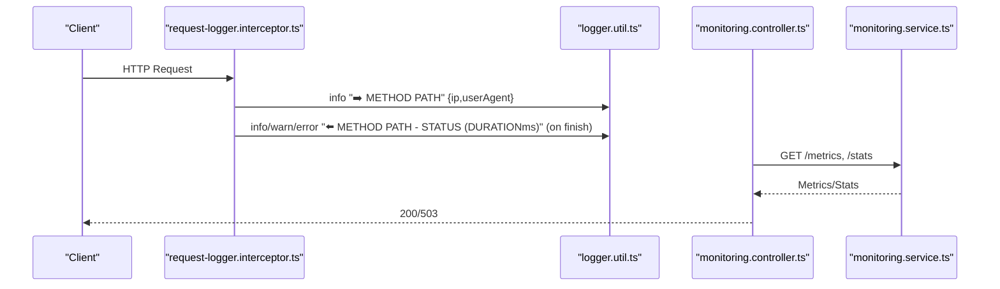
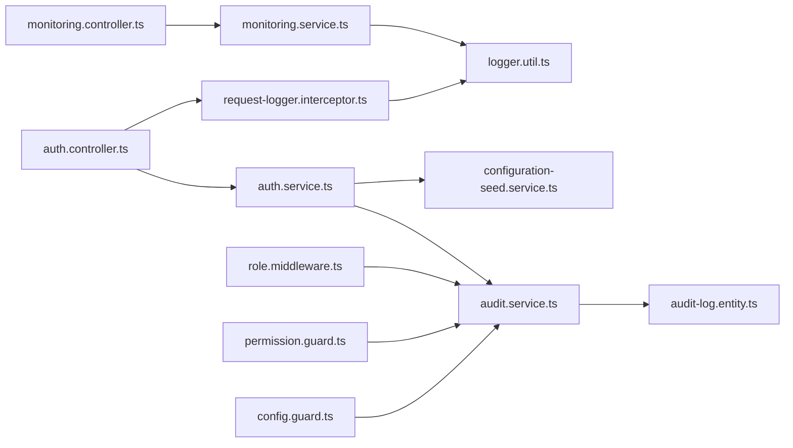

# Audit Logging & Monitoring

<cite>
**Referenced Files in This Document**
- [audit-log.entity.ts](file://backend/src/modules/auth/entities/audit-log.entity.ts)
- [audit.service.ts](file://backend/src/modules/auth/services/audit.service.ts)
- [auth.service.ts](file://backend/src/modules/auth/services/auth.service.ts)
- [auth.controller.ts](file://backend/src/modules/auth/controllers/auth.controller.ts)
- [request-logger.interceptor.ts](file://backend/src/common/interceptors/request-logger.interceptor.ts)
- [logger.util.ts](file://backend/src/common/utils/logger.util.ts)
- [monitoring.controller.ts](file://backend/src/modules/monitoring/controllers/monitoring.controller.ts)
- [monitoring.service.ts](file://backend/src/modules/monitoring/services/monitoring.service.ts)
- [role.middleware.ts](file://backend/src/modules/auth/middlewares/role.middleware.ts)
- [permission.guard.ts](file://backend/src/modules/auth/guards/permission.guard.ts)
- [config.guard.ts](file://backend/src/modules/configuration/guards/config.guard.ts)
- [configuration-seed.service.ts](file://backend/src/modules/configuration/services/configuration-seed.service.ts)
</cite>

## Table of Contents
1. [Introduction](#introduction)
2. [Project Structure](#project-structure)
3. [Core Components](#core-components)
4. [Architecture Overview](#architecture-overview)
5. [Detailed Component Analysis](#detailed-component-analysis)
6. [Dependency Analysis](#dependency-analysis)
7. [Performance Considerations](#performance-considerations)
8. [Troubleshooting Guide](#troubleshooting-guide)
9. [Conclusion](#conclusion)
10. [Appendices](#appendices)

## Introduction
This document provides comprehensive audit logging and monitoring documentation for eLISAschool's security tracking system. It explains the audit log entity structure, event categorization, and logging triggers; documents security event capture including login attempts, failed authentications, privilege changes, and sensitive operations; details log retention policies, storage mechanisms, and access controls for audit data; and outlines monitoring dashboards, alerting thresholds, anomaly detection patterns, compliance reporting, forensic analysis capabilities, audit trail integrity verification, and automated security monitoring workflows.

## Project Structure
The audit and monitoring capabilities are implemented across several modules:
- Authentication module: Entities, services, and controllers for authentication and audit logging
- Common utilities: Request logging interceptor and Winston logger utility
- Monitoring module: Health checks, metrics, statistics, and maintenance mode
- Guards and middlewares: Role and permission enforcement with audit logging on access denials
- Configuration: Security-related parameters and runtime configuration

**Diagram sources**
- [auth.controller.ts:1-268](file://backend/src/modules/auth/controllers/auth.controller.ts#L1-L268)
- [auth.service.ts:1-485](file://backend/src/modules/auth/services/auth.service.ts#L1-L485)
- [audit.service.ts:1-197](file://backend/src/modules/auth/services/audit.service.ts#L1-L197)
- [audit-log.entity.ts:1-139](file://backend/src/modules/auth/entities/audit-log.entity.ts#L1-L139)
- [request-logger.interceptor.ts:1-40](file://backend/src/common/interceptors/request-logger.interceptor.ts#L1-L40)
- [logger.util.ts:1-91](file://backend/src/common/utils/logger.util.ts#L1-L91)
- [monitoring.controller.ts:1-69](file://backend/src/modules/monitoring/controllers/monitoring.controller.ts#L1-L69)
- [monitoring.service.ts:1-223](file://backend/src/modules/monitoring/services/monitoring.service.ts#L1-L223)
- [role.middleware.ts:1-37](file://backend/src/modules/auth/middlewares/role.middleware.ts#L1-L37)
- [permission.guard.ts:1-74](file://backend/src/modules/auth/guards/permission.guard.ts#L1-L74)
- [config.guard.ts:1-55](file://backend/src/modules/configuration/guards/config.guard.ts#L1-L55)
- [configuration-seed.service.ts:172-251](file://backend/src/modules/configuration/services/configuration-seed.service.ts#L172-L251)

**Section sources**
- [auth.controller.ts:1-268](file://backend/src/modules/auth/controllers/auth.controller.ts#L1-L268)
- [auth.service.ts:1-485](file://backend/src/modules/auth/services/auth.service.ts#L1-L485)
- [audit.service.ts:1-197](file://backend/src/modules/auth/services/audit.service.ts#L1-L197)
- [audit-log.entity.ts:1-139](file://backend/src/modules/auth/entities/audit-log.entity.ts#L1-L139)
- [request-logger.interceptor.ts:1-40](file://backend/src/common/interceptors/request-logger.interceptor.ts#L1-L40)
- [logger.util.ts:1-91](file://backend/src/common/utils/logger.util.ts#L1-L91)
- [monitoring.controller.ts:1-69](file://backend/src/modules/monitoring/controllers/monitoring.controller.ts#L1-L69)
- [monitoring.service.ts:1-223](file://backend/src/modules/monitoring/services/monitoring.service.ts#L1-L223)
- [role.middleware.ts:1-37](file://backend/src/modules/auth/middlewares/role.middleware.ts#L1-L37)
- [permission.guard.ts:1-74](file://backend/src/modules/auth/guards/permission.guard.ts#L1-L74)
- [config.guard.ts:1-55](file://backend/src/modules/configuration/guards/config.guard.ts#L1-L55)
- [configuration-seed.service.ts:172-251](file://backend/src/modules/configuration/services/configuration-seed.service.ts#L172-L251)

## Core Components
- AuditLog entity: Defines the audit record schema, including action categories, severity levels, target entity references, IP address, user agent, module, failure flags, and timestamps.
- AuditService: Provides methods to log events, shortcuts for common actions (login, password change, entity changes, access denied), filtering and retrieval of audit logs, and IP extraction from requests.
- AuthService: Integrates audit logging into authentication flows (login, logout, password reset/change, registration).
- Request Logger Interceptor: Logs incoming HTTP requests and response outcomes with timing and status-based log levels.
- Winston Logger Utility: Centralized logging with console and file transports, structured metadata, and configurable log levels.
- Monitoring Controller/Service: Exposes health checks, system metrics, application statistics, maintenance mode, and a placeholder for recent logs retrieval.
- Role and Permission Guards/Middlewares: Enforce access control and log access denials via AuditService.
- Configuration Seed Service: Defines security-related parameters (session duration, max login attempts, lockout duration, require 2FA) and system parameters (log level, maintenance mode).

**Section sources**
- [audit-log.entity.ts:22-139](file://backend/src/modules/auth/entities/audit-log.entity.ts#L22-L139)
- [audit.service.ts:18-197](file://backend/src/modules/auth/services/audit.service.ts#L18-L197)
- [auth.service.ts:48-161](file://backend/src/modules/auth/services/auth.service.ts#L48-L161)
- [request-logger.interceptor.ts:16-37](file://backend/src/common/interceptors/request-logger.interceptor.ts#L16-L37)
- [logger.util.ts:58-91](file://backend/src/common/utils/logger.util.ts#L58-L91)
- [monitoring.controller.ts:15-65](file://backend/src/modules/monitoring/controllers/monitoring.controller.ts#L15-L65)
- [monitoring.service.ts:79-220](file://backend/src/modules/monitoring/services/monitoring.service.ts#L79-L220)
- [role.middleware.ts:20-37](file://backend/src/modules/auth/middlewares/role.middleware.ts#L20-L37)
- [permission.guard.ts:44-74](file://backend/src/modules/auth/guards/permission.guard.ts#L44-L74)
- [configuration-seed.service.ts:172-246](file://backend/src/modules/configuration/services/configuration-seed.service.ts#L172-L246)

## Architecture Overview
The audit and monitoring architecture integrates tightly with authentication, request handling, and access control layers. Audit events are generated during authentication, entity operations, and access control decisions. Logs are persisted to the database and mirrored to the Winston logger. Monitoring endpoints expose system health and metrics, while configuration parameters govern security behavior.

**Diagram sources**
- [auth.controller.ts:55-74](file://backend/src/modules/auth/controllers/auth.controller.ts#L55-L74)
- [auth.service.ts:61-161](file://backend/src/modules/auth/services/auth.service.ts#L61-L161)
- [audit.service.ts:47-77](file://backend/src/modules/auth/services/audit.service.ts#L47-L77)
- [audit-log.entity.ts:83-139](file://backend/src/modules/auth/entities/audit-log.entity.ts#L83-L139)
- [logger.util.ts:58-91](file://backend/src/common/utils/logger.util.ts#L58-L91)

**Section sources**
- [auth.controller.ts:55-74](file://backend/src/modules/auth/controllers/auth.controller.ts#L55-L74)
- [auth.service.ts:61-161](file://backend/src/modules/auth/services/auth.service.ts#L61-L161)
- [audit.service.ts:47-77](file://backend/src/modules/auth/services/audit.service.ts#L47-L77)
- [audit-log.entity.ts:83-139](file://backend/src/modules/auth/entities/audit-log.entity.ts#L83-L139)
- [logger.util.ts:58-91](file://backend/src/common/utils/logger.util.ts#L58-L91)

## Detailed Component Analysis

### AuditLog Entity Structure
The AuditLog entity defines the audit record schema with:
- Identity: UUID primary key
- Actor: Optional foreign key to the user who performed the action
- Action: Enumerated action category (authentication, users, documents, notes, configuration, finance, data, access)
- Severity: INFO, WARNING, CRITICAL
- Target: Entity type and ID being acted upon
- Description: Human-readable summary
- Changes: Old/new values stored as JSON, with sensitive fields masked
- Context: IP address, user agent, module name
- Failure: Boolean flag and optional error message
- Timestamp: Creation date

**Diagram sources**
- [audit-log.entity.ts:83-139](file://backend/src/modules/auth/entities/audit-log.entity.ts#L83-L139)

**Section sources**
- [audit-log.entity.ts:22-139](file://backend/src/modules/auth/entities/audit-log.entity.ts#L22-L139)

### AuditService: Logging Triggers and Filtering
Key responsibilities:
- Centralized logging method with request-aware IP and user agent extraction
- Shortcuts for common security events:
  - Login success/failure
  - Password change/reset
  - Entity changes (with sensitive data masking)
  - Access denied
- Retrieval with filters: user, action, target, severity, date range, pagination
- Winston mirroring for backup and offloading

**Diagram sources**
- [audit.service.ts:47-62](file://backend/src/modules/auth/services/audit.service.ts#L47-L62)
- [audit.service.ts:67-77](file://backend/src/modules/auth/services/audit.service.ts#L67-L77)
- [audit.service.ts:82-90](file://backend/src/modules/auth/services/audit.service.ts#L82-L90)
- [audit.service.ts:95-124](file://backend/src/modules/auth/services/audit.service.ts#L95-L124)
- [audit.service.ts:129-137](file://backend/src/modules/auth/services/audit.service.ts#L129-L137)

**Section sources**
- [audit.service.ts:18-197](file://backend/src/modules/auth/services/audit.service.ts#L18-L197)

### Authentication Security Event Capture
Authentication events are captured with:
- Login attempts: success and failure, including lockout and status checks
- Logout: revocation and audit
- Password reset/change: initiation and completion
- Registration: user creation audit

**Diagram sources**
- [auth.controller.ts:208-225](file://backend/src/modules/auth/controllers/auth.controller.ts#L208-L225)
- [auth.service.ts:383-421](file://backend/src/modules/auth/services/auth.service.ts#L383-L421)
- [audit.service.ts:82-90](file://backend/src/modules/auth/services/audit.service.ts#L82-L90)

**Section sources**
- [auth.controller.ts:55-245](file://backend/src/modules/auth/controllers/auth.controller.ts#L55-L245)
- [auth.service.ts:61-421](file://backend/src/modules/auth/services/auth.service.ts#L61-L421)
- [audit.service.ts:67-90](file://backend/src/modules/auth/services/audit.service.ts#L67-L90)

### Access Control and Privilege Change Logging
Access control enforcement logs:
- Role middleware denies: logs access denied with requested roles
- Permission guard denies: logs access denied with required permissions
- Configuration guard denies: logs access denied with required configuration permissions

**Diagram sources**
- [permission.guard.ts:44-74](file://backend/src/modules/auth/guards/permission.guard.ts#L44-L74)
- [audit.service.ts:129-137](file://backend/src/modules/auth/services/audit.service.ts#L129-L137)

**Section sources**
- [role.middleware.ts:20-37](file://backend/src/modules/auth/middlewares/role.middleware.ts#L20-L37)
- [permission.guard.ts:44-74](file://backend/src/modules/auth/guards/permission.guard.ts#L44-L74)
- [config.guard.ts:19-55](file://backend/src/modules/configuration/guards/config.guard.ts#L19-L55)
- [audit.service.ts:129-137](file://backend/src/modules/auth/services/audit.service.ts#L129-L137)

### Request Logging and System Monitoring
- Request Logger Interceptor: Logs inbound requests with IP and user agent; logs outbound responses with status and duration, using appropriate log levels
- Winston Logger: Structured logs to console and files with rotation; configurable log level
- Monitoring Controller/Service: Health checks, system metrics, application statistics, maintenance mode toggle

**Diagram sources**
- [request-logger.interceptor.ts:16-37](file://backend/src/common/interceptors/request-logger.interceptor.ts#L16-L37)
- [logger.util.ts:58-91](file://backend/src/common/utils/logger.util.ts#L58-L91)
- [monitoring.controller.ts:15-65](file://backend/src/modules/monitoring/controllers/monitoring.controller.ts#L15-L65)
- [monitoring.service.ts:79-220](file://backend/src/modules/monitoring/services/monitoring.service.ts#L79-L220)

**Section sources**
- [request-logger.interceptor.ts:16-37](file://backend/src/common/interceptors/request-logger.interceptor.ts#L16-L37)
- [logger.util.ts:58-91](file://backend/src/common/utils/logger.util.ts#L58-L91)
- [monitoring.controller.ts:15-65](file://backend/src/modules/monitoring/controllers/monitoring.controller.ts#L15-L65)
- [monitoring.service.ts:79-220](file://backend/src/modules/monitoring/services/monitoring.service.ts#L79-L220)

### Log Retention Policies, Storage, and Access Controls
- Retention: The configuration seed service defines a system backup retention parameter; extend this pattern to define audit log retention days
- Storage: Audit logs are persisted to the database via TypeORM; Winston logs are written to rotating files
- Access Controls: Monitoring endpoints are protected by authentication and role-based authorization; access to audit data should be restricted to authorized roles

Recommendations:
- Define a dedicated retention parameter (e.g., system.audit_retention_days) similar to system.backup_retention_days
- Implement a scheduled job to purge old audit records based on retention policy
- Restrict access to audit retrieval endpoints to SUPER_ADMIN and designated roles
- Encrypt audit data at rest and in transit per organizational policy

**Section sources**
- [configuration-seed.service.ts:242-246](file://backend/src/modules/configuration/services/configuration-seed.service.ts#L242-L246)
- [audit-log.entity.ts:83-139](file://backend/src/modules/auth/entities/audit-log.entity.ts#L83-L139)
- [logger.util.ts:67-81](file://backend/src/common/utils/logger.util.ts#L67-L81)
- [monitoring.controller.ts:27-65](file://backend/src/modules/monitoring/controllers/monitoring.controller.ts#L27-L65)

### Monitoring Dashboards, Alerting, and Anomaly Detection
- Health Checks: Use the health endpoint to detect system downtime or degraded performance
- Metrics: Expose CPU, memory, uptime, database connectivity, and application metadata
- Alerting Thresholds:
  - Health: Down if database unreachable; Degraded if free memory below threshold
  - Authentication: High LOGIN_FAILED rate over short windows indicates brute force attempts
  - Access Denied: Sudden spikes in ACCESS_DENIED suggest reconnaissance or misconfiguration
- Anomaly Detection Patterns:
  - Unusually high PASSWORD_RESET or PASSWORD_CHANGE rates for a user
  - Multiple ENTITY_DELETE operations in short timeframes
  - Requests from blocked IPs or user agents

Note: Implementers should integrate these thresholds with external monitoring/alerting systems.

**Section sources**
- [monitoring.service.ts:169-199](file://backend/src/modules/monitoring/services/monitoring.service.ts#L169-L199)
- [audit-log.entity.ts:25-69](file://backend/src/modules/auth/entities/audit-log.entity.ts#L25-L69)

### Compliance Reporting and Forensic Analysis
- Compliance Reporting: Use filtered audit queries to generate reports by user, action, date range, and severity; exportable formats can be added to the monitoring controller
- Forensic Analysis: Leverage IP, user agent, module, and change data to reconstruct events; sensitive fields are masked in audit trails
- Audit Trail Integrity: Maintain immutable audit logs; consider write-once storage and cryptographic hashing for tamper evidence

**Section sources**
- [audit.service.ts:142-181](file://backend/src/modules/auth/services/audit.service.ts#L142-L181)
- [audit-log.entity.ts:104-132](file://backend/src/modules/auth/entities/audit-log.entity.ts#L104-L132)

### Automated Security Monitoring Workflows
- Login Attempt Monitoring: Track LOGIN_FAILED events and correlate with IP addresses to trigger alerts
- Privilege Change Monitoring: Monitor ROLE_CHANGE and PERMISSION_CHANGE events for unauthorized modifications
- Sensitive Operation Monitoring: Track DATA_EXPORT, DATA_DELETE_BULK, and financial operations for unusual patterns
- Maintenance Mode: Use the maintenance endpoint to temporarily restrict access during investigations

**Section sources**
- [auth.service.ts:61-161](file://backend/src/modules/auth/services/auth.service.ts#L61-L161)
- [audit-log.entity.ts:25-69](file://backend/src/modules/auth/entities/audit-log.entity.ts#L25-L69)
- [monitoring.controller.ts:42-56](file://backend/src/modules/monitoring/controllers/monitoring.controller.ts#L42-L56)

## Dependency Analysis
The following diagram shows key dependencies among audit and monitoring components:

**Diagram sources**
- [auth.controller.ts:1-268](file://backend/src/modules/auth/controllers/auth.controller.ts#L1-L268)
- [auth.service.ts:1-485](file://backend/src/modules/auth/services/auth.service.ts#L1-L485)
- [audit.service.ts:1-197](file://backend/src/modules/auth/services/audit.service.ts#L1-L197)
- [audit-log.entity.ts:1-139](file://backend/src/modules/auth/entities/audit-log.entity.ts#L1-L139)
- [request-logger.interceptor.ts:1-40](file://backend/src/common/interceptors/request-logger.interceptor.ts#L1-L40)
- [logger.util.ts:1-91](file://backend/src/common/utils/logger.util.ts#L1-L91)
- [monitoring.controller.ts:1-69](file://backend/src/modules/monitoring/controllers/monitoring.controller.ts#L1-L69)
- [monitoring.service.ts:1-223](file://backend/src/modules/monitoring/services/monitoring.service.ts#L1-L223)
- [role.middleware.ts:1-37](file://backend/src/modules/auth/middlewares/role.middleware.ts#L1-L37)
- [permission.guard.ts:1-74](file://backend/src/modules/auth/guards/permission.guard.ts#L1-L74)
- [config.guard.ts:1-55](file://backend/src/modules/configuration/guards/config.guard.ts#L1-L55)
- [configuration-seed.service.ts:172-251](file://backend/src/modules/configuration/services/configuration-seed.service.ts#L172-L251)

**Section sources**
- [auth.controller.ts:1-268](file://backend/src/modules/auth/controllers/auth.controller.ts#L1-L268)
- [auth.service.ts:1-485](file://backend/src/modules/auth/services/auth.service.ts#L1-L485)
- [audit.service.ts:1-197](file://backend/src/modules/auth/services/audit.service.ts#L1-L197)
- [audit-log.entity.ts:1-139](file://backend/src/modules/auth/entities/audit-log.entity.ts#L1-L139)
- [request-logger.interceptor.ts:1-40](file://backend/src/common/interceptors/request-logger.interceptor.ts#L1-L40)
- [logger.util.ts:1-91](file://backend/src/common/utils/logger.util.ts#L1-L91)
- [monitoring.controller.ts:1-69](file://backend/src/modules/monitoring/controllers/monitoring.controller.ts#L1-L69)
- [monitoring.service.ts:1-223](file://backend/src/modules/monitoring/services/monitoring.service.ts#L1-L223)
- [role.middleware.ts:1-37](file://backend/src/modules/auth/middlewares/role.middleware.ts#L1-L37)
- [permission.guard.ts:1-74](file://backend/src/modules/auth/guards/permission.guard.ts#L1-L74)
- [config.guard.ts:1-55](file://backend/src/modules/configuration/guards/config.guard.ts#L1-L55)
- [configuration-seed.service.ts:172-251](file://backend/src/modules/configuration/services/configuration-seed.service.ts#L172-L251)

## Performance Considerations
- Audit logging overhead: Minimize serialization of large change sets; mask sensitive fields to reduce payload size
- Query performance: Use indexes on frequently filtered columns (user, action, target, createdAt)
- Log volume: Implement retention policies and periodic purges to control database growth
- Transport costs: Use asynchronous Winston transports and batching where applicable

[No sources needed since this section provides general guidance]

## Troubleshooting Guide
- Audit logs not appearing:
  - Verify Winston transports are configured and writable
  - Confirm AuditService.log is invoked and DB writes succeed
- Missing IP or user agent:
  - Ensure reverse proxy forwards x-forwarded-for and client sends User-Agent header
- Access denied floods:
  - Review role/permission configurations and guard logic
  - Check for misconfigured routes or missing middleware
- Health check failures:
  - Validate database connectivity and connection pool
  - Inspect free memory thresholds and application uptime

**Section sources**
- [audit.service.ts:186-192](file://backend/src/modules/auth/services/audit.service.ts#L186-L192)
- [logger.util.ts:67-81](file://backend/src/common/utils/logger.util.ts#L67-L81)
- [monitoring.service.ts:169-199](file://backend/src/modules/monitoring/services/monitoring.service.ts#L169-L199)

## Conclusion
eLISAschool’s audit and monitoring system provides robust security tracking through centralized audit logging, request logging, and access control enforcement. By leveraging configuration-driven security parameters, structured audit records, and monitoring endpoints, the platform supports compliance reporting, forensic analysis, and automated anomaly detection. Extending retention policies, access controls, and integrating with external monitoring systems will further strengthen the security posture.

[No sources needed since this section summarizes without analyzing specific files]

## Appendices

### Audit Event Categories and Examples
- Authentication: LOGIN, LOGOUT, LOGIN_FAILED, PASSWORD_CHANGE, PASSWORD_RESET
- Users: USER_CREATE, USER_UPDATE, USER_DELETE, USER_SUSPEND, USER_ACTIVATE, ROLE_CHANGE
- Documents: DOCUMENT_CREATE, DOCUMENT_DELETE, DOCUMENT_PRINT
- Notes: NOTE_CREATE, NOTE_UPDATE, NOTE_DELETE, NOTE_VALIDATE
- Configuration: CONFIG_UPDATE, MODULE_ACTIVATE, MODULE_DEACTIVATE
- Finance: PAYMENT_RECEIVE, REFUND
- Data: DATA_EXPORT, DATA_IMPORT, DATA_DELETE_BULK
- Access: ACCESS_DENIED, PERMISSION_CHANGE

**Section sources**
- [audit-log.entity.ts:25-69](file://backend/src/modules/auth/entities/audit-log.entity.ts#L25-L69)

### Security Parameter Reference
- auth.session_duration: Session lifetime in minutes
- auth.max_login_attempts: Maximum failed login attempts before lockout
- auth.lockout_duration: Lockout duration in minutes
- auth.require_2fa: Whether two-factor authentication is required
- system.backup_retention_days: Backup retention period
- system.log_level: Logging verbosity
- system.maintenance_mode: System maintenance toggle

**Section sources**
- [configuration-seed.service.ts:172-246](file://backend/src/modules/configuration/services/configuration-seed.service.ts#L172-L246)