# Audit Logging & Monitoring

<cite>
**Referenced Files in This Document**
- [audit.interceptor.ts](file://backend/src/common/interceptors/audit.interceptor.ts)
- [audit.controller.ts](file://backend/src/modules/audit/controllers/audit.controller.ts)
- [archivage.service.ts](file://backend/src/modules/audit/services/archivage.service.ts)
- [audit-filters.dto.ts](file://backend/src/modules/audit/dto/audit-filters.dto.ts)
- [audit-log.entity.ts](file://backend/src/modules/auth/entities/audit-log.entity.ts)
- [audit.service.ts](file://backend/src/modules/auth/services/audit.service.ts)
- [auth.service.ts](file://backend/src/modules/auth/services/auth.service.ts)
- [auth.controller.ts](file://backend/src/modules/auth/controllers/auth.controller.ts)
- [request-logger.interceptor.ts](file://backend/src/common/interceptors/request-logger.interceptor.ts)
- [logger.util.ts](file://backend/src/common/utils/logger.util.ts)
- [monitoring.controller.ts](file://backend/src/modules/monitoring/controllers/monitoring.controller.ts)
- [monitoring.service.ts](file://backend/src/modules/monitoring/services/monitoring.service.ts)
- [role.middleware.ts](file://backend/src/modules/auth/middlewares/role.middleware.ts)
- [permission.guard.ts](file://backend/src/modules/auth/guards/permission.guard.ts)
- [config.guard.ts](file://backend/src/modules/configuration/guards/config.guard.ts)
- [configuration-seed.service.ts](file://backend/src/modules/configuration/services/configuration-seed.service.ts)
- [003-audit-logs-archive.sql](file://backend/src/database/migrations/003-audit-logs-archive.sql)
</cite>

## Update Summary
**Changes Made**
- Added comprehensive audit interceptor system for automatic CRUD operation logging
- Integrated REST API endpoints for audit log management and monitoring
- Implemented advanced archiving service with database storage capabilities
- Enhanced audit service with logCRUD method and improved filtering
- Added sophisticated DTO validation with Zod schemas for audit operations
- Extended audit action coverage to 80+ operations across all modules
- Implemented database migration for audit logs archive functionality

## Table of Contents
1. [Introduction](#introduction)
2. [Project Structure](#project-structure)
3. [Core Components](#core-components)
4. [Architecture Overview](#architecture-overview)
5. [Detailed Component Analysis](#detailed-component-analysis)
6. [Dependency Analysis](#dependency-analysis)
7. [Performance Considerations](#performance-considerations)
8. [Troubleshooting Guide](#troubleshooting-guide)
9. [Conclusion](#conclusion)
10. [Appendices](#appendices)

## Introduction
This document provides comprehensive audit logging and monitoring documentation for eLISAschool's security tracking system. The system has been comprehensively enhanced with automatic audit interception, RESTful API management, advanced archiving capabilities, and extensive documentation. It explains the audit log entity structure, event categorization, and logging triggers; documents security event capture including login attempts, failed authentications, privilege changes, and sensitive operations; details log retention policies, storage mechanisms, and access controls for audit data; and outlines monitoring dashboards, alerting thresholds, anomaly detection patterns, compliance reporting, forensic analysis capabilities, audit trail integrity verification, and automated security monitoring workflows.

## Project Structure
The audit and monitoring capabilities are implemented across several modules with significant enhancements:
- Authentication module: Entities, services, and controllers for authentication and audit logging
- Common interceptors: Automatic audit interception for CRUD operations
- Audit module: REST API endpoints for log management, archiving, and statistics
- Database migrations: Enhanced audit logs with archive functionality
- Common utilities: Request logging interceptor and Winston logger utility
- Monitoring module: Health checks, metrics, statistics, and maintenance mode
- Guards and middlewares: Role and permission enforcement with audit logging on access denials
- Configuration: Security-related parameters and runtime configuration

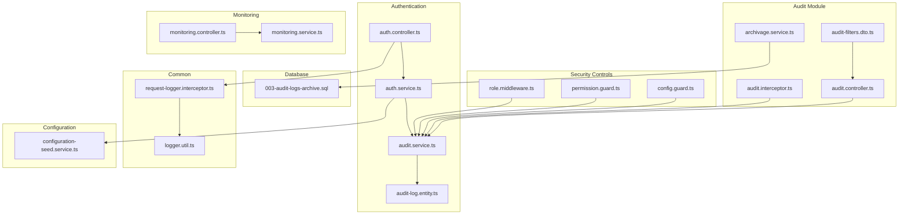

**Diagram sources**
- [audit.interceptor.ts:1-175](file://backend/src/common/interceptors/audit.interceptor.ts#L1-L175)
- [audit.controller.ts:1-300](file://backend/src/modules/audit/controllers/audit.controller.ts#L1-L300)
- [archivage.service.ts:1-149](file://backend/src/modules/audit/services/archivage.service.ts#L1-L149)
- [audit-filters.dto.ts:1-47](file://backend/src/modules/audit/dto/audit-filters.dto.ts#L1-L47)
- [audit-log.entity.ts:1-248](file://backend/src/modules/auth/entities/audit-log.entity.ts#L1-L248)
- [audit.service.ts:1-230](file://backend/src/modules/auth/services/audit.service.ts#L1-L230)
- [auth.controller.ts:1-268](file://backend/src/modules/auth/controllers/auth.controller.ts#L1-L268)
- [auth.service.ts:1-485](file://backend/src/modules/auth/services/auth.service.ts#L1-L485)
- [request-logger.interceptor.ts:1-40](file://backend/src/common/interceptors/request-logger.interceptor.ts#L1-L40)
- [logger.util.ts:1-91](file://backend/src/common/utils/logger.util.ts#L1-L91)
- [monitoring.controller.ts:1-69](file://backend/src/modules/monitoring/controllers/monitoring.controller.ts#L1-L69)
- [monitoring.service.ts:1-223](file://backend/src/modules/monitoring/services/monitoring.service.ts#L1-L223)
- [role.middleware.ts:1-37](file://backend/src/modules/auth/middlewares/role.middleware.ts#L1-L37)
- [permission.guard.ts:1-74](file://backend/src/modules/auth/guards/permission.guard.ts#L1-L74)
- [config.guard.ts:1-55](file://backend/src/modules/configuration/guards/config.guard.ts#L1-L55)
- [configuration-seed.service.ts:172-251](file://backend/src/modules/configuration/services/configuration-seed.service.ts#L172-L251)
- [003-audit-logs-archive.sql:1-129](file://backend/src/database/migrations/003-audit-logs-archive.sql#L1-L129)

**Section sources**
- [audit.interceptor.ts:1-175](file://backend/src/common/interceptors/audit.interceptor.ts#L1-L175)
- [audit.controller.ts:1-300](file://backend/src/modules/audit/controllers/audit.controller.ts#L1-L300)
- [archivage.service.ts:1-149](file://backend/src/modules/audit/services/archivage.service.ts#L1-L149)
- [audit-filters.dto.ts:1-47](file://backend/src/modules/audit/dto/audit-filters.dto.ts#L1-L47)
- [audit-log.entity.ts:1-248](file://backend/src/modules/auth/entities/audit-log.entity.ts#L1-L248)
- [audit.service.ts:1-230](file://backend/src/modules/auth/services/audit.service.ts#L1-L230)
- [auth.controller.ts:1-268](file://backend/src/modules/auth/controllers/auth.controller.ts#L1-L268)
- [auth.service.ts:1-485](file://backend/src/modules/auth/services/auth.service.ts#L1-L485)
- [request-logger.interceptor.ts:1-40](file://backend/src/common/interceptors/request-logger.interceptor.ts#L1-L40)
- [logger.util.ts:1-91](file://backend/src/common/utils/logger.util.ts#L1-L91)
- [monitoring.controller.ts:1-69](file://backend/src/modules/monitoring/controllers/monitoring.controller.ts#L1-L69)
- [monitoring.service.ts:1-223](file://backend/src/modules/monitoring/services/monitoring.service.ts#L1-L223)
- [role.middleware.ts:1-37](file://backend/src/modules/auth/middlewares/role.middleware.ts#L1-L37)
- [permission.guard.ts:1-74](file://backend/src/modules/auth/guards/permission.guard.ts#L1-L74)
- [config.guard.ts:1-55](file://backend/src/modules/configuration/guards/config.guard.ts#L1-L55)
- [configuration-seed.service.ts:172-251](file://backend/src/modules/configuration/services/configuration-seed.service.ts#L172-L251)
- [003-audit-logs-archive.sql:1-129](file://backend/src/database/migrations/003-audit-logs-archive.sql#L1-L129)

## Core Components
- **AuditLog entity**: Defines the audit record schema with 80+ action categories, including authentication, users, academic operations, services, communication, administration, and security events.
- **AuditService**: Enhanced with logCRUD method for simplified instrumentation, comprehensive filtering, and IP extraction from requests.
- **AuditInterceptor**: Automatic CRUD operation logging with flexible configuration, custom action mapping, and non-blocking error handling.
- **AuditController**: REST API endpoints for log management including listing, filtering, exporting, statistics, and personal log access.
- **AuditArchivageService**: Handles old log archival to database storage, statistics calculation, and retention policy enforcement.
- **Audit Filters DTO**: Advanced filtering with Zod validation for user, action, target, severity, date ranges, and search functionality.
- **AuthService**: Integrates audit logging into authentication flows with comprehensive event capture.
- **Request Logger Interceptor**: Logs incoming HTTP requests and response outcomes with timing and status-based log levels.
- **Winston Logger Utility**: Centralized logging with console and file transports, structured metadata, and configurable log levels.
- **Monitoring Controller/Service**: Exposes health checks, system metrics, application statistics, maintenance mode, and audit statistics.
- **Role and Permission Guards/Middlewares**: Enforce access control and log access denials via AuditService.
- **Configuration Seed Service**: Defines security-related parameters and system parameters for audit trail management.

**Section sources**
- [audit.interceptor.ts:20-175](file://backend/src/common/interceptors/audit.interceptor.ts#L20-L175)
- [audit.controller.ts:22-300](file://backend/src/modules/audit/controllers/audit.controller.ts#L22-L300)
- [archivage.service.ts:19-149](file://backend/src/modules/audit/services/archivage.service.ts#L19-L149)
- [audit-filters.dto.ts:14-47](file://backend/src/modules/audit/dto/audit-filters.dto.ts#L14-L47)
- [audit-log.entity.ts:22-178](file://backend/src/modules/auth/entities/audit-log.entity.ts#L22-L178)
- [audit.service.ts:37-230](file://backend/src/modules/auth/services/audit.service.ts#L37-L230)
- [auth.service.ts:48-161](file://backend/src/modules/auth/services/auth.service.ts#L48-L161)
- [request-logger.interceptor.ts:16-37](file://backend/src/common/interceptors/request-logger.interceptor.ts#L16-L37)
- [logger.util.ts:58-91](file://backend/src/common/utils/logger.util.ts#L58-L91)
- [monitoring.controller.ts:15-65](file://backend/src/modules/monitoring/controllers/monitoring.controller.ts#L15-L65)
- [monitoring.service.ts:79-220](file://backend/src/modules/monitoring/services/monitoring.service.ts#L79-L220)
- [role.middleware.ts:20-37](file://backend/src/modules/auth/middlewares/role.middleware.ts#L20-L37)
- [permission.guard.ts:44-74](file://backend/src/modules/auth/guards/permission.guard.ts#L44-L74)
- [configuration-seed.service.ts:172-246](file://backend/src/modules/configuration/services/configuration-seed.service.ts#L172-L246)

## Architecture Overview
The enhanced audit and monitoring architecture integrates tightly with authentication, request handling, access control, and automatic CRUD operation logging. Audit events are generated automatically through interceptors during CRUD operations, manually through service instrumentation, and during authentication and access control decisions. Logs are persisted to the database with automatic archiving to separate archive tables, mirrored to the Winston logger, and exposed through comprehensive REST APIs.

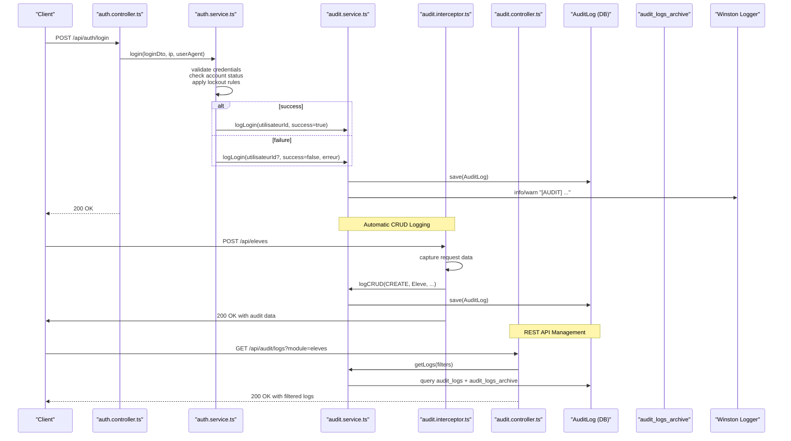

**Diagram sources**
- [auth.controller.ts:55-74](file://backend/src/modules/auth/controllers/auth.controller.ts#L55-L74)
- [auth.service.ts:61-161](file://backend/src/modules/auth/services/auth.service.ts#L61-L161)
- [audit.service.ts:47-77](file://backend/src/modules/auth/services/audit.service.ts#L47-L77)
- [audit.interceptor.ts:64-175](file://backend/src/common/interceptors/audit.interceptor.ts#L64-L175)
- [audit.controller.ts:27-79](file://backend/src/modules/audit/controllers/audit.controller.ts#L27-L79)
- [audit-log.entity.ts:83-139](file://backend/src/modules/auth/entities/audit-log.entity.ts#L83-L139)
- [logger.util.ts:58-91](file://backend/src/common/utils/logger.util.ts#L58-L91)

**Section sources**
- [auth.controller.ts:55-74](file://backend/src/modules/auth/controllers/auth.controller.ts#L55-L74)
- [auth.service.ts:61-161](file://backend/src/modules/auth/services/auth.service.ts#L61-L161)
- [audit.service.ts:47-77](file://backend/src/modules/auth/services/audit.service.ts#L47-L77)
- [audit.interceptor.ts:64-175](file://backend/src/common/interceptors/audit.interceptor.ts#L64-L175)
- [audit.controller.ts:27-79](file://backend/src/modules/audit/controllers/audit.controller.ts#L27-L79)
- [audit-log.entity.ts:83-139](file://backend/src/modules/auth/entities/audit-log.entity.ts#L83-L139)
- [logger.util.ts:58-91](file://backend/src/common/utils/logger.util.ts#L58-L91)

## Detailed Component Analysis

### Enhanced AuditLog Entity Structure
The AuditLog entity defines the audit record schema with comprehensive coverage of 80+ action categories:
- Identity: UUID primary key with user relationship
- Actor: Optional foreign key to the user who performed the action
- Action: Enumerated action category covering authentication, users, academic operations, services, communication, administration, and security events
- Severity: INFO, WARNING, CRITICAL
- Target: Entity type and ID being acted upon
- Description: Human-readable summary
- Changes: Old/new values stored as JSON, with sensitive fields masked
- Context: IP address, user agent, module name
- Failure: Boolean flag and optional error message
- Timestamp: Creation date

```mermaid
classDiagram
class AuditLog {
+string id
+string utilisateurId?
+AuditAction action
+AuditSeverity severity
+string cible?
+string cibleId?
+string description?
+Record~string,any~ anciennesValeurs?
+Record~string,any~ nouvellesValeurs?
+string ipAddress?
+string userAgent?
+string module?
+boolean estEchec
+string erreur?
+Date createdAt
}
class AuditAction {
<<enumeration>>
LOGIN
LOGOUT
LOGIN_FAILED
PASSWORD_CHANGE
PASSWORD_RESET
USER_CREATE
USER_UPDATE
USER_DELETE
USER_SUSPEND
USER_ACTIVATE
ROLE_CHANGE
ELEVE_CREATE
ELEVE_UPDATE
ELEVE_DELETE
ELEVE_INSCRIPTION
BULLETIN_GENERATE
BULLETIN_UPDATE
CYCLE_CREATE
CYCLE_UPDATE
CYCLE_DELETE
NIVEAU_CREATE
NIVEAU_UPDATE
NIVEAU_DELETE
CLASSE_CREATE
CLASSE_UPDATE
CLASSE_DELETE
MATIERE_CREATE
MATIERE_UPDATE
MATIERE_DELETE
PERIODE_CREATE
PERIODE_UPDATE
PERIODE_DELETE
ANNEE_SCOLAIRE_CREATE
ANNEE_SCOLAIRE_UPDATE
ANNEE_SCOLAIRE_DELETE
ANNEE_SCOLAIRE_ACTIVATE
ETABLISSEMENT_CREATE
ETABLISSEMENT_UPDATE
ETABLISSEMENT_DELETE
PERSONNEL_CREATE
PERSONNEL_UPDATE
PERSONNEL_DELETE
DOCUMENT_CREATE
DOCUMENT_DELETE
DOCUMENT_PRINT
DOCUMENT_GENERATE
NOTE_CREATE
NOTE_UPDATE
NOTE_DELETE
NOTE_VALIDATE
MENU_CREATE
MENU_UPDATE
MENU_DELETE
INSCRIPTION_CANTINE_CREATE
INSCRIPTION_CANTINE_DELETE
SOLDE_RECHARGE
CONSOMMATION_ENREGISTRER
LIGNE_CREATE
LIGNE_UPDATE
LIGNE_DELETE
INSCRIPTION_TRANSPORT_CREATE
INSCRIPTION_TRANSPORT_DELETE
PRESENCE_TRANSPORT
CARTE_CREATE
CARTE_UPDATE
CARTE_DESACTIVER
CARTE_RENOUVELER
CARTE_PERTE
MATERIEL_CREATE
MATERIEL_UPDATE
MATERIEL_DELETE
MATERIEL_ASSIGN
MATERIEL_RETURN
MESSAGE_SEND
MESSAGE_DELETE
MESSAGE_MARK_READ
CLUB_CREATE
CLUB_UPDATE
CLUB_DELETE
CLUB_JOIN
CLUB_LEAVE
BADGE_AWARD
SCORE_UPDATE
ORIENTATION_CREATE
ORIENTATION_UPDATE
ORIENTATION_VALIDATE
REQUETE_CREATE
REQUETE_EXECUTE
REQUETE_DELETE
ROLE_CREATE
ROLE_UPDATE
ROLE_DELETE
ROLE_ASSIGN
ROLE_REVOKE
PERMISSION_CREATE
PERMISSION_UPDATE
PERMISSION_DELETE
CONFIG_UPDATE
MODULE_ACTIVATE
MODULE_DEACTIVATE
PAYMENT_RECEIVE
REFUND
DATA_EXPORT
DATA_IMPORT
DATA_DELETE_BULK
ACCESS_DENIED
PERMISSION_CHANGE
}
class AuditSeverity {
<<enumeration>>
INFO
WARNING
CRITICAL
}
AuditLog --> AuditAction : "uses"
AuditLog --> AuditSeverity : "uses"
```

**Diagram sources**
- [audit-log.entity.ts:83-139](file://backend/src/modules/auth/entities/audit-log.entity.ts#L83-L139)

**Section sources**
- [audit-log.entity.ts:22-178](file://backend/src/modules/auth/entities/audit-log.entity.ts#L22-L178)

### AuditInterceptor: Automatic CRUD Operation Logging
The AuditInterceptor provides automatic logging for CRUD operations with flexible configuration:
- **Automatic Detection**: Automatically captures POST, PUT, PATCH, and DELETE operations
- **Custom Configuration**: Flexible module and entity type configuration
- **Custom Actions**: Support for custom action mapping beyond standard CRUD
- **Error Handling**: Non-blocking error handling using setImmediate
- **Data Capture**: Captures old/new values for UPDATE/DELETE operations
- **Response Hooking**: Hooks into response lifecycle to log after operation completion

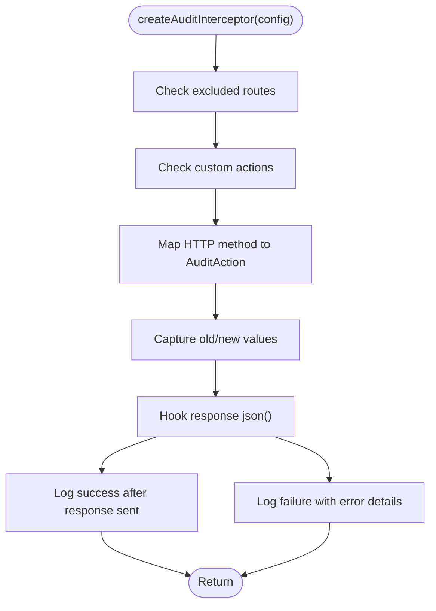

**Diagram sources**
- [audit.interceptor.ts:64-175](file://backend/src/common/interceptors/audit.interceptor.ts#L64-L175)

**Section sources**
- [audit.interceptor.ts:20-175](file://backend/src/common/interceptors/audit.interceptor.ts#L20-L175)

### AuditController: Comprehensive REST API Management
The AuditController provides REST endpoints for complete audit log management:
- **Log Listing**: Paginated logs with advanced filtering and search
- **Individual Log Access**: Detailed log retrieval by ID
- **Personal Logs**: User-specific log access for self-monitoring
- **Export Functionality**: CSV and JSON export with filtering
- **Statistics Dashboard**: Comprehensive audit statistics and analytics
- **Role-Based Access**: Admin-only access for sensitive operations

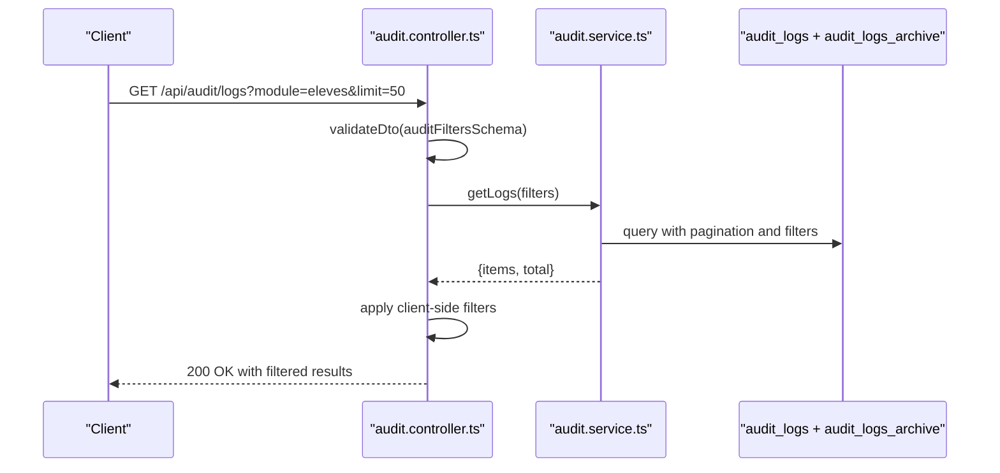

**Diagram sources**
- [audit.controller.ts:27-79](file://backend/src/modules/audit/controllers/audit.controller.ts#L27-L79)
- [audit.controller.ts:145-178](file://backend/src/modules/audit/controllers/audit.controller.ts#L145-L178)
- [audit.controller.ts:185-257](file://backend/src/modules/audit/controllers/audit.controller.ts#L185-L257)

**Section sources**
- [audit.controller.ts:22-300](file://backend/src/modules/audit/controllers/audit.controller.ts#L22-L300)

### AuditArchivageService: Advanced Log Archiving
The AuditArchivageService handles old log archival and statistics:
- **Automatic Archival**: Archives logs older than 30 days to archive table
- **Statistics Generation**: Comprehensive audit statistics and analytics
- **Retention Policy**: Configurable retention periods (30/365 days)
- **Database Integration**: Seamless integration with PostgreSQL archive tables
- **Performance Optimization**: Optimized queries for large datasets

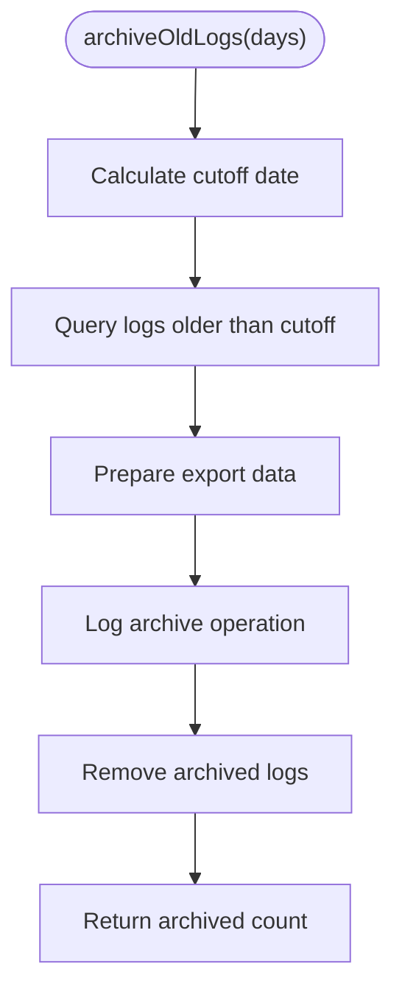

**Diagram sources**
- [archivage.service.ts:30-63](file://backend/src/modules/audit/services/archivage.service.ts#L30-L63)

**Section sources**
- [archivage.service.ts:19-149](file://backend/src/modules/audit/services/archivage.service.ts#L19-L149)

### Enhanced AuditService: Improved Instrumentation
The enhanced AuditService provides comprehensive logging capabilities:
- **logCRUD Method**: Simplified CRUD operation logging with automatic action mapping
- **Advanced Filtering**: Comprehensive filtering by user, action, target, severity, and date ranges
- **Sensitive Data Masking**: Automatic masking of passwords, tokens, and other sensitive fields
- **IP Extraction**: Robust IP address extraction from various request headers
- **Error Handling**: Comprehensive error handling with Winston logging

**Section sources**
- [audit.service.ts:37-230](file://backend/src/modules/auth/services/audit.service.ts#L37-L230)

### Audit Filters DTO: Advanced Validation
The Audit Filters DTO provides sophisticated validation and filtering:
- **Zod Schema Validation**: Compile-time type safety for all filter parameters
- **Comprehensive Filtering**: User ID, action type, module, target, severity, date ranges
- **Search Functionality**: Text-based search across descriptions, targets, and actions
- **Pagination Support**: Configurable limit and offset with validation
- **Role-Based Access**: Integration with role-based access control

**Section sources**
- [audit-filters.dto.ts:14-47](file://backend/src/modules/audit/dto/audit-filters.dto.ts#L14-L47)

### Authentication Security Event Capture
Authentication events are captured with comprehensive coverage:
- Login attempts: success and failure, including lockout and status checks
- Logout: revocation and audit
- Password reset/change: initiation and completion
- Registration: user creation audit
- Two-factor authentication: 2FA requirement enforcement

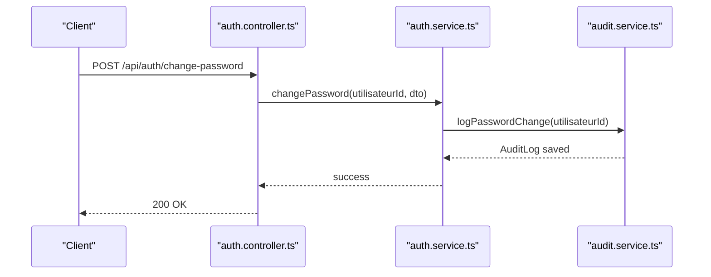

**Diagram sources**
- [auth.controller.ts:208-225](file://backend/src/modules/auth/controllers/auth.controller.ts#L208-L225)
- [auth.service.ts:383-421](file://backend/src/modules/auth/services/auth.service.ts#L383-L421)
- [audit.service.ts:82-90](file://backend/src/modules/auth/services/audit.service.ts#L82-L90)

**Section sources**
- [auth.controller.ts:55-245](file://backend/src/modules/auth/controllers/auth.controller.ts#L55-L245)
- [auth.service.ts:61-421](file://backend/src/modules/auth/services/auth.service.ts#L61-L421)
- [audit.service.ts:67-90](file://backend/src/modules/auth/services/audit.service.ts#L67-L90)

### Access Control and Privilege Change Logging
Access control enforcement logs comprehensive information:
- Role middleware denies: logs access denied with requested roles
- Permission guard denies: logs access denied with required permissions
- Configuration guard denies: logs access denied with required configuration permissions
- Automatic privilege change detection and logging

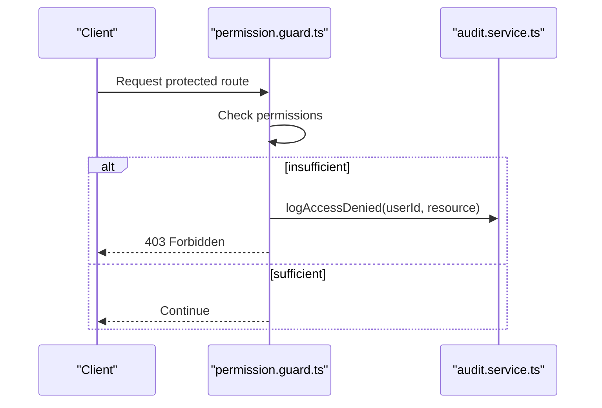

**Diagram sources**
- [permission.guard.ts:44-74](file://backend/src/modules/auth/guards/permission.guard.ts#L44-L74)
- [audit.service.ts:129-137](file://backend/src/modules/auth/services/audit.service.ts#L129-L137)

**Section sources**
- [role.middleware.ts:20-37](file://backend/src/modules/auth/middlewares/role.middleware.ts#L20-L37)
- [permission.guard.ts:44-74](file://backend/src/modules/auth/guards/permission.guard.ts#L44-L74)
- [config.guard.ts:19-55](file://backend/src/modules/configuration/guards/config.guard.ts#L19-L55)
- [audit.service.ts:129-137](file://backend/src/modules/auth/services/audit.service.ts#L129-L137)

### Request Logging and System Monitoring
- Request Logger Interceptor: Logs inbound requests with IP and user agent; logs outbound responses with status and duration, using appropriate log levels
- Winston Logger: Structured logs to console and files with rotation; configurable log level
- Monitoring Controller/Service: Health checks, system metrics, application statistics, maintenance mode, and audit statistics
- Audit Statistics: Comprehensive statistics endpoint for audit trail analysis

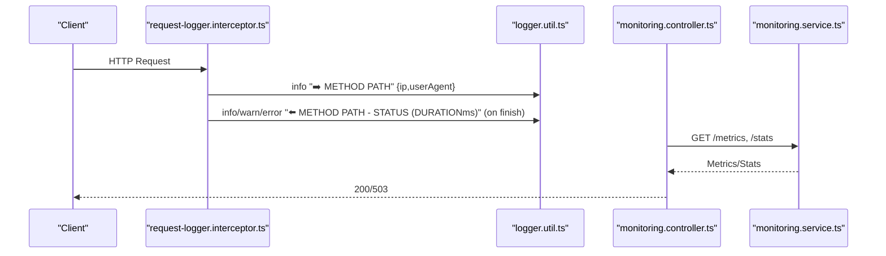

**Diagram sources**
- [request-logger.interceptor.ts:16-37](file://backend/src/common/interceptors/request-logger.interceptor.ts#L16-L37)
- [logger.util.ts:58-91](file://backend/src/common/utils/logger.util.ts#L58-L91)
- [monitoring.controller.ts:15-65](file://backend/src/modules/monitoring/controllers/monitoring.controller.ts#L15-L65)
- [monitoring.service.ts:79-220](file://backend/src/modules/monitoring/services/monitoring.service.ts#L79-L220)

**Section sources**
- [request-logger.interceptor.ts:16-37](file://backend/src/common/interceptors/request-logger.interceptor.ts#L16-L37)
- [logger.util.ts:58-91](file://backend/src/common/utils/logger.util.ts#L58-L91)
- [monitoring.controller.ts:15-65](file://backend/src/modules/monitoring/controllers/monitoring.controller.ts#L15-L65)
- [monitoring.service.ts:79-220](file://backend/src/modules/monitoring/services/monitoring.service.ts#L79-L220)

### Enhanced Log Retention Policies, Storage, and Access Controls
- **Dual Storage Strategy**: Active logs (<30 days) in main table, archived logs (30-365 days) in archive table
- **Automatic Archival**: Database-level archiving with PostgreSQL functions
- **Migration Support**: Complete database migration with archive table creation and indexes
- **Access Controls**: Comprehensive role-based access control for audit API endpoints
- **Retention Management**: Configurable retention policies with automatic cleanup

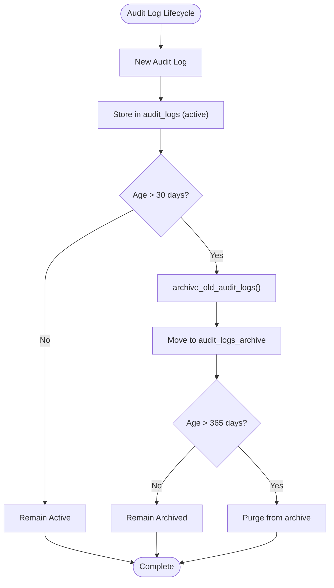

**Diagram sources**
- [003-audit-logs-archive.sql:44-87](file://backend/src/database/migrations/003-audit-logs-archive.sql#L44-L87)

**Section sources**
- [003-audit-logs-archive.sql:1-129](file://backend/src/database/migrations/003-audit-logs-archive.sql#L1-L129)
- [audit-log.entity.ts:83-139](file://backend/src/modules/auth/entities/audit-log.entity.ts#L83-L139)
- [logger.util.ts:67-81](file://backend/src/common/utils/logger.util.ts#L67-L81)
- [monitoring.controller.ts:27-65](file://backend/src/modules/monitoring/controllers/monitoring.controller.ts#L27-L65)

### Enhanced Monitoring Dashboards, Alerting, and Anomaly Detection
- **Health Checks**: Use the health endpoint to detect system downtime or degraded performance
- **Metrics**: Expose CPU, memory, uptime, database connectivity, and application metadata
- **Audit Statistics**: Comprehensive statistics endpoint with failure rates, top users, and activity trends
- **Alerting Thresholds**:
  - Health: Down if database unreachable; Degraded if free memory below threshold
  - Authentication: High LOGIN_FAILED rate over short windows indicates brute force attempts
  - Access Denied: Sudden spikes in ACCESS_DENIED suggest reconnaissance or misconfiguration
  - Audit Failures: High failure rates indicate system issues or security incidents
- **Anomaly Detection Patterns**:
  - Unusually high PASSWORD_RESET or PASSWORD_CHANGE rates for a user
  - Multiple ENTITY_DELETE operations in short timeframes
  - Requests from blocked IPs or user agents
  - Sudden spikes in critical severity logs

**Section sources**
- [monitoring.service.ts:169-199](file://backend/src/modules/monitoring/services/monitoring.service.ts#L169-L199)
- [audit-log.entity.ts:25-69](file://backend/src/modules/auth/entities/audit-log.entity.ts#L25-L69)
- [audit.controller.ts:185-257](file://backend/src/modules/audit/controllers/audit.controller.ts#L185-L257)

### Compliance Reporting and Forensic Analysis
- **Compliance Reporting**: Use filtered audit queries to generate reports by user, action, date range, and severity; exportable formats can be added to the monitoring controller
- **Forensic Analysis**: Leverage IP, user agent, module, and change data to reconstruct events; sensitive fields are masked in audit trails
- **Audit Trail Integrity**: Maintain immutable audit logs; consider write-once storage and cryptographic hashing for tamper evidence
- **Export Capabilities**: CSV and JSON export for external analysis and compliance requirements

**Section sources**
- [audit.service.ts:142-181](file://backend/src/modules/auth/services/audit.service.ts#L142-L181)
- [audit-log.entity.ts:104-132](file://backend/src/modules/auth/entities/audit-log.entity.ts#L104-L132)
- [audit.controller.ts:145-178](file://backend/src/modules/audit/controllers/audit.controller.ts#L145-L178)

### Enhanced Automated Security Monitoring Workflows
- **Login Attempt Monitoring**: Track LOGIN_FAILED events and correlate with IP addresses to trigger alerts
- **Privilege Change Monitoring**: Monitor ROLE_CHANGE and PERMISSION_CHANGE events for unauthorized modifications
- **Sensitive Operation Monitoring**: Track DATA_EXPORT, DATA_DELETE_BULK, and financial operations for unusual patterns
- **Maintenance Mode**: Use the maintenance endpoint to temporarily restrict access during investigations
- **Automatic Archival**: Regular archival of old logs to maintain system performance
- **Statistics Monitoring**: Continuous monitoring of audit statistics for security trends

**Section sources**
- [auth.service.ts:61-161](file://backend/src/modules/auth/services/auth.service.ts#L61-L161)
- [audit-log.entity.ts:25-69](file://backend/src/modules/auth/entities/audit-log.entity.ts#L25-L69)
- [monitoring.controller.ts:42-56](file://backend/src/modules/monitoring/controllers/monitoring.controller.ts#L42-L56)
- [archivage.service.ts:30-63](file://backend/src/modules/audit/services/archivage.service.ts#L30-L63)

## Dependency Analysis
The enhanced audit and monitoring components have comprehensive dependencies:

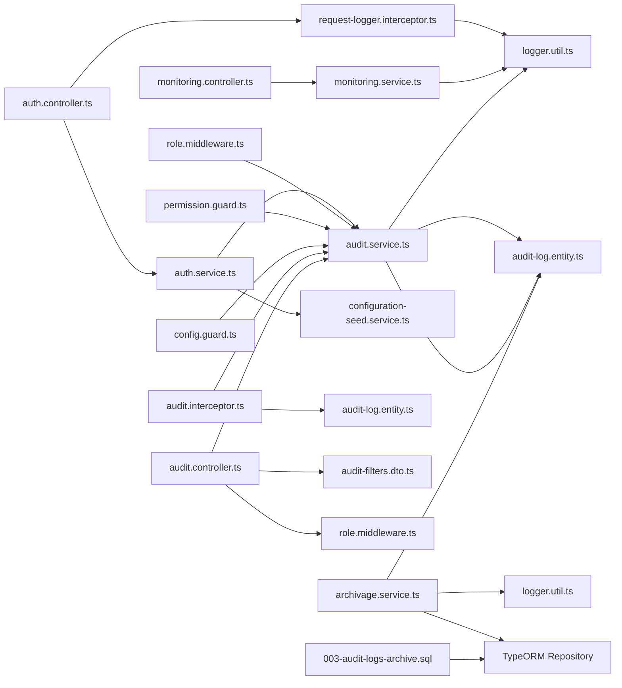

**Diagram sources**
- [audit.interceptor.ts:12-15](file://backend/src/common/interceptors/audit.interceptor.ts#L12-L15)
- [audit.controller.ts:11-18](file://backend/src/modules/audit/controllers/audit.controller.ts#L11-L18)
- [archivage.service.ts:11-14](file://backend/src/modules/audit/services/archivage.service.ts#L11-L14)
- [audit-log.entity.ts:11-20](file://backend/src/modules/auth/entities/audit-log.entity.ts#L11-L20)
- [auth.controller.ts:1-268](file://backend/src/modules/auth/controllers/auth.controller.ts#L1-L268)
- [auth.service.ts:1-485](file://backend/src/modules/auth/services/auth.service.ts#L1-L485)
- [audit.service.ts:1-230](file://backend/src/modules/auth/services/audit.service.ts#L1-L230)
- [request-logger.interceptor.ts:1-40](file://backend/src/common/interceptors/request-logger.interceptor.ts#L1-L40)
- [logger.util.ts:1-91](file://backend/src/common/utils/logger.util.ts#L1-L91)
- [monitoring.controller.ts:1-69](file://backend/src/modules/monitoring/controllers/monitoring.controller.ts#L1-L69)
- [monitoring.service.ts:1-223](file://backend/src/modules/monitoring/services/monitoring.service.ts#L1-L223)
- [role.middleware.ts:1-37](file://backend/src/modules/auth/middlewares/role.middleware.ts#L1-L37)
- [permission.guard.ts:1-74](file://backend/src/modules/auth/guards/permission.guard.ts#L1-L74)
- [config.guard.ts:1-55](file://backend/src/modules/configuration/guards/config.guard.ts#L1-L55)
- [configuration-seed.service.ts:172-251](file://backend/src/modules/configuration/services/configuration-seed.service.ts#L172-L251)
- [003-audit-logs-archive.sql:1-129](file://backend/src/database/migrations/003-audit-logs-archive.sql#L1-L129)

**Section sources**
- [audit.interceptor.ts:12-15](file://backend/src/common/interceptors/audit.interceptor.ts#L12-L15)
- [audit.controller.ts:11-18](file://backend/src/modules/audit/controllers/audit.controller.ts#L11-L18)
- [archivage.service.ts:11-14](file://backend/src/modules/audit/services/archivage.service.ts#L11-L14)
- [audit-log.entity.ts:11-20](file://backend/src/modules/auth/entities/audit-log.entity.ts#L11-L20)
- [auth.controller.ts:1-268](file://backend/src/modules/auth/controllers/auth.controller.ts#L1-L268)
- [auth.service.ts:1-485](file://backend/src/modules/auth/services/auth.service.ts#L1-L485)
- [audit.service.ts:1-230](file://backend/src/modules/auth/services/audit.service.ts#L1-L230)
- [request-logger.interceptor.ts:1-40](file://backend/src/common/interceptors/request-logger.interceptor.ts#L1-L40)
- [logger.util.ts:1-91](file://backend/src/common/utils/logger.util.ts#L1-L91)
- [monitoring.controller.ts:1-69](file://backend/src/modules/monitoring/controllers/monitoring.controller.ts#L1-L69)
- [monitoring.service.ts:1-223](file://backend/src/modules/monitoring/services/monitoring.service.ts#L1-L223)
- [role.middleware.ts:1-37](file://backend/src/modules/auth/middlewares/role.middleware.ts#L1-L37)
- [permission.guard.ts:1-74](file://backend/src/modules/auth/guards/permission.guard.ts#L1-L74)
- [config.guard.ts:1-55](file://backend/src/modules/configuration/guards/config.guard.ts#L1-L55)
- [configuration-seed.service.ts:172-251](file://backend/src/modules/configuration/services/configuration-seed.service.ts#L172-L251)
- [003-audit-logs-archive.sql:1-129](file://backend/src/database/migrations/003-audit-logs-archive.sql#L1-L129)

## Performance Considerations
- **Audit logging overhead**: Minimize serialization of large change sets; mask sensitive fields to reduce payload size
- **Query performance**: Use indexes on frequently filtered columns (user, action, target, createdAt); leverage database views for unified queries
- **Log volume**: Implement automatic archival to separate tables for old logs; control database growth with retention policies
- **Transport costs**: Use asynchronous Winston transports and batching where applicable
- **Interceptor performance**: Non-blocking error handling with setImmediate to prevent request blocking
- **Database optimization**: Use separate tables for active vs archived logs; optimize queries for large datasets

## Troubleshooting Guide
- **Audit logs not appearing**:
  - Verify Winston transports are configured and writable
  - Confirm AuditService.log is invoked and DB writes succeed
  - Check interceptor configuration and custom action mappings
- **Missing IP or user agent**:
  - Ensure reverse proxy forwards x-forwarded-for and client sends User-Agent header
  - Verify request interceptor is properly configured
- **Access denied floods**:
  - Review role/permission configurations and guard logic
  - Check for misconfigured routes or missing middleware
  - Verify audit interceptor is not interfering with authentication
- **Health check failures**:
  - Validate database connectivity and connection pool
  - Inspect free memory thresholds and application uptime
  - Check audit statistics endpoint for performance issues
- **Archival issues**:
  - Verify database migration executed successfully
  - Check PostgreSQL functions for archive operations
  - Monitor archive table growth and cleanup processes

**Section sources**
- [audit.service.ts:186-192](file://backend/src/modules/auth/services/audit.service.ts#L186-L192)
- [logger.util.ts:67-81](file://backend/src/common/utils/logger.util.ts#L67-L81)
- [monitoring.service.ts:169-199](file://backend/src/modules/monitoring/services/monitoring.service.ts#L169-L199)
- [audit.interceptor.ts:154-157](file://backend/src/common/interceptors/audit.interceptor.ts#L154-L157)
- [003-audit-logs-archive.sql:44-87](file://backend/src/database/migrations/003-audit-logs-archive.sql#L44-L87)

## Conclusion
eLISAschool's enhanced audit and monitoring system provides comprehensive security tracking through automatic audit interception, RESTful API management, advanced archiving capabilities, and extensive documentation. The system now supports automatic CRUD operation logging, comprehensive log management through REST APIs, database-level archiving with retention policies, and sophisticated statistics and analytics. By leveraging configuration-driven security parameters, structured audit records, and monitoring endpoints, the platform supports compliance reporting, forensic analysis, and automated anomaly detection. The addition of automatic interception, REST API management, and advanced archiving significantly strengthens the security posture and operational capabilities.

## Appendices

### Enhanced Audit Event Categories and Examples
- **Authentication**: LOGIN, LOGOUT, LOGIN_FAILED, PASSWORD_CHANGE, PASSWORD_RESET
- **Users**: USER_CREATE, USER_UPDATE, USER_DELETE, USER_SUSPEND, USER_ACTIVATE, ROLE_CHANGE
- **Students**: ELEVE_CREATE, ELEVE_UPDATE, ELEVE_DELETE, ELEVE_INSCRIPTION
- **Academic Operations**: CYCLE_CREATE/UPDATE/DELETE, NIVEAU_CREATE/UPDATE/DELETE, CLASSE_CREATE/UPDATE/DELETE, MATIERE_CREATE/UPDATE/DELETE, PERIODE_CREATE/UPDATE/DELETE, ANNEE_SCOLAIRE_CREATE/UPDATE/DELETE/ACTIVATE, BULLETIN_GENERATE, BULLETIN_UPDATE
- **Services**: DOCUMENT_CREATE, DOCUMENT_DELETE, DOCUMENT_PRINT, DOCUMENT_GENERATE
- **Notes**: NOTE_CREATE, NOTE_UPDATE, NOTE_DELETE, NOTE_VALIDATE
- **Canteen**: MENU_CREATE, MENU_UPDATE, MENU_DELETE, INSCRIPTION_CANTINE_CREATE, INSCRIPTION_CANTINE_DELETE, SOLDE_RECHARGE, CONSOMMATION_ENREGISTRER
- **Transport**: LIGNE_CREATE, LIGNE_UPDATE, LIGNE_DELETE, INSCRIPTION_TRANSPORT_CREATE, INSCRIPTION_TRANSPORT_DELETE, PRESENCE_TRANSPORT
- **Cards**: CARTE_CREATE, CARTE_UPDATE, CARTE_DESACTIVER, CARTE_RENOUVELER, CARTE_PERTE
- **Equipment**: MATERIEL_CREATE, MATERIEL_UPDATE, MATERIEL_DELETE, MATERIEL_ASSIGN, MATERIEL_RETURN
- **Communication**: MESSAGE_SEND, MESSAGE_DELETE, MESSAGE_MARK_READ, CLUB_CREATE, CLUB_UPDATE, CLUB_DELETE, CLUB_JOIN, CLUB_LEAVE
- **Gamification**: BADGE_AWARD, SCORE_UPDATE
- **Orientation**: ORIENTATION_CREATE, ORIENTATION_UPDATE, ORIENTATION_VALIDATE
- **Requests**: REQUETE_CREATE, REQUETE_EXECUTE, REQUETE_DELETE
- **RBAC**: ROLE_CREATE, ROLE_UPDATE, ROLE_DELETE, ROLE_ASSIGN, ROLE_REVOKE, PERMISSION_CREATE, PERMISSION_UPDATE, PERMISSION_DELETE
- **Configuration**: CONFIG_UPDATE, MODULE_ACTIVATE, MODULE_DEACTIVATE
- **Finance**: PAYMENT_RECEIVE, REFUND
- **Data**: DATA_EXPORT, DATA_IMPORT, DATA_DELETE_BULK
- **Access**: ACCESS_DENIED, PERMISSION_CHANGE

**Section sources**
- [audit-log.entity.ts:25-178](file://backend/src/modules/auth/entities/audit-log.entity.ts#L25-L178)

### Enhanced Security Parameter Reference
- **auth.session_duration**: Session lifetime in minutes
- **auth.max_login_attempts**: Maximum failed login attempts before lockout
- **auth.lockout_duration**: Lockout duration in minutes
- **auth.require_2fa**: Whether two-factor authentication is required
- **system.backup_retention_days**: Backup retention period
- **system.log_level**: Logging verbosity
- **system.maintenance_mode**: System maintenance toggle
- **audit.retention_days**: Audit log retention period (30/365 days)
- **audit.archive_enabled**: Enable/disable automatic archiving

**Section sources**
- [configuration-seed.service.ts:172-246](file://backend/src/modules/configuration/services/configuration-seed.service.ts#L172-L246)

### Audit API Endpoints Reference
- **GET /api/audit/logs**: List audit logs with advanced filtering and pagination
- **GET /api/audit/logs/:id**: Get individual audit log details
- **GET /api/audit/logs/me**: Get current user's audit logs
- **GET /api/audit/logs/export**: Export audit logs in CSV or JSON format
- **GET /api/audit/logs/statistics**: Get comprehensive audit statistics and analytics

**Section sources**
- [audit.controller.ts:22-300](file://backend/src/modules/audit/controllers/audit.controller.ts#L22-L300)

### Audit Interceptor Configuration Examples
- **Basic Configuration**: `createAuditInterceptor({ module: 'eleves', entityType: 'Eleve' })`
- **Custom Actions**: `createAuditInterceptor({ module: 'eleves', entityType: 'Eleve', customActions: [{ route: '/inscription', method: 'POST', action: AuditAction.ELEVE_INSCRIPTION }] })`
- **Excluded Routes**: `createAuditInterceptor({ module: 'eleves', entityType: 'Eleve', excludeRoutes: ['/health'] })`

**Section sources**
- [audit.interceptor.ts:51-63](file://backend/src/common/interceptors/audit.interceptor.ts#L51-L63)