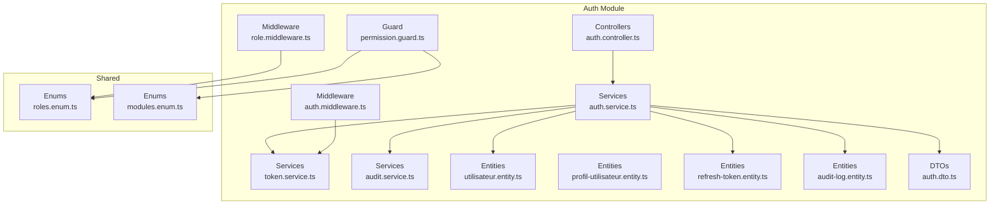
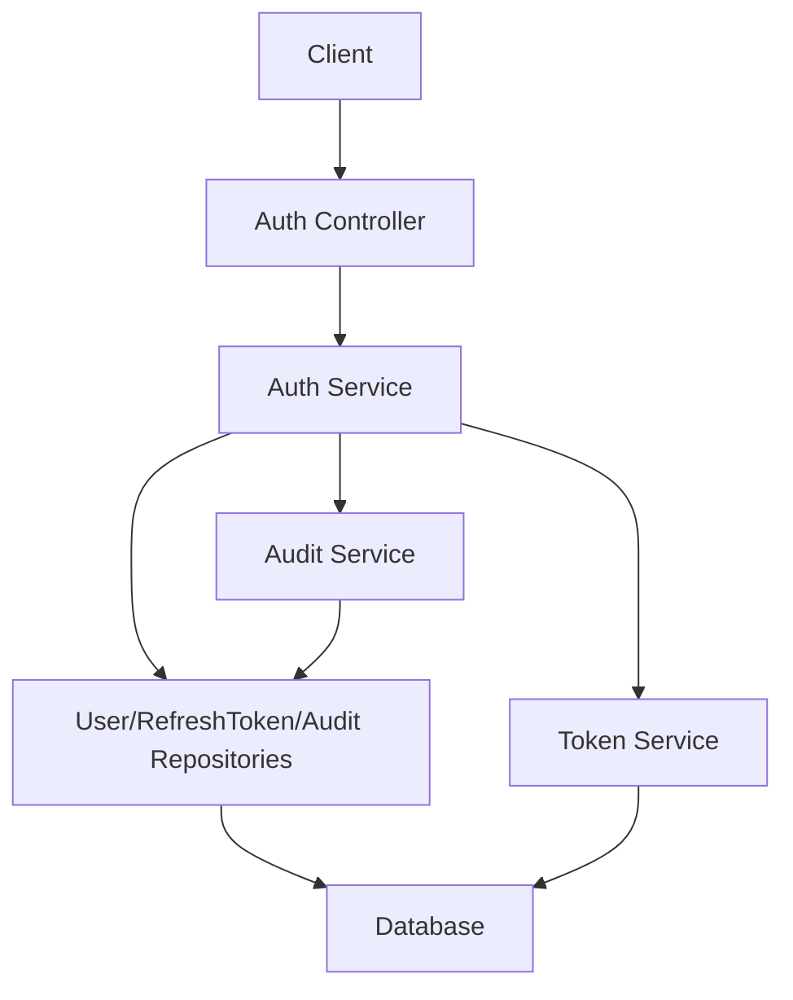
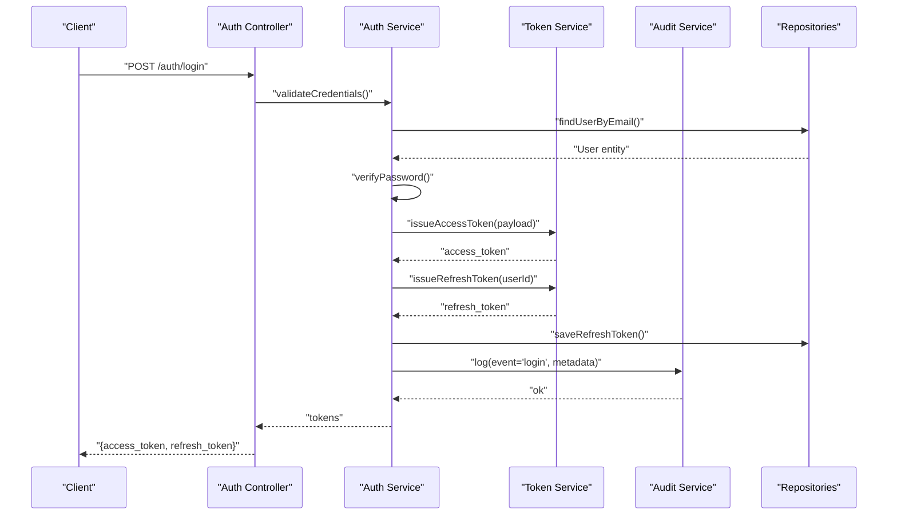
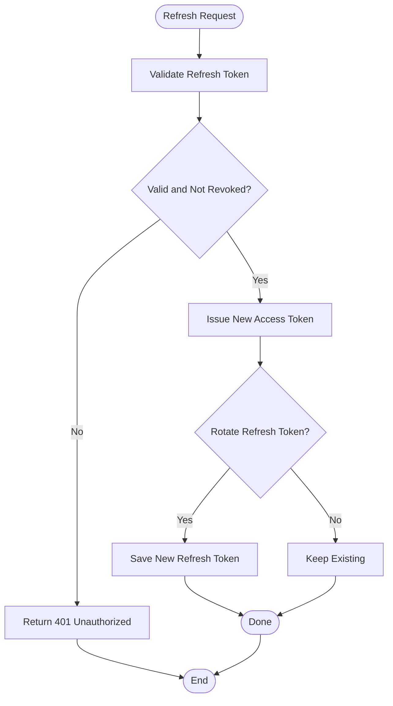
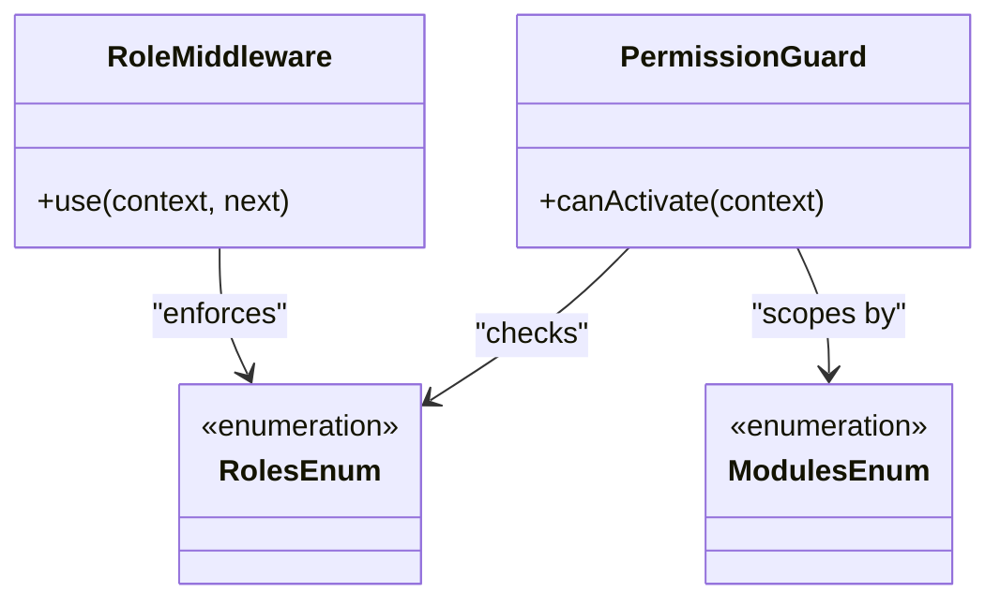
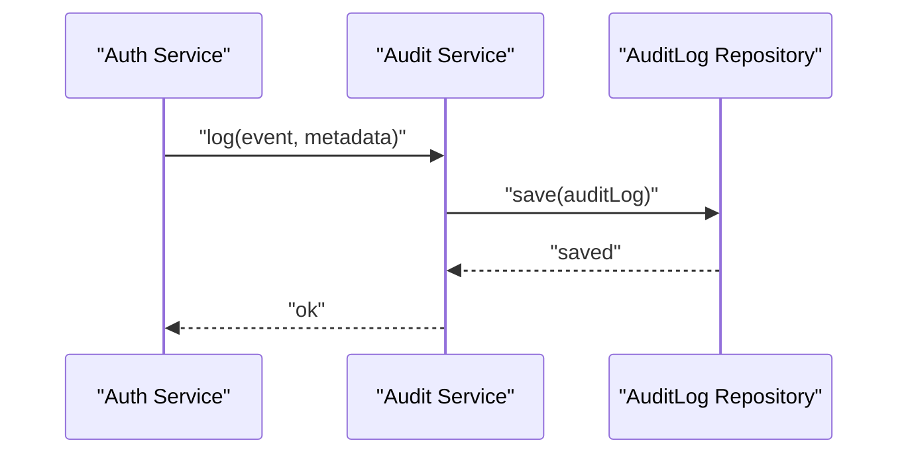
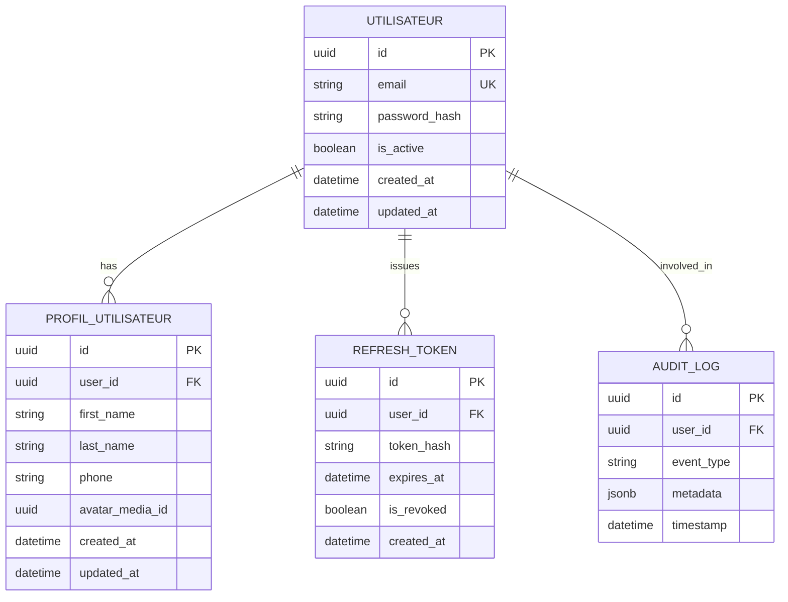
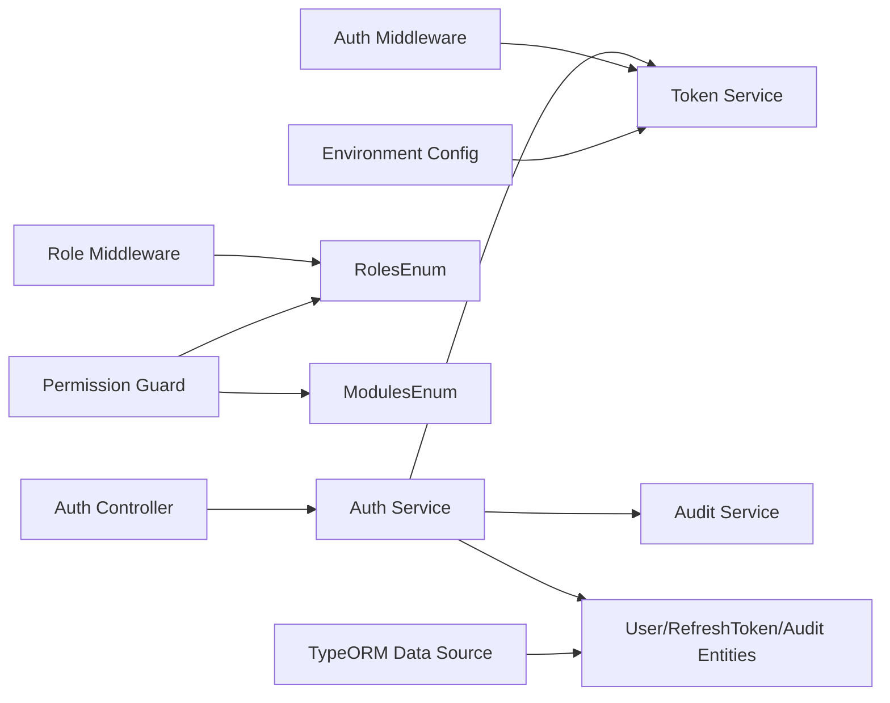

# Authentication & Authorization

<cite>
**Referenced Files in This Document**
- [auth.controller.ts](file://backend/src/modules/auth/controllers/auth.controller.ts)
- [auth.service.ts](file://backend/src/modules/auth/services/auth.service.ts)
- [token.service.ts](file://backend/src/modules/auth/services/token.service.ts)
- [audit.service.ts](file://backend/src/modules/auth/services/audit.service.ts)
- [auth.middleware.ts](file://backend/src/modules/auth/middlewares/auth.middleware.ts)
- [role.middleware.ts](file://backend/src/modules/auth/middlewares/role.middleware.ts)
- [permission.guard.ts](file://backend/src/modules/auth/guards/permission.guard.ts)
- [utilisateur.entity.ts](file://backend/src/modules/auth/entities/utilisateur.entity.ts)
- [profil-utilisateur.entity.ts](file://backend/src/modules/auth/entities/profil-utilisateur.entity.ts)
- [refresh-token.entity.ts](file://backend/src/modules/auth/entities/refresh-token.entity.ts)
- [audit-log.entity.ts](file://backend/src/modules/auth/entities/audit-log.entity.ts)
- [auth.dto.ts](file://backend/src/modules/auth/dto/auth.dto.ts)
- [roles.enum.ts](file://shared/src/enums/roles.enum.ts)
- [modules.enum.ts](file://shared/src/enums/modules.enum.ts)
- [app.constants.ts](file://shared/src/constants/app.constants.ts)
- [env.config.ts](file://backend/src/config/env.config.ts)
- [data-source.ts](file://backend/src/database/data-source.ts)
- [index.ts](file://backend/src/modules/auth/index.ts)
</cite>

## Table of Contents
1. [Introduction](#introduction)
2. [Project Structure](#project-structure)
3. [Core Components](#core-components)
4. [Architecture Overview](#architecture-overview)
5. [Detailed Component Analysis](#detailed-component-analysis)
6. [Dependency Analysis](#dependency-analysis)
7. [Performance Considerations](#performance-considerations)
8. [Troubleshooting Guide](#troubleshooting-guide)
9. [Conclusion](#conclusion)
10. [Appendices](#appendices)

## Introduction
This document explains the authentication and authorization system for eLISAschool. It covers JWT-based authentication, refresh token management, session handling, user roles and permissions, RBAC implementation, middleware protection, audit logging, token expiration handling, secure logout, and security best practices. The goal is to make the system understandable for both developers and stakeholders while remaining grounded in the repository’s implementation.

## Project Structure
The authentication subsystem resides under backend/src/modules/auth and integrates with shared types and enums. Key areas:
- Controllers: HTTP endpoints for authentication operations
- Services: Business logic for authentication, tokens, and audit
- Middlewares: Request-level guards for authentication and roles
- Guards: Route-level authorization checks
- Entities: Domain models for users, profiles, refresh tokens, and audit logs
- DTOs: Request/response contracts for authentication operations
- Shared: Role and module enumerations used for permissions

**Diagram sources**
- [auth.controller.ts](file://backend/src/modules/auth/controllers/auth.controller.ts)
- [auth.service.ts](file://backend/src/modules/auth/services/auth.service.ts)
- [token.service.ts](file://backend/src/modules/auth/services/token.service.ts)
- [audit.service.ts](file://backend/src/modules/auth/services/audit.service.ts)
- [auth.middleware.ts](file://backend/src/modules/auth/middlewares/auth.middleware.ts)
- [role.middleware.ts](file://backend/src/modules/auth/middlewares/role.middleware.ts)
- [permission.guard.ts](file://backend/src/modules/auth/guards/permission.guard.ts)
- [utilisateur.entity.ts](file://backend/src/modules/auth/entities/utilisateur.entity.ts)
- [profil-utilisateur.entity.ts](file://backend/src/modules/auth/entities/profil-utilisateur.entity.ts)
- [refresh-token.entity.ts](file://backend/src/modules/auth/entities/refresh-token.entity.ts)
- [audit-log.entity.ts](file://backend/src/modules/auth/entities/audit-log.entity.ts)
- [auth.dto.ts](file://backend/src/modules/auth/dto/auth.dto.ts)
- [roles.enum.ts](file://shared/src/enums/roles.enum.ts)
- [modules.enum.ts](file://shared/src/enums/modules.enum.ts)

**Section sources**
- [index.ts](file://backend/src/modules/auth/index.ts)

## Core Components
- Authentication controller: Exposes endpoints for login, logout, registration, and refresh token issuance.
- Authentication service: Orchestrates user validation, password verification, JWT creation, refresh token lifecycle, and audit logging.
- Token service: Manages JWT signing/verification, refresh token generation/storage, and expiration handling.
- Audit service: Records security-relevant events with metadata for compliance and forensics.
- Auth middleware: Extracts and validates bearer tokens on protected routes.
- Role middleware: Enforces role-based access at the route level.
- Permission guard: Implements fine-grained permission checks using roles and module scopes.
- Entities: User, profile, refresh token, and audit log models define persistence and relationships.
- DTOs: Strongly-typed contracts for authentication requests/responses.
- Shared enums: Roles and modules used across the system for RBAC.

**Section sources**
- [auth.controller.ts](file://backend/src/modules/auth/controllers/auth.controller.ts)
- [auth.service.ts](file://backend/src/modules/auth/services/auth.service.ts)
- [token.service.ts](file://backend/src/modules/auth/services/token.service.ts)
- [audit.service.ts](file://backend/src/modules/auth/services/audit.service.ts)
- [auth.middleware.ts](file://backend/src/modules/auth/middlewares/auth.middleware.ts)
- [role.middleware.ts](file://backend/src/modules/auth/middlewares/role.middleware.ts)
- [permission.guard.ts](file://backend/src/modules/auth/guards/permission.guard.ts)
- [utilisateur.entity.ts](file://backend/src/modules/auth/entities/utilisateur.entity.ts)
- [refresh-token.entity.ts](file://backend/src/modules/auth/entities/refresh-token.entity.ts)
- [audit-log.entity.ts](file://backend/src/modules/auth/entities/audit-log.entity.ts)
- [auth.dto.ts](file://backend/src/modules/auth/dto/auth.dto.ts)
- [roles.enum.ts](file://shared/src/enums/roles.enum.ts)
- [modules.enum.ts](file://shared/src/enums/modules.enum.ts)

## Architecture Overview
The authentication subsystem follows a layered architecture:
- Presentation: Controller handles HTTP requests and responses
- Application: Services encapsulate business logic
- Infrastructure: Entity persistence via TypeORM and environment configuration
- Security: Middleware and guards enforce authentication and authorization
- Observability: Audit service records security events

**Diagram sources**
- [auth.controller.ts](file://backend/src/modules/auth/controllers/auth.controller.ts)
- [auth.service.ts](file://backend/src/modules/auth/services/auth.service.ts)
- [token.service.ts](file://backend/src/modules/auth/services/token.service.ts)
- [audit.service.ts](file://backend/src/modules/auth/services/audit.service.ts)
- [utilisateur.entity.ts](file://backend/src/modules/auth/entities/utilisateur.entity.ts)
- [refresh-token.entity.ts](file://backend/src/modules/auth/entities/refresh-token.entity.ts)
- [audit-log.entity.ts](file://backend/src/modules/auth/entities/audit-log.entity.ts)
- [data-source.ts](file://backend/src/database/data-source.ts)

## Detailed Component Analysis

### JWT-Based Authentication System
- Token lifecycle:
  - Login: Validates credentials, creates access token and refresh token, stores refresh token, returns tokens to client
  - Refresh: Accepts a valid refresh token, issues a new access token, rotates refresh token if needed
  - Logout: Invalidates current session (client clears tokens; server-side revocation handled by refresh token invalidation)
- Access token:
  - Short-lived token used for API authorization
  - Contains claims identifying the subject and roles
- Refresh token:
  - Long-lived token used to obtain new access tokens
  - Stored securely with hashed value and expiry metadata
  - Rotation and invalidation are supported to mitigate theft risk

**Diagram sources**
- [auth.controller.ts](file://backend/src/modules/auth/controllers/auth.controller.ts)
- [auth.service.ts](file://backend/src/modules/auth/services/auth.service.ts)
- [token.service.ts](file://backend/src/modules/auth/services/token.service.ts)
- [audit.service.ts](file://backend/src/modules/auth/services/audit.service.ts)
- [utilisateur.entity.ts](file://backend/src/modules/auth/entities/utilisateur.entity.ts)
- [refresh-token.entity.ts](file://backend/src/modules/auth/entities/refresh-token.entity.ts)
- [audit-log.entity.ts](file://backend/src/modules/auth/entities/audit-log.entity.ts)

**Section sources**
- [auth.controller.ts](file://backend/src/modules/auth/controllers/auth.controller.ts)
- [auth.service.ts](file://backend/src/modules/auth/services/auth.service.ts)
- [token.service.ts](file://backend/src/modules/auth/services/token.service.ts)
- [auth.dto.ts](file://backend/src/modules/auth/dto/auth.dto.ts)

### Refresh Token Management
- Storage: Refresh tokens are persisted with a hashed secret and metadata (creation date, expiry, revoked flag)
- Rotation: On successful refresh, a new refresh token can be issued and the old one invalidated
- Revocation: Logout and expired refresh tokens prevent further access
- Expiry handling: Expired tokens are rejected during refresh and login validation

**Diagram sources**
- [auth.service.ts](file://backend/src/modules/auth/services/auth.service.ts)
- [token.service.ts](file://backend/src/modules/auth/services/token.service.ts)
- [refresh-token.entity.ts](file://backend/src/modules/auth/entities/refresh-token.entity.ts)

**Section sources**
- [auth.service.ts](file://backend/src/modules/auth/services/auth.service.ts)
- [token.service.ts](file://backend/src/modules/auth/services/token.service.ts)
- [refresh-token.entity.ts](file://backend/src/modules/auth/entities/refresh-token.entity.ts)

### Session Handling
- Stateless access tokens: No server-side session storage; authorization relies on signed tokens
- Client responsibility: Store tokens securely (e.g., HttpOnly cookies or secure storage) and attach Authorization header
- Logout: Clear local tokens; server-side enforcement via refresh token invalidation and short-lived access tokens

**Section sources**
- [auth.middleware.ts](file://backend/src/modules/auth/middlewares/auth.middleware.ts)
- [auth.controller.ts](file://backend/src/modules/auth/controllers/auth.controller.ts)

### User Roles, Permissions, and RBAC
- Roles: Defined centrally in shared enums and used across services and guards
- Modules: Enumerated in shared constants to scope permissions per functional area
- Permission guard: Combines roles and module-aware checks to authorize actions
- Role middleware: Restricts routes to specific roles

**Diagram sources**
- [role.middleware.ts](file://backend/src/modules/auth/middlewares/role.middleware.ts)
- [permission.guard.ts](file://backend/src/modules/auth/guards/permission.guard.ts)
- [roles.enum.ts](file://shared/src/enums/roles.enum.ts)
- [modules.enum.ts](file://shared/src/enums/modules.enum.ts)

**Section sources**
- [permission.guard.ts](file://backend/src/modules/auth/guards/permission.guard.ts)
- [role.middleware.ts](file://backend/src/modules/auth/middlewares/role.middleware.ts)
- [roles.enum.ts](file://shared/src/enums/roles.enum.ts)
- [modules.enum.ts](file://shared/src/enums/modules.enum.ts)

### Password Handling and Cryptography
- Password verification: Performed against stored hashed credentials during authentication
- Cryptographic utilities: Centralized in shared utilities for hashing and related operations
- Note: AES-256 is not used for password hashing; password hashing is performed using a secure hashing mechanism

**Section sources**
- [auth.service.ts](file://backend/src/modules/auth/services/auth.service.ts)
- [utilisateur.entity.ts](file://backend/src/modules/auth/entities/utilisateur.entity.ts)
- [crypto.util.ts](file://backend/src/common/utils/crypto.util.ts)

### Audit Logging for Security Events
- Logs include events such as login, logout, token refresh, failed attempts, and role changes
- Metadata captures user identity, IP address, user agent, timestamps, and outcomes
- Audit service persists entries to the audit log entity for compliance and monitoring

**Diagram sources**
- [audit.service.ts](file://backend/src/modules/auth/services/audit.service.ts)
- [audit-log.entity.ts](file://backend/src/modules/auth/entities/audit-log.entity.ts)

**Section sources**
- [audit.service.ts](file://backend/src/modules/auth/services/audit.service.ts)
- [audit-log.entity.ts](file://backend/src/modules/auth/entities/audit-log.entity.ts)

### Middleware Implementations
- Auth middleware: Extracts Authorization header, verifies token signature, and attaches user info to request context
- Role middleware: Guards routes by requiring a minimum role
- Combined usage: Auth middleware runs first, followed by role middleware or permission guard for fine-grained checks

**Section sources**
- [auth.middleware.ts](file://backend/src/modules/auth/middlewares/auth.middleware.ts)
- [role.middleware.ts](file://backend/src/modules/auth/middlewares/role.middleware.ts)

### Secure Logout Procedures
- Client clears stored tokens
- Server enforces logout by ensuring refresh tokens are invalidated and access tokens expire
- Audit trail records logout events for compliance

**Section sources**
- [auth.controller.ts](file://backend/src/modules/auth/controllers/auth.controller.ts)
- [audit.service.ts](file://backend/src/modules/auth/services/audit.service.ts)

### Token Expiration Handling
- Access tokens: Short-lived; clients proactively refresh before expiry
- Refresh tokens: Long-lived but bounded; validated for expiry and revocation
- Automatic cleanup: Expired refresh tokens are rejected; periodic cleanup recommended at the database level

**Section sources**
- [token.service.ts](file://backend/src/modules/auth/services/token.service.ts)
- [refresh-token.entity.ts](file://backend/src/modules/auth/entities/refresh-token.entity.ts)

### Data Models Overview
The authentication domain centers around users, profiles, refresh tokens, and audit logs.

**Diagram sources**
- [utilisateur.entity.ts](file://backend/src/modules/auth/entities/utilisateur.entity.ts)
- [profil-utilisateur.entity.ts](file://backend/src/modules/auth/entities/profil-utilisateur.entity.ts)
- [refresh-token.entity.ts](file://backend/src/modules/auth/entities/refresh-token.entity.ts)
- [audit-log.entity.ts](file://backend/src/modules/auth/entities/audit-log.entity.ts)

**Section sources**
- [utilisateur.entity.ts](file://backend/src/modules/auth/entities/utilisateur.entity.ts)
- [profil-utilisateur.entity.ts](file://backend/src/modules/auth/entities/profil-utilisateur.entity.ts)
- [refresh-token.entity.ts](file://backend/src/modules/auth/entities/refresh-token.entity.ts)
- [audit-log.entity.ts](file://backend/src/modules/auth/entities/audit-log.entity.ts)

## Dependency Analysis
- Internal dependencies:
  - Controllers depend on services
  - Services depend on repositories (via entities) and shared enums
  - Middlewares and guards depend on services and shared enums
- External dependencies:
  - Environment configuration drives token secrets and durations
  - Database connection configured via TypeORM data source

**Diagram sources**
- [auth.controller.ts](file://backend/src/modules/auth/controllers/auth.controller.ts)
- [auth.service.ts](file://backend/src/modules/auth/services/auth.service.ts)
- [token.service.ts](file://backend/src/modules/auth/services/token.service.ts)
- [audit.service.ts](file://backend/src/modules/auth/services/audit.service.ts)
- [auth.middleware.ts](file://backend/src/modules/auth/middlewares/auth.middleware.ts)
- [role.middleware.ts](file://backend/src/modules/auth/middlewares/role.middleware.ts)
- [permission.guard.ts](file://backend/src/modules/auth/guards/permission.guard.ts)
- [roles.enum.ts](file://shared/src/enums/roles.enum.ts)
- [modules.enum.ts](file://shared/src/enums/modules.enum.ts)
- [env.config.ts](file://backend/src/config/env.config.ts)
- [data-source.ts](file://backend/src/database/data-source.ts)

**Section sources**
- [env.config.ts](file://backend/src/config/env.config.ts)
- [data-source.ts](file://backend/src/database/data-source.ts)

## Performance Considerations
- Token verification: Keep payload minimal; avoid heavy claims to reduce parsing overhead
- Refresh token rotation: Optional; enable only when necessary to balance security vs. performance
- Database indexing: Ensure indexes on user email, refresh token hash, and audit timestamps
- Caching: Consider caching non-sensitive user metadata for frequently accessed endpoints
- Rate limiting: Apply at the authentication endpoints to mitigate brute-force attacks

## Troubleshooting Guide
- 401 Unauthorized on protected routes:
  - Verify Authorization header format and token validity
  - Confirm token is not expired and refresh token is still valid
- Refresh token errors:
  - Check token revocation and expiry fields
  - Ensure rotation policy aligns with client behavior
- Audit gaps:
  - Confirm audit service is invoked after each security-relevant action
  - Verify repository writes succeed and database connectivity is healthy
- Role/permission failures:
  - Validate user roles and module permissions
  - Confirm guard and middleware ordering in route configuration

**Section sources**
- [auth.middleware.ts](file://backend/src/modules/auth/middlewares/auth.middleware.ts)
- [permission.guard.ts](file://backend/src/modules/auth/guards/permission.guard.ts)
- [audit.service.ts](file://backend/src/modules/auth/services/audit.service.ts)

## Conclusion
eLISAschool’s authentication and authorization system is built around JWTs with robust refresh token management, centralized role and permission definitions, and comprehensive audit logging. The middleware and guard layers provide strong protection for routes, while secure logout and token expiration handling mitigate common attack vectors. Adhering to the outlined best practices ensures a resilient, compliant, and maintainable security posture.

## Appendices
- Compliance considerations:
  - Retain audit logs for required retention periods
  - Encrypt sensitive fields at rest and in transit
  - Regularly review and update token lifetimes and rotation policies
- Vulnerability prevention:
  - Enforce HTTPS/TLS
  - Sanitize inputs and validate all request payloads
  - Limit retries and implement account lockout policies
  - Use least privilege for service accounts and database connections