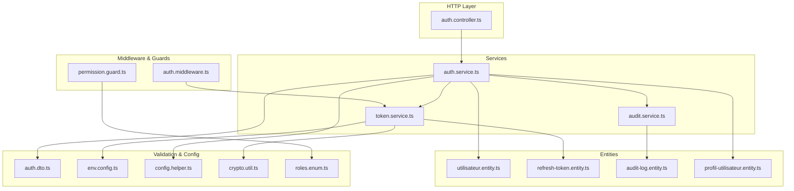
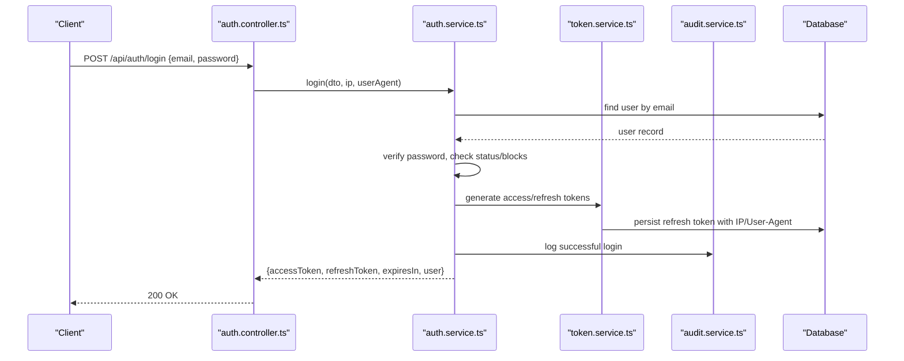
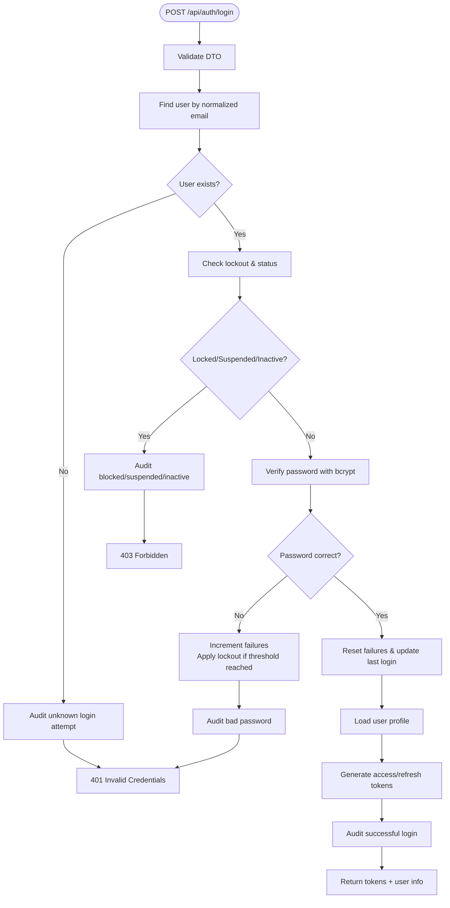
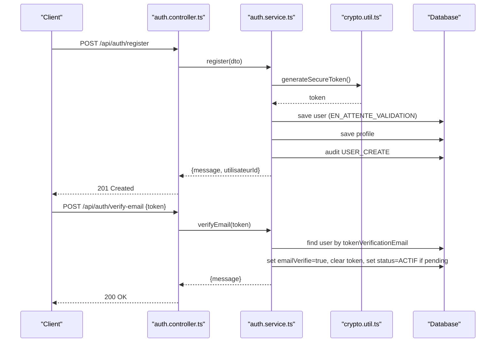
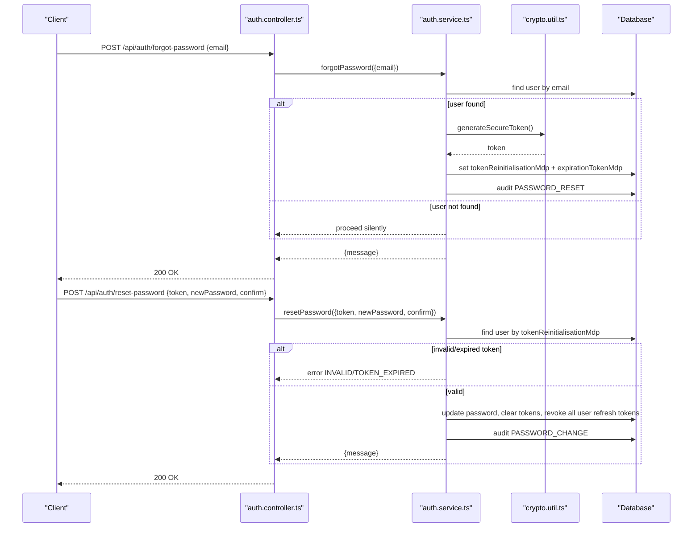
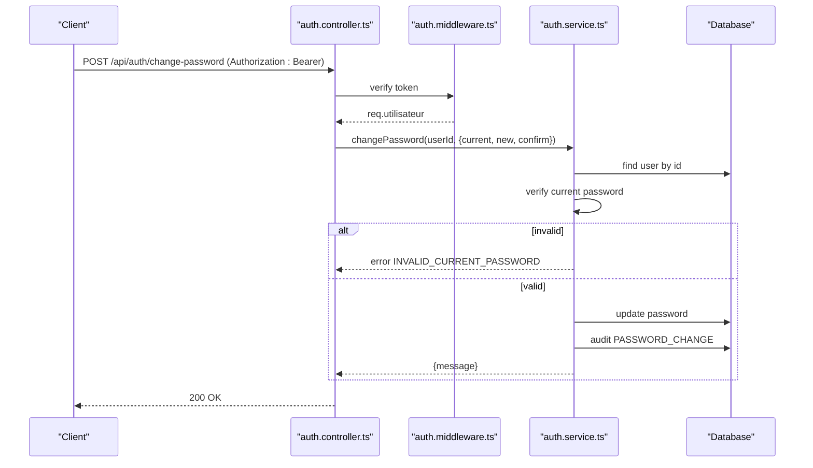
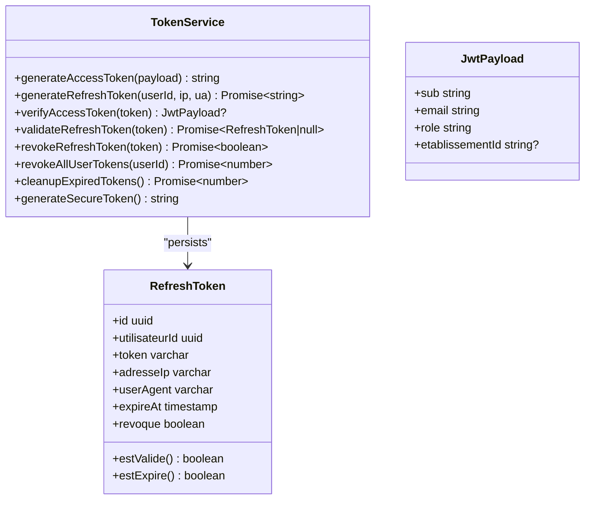
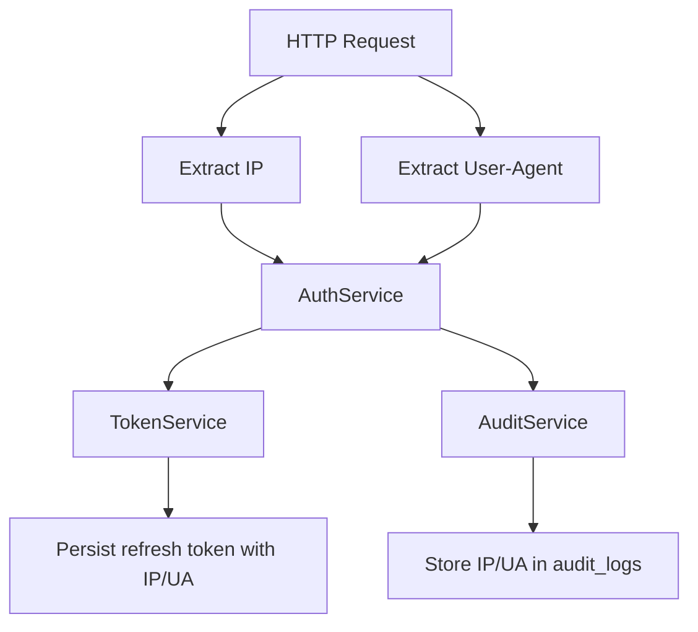
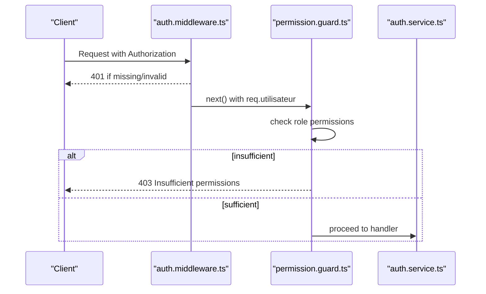
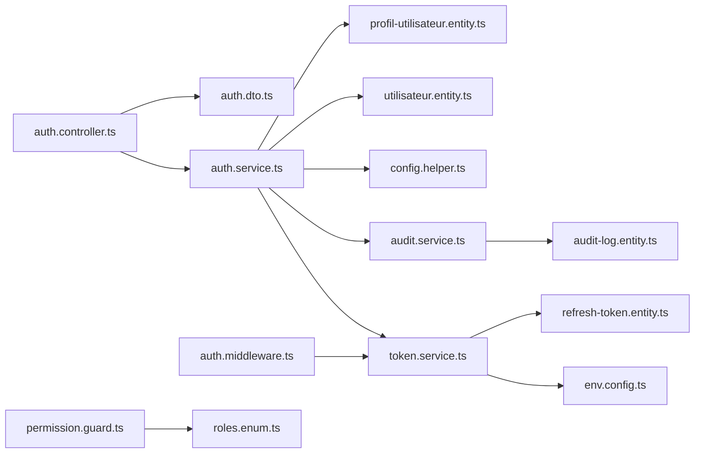

# Authentication Flow

<cite>
**Referenced Files in This Document**
- [auth.controller.ts](file://backend/src/modules/auth/controllers/auth.controller.ts)
- [auth.service.ts](file://backend/src/modules/auth/services/auth.service.ts)
- [token.service.ts](file://backend/src/modules/auth/services/token.service.ts)
- [auth.middleware.ts](file://backend/src/modules/auth/middlewares/auth.middleware.ts)
- [permission.guard.ts](file://backend/src/modules/auth/guards/permission.guard.ts)
- [audit.service.ts](file://backend/src/modules/auth/services/audit.service.ts)
- [audit-log.entity.ts](file://backend/src/modules/auth/entities/audit-log.entity.ts)
- [utilisateur.entity.ts](file://backend/src/modules/auth/entities/utilisateur.entity.ts)
- [refresh-token.entity.ts](file://backend/src/modules/auth/entities/refresh-token.entity.ts)
- [auth.dto.ts](file://backend/src/modules/auth/dto/auth.dto.ts)
- [env.config.ts](file://backend/src/config/env.config.ts)
- [config.helper.ts](file://backend/src/modules/configuration/utils/config.helper.ts)
- [crypto.util.ts](file://backend/src/common/utils/crypto.util.ts)
- [roles.enum.ts](file://shared/src/enums/roles.enum.ts)
- [profil-utilisateur.entity.ts](file://backend/src/modules/auth/entities/profil-utilisateur.entity.ts)
</cite>

## Table of Contents
1. [Introduction](#introduction)
2. [Project Structure](#project-structure)
3. [Core Components](#core-components)
4. [Architecture Overview](#architecture-overview)
5. [Detailed Component Analysis](#detailed-component-analysis)
6. [Dependency Analysis](#dependency-analysis)
7. [Performance Considerations](#performance-considerations)
8. [Troubleshooting Guide](#troubleshooting-guide)
9. [Conclusion](#conclusion)

## Introduction
This document describes the complete authentication flow for eLISAschool, covering login, registration with email verification, password reset, change password, and session management. It explains JWT access and refresh token generation, session establishment, and security monitoring via audit logs. It also documents IP tracking, user agent detection, and how configuration-driven security parameters influence behavior.

## Project Structure
The authentication subsystem is organized around a controller that validates requests, a service that orchestrates business logic, a token service for JWT and refresh tokens, middleware for protecting routes, and audit/logging services. Entities model users, profiles, refresh tokens, and audit logs. Configuration helpers and environment variables provide centralized security parameters.

**Diagram sources**
- [auth.controller.ts:1-268](file://backend/src/modules/auth/controllers/auth.controller.ts#L1-L268)
- [auth.service.ts:1-485](file://backend/src/modules/auth/services/auth.service.ts#L1-L485)
- [token.service.ts:1-181](file://backend/src/modules/auth/services/token.service.ts#L1-L181)
- [auth.middleware.ts:1-92](file://backend/src/modules/auth/middlewares/auth.middleware.ts#L1-L92)
- [permission.guard.ts:1-118](file://backend/src/modules/auth/guards/permission.guard.ts#L1-L118)
- [audit.service.ts:1-197](file://backend/src/modules/auth/services/audit.service.ts#L1-L197)
- [utilisateur.entity.ts:1-143](file://backend/src/modules/auth/entities/utilisateur.entity.ts#L1-L143)
- [refresh-token.entity.ts:1-72](file://backend/src/modules/auth/entities/refresh-token.entity.ts#L1-L72)
- [audit-log.entity.ts:1-139](file://backend/src/modules/auth/entities/audit-log.entity.ts#L1-L139)
- [auth.dto.ts:1-173](file://backend/src/modules/auth/dto/auth.dto.ts#L1-L173)
- [env.config.ts:1-168](file://backend/src/config/env.config.ts#L1-L168)
- [config.helper.ts:1-131](file://backend/src/modules/configuration/utils/config.helper.ts#L1-L131)
- [crypto.util.ts:1-119](file://backend/src/common/utils/crypto.util.ts#L1-L119)
- [roles.enum.ts:1-187](file://shared/src/enums/roles.enum.ts#L1-L187)
- [profil-utilisateur.entity.ts:1-105](file://backend/src/modules/auth/entities/profil-utilisateur.entity.ts#L1-L105)

**Section sources**
- [auth.controller.ts:1-268](file://backend/src/modules/auth/controllers/auth.controller.ts#L1-L268)
- [auth.service.ts:1-485](file://backend/src/modules/auth/services/auth.service.ts#L1-L485)
- [token.service.ts:1-181](file://backend/src/modules/auth/services/token.service.ts#L1-L181)
- [auth.middleware.ts:1-92](file://backend/src/modules/auth/middlewares/auth.middleware.ts#L1-L92)
- [permission.guard.ts:1-118](file://backend/src/modules/auth/guards/permission.guard.ts#L1-L118)
- [audit.service.ts:1-197](file://backend/src/modules/auth/services/audit.service.ts#L1-L197)
- [utilisateur.entity.ts:1-143](file://backend/src/modules/auth/entities/utilisateur.entity.ts#L1-L143)
- [refresh-token.entity.ts:1-72](file://backend/src/modules/auth/entities/refresh-token.entity.ts#L1-L72)
- [audit-log.entity.ts:1-139](file://backend/src/modules/auth/entities/audit-log.entity.ts#L1-L139)
- [auth.dto.ts:1-173](file://backend/src/modules/auth/dto/auth.dto.ts#L1-L173)
- [env.config.ts:1-168](file://backend/src/config/env.config.ts#L1-L168)
- [config.helper.ts:1-131](file://backend/src/modules/configuration/utils/config.helper.ts#L1-L131)
- [crypto.util.ts:1-119](file://backend/src/common/utils/crypto.util.ts#L1-L119)
- [roles.enum.ts:1-187](file://shared/src/enums/roles.enum.ts#L1-L187)
- [profil-utilisateur.entity.ts:1-105](file://backend/src/modules/auth/entities/profil-utilisateur.entity.ts#L1-L105)

## Core Components
- Controller: Validates incoming payloads using Zod schemas and delegates to AuthService. It extracts IP and User-Agent for security tracking and audit.
- AuthService: Implements login, registration, token refresh, logout, forgot/reset/change password, and current user retrieval. Reads security parameters from configuration.
- TokenService: Generates JWT access tokens and refresh tokens, validates and revokes refresh tokens, and cleans up expired tokens.
- Auth Middleware: Extracts Bearer token from Authorization header, verifies JWT, and attaches user identity to the request.
- Permission Guard: Enforces role-based permissions after authentication.
- Audit Service: Logs security-relevant events (login attempts, password changes, access denials) and captures IP and User-Agent.
- Entities: User, Profile, RefreshToken, and AuditLog define persistence and relationships.
- DTOs: Strongly-typed request/response shapes validated by Zod.
- Environment & Config: Centralized JWT secrets, token durations, encryption keys, and security parameters.

**Section sources**
- [auth.controller.ts:55-264](file://backend/src/modules/auth/controllers/auth.controller.ts#L55-L264)
- [auth.service.ts:61-481](file://backend/src/modules/auth/services/auth.service.ts#L61-L481)
- [token.service.ts:32-174](file://backend/src/modules/auth/services/token.service.ts#L32-L174)
- [auth.middleware.ts:30-60](file://backend/src/modules/auth/middlewares/auth.middleware.ts#L30-L60)
- [permission.guard.ts:44-87](file://backend/src/modules/auth/guards/permission.guard.ts#L44-L87)
- [audit.service.ts:47-192](file://backend/src/modules/auth/services/audit.service.ts#L47-L192)
- [utilisateur.entity.ts:52-140](file://backend/src/modules/auth/entities/utilisateur.entity.ts#L52-L140)
- [refresh-token.entity.ts:24-69](file://backend/src/modules/auth/entities/refresh-token.entity.ts#L24-L69)
- [audit-log.entity.ts:87-136](file://backend/src/modules/auth/entities/audit-log.entity.ts#L87-L136)
- [auth.dto.ts:18-172](file://backend/src/modules/auth/dto/auth.dto.ts#L18-L172)
- [env.config.ts:138-142](file://backend/src/config/env.config.ts#L138-L142)
- [config.helper.ts:24-54](file://backend/src/modules/configuration/utils/config.helper.ts#L24-L54)
- [crypto.util.ts:91-93](file://backend/src/common/utils/crypto.util.ts#L91-L93)

## Architecture Overview
The authentication flow integrates HTTP validation, service orchestration, token management, middleware protection, and audit logging. Security parameters are configurable and enforced at runtime.

**Diagram sources**
- [auth.controller.ts:55-74](file://backend/src/modules/auth/controllers/auth.controller.ts#L55-L74)
- [auth.service.ts:61-161](file://backend/src/modules/auth/services/auth.service.ts#L61-L161)
- [token.service.ts:46-72](file://backend/src/modules/auth/services/token.service.ts#L46-L72)
- [audit.service.ts:67-77](file://backend/src/modules/auth/services/audit.service.ts#L67-L77)

## Detailed Component Analysis

### Login Flow
- Input validation: Zod schema ensures email format, password length, and optional “remember me” flag.
- User lookup: Case-normalized email lookup; strict selection of credentials and status fields.
- Account checks: Blocked accounts (temporary lockout), suspended, and inactive statuses are rejected.
- Password verification: Uses bcrypt comparison; increments failed attempts and applies lockout policy based on configuration.
- Successful login: Resets failure counter, updates last login, loads profile, generates JWT access token and refresh token, logs successful event.
- Session duration: Derived from configuration (minutes to seconds) and returned to client.

**Diagram sources**
- [auth.controller.ts:55-74](file://backend/src/modules/auth/controllers/auth.controller.ts#L55-L74)
- [auth.service.ts:69-118](file://backend/src/modules/auth/services/auth.service.ts#L69-L118)
- [utilisateur.entity.ts:120-130](file://backend/src/modules/auth/entities/utilisateur.entity.ts#L120-L130)
- [audit.service.ts:67-77](file://backend/src/modules/auth/services/audit.service.ts#L67-L77)

**Section sources**
- [auth.controller.ts:55-74](file://backend/src/modules/auth/controllers/auth.controller.ts#L55-L74)
- [auth.service.ts:69-118](file://backend/src/modules/auth/services/auth.service.ts#L69-L118)
- [utilisateur.entity.ts:120-130](file://backend/src/modules/auth/entities/utilisateur.entity.ts#L120-L130)
- [audit.service.ts:67-77](file://backend/src/modules/auth/services/audit.service.ts#L67-L77)

### Registration and Email Verification
- Registration:
  - Validates password length and complexity, confirms passwords match, and ensures email uniqueness.
  - Generates a unique matricule and creates a pending user with a secure email verification token.
  - Persists user and profile records and logs creation event.
- Email verification:
  - Validates the verification token; marks email verified and activates account if previously pending.

**Diagram sources**
- [auth.controller.ts:80-95](file://backend/src/modules/auth/controllers/auth.controller.ts#L80-L95)
- [auth.controller.ts:231-245](file://backend/src/modules/auth/controllers/auth.controller.ts#L231-L245)
- [auth.service.ts:166-234](file://backend/src/modules/auth/services/auth.service.ts#L166-L234)
- [auth.service.ts:426-447](file://backend/src/modules/auth/services/auth.service.ts#L426-L447)
- [crypto.util.ts:91-93](file://backend/src/common/utils/crypto.util.ts#L91-L93)

**Section sources**
- [auth.controller.ts:80-95](file://backend/src/modules/auth/controllers/auth.controller.ts#L80-L95)
- [auth.controller.ts:231-245](file://backend/src/modules/auth/controllers/auth.controller.ts#L231-L245)
- [auth.service.ts:166-234](file://backend/src/modules/auth/services/auth.service.ts#L166-L234)
- [auth.service.ts:426-447](file://backend/src/modules/auth/services/auth.service.ts#L426-L447)
- [crypto.util.ts:91-93](file://backend/src/common/utils/crypto.util.ts#L91-L93)

### Forgot Password and Reset Password
- Forgot password:
  - Looks up user by email; if found, generates a secure reset token with 1-hour expiry and persists it.
  - Returns a generic message regardless of whether the email existed (no information disclosure).
- Reset password:
  - Validates new password against minimum length and complexity.
  - Finds user by reset token; rejects if token missing/expired.
  - Updates password, clears reset token/expiration, revokes all user refresh tokens, audits the change, and returns success.

**Diagram sources**
- [auth.controller.ts:167-181](file://backend/src/modules/auth/controllers/auth.controller.ts#L167-L181)
- [auth.controller.ts:187-201](file://backend/src/modules/auth/controllers/auth.controller.ts#L187-L201)
- [auth.service.ts:310-338](file://backend/src/modules/auth/services/auth.service.ts#L310-L338)
- [auth.service.ts:343-378](file://backend/src/modules/auth/services/auth.service.ts#L343-L378)
- [crypto.util.ts:91-93](file://backend/src/common/utils/crypto.util.ts#L91-L93)

**Section sources**
- [auth.controller.ts:167-181](file://backend/src/modules/auth/controllers/auth.controller.ts#L167-L181)
- [auth.controller.ts:187-201](file://backend/src/modules/auth/controllers/auth.controller.ts#L187-L201)
- [auth.service.ts:310-338](file://backend/src/modules/auth/services/auth.service.ts#L310-L338)
- [auth.service.ts:343-378](file://backend/src/modules/auth/services/auth.service.ts#L343-L378)
- [crypto.util.ts:91-93](file://backend/src/common/utils/crypto.util.ts#L91-L93)

### Change Password (Authenticated Users)
- Requires bearer token; middleware attaches user identity.
- Validates new password length and complexity.
- Verifies current password using bcrypt.
- Updates password and audits the change.

**Diagram sources**
- [auth.controller.ts:208-225](file://backend/src/modules/auth/controllers/auth.controller.ts#L208-L225)
- [auth.middleware.ts:30-60](file://backend/src/modules/auth/middlewares/auth.middleware.ts#L30-L60)
- [auth.service.ts:383-421](file://backend/src/modules/auth/services/auth.service.ts#L383-L421)

**Section sources**
- [auth.controller.ts:208-225](file://backend/src/modules/auth/controllers/auth.controller.ts#L208-L225)
- [auth.middleware.ts:30-60](file://backend/src/modules/auth/middlewares/auth.middleware.ts#L30-L60)
- [auth.service.ts:383-421](file://backend/src/modules/auth/services/auth.service.ts#L383-L421)

### Token Management and Session Establishment
- Access token:
  - Generated by TokenService with issuer/audience claims and configured expiry.
- Refresh token:
  - Generated with random 64-byte hex token, stored with IP and User-Agent, and 30-day expiry.
  - Used to obtain new access tokens without re-authentication.
- Token validation and revocation:
  - Validate refresh token presence and validity; revoke upon refresh or logout.
  - Cleanup expired/revoke tokens periodically.
- Session establishment:
  - Client receives access token for protected routes; refresh token enables seamless renewal.

**Diagram sources**
- [token.service.ts:32-174](file://backend/src/modules/auth/services/token.service.ts#L32-L174)
- [refresh-token.entity.ts:24-69](file://backend/src/modules/auth/entities/refresh-token.entity.ts#L24-L69)
- [auth.dto.ts:145-152](file://backend/src/modules/auth/dto/auth.dto.ts#L145-L152)

**Section sources**
- [token.service.ts:32-174](file://backend/src/modules/auth/services/token.service.ts#L32-L174)
- [refresh-token.entity.ts:24-69](file://backend/src/modules/auth/entities/refresh-token.entity.ts#L24-L69)
- [auth.dto.ts:145-152](file://backend/src/modules/auth/dto/auth.dto.ts#L145-L152)

### Security Monitoring: IP Tracking, User Agent Detection, and Device Fingerprinting
- IP tracking:
  - Controller passes request IP to AuthService for login/refresh.
  - TokenService stores IP with refresh tokens.
  - AuditService captures IP and User-Agent for logged events.
- User agent detection:
  - Controller passes User-Agent to AuthService and TokenService.
  - Stored with refresh tokens and captured in audit logs.
- Device fingerprinting:
  - Not implemented in the current codebase. The system tracks IP and User-Agent but does not compute a persistent device fingerprint.

**Diagram sources**
- [auth.controller.ts:61-62](file://backend/src/modules/auth/controllers/auth.controller.ts#L61-L62)
- [token.service.ts:46-72](file://backend/src/modules/auth/services/token.service.ts#L46-L72)
- [audit.service.ts:47-62](file://backend/src/modules/auth/services/audit.service.ts#L47-L62)
- [audit-log.entity.ts:119-123](file://backend/src/modules/auth/entities/audit-log.entity.ts#L119-L123)

**Section sources**
- [auth.controller.ts:61-62](file://backend/src/modules/auth/controllers/auth.controller.ts#L61-L62)
- [token.service.ts:46-72](file://backend/src/modules/auth/services/token.service.ts#L46-L72)
- [audit.service.ts:47-62](file://backend/src/modules/auth/services/audit.service.ts#L47-L62)
- [audit-log.entity.ts:119-123](file://backend/src/modules/auth/entities/audit-log.entity.ts#L119-L123)

### Route Protection and Permissions
- Auth middleware:
  - Extracts Bearer token, verifies JWT, and attaches user identity to the request.
- Optional auth middleware:
  - Attempts verification but does not fail if absent.
- Permission guard:
  - Enforces RBAC using shared role/permission enums; super admin bypass; logs access denials.

**Diagram sources**
- [auth.middleware.ts:30-60](file://backend/src/modules/auth/middlewares/auth.middleware.ts#L30-L60)
- [permission.guard.ts:44-87](file://backend/src/modules/auth/guards/permission.guard.ts#L44-L87)
- [roles.enum.ts:120-184](file://shared/src/enums/roles.enum.ts#L120-L184)

**Section sources**
- [auth.middleware.ts:30-60](file://backend/src/modules/auth/middlewares/auth.middleware.ts#L30-L60)
- [permission.guard.ts:44-87](file://backend/src/modules/auth/guards/permission.guard.ts#L44-L87)
- [roles.enum.ts:120-184](file://shared/src/enums/roles.enum.ts#L120-L184)

## Dependency Analysis
- Controller depends on AuthService and Zod DTOs.
- AuthService depends on TokenService, AuditService, configuration helpers, and entities.
- TokenService depends on environment configuration and refresh token entity.
- Middleware depends on TokenService.
- AuditService depends on audit log entity and request metadata extraction.
- Entities define relationships and constraints for persistence.

**Diagram sources**
- [auth.controller.ts:10-19](file://backend/src/modules/auth/controllers/auth.controller.ts#L10-L19)
- [auth.service.ts:13-29](file://backend/src/modules/auth/services/auth.service.ts#L13-L29)
- [token.service.ts:9-16](file://backend/src/modules/auth/services/token.service.ts#L9-L16)
- [auth.middleware.ts:9-24](file://backend/src/modules/auth/middlewares/auth.middleware.ts#L9-L24)
- [permission.guard.ts:11-14](file://backend/src/modules/auth/guards/permission.guard.ts#L11-L14)
- [audit.service.ts:11-15](file://backend/src/modules/auth/services/audit.service.ts#L11-L15)
- [env.config.ts:9-16](file://backend/src/config/env.config.ts#L9-L16)
- [config.helper.ts:12-13](file://backend/src/modules/configuration/utils/config.helper.ts#L12-L13)

**Section sources**
- [auth.controller.ts:10-19](file://backend/src/modules/auth/controllers/auth.controller.ts#L10-L19)
- [auth.service.ts:13-29](file://backend/src/modules/auth/services/auth.service.ts#L13-L29)
- [token.service.ts:9-16](file://backend/src/modules/auth/services/token.service.ts#L9-L16)
- [auth.middleware.ts:9-24](file://backend/src/modules/auth/middlewares/auth.middleware.ts#L9-L24)
- [permission.guard.ts:11-14](file://backend/src/modules/auth/guards/permission.guard.ts#L11-L14)
- [audit.service.ts:11-15](file://backend/src/modules/auth/services/audit.service.ts#L11-L15)
- [env.config.ts:9-16](file://backend/src/config/env.config.ts#L9-L16)
- [config.helper.ts:12-13](file://backend/src/modules/configuration/utils/config.helper.ts#L12-L13)

## Performance Considerations
- Password hashing: bcrypt cost is managed automatically; avoid excessive customization to prevent CPU spikes.
- Token storage: Refresh tokens are indexed on token and user; ensure database performance tuning for high concurrency.
- Audit logging: Structured logging with minimal sensitive data exposure; consider batching or asynchronous writes for high throughput.
- Configuration caching: Quick cache reduces repeated reads for security parameters; tune TTL appropriately.

[No sources needed since this section provides general guidance]

## Troubleshooting Guide
Common error scenarios and resolutions:
- Invalid credentials during login:
  - Cause: Incorrect email or password; exceeded max attempts leading to lockout.
  - Resolution: Verify credentials; wait for lockout window; check configuration for max attempts and lockout duration.
- Account locked/suspended/inactive:
  - Cause: Temporary lockout or administrative status changes.
  - Resolution: Contact administrator; ensure account is activated.
- Invalid or expired reset token:
  - Cause: Token mismatch or expiration beyond 1 hour.
  - Resolution: Trigger a new forgot password request.
- Password too short or weak:
  - Cause: Violates configured minimum length or complexity rules.
  - Resolution: Enforce minimum length and character requirements.
- Missing or invalid bearer token:
  - Cause: Missing Authorization header or invalid/expired JWT.
  - Resolution: Obtain a new access token using a valid refresh token or re-authenticate.
- Insufficient permissions:
  - Cause: Role lacks required permissions.
  - Resolution: Assign appropriate role or permissions; super admin bypass is available.

**Section sources**
- [auth.service.ts:74-113](file://backend/src/modules/auth/services/auth.service.ts#L74-L113)
- [auth.service.ts:358-364](file://backend/src/modules/auth/services/auth.service.ts#L358-L364)
- [auth.service.ts:390-411](file://backend/src/modules/auth/services/auth.service.ts#L390-L411)
- [auth.middleware.ts:35-46](file://backend/src/modules/auth/middlewares/auth.middleware.ts#L35-L46)
- [permission.guard.ts:57-81](file://backend/src/modules/auth/guards/permission.guard.ts#L57-L81)

## Conclusion
eLISAschool’s authentication system provides robust login, registration with email verification, secure password reset, and change password flows. It leverages JWT access tokens, refresh tokens with IP/User-Agent tracking, centralized security configuration, and comprehensive audit logging. While device fingerprinting is not implemented, IP and user agent capture enable strong security monitoring. The modular design and middleware/guard patterns support scalable and maintainable access control.