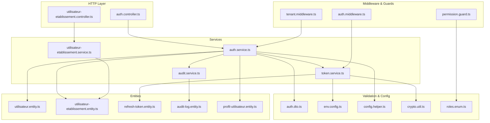
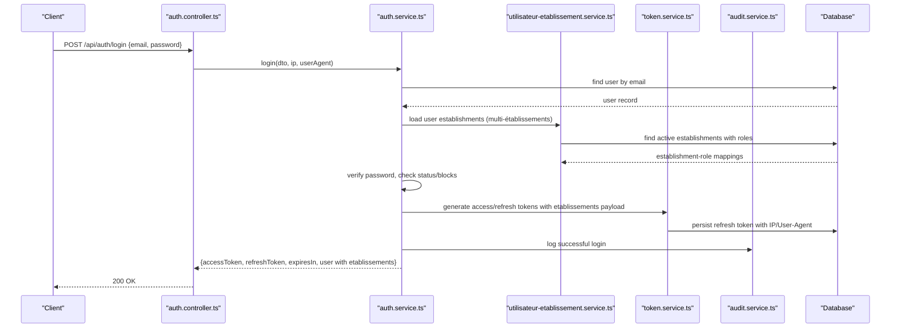
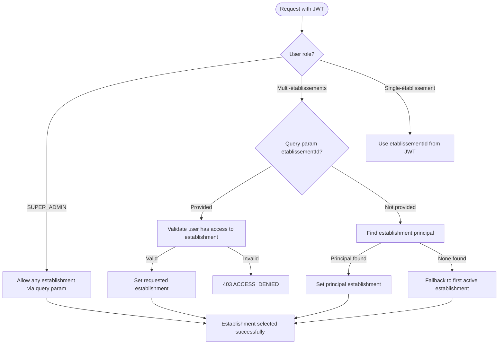
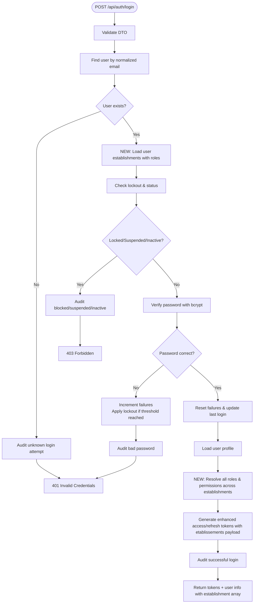
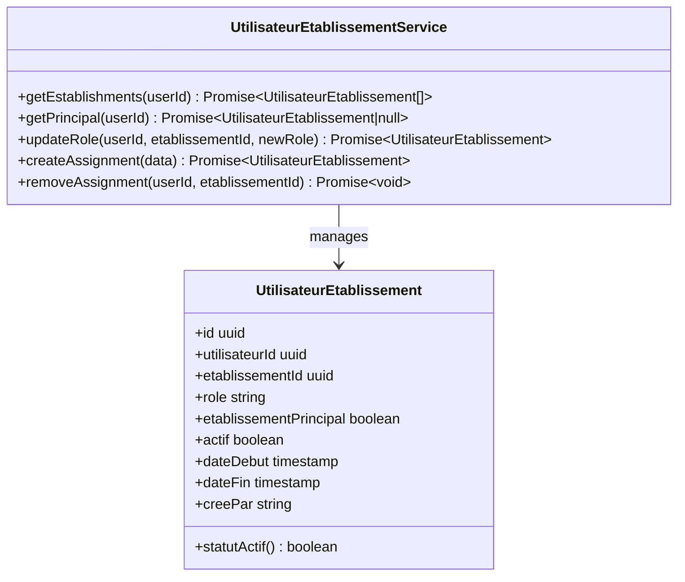
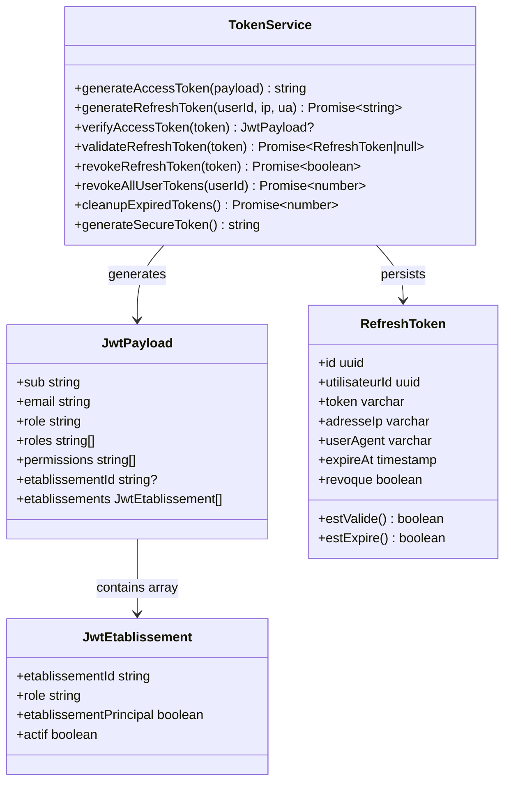
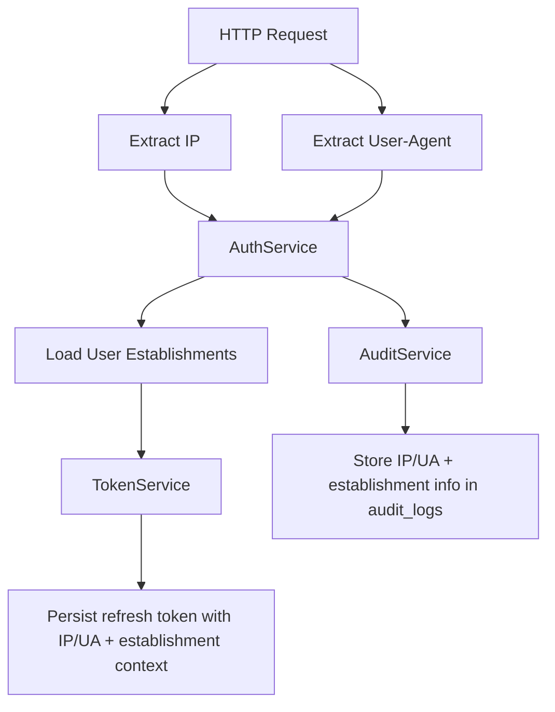
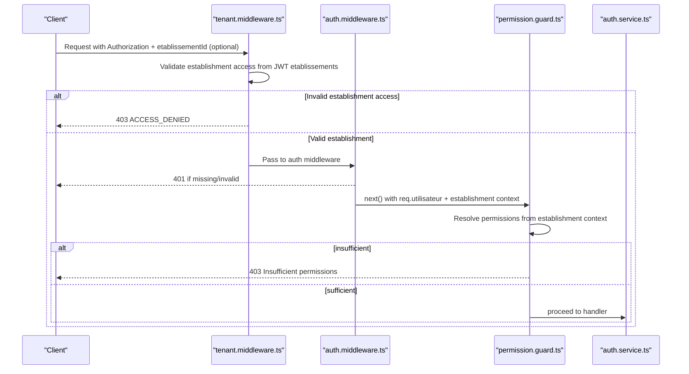
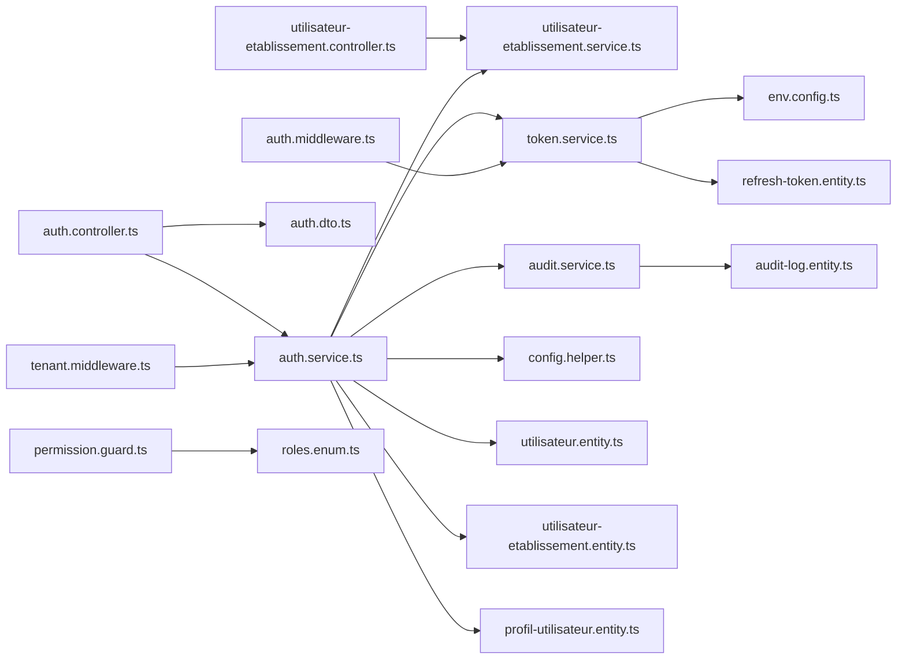

# Authentication Flow

<cite>
**Referenced Files in This Document**
- [auth.controller.ts](file://backend/src/modules/auth/controllers/auth.controller.ts)
- [auth.service.ts](file://backend/src/modules/auth/services/auth.service.ts)
- [token.service.ts](file://backend/src/modules/auth/services/token.service.ts)
- [auth.middleware.ts](file://backend/src/modules/auth/middlewares/auth.middleware.ts)
- [permission.guard.ts](file://backend/src/modules/auth/guards/permission.guard.ts)
- [audit.service.ts](file://backend/src/modules/auth/services/audit.service.ts)
- [audit-log.entity.ts](file://backend/src/modules/auth/entities/audit-log.entity.ts)
- [utilisateur.entity.ts](file://backend/src/modules/auth/entities/utilisateur.entity.ts)
- [refresh-token.entity.ts](file://backend/src/modules/auth/entities/refresh-token.entity.ts)
- [auth.dto.ts](file://backend/src/modules/auth/dto/auth.dto.ts)
- [env.config.ts](file://backend/src/config/env.config.ts)
- [config.helper.ts](file://backend/src/modules/configuration/utils/config.helper.ts)
- [crypto.util.ts](file://backend/src/common/utils/crypto.util.ts)
- [roles.enum.ts](file://shared/src/enums/roles.enum.ts)
- [profil-utilisateur.entity.ts](file://backend/src/modules/auth/entities/profil-utilisateur.entity.ts)
- [utilisateur-etablissement.entity.ts](file://backend/src/modules/auth/entities/utilisateur-etablissement.entity.ts)
- [utilisateur-etablissement.service.ts](file://backend/src/modules/auth/services/utilisateur-etablissement.service.ts)
- [utilisateur-etablissement.controller.ts](file://backend/src/modules/auth/controllers/utilisateur-etablissement.controller.ts)
- [tenant.middleware.ts](file://backend/src/common/middlewares/tenant.middleware.ts)
- [rbac.seed.ts](file://backend/src/database/seeds/rbac.seed.ts)
</cite>

## Update Summary
**Changes Made**
- Updated JWT structure documentation to reflect multi-établissements support with etablissements array payload
- Added new section on multi-établissement authentication flow and dynamic RBAC resolution
- Enhanced token management section to include establishment-specific role assignments
- Updated tenant middleware documentation to cover multi-establishment switching
- Added new components for establishment management and role assignment

## Table of Contents
1. [Introduction](#introduction)
2. [Project Structure](#project-structure)
3. [Core Components](#core-components)
4. [Architecture Overview](#architecture-overview)
5. [Enhanced Authentication Flow with Multi-Établissements](#enhanced-authentication-flow-with-multi-établissements)
6. [Detailed Component Analysis](#detailed-component-analysis)
7. [Dependency Analysis](#dependency-analysis)
8. [Performance Considerations](#performance-considerations)
9. [Troubleshooting Guide](#troubleshooting-guide)
10. [Conclusion](#conclusion)

## Introduction
This document describes the complete authentication flow for eLISAschool, covering login, registration with email verification, password reset, change password, and session management. The system now supports multi-établissements (multi-establishment) authentication with dynamic RBAC resolution, allowing users to be associated with multiple establishments with different roles per establishment. It explains JWT access and refresh token generation, session establishment, and security monitoring via audit logs. It also documents IP tracking, user agent detection, and how configuration-driven security parameters influence behavior.

## Project Structure
The authentication subsystem is organized around a controller that validates requests, a service that orchestrates business logic, a token service for JWT and refresh tokens, middleware for protecting routes, and audit/logging services. Entities model users, profiles, refresh tokens, audit logs, and the new establishment-user relationship. Configuration helpers and environment variables provide centralized security parameters.



**Diagram sources**
- [auth.controller.ts:1-268](file://backend/src/modules/auth/controllers/auth.controller.ts#L1-L268)
- [utilisateur-etablissement.controller.ts:1-200](file://backend/src/modules/auth/controllers/utilisateur-etablissement.controller.ts#L1-L200)
- [auth.service.ts:1-485](file://backend/src/modules/auth/services/auth.service.ts#L1-L485)
- [utilisateur-etablissement.service.ts:1-216](file://backend/src/modules/auth/services/utilisateur-etablissement.service.ts#L1-L216)
- [token.service.ts:1-181](file://backend/src/modules/auth/services/token.service.ts#L1-L181)
- [auth.middleware.ts:1-92](file://backend/src/modules/auth/middlewares/auth.middleware.ts#L1-L92)
- [tenant.middleware.ts:1-120](file://backend/src/common/middlewares/tenant.middleware.ts#L1-L120)
- [permission.guard.ts:1-118](file://backend/src/modules/auth/guards/permission.guard.ts#L1-L118)
- [audit.service.ts:1-197](file://backend/src/modules/auth/services/audit.service.ts#L1-L197)
- [utilisateur.entity.ts:1-143](file://backend/src/modules/auth/entities/utilisateur.entity.ts#L1-L143)
- [utilisateur-etablissement.entity.ts:1-200](file://backend/src/modules/auth/entities/utilisateur-etablissement.entity.ts#L1-L200)
- [refresh-token.entity.ts:1-72](file://backend/src/modules/auth/entities/refresh-token.entity.ts#L1-L72)
- [audit-log.entity.ts:1-139](file://backend/src/modules/auth/entities/audit-log.entity.ts#L1-L139)
- [auth.dto.ts:1-173](file://backend/src/modules/auth/dto/auth.dto.ts#L1-L173)
- [env.config.ts:1-168](file://backend/src/config/env.config.ts#L1-L168)
- [config.helper.ts:1-131](file://backend/src/modules/configuration/utils/config.helper.ts#L1-L131)
- [crypto.util.ts:1-119](file://backend/src/common/utils/crypto.util.ts#L1-L119)
- [roles.enum.ts:1-187](file://shared/src/enums/roles.enum.ts#L1-L187)
- [profil-utilisateur.entity.ts:1-105](file://backend/src/modules/auth/entities/profil-utilisateur.entity.ts#L1-L105)

**Section sources**
- [auth.controller.ts:1-268](file://backend/src/modules/auth/controllers/auth.controller.ts#L1-L268)
- [utilisateur-etablissement.controller.ts:1-200](file://backend/src/modules/auth/controllers/utilisateur-etablissement.controller.ts#L1-L200)
- [auth.service.ts:1-485](file://backend/src/modules/auth/services/auth.service.ts#L1-L485)
- [utilisateur-etablissement.service.ts:1-216](file://backend/src/modules/auth/services/utilisateur-etablissement.service.ts#L1-L216)
- [token.service.ts:1-181](file://backend/src/modules/auth/services/token.service.ts#L1-L181)
- [auth.middleware.ts:1-92](file://backend/src/modules/auth/middlewares/auth.middleware.ts#L1-L92)
- [tenant.middleware.ts:1-120](file://backend/src/common/middlewares/tenant.middleware.ts#L1-L120)
- [permission.guard.ts:1-118](file://backend/src/modules/auth/guards/permission.guard.ts#L1-L118)
- [audit.service.ts:1-197](file://backend/src/modules/auth/services/audit.service.ts#L1-L197)
- [utilisateur.entity.ts:1-143](file://backend/src/modules/auth/entities/utilisateur.entity.ts#L1-L143)
- [utilisateur-etablissement.entity.ts:1-200](file://backend/src/modules/auth/entities/utilisateur-etablissement.entity.ts#L1-L200)
- [refresh-token.entity.ts:1-72](file://backend/src/modules/auth/entities/refresh-token.entity.ts#L1-L72)
- [audit-log.entity.ts:1-139](file://backend/src/modules/auth/entities/audit-log.entity.ts#L1-L139)
- [auth.dto.ts:1-173](file://backend/src/modules/auth/dto/auth.dto.ts#L1-L173)
- [env.config.ts:1-168](file://backend/src/config/env.config.ts#L1-L168)
- [config.helper.ts:1-131](file://backend/src/modules/configuration/utils/config.helper.ts#L1-L131)
- [crypto.util.ts:1-119](file://backend/src/common/utils/crypto.util.ts#L1-L119)
- [roles.enum.ts:1-187](file://shared/src/enums/roles.enum.ts#L1-L187)
- [profil-utilisateur.entity.ts:1-105](file://backend/src/modules/auth/entities/profil-utilisateur.entity.ts#L1-L105)

## Core Components
- Controller: Validates incoming payloads using Zod schemas and delegates to AuthService. It extracts IP and User-Agent for security tracking and audit.
- AuthService: Implements login, registration, token refresh, logout, forgot/reset/change password, and current user retrieval. Reads security parameters from configuration. Now includes multi-établissement support with establishment-specific role assignments.
- TokenService: Generates JWT access tokens and refresh tokens, validates and revokes refresh tokens, and cleans up expired tokens.
- Auth Middleware: Extracts Bearer token from Authorization header, verifies JWT, and attaches user identity to the request.
- Tenant Middleware: NEW - Handles multi-établissement switching and establishment validation for authenticated users.
- Permission Guard: Enforces role-based permissions after authentication.
- Audit Service: Logs security-relevant events (login attempts, password changes, access denials) and captures IP and User-Agent.
- Entities: User, Profile, RefreshToken, AuditLog, and the new UserEstablishment relationship define persistence and multi-establishment associations.
- DTOs: Strongly-typed request/response shapes validated by Zod.
- Environment & Config: Centralized JWT secrets, token durations, encryption keys, and security parameters.

**Section sources**
- [auth.controller.ts:55-264](file://backend/src/modules/auth/controllers/auth.controller.ts#L55-L264)
- [auth.service.ts:61-481](file://backend/src/modules/auth/services/auth.service.ts#L61-L481)
- [token.service.ts:32-174](file://backend/src/modules/auth/services/token.service.ts#L32-L174)
- [auth.middleware.ts:30-60](file://backend/src/modules/auth/middlewares/auth.middleware.ts#L30-L60)
- [tenant.middleware.ts:20-120](file://backend/src/common/middlewares/tenant.middleware.ts#L20-L120)
- [permission.guard.ts:44-87](file://backend/src/modules/auth/guards/permission.guard.ts#L44-L87)
- [audit.service.ts:47-192](file://backend/src/modules/auth/services/audit.service.ts#L47-L192)
- [utilisateur.entity.ts:52-140](file://backend/src/modules/auth/entities/utilisateur.entity.ts#L52-L140)
- [utilisateur-etablissement.entity.ts:1-200](file://backend/src/modules/auth/entities/utilisateur-etablissement.entity.ts#L1-L200)
- [refresh-token.entity.ts:24-69](file://backend/src/modules/auth/entities/refresh-token.entity.ts#L24-L69)
- [audit-log.entity.ts:87-136](file://backend/src/modules/auth/entities/audit-log.entity.ts#L87-L136)
- [auth.dto.ts:18-172](file://backend/src/modules/auth/dto/auth.dto.ts#L18-L172)
- [env.config.ts:138-142](file://backend/src/config/env.config.ts#L138-L142)
- [config.helper.ts:24-54](file://backend/src/modules/configuration/utils/config.helper.ts#L24-L54)
- [crypto.util.ts:91-93](file://backend/src/common/utils/crypto.util.ts#L91-L93)

## Architecture Overview
The authentication flow integrates HTTP validation, service orchestration, token management, middleware protection, and audit logging. Security parameters are configurable and enforced at runtime. The system now supports multi-établissements with establishment-specific role assignments and dynamic RBAC resolution.



**Diagram sources**
- [auth.controller.ts:55-74](file://backend/src/modules/auth/controllers/auth.controller.ts#L55-L74)
- [auth.service.ts:61-161](file://backend/src/modules/auth/services/auth.service.ts#L61-L161)
- [utilisateur-etablissement.service.ts:184-216](file://backend/src/modules/auth/services/utilisateur-etablissement.service.ts#L184-L216)
- [token.service.ts:46-72](file://backend/src/modules/auth/services/token.service.ts#L46-L72)
- [audit.service.ts:67-77](file://backend/src/modules/auth/services/audit.service.ts#L67-L77)

## Enhanced Authentication Flow with Multi-Établissements

### Multi-Établissements JWT Structure
The JWT payload now includes enhanced establishment information for multi-site support:

```typescript
{
  sub: string,                    // User ID
  email: string,                  // User email
  role: string,                   // Legacy single establishment role
  roles: string[],               // ALL roles resolved across establishments
  permissions: string[],         // ALL permissions resolved dynamically
  etablissementId?: string,      // Legacy (single establishment)
  etablissements?: [             // NEW: Multi-establishment array
    {
      etablissementId: string,   // Establishment ID
      role: string,              // Role specific to this establishment
      etablissementPrincipal: boolean, // Primary establishment flag
      actif: boolean             // Active status
    }
  ]
}
```

### Establishment Selection Algorithm
The tenant middleware implements a sophisticated establishment selection algorithm:

1. **SUPER_ADMIN**: Can access any establishment via query parameter or undefined context
2. **Multi-establishment users**: 
   - Query parameter override if authorized
   - Fallback to establishment principal
   - Error if no establishment found
3. **Legacy single-establishment**: Uses etablissementId from JWT



**Diagram sources**
- [tenant.middleware.ts:59-88](file://backend/src/common/middlewares/tenant.middleware.ts#L59-L88)
- [auth.service.ts:132-161](file://backend/src/modules/auth/services/auth.service.ts#L132-L161)

**Section sources**
- [tenant.middleware.ts:59-88](file://backend/src/common/middlewares/tenant.middleware.ts#L59-L88)
- [auth.service.ts:132-161](file://backend/src/modules/auth/services/auth.service.ts#L132-L161)
- [auth.dto.ts:145-172](file://backend/src/modules/auth/dto/auth.dto.ts#L145-L172)

## Detailed Component Analysis

### Enhanced Login Flow with Multi-Établissements
- Input validation: Zod schema ensures email format, password length, and optional "remember me" flag.
- User lookup: Case-normalized email lookup; strict selection of credentials and status fields.
- Establishment loading: NEW - Loads all active establishments with their specific roles for the user.
- Account checks: Blocked accounts (temporary lockout), suspended, and inactive statuses are rejected.
- Password verification: Uses bcrypt comparison; increments failed attempts and applies lockout policy based on configuration.
- Multi-RBAC resolution: NEW - Dynamically resolves all roles and permissions across all establishments.
- Successful login: Resets failure counter, updates last login, loads profile, generates enhanced JWT with establishment array, logs successful event.
- Session duration: Derived from configuration (minutes to seconds) and returned to client.



**Diagram sources**
- [auth.controller.ts:55-74](file://backend/src/modules/auth/controllers/auth.controller.ts#L55-L74)
- [auth.service.ts:69-118](file://backend/src/modules/auth/services/auth.service.ts#L69-L118)
- [utilisateur-etablissement.service.ts:184-216](file://backend/src/modules/auth/services/utilisateur-etablissement.service.ts#L184-L216)
- [utilisateur.entity.ts:120-130](file://backend/src/modules/auth/entities/utilisateur.entity.ts#L120-L130)
- [audit.service.ts:67-77](file://backend/src/modules/auth/services/audit.service.ts#L67-L77)

**Section sources**
- [auth.controller.ts:55-74](file://backend/src/modules/auth/controllers/auth.controller.ts#L55-L74)
- [auth.service.ts:69-118](file://backend/src/modules/auth/services/auth.service.ts#L69-L118)
- [utilisateur-etablissement.service.ts:184-216](file://backend/src/modules/auth/services/utilisateur-etablissement.service.ts#L184-L216)
- [utilisateur.entity.ts:120-130](file://backend/src/modules/auth/entities/utilisateur.entity.ts#L120-L130)
- [audit.service.ts:67-77](file://backend/src/modules/auth/services/audit.service.ts#L67-L77)

### Establishment Management Services
The system now includes dedicated services for managing establishment-user relationships:

- **UserEstablishmentService**: Manages establishment assignments, role updates, and principal establishment selection
- **UserEstablishmentController**: Provides endpoints for establishment management operations
- **UtilisateurEtablissement Entity**: New N:N relationship table with establishment-specific roles and active status tracking



**Diagram sources**
- [utilisateur-etablissement.service.ts:184-216](file://backend/src/modules/auth/services/utilisateur-etablissement.service.ts#L184-L216)
- [utilisateur-etablissement.entity.ts:1-200](file://backend/src/modules/auth/entities/utilisateur-etablissement.entity.ts#L1-L200)

**Section sources**
- [utilisateur-etablissement.service.ts:184-216](file://backend/src/modules/auth/services/utilisateur-etablissement.service.ts#L184-L216)
- [utilisateur-etablissement.entity.ts:1-200](file://backend/src/modules/auth/entities/utilisateur-etablissement.entity.ts#L1-L200)

### Token Management and Enhanced Session Establishment
- Access token:
  - Generated by TokenService with enhanced payload including etablissements array and resolved permissions.
- Refresh token:
  - Generated with random 64-byte hex token, stored with IP and User-Agent, and 30-day expiry.
  - Used to obtain new access tokens without re-authentication.
- Enhanced payload structure:
  - Includes legacy etablissementId for backward compatibility
  - NEW: etablissements array with establishment-specific role assignments
  - Dynamic roles and permissions arrays resolved from RBAC system
- Token validation and revocation:
  - Validate refresh token presence and validity; revoke upon refresh or logout.
  - Cleanup expired/revoke tokens periodically.
- Session establishment:
  - Client receives access token with establishment context for protected routes; refresh token enables seamless renewal.



**Diagram sources**
- [token.service.ts:32-174](file://backend/src/modules/auth/services/token.service.ts#L32-L174)
- [auth.dto.ts:145-172](file://backend/src/modules/auth/dto/auth.dto.ts#L145-L172)
- [refresh-token.entity.ts:24-69](file://backend/src/modules/auth/entities/refresh-token.entity.ts#L24-L69)

**Section sources**
- [token.service.ts:32-174](file://backend/src/modules/auth/services/token.service.ts#L32-L174)
- [auth.dto.ts:145-172](file://backend/src/modules/auth/dto/auth.dto.ts#L145-L172)
- [refresh-token.entity.ts:24-69](file://backend/src/modules/auth/entities/refresh-token.entity.ts#L24-L69)

### Security Monitoring: Enhanced IP Tracking, User Agent Detection, and Multi-Établissements Context
- IP tracking:
  - Controller passes request IP to AuthService for login/refresh.
  - TokenService stores IP with refresh tokens.
  - AuditService captures IP and User-Agent for logged events.
- User agent detection:
  - Controller passes User-Agent to AuthService and TokenService.
  - Stored with refresh tokens and captured in audit logs.
- Establishment context tracking:
  - NEW: Token payload includes establishment context for audit trail.
  - Tenant middleware logs establishment switching events.
  - Multi-establishment access attempts are monitored separately.



**Diagram sources**
- [auth.controller.ts:61-62](file://backend/src/modules/auth/controllers/auth.controller.ts#L61-L62)
- [token.service.ts:46-72](file://backend/src/modules/auth/services/token.service.ts#L46-L72)
- [audit.service.ts:47-62](file://backend/src/modules/auth/services/audit.service.ts#L47-L62)
- [audit-log.entity.ts:119-123](file://backend/src/modules/auth/entities/audit-log.entity.ts#L119-L123)

**Section sources**
- [auth.controller.ts:61-62](file://backend/src/modules/auth/controllers/auth.controller.ts#L61-L62)
- [token.service.ts:46-72](file://backend/src/modules/auth/services/token.service.ts#L46-L72)
- [audit.service.ts:47-62](file://backend/src/modules/auth/services/audit.service.ts#L47-L62)
- [audit-log.entity.ts:119-123](file://backend/src/modules/auth/entities/audit-log.entity.ts#L119-L123)

### Route Protection and Enhanced Permissions
- Auth middleware:
  - Extracts Bearer token, verifies JWT, and attaches user identity to the request.
- Tenant middleware:
  - NEW: Validates establishment access based on JWT establishment array.
  - Supports establishment switching via query parameters.
  - Enforces establishment-specific role permissions.
- Optional auth middleware:
  - Attempts verification but does not fail if absent.
- Enhanced permission guard:
  - NEW: Resolves permissions dynamically from established establishment context.
  - Supports multi-establishment role hierarchies.
  - Super admin bypass with establishment-aware validation.



**Diagram sources**
- [tenant.middleware.ts:59-88](file://backend/src/common/middlewares/tenant.middleware.ts#L59-L88)
- [auth.middleware.ts:30-60](file://backend/src/modules/auth/middlewares/auth.middleware.ts#L30-L60)
- [permission.guard.ts:44-87](file://backend/src/modules/auth/guards/permission.guard.ts#L44-L87)

**Section sources**
- [tenant.middleware.ts:59-88](file://backend/src/common/middlewares/tenant.middleware.ts#L59-L88)
- [auth.middleware.ts:30-60](file://backend/src/modules/auth/middlewares/auth.middleware.ts#L30-L60)
- [permission.guard.ts:44-87](file://backend/src/modules/auth/guards/permission.guard.ts#L44-L87)

## Dependency Analysis
- Controller depends on AuthService and Zod DTOs.
- AuthService depends on TokenService, AuditService, configuration helpers, and entities.
- NEW: AuthService now depends on UserEstablishmentService for multi-établissement support.
- TokenService depends on environment configuration and refresh token entity.
- Auth Middleware depends on TokenService.
- Tenant Middleware depends on AuthService and JWT payload structure.
- Permission Guard depends on enhanced role/permission resolution.
- AuditService depends on audit log entity and request metadata extraction.
- Entities define relationships and constraints for persistence, including new establishment-user relationships.



**Diagram sources**
- [auth.controller.ts:10-19](file://backend/src/modules/auth/controllers/auth.controller.ts#L10-L19)
- [utilisateur-etablissement.controller.ts:1-200](file://backend/src/modules/auth/controllers/utilisateur-etablissement.controller.ts#L1-L200)
- [auth.service.ts:13-29](file://backend/src/modules/auth/services/auth.service.ts#L13-L29)
- [utilisateur-etablissement.service.ts:1-216](file://backend/src/modules/auth/services/utilisateur-etablissement.service.ts#L1-L216)
- [token.service.ts:9-16](file://backend/src/modules/auth/services/token.service.ts#L9-L16)
- [auth.middleware.ts:9-24](file://backend/src/modules/auth/middlewares/auth.middleware.ts#L9-L24)
- [tenant.middleware.ts:1-120](file://backend/src/common/middlewares/tenant.middleware.ts#L1-L120)
- [permission.guard.ts:11-14](file://backend/src/modules/auth/guards/permission.guard.ts#L11-L14)
- [audit.service.ts:11-15](file://backend/src/modules/auth/services/audit.service.ts#L11-L15)
- [env.config.ts:9-16](file://backend/src/config/env.config.ts#L9-L16)
- [config.helper.ts:12-13](file://backend/src/modules/configuration/utils/config.helper.ts#L12-L13)

**Section sources**
- [auth.controller.ts:10-19](file://backend/src/modules/auth/controllers/auth.controller.ts#L10-L19)
- [utilisateur-etablissement.controller.ts:1-200](file://backend/src/modules/auth/controllers/utilisateur-etablissement.controller.ts#L1-L200)
- [auth.service.ts:13-29](file://backend/src/modules/auth/services/auth.service.ts#L13-L29)
- [utilisateur-etablissement.service.ts:1-216](file://backend/src/modules/auth/services/utilisateur-etablissement.service.ts#L1-L216)
- [token.service.ts:9-16](file://backend/src/modules/auth/services/token.service.ts#L9-L16)
- [auth.middleware.ts:9-24](file://backend/src/modules/auth/middlewares/auth.middleware.ts#L9-L24)
- [tenant.middleware.ts:1-120](file://backend/src/common/middlewares/tenant.middleware.ts#L1-L120)
- [permission.guard.ts:11-14](file://backend/src/modules/auth/guards/permission.guard.ts#L11-L14)
- [audit.service.ts:11-15](file://backend/src/modules/auth/services/audit.service.ts#L11-L15)
- [env.config.ts:9-16](file://backend/src/config/env.config.ts#L9-L16)
- [config.helper.ts:12-13](file://backend/src/modules/configuration/utils/config.helper.ts#L12-L13)

## Performance Considerations
- Password hashing: bcrypt cost is managed automatically; avoid excessive customization to prevent CPU spikes.
- Token storage: Refresh tokens are indexed on token and user; ensure database performance tuning for high concurrency.
- Audit logging: Structured logging with minimal sensitive data exposure; consider batching or asynchronous writes for high throughput.
- Configuration caching: Quick cache reduces repeated reads for security parameters; tune TTL appropriately.
- NEW: Establishment loading optimization: Consider caching establishment-role mappings for frequently accessed users.
- Multi-establishment RBAC resolution: Implement caching for resolved permissions to reduce database queries on subsequent requests.

## Troubleshooting Guide
Common error scenarios and resolutions:
- Invalid credentials during login:
  - Cause: Incorrect email or password; exceeded max attempts leading to lockout.
  - Resolution: Verify credentials; wait for lockout window; check configuration for max attempts and lockout duration.
- Account locked/suspended/inactive:
  - Cause: Temporary lockout or administrative status changes.
  - Resolution: Contact administrator; ensure account is activated.
- Invalid or expired reset token:
  - Cause: Token mismatch or expiration beyond 1 hour.
  - Resolution: Trigger a new forgot password request.
- Password too short or weak:
  - Cause: Violates configured minimum length or complexity rules.
  - Resolution: Enforce minimum length and character requirements.
- Missing or invalid bearer token:
  - Cause: Missing Authorization header or invalid/expired JWT.
  - Resolution: Obtain a new access token using a valid refresh token or re-authenticate.
- Insufficient permissions:
  - Cause: Role lacks required permissions.
  - Resolution: Assign appropriate role or permissions; super admin bypass is available.
- NEW: Establishment access denied:
  - Cause: User doesn't have access to requested establishment or establishment not found.
  - Resolution: Verify establishment assignment; check establishment status; use valid establishment ID.
- NEW: Multi-establishment switching issues:
  - Cause: Invalid establishment ID in query parameter or establishment not active.
  - Resolution: Ensure establishment ID exists in user's establishment array; verify establishment is active.

**Section sources**
- [auth.service.ts:74-113](file://backend/src/modules/auth/services/auth.service.ts#L74-L113)
- [auth.service.ts:358-364](file://backend/src/modules/auth/services/auth.service.ts#L358-L364)
- [auth.service.ts:390-411](file://backend/src/modules/auth/services/auth.service.ts#L390-L411)
- [auth.middleware.ts:35-46](file://backend/src/modules/auth/middlewares/auth.middleware.ts#L35-L46)
- [permission.guard.ts:57-81](file://backend/src/modules/auth/guards/permission.guard.ts#L57-L81)
- [tenant.middleware.ts:71-77](file://backend/src/common/middlewares/tenant.middleware.ts#L71-L77)

## Conclusion
eLISAschool's enhanced authentication system provides robust multi-établissements login, registration with email verification, secure password reset, and change password flows. The system now supports complex multi-establishment scenarios with establishment-specific role assignments and dynamic RBAC resolution. It leverages enhanced JWT tokens containing establishment arrays, refresh tokens with IP/User-Agent tracking, centralized security configuration, and comprehensive audit logging. The new tenant middleware enables seamless establishment switching while maintaining security boundaries. While device fingerprinting is not implemented, IP and user agent capture enable strong security monitoring. The modular design and middleware/guard patterns support scalable and maintainable access control across multiple establishments.