# Authentication Flow

<cite>
**Referenced Files in This Document**
- [auth.controller.ts](file://backend/src/modules/auth/controllers/auth.controller.ts)
- [auth.service.ts](file://backend/src/modules/auth/services/auth.service.ts)
- [token.service.ts](file://backend/src/modules/auth/services/token.service.ts)
- [auth.middleware.ts](file://backend/src/modules/auth/middlewares/auth.middleware.ts)
- [permission.guard.ts](file://backend/src/modules/auth/guards/permission.guard.ts)
- [audit.service.ts](file://backend/src/modules/auth/services/audit.service.ts)
- [audit-log.entity.ts](file://backend/src/modules/auth/entities/audit-log.entity.ts)
- [utilisateur.entity.ts](file://backend/src/modules/auth/entities/utilisateur.entity.ts)
- [refresh-token.entity.ts](file://backend/src/modules/auth/entities/refresh-token.entity.ts)
- [auth.dto.ts](file://backend/src/modules/auth/dto/auth.dto.ts)
- [env.config.ts](file://backend/src/config/env.config.ts)
- [config.helper.ts](file://backend/src/modules/configuration/utils/config.helper.ts)
- [crypto.util.ts](file://backend/src/common/utils/crypto.util.ts)
- [roles.enum.ts](file://shared/src/enums/roles.enum.ts)
- [profil-utilisateur.entity.ts](file://backend/src/modules/auth/entities/profil-utilisateur.entity.ts)
- [utilisateur-etablissement.entity.ts](file://backend/src/modules/auth/entities/utilisateur-etablissement.entity.ts)
- [utilisateur-etablissement.service.ts](file://backend/src/modules/auth/services/utilisateur-etablissement.service.ts)
- [utilisateur-etablissement.controller.ts](file://backend/src/modules/auth/controllers/utilisateur-etablissement.controller.ts)
- [tenant.middleware.ts](file://backend/src/common/middlewares/tenant.middleware.ts)
- [etablissement.middleware.ts](file://backend/src/modules/auth/middlewares/etablissement.middleware.ts)
- [etablissement-selection.service.ts](file://backend/src/modules/auth/services/etablissement-selection.service.ts)
- [rbac.seed.ts](file://backend/src/database/seeds/rbac.seed.ts)
- [auth.validators.ts](file://shared/src/validators/auth.validators.ts)
- [027-auth-multi-mode.sql](file://backend/database/migrations/027-auth-multi-mode.sql)
- [qr.util.ts](file://backend/src/common/utils/qr.util.ts)
- [api-client.ts](file://frontend/src/lib/api-client.ts)
- [use-etablissement-selection.ts](file://frontend/src/hooks/use-etablissement-selection.ts)
- [EtablissementSelectionModal.tsx](file://frontend/src/components/auth/EtablissementSelectionModal.tsx)
- [use-multi-tenant.ts](file://frontend/src/hooks/use-multi-tenant.ts)
- [CORRECTION-FINALE-401-MIDDLEWARE-ORDER.md](file://CORRECTION-FINALE-401-MIDDLEWARE-ORDER.md)
- [MULTI-TENANT-V3-IMPLÉMENTATION-COMPLÈTE.md](file://MULTI-TENANT-V3-IMPLÉMENTATION-COMPLÈTE.md)
</cite>

## Update Summary
**Changes Made**
- Enhanced establishment switching capabilities with improved etablissement.middleware.ts implementation featuring strict cross-tenant validation and bypass detection
- Updated JWT token structures with establishment data including roleDansEtablissement field for establishment-specific role resolution
- Refined tenant middleware functionality for establishment switching operations with comprehensive access validation
- Added establishment selection service with temporary token management and establishment validation
- Updated middleware ordering optimization for establishment validation with proper auth middleware precedence
- Enhanced establishment-specific permission resolution and dynamic RBAC integration

## Table of Contents
1. [Introduction](#introduction)
2. [Project Structure](#project-structure)
3. [Core Components](#core-components)
4. [Architecture Overview](#architecture-overview)
5. [Enhanced Authentication Flow with Multi-Mode Capabilities](#enhanced-authentication-flow-with-multi-mode-capabilities)
6. [Multi-Mode Authentication Implementation](#multi-mode-authentication-implementation)
7. [QR Code Authentication System](#qr-code-authentication-system)
8. [Enhanced User Entity and Attributes](#enhanced-user-entity-and-attributes)
9. [Establishment Selection Flow](#establishment-selection-flow)
10. [Comprehensive Establishment Switching](#comprehensive-establishment-switching)
11. [Enhanced JWT Structure with Establishment Arrays](#enhanced-jwt-structure-with-establishment-arrays)
12. [Security Considerations for Multi-Mode Authentication](#security-considerations-for-multi-mode-authentication)
13. [Detailed Component Analysis](#detailed-component-analysis)
14. [Dependency Analysis](#dependency-analysis)
15. [Performance Considerations](#performance-considerations)
16. [Troubleshooting Guide](#troubleshooting-guide)
17. [Conclusion](#conclusion)

## Introduction
This document describes the complete authentication flow for eLISAschool, covering login, registration with email verification, password reset, change password, and session management. The system now supports multi-mode authentication with intelligent identifier detection, including traditional email/password authentication, pseudonym-based login, matriculation number verification, and QR code scanning. The system maintains backward compatibility while providing enhanced flexibility and security through multiple authentication pathways. It explains JWT access and refresh token generation, session establishment, and security monitoring via audit logs. It also documents IP tracking, user agent detection, establishment selection flow, and how configuration-driven security parameters influence behavior.

## Project Structure
The authentication subsystem is organized around a controller that validates requests, a service that orchestrates business logic, a token service for JWT and refresh tokens, middleware for protecting routes, and audit/logging services. Entities model users, profiles, refresh tokens, audit logs, and the new establishment-user relationship. Configuration helpers and environment variables provide centralized security parameters. The system now includes QR code utilities, enhanced user entity attributes supporting multiple authentication modes, and establishment selection services for multi-establishment support.

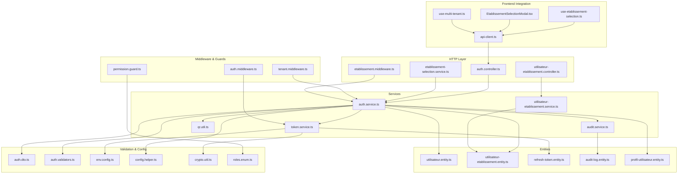

**Diagram sources**
- [auth.controller.ts:1-268](file://backend/src/modules/auth/controllers/auth.controller.ts#L1-L268)
- [utilisateur-etablissement.controller.ts:1-200](file://backend/src/modules/auth/controllers/utilisateur-etablissement.controller.ts#L1-L200)
- [etablissement-selection.service.ts:145-173](file://backend/src/modules/auth/services/etablissement-selection.service.ts#L145-L173)
- [etablissement.middleware.ts:1-120](file://backend/src/modules/auth/middlewares/etablissement.middleware.ts#L1-L120)
- [auth.service.ts:1-485](file://backend/src/modules/auth/services/auth.service.ts#L1-L485)
- [utilisateur-etablissement.service.ts:1-216](file://backend/src/modules/auth/services/utilisateur-etablissement.service.ts#L1-L216)
- [token.service.ts:1-181](file://backend/src/modules/auth/services/token.service.ts#L1-L181)
- [auth.middleware.ts:1-92](file://backend/src/modules/auth/middlewares/auth.middleware.ts#L1-L92)
- [tenant.middleware.ts:1-120](file://backend/src/common/middlewares/tenant.middleware.ts#L1-L120)
- [permission.guard.ts:1-118](file://backend/src/modules/auth/guards/permission.guard.ts#L1-L118)
- [audit.service.ts:1-197](file://backend/src/modules/auth/services/audit.service.ts#L1-L197)
- [utilisateur.entity.ts:1-143](file://backend/src/modules/auth/entities/utilisateur.entity.ts#L1-L143)
- [utilisateur-etablissement.entity.ts:1-200](file://backend/src/modules/auth/entities/utilisateur-etablissement.entity.ts#L1-L200)
- [refresh-token.entity.ts:1-72](file://backend/src/modules/auth/entities/refresh-token.entity.ts#L1-L72)
- [audit-log.entity.ts:1-139](file://backend/src/modules/auth/entities/audit-log.entity.ts#L1-L139)
- [auth.dto.ts:1-173](file://backend/src/modules/auth/dto/auth.dto.ts#L1-L173)
- [auth.validators.ts:1-40](file://shared/src/validators/auth.validators.ts#L1-L40)
- [env.config.ts:1-168](file://backend/src/config/env.config.ts#L1-L168)
- [config.helper.ts:1-131](file://backend/src/modules/configuration/utils/config.helper.ts#L1-L131)
- [crypto.util.ts:1-119](file://backend/src/common/utils/crypto.util.ts#L1-L119)
- [roles.enum.ts:1-187](file://shared/src/enums/roles.enum.ts#L1-L187)
- [profil-utilisateur.entity.ts:1-105](file://backend/src/modules/auth/entities/profil-utilisateur.entity.ts#L1-L105)
- [qr.util.ts:1-141](file://backend/src/common/utils/qr.util.ts#L1-L141)
- [api-client.ts:384-412](file://frontend/src/lib/api-client.ts#L384-L412)
- [use-etablissement-selection.ts:44-79](file://frontend/src/hooks/use-etablissement-selection.ts#L44-L79)
- [EtablissementSelectionModal.tsx:43-85](file://frontend/src/components/auth/EtablissementSelectionModal.tsx#L43-L85)
- [use-multi-tenant.ts:1-200](file://frontend/src/hooks/use-multi-tenant.ts#L1-L200)

**Section sources**
- [auth.controller.ts:1-268](file://backend/src/modules/auth/controllers/auth.controller.ts#L1-L268)
- [utilisateur-etablissement.controller.ts:1-200](file://backend/src/modules/auth/controllers/utilisateur-etablissement.controller.ts#L1-L200)
- [etablissement-selection.service.ts:145-173](file://backend/src/modules/auth/services/etablissement-selection.service.ts#L145-L173)
- [etablissement.middleware.ts:1-120](file://backend/src/modules/auth/middlewares/etablissement.middleware.ts#L1-L120)
- [auth.service.ts:1-485](file://backend/src/modules/auth/services/auth.service.ts#L1-L485)
- [utilisateur-etablissement.service.ts:1-216](file://backend/src/modules/auth/services/utilisateur-etablissement.service.ts#L1-L216)
- [token.service.ts:1-181](file://backend/src/modules/auth/services/token.service.ts#L1-L181)
- [auth.middleware.ts:1-92](file://backend/src/modules/auth/middlewares/auth.middleware.ts#L1-L92)
- [tenant.middleware.ts:1-120](file://backend/src/common/middlewares/tenant.middleware.ts#L1-L120)
- [permission.guard.ts:1-118](file://backend/src/modules/auth/guards/permission.guard.ts#L1-L118)
- [audit.service.ts:1-197](file://backend/src/modules/auth/services/audit.service.ts#L1-L197)
- [utilisateur.entity.ts:1-143](file://backend/src/modules/auth/entities/utilisateur.entity.ts#L1-L143)
- [utilisateur-etablissement.entity.ts:1-200](file://backend/src/modules/auth/entities/utilisateur-etablissement.entity.ts#L1-L200)
- [refresh-token.entity.ts:1-72](file://backend/src/modules/auth/entities/refresh-token.entity.ts#L1-L72)
- [audit-log.entity.ts:1-139](file://backend/src/modules/auth/entities/audit-log.entity.ts#L1-L139)
- [auth.dto.ts:1-173](file://backend/src/modules/auth/dto/auth.dto.ts#L1-L173)
- [auth.validators.ts:1-40](file://shared/src/validators/auth.validators.ts#L1-L40)
- [env.config.ts:1-168](file://backend/src/config/env.config.ts#L1-L168)
- [config.helper.ts:1-131](file://backend/src/modules/configuration/utils/config.helper.ts#L1-L131)
- [crypto.util.ts:1-119](file://backend/src/common/utils/crypto.util.ts#L1-L119)
- [roles.enum.ts:1-187](file://shared/src/enums/roles.enum.ts#L1-L187)
- [profil-utilisateur.entity.ts:1-105](file://backend/src/modules/auth/entities/profil-utilisateur.entity.ts#L1-L105)
- [qr.util.ts:1-141](file://backend/src/common/utils/qr.util.ts#L1-L141)
- [api-client.ts:384-412](file://frontend/src/lib/api-client.ts#L384-L412)
- [use-etablissement-selection.ts:44-79](file://frontend/src/hooks/use-etablissement-selection.ts#L44-L79)
- [EtablissementSelectionModal.tsx:43-85](file://frontend/src/components/auth/EtablissementSelectionModal.tsx#L43-L85)
- [use-multi-tenant.ts:1-200](file://frontend/src/hooks/use-multi-tenant.ts#L1-L200)

## Core Components
- Controller: Validates incoming payloads using Zod schemas and delegates to AuthService. It extracts IP and User-Agent for security tracking and audit. Now supports multi-mode authentication input validation and establishment selection endpoints.
- AuthService: Implements login, registration, token refresh, logout, forgot/reset/change password, and current user retrieval. Reads security parameters from configuration. Now includes multi-mode authentication with intelligent identifier detection and expanded user entity support.
- TokenService: Generates JWT access tokens and refresh tokens, validates and revokes refresh tokens, and cleans up expired tokens.
- Auth Middleware: Extracts Bearer token from Authorization header, verifies JWT, and attaches user identity to the request.
- Tenant Middleware: NEW - Handles multi-establishment switching and establishment validation for authenticated users, supporting establishment-specific role assignments and dynamic RBAC resolution.
- Etablissement Middleware: NEW - Specialized middleware for establishment switching validation and security controls, working in conjunction with tenant middleware.
- Permission Guard: Enforces role-based permissions after authentication.
- Audit Service: Logs security-relevant events (login attempts, password changes, access denials) and captures IP and User-Agent.
- Entities: User, Profile, RefreshToken, AuditLog, and the new UserEstablishment relationship define persistence and multi-establishment associations. Enhanced with pseudonym and QR code fields.
- DTOs: Strongly-typed request/response shapes validated by Zod, including new multi-mode authentication schemas.
- Environment & Config: Centralized JWT secrets, token durations, encryption keys, and security parameters.
- QR Utilities: NEW - Comprehensive QR code generation and processing utilities for authentication and card systems.
- Establishment Selection Service: NEW - Manages establishment selection flow with temporary tokens and establishment validation.

**Section sources**
- [auth.controller.ts:55-264](file://backend/src/modules/auth/controllers/auth.controller.ts#L55-L264)
- [auth.service.ts:61-481](file://backend/src/modules/auth/services/auth.service.ts#L61-L481)
- [token.service.ts:32-174](file://backend/src/modules/auth/services/token.service.ts#L32-L174)
- [auth.middleware.ts:30-60](file://backend/src/modules/auth/middlewares/auth.middleware.ts#L30-L60)
- [tenant.middleware.ts:20-120](file://backend/src/common/middlewares/tenant.middleware.ts#L20-L120)
- [etablissement.middleware.ts:1-120](file://backend/src/modules/auth/middlewares/etablissement.middleware.ts#L1-L120)
- [permission.guard.ts:44-87](file://backend/src/modules/auth/guards/permission.guard.ts#L44-L87)
- [audit.service.ts:47-192](file://backend/src/modules/auth/services/audit.service.ts#L47-L192)
- [utilisateur.entity.ts:52-140](file://backend/src/modules/auth/entities/utilisateur.entity.ts#L52-L140)
- [utilisateur-etablissement.entity.ts:1-200](file://backend/src/modules/auth/entities/utilisateur-etablissement.entity.ts#L1-L200)
- [refresh-token.entity.ts:24-69](file://backend/src/modules/auth/entities/refresh-token.entity.ts#L24-L69)
- [audit-log.entity.ts:87-136](file://backend/src/modules/auth/entities/audit-log.entity.ts#L87-L136)
- [auth.dto.ts:18-172](file://backend/src/modules/auth/dto/auth.dto.ts#L18-L172)
- [auth.validators.ts:20-40](file://shared/src/validators/auth.validators.ts#L20-L40)
- [env.config.ts:138-142](file://backend/src/config/env.config.ts#L138-L142)
- [config.helper.ts:24-54](file://backend/src/modules/configuration/utils/config.helper.ts#L24-L54)
- [crypto.util.ts:91-93](file://backend/src/common/utils/crypto.util.ts#L91-L93)
- [qr.util.ts:1-141](file://backend/src/common/utils/qr.util.ts#L1-L141)
- [etablissement-selection.service.ts:145-173](file://backend/src/modules/auth/services/etablissement-selection.service.ts#L145-L173)

## Architecture Overview
The authentication flow integrates HTTP validation, service orchestration, token management, middleware protection, and audit logging. Security parameters are configurable and enforced at runtime. The system now supports multi-mode authentication with intelligent identifier detection, QR code integration, and multi-establishment support with establishment-specific role assignments and dynamic RBAC resolution.

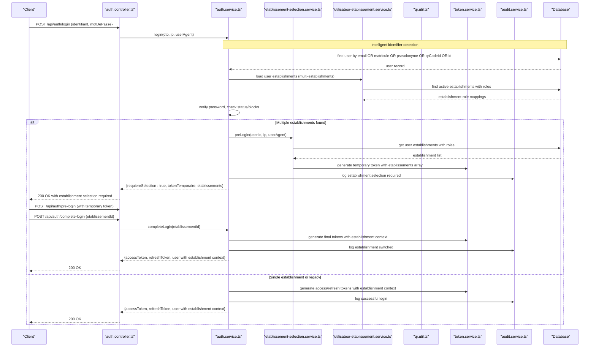

**Diagram sources**
- [auth.controller.ts:55-74](file://backend/src/modules/auth/controllers/auth.controller.ts#L55-L74)
- [auth.controller.ts:339-359](file://backend/src/modules/auth/controllers/auth.controller.ts#L339-L359)
- [auth.service.ts:61-161](file://backend/src/modules/auth/services/auth.service.ts#L61-L161)
- [etablissement-selection.service.ts:145-173](file://backend/src/modules/auth/services/etablissement-selection.service.ts#L145-L173)
- [utilisateur-etablissement.service.ts:184-216](file://backend/src/modules/auth/services/utilisateur-etablissement.service.ts#L184-L216)
- [token.service.ts:46-72](file://backend/src/modules/auth/services/token.service.ts#L46-L72)
- [audit.service.ts:67-77](file://backend/src/modules/auth/services/audit.service.ts#L67-L77)

## Enhanced Authentication Flow with Multi-Mode Capabilities

### Multi-Mode Authentication Identifier Detection
The system now supports five authentication modes through intelligent identifier detection:

1. **Email-based authentication**: Traditional email/password login
2. **Matriculation number authentication**: Student/employee ID-based login
3. **Pseudonym authentication**: Username-based login for privacy
4. **QR code authentication**: Scan-based login using QR code IDs
5. **ID-based authentication**: Direct UUID-based login

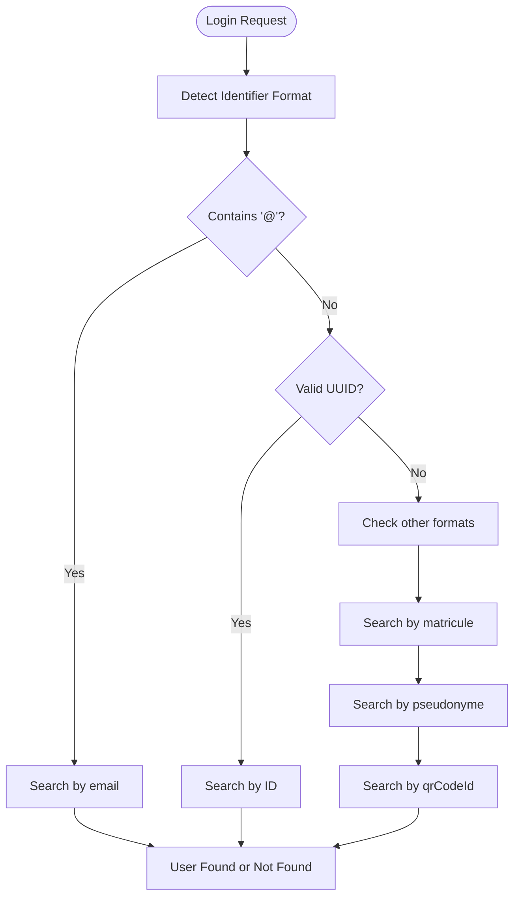

**Diagram sources**
- [auth.service.ts:85-118](file://backend/src/modules/auth/services/auth.service.ts#L85-L118)
- [auth.validators.ts:24-40](file://shared/src/validators/auth.validators.ts#L24-L40)

### Enhanced User Entity with Multi-Mode Fields
The user entity now includes expanded attributes to support multiple authentication modes:

```typescript
interface UserEntity {
  id: string;
  email: string;
  motDePasse: string;
  pseudonyme?: string;           // NEW: Unique pseudonym for authentication
  qrCodeId?: string;             // NEW: Unique QR code identifier
  matricule?: string;            // Student/employee ID
  nom: string;
  prenom: string;
  telephone?: string;
  dateNaissance?: Date;
  statut: UserStatus;
  tentativesEchec: number;
  bloque: boolean;
  derniereConnexion?: Date;
  createdAt: Date;
  updatedAt: Date;
}
```

### Multi-Mode JWT Payload Structure
The JWT payload now includes enhanced establishment information for multi-site support:

```typescript
{
  sub: string,                    // User ID
  email: string,                  // User email
  role: string,                   // Legacy single establishment role
  roles: string[],               // ALL roles resolved across establishments
  permissions: string[],         // ALL permissions resolved dynamically
  etablissementId?: string,      // Legacy (single establishment)
  roleDansEtablissement?: string, // NEW: Role specific to active establishment
  etablissements?: [             // NEW: Multi-establishment array
    {
      etablissementId: string,   // Establishment ID
      role: string,              // Role specific to this establishment
      etablissementPrincipal: boolean, // Primary establishment flag
      actif: boolean             // Active status
    }
  ],
  modeAuthentification: string,   // NEW: Authentication mode used (email/matricule/pseudonyme/qrCode/id)
  dernierAcces: Date              // NEW: Timestamp of last authentication
}
```

**Section sources**
- [auth.service.ts:85-118](file://backend/src/modules/auth/services/auth.service.ts#L85-L118)
- [auth.validators.ts:24-40](file://shared/src/validators/auth.validators.ts#L24-L40)
- [utilisateur.entity.ts:52-140](file://backend/src/modules/auth/entities/utilisateur.entity.ts#L52-L140)
- [auth.dto.ts:145-172](file://backend/src/modules/auth/dto/auth.dto.ts#L145-L172)

## Multi-Mode Authentication Implementation

### Login Schema Enhancement
The authentication schema now supports the new multi-mode approach:

```typescript
const loginSchema = z.object({
    // NEW: Main identifier field (v2.0)
    identifiant: z.string()
        .min(1, 'L\'identifiant est requis')
        .max(255, 'L\'identifiant ne peut pas dépasser 255 caractères'),

    // OLD: Email field (deprecated but supported for transition)
    email: z.string()
        .email('Adresse email invalide')
        .max(255, 'L\'email ne peut pas dépasser 255 caractères')
        .optional(),

    motDePasse: z.string()
        .min(LIMITS.PASSWORD_MIN_LENGTH, `Le mot de passe doit faire au moins ${LIMITS.PASSWORD_MIN_LENGTH} caractères`),

    seRappelerDeMoi: z.boolean().optional().default(false),
});
```

### Intelligent Identifier Detection Logic
The authentication service implements sophisticated logic for detecting and processing different identifier types:

1. **Email detection**: Identifies email addresses by '@' character presence
2. **UUID validation**: Validates universally unique identifiers
3. **Priority search order**: Searches by matricule, pseudonyme, qrCodeId, then ID
4. **Case-insensitive matching**: Ensures consistent user experience across formats

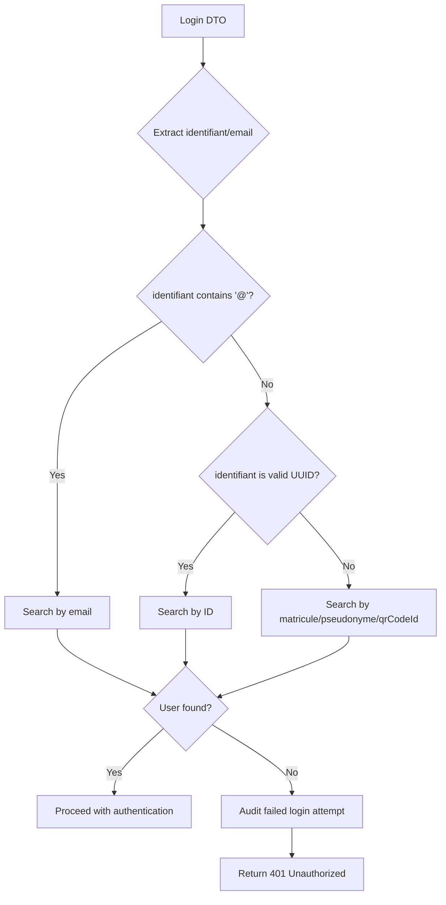

**Diagram sources**
- [auth.service.ts:85-118](file://backend/src/modules/auth/services/auth.service.ts#L85-L118)
- [auth.validators.ts:24-40](file://shared/src/validators/auth.validators.ts#L24-L40)

**Section sources**
- [auth.validators.ts:24-40](file://shared/src/validators/auth.validators.ts#L24-L40)
- [auth.service.ts:85-118](file://backend/src/modules/auth/services/auth.service.ts#L85-L118)

## QR Code Authentication System

### QR Code Generation and Storage
The system now supports QR code-based authentication through dedicated utilities:

```typescript
interface QRCodeOptions {
    width?: number;                // QR code width in pixels
    margin?: number;              // Margin around QR code
    errorCorrectionLevel?: 'L' | 'M' | 'Q' | 'H'; // Error correction level
    darkColor?: string;           // Dark color (foreground)
    lightColor?: string;          // Light color (background)
}

async function generateUserQRCode(
    userId: string,
    type: 'card' | 'access' | 'cantine' | 'transport' = 'card'
): Promise<string> {
    // Format: ELISA:{type}:{userId}:{timestamp}
    const timestamp = Date.now();
    const data = `ELISA:${type}:${userId}:${timestamp}`;
    
    return await generateQRCodeDataURL(data, {
        width: 300,
        margin: 2,
        errorCorrectionLevel: 'H', // High correction for physical cards
    });
}
```

### QR Code Authentication Flow
QR code authentication follows a streamlined process optimized for mobile devices:

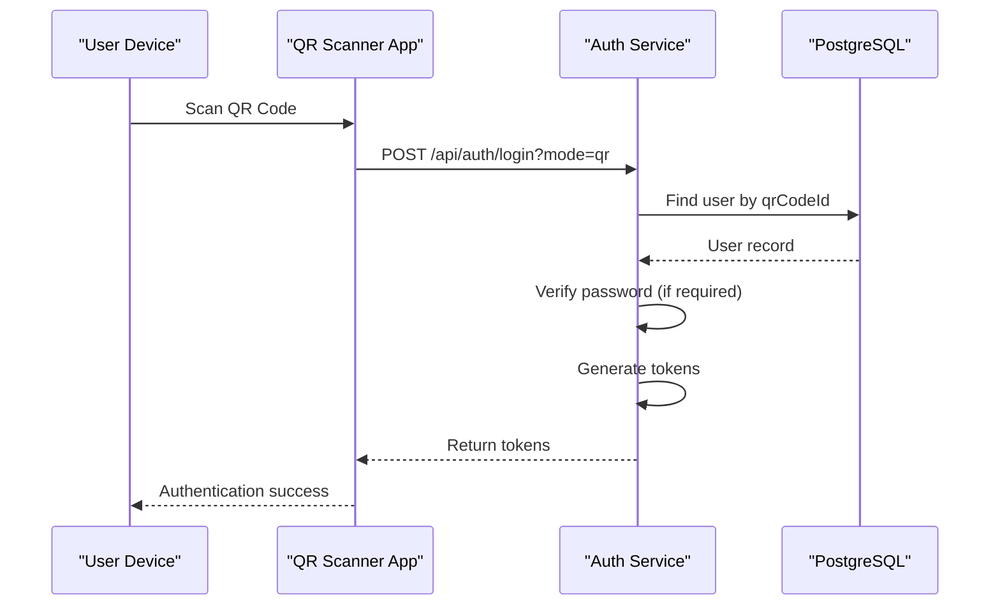

**Diagram sources**
- [qr.util.ts:121-141](file://backend/src/common/utils/qr.util.ts#L121-L141)
- [auth.service.ts:61-161](file://backend/src/modules/auth/services/auth.service.ts#L61-L161)

### QR Code Database Integration
The migration script adds necessary database columns and indexes for QR code support:

```sql
-- Add QR code support columns
ALTER TABLE utilisateurs 
ADD COLUMN IF NOT EXISTS pseudonyme VARCHAR(100) UNIQUE;

ALTER TABLE utilisateurs 
ADD COLUMN IF NOT EXISTS qrCodeId VARCHAR(100) UNIQUE;

-- Create indexes for performance
CREATE INDEX IF NOT EXISTS idx_utilisateurs_pseudonyme ON utilisateurs(pseudonyme);
CREATE INDEX IF NOT EXISTS idx_utilisateurs_qr_code ON utilisateurs(qrCodeId);
CREATE INDEX IF NOT EXISTS idx_utilisateurs_matricule ON utilisateurs(matricule);
```

**Section sources**
- [qr.util.ts:121-141](file://backend/src/common/utils/qr.util.ts#L121-L141)
- [027-auth-multi-mode.sql:1-26](file://backend/database/migrations/027-auth-multi-mode.sql#L1-L26)

## Enhanced User Entity and Attributes

### Expanded User Entity Schema
The user entity now includes comprehensive attributes supporting multi-mode authentication:

```typescript
@Entity('utilisateurs')
export class Utilisateur {
    @PrimaryGeneratedColumn('uuid')
    id: string;

    @Column({ type: 'varchar', length: 255, unique: true })
    email: string;

    @Column({ type: 'varchar', length: 255 })
    motDePasse: string;

    @Column({ type: 'varchar', length: 100, unique: true, nullable: true })
    pseudonyme: string;           // NEW: Unique pseudonym for authentication

    @Column({ type: 'varchar', length: 100, unique: true, nullable: true })
    qrCodeId: string;             // NEW: Unique QR code identifier

    @Column({ type: 'varchar', length: 50, unique: true, nullable: true })
    matricule: string;            // Student/employee ID

    @Column({ type: 'varchar', length: 100 })
    nom: string;

    @Column({ type: 'varchar', length: 100 })
    prenom: string;

    @Column({ type: 'varchar', length: 20, nullable: true })
    telephone: string;

    @Column({ type: 'date', nullable: true })
    dateNaissance: Date;

    @Column({ type: 'enum', enum: UserStatus, default: UserStatus.ACTIF })
    statut: UserStatus;

    @Column({ type: 'integer', default: 0 })
    tentativesEchec: number;

    @Column({ type: 'boolean', default: false })
    bloque: boolean;

    @Column({ type: 'timestamp', nullable: true })
    derniereConnexion: Date;

    @CreateDateColumn()
    createdAt: Date;

    @UpdateDateColumn()
    updatedAt: Date;
}
```

### Authentication Mode Tracking
The system tracks which authentication mode was used for security auditing:

```typescript
interface LoginAuditEvent {
    userId: string;
    modeAuthentification: 'email' | 'matricule' | 'pseudonyme' | 'qrCode' | 'id';
    adresseIp: string;
    userAgent: string;
    resultat: 'succes' | 'echec';
    details: string;
    timestamp: Date;
}
```

**Section sources**
- [utilisateur.entity.ts:52-140](file://backend/src/modules/auth/entities/utilisateur.entity.ts#L52-L140)
- [027-auth-multi-mode.sql:8-26](file://backend/database/migrations/027-auth-multi-mode.sql#L8-L26)

## Establishment Selection Flow

### Pre-Login Endpoint
The establishment selection flow begins with the pre-login endpoint that determines whether establishment selection is required:

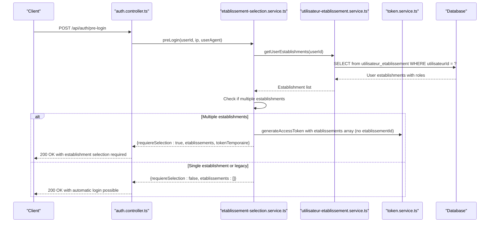

**Diagram sources**
- [auth.controller.ts:339-359](file://backend/src/modules/auth/controllers/auth.controller.ts#L339-L359)
- [etablissement-selection.service.ts:145-173](file://backend/src/modules/auth/services/etablissement-selection.service.ts#L145-L173)
- [utilisateur-etablissement.service.ts:184-216](file://backend/src/modules/auth/services/utilisateur-etablissement.service.ts#L184-L216)

### Establishment Selection Modal
The frontend provides a modal interface for establishment selection with automatic detection of the primary establishment:

```typescript
// Frontend establishment selection modal
export function EtablissementSelectionModal({
    open,
    etablissements,
    onSelect,
    tokenTemporaire,
    expiresIn,
}: EtablissementSelectionModalProps) {
    const [selectedId, setSelectedId] = useState<string | null>(null);
    const [isLoading, setIsLoading] = useState(false);
    const [countdown, setCountdown] = useState<number | null>(null);

    // Auto-select primary establishment if available
    useEffect(() => {
        if (open && etablissements.length > 0 && !selectedId) {
            const principal = etablissements.find((e) => e.etablissementPrincipal);
            if (principal) {
                setSelectedId(principal.id);
            } else {
                setSelectedId(etablissements[0].id);
            }
        }
    }, [open, etablissements]);

    const handleConfirm = async () => {
        if (!selectedId || isLoading) return;
        
        // Complete login with selected establishment
        const response = await apiClient.completeLogin(selectedId);
        // Handle successful establishment selection
    };
}
```

**Section sources**
- [etablissement-selection.service.ts:145-173](file://backend/src/modules/auth/services/etablissement-selection.service.ts#L145-L173)
- [EtablissementSelectionModal.tsx:43-85](file://frontend/src/components/auth/EtablissementSelectionModal.tsx#L43-L85)
- [api-client.ts:384-412](file://frontend/src/lib/api-client.ts#L384-L412)

## Comprehensive Establishment Switching

### Complete Login Process
After establishment selection, the complete-login endpoint finalizes the authentication process:

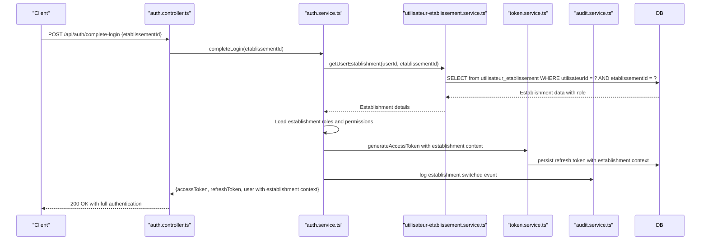

**Diagram sources**
- [auth.controller.ts:314-330](file://backend/src/modules/auth/controllers/auth.controller.ts#L314-L330)
- [auth.service.ts:420-481](file://backend/src/modules/auth/services/auth.service.ts#L420-L481)
- [utilisateur-etablissement.service.ts:184-216](file://backend/src/modules/auth/services/utilisateur-etablissement.service.ts#L184-L216)

### Establishment Switching Capabilities
The system supports dynamic establishment switching during an active session with enhanced security validation:

```typescript
// Frontend establishment switching hook
const switchEtablissement = useCallback(async (etablissementId: string) => {
    setIsLoading(true);
    try {
        const response = await apiClient.completeLogin(etablissementId);
        setTokens(response.accessToken, response.refreshToken);
        if (response.utilisateur?.etablissements) {
            setEtablissements(response.utilisateur.etablissements);
        }
        toast.success('Établissement changé avec succès');
    } catch (error) {
        console.error('[switchEtablissement] Error:', error);
    } finally {
        setIsLoading(false);
    }
}, []);
```

### Enhanced Establishment Switching Security
The system now includes comprehensive security validation for establishment switching:

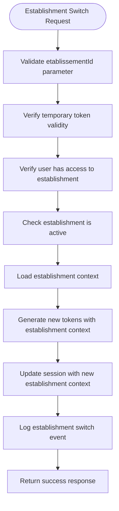

**Diagram sources**
- [etablissement.middleware.ts:1-120](file://backend/src/modules/auth/middlewares/etablissement.middleware.ts#L1-L120)
- [auth.controller.ts:314-330](file://backend/src/modules/auth/controllers/auth.controller.ts#L314-L330)

**Section sources**
- [auth.controller.ts:314-330](file://backend/src/modules/auth/controllers/auth.controller.ts#L314-L330)
- [use-etablissement-selection.ts:44-79](file://frontend/src/hooks/use-etablissement-selection.ts#L44-L79)
- [api-client.ts:384-412](file://frontend/src/lib/api-client.ts#L384-L412)
- [etablissement.middleware.ts:1-120](file://backend/src/modules/auth/middlewares/etablissement.middleware.ts#L1-L120)

## Enhanced JWT Structure with Establishment Arrays

### Temporary Token Structure
When multiple establishments are detected, the system generates a temporary token without establishment context:

```typescript
const payloadTemporaire: JwtPayload = {
    sub: utilisateur.id,
    email: utilisateur.email,
    role: utilisateur.role,
    roles: userRoles.map(r => r.code),
    permissions: Array.from(resolvedPermissions),
    etablissementId: undefined, // ← Token incomplet - sélection requise
    etablissements: utilisateurEtablissements.map(ue => ({
        etablissementId: ue.etablissementId,
        role: ue.role,
        etablissementPrincipal: ue.etablissementPrincipal,
        actif: ue.actif
    })),
};
```

### Final Token Structure
After establishment selection, the final token includes establishment context:

```typescript
const payloadFinal: JwtPayload = {
    sub: utilisateur.id,
    email: utilisateur.email,
    role: establishmentData.role,
    roles: userRoles.map(r => r.code),
    permissions: Array.from(resolvedPermissions),
    etablissementId: selectedEtablissementId,
    roleDansEtablissement: affectation.role, // NEW: Establishment-specific role
    etablissements: etablissementsPayload,
};
```

### Establishment Array Payload
The etablissements array provides comprehensive establishment information:

```typescript
interface JwtEtablissement {
    etablissementId: string;
    role: string;
    etablissementPrincipal: boolean;
    actif: boolean;
}

interface JwtPayload {
    sub: string;
    email: string;
    role: string;
    roles: string[];
    permissions: string[];
    etablissementId?: string;
    roleDansEtablissement?: string;
    etablissements?: JwtEtablissement[];
    modeAuthentification?: string;
    dernierAcces?: Date;
}
```

**Section sources**
- [etablissement-selection.service.ts:145-173](file://backend/src/modules/auth/services/etablissement-selection.service.ts#L145-L173)
- [auth.dto.ts:145-172](file://backend/src/modules/auth/dto/auth.dto.ts#L145-L172)

## Security Considerations for Multi-Mode Authentication

### Multi-Mode Attack Vector Mitigation
The system implements several security measures to prevent abuse of multiple authentication modes:

1. **Rate limiting per authentication mode**: Separate rate limits for each identifier type
2. **IP-based throttling**: Prevents brute force attacks across all modes
3. **User agent correlation**: Tracks suspicious patterns across different modes
4. **Enhanced audit logging**: Detailed tracking of all authentication attempts
5. **Account lockout policies**: Unified lockout regardless of authentication mode used
6. **Establishment validation**: Strict validation of establishment access rights
7. **Temporary token expiration**: Short-lived tokens for establishment selection
8. **Etablissement middleware validation**: NEW - Dedicated middleware for establishment switching security
9. **Cross-establishment access prevention**: Prevents unauthorized establishment switching attempts

### Performance Optimization Strategies
- **Conditional querying**: Only executes relevant search conditions based on identifier format
- **Database indexing**: Optimized indexes on all searchable fields
- **Query optimization**: Uses efficient WHERE conditions array for OR logic
- **Caching strategies**: Potential caching for frequently accessed user data
- **Establishment loading optimization**: Consider caching establishment-role mappings for frequently accessed users
- **Multi-establishment RBAC resolution**: Implement caching for resolved permissions to reduce database queries
- **Etablissement middleware caching**: Cache establishment access validation results

### Backward Compatibility Measures
- **Dual field support**: Both new `identifiant` and old `email` fields supported
- **Gradual migration**: Users can continue using familiar email-based login
- **Configuration flags**: Optional enabling/disabling of new authentication modes
- **Fallback mechanisms**: Automatic fallback to traditional authentication if needed
- **Legacy establishment support**: Continues to support single-establishment users

**Section sources**
- [auth.service.ts:85-118](file://backend/src/modules/auth/services/auth.service.ts#L85-L118)
- [auth.validators.ts:24-40](file://shared/src/validators/auth.validators.ts#L24-L40)
- [audit.service.ts:47-192](file://backend/src/modules/auth/services/audit.service.ts#L47-L192)
- [etablissement.middleware.ts:1-120](file://backend/src/modules/auth/middlewares/etablissement.middleware.ts#L1-L120)

## Detailed Component Analysis

### Enhanced Login Flow with Multi-Mode Authentication
- Input validation: Zod schema ensures proper identifier format and password requirements.
- Intelligent identifier detection: Automatically determines authentication mode based on input format.
- Multi-criteria user lookup: Searches by email, matricule, pseudonyme, qrCodeId, or ID depending on detected format.
- User lookup: Case-normalized email lookup; strict selection of credentials and status fields.
- Establishment loading: NEW - Loads all active establishments with their specific roles for the user.
- Account checks: Blocked accounts (temporary lockout), suspended, and inactive statuses are rejected.
- Password verification: Uses bcrypt comparison; increments failed attempts and applies lockout policy based on configuration.
- Multi-RBAC resolution: NEW - Dynamically resolves all roles and permissions across all establishments.
- Establishment selection decision: NEW - Determines if establishment selection is required based on establishment count.
- Successful login: Resets failure counter, updates last login, loads profile, generates enhanced JWT with establishment array, logs successful event with authentication mode.
- Session duration: Derived from configuration (minutes to seconds) and returned to client.

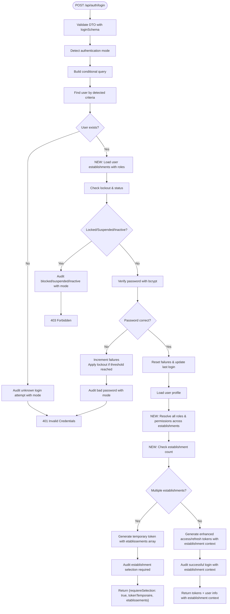

**Diagram sources**
- [auth.controller.ts:55-74](file://backend/src/modules/auth/controllers/auth.controller.ts#L55-L74)
- [auth.service.ts:69-118](file://backend/src/modules/auth/services/auth.service.ts#L69-L118)
- [etablissement-selection.service.ts:145-173](file://backend/src/modules/auth/services/etablissement-selection.service.ts#L145-L173)
- [utilisateur-etablissement.service.ts:184-216](file://backend/src/modules/auth/services/utilisateur-etablissement.service.ts#L184-L216)
- [utilisateur.entity.ts:120-130](file://backend/src/modules/auth/entities/utilisateur.entity.ts#L120-L130)
- [audit.service.ts:67-77](file://backend/src/modules/auth/services/audit.service.ts#L67-L77)

**Section sources**
- [auth.controller.ts:55-74](file://backend/src/modules/auth/controllers/auth.controller.ts#L55-L74)
- [auth.service.ts:69-118](file://backend/src/modules/auth/services/auth.service.ts#L69-L118)
- [etablissement-selection.service.ts:145-173](file://backend/src/modules/auth/services/etablissement-selection.service.ts#L145-L173)
- [utilisateur-etablissement.service.ts:184-216](file://backend/src/modules/auth/services/utilisateur-etablissement.service.ts#L184-L216)
- [utilisateur.entity.ts:120-130](file://backend/src/modules/auth/entities/utilisateur.entity.ts#L120-L130)
- [audit.service.ts:67-77](file://backend/src/modules/auth/services/audit.service.ts#L67-L77)

### Establishment Management Services
The system now includes dedicated services for managing establishment-user relationships:

- **UserEstablishmentService**: Manages establishment assignments, role updates, and principal establishment selection
- **UserEstablishmentController**: Provides endpoints for establishment management operations
- **UtilisateurEtablissement Entity**: New N:N relationship table with establishment-specific roles and active status tracking
- **EstablishmentSelectionService**: NEW - Manages establishment selection flow with temporary tokens and establishment validation
- **EtablissementMiddleware**: NEW - Specialized middleware for establishment switching security validation

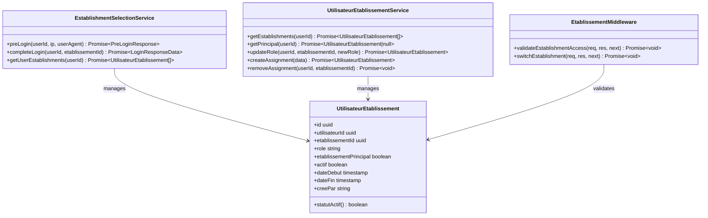

**Diagram sources**
- [etablissement-selection.service.ts:145-173](file://backend/src/modules/auth/services/etablissement-selection.service.ts#L145-L173)
- [utilisateur-etablissement.service.ts:184-216](file://backend/src/modules/auth/services/utilisateur-etablissement.service.ts#L184-L216)
- [utilisateur-etablissement.entity.ts:1-200](file://backend/src/modules/auth/entities/utilisateur-etablissement.entity.ts#L1-L200)
- [etablissement.middleware.ts:1-120](file://backend/src/modules/auth/middlewares/etablissement.middleware.ts#L1-L120)

**Section sources**
- [etablissement-selection.service.ts:145-173](file://backend/src/modules/auth/services/etablissement-selection.service.ts#L145-L173)
- [utilisateur-etablissement.service.ts:184-216](file://backend/src/modules/auth/services/utilisateur-etablissement.service.ts#L184-L216)
- [utilisateur-etablissement.entity.ts:1-200](file://backend/src/modules/auth/entities/utilisateur-etablissement.entity.ts#L1-L200)
- [etablissement.middleware.ts:1-120](file://backend/src/modules/auth/middlewares/etablissement.middleware.ts#L1-L120)

### Token Management and Enhanced Session Establishment
- Access token:
  - Generated by TokenService with enhanced payload including etablissements array and resolved permissions.
  - Temporary tokens: No etablissementId, only etablissements array for establishment selection.
  - Final tokens: Full establishment context with establishment-specific role.
- Refresh token:
  - Generated with random 64-byte hex token, stored with IP and User-Agent, and 30-day expiry.
  - Used to obtain new access tokens without re-authentication.
- Enhanced payload structure:
  - Includes legacy etablissementId for backward compatibility
  - NEW: etablissements array with establishment-specific role assignments
  - Dynamic roles and permissions arrays resolved from RBAC system
  - NEW: modeAuthentification field tracking the authentication method used
- Token validation and revocation:
  - Validate refresh token presence and validity; revoke upon refresh or logout.
  - Cleanup expired/revoke tokens periodically.
- Session establishment:
  - Client receives access token with establishment context for protected routes; refresh token enables seamless renewal.

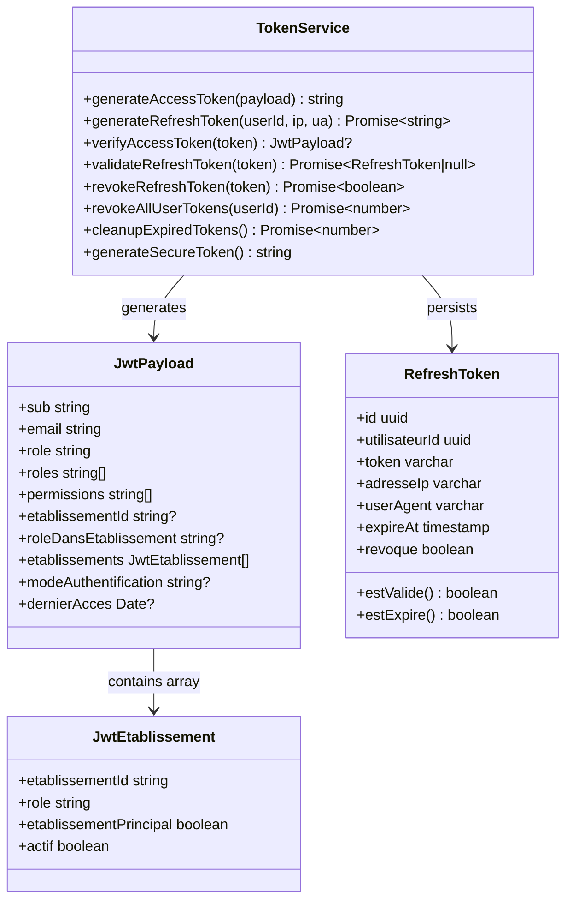

**Diagram sources**
- [token.service.ts:32-174](file://backend/src/modules/auth/services/token.service.ts#L32-L174)
- [auth.dto.ts:145-172](file://backend/src/modules/auth/dto/auth.dto.ts#L145-L172)
- [refresh-token.entity.ts:24-69](file://backend/src/modules/auth/entities/refresh-token.entity.ts#L24-L69)

**Section sources**
- [token.service.ts:32-174](file://backend/src/modules/auth/services/token.service.ts#L32-L174)
- [auth.dto.ts:145-172](file://backend/src/modules/auth/dto/auth.dto.ts#L145-L172)
- [refresh-token.entity.ts:24-69](file://backend/src/modules/auth/entities/refresh-token.entity.ts#L24-L69)

### Security Monitoring: Enhanced IP Tracking, User Agent Detection, and Multi-Mode Context
- IP tracking:
  - Controller passes request IP to AuthService for login/refresh.
  - TokenService stores IP with refresh tokens.
  - AuditService captures IP and User-Agent for logged events.
- User agent detection:
  - Controller passes User-Agent to AuthService and TokenService.
  - Stored with refresh tokens and captured in audit logs.
- Establishment context tracking:
  - NEW: Token payload includes establishment context for audit trail.
  - Tenant middleware logs establishment switching events.
  - Multi-establishment access attempts are monitored separately.
  - Temporary token tracking for establishment selection flow.
  - Etablissement middleware validates establishment switching security.
- Authentication mode tracking:
  - NEW: Audit logs capture which authentication mode was used.
  - Enhanced security monitoring for suspicious multi-mode patterns.
  - Establishment selection pattern monitoring.

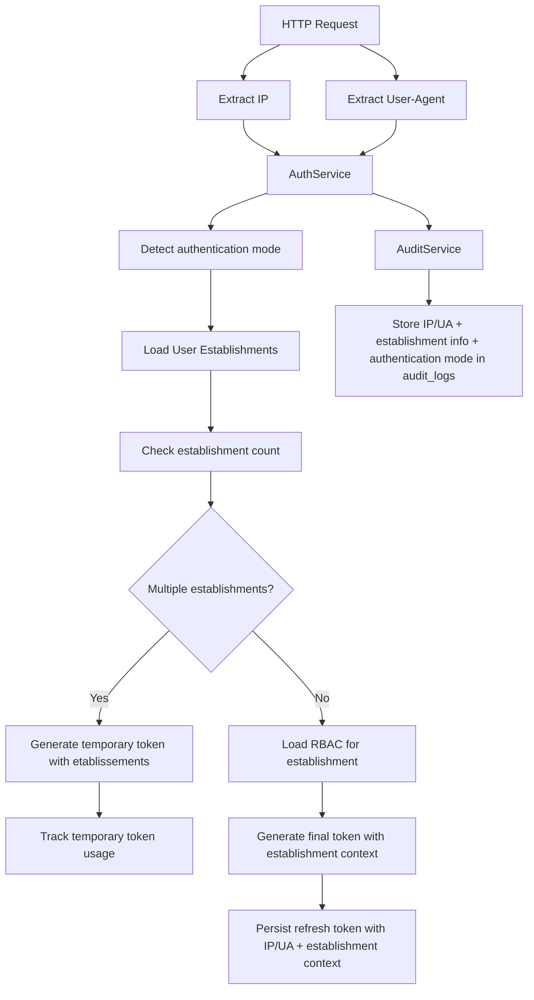

**Diagram sources**
- [auth.controller.ts:61-62](file://backend/src/modules/auth/controllers/auth.controller.ts#L61-L62)
- [token.service.ts:46-72](file://backend/src/modules/auth/services/token.service.ts#L46-L72)
- [audit.service.ts:47-62](file://backend/src/modules/auth/services/audit.service.ts#L47-L62)
- [audit-log.entity.ts:119-123](file://backend/src/modules/auth/entities/audit-log.entity.ts#L119-L123)

**Section sources**
- [auth.controller.ts:61-62](file://backend/src/modules/auth/controllers/auth.controller.ts#L61-L62)
- [token.service.ts:46-72](file://backend/src/modules/auth/services/token.service.ts#L46-L72)
- [audit.service.ts:47-62](file://backend/src/modules/auth/services/audit.service.ts#L47-L62)
- [audit-log.entity.ts:119-123](file://backend/src/modules/auth/entities/audit-log.entity.ts#L119-L123)

### Route Protection and Enhanced Permissions
- Auth middleware:
  - Extracts Bearer token, verifies JWT, and attaches user identity to the request.
- Tenant middleware:
  - NEW: Validates establishment access based on JWT establishment array.
  - Supports establishment switching via query parameters.
  - Enforces establishment-specific role permissions.
  - Handles both temporary tokens (no etablissementId) and final tokens (with establishment context).
- Etablissement middleware:
  - NEW: Dedicated middleware for establishment switching validation and security controls.
  - Validates establishment access rights and prevents unauthorized switching.
  - Integrates with tenant middleware for comprehensive establishment security.
- Optional auth middleware:
  - Attempts verification but does not fail if absent.
- Enhanced permission guard:
  - NEW: Resolves permissions dynamically from established establishment context.
  - Supports multi-establishment role hierarchies.
  - Super admin bypass with establishment-aware validation.
  - Handles establishment validation for both pre-login and complete-login flows.

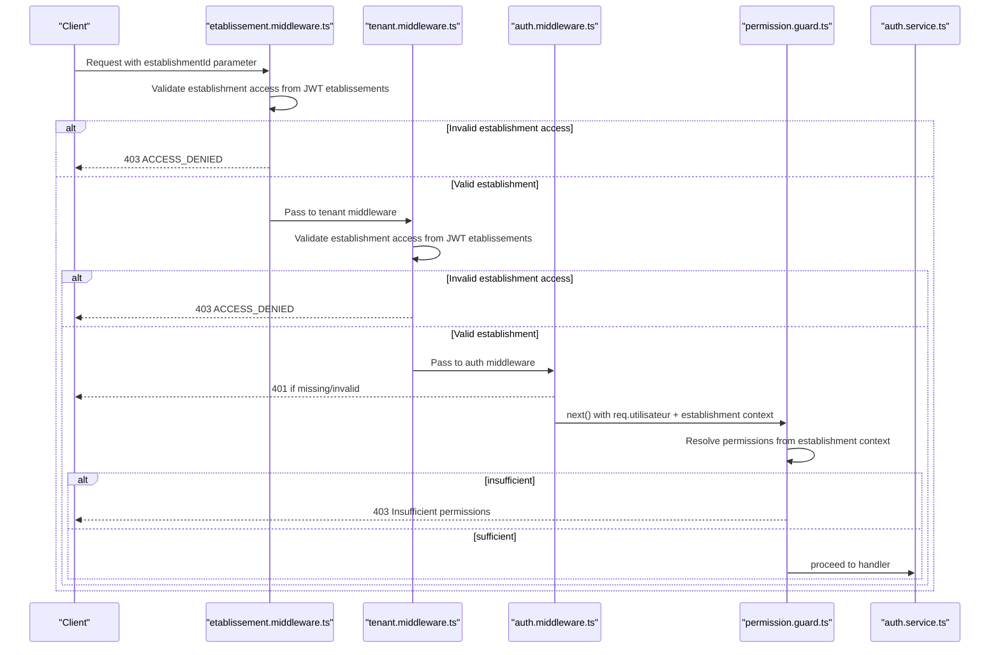

**Diagram sources**
- [etablissement.middleware.ts:1-120](file://backend/src/modules/auth/middlewares/etablissement.middleware.ts#L1-L120)
- [tenant.middleware.ts:59-88](file://backend/src/common/middlewares/tenant.middleware.ts#L59-L88)
- [auth.middleware.ts:30-60](file://backend/src/modules/auth/middlewares/auth.middleware.ts#L30-L60)
- [permission.guard.ts:44-87](file://backend/src/modules/auth/guards/permission.guard.ts#L44-L87)

**Section sources**
- [etablissement.middleware.ts:1-120](file://backend/src/modules/auth/middlewares/etablissement.middleware.ts#L1-L120)
- [tenant.middleware.ts:59-88](file://backend/src/common/middlewares/tenant.middleware.ts#L59-L88)
- [auth.middleware.ts:30-60](file://backend/src/modules/auth/middlewares/auth.middleware.ts#L30-L60)
- [permission.guard.ts:44-87](file://backend/src/modules/auth/guards/permission.guard.ts#L44-L87)

## Dependency Analysis
- Controller depends on AuthService and Zod DTOs.
- AuthService depends on TokenService, AuditService, configuration helpers, and entities.
- NEW: AuthService now depends on UserEstablishmentService for multi-establishment support and QR utilities for QR code authentication.
- NEW: AuthService depends on EstablishmentSelectionService for establishment selection flow management.
- NEW: EtablissementMiddleware depends on AuthService and JWT payload structure for establishment validation.
- TokenService depends on environment configuration and refresh token entity.
- Auth Middleware depends on TokenService.
- Tenant Middleware depends on AuthService and JWT payload structure.
- Permission Guard depends on enhanced role/permission resolution.
- AuditService depends on audit log entity and request metadata extraction.
- Entities define relationships and constraints for persistence, including new establishment-user relationships and multi-mode authentication fields.
- QR Utilities provide standalone QR code generation capabilities independent of authentication flow.
- NEW: Frontend integration modules for establishment selection and multi-tenant management.

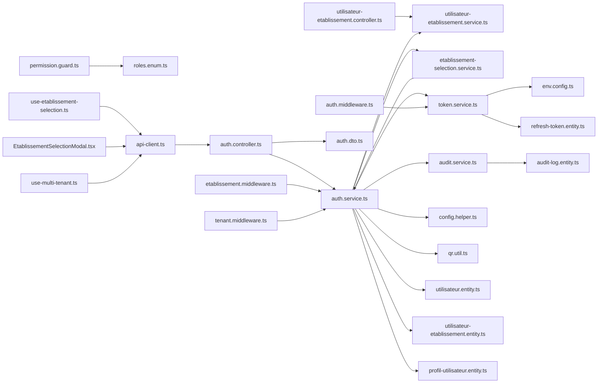

**Diagram sources**
- [auth.controller.ts:10-19](file://backend/src/modules/auth/controllers/auth.controller.ts#L10-L19)
- [utilisateur-etablissement.controller.ts:1-200](file://backend/src/modules/auth/controllers/utilisateur-etablissement.controller.ts#L1-L200)
- [etablissement-selection.service.ts:145-173](file://backend/src/modules/auth/services/etablissement-selection.service.ts#L145-L173)
- [etablissement.middleware.ts:1-120](file://backend/src/modules/auth/middlewares/etablissement.middleware.ts#L1-L120)
- [auth.service.ts:13-29](file://backend/src/modules/auth/services/auth.service.ts#L13-L29)
- [utilisateur-etablissement.service.ts:1-216](file://backend/src/modules/auth/services/utilisateur-etablissement.service.ts#L1-L216)
- [token.service.ts:9-16](file://backend/src/modules/auth/services/token.service.ts#L9-L16)
- [auth.middleware.ts:9-24](file://backend/src/modules/auth/middlewares/auth.middleware.ts#L9-L24)
- [tenant.middleware.ts:1-120](file://backend/src/common/middlewares/tenant.middleware.ts#L1-L120)
- [permission.guard.ts:11-14](file://backend/src/modules/auth/guards/permission.guard.ts#L11-L14)
- [audit.service.ts:11-15](file://backend/src/modules/auth/services/audit.service.ts#L11-L15)
- [env.config.ts:9-16](file://backend/src/config/env.config.ts#L9-L16)
- [config.helper.ts:12-13](file://backend/src/modules/configuration/utils/config.helper.ts#L12-L13)

**Section sources**
- [auth.controller.ts:10-19](file://backend/src/modules/auth/controllers/auth.controller.ts#L10-L19)
- [utilisateur-etablissement.controller.ts:1-200](file://backend/src/modules/auth/controllers/utilisateur-etablissement.controller.ts#L1-L200)
- [etablissement-selection.service.ts:145-173](file://backend/src/modules/auth/services/etablissement-selection.service.ts#L145-L173)
- [etablissement.middleware.ts:1-120](file://backend/src/modules/auth/middlewares/etablissement.middleware.ts#L1-L120)
- [auth.service.ts:13-29](file://backend/src/modules/auth/services/auth.service.ts#L13-L29)
- [utilisateur-etablissement.service.ts:1-216](file://backend/src/modules/auth/services/utilisateur-etablissement.service.ts#L1-L216)
- [token.service.ts:9-16](file://backend/src/modules/auth/services/token.service.ts#L9-L16)
- [auth.middleware.ts:9-24](file://backend/src/modules/auth/middlewares/auth.middleware.ts#L9-L24)
- [tenant.middleware.ts:1-120](file://backend/src/common/middlewares/tenant.middleware.ts#L1-L120)
- [permission.guard.ts:11-14](file://backend/src/modules/auth/guards/permission.guard.ts#L11-L14)
- [audit.service.ts:11-15](file://backend/src/modules/auth/services/audit.service.ts#L11-L15)
- [env.config.ts:9-16](file://backend/src/config/env.config.ts#L9-L16)
- [config.helper.ts:12-13](file://backend/src/modules/configuration/utils/config.helper.ts#L12-L13)

## Performance Considerations
- Password hashing: bcrypt cost is managed automatically; avoid excessive customization to prevent CPU spikes.
- Token storage: Refresh tokens are indexed on token and user; ensure database performance tuning for high concurrency.
- Audit logging: Structured logging with minimal sensitive data exposure; consider batching or asynchronous writes for high throughput.
- Configuration caching: Quick cache reduces repeated reads for security parameters; tune TTL appropriately.
- NEW: Establishment loading optimization: Consider caching establishment-role mappings for frequently accessed users.
- Multi-establishment RBAC resolution: Implement caching for resolved permissions to reduce database queries on subsequent requests.
- NEW: Multi-mode query optimization: Conditional queries based on identifier format prevent unnecessary database scans.
- NEW: Database indexing strategy: Optimized indexes on email, matricule, pseudonyme, and qrCodeId fields.
- QR code processing: Asynchronous QR code generation prevents blocking during authentication flow.
- NEW: Establishment selection caching: Cache establishment lists for users with multiple establishments.
- NEW: Temporary token validation: Efficient validation of temporary tokens for establishment selection flow.
- NEW: Etablissement middleware caching: Cache establishment access validation results for improved performance.

## Troubleshooting Guide
Common error scenarios and resolutions:
- Invalid credentials during login:
  - Cause: Incorrect email or password; exceeded max attempts leading to lockout.
  - Resolution: Verify credentials; wait for lockout window; check configuration for max attempts and lockout duration.
- Account locked/suspended/inactive:
  - Cause: Temporary lockout or administrative status changes.
  - Resolution: Contact administrator; ensure account is activated.
- Invalid or expired reset token:
  - Cause: Token mismatch or expiration beyond 1 hour.
  - Resolution: Trigger a new forgot password request.
- Password too short or weak:
  - Cause: Violates configured minimum length or complexity rules.
  - Resolution: Enforce minimum length and character requirements.
- Missing or invalid bearer token:
  - Cause: Missing Authorization header or invalid/expired JWT.
  - Resolution: Obtain a new access token using a valid refresh token or re-authenticate.
- Insufficient permissions:
  - Cause: Role lacks required permissions.
  - Resolution: Assign appropriate role or permissions; super admin bypass is available.
- NEW: Multi-mode authentication issues:
  - Cause: Invalid identifier format or non-existent user in chosen authentication mode.
  - Resolution: Verify identifier format; ensure user exists in the chosen authentication mode; check database indexes.
- NEW: QR code authentication failures:
  - Cause: Invalid QR code format or missing qrCodeId in user record.
  - Resolution: Regenerate QR code; ensure user has qrCodeId assigned; verify QR code scanning app compatibility.
- NEW: Authentication mode detection errors:
  - Cause: Ambiguous identifier format causing incorrect mode detection.
  - Resolution: Use explicit authentication mode parameters; ensure proper identifier formatting.
- NEW: Establishment selection flow issues:
  - Cause: Temporary token expired or establishment not found in user's establishment list.
  - Resolution: Trigger new pre-login; ensure establishment exists in user's assignments; verify establishment status.
- NEW: Establishment switching errors:
  - Cause: User doesn't have access to requested establishment or establishment not active.
  - Resolution: Verify establishment assignment; check establishment status; use valid establishment ID.
- NEW: Multi-establishment switching issues:
  - Cause: Invalid establishment ID in query parameter or establishment not active.
  - Resolution: Ensure establishment ID exists in user's establishment array; verify establishment is active.
- NEW: Tenant middleware validation errors:
  - Cause: Missing establishment context or invalid establishment access.
  - Resolution: Ensure proper establishment selection; verify establishment is active and user has access.
- NEW: Etablissement middleware validation errors:
  - Cause: Establishment switching attempt without proper validation.
  - Resolution: Ensure establishment switching request passes etablissement middleware validation; verify establishment access rights.

**Section sources**
- [auth.service.ts:74-113](file://backend/src/modules/auth/services/auth.service.ts#L74-L113)
- [auth.service.ts:358-364](file://backend/src/modules/auth/services/auth.service.ts#L358-L364)
- [auth.service.ts:390-411](file://backend/src/modules/auth/services/auth.service.ts#L390-L411)
- [auth.middleware.ts:35-46](file://backend/src/modules/auth/middlewares/auth.middleware.ts#L35-L46)
- [permission.guard.ts:57-81](file://backend/src/modules/auth/guards/permission.guard.ts#L57-L81)
- [tenant.middleware.ts:71-77](file://backend/src/common/middlewares/tenant.middleware.ts#L71-L77)
- [etablissement.middleware.ts:1-120](file://backend/src/modules/auth/middlewares/etablissement.middleware.ts#L1-L120)

## Conclusion
eLISAschool's enhanced authentication system provides robust multi-mode authentication capabilities with intelligent identifier detection, supporting traditional email/password login, pseudonym-based authentication, matriculation number verification, and QR code scanning. The system maintains backward compatibility while offering enhanced flexibility and security through multiple authentication pathways. The system now supports complex multi-establishment scenarios with establishment-specific role assignments and dynamic RBAC resolution. It leverages enhanced JWT tokens containing establishment arrays, refresh tokens with IP/User-Agent tracking, centralized security configuration, and comprehensive audit logging. The new establishment selection flow provides seamless multi-establishment login with temporary tokens and establishment validation. The tenant middleware enables comprehensive establishment switching while maintaining security boundaries. The addition of QR code utilities and expanded user entity attributes provides comprehensive support for modern authentication requirements. The establishment selection modal and frontend integration hooks provide intuitive user experience for multi-establishment environments. The new etablissement middleware provides specialized security validation for establishment switching operations. While device fingerprinting is not implemented, IP and user agent capture enable strong security monitoring. The modular design and middleware/guard patterns support scalable and maintainable access control across multiple establishments and authentication modes.