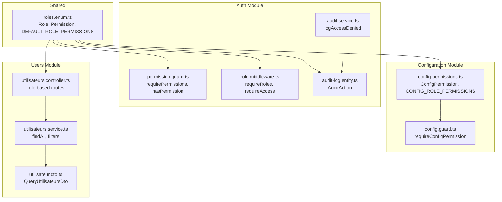
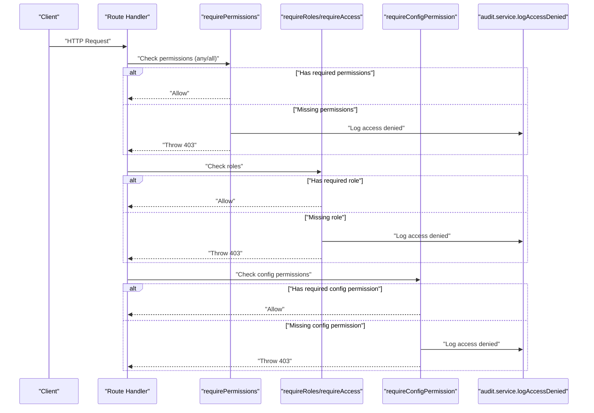
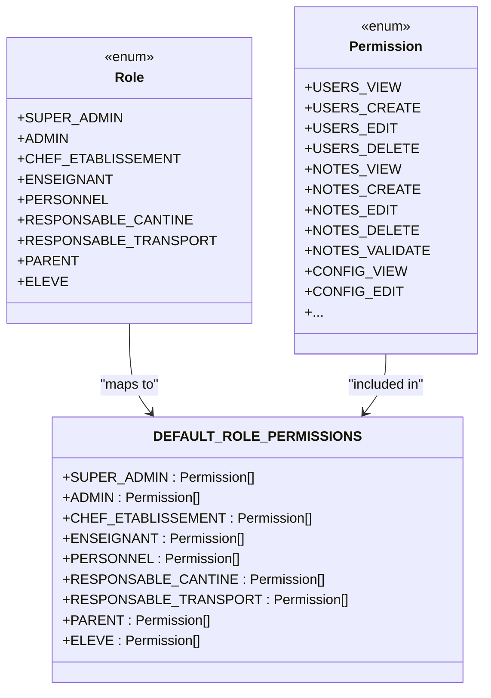
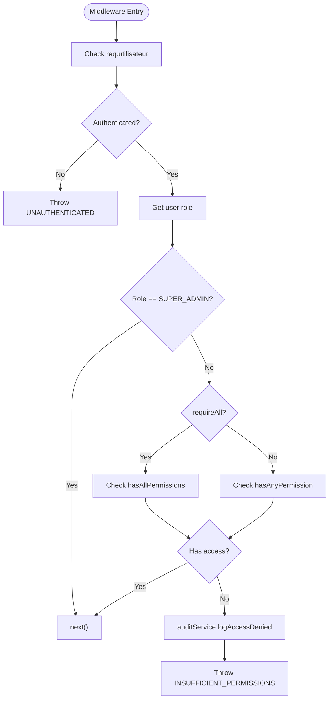
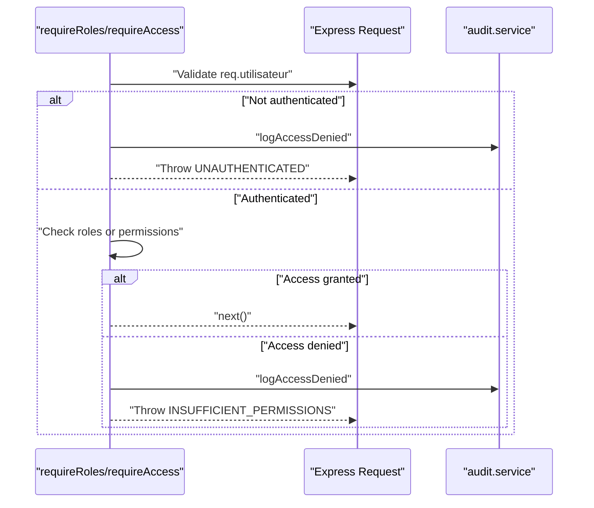
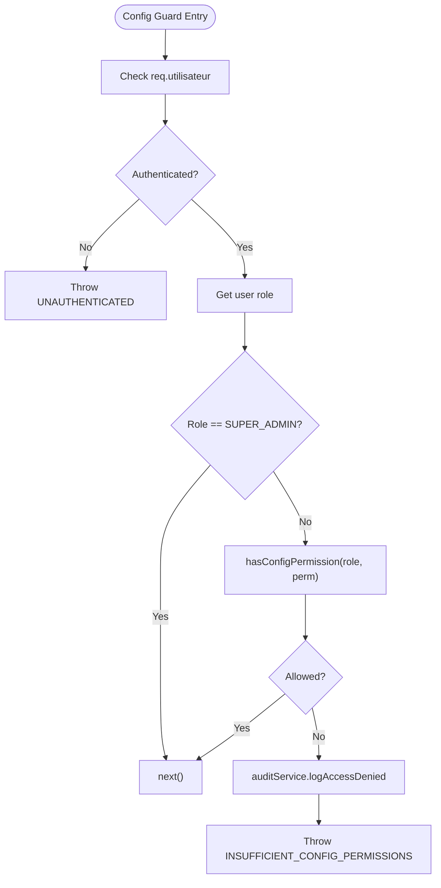
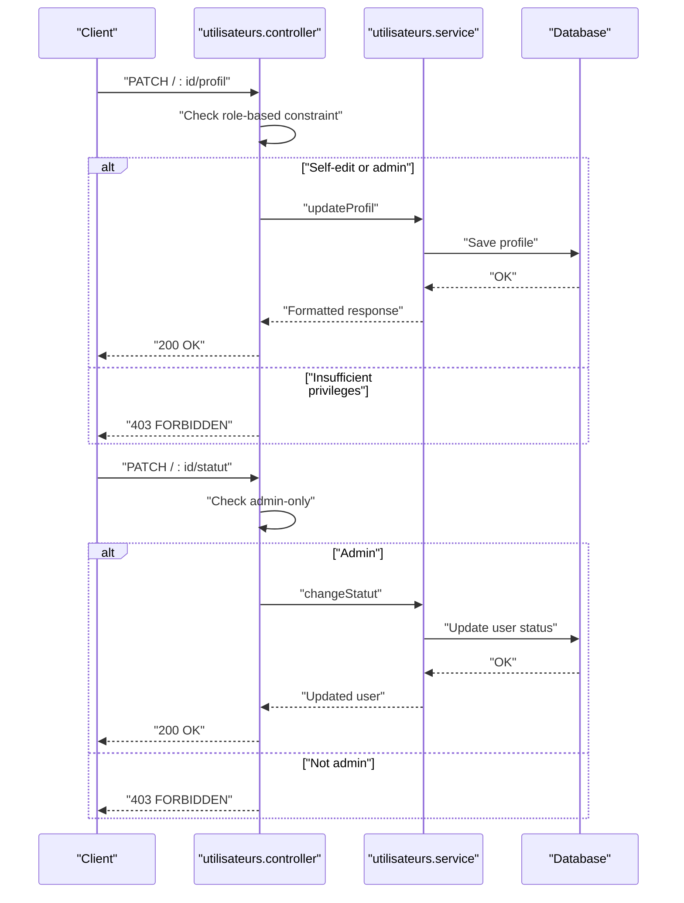
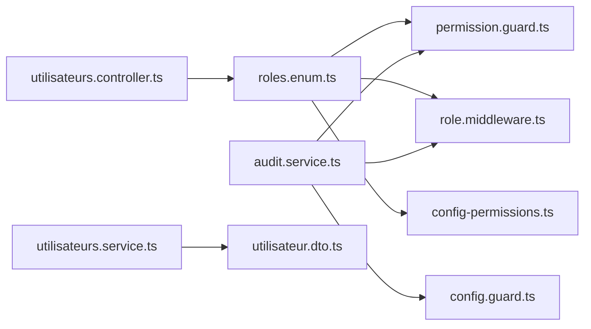

# Role-Based Access Control

<cite>
**Referenced Files in This Document**
- [roles.enum.ts](file://shared/src/enums/roles.enum.ts)
- [permission.guard.ts](file://backend/src/modules/auth/guards/permission.guard.ts)
- [role.middleware.ts](file://backend/src/modules/auth/middlewares/role.middleware.ts)
- [config.guard.ts](file://backend/src/modules/configuration/guards/config.guard.ts)
- [config-permissions.ts](file://backend/src/modules/configuration/guards/config-permissions.ts)
- [audit-log.entity.ts](file://backend/src/modules/auth/entities/audit-log.entity.ts)
- [audit.service.ts](file://backend/src/modules/auth/services/audit.service.ts)
- [utilisateurs.controller.ts](file://backend/src/modules/utilisateurs/controllers/utilisateurs.controller.ts)
- [utilisateurs.service.ts](file://backend/src/modules/utilisateurs/services/utilisateurs.service.ts)
- [utilisateur.dto.ts](file://backend/src/modules/utilisateurs/dto/utilisateur.dto.ts)
</cite>

## Table of Contents
1. [Introduction](#introduction)
2. [Project Structure](#project-structure)
3. [Core Components](#core-components)
4. [Architecture Overview](#architecture-overview)
5. [Detailed Component Analysis](#detailed-component-analysis)
6. [Dependency Analysis](#dependency-analysis)
7. [Performance Considerations](#performance-considerations)
8. [Troubleshooting Guide](#troubleshooting-guide)
9. [Conclusion](#conclusion)
10. [Appendices](#appendices)

## Introduction
This document provides comprehensive Role-Based Access Control (RBAC) documentation for eLISAschool. It explains the hierarchical role structure, permission levels, access matrices, and guard/middleware implementations. It also covers role assignment workflows, permission escalation procedures, and audit trails for access modifications. Cross-role permissions, delegation mechanisms, and temporary access grants are addressed conceptually alongside the existing implementation.

## Project Structure
The RBAC system spans shared enums, authentication guards, role middleware, configuration-specific guards, and audit logging. Controllers apply role-based protections, while services and DTOs support user management and filtering.

**Diagram sources**
- [roles.enum.ts:12-184](file://shared/src/enums/roles.enum.ts#L12-L184)
- [permission.guard.ts:17-74](file://backend/src/modules/auth/guards/permission.guard.ts#L17-L74)
- [role.middleware.ts:16-81](file://backend/src/modules/auth/middlewares/role.middleware.ts#L16-L81)
- [config-permissions.ts:13-93](file://backend/src/modules/configuration/guards/config-permissions.ts#L13-L93)
- [config.guard.ts:16-55](file://backend/src/modules/configuration/guards/config.guard.ts#L16-L55)
- [audit-log.entity.ts:1-200](file://backend/src/modules/auth/entities/audit-log.entity.ts#L1-L200)
- [audit.service.ts:1-200](file://backend/src/modules/auth/services/audit.service.ts#L1-L200)
- [utilisateurs.controller.ts:130-172](file://backend/src/modules/utilisateurs/controllers/utilisateurs.controller.ts#L130-L172)
- [utilisateurs.service.ts:105-168](file://backend/src/modules/utilisateurs/services/utilisateurs.service.ts#L105-L168)
- [utilisateur.dto.ts:68-86](file://backend/src/modules/utilisateurs/dto/utilisateur.dto.ts#L68-L86)

**Section sources**
- [roles.enum.ts:12-184](file://shared/src/enums/roles.enum.ts#L12-L184)
- [permission.guard.ts:17-74](file://backend/src/modules/auth/guards/permission.guard.ts#L17-L74)
- [role.middleware.ts:16-81](file://backend/src/modules/auth/middlewares/role.middleware.ts#L16-L81)
- [config-permissions.ts:13-93](file://backend/src/modules/configuration/guards/config-permissions.ts#L13-L93)
- [config.guard.ts:16-55](file://backend/src/modules/configuration/guards/config.guard.ts#L16-L55)
- [audit-log.entity.ts:1-200](file://backend/src/modules/auth/entities/audit-log.entity.ts#L1-L200)
- [audit.service.ts:1-200](file://backend/src/modules/auth/services/audit.service.ts#L1-L200)
- [utilisateurs.controller.ts:130-172](file://backend/src/modules/utilisateurs/controllers/utilisateurs.controller.ts#L130-L172)
- [utilisateurs.service.ts:105-168](file://backend/src/modules/utilisateurs/services/utilisateurs.service.ts#L105-L168)
- [utilisateur.dto.ts:68-86](file://backend/src/modules/utilisateurs/dto/utilisateur.dto.ts#L68-L86)

## Core Components
- Roles and Permissions: Centralized in shared enums with explicit role hierarchy and default permission sets per role.
- Permission Guards: Provide granular permission checks with optional "all-of" or "any-of" semantics.
- Role Middleware: Validates role-based access and supports combined role/permission checks.
- Configuration Guards: Enforce specialized configuration permissions with role-to-config-permission mapping.
- Audit Trail: Logs access denials centrally for compliance and monitoring.
- User Management: Controllers and services enforce role-based access for sensitive operations and expose filtered queries.

**Section sources**
- [roles.enum.ts:12-184](file://shared/src/enums/roles.enum.ts#L12-L184)
- [permission.guard.ts:17-74](file://backend/src/modules/auth/guards/permission.guard.ts#L17-L74)
- [role.middleware.ts:16-81](file://backend/src/modules/auth/middlewares/role.middleware.ts#L16-L81)
- [config-permissions.ts:13-93](file://backend/src/modules/configuration/guards/config-permissions.ts#L13-L93)
- [config.guard.ts:16-55](file://backend/src/modules/configuration/guards/config.guard.ts#L16-L55)
- [audit.service.ts:1-200](file://backend/src/modules/auth/services/audit.service.ts#L1-L200)
- [utilisateurs.controller.ts:130-172](file://backend/src/modules/utilisateurs/controllers/utilisateurs.controller.ts#L130-L172)
- [utilisateurs.service.ts:105-168](file://backend/src/modules/utilisateurs/services/utilisateurs.service.ts#L105-L168)

## Architecture Overview
The RBAC architecture separates concerns across shared enums, guards, middleware, and services. Authentication populates the request with the current user and role. Guards and middleware evaluate access against role and permission matrices, logging denials via the audit service.

**Diagram sources**
- [permission.guard.ts:44-74](file://backend/src/modules/auth/guards/permission.guard.ts#L44-L74)
- [role.middleware.ts:20-51](file://backend/src/modules/auth/middlewares/role.middleware.ts#L20-L51)
- [config.guard.ts:19-55](file://backend/src/modules/configuration/guards/config.guard.ts#L19-L55)
- [audit.service.ts:1-200](file://backend/src/modules/auth/services/audit.service.ts#L1-L200)

## Detailed Component Analysis

### Role and Permission Model
- Roles enumerate institutional positions with distinct capabilities.
- Permissions are granular actions scoped to modules (users, notes, configuration, etc.).
- DEFAULT_ROLE_PERMISSIONS defines baseline access per role, enabling matrix-based enforcement.

**Diagram sources**
- [roles.enum.ts:12-184](file://shared/src/enums/roles.enum.ts#L12-L184)

**Section sources**
- [roles.enum.ts:12-184](file://shared/src/enums/roles.enum.ts#L12-L184)

### Permission Guard Implementation
- hasPermission(role, permission): Checks if a role includes a given permission.
- hasAnyPermission(role, permissions[]): True if any required permission is present.
- hasAllPermissions(role, permissions[]): True only if all required permissions are present.
- requirePermissions(permissions[], requireAll?): Returns an Express middleware enforcing permission checks. Super admin bypass is applied before evaluation. On denial, access is logged via audit service.

**Diagram sources**
- [permission.guard.ts:44-74](file://backend/src/modules/auth/guards/permission.guard.ts#L44-L74)
- [audit.service.ts:1-200](file://backend/src/modules/auth/services/audit.service.ts#L1-L200)

**Section sources**
- [permission.guard.ts:17-74](file://backend/src/modules/auth/guards/permission.guard.ts#L17-L74)

### Role Middleware Functionality
- requireRoles(...roles): Ensures the user holds at least one of the specified roles. Denials are audited.
- requireAccess({ roles, permissions, requireAll }): Supports either-or combinations. Super admin bypass applies. Denials are audited.

**Diagram sources**
- [role.middleware.ts:20-81](file://backend/src/modules/auth/middlewares/role.middleware.ts#L20-L81)
- [audit.service.ts:1-200](file://backend/src/modules/auth/services/audit.service.ts#L1-L200)

**Section sources**
- [role.middleware.ts:16-81](file://backend/src/modules/auth/middlewares/role.middleware.ts#L16-L81)

### Configuration Permission Guard
- ConfigPermission enum defines granular permissions for configuration management.
- CONFIG_ROLE_PERMISSIONS maps roles to allowed configuration actions.
- requireConfigPermission(permission): Enforces configuration-specific access with super admin bypass and audit logging.

**Diagram sources**
- [config.guard.ts:19-55](file://backend/src/modules/configuration/guards/config.guard.ts#L19-L55)
- [config-permissions.ts:77-93](file://backend/src/modules/configuration/guards/config-permissions.ts#L77-L93)
- [audit.service.ts:1-200](file://backend/src/modules/auth/services/audit.service.ts#L1-L200)

**Section sources**
- [config-permissions.ts:13-93](file://backend/src/modules/configuration/guards/config-permissions.ts#L13-L93)
- [config.guard.ts:16-55](file://backend/src/modules/configuration/guards/config.guard.ts#L16-L55)

### Role-Based Route Protection Examples
- Profile updates: Non-admins may only edit their own profile; otherwise, administrative roles are required.
- Status updates: Restricted to administrators.
- User listing: Supports filtering by role, status, and establishment, enabling role-scoped visibility.

**Diagram sources**
- [utilisateurs.controller.ts:130-172](file://backend/src/modules/utilisateurs/controllers/utilisateurs.controller.ts#L130-L172)
- [utilisateurs.service.ts:192-237](file://backend/src/modules/utilisateurs/services/utilisateurs.service.ts#L192-L237)

**Section sources**
- [utilisateurs.controller.ts:130-172](file://backend/src/modules/utilisateurs/controllers/utilisateurs.controller.ts#L130-L172)
- [utilisateurs.service.ts:105-168](file://backend/src/modules/utilisateurs/services/utilisateurs.service.ts#L105-L168)

### Feature Access Control and Data Visibility Restrictions
- Feature access control: Guards enforce granular permissions per module (e.g., notes, documents, messaging).
- Data visibility: Controllers and services filter queries by role and establishment, ensuring users see only permitted records.

**Section sources**
- [roles.enum.ts:44-115](file://shared/src/enums/roles.enum.ts#L44-L115)
- [utilisateurs.service.ts:105-168](file://backend/src/modules/utilisateurs/services/utilisateurs.service.ts#L105-L168)
- [utilisateur.dto.ts:68-86](file://backend/src/modules/utilisateurs/dto/utilisateur.dto.ts#L68-L86)

### Role Assignment Workflows and Escalation Procedures
- Role assignment: Managed via user management endpoints with administrative controls.
- Escalation: Super admin role bypass allows unrestricted access during emergency or maintenance scenarios.
- Audit trail: All access denials are logged centrally for review and compliance.

**Section sources**
- [roles.enum.ts:120-184](file://shared/src/enums/roles.enum.ts#L120-L184)
- [permission.guard.ts:57-61](file://backend/src/modules/auth/guards/permission.guard.ts#L57-L61)
- [role.middleware.ts:70-74](file://backend/src/modules/auth/middlewares/role.middleware.ts#L70-L74)
- [audit.service.ts:1-200](file://backend/src/modules/auth/services/audit.service.ts#L1-L200)

### Cross-Role Permissions, Delegation, and Temporary Access
- Cross-role permissions: Not explicitly defined in the current implementation; access is role-centric with optional permission sets.
- Delegation: Not implemented in the current codebase; future enhancements could introduce delegated roles or temporary assignments.
- Temporary access: Not implemented; could be introduced via time-bound role assignments or temporary permission grants.

[No sources needed since this section provides conceptual guidance]

## Dependency Analysis
The RBAC system exhibits low coupling between modules:
- Shared enums define roles and permissions consumed by guards and middleware.
- Guards depend on shared enums and audit service.
- Middleware depends on shared enums and audit service.
- Configuration guards depend on configuration-specific enums and audit service.
- Controllers depend on roles and services for enforcement.

**Diagram sources**
- [roles.enum.ts:12-184](file://shared/src/enums/roles.enum.ts#L12-L184)
- [permission.guard.ts:13-14](file://backend/src/modules/auth/guards/permission.guard.ts#L13-L14)
- [role.middleware.ts:13-14](file://backend/src/modules/auth/middlewares/role.middleware.ts#L13-L14)
- [config-permissions.ts:11](file://backend/src/modules/configuration/guards/config-permissions.ts#L11)
- [config.guard.ts:13-14](file://backend/src/modules/configuration/guards/config.guard.ts#L13-L14)
- [audit.service.ts:1-200](file://backend/src/modules/auth/services/audit.service.ts#L1-L200)
- [utilisateurs.controller.ts:130-172](file://backend/src/modules/utilisateurs/controllers/utilisateurs.controller.ts#L130-L172)
- [utilisateurs.service.ts:105-168](file://backend/src/modules/utilisateurs/services/utilisateurs.service.ts#L105-L168)
- [utilisateur.dto.ts:68-86](file://backend/src/modules/utilisateurs/dto/utilisateur.dto.ts#L68-L86)

**Section sources**
- [roles.enum.ts:12-184](file://shared/src/enums/roles.enum.ts#L12-L184)
- [permission.guard.ts:13-14](file://backend/src/modules/auth/guards/permission.guard.ts#L13-L14)
- [role.middleware.ts:13-14](file://backend/src/modules/auth/middlewares/role.middleware.ts#L13-L14)
- [config-permissions.ts:11](file://backend/src/modules/configuration/guards/config-permissions.ts#L11)
- [config.guard.ts:13-14](file://backend/src/modules/configuration/guards/config.guard.ts#L13-L14)
- [audit.service.ts:1-200](file://backend/src/modules/auth/services/audit.service.ts#L1-L200)
- [utilisateurs.controller.ts:130-172](file://backend/src/modules/utilisateurs/controllers/utilisateurs.controller.ts#L130-L172)
- [utilisateurs.service.ts:105-168](file://backend/src/modules/utilisateurs/services/utilisateurs.service.ts#L105-L168)
- [utilisateur.dto.ts:68-86](file://backend/src/modules/utilisateurs/dto/utilisateur.dto.ts#L68-L86)

## Performance Considerations
- Permission checks are O(n) per role against DEFAULT_ROLE_PERMISSIONS, where n is the number of permissions per role. With a bounded set of permissions, this is efficient.
- Middleware and guards short-circuit on authentication failure and super admin bypass, minimizing unnecessary computation.
- Centralized audit logging occurs only on denial, reducing overhead under normal operation.

[No sources needed since this section provides general guidance]

## Troubleshooting Guide
- 401 UNAUTHENTICATED: Occurs when req.utilisateur is missing. Verify authentication middleware runs before guards.
- 403 INSUFFICIENT_PERMISSIONS: Indicates missing permissions or roles. Review DEFAULT_ROLE_PERMISSIONS and ensure requireAll flag matches intent.
- 403 INSUFFICIENT_CONFIG_PERMISSIONS: Indicates insufficient configuration permissions. Confirm role mapping in CONFIG_ROLE_PERMISSIONS.
- Audit logs: Access denials are recorded via audit service. Use these logs to diagnose repeated failures and track policy violations.

**Section sources**
- [permission.guard.ts:48-74](file://backend/src/modules/auth/guards/permission.guard.ts#L48-L74)
- [role.middleware.ts:21-50](file://backend/src/modules/auth/middlewares/role.middleware.ts#L21-L50)
- [config.guard.ts:22-55](file://backend/src/modules/configuration/guards/config.guard.ts#L22-L55)
- [audit.service.ts:1-200](file://backend/src/modules/auth/services/audit.service.ts#L1-L200)

## Conclusion
eLISAschool’s RBAC system centers on shared role and permission enums, enforced by guards and middleware with centralized audit logging. The design supports granular access control, role-based route protection, and configuration-specific permissions. Future enhancements can introduce cross-role permissions, delegation, and temporary access grants while maintaining auditability and performance.

## Appendices

### Access Matrix (Selected Roles and Permissions)
- SUPER_ADMIN: Full permissions across all modules.
- ADMIN: User management, roles management, configuration editing, monitoring, document management, notifications, messaging, and requests.
- CHEF_ETABLISSEMENT: User and note viewing/editing, bulletin generation/printing, document management, configuration viewing, messaging, and request approvals.
- ENSEIGNANT: Viewing and creating/editing notes, bulletin viewing, club management, messaging, gamification viewing, and request creation.
- PERSONNEL: Basic user and document viewing, messaging, and request creation.
- RESPONSABLE_CANTINE: Cantine management and messaging.
- RESPONSABLE_TRANSPORT: Transport management and messaging.
- PARENT: Viewing notes, bulletins, canteen, transport, messaging, and gamification.
- ELEVE: Viewing notes, bulletins, clubs, and gamification.

**Section sources**
- [roles.enum.ts:120-184](file://shared/src/enums/roles.enum.ts#L120-L184)