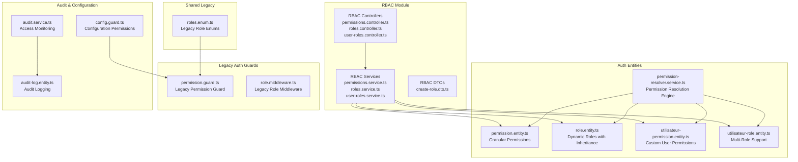
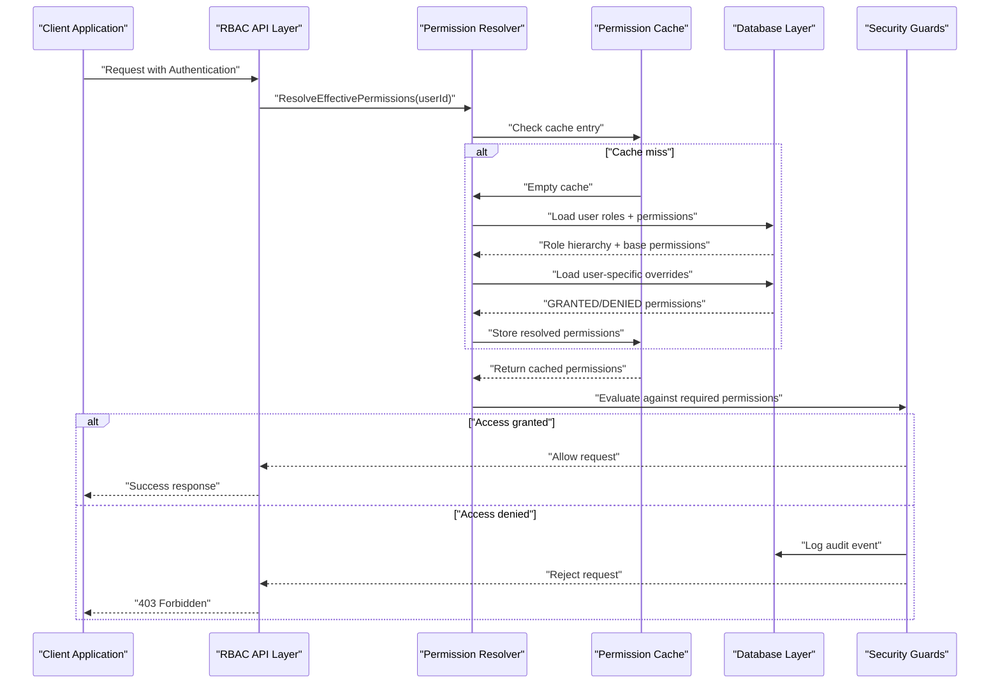
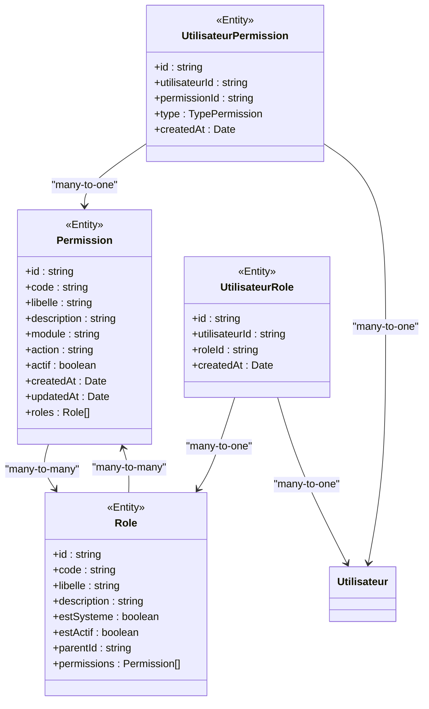
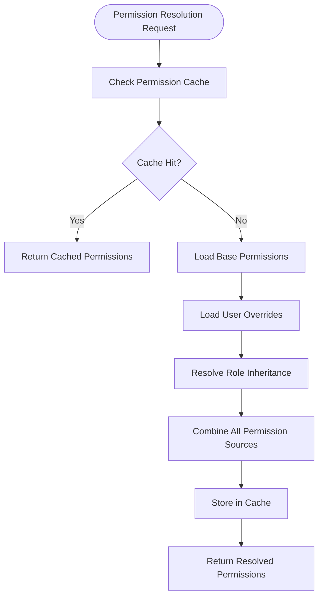
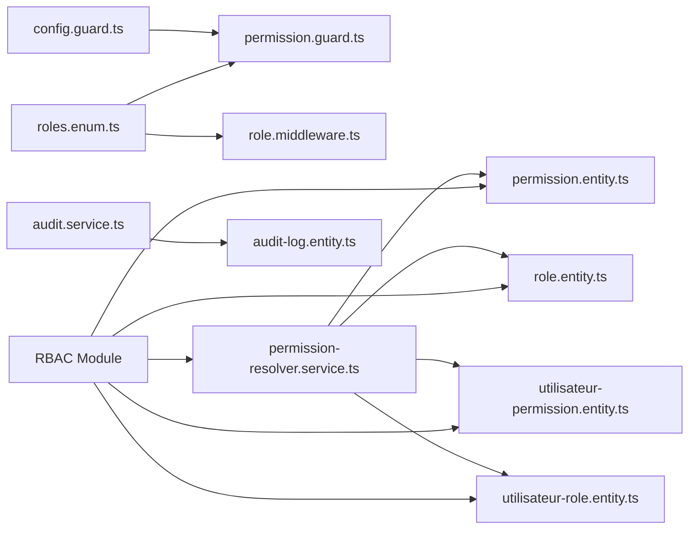

# Role-Based Access Control

<cite>
**Referenced Files in This Document**
- [roles.enum.ts](file://shared/src/enums/roles.enum.ts)
- [permission.guard.ts](file://backend/src/modules/auth/guards/permission.guard.ts)
- [role.middleware.ts](file://backend/src/modules/auth/middlewares/role.middleware.ts)
- [config.guard.ts](file://backend/src/modules/configuration/guards/config.guard.ts)
- [config-permissions.ts](file://backend/src/modules/configuration/guards/config-permissions.ts)
- [audit-log.entity.ts](file://backend/src/modules/auth/entities/audit-log.entity.ts)
- [audit.service.ts](file://backend/src/modules/auth/services/audit.service.ts)
- [utilisateurs.controller.ts](file://backend/src/modules/utilisateurs/controllers/utilisateurs.controller.ts)
- [utilisateurs.service.ts](file://backend/src/modules/utilisateurs/services/utilisateurs.service.ts)
- [utilisateur.dto.ts](file://backend/src/modules/utilisateurs/dto/utilisateur.dto.ts)
- [permission.entity.ts](file://backend/src/modules/auth/entities/permission.entity.ts)
- [role.entity.ts](file://backend/src/modules/auth/entities/role.entity.ts)
- [utilisateur-permission.entity.ts](file://backend/src/modules/auth/entities/utilisateur-permission.entity.ts)
- [utilisateur-role.entity.ts](file://backend/src/modules/auth/entities/utilisateur-role.entity.ts)
- [permission-resolver.service.ts](file://backend/src/modules/auth/services/permission-resolver.service.ts)
- [rbac.seed.ts](file://backend/src/database/seeds/rbac.seed.ts)
- [permissions.controller.ts](file://backend/src/modules/rbac/controllers/permissions.controller.ts)
- [roles.controller.ts](file://backend/src/modules/rbac/controllers/roles.controller.ts)
- [user-roles.controller.ts](file://backend/src/modules/rbac/controllers/user-roles.controller.ts)
- [permissions.service.ts](file://backend/src/modules/rbac/services/permissions.service.ts)
- [roles.service.ts](file://backend/src/modules/rbac/services/roles.service.ts)
- [user-roles.service.ts](file://backend/src/modules/rbac/services/user-roles.service.ts)
- [create-role.dto.ts](file://backend/src/modules/rbac/dto/create-role.dto.ts)
</cite>

## Update Summary
**Changes Made**
- Complete redesign of RBAC system with dynamic database-stored roles and permissions
- Introduction of granular permission model with ~85 permissions across modules
- Multi-roles per user support with role inheritance capabilities
- Custom user permissions system with GRANTED/DENIED overrides
- New RBAC module with comprehensive API endpoints for role and permission management
- Enhanced permission resolution with caching and inheritance support

## Table of Contents
1. [Introduction](#introduction)
2. [Project Structure](#project-structure)
3. [Core Components](#core-components)
4. [Architecture Overview](#architecture-overview)
5. [Detailed Component Analysis](#detailed-component-analysis)
6. [Database-Driven RBAC System](#database-driven-rbac-system)
7. [Permission Resolution Engine](#permission-resolution-engine)
8. [RBAC API Endpoints](#rbac-api-endpoints)
9. [Advanced RBAC Features](#advanced-rbac-features)
10. [Migration from Legacy System](#migration-from-legacy-system)
11. [Dependency Analysis](#dependency-analysis)
12. [Performance Considerations](#performance-considerations)
13. [Troubleshooting Guide](#troubleshooting-guide)
14. [Conclusion](#conclusion)
15. [Appendices](#appendices)

## Introduction
This document provides comprehensive documentation for eLISAschool's redesigned Role-Based Access Control (RBAC) system. The system has undergone a major transformation from a static, code-based approach to a dynamic, database-driven architecture supporting advanced features including granular permissions (~85 permissions), multi-roles per user, custom user permissions, role inheritance, and comprehensive API management.

The new RBAC system introduces a sophisticated permission resolution engine that combines role-based permissions with individual user overrides, providing unprecedented flexibility in access control management while maintaining security and auditability.

## Project Structure
The RBAC system now encompasses a dedicated RBAC module with controllers, services, DTOs, and database entities, alongside enhanced authentication guards and middleware. The system maintains backward compatibility with legacy role enums while introducing new database-stored entities for dynamic permission management.

**Diagram sources**
- [roles.enum.ts:12-184](file://shared/src/enums/roles.enum.ts#L12-L184)
- [permissions.controller.ts](file://backend/src/modules/rbac/controllers/permissions.controller.ts)
- [roles.controller.ts](file://backend/src/modules/rbac/controllers/roles.controller.ts)
- [user-roles.controller.ts](file://backend/src/modules/rbac/controllers/user-roles.controller.ts)
- [permission.entity.ts:27-63](file://backend/src/modules/auth/entities/permission.entity.ts#L27-L63)
- [role.entity.ts:30-56](file://backend/src/modules/auth/entities/role.entity.ts#L30-L56)
- [utilisateur-permission.entity.ts:37-50](file://backend/src/modules/auth/entities/utilisateur-permission.entity.ts#L37-L50)
- [utilisateur-role.entity.ts](file://backend/src/modules/auth/entities/utilisateur-role.entity.ts)
- [permission-resolver.service.ts:36-40](file://backend/src/modules/auth/services/permission-resolver.service.ts#L36-L40)

**Section sources**
- [roles.enum.ts:12-184](file://shared/src/enums/roles.enum.ts#L12-L184)
- [permission.entity.ts:27-63](file://backend/src/modules/auth/entities/permission.entity.ts#L27-L63)
- [role.entity.ts:30-56](file://backend/src/modules/auth/entities/role.entity.ts#L30-L56)
- [utilisateur-permission.entity.ts:37-50](file://backend/src/modules/auth/entities/utilisateur-permission.entity.ts#L37-L50)
- [utilisateur-role.entity.ts](file://backend/src/modules/auth/entities/utilisateur-role.entity.ts)
- [permission-resolver.service.ts:36-40](file://backend/src/modules/auth/services/permission-resolver.service.ts#L36-L40)

## Core Components
The redesigned RBAC system consists of several interconnected components working together to provide dynamic, flexible access control:

- **Database-Driven Permissions**: Granular permission entities with module/action categorization and activation flags
- **Dynamic Role Management**: Roles stored in database with inheritance support and system role differentiation
- **Multi-Role Architecture**: Users can hold multiple roles simultaneously with hierarchical inheritance
- **Custom Permission Overrides**: Individual user permissions with GRANTED/DENIED precedence over role-based permissions
- **Permission Resolution Engine**: Advanced caching system resolving effective permissions combining all sources
- **Comprehensive RBAC API**: RESTful endpoints for managing roles, permissions, and user assignments
- **Enhanced Security Guards**: Updated middleware and guards supporting the new permission model
- **Centralized Audit System**: Comprehensive logging of access decisions and permission changes

**Section sources**
- [permission.entity.ts:27-63](file://backend/src/modules/auth/entities/permission.entity.ts#L27-L63)
- [role.entity.ts:30-56](file://backend/src/modules/auth/entities/role.entity.ts#L30-L56)
- [utilisateur-permission.entity.ts:25-31](file://backend/src/modules/auth/entities/utilisateur-permission.entity.ts#L25-L31)
- [permission-resolver.service.ts:25-31](file://backend/src/modules/auth/services/permission-resolver.service.ts#L25-L31)

## Architecture Overview
The new RBAC architecture implements a three-tier permission resolution system: role-based permissions, user-specific overrides, and inherited permissions. The system maintains backward compatibility while introducing powerful new capabilities for fine-grained access control.

**Diagram sources**
- [permission-resolver.service.ts:36-40](file://backend/src/modules/auth/services/permission-resolver.service.ts#L36-L40)
- [utilisateur-permission.entity.ts:25-31](file://backend/src/modules/auth/entities/utilisateur-permission.entity.ts#L25-L31)
- [audit.service.ts:1-200](file://backend/src/modules/auth/services/audit.service.ts#L1-L200)

## Detailed Component Analysis

### Database-Driven Permission Model
The new system replaces static permission enums with dynamic database-stored permissions, enabling unlimited granularity and easy modification without code deployment.

**Diagram sources**
- [permission.entity.ts:27-63](file://backend/src/modules/auth/entities/permission.entity.ts#L27-L63)
- [role.entity.ts:30-56](file://backend/src/modules/auth/entities/role.entity.ts#L30-L56)
- [utilisateur-permission.entity.ts:37-50](file://backend/src/modules/auth/entities/utilisateur-permission.entity.ts#L37-L50)
- [utilisateur-role.entity.ts](file://backend/src/modules/auth/entities/utilisateur-role.entity.ts)

**Section sources**
- [permission.entity.ts:27-63](file://backend/src/modules/auth/entities/permission.entity.ts#L27-L63)
- [role.entity.ts:30-56](file://backend/src/modules/auth/entities/role.entity.ts#L30-L56)
- [utilisateur-permission.entity.ts:25-31](file://backend/src/modules/auth/entities/utilisateur-permission.entity.ts#L25-L31)
- [utilisateur-role.entity.ts](file://backend/src/modules/auth/entities/utilisateur-role.entity.ts)

### Enhanced Permission Resolution Engine
The PermissionResolverService implements a sophisticated caching mechanism that resolves effective permissions by combining role-based permissions, user-specific overrides, and inherited permissions from parent roles.

**Section sources**
- [permission-resolver.service.ts:25-31](file://backend/src/modules/auth/services/permission-resolver.service.ts#L25-L31)
- [permission-resolver.service.ts:36-40](file://backend/src/modules/auth/services/permission-resolver.service.ts#L36-L40)

## Database-Driven RBAC System

### Dynamic Role Management
The system now supports dynamic role creation, modification, and deletion through database entities with built-in inheritance capabilities.

**Section sources**
- [role.entity.ts:30-56](file://backend/src/modules/auth/entities/role.entity.ts#L30-L56)
- [rbac.seed.ts](file://backend/src/database/seeds/rbac.seed.ts)

### Granular Permission System
With approximately 85 permissions across multiple modules, the system provides unprecedented control over access rights with clear module/action categorization.

**Section sources**
- [permission.entity.ts:27-63](file://backend/src/modules/auth/entities/permission.entity.ts#L27-L63)
- [rbac.seed.ts](file://backend/src/database/seeds/rbac.seed.ts)

### Multi-Roles per User
Users can now hold multiple roles simultaneously, enabling complex organizational structures and flexible permission assignment.

**Section sources**
- [utilisateur-role.entity.ts](file://backend/src/modules/auth/entities/utilisateur-role.entity.ts)
- [user-roles.service.ts](file://backend/src/modules/rbac/services/user-roles.service.ts)

### Custom User Permissions
Individual user permissions override role-based permissions with explicit GRANTED or DENIED states, providing fine-tuned access control.

**Section sources**
- [utilisateur-permission.entity.ts:25-31](file://backend/src/modules/auth/entities/utilisateur-permission.entity.ts#L25-L31)
- [utilisateur-permission.entity.ts:37-50](file://backend/src/modules/auth/entities/utilisateur-permission.entity.ts#L37-L50)

## Permission Resolution Engine

### Caching Strategy
The permission resolver implements intelligent caching to minimize database queries while ensuring permission accuracy and timeliness.

**Diagram sources**
- [permission-resolver.service.ts:25-31](file://backend/src/modules/auth/services/permission-resolver.service.ts#L25-L31)
- [permission-resolver.service.ts:36-40](file://backend/src/modules/auth/services/permission-resolver.service.ts#L36-L40)

**Section sources**
- [permission-resolver.service.ts:25-31](file://backend/src/modules/auth/services/permission-resolver.service.ts#L25-L31)
- [permission-resolver.service.ts:36-40](file://backend/src/modules/auth/services/permission-resolver.service.ts#L36-L40)

## RBAC API Endpoints

### Role Management Endpoints
The RBAC module provides comprehensive API endpoints for managing roles and their relationships.

**Section sources**
- [roles.controller.ts](file://backend/src/modules/rbac/controllers/roles.controller.ts)
- [roles.service.ts](file://backend/src/modules/rbac/services/roles.service.ts)
- [create-role.dto.ts](file://backend/src/modules/rbac/dto/create-role.dto.ts)

### Permission Management Endpoints
Endpoints for managing granular permissions across different modules and actions.

**Section sources**
- [permissions.controller.ts](file://backend/src/modules/rbac/controllers/permissions.controller.ts)
- [permissions.service.ts](file://backend/src/modules/rbac/services/permissions.service.ts)

### User Role Assignment Endpoints
Endpoints for assigning multiple roles to users and managing role hierarchies.

**Section sources**
- [user-roles.controller.ts](file://backend/src/modules/rbac/controllers/user-roles.controller.ts)
- [user-roles.service.ts](file://backend/src/modules/rbac/services/user-roles.service.ts)

## Advanced RBAC Features

### Role Inheritance System
Roles can inherit permissions from parent roles, creating hierarchical permission structures that simplify administration and reduce redundancy.

**Section sources**
- [role.entity.ts:52-56](file://backend/src/modules/auth/entities/role.entity.ts#L52-L56)
- [permission-resolver.service.ts:36-40](file://backend/src/modules/auth/services/permission-resolver.service.ts#L36-L40)

### Permission Override Mechanism
Custom user permissions can override role-based permissions with explicit precedence rules, allowing for exception-based access control.

**Section sources**
- [utilisateur-permission.entity.ts:25-31](file://backend/src/modules/auth/entities/utilisateur-permission.entity.ts#L25-L31)
- [permission-resolver.service.ts:36-40](file://backend/src/modules/auth/services/permission-resolver.service.ts#L36-L40)

### Audit and Compliance
Comprehensive audit logging tracks all permission changes, access attempts, and role modifications for compliance and security monitoring.

**Section sources**
- [audit-log.entity.ts:1-200](file://backend/src/modules/auth/entities/audit-log.entity.ts#L1-L200)
- [audit.service.ts:1-200](file://backend/src/modules/auth/services/audit.service.ts#L1-L200)

## Migration from Legacy System

### Backward Compatibility
The new system maintains compatibility with existing legacy role enums while providing migration pathways for organizations transitioning to the new dynamic system.

**Section sources**
- [roles.enum.ts:12-184](file://shared/src/enums/roles.enum.ts#L12-L184)
- [permission-resolver.service.ts:36-40](file://backend/src/modules/auth/services/permission-resolver.service.ts#L36-L40)

### Transition Strategies
Organizations can gradually migrate from static role-based permissions to dynamic database-stored permissions while maintaining operational continuity.

## Dependency Analysis
The RBAC system exhibits enhanced modularity with clear separation of concerns between the new RBAC module and legacy components:

**Diagram sources**
- [roles.enum.ts:12-184](file://shared/src/enums/roles.enum.ts#L12-L184)
- [permission-resolver.service.ts:36-40](file://backend/src/modules/auth/services/permission-resolver.service.ts#L36-L40)
- [permission.entity.ts:27-63](file://backend/src/modules/auth/entities/permission.entity.ts#L27-L63)
- [role.entity.ts:30-56](file://backend/src/modules/auth/entities/role.entity.ts#L30-L56)
- [utilisateur-permission.entity.ts:37-50](file://backend/src/modules/auth/entities/utilisateur-permission.entity.ts#L37-L50)
- [utilisateur-role.entity.ts](file://backend/src/modules/auth/entities/utilisateur-role.entity.ts)

**Section sources**
- [roles.enum.ts:12-184](file://shared/src/enums/roles.enum.ts#L12-L184)
- [permission-resolver.service.ts:36-40](file://backend/src/modules/auth/services/permission-resolver.service.ts#L36-L40)
- [permission.entity.ts:27-63](file://backend/src/modules/auth/entities/permission.entity.ts#L27-L63)
- [role.entity.ts:30-56](file://backend/src/modules/auth/entities/role.entity.ts#L30-L56)
- [utilisateur-permission.entity.ts:37-50](file://backend/src/modules/auth/entities/utilisateur-permission.entity.ts#L37-L50)
- [utilisateur-role.entity.ts](file://backend/src/modules/auth/entities/utilisateur-role.entity.ts)

## Performance Considerations
The new RBAC system implements several performance optimizations:

- **Intelligent Caching**: Permission resolution results cached with TTL-based invalidation
- **Batch Operations**: Database queries optimized for multi-role and multi-permission scenarios
- **Lazy Loading**: Permission inheritance resolved only when needed
- **Connection Pooling**: Optimized database connections for high-concurrency environments
- **Memory Management**: Efficient cache eviction strategies preventing memory leaks

## Troubleshooting Guide

### Common Issues and Solutions
- **Permission Resolution Failures**: Verify cache integrity and database connectivity for permission resolution
- **Role Inheritance Problems**: Check parent-child role relationships and inheritance chains
- **Custom Permission Conflicts**: Review GRANTED/DENIED precedence rules and conflict resolution
- **API Endpoint Errors**: Validate RBAC controller permissions and service layer dependencies

### Debugging Tools
- **Audit Log Analysis**: Comprehensive logging enables detailed troubleshooting of access issues
- **Permission Trace**: Built-in tracing capabilities show permission resolution steps
- **Cache Monitoring**: Real-time cache statistics help identify performance bottlenecks

**Section sources**
- [audit.service.ts:1-200](file://backend/src/modules/auth/services/audit.service.ts#L1-L200)
- [permission-resolver.service.ts:25-31](file://backend/src/modules/auth/services/permission-resolver.service.ts#L25-L31)

## Conclusion
eLISAschool's redesigned RBAC system represents a significant advancement in educational institution access control, providing unprecedented flexibility and granularity through dynamic database-stored roles and permissions. The system successfully balances security, performance, and usability while maintaining backward compatibility and comprehensive audit capabilities.

The introduction of ~85 granular permissions, multi-role support, custom user permissions, and role inheritance creates a robust foundation for complex institutional access control requirements. The comprehensive RBAC API enables programmatic management of the permission system, while the advanced caching and resolution engine ensures optimal performance even with complex permission hierarchies.

Future enhancements can build upon this foundation to support advanced delegation mechanisms, temporary access grants, and integration with external identity providers, maintaining the system's extensibility and adaptability to evolving institutional needs.

## Appendices

### Permission Categories and Examples
The system organizes permissions into logical categories across multiple modules:

**User Management Permissions**: View, create, edit, delete, activate/deactivate users
**Academic Permissions**: Manage students, grades, transcripts, academic records
**Administrative Permissions**: Configure school settings, manage schedules, handle requests
**Communication Permissions**: Send messages, manage announcements, handle notifications
**Resource Permissions**: Manage facilities, equipment, transportation, cafeteria services

**Section sources**
- [permission.entity.ts:27-63](file://backend/src/modules/auth/entities/permission.entity.ts#L27-L63)
- [rbac.seed.ts](file://backend/src/database/seeds/rbac.seed.ts)

### Role Hierarchy Examples
Common role inheritance patterns include:

**Basic Hierarchy**: Student → Parent → Administrator
**Departmental Hierarchy**: Teacher → Department Head → Principal
**Functional Hierarchy**: Staff Member → Supervisor → Director

**Section sources**
- [role.entity.ts:52-56](file://backend/src/modules/auth/entities/role.entity.ts#L52-L56)
- [rbac.seed.ts](file://backend/src/database/seeds/rbac.seed.ts)

### Migration Best Practices
When transitioning from legacy systems:

1. **Assess Current Permissions**: Document existing role-based access patterns
2. **Map to Granular Permissions**: Translate roles into equivalent permission sets
3. **Test Thoroughly**: Validate permission resolution and inheritance behavior
4. **Monitor Performance**: Track cache hit rates and resolution times
5. **Train Administrators**: Educate on new RBAC management interfaces

**Section sources**
- [permission-resolver.service.ts:36-40](file://backend/src/modules/auth/services/permission-resolver.service.ts#L36-L40)
- [rbac.seed.ts](file://backend/src/database/seeds/rbac.seed.ts)