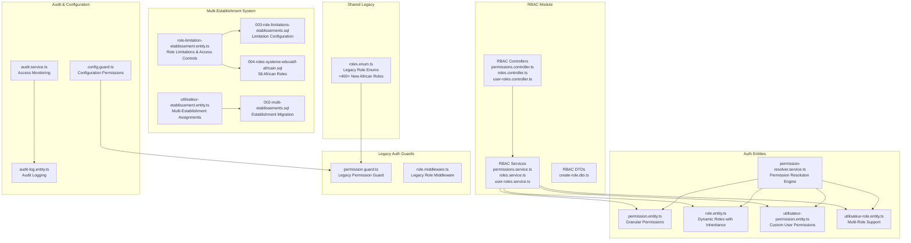
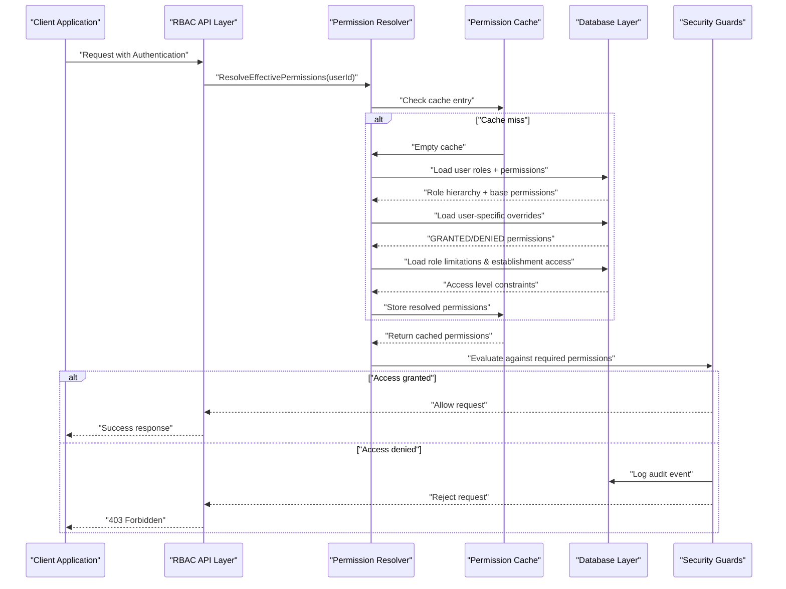
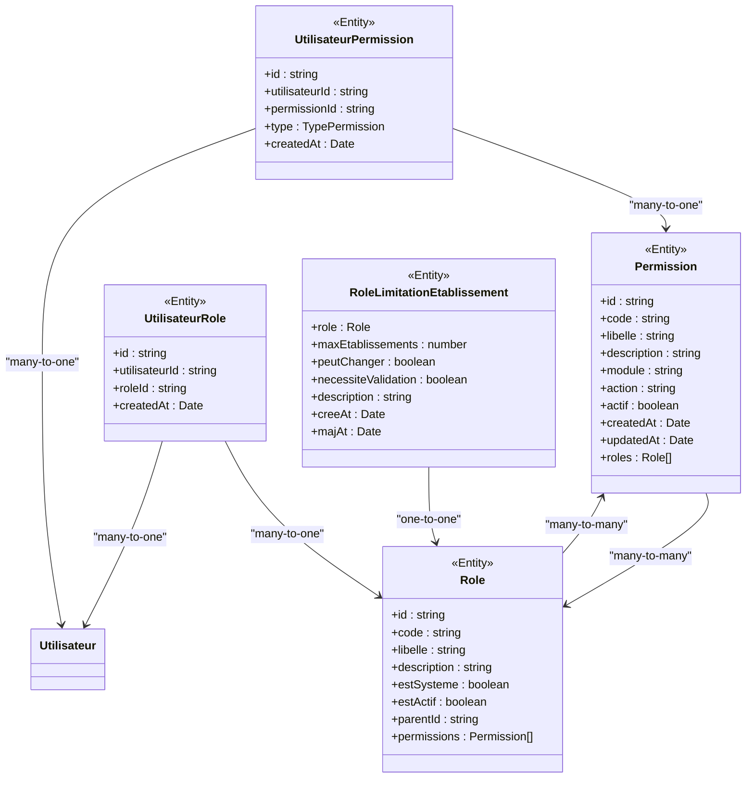
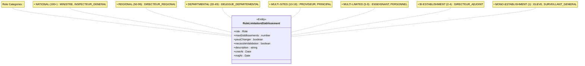
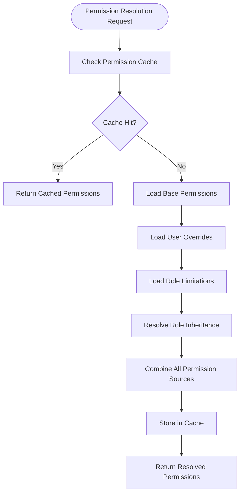
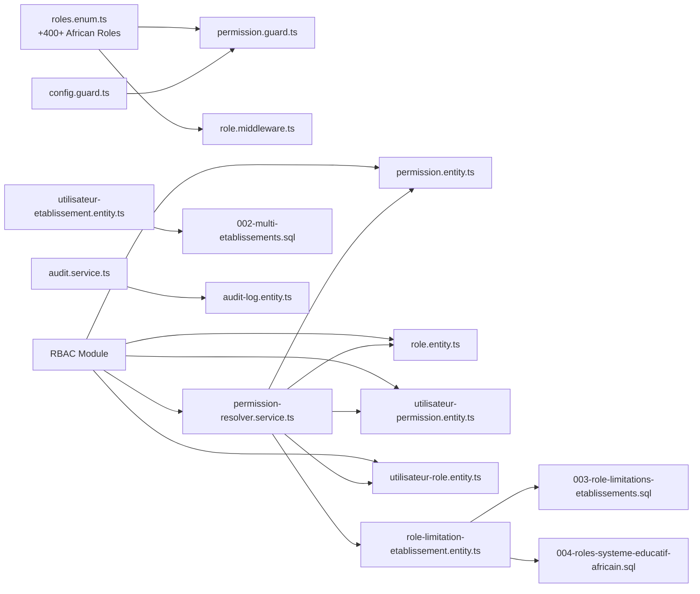

# Role-Based Access Control

<cite>
**Referenced Files in This Document**
- [roles.enum.ts](file://shared/src/enums/roles.enum.ts)
- [role-limitation-etablissement.entity.ts](file://backend/src/modules/auth/entities/role-limitation-etablissement.entity.ts)
- [permission.guard.ts](file://backend/src/modules/auth/guards/permission.guard.ts)
- [role.middleware.ts](file://backend/src/modules/auth/middlewares/role.middleware.ts)
- [config.guard.ts](file://backend/src/modules/configuration/guards/config.guard.ts)
- [config-permissions.ts](file://backend/src/modules/configuration/guards/config-permissions.ts)
- [audit-log.entity.ts](file://backend/src/modules/auth/entities/audit-log.entity.ts)
- [audit.service.ts](file://backend/src/modules/auth/services/audit.service.ts)
- [utilisateurs.controller.ts](file://backend/src/modules/utilisateurs/controllers/utilisateurs.controller.ts)
- [utilisateurs.service.ts](file://backend/src/modules/utilisateurs/services/utilisateurs.service.ts)
- [utilisateur.dto.ts](file://backend/src/modules/utilisateurs/dto/utilisateur.dto.ts)
- [permission.entity.ts](file://backend/src/modules/auth/entities/permission.entity.ts)
- [role.entity.ts](file://backend/src/modules/auth/entities/role.entity.ts)
- [utilisateur-permission.entity.ts](file://backend/src/modules/auth/entities/utilisateur-permission.entity.ts)
- [utilisateur-role.entity.ts](file://backend/src/modules/auth/entities/utilisateur-role.entity.ts)
- [permission-resolver.service.ts](file://backend/src/modules/auth/services/permission-resolver.service.ts)
- [rbac.seed.ts](file://backend/src/database/seeds/rbac.seed.ts)
- [permissions.controller.ts](file://backend/src/modules/rbac/controllers/permissions.controller.ts)
- [roles.controller.ts](file://backend/src/modules/rbac/controllers/roles.controller.ts)
- [user-roles.controller.ts](file://backend/src/modules/rbac/controllers/user-roles.controller.ts)
- [permissions.service.ts](file://backend/src/modules/rbac/services/permissions.service.ts)
- [roles.service.ts](file://backend/src/modules/rbac/services/roles.service.ts)
- [user-roles.service.ts](file://backend/src/modules/rbac/services/user-roles.service.ts)
- [create-role.dto.ts](file://backend/src/modules/rbac/dto/create-role.dto.ts)
- [002-multi-etablissements.sql](file://backend/src/database/migrations/002-multi-etablissements.sql)
- [003-role-limitations-etablissements.sql](file://backend/src/database/migrations/003-role-limitations-etablissements.sql)
- [004-roles-systeme-educatif-africain.sql](file://backend/src/database/migrations/004-roles-systeme-educatif-africain.sql)
- [utilisateur-etablissement.service.ts](file://backend/src/modules/auth/services/utilisateur-etablissement.service.ts)
</cite>

## Update Summary
**Changes Made**
- Massive expansion with 58 new roles for African educational systems (Cameroon, Central Africa, West Africa)
- Enhanced RBAC system now includes comprehensive role limitations with establishment access levels
- New role-limitation-etablissement.entity.ts for dynamic role configuration
- Extensive updates to roles.enum.ts with over 400 additional role definitions
- Multi-establishment support with approval requirements and access level controls
- Comprehensive migration system covering national, regional, and local educational hierarchies

## Table of Contents
1. [Introduction](#introduction)
2. [Project Structure](#project-structure)
3. [Core Components](#core-components)
4. [Architecture Overview](#architecture-overview)
5. [Detailed Component Analysis](#detailed-component-analysis)
6. [Database-Driven RBAC System](#database-driven-rbac-system)
7. [Multi-Establishment Role Limitations](#multi-establishment-role-limitations)
8. [Permission Resolution Engine](#permission-resolution-engine)
9. [RBAC API Endpoints](#rbac-api-endpoints)
10. [Advanced RBAC Features](#advanced-rbac-features)
11. [Migration from Legacy System](#migration-from-legacy-system)
12. [Dependency Analysis](#dependency-analysis)
13. [Performance Considerations](#performance-considerations)
14. [Troubleshooting Guide](#troubleshooting-guide)
15. [Conclusion](#conclusion)
16. [Appendices](#appendices)

## Introduction
This document provides comprehensive documentation for eLISAschool's redesigned Role-Based Access Control (RBAC) system. The system has undergone a major transformation from a static, code-based approach to a dynamic, database-driven architecture supporting advanced features including granular permissions (~85 permissions), multi-roles per user, custom user permissions, role inheritance, and comprehensive API management.

**Updated** The system now includes a massive expansion of 58 new roles specifically designed for African educational systems, covering Cameroon, Central Africa, and West Africa. The enhanced RBAC system introduces comprehensive role limitations with establishment access levels, approval requirements, and dynamic configuration capabilities.

The new RBAC system introduces a sophisticated permission resolution engine that combines role-based permissions with individual user overrides, providing unprecedented flexibility in access control management while maintaining security and auditability. The system now supports complex multi-establishment configurations with role-based access controls tailored to different educational hierarchies across Africa.

## Project Structure
The RBAC system now encompasses a dedicated RBAC module with controllers, services, DTOs, and database entities, alongside enhanced authentication guards and middleware. The system maintains backward compatibility with legacy role enums while introducing new database-stored entities for dynamic permission management and comprehensive role limitation configurations.

**Diagram sources**
- [roles.enum.ts:12-647](file://shared/src/enums/roles.enum.ts#L12-L647)
- [role-limitation-etablissement.entity.ts:24-64](file://backend/src/modules/auth/entities/role-limitation-etablissement.entity.ts#L24-L64)
- [permissions.controller.ts](file://backend/src/modules/rbac/controllers/permissions.controller.ts)
- [roles.controller.ts](file://backend/src/modules/rbac/controllers/roles.controller.ts)
- [user-roles.controller.ts](file://backend/src/modules/rbac/controllers/user-roles.controller.ts)
- [permission.entity.ts:27-63](file://backend/src/modules/auth/entities/permission.entity.ts#L27-L63)
- [role.entity.ts:30-56](file://backend/src/modules/auth/entities/role.entity.ts#L30-L56)
- [utilisateur-permission.entity.ts:37-50](file://backend/src/modules/auth/entities/utilisateur-permission.entity.ts#L37-L50)
- [utilisateur-role.entity.ts](file://backend/src/modules/auth/entities/utilisateur-role.entity.ts)
- [permission-resolver.service.ts:36-40](file://backend/src/modules/auth/services/permission-resolver.service.ts#L36-L40)
- [002-multi-etablissements.sql:12-41](file://backend/src/database/migrations/002-multi-etablissements.sql#L12-L41)
- [003-role-limitations-etablissements.sql:9-18](file://backend/src/database/migrations/003-role-limitations-etablissements.sql#L9-L18)
- [004-roles-systeme-educatif-africain.sql:9-96](file://backend/src/database/migrations/004-roles-systeme-educatif-africain.sql#L9-L96)

**Section sources**
- [roles.enum.ts:12-647](file://shared/src/enums/roles.enum.ts#L12-L647)
- [role-limitation-etablissement.entity.ts:24-64](file://backend/src/modules/auth/entities/role-limitation-etablissement.entity.ts#L24-L64)
- [permission.entity.ts:27-63](file://backend/src/modules/auth/entities/permission.entity.ts#L27-L63)
- [role.entity.ts:30-56](file://backend/src/modules/auth/entities/role.entity.ts#L30-L56)
- [utilisateur-permission.entity.ts:37-50](file://backend/src/modules/auth/entities/utilisateur-permission.entity.ts#L37-L50)
- [utilisateur-role.entity.ts](file://backend/src/modules/auth/entities/utilisateur-role.entity.ts)
- [permission-resolver.service.ts:36-40](file://backend/src/modules/auth/services/permission-resolver.service.ts#L36-L40)

## Core Components
The redesigned RBAC system consists of several interconnected components working together to provide dynamic, flexible access control with comprehensive multi-establishment support:

- **Database-Driven Permissions**: Granular permission entities with module/action categorization and activation flags
- **Dynamic Role Management**: Roles stored in database with inheritance support and system role differentiation
- **Multi-Role Architecture**: Users can hold multiple roles simultaneously with hierarchical inheritance
- **Custom Permission Overrides**: Individual user permissions with GRANTED/DENIED precedence over role-based permissions
- **Permission Resolution Engine**: Advanced caching system resolving effective permissions combining all sources
- **Comprehensive RBAC API**: RESTful endpoints for managing roles, permissions, and user assignments
- **Enhanced Security Guards**: Updated middleware and guards supporting the new permission model
- **Centralized Audit System**: Comprehensive logging of access decisions and permission changes
- **Multi-Establishment Role Limitations**: Dynamic configuration of establishment access levels and approval requirements
- **African Educational System Integration**: 58 specialized roles covering Cameroon, Central Africa, and West Africa

**Section sources**
- [permission.entity.ts:27-63](file://backend/src/modules/auth/entities/permission.entity.ts#L27-L63)
- [role.entity.ts:30-56](file://backend/src/modules/auth/entities/role.entity.ts#L30-L56)
- [utilisateur-permission.entity.ts:25-31](file://backend/src/modules/auth/entities/utilisateur-permission.entity.ts#L25-L31)
- [permission-resolver.service.ts:25-31](file://backend/src/modules/auth/services/permission-resolver.service.ts#L25-L31)
- [role-limitation-etablissement.entity.ts:24-64](file://backend/src/modules/auth/entities/role-limitation-etablissement.entity.ts#L24-L64)

## Architecture Overview
The new RBAC architecture implements a three-tier permission resolution system: role-based permissions, user-specific overrides, and inherited permissions. The system maintains backward compatibility while introducing powerful new capabilities for fine-grained access control and comprehensive multi-establishment management.

**Diagram sources**
- [permission-resolver.service.ts:36-40](file://backend/src/modules/auth/services/permission-resolver.service.ts#L36-L40)
- [utilisateur-permission.entity.ts:25-31](file://backend/src/modules/auth/entities/utilisateur-permission.entity.ts#L25-L31)
- [audit.service.ts:1-200](file://backend/src/modules/auth/services/audit.service.ts#L1-L200)
- [role-limitation-etablissement.entity.ts:24-64](file://backend/src/modules/auth/entities/role-limitation-etablissement.entity.ts#L24-L64)

## Detailed Component Analysis

### Database-Driven Permission Model
The new system replaces static permission enums with dynamic database-stored permissions, enabling unlimited granularity and easy modification without code deployment.

**Diagram sources**
- [permission.entity.ts:27-63](file://backend/src/modules/auth/entities/permission.entity.ts#L27-L63)
- [role.entity.ts:30-56](file://backend/src/modules/auth/entities/role.entity.ts#L30-L56)
- [utilisateur-permission.entity.ts:37-50](file://backend/src/modules/auth/entities/utilisateur-permission.entity.ts#L37-L50)
- [utilisateur-role.entity.ts](file://backend/src/modules/auth/entities/utilisateur-role.entity.ts)
- [role-limitation-etablissement.entity.ts:24-64](file://backend/src/modules/auth/entities/role-limitation-etablissement.entity.ts#L24-L64)

**Section sources**
- [permission.entity.ts:27-63](file://backend/src/modules/auth/entities/permission.entity.ts#L27-L63)
- [role.entity.ts:30-56](file://backend/src/modules/auth/entities/role.entity.ts#L30-L56)
- [utilisateur-permission.entity.ts:25-31](file://backend/src/modules/auth/entities/utilisateur-permission.entity.ts#L25-L31)
- [utilisateur-role.entity.ts](file://backend/src/modules/auth/entities/utilisateur-role.entity.ts)
- [role-limitation-etablissement.entity.ts:24-64](file://backend/src/modules/auth/entities/role-limitation-etablissement.entity.ts#L24-L64)

### Enhanced Permission Resolution Engine
The PermissionResolverService implements a sophisticated caching mechanism that resolves effective permissions by combining role-based permissions, user-specific overrides, and inherited permissions from parent roles.

**Section sources**
- [permission-resolver.service.ts:25-31](file://backend/src/modules/auth/services/permission-resolver.service.ts#L25-L31)
- [permission-resolver.service.ts:36-40](file://backend/src/modules/auth/services/permission-resolver.service.ts#L36-L40)

## Database-Driven RBAC System

### Dynamic Role Management
The system now supports dynamic role creation, modification, and deletion through database entities with built-in inheritance capabilities.

**Section sources**
- [role.entity.ts:30-56](file://backend/src/modules/auth/entities/role.entity.ts#L30-L56)
- [rbac.seed.ts](file://backend/src/database/seeds/rbac.seed.ts)

### Granular Permission System
With approximately 85 permissions across multiple modules, the system provides unprecedented control over access rights with clear module/action categorization.

**Section sources**
- [permission.entity.ts:27-63](file://backend/src/modules/auth/entities/permission.entity.ts#L27-L63)
- [rbac.seed.ts](file://backend/src/database/seeds/rbac.seed.ts)

### Multi-Roles per User
Users can now hold multiple roles simultaneously, enabling complex organizational structures and flexible permission assignment.

**Section sources**
- [utilisateur-role.entity.ts](file://backend/src/modules/auth/entities/utilisateur-role.entity.ts)
- [user-roles.service.ts](file://backend/src/modules/rbac/services/user-roles.service.ts)

### Custom User Permissions
Individual user permissions override role-based permissions with explicit GRANTED or DENIED states, providing fine-tuned access control.

**Section sources**
- [utilisateur-permission.entity.ts:25-31](file://backend/src/modules/auth/entities/utilisateur-permission.entity.ts#L25-L31)
- [utilisateur-permission.entity.ts:37-50](file://backend/src/modules/auth/entities/utilisateur-permission.entity.ts#L37-L50)

## Multi-Establishment Role Limitations

### Comprehensive Role Limitation System
The system now includes a sophisticated role limitation framework that dynamically configures establishment access levels, change permissions, and approval requirements for different roles.

**Diagram sources**
- [role-limitation-etablissement.entity.ts:24-64](file://backend/src/modules/auth/entities/role-limitation-etablissement.entity.ts#L24-L64)
- [004-roles-systeme-educatif-africain.sql:17-94](file://backend/src/database/migrations/004-roles-systeme-educatif-africain.sql#L17-L94)

### Establishment Access Level Categories
The system defines comprehensive establishment access levels based on educational hierarchy and geographic coverage:

**National Level (100+ establishments)**: MINISTRE, INSPECTEUR_GENERAL, INSPECTEUR_NATIONAL
**Regional Level (50 establishments)**: DIRECTEUR_REGIONAL
**Departmental Level (20-49 establishments)**: DELEGUE_DEPARTEMENTAL, INSPECTEUR_PEDAGOGIQUE
**Multi-Site Level (10-19 establishments)**: PROVISEUR, PRINCIPAL, DIRECTEUR_ADJOINT
**Multi-Limited Level (5-9 establishments)**: ENSEIGNANT, PERSONNEL, RESPONSABLE_PEDAGOGIQUE
**Bi-Establishment Level (2-4 establishments)**: DIRECTEUR_ADJOINT
**Mono-Establishment Level (1 establishment)**: ELEVE, SURVEILLANT_GENERAL, MAITRE_INTERNAT

**Section sources**
- [role-limitation-etablissement.entity.ts:28-48](file://backend/src/modules/auth/entities/role-limitation-etablissement.entity.ts#L28-L48)
- [004-roles-systeme-educatif-africain.sql:144-182](file://backend/src/database/migrations/004-roles-systeme-educatif-africain.sql#L144-L182)

### Approval Requirement System
Certain roles require SUPER_ADMIN approval for establishment assignments, particularly in sensitive positions like nutritionists, drivers, and maintenance staff.

**Section sources**
- [role-limitation-etablissement.entity.ts:43-48](file://backend/src/modules/auth/entities/role-limitation-etablissement.entity.ts#L43-L48)
- [004-roles-systeme-educatif-africain.sql:76-82](file://backend/src/database/migrations/004-roles-systeme-educatif-africain.sql#L76-L82)

## Permission Resolution Engine

### Caching Strategy
The permission resolver implements intelligent caching to minimize database queries while ensuring permission accuracy and timeliness.

**Diagram sources**
- [permission-resolver.service.ts:25-31](file://backend/src/modules/auth/services/permission-resolver.service.ts#L25-L31)
- [permission-resolver.service.ts:36-40](file://backend/src/modules/auth/services/permission-resolver.service.ts#L36-L40)
- [role-limitation-etablissement.entity.ts:24-64](file://backend/src/modules/auth/entities/role-limitation-etablissement.entity.ts#L24-L64)

**Section sources**
- [permission-resolver.service.ts:25-31](file://backend/src/modules/auth/services/permission-resolver.service.ts#L25-L31)
- [permission-resolver.service.ts:36-40](file://backend/src/modules/auth/services/permission-resolver.service.ts#L36-L40)

## RBAC API Endpoints

### Role Management Endpoints
The RBAC module provides comprehensive API endpoints for managing roles and their relationships.

**Section sources**
- [roles.controller.ts](file://backend/src/modules/rbac/controllers/roles.controller.ts)
- [roles.service.ts](file://backend/src/modules/rbac/services/roles.service.ts)
- [create-role.dto.ts](file://backend/src/modules/rbac/dto/create-role.dto.ts)

### Permission Management Endpoints
Endpoints for managing granular permissions across different modules and actions.

**Section sources**
- [permissions.controller.ts](file://backend/src/modules/rbac/controllers/permissions.controller.ts)
- [permissions.service.ts](file://backend/src/modules/rbac/services/permissions.service.ts)

### User Role Assignment Endpoints
Endpoints for assigning multiple roles to users and managing role hierarchies.

**Section sources**
- [user-roles.controller.ts](file://backend/src/modules/rbac/controllers/user-roles.controller.ts)
- [user-roles.service.ts](file://backend/src/modules/rbac/services/user-roles.service.ts)

## Advanced RBAC Features

### Role Inheritance System
Roles can inherit permissions from parent roles, creating hierarchical permission structures that simplify administration and reduce redundancy.

**Section sources**
- [role.entity.ts:52-56](file://backend/src/modules/auth/entities/role.entity.ts#L52-L56)
- [permission-resolver.service.ts:36-40](file://backend/src/modules/auth/services/permission-resolver.service.ts#L36-L40)

### Permission Override Mechanism
Custom user permissions can override role-based permissions with explicit precedence rules, allowing for exception-based access control.

**Section sources**
- [utilisateur-permission.entity.ts:25-31](file://backend/src/modules/auth/entities/utilisateur-permission.entity.ts#L25-L31)
- [permission-resolver.service.ts:36-40](file://backend/src/modules/auth/services/permission-resolver.service.ts#L36-L40)

### Audit and Compliance
Comprehensive audit logging tracks all permission changes, access attempts, and role modifications for compliance and security monitoring.

**Section sources**
- [audit-log.entity.ts:1-200](file://backend/src/modules/auth/entities/audit-log.entity.ts#L1-L200)
- [audit.service.ts:1-200](file://backend/src/modules/auth/services/audit.service.ts#L1-L200)

## Migration from Legacy System

### Backward Compatibility
The new system maintains compatibility with existing legacy role enums while providing migration pathways for organizations transitioning to the new dynamic system.

**Section sources**
- [roles.enum.ts:12-647](file://shared/src/enums/roles.enum.ts#L12-L647)
- [permission-resolver.service.ts:36-40](file://backend/src/modules/auth/services/permission-resolver.service.ts#L36-L40)

### Transition Strategies
Organizations can gradually migrate from static role-based permissions to dynamic database-stored permissions while maintaining operational continuity.

### African Educational System Integration
The massive expansion includes 58 new roles specifically designed for African educational systems, covering:

**National Administration**: MINISTRE, SECRETAIRE_GENERAL, INSPECTEUR_GENERAL, INSPECTEUR_NATIONAL
**Regional Administration**: DIRECTEUR_REGIONAL, DELEGUE_DEPARTEMENTAL, INSPECTEUR_PEDAGOGIQUE
**School Leadership**: PROVISEUR, PRINCIPAL, DIRECTEUR, CENSEUR, DIRECTEUR_ADJOINT, RESPONSABLE_PEDAGOGIQUE
**Teaching Staff**: PROFESSEUR_CERTIFIE, PROFESSEUR_AGREGE, INSTITUTEUR, MAITRE_AUXILIAIRE, PROFESSEUR_TECHNIQUE, EDUCATEUR_MATERNELLE, PROFESSEUR_PRINCIPAL, COORDINATEUR_DISCIPLINE, PROFESSEUR_SPECIAL, PROFESSEUR_LANGUES
**Support Staff**: SECRETAIRE_DIRECTION, COMPTABLE, GESTIONNAIRE, BIBLIOTHECAIRE, DOCUMENTALISTE, ARCHIVISTE, ACCUEIL_STANDARD
**Technical Staff**: TECHNICIEN_LABO, TECHNICIEN_INFO, CONSEILLER_TIC, AIDE_EDUCATEUR, ANIMATEUR_TICE
**Student Support**: SURVEILLANT_GENERAL, SURVEILLANT, MAITRE_INTERNAT, CONSEILLER_VIE_SCOLAIRE
**Health Services**: INFIRMIER_SCOLAIRE, NUTRITIONNISTE, KINESITHERAPEUTE
**Facilities Management**: CUISINIER, CHAUFFEUR, AGENT_ENTRETIEN
**Extracurricular Activities**: COORDINATEUR_CLUBS, ENTRAINEUR_SPORTIF, ANIMATEUR_CULTUREL
**Specialized Functions**: COORDINATEUR_EXAMEN, RESPONSABLE_BOURSES, AUDITEUR_INTERNE, STATISTICIEN, CHARGE_COMMUNICATION

**Section sources**
- [roles.enum.ts:47-260](file://shared/src/enums/roles.enum.ts#L47-L260)
- [004-roles-systeme-educatif-africain.sql:17-94](file://backend/src/database/migrations/004-roles-systeme-educatif-africain.sql#L17-L94)

## Dependency Analysis
The RBAC system exhibits enhanced modularity with clear separation of concerns between the new RBAC module and legacy components:

**Diagram sources**
- [roles.enum.ts:12-647](file://shared/src/enums/roles.enum.ts#L12-L647)
- [permission-resolver.service.ts:36-40](file://backend/src/modules/auth/services/permission-resolver.service.ts#L36-L40)
- [permission.entity.ts:27-63](file://backend/src/modules/auth/entities/permission.entity.ts#L27-L63)
- [role.entity.ts:30-56](file://backend/src/modules/auth/entities/role.entity.ts#L30-L56)
- [utilisateur-permission.entity.ts:37-50](file://backend/src/modules/auth/entities/utilisateur-permission.entity.ts#L37-L50)
- [utilisateur-role.entity.ts](file://backend/src/modules/auth/entities/utilisateur-role.entity.ts)
- [role-limitation-etablissement.entity.ts:24-64](file://backend/src/modules/auth/entities/role-limitation-etablissement.entity.ts#L24-L64)
- [002-multi-etablissements.sql:12-41](file://backend/src/database/migrations/002-multi-etablissements.sql#L12-L41)
- [003-role-limitations-etablissements.sql:9-18](file://backend/src/database/migrations/003-role-limitations-etablissements.sql#L9-L18)
- [004-roles-systeme-educatif-africain.sql:9-96](file://backend/src/database/migrations/004-roles-systeme-educatif-africain.sql#L9-L96)

**Section sources**
- [roles.enum.ts:12-647](file://shared/src/enums/roles.enum.ts#L12-L647)
- [permission-resolver.service.ts:36-40](file://backend/src/modules/auth/services/permission-resolver.service.ts#L36-L40)
- [permission.entity.ts:27-63](file://backend/src/modules/auth/entities/permission.entity.ts#L27-L63)
- [role.entity.ts:30-56](file://backend/src/modules/auth/entities/role.entity.ts#L30-L56)
- [utilisateur-permission.entity.ts:37-50](file://backend/src/modules/auth/entities/utilisateur-permission.entity.ts#L37-L50)
- [utilisateur-role.entity.ts](file://backend/src/modules/auth/entities/utilisateur-role.entity.ts)
- [role-limitation-etablissement.entity.ts:24-64](file://backend/src/modules/auth/entities/role-limitation-etablissement.entity.ts#L24-L64)

## Performance Considerations
The new RBAC system implements several performance optimizations:

- **Intelligent Caching**: Permission resolution results cached with TTL-based invalidation
- **Batch Operations**: Database queries optimized for multi-role and multi-permission scenarios
- **Lazy Loading**: Permission inheritance resolved only when needed
- **Connection Pooling**: Optimized database connections for high-concurrency environments
- **Memory Management**: Efficient cache eviction strategies preventing memory leaks
- **Role Limitation Caching**: Establishment access limits cached for frequently accessed roles
- **Multi-Establishment Optimization**: Specialized queries for establishment-based permission checks

## Troubleshooting Guide

### Common Issues and Solutions
- **Permission Resolution Failures**: Verify cache integrity and database connectivity for permission resolution
- **Role Inheritance Problems**: Check parent-child role relationships and inheritance chains
- **Custom Permission Conflicts**: Review GRANTED/DENIED precedence rules and conflict resolution
- **API Endpoint Errors**: Validate RBAC controller permissions and service layer dependencies
- **Role Limitation Issues**: Check establishment access levels and approval requirements
- **Multi-Establishment Access Denied**: Verify user establishment assignments and role limitations

### Debugging Tools
- **Audit Log Analysis**: Comprehensive logging enables detailed troubleshooting of access issues
- **Permission Trace**: Built-in tracing capabilities show permission resolution steps
- **Cache Monitoring**: Real-time cache statistics help identify performance bottlenecks
- **Role Limitation Monitoring**: Track establishment access violations and approval requirements

**Section sources**
- [audit.service.ts:1-200](file://backend/src/modules/auth/services/audit.service.ts#L1-L200)
- [permission-resolver.service.ts:25-31](file://backend/src/modules/auth/services/permission-resolver.service.ts#L25-L31)
- [utilisateur-etablissement.service.ts:37-96](file://backend/src/modules/auth/services/utilisateur-etablissement.service.ts#L37-L96)

## Conclusion
eLISAschool's redesigned RBAC system represents a significant advancement in educational institution access control, providing unprecedented flexibility and granularity through dynamic database-stored roles and permissions. The system successfully balances security, performance, and usability while maintaining backward compatibility and comprehensive audit capabilities.

**Updated** The massive expansion with 58 new roles for African educational systems (Cameroon, Central Africa, West Africa) demonstrates the system's adaptability to diverse educational contexts. The comprehensive role limitation framework with establishment access levels, approval requirements, and dynamic configuration capabilities provides unprecedented control over multi-establishment educational institutions.

The introduction of ~85 granular permissions, multi-role support, custom user permissions, role inheritance, and role limitation configurations creates a robust foundation for complex institutional access control requirements across different African educational systems. The comprehensive RBAC API enables programmatic management of the permission system, while the advanced caching and resolution engine ensures optimal performance even with complex permission hierarchies and multi-establishment configurations.

Future enhancements can build upon this foundation to support advanced delegation mechanisms, temporary access grants, integration with external identity providers, and further expansion of the African educational role system, maintaining the system's extensibility and adaptability to evolving institutional needs across the continent.

## Appendices

### Permission Categories and Examples
The system organizes permissions into logical categories across multiple modules:

**User Management Permissions**: View, create, edit, delete, activate/deactivate users
**Academic Permissions**: Manage students, grades, transcripts, academic records
**Administrative Permissions**: Configure school settings, manage schedules, handle requests
**Communication Permissions**: Send messages, manage announcements, handle notifications
**Resource Permissions**: Manage facilities, equipment, transportation, cafeteria services
**Multi-Establishment Permissions**: Manage establishment assignments, handle cross-establishment access

**Section sources**
- [permission.entity.ts:27-63](file://backend/src/modules/auth/entities/permission.entity.ts#L27-L63)
- [rbac.seed.ts](file://backend/src/database/seeds/rbac.seed.ts)

### Role Hierarchy Examples
Common role inheritance patterns include:

**Basic Hierarchy**: Student → Parent → Administrator
**Departmental Hierarchy**: Teacher → Department Head → Principal
**Functional Hierarchy**: Staff Member → Supervisor → Director
**African Educational Hierarchy**: MINISTRE → DIRECTEUR_REGIONAL → PROVISEUR → ENSEIGNANT

**Section sources**
- [role.entity.ts:52-56](file://backend/src/modules/auth/entities/role.entity.ts#L52-L56)
- [rbac.seed.ts](file://backend/src/database/seeds/rbac.seed.ts)
- [roles.enum.ts:47-260](file://shared/src/enums/roles.enum.ts#L47-L260)

### Migration Best Practices
When transitioning from legacy systems:

1. **Assess Current Permissions**: Document existing role-based access patterns
2. **Map to Granular Permissions**: Translate roles into equivalent permission sets
3. **Configure Role Limitations**: Set up establishment access levels and approval requirements
4. **Test Thoroughly**: Validate permission resolution and inheritance behavior
5. **Monitor Performance**: Track cache hit rates and resolution times
6. **Train Administrators**: Educate on new RBAC management interfaces
7. **Implement African Role System**: Deploy specialized roles for African educational contexts

**Section sources**
- [permission-resolver.service.ts:36-40](file://backend/src/modules/auth/services/permission-resolver.service.ts#L36-L40)
- [rbac.seed.ts](file://backend/src/database/seeds/rbac.seed.ts)
- [004-roles-systeme-educatif-africain.sql:184-193](file://backend/src/database/migrations/004-roles-systeme-educatif-africain.sql#L184-L193)

### African Educational System Implementation
The 58 new roles are organized into comprehensive categories covering the full educational hierarchy:

**National Level**: MINISTRE, SECRETAIRE_GENERAL, INSPECTEUR_GENERAL, INSPECTEUR_NATIONAL
**Regional Level**: DIRECTEUR_REGIONAL, DELEGUE_DEPARTEMENTAL, INSPECTEUR_PEDAGOGIQUE
**Institutional Level**: PROVISEUR, PRINCIPAL, DIRECTEUR, CENSEUR, DIRECTEUR_ADJOINT, RESPONSABLE_PEDAGOGIQUE
**Teaching Level**: PROFESSEUR_CERTIFIE, PROFESSEUR_AGREGE, INSTITUTEUR, MAITRE_AUXILIAIRE, PROFESSEUR_TECHNIQUE, EDUCATEUR_MATERNELLE, PROFESSEUR_PRINCIPAL, COORDINATEUR_DISCIPLINE, PROFESSEUR_SPECIAL, PROFESSEUR_LANGUES
**Support Level**: SECRETAIRE_DIRECTION, COMPTABLE, GESTIONNAIRE, BIBLIOTHECAIRE, DOCUMENTALISTE, ARCHIVISTE, ACCUEIL_STANDARD
**Technical Level**: TECHNICIEN_LABO, TECHNICIEN_INFO, CONSEILLER_TIC, AIDE_EDUCATEUR, ANIMATEUR_TICE
**Student Support Level**: SURVEILLANT_GENERAL, SURVEILLANT, MAITRE_INTERNAT, CONSEILLER_VIE_SCOLAIRE
**Health Level**: INFIRMIER_SCOLAIRE, NUTRITIONNISTE, KINESITHERAPEUTE
**Facilities Level**: CUISINIER, CHAUFFEUR, AGENT_ENTRETIEN
**Extracurricular Level**: COORDINATEUR_CLUBS, ENTRAINEUR_SPORTIF, ANIMATEUR_CULTUREL
**Specialized Level**: COORDINATEUR_EXAMEN, RESPONSABLE_BOURSES, AUDITEUR_INTERNE, STATISTICIEN, CHARGE_COMMUNICATION

**Section sources**
- [roles.enum.ts:47-260](file://shared/src/enums/roles.enum.ts#L47-L260)
- [004-roles-systeme-educatif-africain.sql:17-94](file://backend/src/database/migrations/004-roles-systeme-educatif-africain.sql#L17-L94)