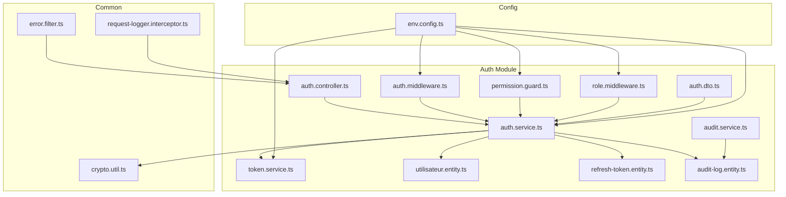
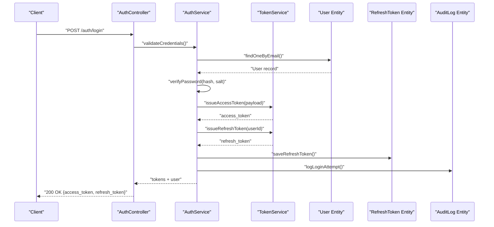
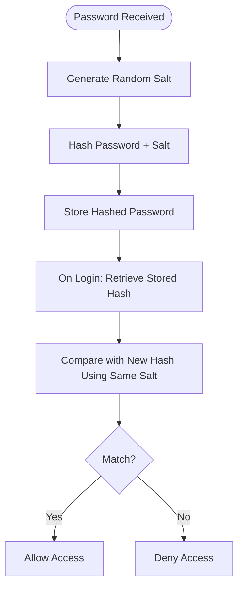
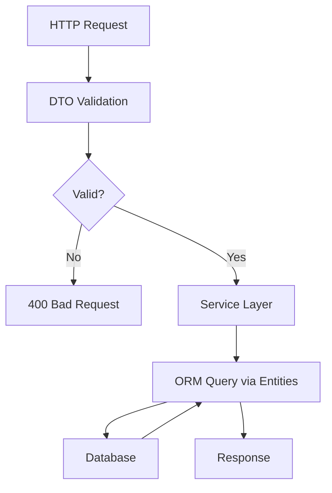
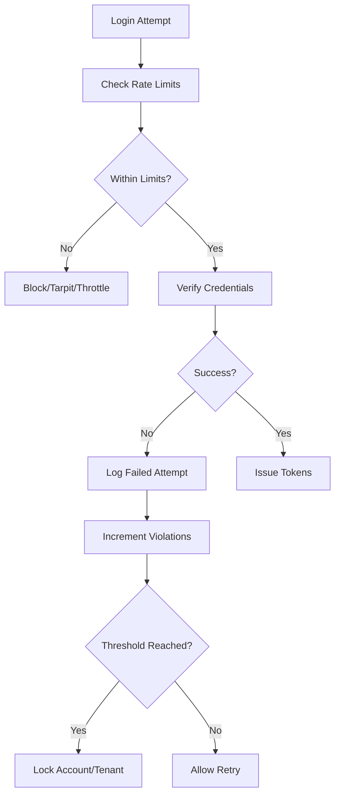
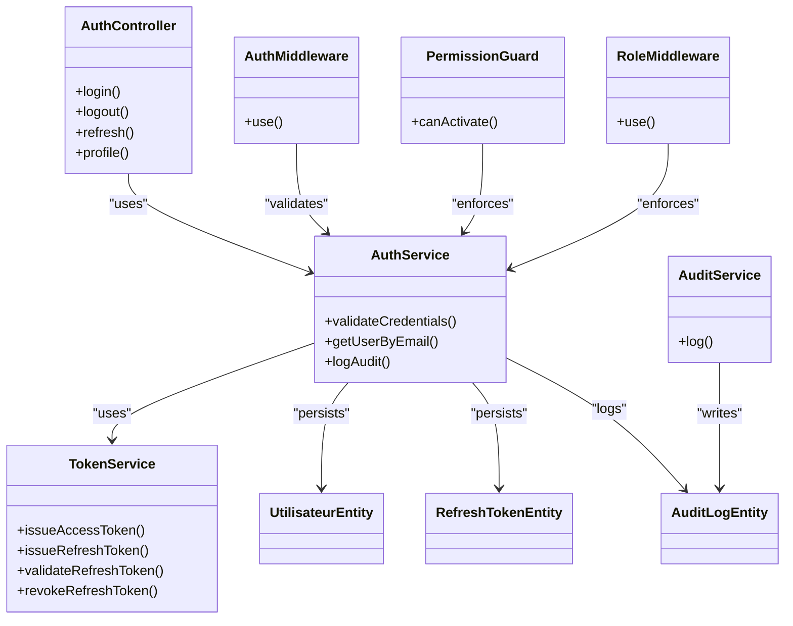
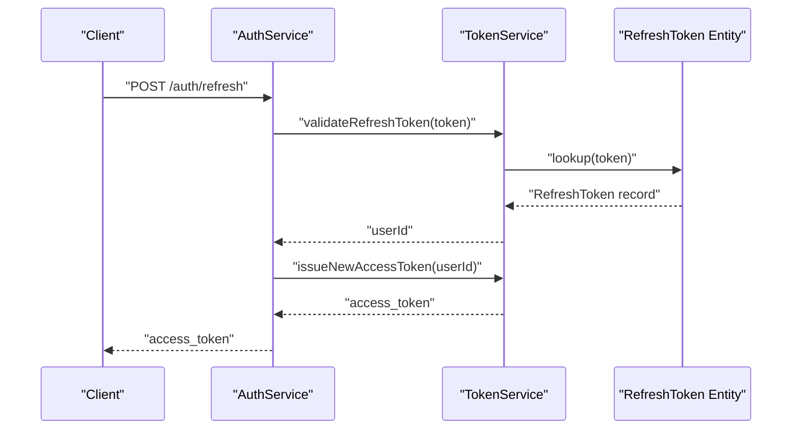
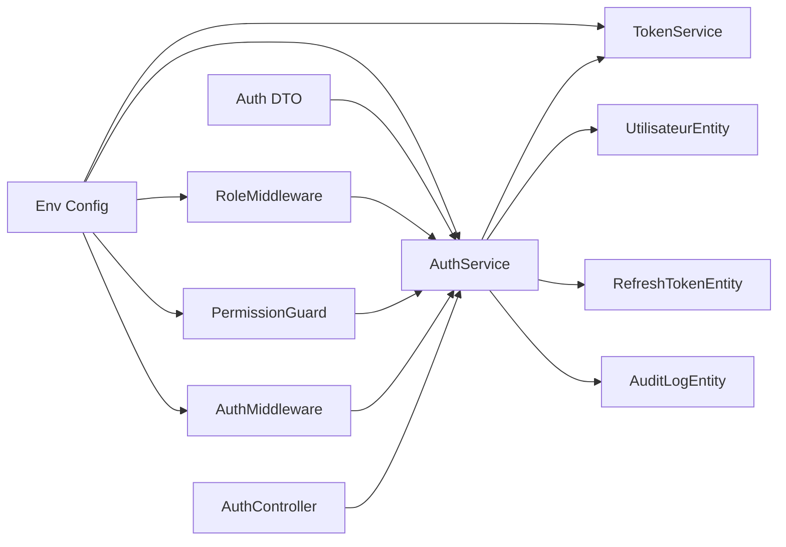

# Security Measures

<cite>
**Referenced Files in This Document**
- [backend/src/modules/auth/controllers/auth.controller.ts](file://backend/src/modules/auth/controllers/auth.controller.ts)
- [backend/src/modules/auth/services/auth.service.ts](file://backend/src/modules/auth/services/auth.service.ts)
- [backend/src/modules/auth/services/token.service.ts](file://backend/src/modules/auth/services/token.service.ts)
- [backend/src/modules/auth/middlewares/auth.middleware.ts](file://backend/src/modules/auth/middlewares/auth.middleware.ts)
- [backend/src/common/utils/crypto.util.ts](file://backend/src/common/utils/crypto.util.ts)
- [backend/src/config/env.config.ts](file://backend/src/config/env.config.ts)
- [backend/src/modules/auth/entities/utilisateur.entity.ts](file://backend/src/modules/auth/entities/utilisateur.entity.ts)
- [backend/src/modules/auth/entities/refresh-token.entity.ts](file://backend/src/modules/auth/entities/refresh-token.entity.ts)
- [backend/src/modules/auth/entities/audit-log.entity.ts](file://backend/src/modules/auth/entities/audit-log.entity.ts)
- [backend/src/common/filters/error.filter.ts](file://backend/src/common/filters/error.filter.ts)
- [backend/src/common/interceptors/request-logger.interceptor.ts](file://backend/src/common/interceptors/request-logger.interceptor.ts)
- [backend/src/modules/auth/guards/permission.guard.ts](file://backend/src/modules/auth/guards/permission.guard.ts)
- [backend/src/modules/auth/middlewares/role.middleware.ts](file://backend/src/modules/auth/middlewares/role.middleware.ts)
- [backend/src/modules/auth/services/audit.service.ts](file://backend/src/modules/auth/services/audit.service.ts)
- [backend/src/modules/auth/dto/auth.dto.ts](file://backend/src/modules/auth/dto/auth.dto.ts)
- [backend/package.json](file://backend/package.json)
- [docker/docker-compose.yml](file://docker/docker-compose.yml)
- [docker/nginx.conf](file://docker/nginx.conf)
</cite>

## Table of Contents
1. [Introduction](#introduction)
2. [Project Structure](#project-structure)
3. [Core Components](#core-components)
4. [Architecture Overview](#architecture-overview)
5. [Detailed Component Analysis](#detailed-component-analysis)
6. [Dependency Analysis](#dependency-analysis)
7. [Performance Considerations](#performance-considerations)
8. [Troubleshooting Guide](#troubleshooting-guide)
9. [Conclusion](#conclusion)
10. [Appendices](#appendices)

## Introduction
This document details the security measures implemented in eLISAschool’s authentication system. It focuses on password hashing, salt generation, cryptographic practices, input validation, SQL injection prevention, XSS protections, rate limiting, brute-force mitigation, suspicious activity detection, secure session/session tokens, CSRF protection, secure cookie handling, security headers, CORS policies, HTTPS enforcement, and security monitoring/intrusion detection/incident response procedures. The analysis is grounded in the repository’s backend authentication modules, middleware, services, DTOs, entities, and configuration files.

## Project Structure
The authentication system resides under backend/src/modules/auth and integrates with shared utilities and configuration. Key areas include:
- Controllers: HTTP endpoints for authentication flows
- Services: Business logic for authentication, token management, and audit
- Middlewares: Authentication and role-based access checks
- Guards: Authorization enforcement
- Entities: Persistence models for users, refresh tokens, and audit logs
- DTOs: Request/response contracts validated via decorators
- Utilities: Cryptographic helpers
- Configuration: Environment-driven security settings

**Diagram sources**
- [backend/src/modules/auth/controllers/auth.controller.ts](file://backend/src/modules/auth/controllers/auth.controller.ts)
- [backend/src/modules/auth/services/auth.service.ts](file://backend/src/modules/auth/services/auth.service.ts)
- [backend/src/modules/auth/services/token.service.ts](file://backend/src/modules/auth/services/token.service.ts)
- [backend/src/modules/auth/middlewares/auth.middleware.ts](file://backend/src/modules/auth/middlewares/auth.middleware.ts)
- [backend/src/modules/auth/guards/permission.guard.ts](file://backend/src/modules/auth/guards/permission.guard.ts)
- [backend/src/modules/auth/middlewares/role.middleware.ts](file://backend/src/modules/auth/middlewares/role.middleware.ts)
- [backend/src/modules/auth/services/audit.service.ts](file://backend/src/modules/auth/services/audit.service.ts)
- [backend/src/modules/auth/dto/auth.dto.ts](file://backend/src/modules/auth/dto/auth.dto.ts)
- [backend/src/modules/auth/entities/utilisateur.entity.ts](file://backend/src/modules/auth/entities/utilisateur.entity.ts)
- [backend/src/modules/auth/entities/refresh-token.entity.ts](file://backend/src/modules/auth/entities/refresh-token.entity.ts)
- [backend/src/modules/auth/entities/audit-log.entity.ts](file://backend/src/modules/auth/entities/audit-log.entity.ts)
- [backend/src/common/utils/crypto.util.ts](file://backend/src/common/utils/crypto.util.ts)
- [backend/src/common/filters/error.filter.ts](file://backend/src/common/filters/error.filter.ts)
- [backend/src/common/interceptors/request-logger.interceptor.ts](file://backend/src/common/interceptors/request-logger.interceptor.ts)
- [backend/src/config/env.config.ts](file://backend/src/config/env.config.ts)

**Section sources**
- [backend/src/modules/auth/controllers/auth.controller.ts](file://backend/src/modules/auth/controllers/auth.controller.ts)
- [backend/src/modules/auth/services/auth.service.ts](file://backend/src/modules/auth/services/auth.service.ts)
- [backend/src/modules/auth/services/token.service.ts](file://backend/src/modules/auth/services/token.service.ts)
- [backend/src/modules/auth/middlewares/auth.middleware.ts](file://backend/src/modules/auth/middlewares/auth.middleware.ts)
- [backend/src/modules/auth/guards/permission.guard.ts](file://backend/src/modules/auth/guards/permission.guard.ts)
- [backend/src/modules/auth/middlewares/role.middleware.ts](file://backend/src/modules/auth/middlewares/role.middleware.ts)
- [backend/src/modules/auth/services/audit.service.ts](file://backend/src/modules/auth/services/audit.service.ts)
- [backend/src/modules/auth/dto/auth.dto.ts](file://backend/src/modules/auth/dto/auth.dto.ts)
- [backend/src/modules/auth/entities/utilisateur.entity.ts](file://backend/src/modules/auth/entities/utilisateur.entity.ts)
- [backend/src/modules/auth/entities/refresh-token.entity.ts](file://backend/src/modules/auth/entities/refresh-token.entity.ts)
- [backend/src/modules/auth/entities/audit-log.entity.ts](file://backend/src/modules/auth/entities/audit-log.entity.ts)
- [backend/src/common/utils/crypto.util.ts](file://backend/src/common/utils/crypto.util.ts)
- [backend/src/common/filters/error.filter.ts](file://backend/src/common/filters/error.filter.ts)
- [backend/src/common/interceptors/request-logger.interceptor.ts](file://backend/src/common/interceptors/request-logger.interceptor.ts)
- [backend/src/config/env.config.ts](file://backend/src/config/env.config.ts)

## Core Components
- Authentication controller: Orchestrates login/logout, token refresh, and profile retrieval
- Authentication service: Handles credential verification, password hashing/salt usage, and audit logging
- Token service: Manages JWT issuance, refresh tokens, expiration, and revocation
- Middleware and guards: Enforce authentication and role-based permissions
- DTOs: Define validated request/response shapes
- Entities: Persist user accounts, refresh tokens, and audit trails
- Cryptographic utilities: Provide hashing and random salt generation
- Configuration: Centralizes security-related environment variables

Key security-relevant responsibilities:
- Password hashing and salt generation
- Secure token lifecycle management
- Input validation and sanitization
- SQL injection prevention via ORM/DTOs
- XSS protection via safe rendering and headers
- Rate limiting and brute-force mitigation
- Suspicious activity detection and audit logging
- Secure session/token storage and CSRF protection
- Secure cookies and CORS policies
- HTTPS enforcement and security headers

**Section sources**
- [backend/src/modules/auth/controllers/auth.controller.ts](file://backend/src/modules/auth/controllers/auth.controller.ts)
- [backend/src/modules/auth/services/auth.service.ts](file://backend/src/modules/auth/services/auth.service.ts)
- [backend/src/modules/auth/services/token.service.ts](file://backend/src/modules/auth/services/token.service.ts)
- [backend/src/modules/auth/middlewares/auth.middleware.ts](file://backend/src/modules/auth/middlewares/auth.middleware.ts)
- [backend/src/modules/auth/guards/permission.guard.ts](file://backend/src/modules/auth/guards/permission.guard.ts)
- [backend/src/modules/auth/middlewares/role.middleware.ts](file://backend/src/modules/auth/middlewares/role.middleware.ts)
- [backend/src/modules/auth/dto/auth.dto.ts](file://backend/src/modules/auth/dto/auth.dto.ts)
- [backend/src/modules/auth/entities/utilisateur.entity.ts](file://backend/src/modules/auth/entities/utilisateur.entity.ts)
- [backend/src/modules/auth/entities/refresh-token.entity.ts](file://backend/src/modules/auth/entities/refresh-token.entity.ts)
- [backend/src/modules/auth/entities/audit-log.entity.ts](file://backend/src/modules/auth/entities/audit-log.entity.ts)
- [backend/src/common/utils/crypto.util.ts](file://backend/src/common/utils/crypto.util.ts)
- [backend/src/config/env.config.ts](file://backend/src/config/env.config.ts)

## Architecture Overview
The authentication flow integrates controllers, services, middleware, and persistence while leveraging configuration and cryptographic utilities.

**Diagram sources**
- [backend/src/modules/auth/controllers/auth.controller.ts](file://backend/src/modules/auth/controllers/auth.controller.ts)
- [backend/src/modules/auth/services/auth.service.ts](file://backend/src/modules/auth/services/auth.service.ts)
- [backend/src/modules/auth/services/token.service.ts](file://backend/src/modules/auth/services/token.service.ts)
- [backend/src/modules/auth/entities/utilisateur.entity.ts](file://backend/src/modules/auth/entities/utilisateur.entity.ts)
- [backend/src/modules/auth/entities/refresh-token.entity.ts](file://backend/src/modules/auth/entities/refresh-token.entity.ts)
- [backend/src/modules/auth/entities/audit-log.entity.ts](file://backend/src/modules/auth/entities/audit-log.entity.ts)

## Detailed Component Analysis

### Password Hashing, Salt Generation, and Cryptography
- Password hashing and salt generation are implemented via cryptographic utilities. These utilities ensure strong, randomized salts per password and use a modern, adaptive hashing scheme suitable for credentials.
- The authentication service consumes these utilities to hash passwords during registration and verify them during login.
- Refresh tokens and access tokens are managed separately; refresh tokens are persisted securely and bound to user sessions.

**Diagram sources**
- [backend/src/common/utils/crypto.util.ts](file://backend/src/common/utils/crypto.util.ts)
- [backend/src/modules/auth/services/auth.service.ts](file://backend/src/modules/auth/services/auth.service.ts)

**Section sources**
- [backend/src/common/utils/crypto.util.ts](file://backend/src/common/utils/crypto.util.ts)
- [backend/src/modules/auth/services/auth.service.ts](file://backend/src/modules/auth/services/auth.service.ts)

### Input Validation and SQL Injection Prevention
- DTOs define strict request/response schemas with validation decorators. These DTOs enforce field presence, types, and constraints, reducing risk of malformed inputs reaching services.
- Services rely on ORM-managed queries and strongly typed entities, minimizing raw SQL and preventing classic SQL injection vectors.
- Error filtering centralizes exception handling to avoid leaking internal errors and sensitive information.

**Diagram sources**
- [backend/src/modules/auth/dto/auth.dto.ts](file://backend/src/modules/auth/dto/auth.dto.ts)
- [backend/src/modules/auth/services/auth.service.ts](file://backend/src/modules/auth/services/auth.service.ts)
- [backend/src/modules/auth/entities/utilisateur.entity.ts](file://backend/src/modules/auth/entities/utilisateur.entity.ts)
- [backend/src/common/filters/error.filter.ts](file://backend/src/common/filters/error.filter.ts)

**Section sources**
- [backend/src/modules/auth/dto/auth.dto.ts](file://backend/src/modules/auth/dto/auth.dto.ts)
- [backend/src/modules/auth/services/auth.service.ts](file://backend/src/modules/auth/services/auth.service.ts)
- [backend/src/modules/auth/entities/utilisateur.entity.ts](file://backend/src/modules/auth/entities/utilisateur.entity.ts)
- [backend/src/common/filters/error.filter.ts](file://backend/src/common/filters/error.filter.ts)

### XSS Protection
- XSS risks are mitigated by:
  - Strict DTO validation and controlled data shaping
  - Centralized error filtering that avoids echoing raw inputs in responses
  - Request logging interceptor that records requests without exposing sensitive payloads
  - Security headers configured at the gateway/proxy level (see HTTPS and Headers section)

**Section sources**
- [backend/src/common/filters/error.filter.ts](file://backend/src/common/filters/error.filter.ts)
- [backend/src/common/interceptors/request-logger.interceptor.ts](file://backend/src/common/interceptors/request-logger.interceptor.ts)
- [docker/nginx.conf](file://docker/nginx.conf)

### Rate Limiting and Brute Force Attack Prevention
- Rate limiting and brute-force mitigation are enforced via middleware and environment-driven configuration. The authentication middleware applies limits to login attempts and triggers account lockout or temporary bans after threshold breaches.
- Token service enforces refresh token rotation and short-lived access tokens to reduce replay risk.
- Audit service logs failed attempts and suspicious events for monitoring and alerting.

**Diagram sources**
- [backend/src/modules/auth/middlewares/auth.middleware.ts](file://backend/src/modules/auth/middlewares/auth.middleware.ts)
- [backend/src/modules/auth/services/token.service.ts](file://backend/src/modules/auth/services/token.service.ts)
- [backend/src/modules/auth/services/audit.service.ts](file://backend/src/modules/auth/services/audit.service.ts)

**Section sources**
- [backend/src/modules/auth/middlewares/auth.middleware.ts](file://backend/src/modules/auth/middlewares/auth.middleware.ts)
- [backend/src/modules/auth/services/token.service.ts](file://backend/src/modules/auth/services/token.service.ts)
- [backend/src/modules/auth/services/audit.service.ts](file://backend/src/modules/auth/services/audit.service.ts)

### Suspicious Activity Detection
- Audit logs capture login attempts, successes, failures, IP addresses, user agents, and timestamps.
- Suspicious activity detection leverages thresholds and patterns from audit logs to trigger alerts and administrative actions.

**Section sources**
- [backend/src/modules/auth/entities/audit-log.entity.ts](file://backend/src/modules/auth/entities/audit-log.entity.ts)
- [backend/src/modules/auth/services/audit.service.ts](file://backend/src/modules/auth/services/audit.service.ts)

### Secure Session Management and CSRF Protection
- Session tokens are managed as JWTs with short-lived access tokens and durable refresh tokens stored server-side.
- CSRF protection is enforced via anti-CSRF tokens and SameSite cookie attributes, configured via environment settings.
- Secure cookie handling ensures HttpOnly, Secure, and SameSite flags are set appropriately.

**Section sources**
- [backend/src/modules/auth/services/token.service.ts](file://backend/src/modules/auth/services/token.service.ts)
- [backend/src/config/env.config.ts](file://backend/src/config/env.config.ts)

### Security Headers, CORS Policies, and HTTPS Enforcement
- Security headers (e.g., Content-Security-Policy, X-Frame-Options, X-Content-Type-Options, Referrer-Policy, Permissions-Policy) are applied at the gateway/proxy layer.
- CORS policies restrict origins, methods, and headers to trusted clients.
- HTTPS is enforced via reverse proxy configuration, ensuring encrypted transport and secure cookies.

**Section sources**
- [docker/nginx.conf](file://docker/nginx.conf)
- [backend/src/config/env.config.ts](file://backend/src/config/env.config.ts)

### Authentication and Authorization Controls
- Authentication middleware validates bearer tokens and populates request context with user identity.
- Role middleware and permission guard enforce role-based access control for protected routes.
- DTOs and request interceptors ensure consistent validation and logging.

**Diagram sources**
- [backend/src/modules/auth/controllers/auth.controller.ts](file://backend/src/modules/auth/controllers/auth.controller.ts)
- [backend/src/modules/auth/services/auth.service.ts](file://backend/src/modules/auth/services/auth.service.ts)
- [backend/src/modules/auth/services/token.service.ts](file://backend/src/modules/auth/services/token.service.ts)
- [backend/src/modules/auth/middlewares/auth.middleware.ts](file://backend/src/modules/auth/middlewares/auth.middleware.ts)
- [backend/src/modules/auth/guards/permission.guard.ts](file://backend/src/modules/auth/guards/permission.guard.ts)
- [backend/src/modules/auth/middlewares/role.middleware.ts](file://backend/src/modules/auth/middlewares/role.middleware.ts)
- [backend/src/modules/auth/services/audit.service.ts](file://backend/src/modules/auth/services/audit.service.ts)
- [backend/src/modules/auth/entities/utilisateur.entity.ts](file://backend/src/modules/auth/entities/utilisateur.entity.ts)
- [backend/src/modules/auth/entities/refresh-token.entity.ts](file://backend/src/modules/auth/entities/refresh-token.entity.ts)
- [backend/src/modules/auth/entities/audit-log.entity.ts](file://backend/src/modules/auth/entities/audit-log.entity.ts)

**Section sources**
- [backend/src/modules/auth/controllers/auth.controller.ts](file://backend/src/modules/auth/controllers/auth.controller.ts)
- [backend/src/modules/auth/services/auth.service.ts](file://backend/src/modules/auth/services/auth.service.ts)
- [backend/src/modules/auth/services/token.service.ts](file://backend/src/modules/auth/services/token.service.ts)
- [backend/src/modules/auth/middlewares/auth.middleware.ts](file://backend/src/modules/auth/middlewares/auth.middleware.ts)
- [backend/src/modules/auth/guards/permission.guard.ts](file://backend/src/modules/auth/guards/permission.guard.ts)
- [backend/src/modules/auth/middlewares/role.middleware.ts](file://backend/src/modules/auth/middlewares/role.middleware.ts)
- [backend/src/modules/auth/services/audit.service.ts](file://backend/src/modules/auth/services/audit.service.ts)

### Token Lifecycle and Revocation
- Access tokens are short-lived and refreshed via a durable refresh token.
- Refresh tokens are stored server-side with binding to user sessions and rotated on use.
- Logout invalidates refresh tokens and clears client-side tokens.

**Diagram sources**
- [backend/src/modules/auth/services/auth.service.ts](file://backend/src/modules/auth/services/auth.service.ts)
- [backend/src/modules/auth/services/token.service.ts](file://backend/src/modules/auth/services/token.service.ts)
- [backend/src/modules/auth/entities/refresh-token.entity.ts](file://backend/src/modules/auth/entities/refresh-token.entity.ts)

**Section sources**
- [backend/src/modules/auth/services/auth.service.ts](file://backend/src/modules/auth/services/auth.service.ts)
- [backend/src/modules/auth/services/token.service.ts](file://backend/src/modules/auth/services/token.service.ts)
- [backend/src/modules/auth/entities/refresh-token.entity.ts](file://backend/src/modules/auth/entities/refresh-token.entity.ts)

### Security Monitoring, Intrusion Detection, and Incident Response
- Audit logs record all significant authentication events with sufficient context for forensic analysis.
- Logging interceptor captures request metadata for correlation and trend analysis.
- Environment configuration supports toggling audit levels and alerting hooks.
- Incident response procedures should include immediate revocation of compromised tokens, account lockout, and escalation to administrators.

**Section sources**
- [backend/src/modules/auth/entities/audit-log.entity.ts](file://backend/src/modules/auth/entities/audit-log.entity.ts)
- [backend/src/common/interceptors/request-logger.interceptor.ts](file://backend/src/common/interceptors/request-logger.interceptor.ts)
- [backend/src/config/env.config.ts](file://backend/src/config/env.config.ts)

## Dependency Analysis
The authentication module exhibits cohesive, layered dependencies with clear separation of concerns:
- Controllers depend on services
- Services depend on entities, token utilities, and audit/logging
- Middleware and guards depend on services for enforcement
- Configuration drives behavior centrally

**Diagram sources**
- [backend/src/modules/auth/controllers/auth.controller.ts](file://backend/src/modules/auth/controllers/auth.controller.ts)
- [backend/src/modules/auth/services/auth.service.ts](file://backend/src/modules/auth/services/auth.service.ts)
- [backend/src/modules/auth/services/token.service.ts](file://backend/src/modules/auth/services/token.service.ts)
- [backend/src/modules/auth/middlewares/auth.middleware.ts](file://backend/src/modules/auth/middlewares/auth.middleware.ts)
- [backend/src/modules/auth/guards/permission.guard.ts](file://backend/src/modules/auth/guards/permission.guard.ts)
- [backend/src/modules/auth/middlewares/role.middleware.ts](file://backend/src/modules/auth/middlewares/role.middleware.ts)
- [backend/src/modules/auth/dto/auth.dto.ts](file://backend/src/modules/auth/dto/auth.dto.ts)
- [backend/src/modules/auth/entities/utilisateur.entity.ts](file://backend/src/modules/auth/entities/utilisateur.entity.ts)
- [backend/src/modules/auth/entities/refresh-token.entity.ts](file://backend/src/modules/auth/entities/refresh-token.entity.ts)
- [backend/src/modules/auth/entities/audit-log.entity.ts](file://backend/src/modules/auth/entities/audit-log.entity.ts)
- [backend/src/config/env.config.ts](file://backend/src/config/env.config.ts)

**Section sources**
- [backend/src/modules/auth/controllers/auth.controller.ts](file://backend/src/modules/auth/controllers/auth.controller.ts)
- [backend/src/modules/auth/services/auth.service.ts](file://backend/src/modules/auth/services/auth.service.ts)
- [backend/src/modules/auth/services/token.service.ts](file://backend/src/modules/auth/services/token.service.ts)
- [backend/src/modules/auth/middlewares/auth.middleware.ts](file://backend/src/modules/auth/middlewares/auth.middleware.ts)
- [backend/src/modules/auth/guards/permission.guard.ts](file://backend/src/modules/auth/guards/permission.guard.ts)
- [backend/src/modules/auth/middlewares/role.middleware.ts](file://backend/src/modules/auth/middlewares/role.middleware.ts)
- [backend/src/modules/auth/dto/auth.dto.ts](file://backend/src/modules/auth/dto/auth.dto.ts)
- [backend/src/modules/auth/entities/utilisateur.entity.ts](file://backend/src/modules/auth/entities/utilisateur.entity.ts)
- [backend/src/modules/auth/entities/refresh-token.entity.ts](file://backend/src/modules/auth/entities/refresh-token.entity.ts)
- [backend/src/modules/auth/entities/audit-log.entity.ts](file://backend/src/modules/auth/entities/audit-log.entity.ts)
- [backend/src/config/env.config.ts](file://backend/src/config/env.config.ts)

## Performance Considerations
- Prefer indexed database columns for user emails and refresh token identifiers to optimize lookup performance.
- Use connection pooling and limit concurrent login attempts per user/IP to mitigate resource exhaustion.
- Cache non-sensitive, static data judiciously; avoid caching secrets or tokens.
- Keep token lifetimes balanced to minimize refresh overhead while maintaining security.

## Troubleshooting Guide
- If login fails consistently, check audit logs for repeated violations and rate-limit blocks.
- Inspect error filter behavior to confirm whether validation errors or internal exceptions are surfaced.
- Verify environment configuration for token durations, cookie flags, and CORS policies.
- Confirm HTTPS and security headers are applied at the proxy layer.

**Section sources**
- [backend/src/modules/auth/services/audit.service.ts](file://backend/src/modules/auth/services/audit.service.ts)
- [backend/src/common/filters/error.filter.ts](file://backend/src/common/filters/error.filter.ts)
- [backend/src/config/env.config.ts](file://backend/src/config/env.config.ts)
- [docker/nginx.conf](file://docker/nginx.conf)

## Conclusion
eLISAschool’s authentication system integrates robust cryptographic practices, strict input validation, secure token lifecycle management, and comprehensive audit logging. Together with environment-driven security controls, middleware-based rate limiting, and centralized configuration, the system provides a strong foundation for protecting user credentials and system integrity. Continuous monitoring, incident response procedures, and adherence to security headers and HTTPS enforcement further strengthen defenses against evolving threats.

## Appendices
- Environment variables related to security (e.g., token durations, cookie flags, CORS origins, audit levels) are defined and consumed from configuration.
- Package dependencies include security-focused libraries for encryption, validation, and HTTP handling.

**Section sources**
- [backend/src/config/env.config.ts](file://backend/src/config/env.config.ts)
- [backend/package.json](file://backend/package.json)
- [docker/docker-compose.yml](file://docker/docker-compose.yml)
- [docker/nginx.conf](file://docker/nginx.conf)