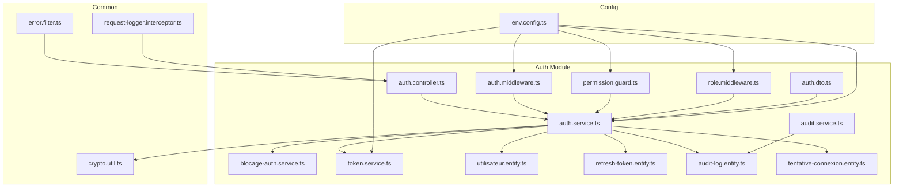
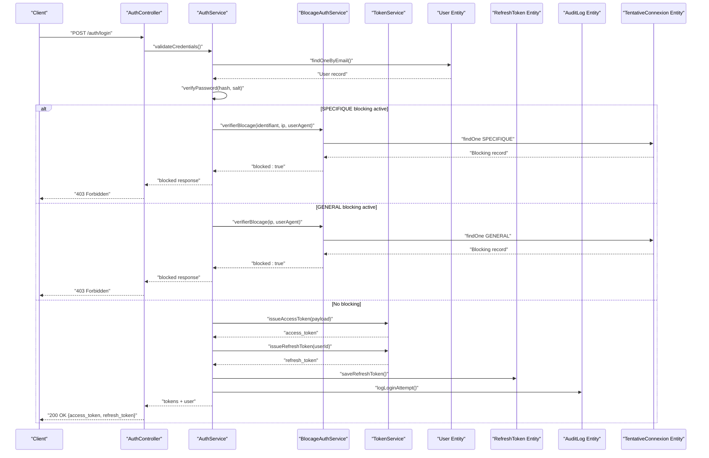
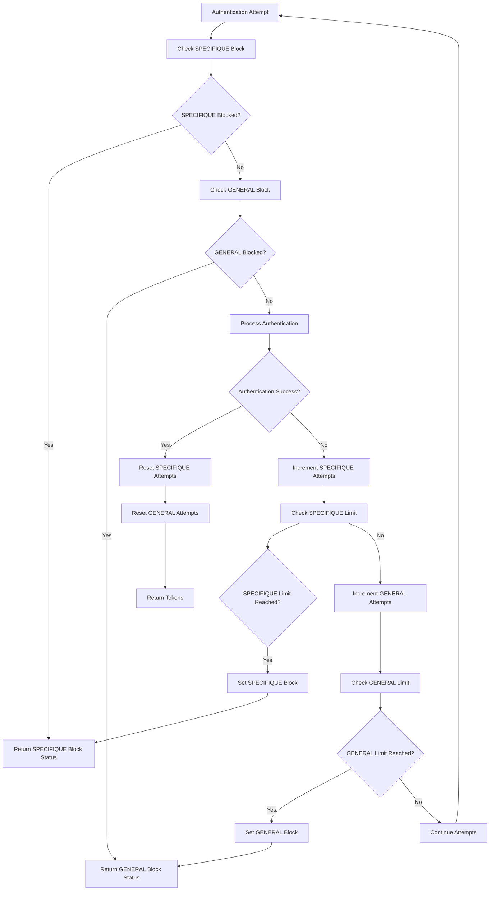
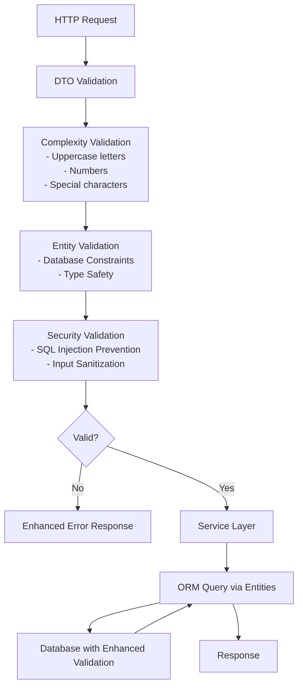
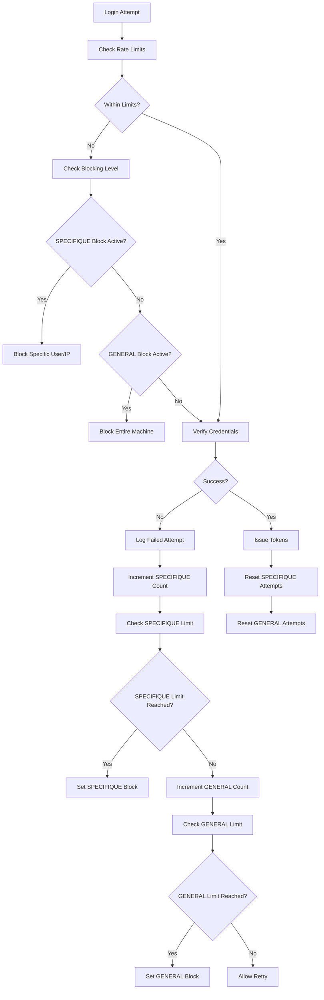
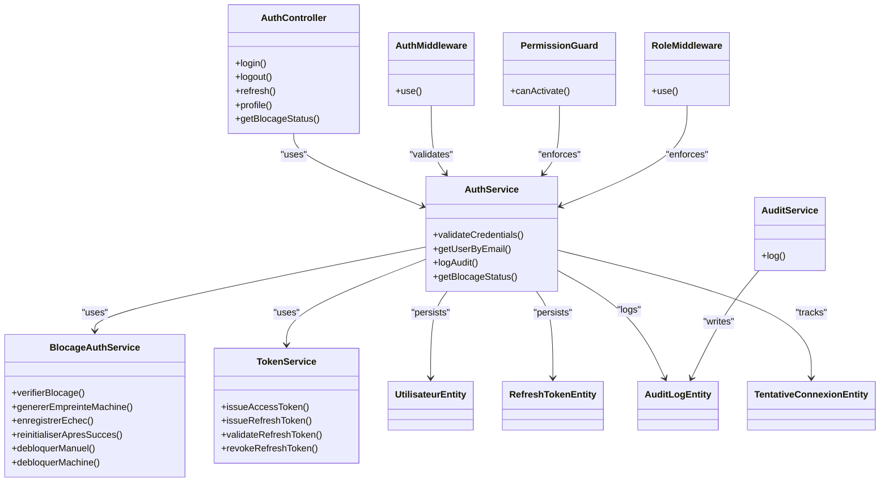
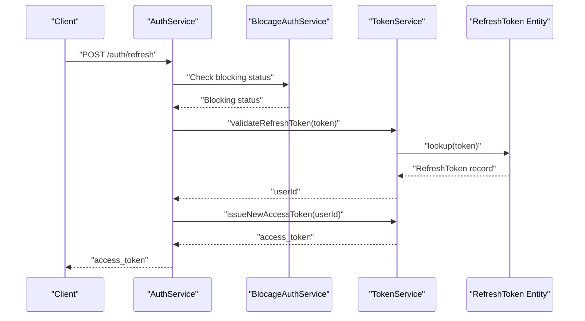
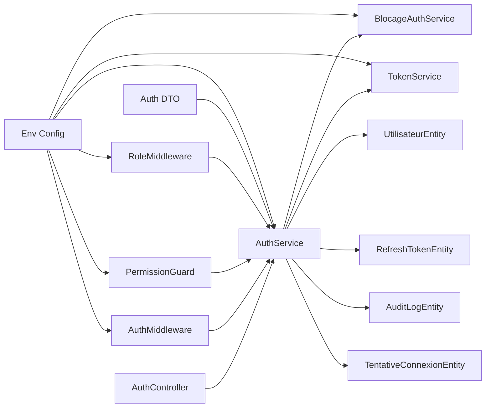

# Security Measures

<cite>
**Referenced Files in This Document**
- [backend/src/modules/auth/controllers/auth.controller.ts](file://backend/src/modules/auth/controllers/auth.controller.ts)
- [backend/src/modules/auth/services/auth.service.ts](file://backend/src/modules/auth/services/auth.service.ts)
- [backend/src/modules/auth/services/blocage-auth.service.ts](file://backend/src/modules/auth/services/blocage-auth.service.ts)
- [backend/src/modules/auth/services/token.service.ts](file://backend/src/modules/auth/services/token.service.ts)
- [backend/src/modules/auth/middlewares/auth.middleware.ts](file://backend/src/modules/auth/middlewares/auth.middleware.ts)
- [backend/src/common/utils/crypto.util.ts](file://backend/src/common/utils/crypto.util.ts)
- [backend/src/config/env.config.ts](file://backend/src/config/env.config.ts)
- [backend/src/modules/auth/entities/utilisateur.entity.ts](file://backend/src/modules/auth/entities/utilisateur.entity.ts)
- [backend/src/modules/auth/entities/refresh-token.entity.ts](file://backend/src/modules/auth/entities/refresh-token.entity.ts)
- [backend/src/modules/auth/entities/audit-log.entity.ts](file://backend/src/modules/auth/entities/audit-log.entity.ts)
- [backend/src/modules/auth/entities/tentative-connexion.entity.ts](file://backend/src/modules/auth/entities/tentative-connexion.entity.ts)
- [backend/src/common/filters/error.filter.ts](file://backend/src/common/filters/error.filter.ts)
- [backend/src/common/interceptors/request-logger.interceptor.ts](file://backend/src/common/interceptors/request-logger.interceptor.ts)
- [backend/src/modules/auth/guards/permission.guard.ts](file://backend/src/modules/auth/guards/permission.guard.ts)
- [backend/src/modules/auth/middlewares/role.middleware.ts](file://backend/src/modules/auth/middlewares/role.middleware.ts)
- [backend/src/modules/auth/services/audit.service.ts](file://backend/src/modules/auth/services/audit.service.ts)
- [backend/src/modules/auth/dto/auth.dto.ts](file://backend/src/modules/auth/dto/auth.dto.ts)
- [backend/package.json](file://backend/package.json)
- [docker/docker-compose.yml](file://docker/docker-compose.yml)
- [docker/nginx.conf](file://docker/nginx.conf)
</cite>

## Update Summary
**Changes Made**
- Enhanced authentication security with two-level blocking system featuring SPECIFIQUE and GENERAL blocking modes
- Added machine fingerprinting capabilities using SHA-256 hashing of user agent and IP address combinations
- Implemented comprehensive SQL injection prevention through enhanced entity validation and migration improvements
- Introduced new BlocageAuthService for advanced blocking management and monitoring
- Enhanced audit logging with detailed blocking status information
- Added polling mechanism for real-time blocking status updates

## Table of Contents
1. [Introduction](#introduction)
2. [Project Structure](#project-structure)
3. [Core Components](#core-components)
4. [Architecture Overview](#architecture-overview)
5. [Detailed Component Analysis](#detailed-component-analysis)
6. [Dependency Analysis](#dependency-analysis)
7. [Performance Considerations](#performance-considerations)
8. [Troubleshooting Guide](#troubleshooting-guide)
9. [Conclusion](#conclusion)
10. [Appendices](#appendices)

## Introduction
This document details the security measures implemented in eLISAschool's authentication system. It focuses on password hashing, salt generation, cryptographic practices, input validation, SQL injection prevention, XSS protections, rate limiting, brute-force mitigation, suspicious activity detection, secure session/session tokens, CSRF protection, secure cookie handling, security headers, CORS policies, HTTPS enforcement, and security monitoring/intrusion detection/incident response procedures. The analysis is grounded in the repository's backend authentication modules, middleware, services, DTOs, entities, and configuration files.

**Updated** Enhanced authentication security now includes a sophisticated two-level blocking system with SPECIFIQUE and GENERAL blocking modes, machine fingerprinting capabilities, comprehensive SQL injection prevention, and advanced audit logging through the new BlocageAuthService.

## Project Structure
The authentication system resides under backend/src/modules/auth and integrates with shared utilities and configuration. Key areas include:
- Controllers: HTTP endpoints for authentication flows
- Services: Business logic for authentication, token management, audit, and blocking management
- Middlewares: Authentication and role-based access checks
- Guards: Authorization enforcement
- Entities: Persistence models for users, refresh tokens, audit logs, and connection attempts
- DTOs: Request/response contracts validated via decorators
- Utilities: Cryptographic helpers
- Configuration: Environment-driven security settings

**Diagram sources**
- [backend/src/modules/auth/controllers/auth.controller.ts](file://backend/src/modules/auth/controllers/auth.controller.ts)
- [backend/src/modules/auth/services/auth.service.ts](file://backend/src/modules/auth/services/auth.service.ts)
- [backend/src/modules/auth/services/blocage-auth.service.ts](file://backend/src/modules/auth/services/blocage-auth.service.ts)
- [backend/src/modules/auth/services/token.service.ts](file://backend/src/modules/auth/services/token.service.ts)
- [backend/src/modules/auth/middlewares/auth.middleware.ts](file://backend/src/modules/auth/middlewares/auth.middleware.ts)
- [backend/src/modules/auth/guards/permission.guard.ts](file://backend/src/modules/auth/guards/permission.guard.ts)
- [backend/src/modules/auth/middlewares/role.middleware.ts](file://backend/src/modules/auth/middlewares/role.middleware.ts)
- [backend/src/modules/auth/services/audit.service.ts](file://backend/src/modules/auth/services/audit.service.ts)
- [backend/src/modules/auth/dto/auth.dto.ts](file://backend/src/modules/auth/dto/auth.dto.ts)
- [backend/src/modules/auth/entities/utilisateur.entity.ts](file://backend/src/modules/auth/entities/utilisateur.entity.ts)
- [backend/src/modules/auth/entities/refresh-token.entity.ts](file://backend/src/modules/auth/entities/refresh-token.entity.ts)
- [backend/src/modules/auth/entities/audit-log.entity.ts](file://backend/src/modules/auth/entities/audit-log.entity.ts)
- [backend/src/modules/auth/entities/tentative-connexion.entity.ts](file://backend/src/modules/auth/entities/tentative-connexion.entity.ts)
- [backend/src/common/utils/crypto.util.ts](file://backend/src/common/utils/crypto.util.ts)
- [backend/src/common/filters/error.filter.ts](file://backend/src/common/filters/error.filter.ts)
- [backend/src/common/interceptors/request-logger.interceptor.ts](file://backend/src/common/interceptors/request-logger.interceptor.ts)
- [backend/src/config/env.config.ts](file://backend/src/config/env.config.ts)

**Section sources**
- [backend/src/modules/auth/controllers/auth.controller.ts](file://backend/src/modules/auth/controllers/auth.controller.ts)
- [backend/src/modules/auth/services/auth.service.ts](file://backend/src/modules/auth/services/auth.service.ts)
- [backend/src/modules/auth/services/blocage-auth.service.ts](file://backend/src/modules/auth/services/blocage-auth.service.ts)
- [backend/src/modules/auth/services/token.service.ts](file://backend/src/modules/auth/services/token.service.ts)
- [backend/src/modules/auth/middlewares/auth.middleware.ts](file://backend/src/modules/auth/middlewares/auth.middleware.ts)
- [backend/src/modules/auth/guards/permission.guard.ts](file://backend/src/modules/auth/guards/permission.guard.ts)
- [backend/src/modules/auth/middlewares/role.middleware.ts](file://backend/src/modules/auth/middlewares/role.middleware.ts)
- [backend/src/modules/auth/services/audit.service.ts](file://backend/src/modules/auth/services/audit.service.ts)
- [backend/src/modules/auth/dto/auth.dto.ts](file://backend/src/modules/auth/dto/auth.dto.ts)
- [backend/src/modules/auth/entities/utilisateur.entity.ts](file://backend/src/modules/auth/entities/utilisateur.entity.ts)
- [backend/src/modules/auth/entities/refresh-token.entity.ts](file://backend/src/modules/auth/entities/refresh-token.entity.ts)
- [backend/src/modules/auth/entities/audit-log.entity.ts](file://backend/src/modules/auth/entities/audit-log.entity.ts)
- [backend/src/modules/auth/entities/tentative-connexion.entity.ts](file://backend/src/modules/auth/entities/tentative-connexion.entity.ts)
- [backend/src/common/utils/crypto.util.ts](file://backend/src/common/utils/crypto.util.ts)
- [backend/src/common/filters/error.filter.ts](file://backend/src/common/filters/error.filter.ts)
- [backend/src/common/interceptors/request-logger.interceptor.ts](file://backend/src/common/interceptors/request-logger.interceptor.ts)
- [backend/src/config/env.config.ts](file://backend/src/config/env.config.ts)

## Core Components
- Authentication controller: Orchestrates login/logout, token refresh, and profile retrieval
- Authentication service: Handles credential verification, password hashing/salt usage, and audit logging
- BlocageAuthService: Manages two-level blocking system with SPECIFIQUE and GENERAL blocking modes and machine fingerprinting
- Token service: Manages JWT issuance, refresh tokens, expiration, and revocation
- Middleware and guards: Enforce authentication and role-based permissions
- DTOs: Define validated request/response shapes
- Entities: Persist user accounts, refresh tokens, audit trails, and connection attempt tracking
- Cryptographic utilities: Provide hashing and random salt generation
- Configuration: Centralizes security-related environment variables

Key security-relevant responsibilities:
- Password hashing and salt generation
- Secure token lifecycle management
- Input validation and sanitization
- SQL injection prevention via ORM/DTOs and enhanced entity validation
- XSS protection via safe rendering and headers
- Two-level rate limiting and brute-force mitigation with SPECIFIQUE and GENERAL blocking modes
- Machine fingerprinting for advanced threat detection
- Suspicious activity detection and comprehensive audit logging
- Secure session/token storage and CSRF protection
- Secure cookies and CORS policies
- HTTPS enforcement and security headers

**Updated** Enhanced with sophisticated two-level blocking system, machine fingerprinting capabilities, and comprehensive SQL injection prevention through improved entity validation.

**Section sources**
- [backend/src/modules/auth/controllers/auth.controller.ts](file://backend/src/modules/auth/controllers/auth.controller.ts)
- [backend/src/modules/auth/services/auth.service.ts](file://backend/src/modules/auth/services/auth.service.ts)
- [backend/src/modules/auth/services/blocage-auth.service.ts](file://backend/src/modules/auth/services/blocage-auth.service.ts)
- [backend/src/modules/auth/services/token.service.ts](file://backend/src/modules/auth/services/token.service.ts)
- [backend/src/modules/auth/middlewares/auth.middleware.ts](file://backend/src/modules/auth/middlewares/auth.middleware.ts)
- [backend/src/modules/auth/guards/permission.guard.ts](file://backend/src/modules/auth/guards/permission.guard.ts)
- [backend/src/modules/auth/middlewares/role.middleware.ts](file://backend/src/modules/auth/middlewares/role.middleware.ts)
- [backend/src/modules/auth/dto/auth.dto.ts](file://backend/src/modules/auth/dto/auth.dto.ts)
- [backend/src/modules/auth/entities/utilisateur.entity.ts](file://backend/src/modules/auth/entities/utilisateur.entity.ts)
- [backend/src/modules/auth/entities/refresh-token.entity.ts](file://backend/src/modules/auth/entities/refresh-token.entity.ts)
- [backend/src/modules/auth/entities/audit-log.entity.ts](file://backend/src/modules/auth/entities/audit-log.entity.ts)
- [backend/src/modules/auth/entities/tentative-connexion.entity.ts](file://backend/src/modules/auth/entities/tentative-connexion.entity.ts)
- [backend/src/common/utils/crypto.util.ts](file://backend/src/common/utils/crypto.util.ts)
- [backend/src/config/env.config.ts](file://backend/src/config/env.config.ts)

## Architecture Overview
The authentication flow integrates controllers, services, middleware, and persistence while leveraging configuration and cryptographic utilities. The new two-level blocking system adds an additional layer of security through SPECIFIQUE and GENERAL blocking modes with machine fingerprinting.

**Diagram sources**
- [backend/src/modules/auth/controllers/auth.controller.ts](file://backend/src/modules/auth/controllers/auth.controller.ts)
- [backend/src/modules/auth/services/auth.service.ts](file://backend/src/modules/auth/services/auth.service.ts)
- [backend/src/modules/auth/services/blocage-auth.service.ts](file://backend/src/modules/auth/services/blocage-auth.service.ts)
- [backend/src/modules/auth/services/token.service.ts](file://backend/src/modules/auth/services/token.service.ts)
- [backend/src/modules/auth/entities/utilisateur.entity.ts](file://backend/src/modules/auth/entities/utilisateur.entity.ts)
- [backend/src/modules/auth/entities/refresh-token.entity.ts](file://backend/src/modules/auth/entities/refresh-token.entity.ts)
- [backend/src/modules/auth/entities/audit-log.entity.ts](file://backend/src/modules/auth/entities/audit-log.entity.ts)
- [backend/src/modules/auth/entities/tentative-connexion.entity.ts](file://backend/src/modules/auth/entities/tentative-connexion.entity.ts)

## Detailed Component Analysis

### Password Hashing, Salt Generation, and Cryptography
- Password hashing and salt generation are implemented via cryptographic utilities. These utilities ensure strong, randomized salts per password and use a modern, adaptive hashing scheme suitable for credentials.
- The authentication service consumes these utilities to hash passwords during registration and verify them during login.
- Refresh tokens and access tokens are managed separately; refresh tokens are persisted securely and bound to user sessions.

**Updated** Enhanced with dynamic secret generation capabilities and strengthened password validation logic.

**Diagram sources**
- [backend/src/common/utils/crypto.util.ts](file://backend/src/common/utils/crypto.util.ts)
- [backend/src/modules/auth/services/auth.service.ts](file://backend/src/modules/auth/services/auth.service.ts)

**Section sources**
- [backend/src/common/utils/crypto.util.ts](file://backend/src/common/utils/crypto.util.ts)
- [backend/src/modules/auth/services/auth.service.ts](file://backend/src/modules/auth/services/auth.service.ts)

### Enhanced Two-Level Blocking System
- The new BlocageAuthService implements a sophisticated two-level blocking system with SPECIFIQUE and GENERAL blocking modes
- SPECIFIQUE blocking targets individual user accounts from specific IP addresses, providing granular control over authentication attempts
- GENERAL blocking targets entire machines based on user agent and IP address combinations using SHA-256 machine fingerprinting
- Machine fingerprinting generates unique hashes from user agent strings and IP addresses to identify suspicious devices
- The system maintains separate counters and timing for each blocking level, allowing for different response strategies

**Updated** Implemented comprehensive two-level blocking system with SPECIFIQUE and GENERAL modes, machine fingerprinting, and advanced audit logging capabilities.

**Diagram sources**
- [backend/src/modules/auth/services/blocage-auth.service.ts](file://backend/src/modules/auth/services/blocage-auth.service.ts)

**Section sources**
- [backend/src/modules/auth/services/blocage-auth.service.ts](file://backend/src/modules/auth/services/blocage-auth.service.ts)
- [backend/src/modules/auth/entities/tentative-connexion.entity.ts](file://backend/src/modules/auth/entities/tentative-connexion.entity.ts)

### Machine Fingerprinting and Advanced Threat Detection
- Machine fingerprinting uses SHA-256 hashing to create unique identifiers from user agent strings combined with IP addresses
- This technology enables detection of automated attack patterns and bot networks by correlating multiple failed attempts from the same device signature
- The fingerprinting system helps distinguish between legitimate users sharing IP addresses (like corporate networks) and malicious actors using compromised credentials
- Fingerprints are stored alongside blocking records to enable pattern recognition and trend analysis

**Updated** Added machine fingerprinting capabilities using SHA-256 hashing for advanced threat detection and pattern recognition.

**Section sources**
- [backend/src/modules/auth/services/blocage-auth.service.ts](file://backend/src/modules/auth/services/blocage-auth.service.ts)

### Input Validation and Comprehensive SQL Injection Prevention
- DTOs define strict request/response schemas with validation decorators. These DTOs enforce field presence, types, and constraints, reducing risk of malformed inputs reaching services.
- Services rely on ORM-managed queries and strongly typed entities, minimizing raw SQL and preventing classic SQL injection vectors.
- Enhanced entity validation provides additional protection layers through database-level constraints and type safety.
- The new TentativeConnexion entity specifically tracks authentication attempts with proper validation and indexing for performance.
- Error filtering centralizes exception handling to avoid leaking internal errors and sensitive information.

**Updated** Enhanced with improved password validation logic including uppercase letter and number requirements, comprehensive error responses for validation failures, and advanced SQL injection prevention through enhanced entity validation.

**Diagram sources**
- [backend/src/modules/auth/dto/auth.dto.ts](file://backend/src/modules/auth/dto/auth.dto.ts)
- [backend/src/modules/auth/services/auth.service.ts](file://backend/src/modules/auth/services/auth.service.ts)
- [backend/src/modules/auth/entities/utilisateur.entity.ts](file://backend/src/modules/auth/entities/utilisateur.entity.ts)
- [backend/src/modules/auth/entities/tentative-connexion.entity.ts](file://backend/src/modules/auth/entities/tentative-connexion.entity.ts)
- [backend/src/common/filters/error.filter.ts](file://backend/src/common/filters/error.filter.ts)

**Section sources**
- [backend/src/modules/auth/dto/auth.dto.ts](file://backend/src/modules/auth/dto/auth.dto.ts)
- [backend/src/modules/auth/services/auth.service.ts](file://backend/src/modules/auth/services/auth.service.ts)
- [backend/src/modules/auth/entities/utilisateur.entity.ts](file://backend/src/modules/auth/entities/utilisateur.entity.ts)
- [backend/src/modules/auth/entities/tentative-connexion.entity.ts](file://backend/src/modules/auth/entities/tentative-connexion.entity.ts)
- [backend/src/common/filters/error.filter.ts](file://backend/src/common/filters/error.filter.ts)

### XSS Protection
- XSS risks are mitigated by:
  - Strict DTO validation and controlled data shaping
  - Centralized error filtering that avoids echoing raw inputs in responses
  - Request logging interceptor that records requests without exposing sensitive payloads
  - Security headers configured at the gateway/proxy level (see HTTPS and Headers section)
  - Enhanced entity validation that prevents malicious data from entering the database

**Section sources**
- [backend/src/common/filters/error.filter.ts](file://backend/src/common/filters/error.filter.ts)
- [backend/src/common/interceptors/request-logger.interceptor.ts](file://backend/src/common/interceptors/request-logger.interceptor.ts)
- [docker/nginx.conf](file://docker/nginx.conf)

### Enhanced Rate Limiting and Brute Force Attack Prevention
- The two-level blocking system provides sophisticated rate limiting with SPECIFIQUE and GENERAL blocking modes
- SPECIFIQUE blocking prevents brute force attacks on individual accounts by tracking attempts per user/IP combination
- GENERAL blocking prevents coordinated attacks by tracking attempts per machine fingerprint/IP combination
- Machine fingerprinting enables detection of automated attack patterns and bot networks
- The system includes automatic cleanup of expired blocking records and manual intervention capabilities for administrators
- Audit logging captures detailed information about blocking events for forensic analysis

**Updated** Enhanced with two-level blocking system featuring SPECIFIQUE and GENERAL modes, machine fingerprinting, and comprehensive audit logging for advanced threat detection.

**Diagram sources**
- [backend/src/modules/auth/middlewares/auth.middleware.ts](file://backend/src/modules/auth/middlewares/auth.middleware.ts)
- [backend/src/modules/auth/services/token.service.ts](file://backend/src/modules/auth/services/token.service.ts)
- [backend/src/modules/auth/services/audit.service.ts](file://backend/src/modules/auth/services/audit.service.ts)
- [backend/src/modules/auth/services/blocage-auth.service.ts](file://backend/src/modules/auth/services/blocage-auth.service.ts)

**Section sources**
- [backend/src/modules/auth/middlewares/auth.middleware.ts](file://backend/src/modules/auth/middlewares/auth.middleware.ts)
- [backend/src/modules/auth/services/token.service.ts](file://backend/src/modules/auth/services/token.service.ts)
- [backend/src/modules/auth/services/audit.service.ts](file://backend/src/modules/auth/services/audit.service.ts)
- [backend/src/modules/auth/services/blocage-auth.service.ts](file://backend/src/modules/auth/services/blocage-auth.service.ts)

### Suspicious Activity Detection and Enhanced Audit Logging
- Audit logs capture login attempts, successes, failures, IP addresses, user agents, machine fingerprints, and timestamps
- The new BlocageAuthService provides detailed blocking status information including SPECIFIQUE and GENERAL block details
- Suspicious activity detection leverages thresholds and patterns from audit logs to trigger alerts and administrative actions
- Real-time blocking status polling allows frontend applications to display current blocking state to users
- Enhanced audit logging supports forensic analysis and compliance requirements

**Updated** Enhanced with comprehensive audit logging including machine fingerprinting data and detailed blocking status information.

**Section sources**
- [backend/src/modules/auth/entities/audit-log.entity.ts](file://backend/src/modules/auth/entities/audit-log.entity.ts)
- [backend/src/modules/auth/services/audit.service.ts](file://backend/src/modules/auth/services/audit.service.ts)
- [backend/src/modules/auth/services/blocage-auth.service.ts](file://backend/src/modules/auth/services/blocage-auth.service.ts)

### Secure Session Management and CSRF Protection
- Session tokens are managed as JWTs with short-lived access tokens and durable refresh tokens stored server-side.
- CSRF protection is enforced via anti-CSRF tokens and SameSite cookie attributes, configured via environment settings.
- Secure cookie handling ensures HttpOnly, Secure, and SameSite flags are set appropriately.
- The two-level blocking system enhances session security by preventing unauthorized access attempts.

**Section sources**
- [backend/src/modules/auth/services/token.service.ts](file://backend/src/modules/auth/services/token.service.ts)
- [backend/src/config/env.config.ts](file://backend/src/config/env.config.ts)

### Security Headers, CORS Policies, and HTTPS Enforcement
- Security headers (e.g., Content-Security-Policy, X-Frame-Options, X-Content-Type-Options, Referrer-Policy, Permissions-Policy) are applied at the gateway/proxy layer.
- CORS policies restrict origins, methods, and headers to trusted clients.
- HTTPS is enforced via reverse proxy configuration, ensuring encrypted transport and secure cookies.

**Section sources**
- [docker/nginx.conf](file://docker/nginx.conf)
- [backend/src/config/env.config.ts](file://backend/src/config/env.config.ts)

### Authentication and Authorization Controls
- Authentication middleware validates bearer tokens and populates request context with user identity.
- Role middleware and permission guard enforce role-based access control for protected routes.
- DTOs and request interceptors ensure consistent validation and logging.
- The new BlocageAuthService provides centralized blocking management for enhanced security controls.

**Diagram sources**
- [backend/src/modules/auth/controllers/auth.controller.ts](file://backend/src/modules/auth/controllers/auth.controller.ts)
- [backend/src/modules/auth/services/auth.service.ts](file://backend/src/modules/auth/services/auth.service.ts)
- [backend/src/modules/auth/services/blocage-auth.service.ts](file://backend/src/modules/auth/services/blocage-auth.service.ts)
- [backend/src/modules/auth/services/token.service.ts](file://backend/src/modules/auth/services/token.service.ts)
- [backend/src/modules/auth/middlewares/auth.middleware.ts](file://backend/src/modules/auth/middlewares/auth.middleware.ts)
- [backend/src/modules/auth/guards/permission.guard.ts](file://backend/src/modules/auth/guards/permission.guard.ts)
- [backend/src/modules/auth/middlewares/role.middleware.ts](file://backend/src/modules/auth/middlewares/role.middleware.ts)
- [backend/src/modules/auth/services/audit.service.ts](file://backend/src/modules/auth/services/audit.service.ts)
- [backend/src/modules/auth/entities/utilisateur.entity.ts](file://backend/src/modules/auth/entities/utilisateur.entity.ts)
- [backend/src/modules/auth/entities/refresh-token.entity.ts](file://backend/src/modules/auth/entities/refresh-token.entity.ts)
- [backend/src/modules/auth/entities/audit-log.entity.ts](file://backend/src/modules/auth/entities/audit-log.entity.ts)
- [backend/src/modules/auth/entities/tentative-connexion.entity.ts](file://backend/src/modules/auth/entities/tentative-connexion.entity.ts)

**Section sources**
- [backend/src/modules/auth/controllers/auth.controller.ts](file://backend/src/modules/auth/controllers/auth.controller.ts)
- [backend/src/modules/auth/services/auth.service.ts](file://backend/src/modules/auth/services/auth.service.ts)
- [backend/src/modules/auth/services/blocage-auth.service.ts](file://backend/src/modules/auth/services/blocage-auth.service.ts)
- [backend/src/modules/auth/services/token.service.ts](file://backend/src/modules/auth/services/token.service.ts)
- [backend/src/modules/auth/middlewares/auth.middleware.ts](file://backend/src/modules/auth/middlewares/auth.middleware.ts)
- [backend/src/modules/auth/guards/permission.guard.ts](file://backend/src/modules/auth/guards/permission.guard.ts)
- [backend/src/modules/auth/middlewares/role.middleware.ts](file://backend/src/modules/auth/middlewares/role.middleware.ts)
- [backend/src/modules/auth/services/audit.service.ts](file://backend/src/modules/auth/services/audit.service.ts)

### Token Lifecycle and Revocation
- Access tokens are short-lived and refreshed via a durable refresh token.
- Refresh tokens are stored server-side with binding to user sessions and rotated on use.
- Logout invalidates refresh tokens and clears client-side tokens.

**Diagram sources**
- [backend/src/modules/auth/services/auth.service.ts](file://backend/src/modules/auth/services/auth.service.ts)
- [backend/src/modules/auth/services/blocage-auth.service.ts](file://backend/src/modules/auth/services/blocage-auth.service.ts)
- [backend/src/modules/auth/services/token.service.ts](file://backend/src/modules/auth/services/token.service.ts)
- [backend/src/modules/auth/entities/refresh-token.entity.ts](file://backend/src/modules/auth/entities/refresh-token.entity.ts)

**Section sources**
- [backend/src/modules/auth/services/auth.service.ts](file://backend/src/modules/auth/services/auth.service.ts)
- [backend/src/modules/auth/services/blocage-auth.service.ts](file://backend/src/modules/auth/services/blocage-auth.service.ts)
- [backend/src/modules/auth/services/token.service.ts](file://backend/src/modules/auth/services/token.service.ts)
- [backend/src/modules/auth/entities/refresh-token.entity.ts](file://backend/src/modules/auth/entities/refresh-token.entity.ts)

### Security Monitoring, Intrusion Detection, and Incident Response
- Audit logs record all significant authentication events with sufficient context for forensic analysis.
- The new BlocageAuthService provides real-time blocking status monitoring and detailed blocking event logging.
- Logging interceptor captures request metadata for correlation and trend analysis.
- Environment configuration supports toggling audit levels and alerting hooks.
- Incident response procedures should include immediate revocation of compromised tokens, account lockout, and escalation to administrators.
- Manual blocking/unblocking capabilities enable rapid response to security incidents.

**Updated** Enhanced with comprehensive security monitoring through the BlocageAuthService, real-time blocking status polling, and detailed audit logging for incident response.

**Section sources**
- [backend/src/modules/auth/entities/audit-log.entity.ts](file://backend/src/modules/auth/entities/audit-log.entity.ts)
- [backend/src/modules/auth/services/audit.service.ts](file://backend/src/modules/auth/services/audit.service.ts)
- [backend/src/modules/auth/services/blocage-auth.service.ts](file://backend/src/modules/auth/services/blocage-auth.service.ts)
- [backend/src/common/interceptors/request-logger.interceptor.ts](file://backend/src/common/interceptors/request-logger.interceptor.ts)
- [backend/src/config/env.config.ts](file://backend/src/config/env.config.ts)

## Dependency Analysis
The authentication module exhibits cohesive, layered dependencies with clear separation of concerns:
- Controllers depend on services
- Services depend on entities, token utilities, audit/logging, and the new BlocageAuthService
- Middleware and guards depend on services for enforcement
- Configuration drives behavior centrally

**Updated** Enhanced dependency graph now includes the new BlocageAuthService as a core dependency for advanced blocking management.

**Diagram sources**
- [backend/src/modules/auth/controllers/auth.controller.ts](file://backend/src/modules/auth/controllers/auth.controller.ts)
- [backend/src/modules/auth/services/auth.service.ts](file://backend/src/modules/auth/services/auth.service.ts)
- [backend/src/modules/auth/services/blocage-auth.service.ts](file://backend/src/modules/auth/services/blocage-auth.service.ts)
- [backend/src/modules/auth/services/token.service.ts](file://backend/src/modules/auth/services/token.service.ts)
- [backend/src/modules/auth/middlewares/auth.middleware.ts](file://backend/src/modules/auth/middlewares/auth.middleware.ts)
- [backend/src/modules/auth/guards/permission.guard.ts](file://backend/src/modules/auth/guards/permission.guard.ts)
- [backend/src/modules/auth/middlewares/role.middleware.ts](file://backend/src/modules/auth/middlewares/role.middleware.ts)
- [backend/src/modules/auth/dto/auth.dto.ts](file://backend/src/modules/auth/dto/auth.dto.ts)
- [backend/src/modules/auth/entities/utilisateur.entity.ts](file://backend/src/modules/auth/entities/utilisateur.entity.ts)
- [backend/src/modules/auth/entities/refresh-token.entity.ts](file://backend/src/modules/auth/entities/refresh-token.entity.ts)
- [backend/src/modules/auth/entities/audit-log.entity.ts](file://backend/src/modules/auth/entities/audit-log.entity.ts)
- [backend/src/modules/auth/entities/tentative-connexion.entity.ts](file://backend/src/modules/auth/entities/tentative-connexion.entity.ts)
- [backend/src/config/env.config.ts](file://backend/src/config/env.config.ts)

**Section sources**
- [backend/src/modules/auth/controllers/auth.controller.ts](file://backend/src/modules/auth/controllers/auth.controller.ts)
- [backend/src/modules/auth/services/auth.service.ts](file://backend/src/modules/auth/services/auth.service.ts)
- [backend/src/modules/auth/services/blocage-auth.service.ts](file://backend/src/modules/auth/services/blocage-auth.service.ts)
- [backend/src/modules/auth/services/token.service.ts](file://backend/src/modules/auth/services/token.service.ts)
- [backend/src/modules/auth/middlewares/auth.middleware.ts](file://backend/src/modules/auth/middlewares/auth.middleware.ts)
- [backend/src/modules/auth/guards/permission.guard.ts](file://backend/src/modules/auth/guards/permission.guard.ts)
- [backend/src/modules/auth/middlewares/role.middleware.ts](file://backend/src/modules/auth/middlewares/role.middleware.ts)
- [backend/src/modules/auth/dto/auth.dto.ts](file://backend/src/modules/auth/dto/auth.dto.ts)
- [backend/src/modules/auth/entities/utilisateur.entity.ts](file://backend/src/modules/auth/entities/utilisateur.entity.ts)
- [backend/src/modules/auth/entities/refresh-token.entity.ts](file://backend/src/modules/auth/entities/refresh-token.entity.ts)
- [backend/src/modules/auth/entities/audit-log.entity.ts](file://backend/src/modules/auth/entities/audit-log.entity.ts)
- [backend/src/modules/auth/entities/tentative-connexion.entity.ts](file://backend/src/modules/auth/entities/tentative-connexion.entity.ts)
- [backend/src/config/env.config.ts](file://backend/src/config/env.config.ts)

## Performance Considerations
- Prefer indexed database columns for user emails, IP addresses, and machine fingerprints to optimize lookup performance.
- Use connection pooling and limit concurrent login attempts per user/IP to mitigate resource exhaustion.
- Cache non-sensitive, static data judiciously; avoid caching secrets or tokens.
- Keep token lifetimes balanced to minimize refresh overhead while maintaining security.
- The new BlocageAuthService includes caching mechanisms for blocking parameters to improve performance.
- Machine fingerprinting adds minimal computational overhead while providing significant security benefits.

**Updated** Enhanced performance considerations include BlocageAuthService caching and machine fingerprinting optimization.

## Troubleshooting Guide
- If login fails consistently, check audit logs for repeated violations and rate-limit blocks.
- Inspect error filter behavior to confirm whether validation errors or internal exceptions are surfaced.
- Verify environment configuration for token durations, cookie flags, and CORS policies.
- Confirm HTTPS and security headers are applied at the proxy layer.
- Check BlocageAuthService logs for blocking status information and troubleshooting blocking issues.
- Use the manual unblocking functions for administrative intervention when necessary.

**Updated** Enhanced troubleshooting guidance includes BlocageAuthService-specific troubleshooting and manual blocking management.

**Section sources**
- [backend/src/modules/auth/services/audit.service.ts](file://backend/src/modules/auth/services/audit.service.ts)
- [backend/src/common/filters/error.filter.ts](file://backend/src/common/filters/error.filter.ts)
- [backend/src/config/env.config.ts](file://backend/src/config/env.config.ts)
- [docker/nginx.conf](file://docker/nginx.conf)
- [backend/src/modules/auth/services/blocage-auth.service.ts](file://backend/src/modules/auth/services/blocage-auth.service.ts)

## Conclusion
eLISAschool's authentication system integrates robust cryptographic practices, strict input validation, secure token lifecycle management, and comprehensive audit logging. The recent enhancements include dynamic secret generation, strengthened password complexity requirements with uppercase letters and numbers validation, and improved validation logic with comprehensive error responses. 

**Updated** The most significant enhancement is the implementation of a sophisticated two-level blocking system with SPECIFIQUE and GENERAL blocking modes, machine fingerprinting capabilities using SHA-256 hashing, and comprehensive SQL injection prevention through enhanced entity validation. The new BlocageAuthService provides centralized blocking management with real-time status polling, manual intervention capabilities, and detailed audit logging for security monitoring and incident response.

Together with environment-driven security controls, middleware-based rate limiting, centralized configuration, and advanced threat detection through machine fingerprinting, the system provides a strong foundation for protecting user credentials and system integrity. Continuous monitoring, incident response procedures, and adherence to security headers and HTTPS enforcement further strengthen defenses against evolving threats.

## Appendices
- Environment variables related to security (e.g., token durations, cookie flags, CORS origins, audit levels) are defined and consumed from configuration.
- Package dependencies include security-focused libraries for encryption, validation, and HTTP handling.
- The new TentativeConnexion entity provides dedicated tracking for authentication attempts with proper validation and indexing.
- Migration files support the enhanced blocking system and improved security infrastructure.

**Updated** Added information about the new TentativeConnexion entity and migration support for enhanced security features.

**Section sources**
- [backend/src/config/env.config.ts](file://backend/src/config/env.config.ts)
- [backend/package.json](file://backend/package.json)
- [docker/docker-compose.yml](file://docker/docker-compose.yml)
- [docker/nginx.conf](file://docker/nginx.conf)
- [backend/src/modules/auth/entities/tentative-connexion.entity.ts](file://backend/src/modules/auth/entities/tentative-connexion.entity.ts)
- [backend/src/database/migrations/018-systeme-blocage-deux-niveaux.sql](file://backend/src/database/migrations/018-systeme-blocage-deux-niveaux.sql)