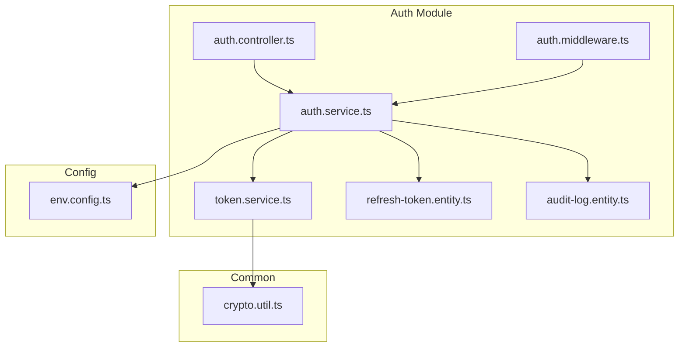
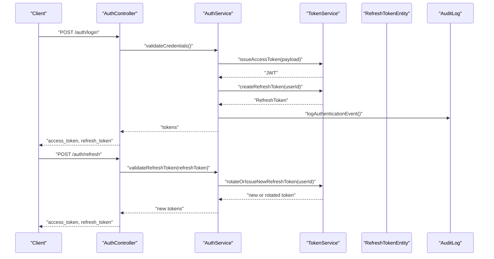
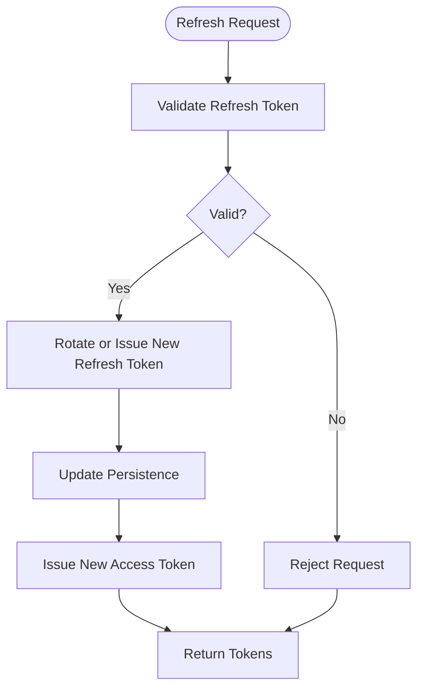
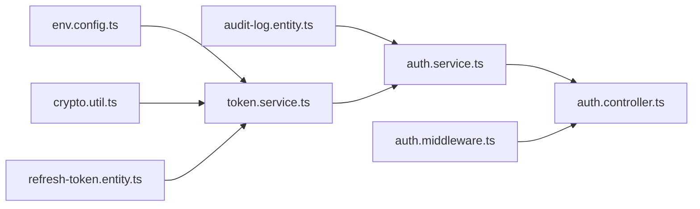

# Token Management

<cite>
**Referenced Files in This Document**
- [auth.controller.ts](file://backend/src/modules/auth/controllers/auth.controller.ts)
- [auth.middleware.ts](file://backend/src/modules/auth/middlewares/auth.middleware.ts)
- [auth.service.ts](file://backend/src/modules/auth/services/auth.service.ts)
- [token.service.ts](file://backend/src/modules/auth/services/token.service.ts)
- [refresh-token.entity.ts](file://backend/src/modules/auth/entities/refresh-token.entity.ts)
- [audit-log.entity.ts](file://backend/src/modules/auth/entities/audit-log.entity.ts)
- [crypto.util.ts](file://backend/src/common/utils/crypto.util.ts)
- [env.config.ts](file://backend/src/config/env.config.ts)
- [app.ts](file://backend/src/app.ts)
- [index.ts](file://backend/src/index.ts)
</cite>

## Table of Contents
1. [Introduction](#introduction)
2. [Project Structure](#project-structure)
3. [Core Components](#core-components)
4. [Architecture Overview](#architecture-overview)
5. [Detailed Component Analysis](#detailed-component-analysis)
6. [Dependency Analysis](#dependency-analysis)
7. [Performance Considerations](#performance-considerations)
8. [Troubleshooting Guide](#troubleshooting-guide)
9. [Conclusion](#conclusion)

## Introduction
This document describes the token management system for eLISAschool’s authentication module. It focuses on JWT and refresh token lifecycle, cryptographic foundations, secure storage, validation, and operational controls such as rotation, revocation, and blacklisting. The goal is to provide a clear understanding of how tokens are generated, validated, rotated, and revoked, along with best practices for preventing token leakage and recovering from compromised sessions.

## Project Structure
The token management implementation resides in the authentication module under backend/src/modules/auth. Key areas include:
- Controllers: expose endpoints for login, logout, and token refresh
- Services: encapsulate business logic for authentication and token operations
- Entities: define persistence models for refresh tokens and audit logs
- Middleware: enforce authentication and authorization checks
- Utilities: provide cryptographic helpers for secure operations
- Environment configuration: centralize secret keys and token lifetimes

**Diagram sources**
- [auth.controller.ts](file://backend/src/modules/auth/controllers/auth.controller.ts)
- [auth.middleware.ts](file://backend/src/modules/auth/middlewares/auth.middleware.ts)
- [auth.service.ts](file://backend/src/modules/auth/services/auth.service.ts)
- [token.service.ts](file://backend/src/modules/auth/services/token.service.ts)
- [refresh-token.entity.ts](file://backend/src/modules/auth/entities/refresh-token.entity.ts)
- [audit-log.entity.ts](file://backend/src/modules/auth/entities/audit-log.entity.ts)
- [crypto.util.ts](file://backend/src/common/utils/crypto.util.ts)
- [env.config.ts](file://backend/src/config/env.config.ts)

**Section sources**
- [auth.controller.ts](file://backend/src/modules/auth/controllers/auth.controller.ts)
- [auth.middleware.ts](file://backend/src/modules/auth/middlewares/auth.middleware.ts)
- [auth.service.ts](file://backend/src/modules/auth/services/auth.service.ts)
- [token.service.ts](file://backend/src/modules/auth/services/token.service.ts)
- [refresh-token.entity.ts](file://backend/src/modules/auth/entities/refresh-token.entity.ts)
- [audit-log.entity.ts](file://backend/src/modules/auth/entities/audit-log.entity.ts)
- [crypto.util.ts](file://backend/src/common/utils/crypto.util.ts)
- [env.config.ts](file://backend/src/config/env.config.ts)

## Core Components
- Authentication controller: exposes endpoints for login, logout, and refresh
- Authentication service: orchestrates user validation, token issuance, and audit
- Token service: handles JWT creation/signing, refresh token generation/storage, rotation, and revocation
- Refresh token entity: persists refresh tokens with metadata (owner, expiration, rotation counter)
- Audit log entity: records authentication events for compliance and forensics
- Crypto utilities: provide cryptographic primitives for secure operations
- Environment configuration: defines secrets and token lifetimes

**Section sources**
- [auth.controller.ts](file://backend/src/modules/auth/controllers/auth.controller.ts)
- [auth.service.ts](file://backend/src/modules/auth/services/auth.service.ts)
- [token.service.ts](file://backend/src/modules/auth/services/token.service.ts)
- [refresh-token.entity.ts](file://backend/src/modules/auth/entities/refresh-token.entity.ts)
- [audit-log.entity.ts](file://backend/src/modules/auth/entities/audit-log.entity.ts)
- [crypto.util.ts](file://backend/src/common/utils/crypto.util.ts)
- [env.config.ts](file://backend/src/config/env.config.ts)

## Architecture Overview
The token management architecture separates concerns across controller, service, and persistence layers. Authentication requests flow through the controller to the service, which uses the token service for cryptographic operations and interacts with the refresh token entity for persistence. Audit logging captures significant events.

**Diagram sources**
- [auth.controller.ts](file://backend/src/modules/auth/controllers/auth.controller.ts)
- [auth.service.ts](file://backend/src/modules/auth/services/auth.service.ts)
- [token.service.ts](file://backend/src/modules/auth/services/token.service.ts)
- [refresh-token.entity.ts](file://backend/src/modules/auth/entities/refresh-token.entity.ts)
- [audit-log.entity.ts](file://backend/src/modules/auth/entities/audit-log.entity.ts)

## Detailed Component Analysis

### JWT Token Structure and Claims
- Issuer and audience: configured via environment
- Subject: user identifier
- Expiration: short-lived access tokens
- Issued at: timestamp for clock skew handling
- Additional claims: roles, permissions, and user attributes as needed
- Signature: HMAC-SHA family using a strong symmetric key

Validation steps:
- Verify issuer and audience
- Check expiration and not-before timestamps
- Validate signature using the configured key
- Enforce clock skew tolerance

Rotation and refresh:
- Access tokens are short-lived; clients exchange refresh tokens for new access tokens
- Refresh tokens support rotation to limit exposure window

**Section sources**
- [token.service.ts](file://backend/src/modules/auth/services/token.service.ts)
- [env.config.ts](file://backend/src/config/env.config.ts)

### Refresh Token Lifecycle
Generation:
- Created upon successful login
- Stored with associated user ID, expiration, and rotation counter

Storage:
- Persisted in the refresh token entity with encrypted sensitive fields
- Metadata includes creation date, last used date, and rotation count

Rotation:
- On successful refresh, either rotate the existing token or issue a new one
- Increment rotation counter and update last-used timestamp

Revocation:
- Mark tokens as invalid in the database
- Maintain a blacklist to reject previously valid tokens immediately

Blacklisting:
- Maintain a set of invalidated token identifiers
- Reject requests bearing blacklisted tokens during middleware validation

Simultaneous sessions:
- Allow multiple refresh tokens per user
- Track rotation counters to prevent replay attacks across sessions

**Section sources**
- [refresh-token.entity.ts](file://backend/src/modules/auth/entities/refresh-token.entity.ts)
- [token.service.ts](file://backend/src/modules/auth/services/token.service.ts)

### Token Encryption Using AES-256
- Sensitive fields in the refresh token entity are encrypted using AES-256
- Symmetric key is managed securely via environment configuration
- Initialization vectors are randomly generated per record to ensure uniqueness

Secure storage practices:
- Secrets are loaded from environment variables
- Keys are rotated periodically
- Logs avoid exposing raw tokens or decrypted values

**Section sources**
- [refresh-token.entity.ts](file://backend/src/modules/auth/entities/refresh-token.entity.ts)
- [crypto.util.ts](file://backend/src/common/utils/crypto.util.ts)
- [env.config.ts](file://backend/src/config/env.config.ts)

### Token Validation Procedures
Middleware validation:
- Extract token from Authorization header
- Verify signature and claims
- Enforce expiration and blacklist checks
- Populate request context with user identity and permissions

Controller-level validation:
- Endpoint handlers delegate to services for business logic
- Services perform additional checks (e.g., role gating)

Audit trail:
- Log authentication attempts, successes, failures, and token operations
- Store event metadata for forensic analysis

**Section sources**
- [auth.middleware.ts](file://backend/src/modules/auth/middlewares/auth.middleware.ts)
- [auth.service.ts](file://backend/src/modules/auth/services/auth.service.ts)
- [audit-log.entity.ts](file://backend/src/modules/auth/entities/audit-log.entity.ts)

### Token Refresh Mechanisms
- Clients send refresh tokens to obtain new access tokens
- Server validates the refresh token against stored records
- Applies rotation policy and updates persistence
- Returns new tokens to the client

**Diagram sources**
- [auth.controller.ts](file://backend/src/modules/auth/controllers/auth.controller.ts)
- [auth.service.ts](file://backend/src/modules/auth/services/auth.service.ts)
- [token.service.ts](file://backend/src/modules/auth/services/token.service.ts)

### Simultaneous Session Handling
- Users can maintain multiple refresh tokens
- Rotation increments the rotation counter to invalidate previous tokens
- Blacklist ensures no two tokens are accepted concurrently after rotation

**Section sources**
- [refresh-token.entity.ts](file://backend/src/modules/auth/entities/refresh-token.entity.ts)
- [token.service.ts](file://backend/src/modules/auth/services/token.service.ts)

### Token Security Best Practices
- Short access token lifetime with frequent rotation
- Long-lived but tightly controlled refresh tokens with rotation
- AES-256 encryption for sensitive fields
- Centralized secret management and periodic rotation
- Comprehensive audit logging
- Immediate blacklist for compromised tokens
- Defense-in-depth: middleware validation, endpoint guards, and role checks

**Section sources**
- [token.service.ts](file://backend/src/modules/auth/services/token.service.ts)
- [env.config.ts](file://backend/src/config/env.config.ts)
- [audit-log.entity.ts](file://backend/src/modules/auth/entities/audit-log.entity.ts)

### Compromised Token Recovery Procedures
- Invalidate affected refresh tokens in the database
- Add token identifiers to the blacklist
- Notify users and require re-authentication
- Review audit logs for suspicious activity
- Rotate secrets if compromise is suspected

**Section sources**
- [token.service.ts](file://backend/src/modules/auth/services/token.service.ts)
- [audit-log.entity.ts](file://backend/src/modules/auth/entities/audit-log.entity.ts)

## Dependency Analysis
The authentication module depends on:
- Environment configuration for secrets and token lifetimes
- Crypto utilities for encryption and signing
- Entity models for persistence
- Middleware for enforcement

**Diagram sources**
- [env.config.ts](file://backend/src/config/env.config.ts)
- [crypto.util.ts](file://backend/src/common/utils/crypto.util.ts)
- [refresh-token.entity.ts](file://backend/src/modules/auth/entities/refresh-token.entity.ts)
- [audit-log.entity.ts](file://backend/src/modules/auth/entities/audit-log.entity.ts)
- [token.service.ts](file://backend/src/modules/auth/services/token.service.ts)
- [auth.service.ts](file://backend/src/modules/auth/services/auth.service.ts)
- [auth.controller.ts](file://backend/src/modules/auth/controllers/auth.controller.ts)
- [auth.middleware.ts](file://backend/src/modules/auth/middlewares/auth.middleware.ts)

**Section sources**
- [env.config.ts](file://backend/src/config/env.config.ts)
- [crypto.util.ts](file://backend/src/common/utils/crypto.util.ts)
- [refresh-token.entity.ts](file://backend/src/modules/auth/entities/refresh-token.entity.ts)
- [audit-log.entity.ts](file://backend/src/modules/auth/entities/audit-log.entity.ts)
- [token.service.ts](file://backend/src/modules/auth/services/token.service.ts)
- [auth.service.ts](file://backend/src/modules/auth/services/auth.service.ts)
- [auth.controller.ts](file://backend/src/modules/auth/controllers/auth.controller.ts)
- [auth.middleware.ts](file://backend/src/modules/auth/middlewares/auth.middleware.ts)

## Performance Considerations
- Keep access tokens short-lived to minimize exposure
- Use efficient cryptographic libraries and cache validated claims where appropriate
- Index refresh token fields for fast lookup and rotation
- Batch audit log writes to reduce I/O overhead
- Monitor token refresh rates to detect anomalies

## Troubleshooting Guide
Common issues and resolutions:
- Invalid signature errors: verify issuer, audience, and secret key alignment
- Expired tokens: ensure client refresh flow is triggered; check server time synchronization
- Blacklisted tokens: confirm blacklist entries and rotation logic
- Encryption failures: validate key material and initialization vectors
- Audit gaps: review middleware and service integration points

Operational checks:
- Confirm environment variables for secrets and lifetimes
- Validate middleware is applied to protected routes
- Inspect audit logs for failed attempts and revocations

**Section sources**
- [auth.middleware.ts](file://backend/src/modules/auth/middlewares/auth.middleware.ts)
- [auth.service.ts](file://backend/src/modules/auth/services/auth.service.ts)
- [token.service.ts](file://backend/src/modules/auth/services/token.service.ts)
- [audit-log.entity.ts](file://backend/src/modules/auth/entities/audit-log.entity.ts)
- [env.config.ts](file://backend/src/config/env.config.ts)

## Conclusion
eLISAschool’s token management system combines short-lived JWT access tokens with long-lived, rotated refresh tokens, supported by AES-256 encryption, centralized secret management, and comprehensive audit logging. The design enables secure, scalable authentication with robust mechanisms for rotation, revocation, and blacklisting, while supporting multiple concurrent sessions and resilient recovery from compromised tokens.