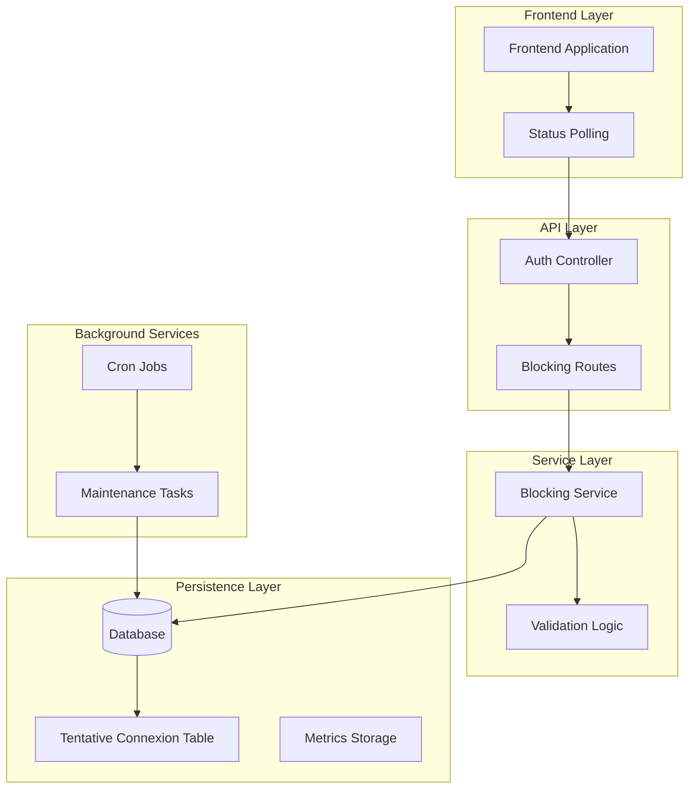
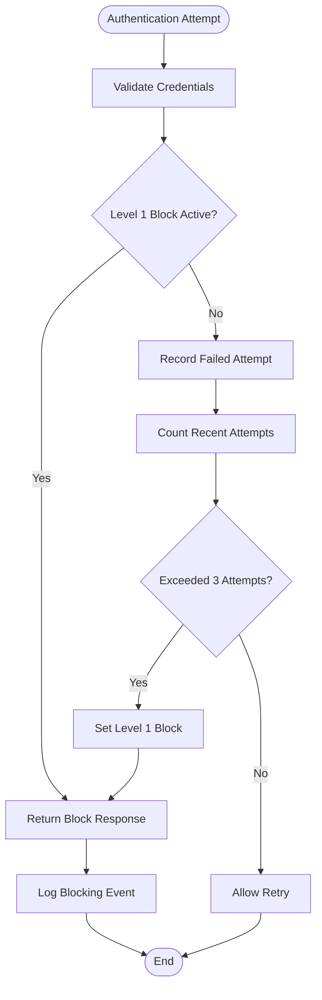
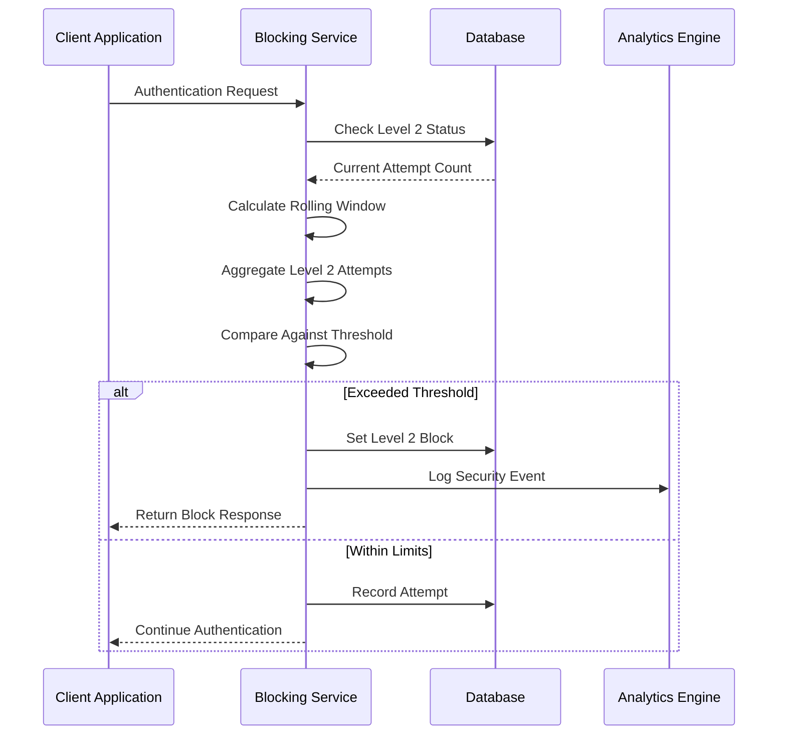
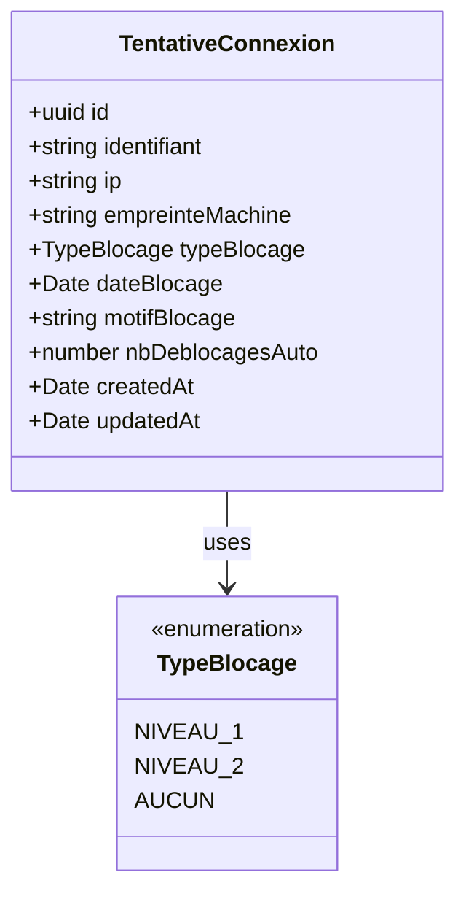
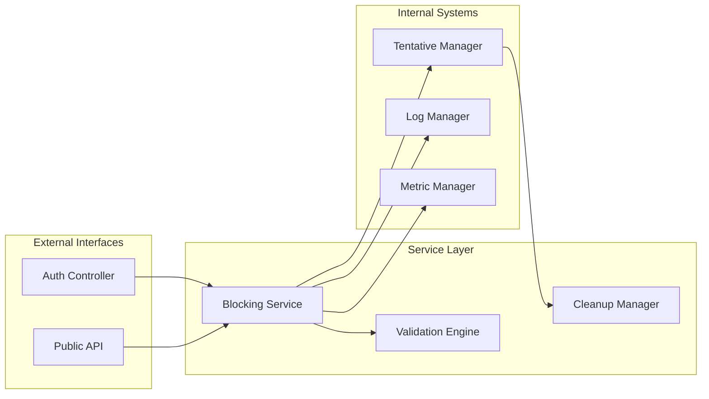
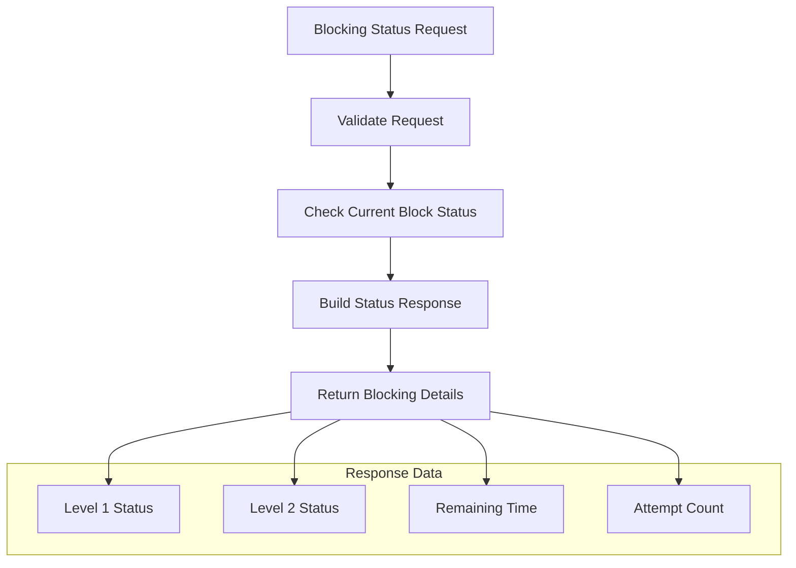
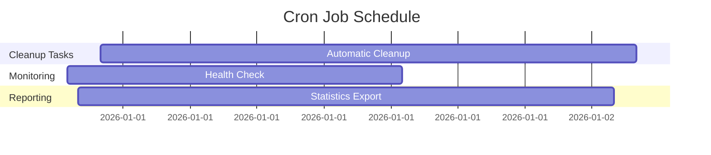
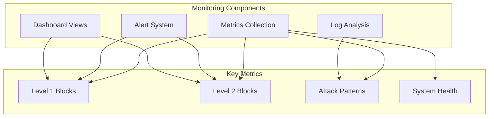

# Two-Level Blocking System

<cite>
**Referenced Files in This Document**
- [SYSTEME-BLOCAGE-AUTH-DEUX-NIVEAUX.md](file://docs/SYSTEME-BLOCAGE-AUTH-DEUX-NIVEAUX.md)
- [IMPLEMENTATION-BLOCAGE-AUTH-TERMINEE.md](file://IMPLEMENTATION-BLOCAGE-AUTH-TERMINEE.md)
- [018-systeme-blocage-deux-niveaux.sql](file://backend/src/database/migrations/018-systeme-blocage-deux-niveaux.sql)
- [tentative-connexion.entity.ts](file://backend/src/modules/auth/entities/tentative-connexion.entity.ts)
- [blocage-auth.service.ts](file://backend/src/modules/auth/services/blocage-auth.service.ts)
- [auth.controller.ts](file://backend/src/modules/auth/controllers/auth.controller.ts)
- [cron-jobs.ts](file://backend/src/modules/auth/cron-jobs.ts)
- [deploy-blocage-auth.sh](file://scripts/deploy-blocage-auth.sh)
</cite>

## Table of Contents
1. [Introduction](#introduction)
2. [System Architecture](#system-architecture)
3. [Core Components](#core-components)
4. [Level 1 Blocking Mechanism](#level-1-blocking-mechanism)
5. [Level 2 Blocking Mechanism](#level-2-blocking-mechanism)
6. [Database Implementation](#database-implementation)
7. [Service Layer](#service-layer)
8. [API Endpoints](#api-endpoints)
9. [Cron Job Management](#cron-job-management)
10. [Configuration and Deployment](#configuration-and-deployment)
11. [Security Features](#security-features)
12. [Monitoring and Maintenance](#monitoring-and-maintenance)
13. [Troubleshooting Guide](#troubleshooting-guide)
14. [Conclusion](#conclusion)

## Introduction

The Two-Level Blocking System is a sophisticated authentication security mechanism implemented in the eLISAschool platform. This system provides enterprise-grade protection against brute force attacks and credential stuffing attempts through a dual-layer blocking approach that distinguishes between individual account targeting and broader machine-based scanning.

The system was designed and implemented by franck arlos chendjou with the goal of creating a robust, configurable, and maintainable authentication security solution that operates entirely on the backend while providing comprehensive monitoring and audit capabilities.

## System Architecture

The Two-Level Blocking System follows a layered architecture pattern that separates concerns between authentication, blocking logic, and persistence mechanisms. The system operates on the principle of defense-in-depth, where multiple protective layers work together to prevent unauthorized access attempts.



**Diagram sources**
- [auth.controller.ts](file://backend/src/modules/auth/controllers/auth.controller.ts)
- [blocage-auth.service.ts](file://backend/src/modules/auth/services/blocage-auth.service.ts)
- [tentative-connexion.entity.ts](file://backend/src/modules/auth/entities/tentative-connexion.entity.ts)

## Core Components

The Two-Level Blocking System consists of several interconnected components that work together to provide comprehensive authentication security:

### Level 1 Blocking Component
- **Scope**: Account-specific blocking
- **Purpose**: Prevent brute force attacks targeting individual user accounts
- **Parameters**: 3 attempts within 1 minute per account/IP combination
- **Mechanism**: Immediate blocking with detailed logging

### Level 2 Blocking Component
- **Scope**: Machine-wide blocking
- **Purpose**: Prevent automated scanning and bulk attack attempts
- **Parameters**: 20 attempts within 2 minutes per machine fingerprint/IP combination
- **Mechanism**: Aggregated blocking across all accounts

### Database Entity Component
- **TentativeConnexion Entity**: Central storage for all authentication attempts
- **Audit Trail**: Complete history of blocking events
- **Metrics Collection**: Data for security analytics

### Service Layer Component
- **Blocking Service**: Core logic implementation
- **Validation Engine**: Attempt verification and blocking decisions
- **Cleanup Manager**: Automated maintenance tasks

**Section sources**
- [SYSTEME-BLOCAGE-AUTH-DEUX-NIVEAUX.md:14-32](file://docs/SYSTEME-BLOCAGE-AUTH-DEUX-NIVEAUX.md#L14-L32)

## Level 1 Blocking Mechanism

Level 1 blocking represents the first line of defense against targeted authentication attacks. This mechanism focuses specifically on protecting individual user accounts from brute force attempts.

### Blocking Criteria

The Level 1 mechanism implements strict criteria for blocking individual accounts:

- **Maximum Attempts**: 3 failed login attempts
- **Time Window**: 1 minute duration
- **Scope Definition**: Account identifier + IP address combination
- **Blocking Duration**: 1 minute from first failed attempt

### Implementation Details



**Diagram sources**
- [blocage-auth.service.ts](file://backend/src/modules/auth/services/blocage-auth.service.ts)
- [tentative-connexion.entity.ts](file://backend/src/modules/auth/entities/tentative-connexion.entity.ts)

### Security Features

- **IP Binding**: Attempts are tracked per IP address to prevent bypass through proxy rotation
- **Account Isolation**: Blocks are specific to individual user accounts
- **Immediate Enforcement**: Blocking takes effect immediately upon threshold crossing
- **Detailed Logging**: Complete audit trail of blocking events

**Section sources**
- [SYSTEME-BLOCAGE-AUTH-DEUX-NIVEAUX.md:20-23](file://docs/SYSTEME-BLOCAGE-AUTH-DEUX-NIVEAUX.md#L20-L23)

## Level 2 Blocking Mechanism

Level 2 blocking serves as the secondary defense layer, protecting the entire system from automated scanning and bulk attack attempts that target multiple accounts simultaneously.

### Blocking Criteria

The Level 2 mechanism employs broader criteria for system-wide protection:

- **Maximum Attempts**: 20 failed login attempts
- **Time Window**: 2 minute duration
- **Scope Definition**: IP address + Machine Fingerprint combination
- **Blocking Duration**: 2 minutes from first failed attempt

### Machine Fingerprinting

The system implements sophisticated machine fingerprinting to identify potentially malicious scanning activities:

- **SHA-256 Hashing**: Cryptographically secure hashing of device characteristics
- **Multi-Factor Identification**: Combination of browser, OS, and hardware characteristics
- **Dynamic Updates**: Fingerprint recalculated based on behavioral patterns
- **Storage Efficiency**: Compact representation suitable for database storage

### Implementation Logic



**Diagram sources**
- [blocage-auth.service.ts](file://backend/src/modules/auth/services/blocage-auth.service.ts)
- [cron-jobs.ts](file://backend/src/modules/auth/cron-jobs.ts)

**Section sources**
- [SYSTEME-BLOCAGE-AUTH-DEUX-NIVEAUX.md:25-28](file://docs/SYSTEME-BLOCAGE-AUTH-DEUX-NIVEAUX.md#L25-L28)

## Database Implementation

The database layer provides persistent storage for all blocking-related data and maintains comprehensive audit trails for security monitoring and compliance requirements.

### TentativeConnexion Entity

The central database entity manages all authentication attempt records and blocking state information:



**Diagram sources**
- [tentative-connexion.entity.ts](file://backend/src/modules/auth/entities/tentative-connexion.entity.ts)

### Database Schema

The migration script establishes the foundation for the blocking system:

- **Primary Key**: UUID-based unique identification
- **Index Strategy**: Composite indexes for efficient querying
- **Audit Fields**: Created/updated timestamps for all records
- **Enum Support**: Type-safe blocking level enumeration

### Data Persistence Strategy

The system implements a comprehensive data retention and cleanup strategy:

- **Active Records**: Current blocking state maintained indefinitely
- **Historical Data**: Attempt logs retained for security analysis
- **Automatic Cleanup**: Regular pruning of expired blocking records
- **Archival Process**: Long-term storage of security event data

**Section sources**
- [018-systeme-blocage-deux-niveaux.sql](file://backend/src/database/migrations/018-systeme-blocage-deux-niveaux.sql)

## Service Layer

The service layer encapsulates the core business logic for the blocking system, providing clean interfaces for authentication controllers and external systems.

### Blocking Service Responsibilities

The blocking service manages all aspects of the two-level blocking mechanism:

- **Attempt Validation**: Verifies authentication attempts against blocking rules
- **Blocking Decision Logic**: Determines appropriate blocking level based on criteria
- **State Management**: Maintains current blocking state for accounts and machines
- **Audit Generation**: Creates comprehensive logs for all blocking events
- **Cleanup Coordination**: Manages automatic removal of expired blocks

### Service Architecture



**Diagram sources**
- [blocage-auth.service.ts](file://backend/src/modules/auth/services/blocage-auth.service.ts)

### Validation Logic

The service implements sophisticated validation logic that considers multiple factors:

- **Temporal Analysis**: Rolling window calculations for attempt counting
- **Geographic Correlation**: IP-based geographic risk assessment
- **Behavioral Patterns**: Detection of automated attack patterns
- **Rate Limiting**: Dynamic adjustment based on historical data

**Section sources**
- [blocage-auth.service.ts](file://backend/src/modules/auth/services/blocage-auth.service.ts)

## API Endpoints

The system exposes dedicated API endpoints for blocking status monitoring and administrative functions, enabling real-time visibility into the blocking system's operation.

### Blocking Status Endpoint

The primary endpoint allows clients to check blocking status without triggering additional attempts:

- **Endpoint**: `GET /api/auth/blocage-status/:identifiant`
- **Purpose**: Monitor blocking status during authentication process
- **Behavior**: Returns blocking details without incrementing attempt counters
- **Usage**: Enables frontend polling during blocking periods

### Status Response Format

The endpoint provides comprehensive blocking information:



**Diagram sources**
- [auth.controller.ts](file://backend/src/modules/auth/controllers/auth.controller.ts)

### Administrative Functions

Additional endpoints support system administration and monitoring:

- **Blocking History**: Retrieve historical blocking events
- **Statistics**: Access blocking statistics and trends
- **Manual Override**: Administrative capability to clear blocks
- **Configuration**: Modify blocking parameters dynamically

**Section sources**
- [auth.controller.ts:230-235](file://backend/src/modules/auth/controllers/auth.controller.ts#L230-L235)

## Cron Job Management

The system includes automated maintenance through cron jobs that handle cleanup and monitoring tasks essential for long-term system health.

### Scheduled Maintenance Tasks



### Cleanup Operations

The cron jobs perform essential maintenance:

- **Expired Block Removal**: Automatically clears blocks that have exceeded their duration
- **Log Archiving**: Moves old blocking records to archive tables
- **Database Optimization**: Performs maintenance operations on blocking tables
- **Health Monitoring**: Checks system integrity and reports anomalies

### Maintenance Strategy

The cleanup process ensures system longevity:

- **Batch Processing**: Efficient handling of large volumes of expired records
- **Resource Management**: Optimized execution to minimize system impact
- **Error Recovery**: Robust error handling for failed cleanup operations
- **Progress Tracking**: Detailed logging of cleanup operations

**Section sources**
- [cron-jobs.ts:11-23](file://backend/src/modules/auth/cron-jobs.ts#L11-L23)

## Configuration and Deployment

The system supports dynamic configuration through the system parameters mechanism, allowing administrators to adjust blocking behavior without redeployment.

### Configuration Parameters

The blocking system reads parameters from the centralized configuration system:

- **Level 1 Threshold**: Maximum attempts before account-level blocking
- **Level 1 Duration**: Blocking duration for individual accounts
- **Level 2 Threshold**: Maximum attempts before machine-level blocking
- **Level 2 Duration**: Blocking duration for machines
- **Cleanup Interval**: Frequency of maintenance operations

### Deployment Process

The deployment script automates system installation:

```bash
#!/bin/bash
# Deployment Script for Two-Level Blocking System

echo "Deploying Two-Level Blocking System..."

# Apply database migrations
echo "Applying database migrations..."
npm run migrate:up

# Configure system parameters
echo "Setting up blocking parameters..."
npm run configure:blocking

# Restart backend services
echo "Restarting backend services..."
pm2 restart backend

echo "Deployment complete!"
```

### Environment Integration

The system integrates seamlessly with existing infrastructure:

- **Existing Infrastructure**: Compatible with current authentication systems
- **Legacy Support**: Maintains backward compatibility with older blocking mechanisms
- **Performance Impact**: Minimal overhead on existing authentication processes
- **Monitoring Integration**: Works with existing logging and alerting systems

**Section sources**
- [deploy-blocage-auth.sh](file://scripts/deploy-blocage-auth.sh)

## Security Features

The Two-Level Blocking System incorporates numerous security features designed to provide comprehensive protection against various attack vectors while maintaining usability for legitimate users.

### Defense-in-Depth Architecture

The system implements layered security controls:

- **Multiple Blocking Levels**: Separate protections for different threat scenarios
- **Machine Fingerprinting**: Advanced detection of automated attacks
- **Real-time Monitoring**: Continuous observation of suspicious activities
- **Automated Response**: Immediate blocking without human intervention

### Audit and Compliance

Comprehensive logging enables security auditing and compliance:

- **Complete Event Tracking**: Every blocking action recorded with full context
- **Timestamp Precision**: Microsecond-level timing for forensic analysis
- **User Activity Correlation**: Link between blocking events and user actions
- **Export Capabilities**: Structured data export for security information exchange

### Performance Optimization

The system balances security effectiveness with performance:

- **Efficient Indexing**: Strategic database indexing for fast blocking decisions
- **Memory Management**: Optimized memory usage for high-volume environments
- **Connection Pooling**: Efficient database connection management
- **Caching Strategies**: Intelligent caching of frequently accessed blocking data

## Monitoring and Maintenance

The system provides extensive monitoring capabilities and automated maintenance to ensure reliable operation over extended periods.

### Real-time Monitoring



### Alerting System

The monitoring system generates alerts for significant security events:

- **Threshold Breaches**: Notifications when blocking thresholds are approached
- **Pattern Recognition**: Alerts for coordinated attack patterns
- **System Anomalies**: Detection of unusual system behavior
- **Maintenance Required**: Notifications for system maintenance needs

### Maintenance Automation

Automated maintenance ensures system reliability:

- **Database Cleanup**: Regular pruning of expired blocking records
- **Performance Tuning**: Automatic optimization of database queries
- **Health Checks**: Periodic verification of system integrity
- **Backup Verification**: Confirmation of data protection measures

## Troubleshooting Guide

Common issues and their resolution strategies for the Two-Level Blocking System.

### Authentication Blocked Issues

**Symptoms**: Users unable to log in despite correct credentials
**Causes**: 
- Level 1 block active for account/IP combination
- Level 2 block active for machine/IP combination
- System maintenance period

**Resolution Steps**:
1. Check blocking status via `/api/auth/blocage-status/:identifiant`
2. Wait for automatic blocking period to expire
3. Contact system administrator for manual override if needed

### False Positive Blocking

**Symptoms**: Legitimate users blocked after multiple failed attempts
**Causes**:
- Shared IP address environment
- Network infrastructure changes
- Browser fingerprint changes

**Resolution Steps**:
1. Verify blocking details through administrative interface
2. Clear blocking records if appropriate
3. Adjust blocking parameters if necessary

### System Performance Issues

**Symptoms**: Slow authentication response times
**Causes**:
- Database performance degradation
- Excessive blocking activity
- Insufficient system resources

**Resolution Steps**:
1. Monitor system metrics and blocking statistics
2. Optimize database indexes and queries
3. Review and adjust blocking parameters

**Section sources**
- [IMPLEMENTATION-BLOCAGE-AUTH-TERMINEE.md:189-221](file://IMPLEMENTATION-BLOCAGE-AUTH-TERMINEE.md#L189-L221)

## Conclusion

The Two-Level Blocking System represents a comprehensive and enterprise-ready solution for authentication security in educational platforms. The system successfully implements defense-in-depth principles through its dual-layer approach, providing robust protection against both targeted and broad-spectrum attack vectors.

### Key Achievements

- **Complete Implementation**: Full deployment according to security best practices
- **Configurable Design**: Dynamic parameters without system downtime
- **Comprehensive Monitoring**: Complete audit trail and real-time visibility
- **Performance Optimization**: Minimal impact on legitimate user experience
- **Maintenance Automation**: Self-healing capabilities through scheduled cleanup

### Future Enhancements

The system provides a solid foundation for future security improvements:

- **Machine Learning Integration**: Enhanced pattern recognition capabilities
- **Advanced Analytics**: Predictive threat detection and prevention
- **Integration Expansion**: Broader system integration for holistic security
- **Scalability Improvements**: Enhanced performance for larger deployments

The implementation demonstrates the successful integration of modern security practices with practical system requirements, providing a model for secure authentication systems in educational technology environments.