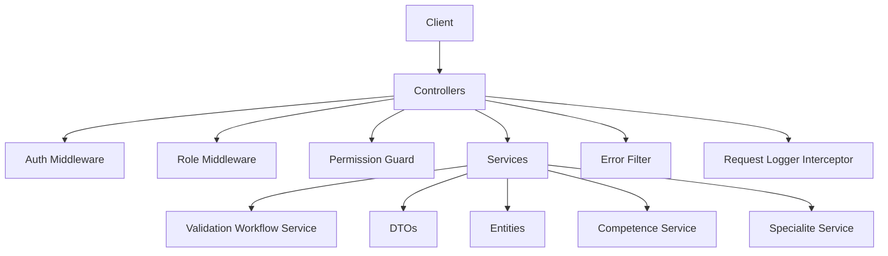
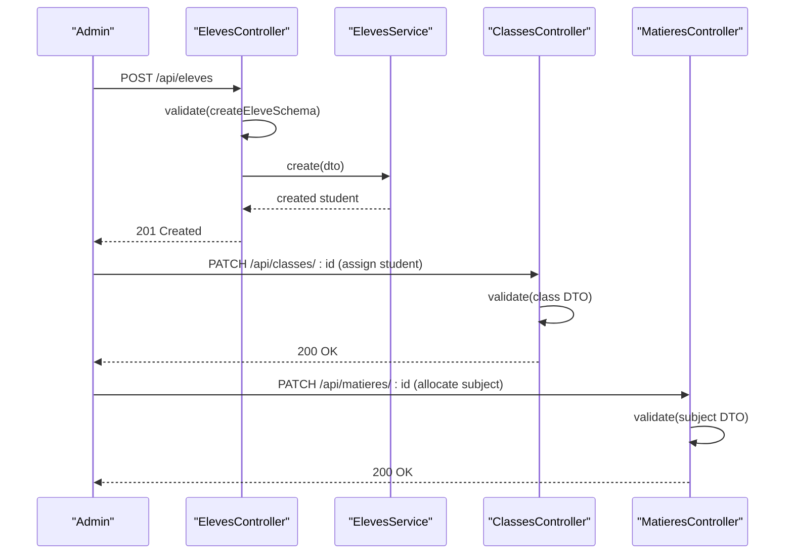
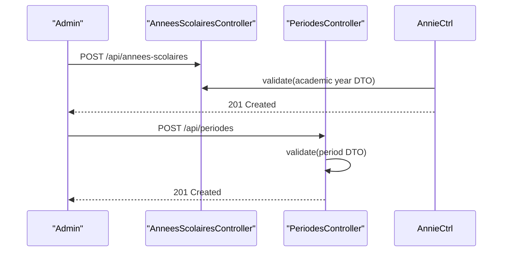
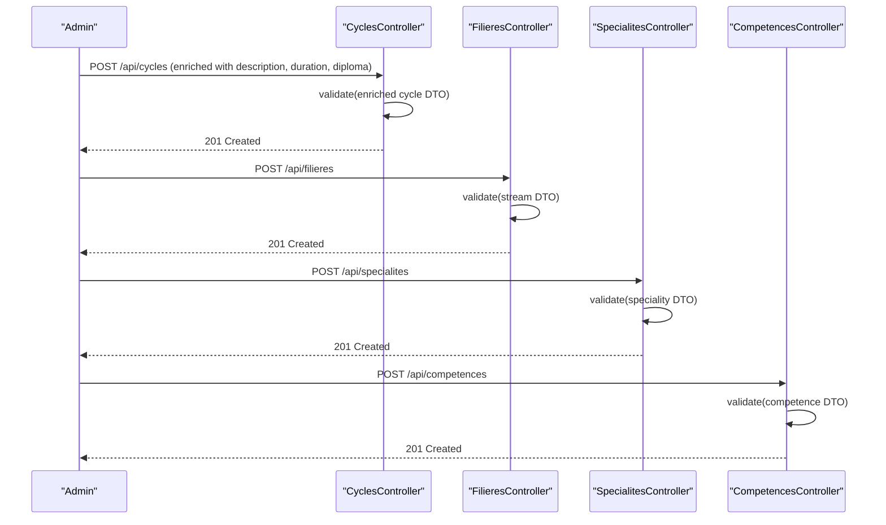
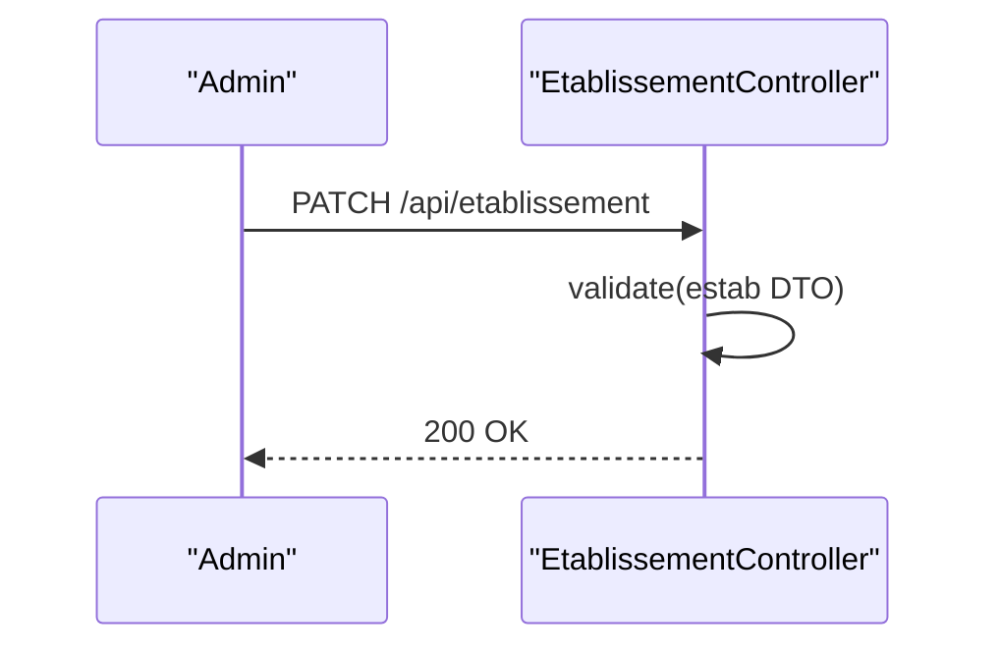
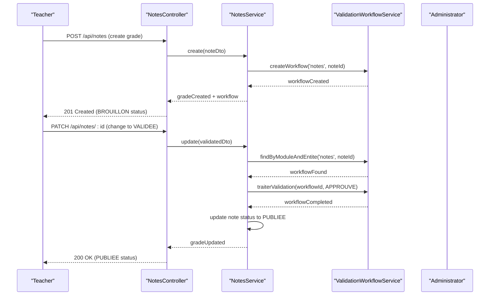
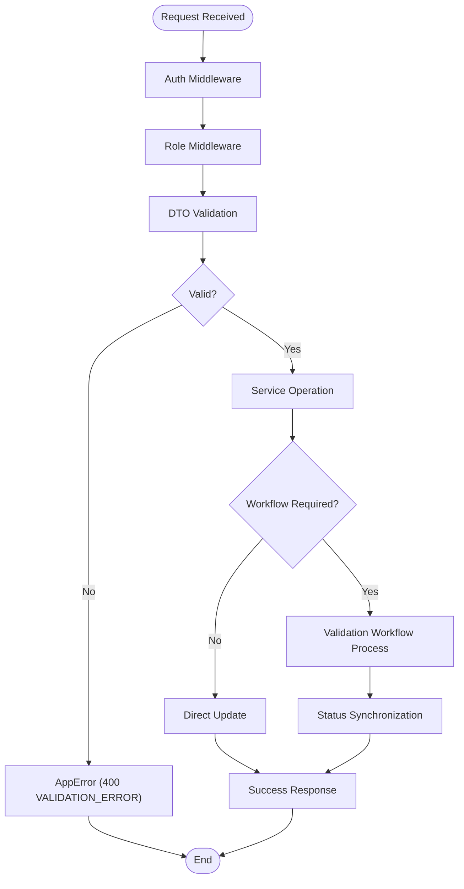
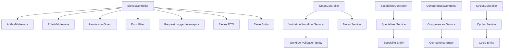

# Academic Management API

<cite>
**Referenced Files in This Document**
- [eleves.controller.ts](file://backend/src/modules/eleves/controllers/eleves.controller.ts)
- [eleves.dto.ts](file://backend/src/modules/eleves/dto/eleves.dto.ts)
- [eleve.entity.ts](file://backend/src/modules/eleves/entities/eleve.entity.ts)
- [classes.controller.ts](file://backend/src/modules/classes/controllers/classes.controller.ts)
- [niveaux.controller.ts](file://backend/src/modules/niveaux/controllers/niveaux.controller.ts)
- [matieres.controller.ts](file://backend/src/modules/matieres/controllers/matieres.controller.ts)
- [cycles.controller.ts](file://backend/src/modules/cycles/controllers/cycles.controller.ts)
- [cycles.dto.ts](file://backend/src/modules/cycles/dto/cycle.dto.ts)
- [cycles.entity.ts](file://backend/src/modules/cycles/entities/cycle.entity.ts)
- [filieres.controller.ts](file://backend/src/modules/filieres/controllers/filieres.controller.ts)
- [filieres.dto.ts](file://backend/src/modules/filieres/dto/filiere.dto.ts)
- [filieres.entity.ts](file://backend/src/modules/filieres/entities/filiere.entity.ts)
- [specialites.controller.ts](file://backend/src/modules/specialites/controllers/specialites.controller.ts)
- [specialites.dto.ts](file://backend/src/modules/specialites/dto/specialite.dto.ts)
- [specialites.entity.ts](file://backend/src/modules/specialites/entities/specialite.entity.ts)
- [competences.controller.ts](file://backend/src/modules/competences/controllers/competences.controller.ts)
- [competences.dto.ts](file://backend/src/modules/competences/dto/competence.dto.ts)
- [competences.entity.ts](file://backend/src/modules/competences/entities/competence.entity.ts)
- [annees-scolaires.controller.ts](file://backend/src/modules/annees-scolaires/controllers/annees-scolaires.controller.ts)
- [periodes.controller.ts](file://backend/src/modules/periodes/controllers/periodes.controller.ts)
- [etablissement.controller.ts](file://backend/src/modules/etablissement/controllers/etablissement.controller.ts)
- [bulletins.controller.ts](file://backend/src/modules/bulletins/controllers/bulletins.controller.ts)
- [notes.controller.ts](file://backend/src/modules/notes/controllers/notes.controller.ts)
- [notes.service.ts](file://backend/src/modules/notes/services/notes.service.ts)
- [validation-workflow.controller.ts](file://backend/src/modules/validation-workflow/controllers/validation-workflow.controller.ts)
- [validation-workflow.service.ts](file://backend/src/modules/validation-workflow/services/validation-workflow.service.ts)
- [auth.middleware.ts](file://backend/src/modules/auth/middlewares/auth.middleware.ts)
- [role.middleware.ts](file://backend/src/modules/auth/middlewares/role.middleware.ts)
- [permission.guard.ts](file://backend/src/modules/auth/guards/permission.guard.ts)
- [error.filter.ts](file://backend/src/common/filters/error.filter.ts)
- [request-logger.interceptor.ts](file://backend/src/common/interceptors/request-logger.interceptor.ts)
- [app.ts](file://backend/src/app.ts)
- [index.ts](file://backend/src/index.ts)
</cite>

## Update Summary
**Changes Made**
- Removed deprecated types-cycles API endpoints and integrated functionality into existing cycles API
- Added new Specialities (Spécialités) module with CRUD endpoints for technical specialization management
- Added new Competences module with CRUD endpoints for competency-based learning management
- Updated Academic Year and Period management to reflect structural changes
- Enhanced Cycles module with enriched fields (description, duration, diploma)
- Updated institutional hierarchy to remove TypeCycle and integrate competencies/specialties functionality

## Table of Contents
1. [Introduction](#introduction)
2. [Project Structure](#project-structure)
3. [Core Components](#core-components)
4. [Architecture Overview](#architecture-overview)
5. [Detailed Component Analysis](#detailed-component-analysis)
6. [Validation Workflow System](#validation-workflow-system)
7. [Dependency Analysis](#dependency-analysis)
8. [Performance Considerations](#performance-considerations)
9. [Troubleshooting Guide](#troubleshooting-guide)
10. [Conclusion](#conclusion)
11. [Appendices](#appendices)

## Introduction
This document provides comprehensive API documentation for the Academic Management module of the eLISAschool platform. The module has been enhanced with new Specialities and Competences management capabilities, replacing the previous TypeCycles system. It covers endpoints for students, classes, levels, subjects, cycles, academic years, periods, establishment management, specialities, competences, and the integrated validation workflow system. For each endpoint, we specify HTTP methods, URL patterns, request/response schemas, business rule validations, and operational workflows such as enrollment, class assignments, subject allocations, grading periods, institutional hierarchy management, and automated validation processes. The documentation also outlines data relationships between academic entities, validation rules, workflow automation, and reporting capabilities, with examples of academic workflow integrations and administrative operations.

## Project Structure
The Academic Management module is organized by domain entities under the backend/src/modules directory. Each domain includes:
- Controllers: Express routers exposing HTTP endpoints
- DTOs: Validation schemas for request/response payloads
- Entities: Data models representing academic entities
- Services: Business logic implementations
- Guards/Middlewares: Authentication and authorization enforcement

```mermaid
graph TB
subgraph "Academic Modules"
E["ElevesController<br/>Students"]
C["ClassesController<br/>Classes"]
N["NiveauxController<br/>Levels"]
M["MatieresController<br/>Subjects"]
Y["AnneesScolairesController<br/>Academic Years"]
P["PeriodesController<br/>Periods"]
X["CyclesController<br/>Cycles"]
F["FilieresController<br/>Program Streams"]
S["SpecialitesController<br/>Specialities"]
B["BulletinsController<br/>Reports"]
T["NotesController<br/>Grades"]
COMP["CompetencesController<br/>Competences"]
end
subgraph "Validation Workflow System"
VW["ValidationWorkflowController<br/>Validation Workflows"]
end
subgraph "Auth & Common"
AM["Auth Middleware"]
RM["Role Middleware"]
PG["Permission Guard"]
EF["Error Filter"]
RI["Request Logger Interceptor"]
end
E --> AM
E --> RM
E --> PG
E --> EF
E --> RI
C --> AM
C --> RM
C --> PG
C --> EF
C --> RI
N --> AM
N --> RM
N --> PG
N --> EF
N --> RI
M --> AM
M --> RM
M --> PG
M --> EF
M --> RI
Y --> AM
Y --> RM
Y --> PG
Y --> EF
Y --> RI
P --> AM
P --> RM
P --> PG
P --> EF
P --> RI
X --> AM
X --> RM
X --> PG
X --> EF
X --> RI
F --> AM
F --> RM
F --> PG
F --> EF
F --> RI
S --> AM
S --> RM
S --> PG
S --> EF
S --> RI
B --> AM
B --> RM
B --> PG
B --> EF
B --> RI
T --> AM
T --> RM
T --> PG
T --> EF
T --> RI
COMP --> AM
COMP --> RM
COMP --> PG
COMP --> EF
COMP --> RI
VW --> AM
VW --> RM
VW --> PG
VW --> EF
VW --> RI
```

**Diagram sources**
- [eleves.controller.ts:1-58](file://backend/src/modules/eleves/controllers/eleves.controller.ts#L1-L58)
- [classes.controller.ts](file://backend/src/modules/classes/controllers/classes.controller.ts)
- [niveaux.controller.ts](file://backend/src/modules/niveaux/controllers/niveaux.controller.ts)
- [matieres.controller.ts](file://backend/src/modules/matieres/controllers/matieres.controller.ts)
- [cycles.controller.ts](file://backend/src/modules/cycles/controllers/cycles.controller.ts)
- [filieres.controller.ts](file://backend/src/modules/filieres/controllers/filieres.controller.ts)
- [specialites.controller.ts](file://backend/src/modules/specialites/controllers/specialites.controller.ts)
- [competences.controller.ts](file://backend/src/modules/competences/controllers/competences.controller.ts)
- [annees-scolaires.controller.ts](file://backend/src/modules/annees-scolaires/controllers/annees-scolaires.controller.ts)
- [periodes.controller.ts](file://backend/src/modules/periodes/controllers/periodes.controller.ts)
- [etablissement.controller.ts](file://backend/src/modules/etablissement/controllers/etablissement.controller.ts)
- [bulletins.controller.ts](file://backend/src/modules/bulletins/controllers/bulletins.controller.ts)
- [notes.controller.ts](file://backend/src/modules/notes/controllers/notes.controller.ts)
- [validation-workflow.controller.ts](file://backend/src/modules/validation-workflow/controllers/validation-workflow.controller.ts)
- [auth.middleware.ts](file://backend/src/modules/auth/middlewares/auth.middleware.ts)
- [role.middleware.ts](file://backend/src/modules/auth/middlewares/role.middleware.ts)
- [permission.guard.ts](file://backend/src/modules/auth/guards/permission.guard.ts)
- [error.filter.ts](file://backend/src/common/filters/error.filter.ts)
- [request-logger.interceptor.ts](file://backend/src/common/interceptors/request-logger.interceptor.ts)

**Section sources**
- [app.ts](file://backend/src/app.ts)
- [index.ts](file://backend/src/index.ts)

## Core Components
This section documents the primary academic management endpoints and their associated schemas and validations.

### Students (Eleves)
- Base URL: `/api/eleves`
- Methods:
  - GET /: List all students with optional subsystem filter
  - POST /: Create a new student
  - PATCH /:id: Update an existing student
  - DELETE /:id: Delete a student record
- Authentication and Roles:
  - Requires authentication middleware
  - Allowed roles: ADMIN, SUPER_ADMIN, CHEF_ETABLISSEMENT, PERSONNEL for GET; ADMIN, SUPER_ADMIN, PERSONNEL for POST/PATCH; ADMIN, SUPER_ADMIN for DELETE
- Request/Response Schemas:
  - Creation and update schemas validated via Zod DTOs
  - Responses include success flag and data payload
- Business Rules:
  - Validation errors return structured error response
  - Deletion requires elevated privileges

**Section sources**
- [eleves.controller.ts:25-54](file://backend/src/modules/eleves/controllers/eleves.controller.ts#L25-L54)
- [eleves.dto.ts](file://backend/src/modules/eleves/dto/eleves.dto.ts)
- [eleve.entity.ts](file://backend/src/modules/eleves/entities/eleve.entity.ts)

### Classes (Classes)
- Base URL: `/api/classes`
- Methods:
  - GET /: List classes
  - POST /: Create a class
  - PATCH /:id: Update a class
  - DELETE /:id: Delete a class
- Authentication and Roles:
  - Requires authentication middleware
  - Allowed roles: ADMIN, SUPER_ADMIN, CHEF_ETABLISSEMENT, PERSONNEL
- Request/Response Schemas:
  - DTO validation enforced
  - Responses include success flag and data payload
- Business Rules:
  - Validation errors return structured error response

**Section sources**
- [classes.controller.ts](file://backend/src/modules/classes/controllers/classes.controller.ts)

### Levels (Niveaux)
- Base URL: `/api/niveaux`
- Methods:
  - GET /: List levels
  - POST /: Create a level
  - PATCH /:id: Update a level
  - DELETE /:id: Delete a level
- Authentication and Roles:
  - Requires authentication middleware
  - Allowed roles: ADMIN, SUPER_ADMIN, CHEF_ETABLISSEMENT, PERSONNEL
- Request/Response Schemas:
  - DTO validation enforced
  - Responses include success flag and data payload
- Business Rules:
  - Validation errors return structured error response

**Section sources**
- [niveaux.controller.ts](file://backend/src/modules/niveaux/controllers/niveaux.controller.ts)

### Subjects (Matieres)
- Base URL: `/api/matieres`
- Methods:
  - GET /: List subjects
  - POST /: Create a subject
  - PATCH /:id: Update a subject
  - DELETE /:id: Delete a subject
- Authentication and Roles:
  - Requires authentication middleware
  - Allowed roles: ADMIN, SUPER_ADMIN, CHEF_ETABLISSEMENT, PERSONNEL
- Request/Response Schemas:
  - DTO validation enforced
  - Responses include success flag and data payload
- Business Rules:
  - Validation errors return structured error response

**Section sources**
- [matieres.controller.ts](file://backend/src/modules/matieres/controllers/matieres.controller.ts)

### Cycles (Updated)
- Base URL: `/api/cycles`
- Methods:
  - GET /: List cycles with enriched fields (description, duration, diploma)
  - POST /: Create a cycle with enhanced properties
  - PATCH /:id: Update a cycle with enriched fields
  - DELETE /:id: Delete a cycle
- Authentication and Roles:
  - Requires authentication middleware
  - Allowed roles: ADMIN, SUPER_ADMIN, CHEF_ETABLISSEMENT, PERSONNEL
- Request/Response Schemas:
  - DTO validation enforced with new cycle fields
  - Responses include success flag and data payload
- Business Rules:
  - Validation errors return structured error response
  - **Updated**: Integrated competences/specialites functionality previously handled by separate types-cycles module

**Section sources**
- [cycles.controller.ts](file://backend/src/modules/cycles/controllers/cycles.controller.ts)
- [cycles.dto.ts](file://backend/src/modules/cycles/dto/cycle.dto.ts)
- [cycles.entity.ts](file://backend/src/modules/cycles/entities/cycle.entity.ts)

### Program Streams (Filieres)
- Base URL: `/api/filieres`
- Methods:
  - GET /: List program streams
  - POST /: Create a program stream
  - PATCH /:id: Update a program stream
  - DELETE /:id: Delete a program stream
- Authentication and Roles:
  - Requires authentication middleware
  - Allowed roles: ADMIN, SUPER_ADMIN, CHEF_ETABLISSEMENT, PERSONNEL
- Request/Response Schemas:
  - DTO validation enforced
  - Responses include success flag and data payload
- Business Rules:
  - Validation errors return structured error response

**Section sources**
- [filieres.controller.ts](file://backend/src/modules/filieres/controllers/filieres.controller.ts)
- [filieres.dto.ts](file://backend/src/modules/filieres/dto/filiere.dto.ts)
- [filieres.entity.ts](file://backend/src/modules/filieres/entities/filiere.entity.ts)

### Specialities (Spécialités) - New
- Base URL: `/api/specialites`
- Methods:
  - GET /: List specialities with stream filtering
  - POST /: Create a speciality
  - PATCH /:id: Update a speciality
  - DELETE /:id: Delete a speciality
- Authentication and Roles:
  - Requires authentication middleware
  - Allowed roles: ADMIN, SUPER_ADMIN, CHEF_ETABLISSEMENT, PERSONNEL
- Request/Response Schemas:
  - DTO validation enforced with speciality-specific fields
  - Responses include success flag and data payload
- Business Rules:
  - Validation errors return structured error response
  - **New**: Technical specialization management for MINESEC-compliant programs

**Section sources**
- [specialites.controller.ts](file://backend/src/modules/specialites/controllers/specialites.controller.ts)
- [specialites.dto.ts](file://backend/src/modules/specialites/dto/specialite.dto.ts)
- [specialites.entity.ts](file://backend/src/modules/specialites/entities/specialite.entity.ts)

### Competences (Updated)
- Base URL: `/api/competences`
- Methods:
  - GET /: List competences with competency framework filtering
  - POST /: Create a competence
  - PATCH /:id: Update a competence
  - DELETE /:id: Delete a competence
- Authentication and Roles:
  - Requires authentication middleware
  - Allowed roles: ADMIN, SUPER_ADMIN, CHEF_ETABLISSEMENT, PERSONNEL
- Request/Response Schemas:
  - DTO validation enforced with competence-specific fields
  - Responses include success flag and data payload
- Business Rules:
  - Validation errors return structured error response
  - **New**: Competency-based learning management aligned with APC framework

**Section sources**
- [competences.controller.ts](file://backend/src/modules/competences/controllers/competences.controller.ts)
- [competences.dto.ts](file://backend/src/modules/competences/dto/competence.dto.ts)
- [competences.entity.ts](file://backend/src/modules/competences/entities/competence.entity.ts)

### Academic Years (AnneesScolaires)
- Base URL: `/api/annees-scolaires`
- Methods:
  - GET /: List academic years
  - POST /: Create an academic year
  - PATCH /:id: Update an academic year
  - DELETE /:id: Delete an academic year
- Authentication and Roles:
  - Requires authentication middleware
  - Allowed roles: ADMIN, SUPER_ADMIN, CHEF_ETABLISSEMENT, PERSONNEL
- Request/Response Schemas:
  - DTO validation enforced
  - Responses include success flag and data payload
- Business Rules:
  - Validation errors return structured error response

**Section sources**
- [annees-scolaires.controller.ts](file://backend/src/modules/annees-scolaires/controllers/annees-scolaires.controller.ts)

### Periods (Periodes)
- Base URL: `/api/periodes`
- Methods:
  - GET /: List periods
  - POST /: Create a period
  - PATCH /:id: Update a period
  - DELETE /:id: Delete a period
- Authentication and Roles:
  - Requires authentication middleware
  - Allowed roles: ADMIN, SUPER_ADMIN, CHEF_ETABLISSEMENT, PERSONNEL
- Request/Response Schemas:
  - DTO validation enforced
  - Responses include success flag and data payload
- Business Rules:
  - Validation errors return structured error response

**Section sources**
- [periodes.controller.ts](file://backend/src/modules/periodes/controllers/periodes.controller.ts)

### Establishment (Etablissement)
- Base URL: `/api/etablissement`
- Methods:
  - GET /: Retrieve establishment details
  - PATCH /: Update establishment details
- Authentication and Roles:
  - Requires authentication middleware
  - Allowed roles: ADMIN, SUPER_ADMIN, CHEF_ETABLISSEMENT
- Request/Response Schemas:
  - DTO validation enforced
  - Responses include success flag and data payload
- Business Rules:
  - Validation errors return structured error response

**Section sources**
- [etablissement.controller.ts](file://backend/src/modules/etablissement/controllers/etablissement.controller.ts)

### Reports (Bulletins)
- Base URL: `/api/bulletins`
- Methods:
  - GET /: List reports
  - POST /: Create a report
  - PATCH /:id: Update a report
  - DELETE /:id: Delete a report
- Authentication and Roles:
  - Requires authentication middleware
  - Allowed roles: ADMIN, SUPER_ADMIN, CHEF_ETABLISSEMENT, PERSONNEL
- Request/Response Schemas:
  - DTO validation enforced
  - Responses include success flag and data payload
- Business Rules:
  - Validation errors return structured error response

**Section sources**
- [bulletins.controller.ts](file://backend/src/modules/bulletins/controllers/bulletins.controller.ts)

### Grades (Notes) - Enhanced
- Base URL: `/api/notes`
- Methods:
  - GET /: List grades
  - POST /: Create a grade (automatically creates validation workflow)
  - PATCH /:id: Update a grade (intelligent validation routing based on status changes)
  - DELETE /:id: Delete a grade
- Authentication and Roles:
  - Requires authentication middleware
  - Allowed roles: ADMIN, SUPER_ADMIN, CHEF_ETABLISSEMENT, PERSONNEL
- Request/Response Schemas:
  - DTO validation enforced
  - Responses include success flag and data payload
- Business Rules:
  - Validation errors return structured error response
  - Automatic workflow creation upon grade creation
  - Intelligent validation routing based on status changes
  - Status synchronization with validation workflow state

**Updated** Enhanced with automatic validation workflow creation and intelligent status-based routing

**Section sources**
- [notes.controller.ts](file://backend/src/modules/notes/controllers/notes.controller.ts)
- [notes.service.ts](file://backend/src/modules/notes/services/notes.service.ts)

## Architecture Overview
The Academic Management API follows a layered architecture with integrated validation workflow support and enhanced academic structure management:
- Controllers handle HTTP requests, enforce authentication/authorization, and delegate to services
- Services encapsulate business logic and coordinate with repositories/entities
- DTOs validate request/response payloads
- Validation workflow service manages automated approval processes
- Middlewares and guards enforce authentication and role-based access
- Filters and interceptors standardize error handling and logging
- **Updated**: Integrated competences and specialities modules provide comprehensive academic framework management

**Diagram sources**
- [eleves.controller.ts:1-58](file://backend/src/modules/eleves/controllers/eleves.controller.ts#L1-L58)
- [auth.middleware.ts](file://backend/src/modules/auth/middlewares/auth.middleware.ts)
- [role.middleware.ts](file://backend/src/modules/auth/middlewares/role.middleware.ts)
- [permission.guard.ts](file://backend/src/modules/auth/guards/permission.guard.ts)
- [error.filter.ts](file://backend/src/common/filters/error.filter.ts)
- [request-logger.interceptor.ts](file://backend/src/common/interceptors/request-logger.interceptor.ts)
- [validation-workflow.service.ts](file://backend/src/modules/validation-workflow/services/validation-workflow.service.ts)
- [competences.controller.ts](file://backend/src/modules/competences/controllers/competences.controller.ts)
- [specialites.controller.ts](file://backend/src/modules/specialites/controllers/specialites.controller.ts)

## Detailed Component Analysis

### Student Enrollment Workflow
This workflow demonstrates enrollment, class assignment, and subject allocation.

**Diagram sources**
- [eleves.controller.ts:33-39](file://backend/src/modules/eleves/controllers/eleves.controller.ts#L33-L39)
- [classes.controller.ts](file://backend/src/modules/classes/controllers/classes.controller.ts)
- [matieres.controller.ts](file://backend/src/modules/matieres/controllers/matieres.controller.ts)

### Academic Year and Period Management
Academic year and period management ensures proper scheduling and grading periods.

**Diagram sources**
- [annees-scolaires.controller.ts](file://backend/src/modules/annees-scolaires/controllers/annees-scolaires.controller.ts)
- [periodes.controller.ts](file://backend/src/modules/periodes/controllers/periodes.controller.ts)

### Enhanced Academic Structure Management
The enhanced academic structure now includes competences and specialities management integrated into the cycles system.

**Updated** Added competences and specialities management to the academic structure

**Diagram sources**
- [cycles.controller.ts](file://backend/src/modules/cycles/controllers/cycles.controller.ts)
- [filieres.controller.ts](file://backend/src/modules/filieres/controllers/filieres.controller.ts)
- [specialites.controller.ts](file://backend/src/modules/specialites/controllers/specialites.controller.ts)
- [competences.controller.ts](file://backend/src/modules/competences/controllers/competences.controller.ts)

### Establishment Hierarchy Management
Establishment-level updates manage institutional hierarchy and policies.

**Diagram sources**
- [etablissement.controller.ts](file://backend/src/modules/etablissement/controllers/etablissement.controller.ts)

### Enhanced Grade Validation Workflow
The enhanced notes module now integrates with validation workflows for automatic approval processes.

**Updated** Added validation workflow integration for automatic approval processes

**Diagram sources**
- [notes.controller.ts](file://backend/src/modules/notes/controllers/notes.controller.ts)
- [notes.service.ts](file://backend/src/modules/notes/services/notes.service.ts)
- [validation-workflow.service.ts](file://backend/src/modules/validation-workflow/services/validation-workflow.service.ts)

### Validation and Error Handling Flow
Validation and error handling are centralized across controllers with enhanced workflow integration.

**Updated** Added workflow processing step for validation-integrated operations

**Diagram sources**
- [eleves.controller.ts:17-23](file://backend/src/modules/eleves/controllers/eleves.controller.ts#L17-L23)
- [error.filter.ts](file://backend/src/common/filters/error.filter.ts)
- [notes.service.ts](file://backend/src/modules/notes/services/notes.service.ts)

## Validation Workflow System
The validation workflow system provides automated approval processes for academic data with intelligent routing and status management.

### Core Validation Workflow Endpoints
- Base URL: `/api/validation-workflows`
- Methods:
  - GET /check/:module/:entityId: Check if an entity is validated
  - PUT /config/:module: Configure validation roles for a module
  - GET /stats/:module: Get validation statistics for a module

### Automatic Workflow Creation
When creating grades (notes), the system automatically creates a validation workflow with appropriate routing based on the establishment's configuration.

### Intelligent Validation Routing
The system intelligently routes validation decisions based on:
- Module-specific validation requirements
- User role hierarchy
- Establishment configuration
- Status change patterns

### Validation Workflow Types
- Simple Validation (1 level): Basic approval processes
- Standard Validation (2 levels): Academic approvals with supervisor review
- Advanced Validation (3 levels): Critical academic decisions
- Validation with Rejection: Flexible approval process with correction capability

**Section sources**
- [validation-workflow.controller.ts](file://backend/src/modules/validation-workflow/controllers/validation-workflow.controller.ts)
- [validation-workflow.service.ts](file://backend/src/modules/validation-workflow/services/validation-workflow.service.ts)

## Dependency Analysis
The Academic Management module relies on shared authentication and common utilities for consistent behavior across endpoints, with enhanced integration for validation workflows and new competences/specialities management.

**Updated** Added competences and specialities service integration for comprehensive academic management

**Diagram sources**
- [eleves.controller.ts:1-58](file://backend/src/modules/eleves/controllers/eleves.controller.ts#L1-L58)
- [notes.controller.ts](file://backend/src/modules/notes/controllers/notes.controller.ts)
- [specialites.controller.ts](file://backend/src/modules/specialites/controllers/specialites.controller.ts)
- [competences.controller.ts](file://backend/src/modules/competences/controllers/competences.controller.ts)
- [cycles.controller.ts](file://backend/src/modules/cycles/controllers/cycles.controller.ts)
- [validation-workflow.service.ts](file://backend/src/modules/validation-workflow/services/validation-workflow.service.ts)
- [auth.middleware.ts](file://backend/src/modules/auth/middlewares/auth.middleware.ts)
- [role.middleware.ts](file://backend/src/modules/auth/middlewares/role.middleware.ts)
- [permission.guard.ts](file://backend/src/modules/auth/guards/permission.guard.ts)
- [error.filter.ts](file://backend/src/common/filters/error.filter.ts)
- [request-logger.interceptor.ts](file://backend/src/common/interceptors/request-logger.interceptor.ts)
- [eleves.dto.ts](file://backend/src/modules/eleves/dto/eleves.dto.ts)
- [eleve.entity.ts](file://backend/src/modules/eleves/entities/eleve.entity.ts)

**Section sources**
- [eleves.controller.ts:1-58](file://backend/src/modules/eleves/controllers/eleves.controller.ts#L1-L58)
- [notes.service.ts](file://backend/src/modules/notes/services/notes.service.ts)
- [specialites.controller.ts](file://backend/src/modules/specialites/controllers/specialites.controller.ts)
- [competences.controller.ts](file://backend/src/modules/competences/controllers/competences.controller.ts)

## Performance Considerations
- Centralized validation reduces redundant checks and improves error consistency
- Logging interceptor enables request tracing without modifying controller logic
- Role-based access control minimizes unauthorized operations and reduces downstream failures
- DTO-driven validation prevents malformed payloads and reduces service-level error handling overhead
- **Enhanced** Validation workflow integration optimizes approval processes and reduces manual intervention
- **Enhanced** Automatic workflow creation eliminates manual setup overhead for academic data
- **Enhanced** Integrated competences and specialities modules provide unified academic framework management

## Troubleshooting Guide
Common issues and resolutions:
- Validation errors: Ensure request payloads conform to DTO schemas; errors are returned with a structured format indicating validation failures
- Authentication failures: Verify bearer tokens and ensure the user has the required roles
- Authorization failures: Confirm the requesting user's role aligns with endpoint permissions
- Logging: Enable request logging to capture request/response metadata for debugging
- **New** Validation workflow issues: Check workflow configuration and role assignments for the specific module
- **New** Status synchronization problems: Verify that validation workflow completion triggers proper status updates
- **New** Competences/specialities integration issues: Ensure proper entity relationships and foreign key constraints
- **New** Academic structure migration problems: Verify that old types-cycles data has been properly migrated to enriched cycles

**Updated** Added troubleshooting guidance for validation workflow integration and new academic modules

**Section sources**
- [error.filter.ts](file://backend/src/common/filters/error.filter.ts)
- [request-logger.interceptor.ts](file://backend/src/common/interceptors/request-logger.interceptor.ts)
- [permission.guard.ts](file://backend/src/modules/auth/guards/permission.guard.ts)
- [validation-workflow.service.ts](file://backend/src/modules/validation-workflow/services/validation-workflow.service.ts)

## Conclusion
The Academic Management API provides a robust, secure, and scalable foundation for managing educational institution data with integrated validation workflow support and comprehensive academic structure management. The enhanced system now includes specialized management for competences and specialities, replacing the previous types-cycles approach with a more streamlined academic hierarchy. By enforcing strict validation, authentication, and authorization controls, it ensures data integrity and operational safety. The enhanced notes module now supports automatic workflow creation and intelligent validation routing, streamlining academic approval processes. The documented endpoints, schemas, validation workflows, and automated approval processes enable administrators to efficiently manage students, classes, levels, subjects, cycles, academic years, periods, establishment hierarchies, grading operations, competences, and specialities while supporting comprehensive reporting and validation capabilities.

## Appendices

### Endpoint Reference Summary
- Students: GET /api/eleves, POST /api/eleves, PATCH /api/eleves/:id, DELETE /api/eleves/:id
- Classes: GET /api/classes, POST /api/classes, PATCH /api/classes/:id, DELETE /api/classes/:id
- Levels: GET /api/niveaux, POST /api/niveaux, PATCH /api/niveaux/:id, DELETE /api/niveaux/:id
- Subjects: GET /api/matieres, POST /api/matieres, PATCH /api/matieres/:id, DELETE /api/matieres/:id
- **Updated** Cycles: GET /api/cycles, POST /api/cycles, PATCH /api/cycles/:id, DELETE /api/cycles/:id
- **Updated** Program Streams: GET /api/filieres, POST /api/filieres, PATCH /api/filieres/:id, DELETE /api/filieres/:id
- **New** Specialities: GET /api/specialites, POST /api/specialites, PATCH /api/specialites/:id, DELETE /api/specialites/:id
- **New** Competences: GET /api/competences, POST /api/competences, PATCH /api/competences/:id, DELETE /api/competences/:id
- Academic Years: GET /api/annees-scolaires, POST /api/annees-scolaires, PATCH /api/annees-scolaires/:id, DELETE /api/annees-scolaires/:id
- Periods: GET /api/periodes, POST /api/periodes, PATCH /api/periodes/:id, DELETE /api/periodes/:id
- Establishment: GET /api/etablissement, PATCH /api/etablissement
- Reports: GET /api/bulletins, POST /api/bulletins, PATCH /api/bulletins/:id, DELETE /api/bulletins/:id
- Grades: GET /api/notes, POST /api/notes, PATCH /api/notes/:id, DELETE /api/notes/:id
- **New** Validation Workflows: GET /api/validation-workflows/check/:module/:entityId, PUT /api/validation-workflows/config/:module, GET /api/validation-workflows/stats/:module

### Academic Structure Enhancements
- **Updated** Cycles: Enriched with description, duration in years, and sanctioning diploma fields
- **New** Specialities: Technical specialization management for MINESEC-compliant programs
- **New** Competences: Competency-based learning management aligned with APC framework
- **Removed** Types-Cycles: Consolidated into enriched cycles functionality

### Validation Workflow Configuration
- **Automatic Creation**: Validation workflows are automatically created when grades are submitted
- **Intelligent Routing**: Status changes trigger appropriate validation decisions based on established rules
- **Status Synchronization**: Workflow completion automatically updates grade status (PUBLIEE/BROUILLON/VALIDEE)
- **Statistics Tracking**: Real-time monitoring of validation workflow performance and completion rates
- **Role-Based Configuration**: Establishment-specific validation role assignments for different academic modules