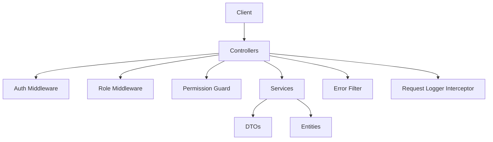
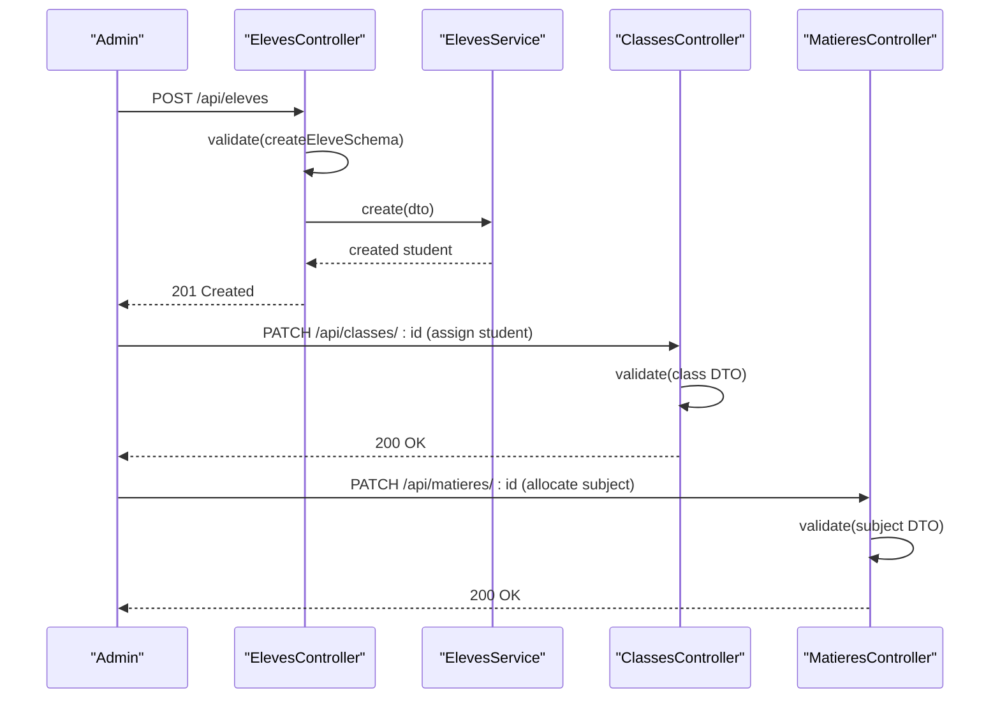
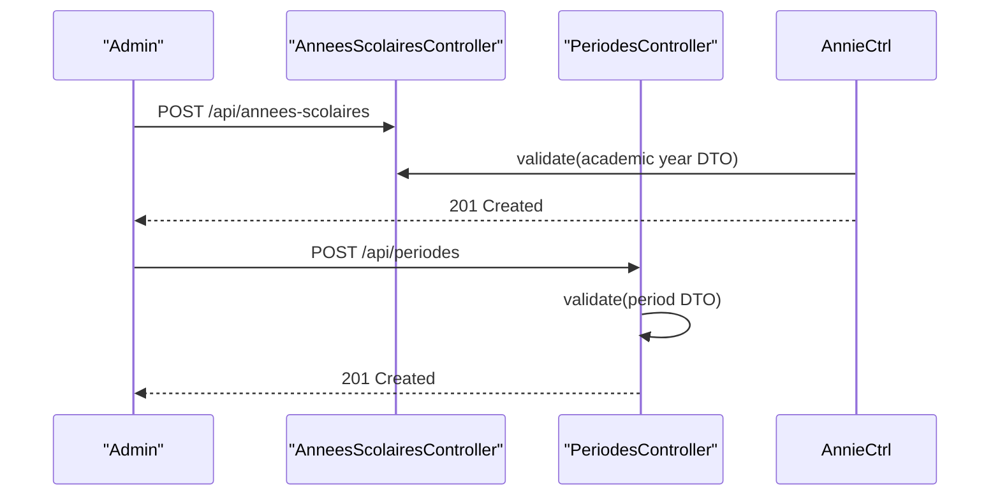
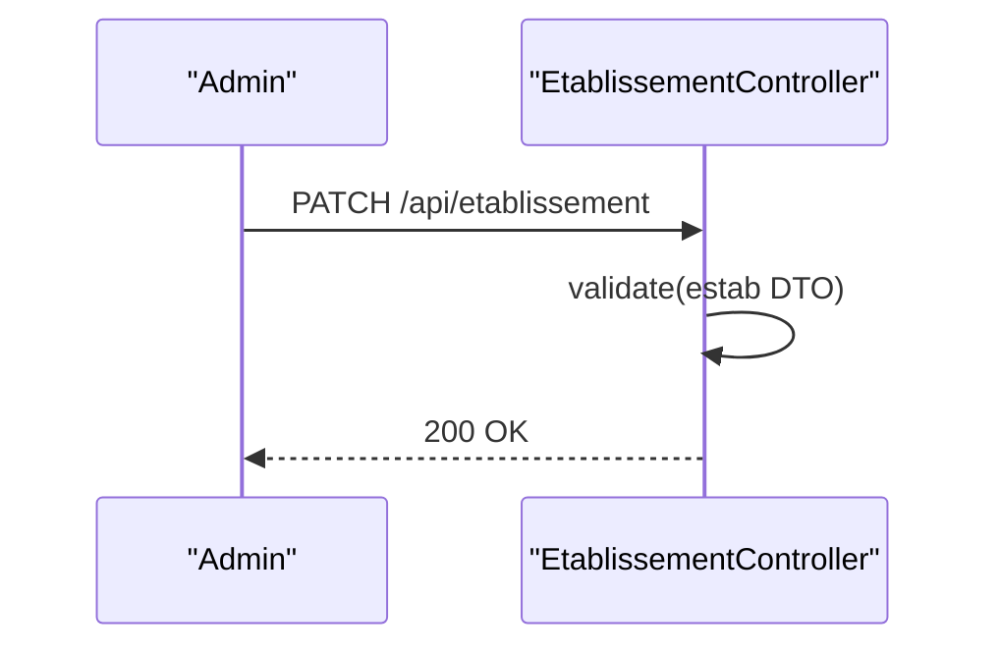
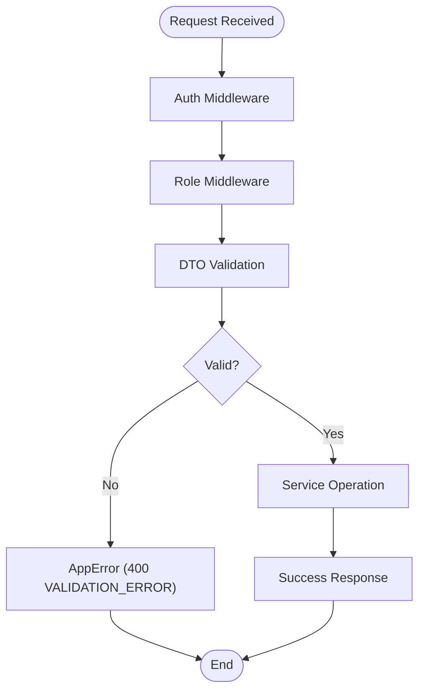
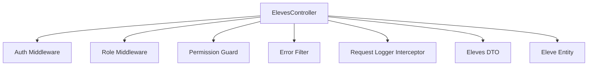

# Academic Management API

<cite>
**Referenced Files in This Document**
- [eleves.controller.ts](file://backend/src/modules/eleves/controllers/eleves.controller.ts)
- [eleves.dto.ts](file://backend/src/modules/eleves/dto/eleves.dto.ts)
- [eleve.entity.ts](file://backend/src/modules/eleves/entities/eleve.entity.ts)
- [classes.controller.ts](file://backend/src/modules/classes/controllers/classes.controller.ts)
- [niveaux.controller.ts](file://backend/src/modules/niveaux/controllers/niveaux.controller.ts)
- [matieres.controller.ts](file://backend/src/modules/matieres/controllers/matieres.controller.ts)
- [cycles.controller.ts](file://backend/src/modules/cycles/controllers/cycles.controller.ts)
- [annees-scolaires.controller.ts](file://backend/src/modules/annees-scolaires/controllers/annees-scolaires.controller.ts)
- [periodes.controller.ts](file://backend/src/modules/periodes/controllers/periodes.controller.ts)
- [etablissement.controller.ts](file://backend/src/modules/etablissement/controllers/etablissement.controller.ts)
- [bulletins.controller.ts](file://backend/src/modules/bulletins/controllers/bulletins.controller.ts)
- [notes.controller.ts](file://backend/src/modules/notes/controllers/notes.controller.ts)
- [auth.middleware.ts](file://backend/src/modules/auth/middlewares/auth.middleware.ts)
- [role.middleware.ts](file://backend/src/modules/auth/middlewares/role.middleware.ts)
- [permission.guard.ts](file://backend/src/modules/auth/guards/permission.guard.ts)
- [error.filter.ts](file://backend/src/common/filters/error.filter.ts)
- [request-logger.interceptor.ts](file://backend/src/common/interceptors/request-logger.interceptor.ts)
- [app.ts](file://backend/src/app.ts)
- [index.ts](file://backend/src/index.ts)
</cite>

## Table of Contents
1. [Introduction](#introduction)
2. [Project Structure](#project-structure)
3. [Core Components](#core-components)
4. [Architecture Overview](#architecture-overview)
5. [Detailed Component Analysis](#detailed-component-analysis)
6. [Dependency Analysis](#dependency-analysis)
7. [Performance Considerations](#performance-considerations)
8. [Troubleshooting Guide](#troubleshooting-guide)
9. [Conclusion](#conclusion)
10. [Appendices](#appendices)

## Introduction
This document provides comprehensive API documentation for the Academic Management module of the eLISAschool platform. It covers endpoints for students, classes, levels, subjects, cycles, academic years, periods, and establishment management. For each endpoint, we specify HTTP methods, URL patterns, request/response schemas, business rule validations, and operational workflows such as enrollment, class assignments, subject allocations, grading periods, and institutional hierarchy management. The documentation also outlines data relationships between academic entities, validation rules, and reporting capabilities, with examples of academic workflow integrations and administrative operations.

## Project Structure
The Academic Management module is organized by domain entities under the backend/src/modules directory. Each domain includes:
- Controllers: Express routers exposing HTTP endpoints
- DTOs: Validation schemas for request/response payloads
- Entities: Data models representing academic entities
- Services: Business logic implementations
- Guards/Middlewares: Authentication and authorization enforcement

```mermaid
graph TB
subgraph "Academic Modules"
E["ElevesController<br/>Students"]
C["ClassesController<br/>Classes"]
N["NiveauxController<br/>Levels"]
M["MatieresController<br/>Subjects"]
Y["AnneesScolairesController<br/>Academic Years"]
P["PeriodesController<br/>Periods"]
X["CyclesController<br/>Cycles"]
S["EtablissementController<br/>Establishment"]
B["BulletinsController<br/>Reports"]
T["NotesController<br/>Grades"]
end
subgraph "Auth & Common"
AM["Auth Middleware"]
RM["Role Middleware"]
PG["Permission Guard"]
EF["Error Filter"]
RI["Request Logger Interceptor"]
end
E --> AM
E --> RM
E --> PG
E --> EF
E --> RI
C --> AM
C --> RM
C --> PG
C --> EF
C --> RI
N --> AM
N --> RM
N --> PG
N --> EF
N --> RI
M --> AM
M --> RM
M --> PG
M --> EF
M --> RI
Y --> AM
Y --> RM
Y --> PG
Y --> EF
Y --> RI
P --> AM
P --> RM
P --> PG
P --> EF
P --> RI
X --> AM
X --> RM
X --> PG
X --> EF
X --> RI
S --> AM
S --> RM
S --> PG
S --> EF
S --> RI
B --> AM
B --> RM
B --> PG
B --> EF
B --> RI
T --> AM
T --> RM
T --> PG
T --> EF
T --> RI
```

**Diagram sources**
- [eleves.controller.ts:1-58](file://backend/src/modules/eleves/controllers/eleves.controller.ts#L1-L58)
- [classes.controller.ts](file://backend/src/modules/classes/controllers/classes.controller.ts)
- [niveaux.controller.ts](file://backend/src/modules/niveaux/controllers/niveaux.controller.ts)
- [matieres.controller.ts](file://backend/src/modules/matieres/controllers/matieres.controller.ts)
- [cycles.controller.ts](file://backend/src/modules/cycles/controllers/cycles.controller.ts)
- [annees-scolaires.controller.ts](file://backend/src/modules/annees-scolaires/controllers/annees-scolaires.controller.ts)
- [periodes.controller.ts](file://backend/src/modules/periodes/controllers/periodes.controller.ts)
- [etablissement.controller.ts](file://backend/src/modules/etablissement/controllers/etablissement.controller.ts)
- [bulletins.controller.ts](file://backend/src/modules/bulletins/controllers/bulletins.controller.ts)
- [notes.controller.ts](file://backend/src/modules/notes/controllers/notes.controller.ts)
- [auth.middleware.ts](file://backend/src/modules/auth/middlewares/auth.middleware.ts)
- [role.middleware.ts](file://backend/src/modules/auth/middlewares/role.middleware.ts)
- [permission.guard.ts](file://backend/src/modules/auth/guards/permission.guard.ts)
- [error.filter.ts](file://backend/src/common/filters/error.filter.ts)
- [request-logger.interceptor.ts](file://backend/src/common/interceptors/request-logger.interceptor.ts)

**Section sources**
- [app.ts](file://backend/src/app.ts)
- [index.ts](file://backend/src/index.ts)

## Core Components
This section documents the primary academic management endpoints and their associated schemas and validations.

### Students (Eleves)
- Base URL: `/api/eleves`
- Methods:
  - GET /: List all students with optional subsystem filter
  - POST /: Create a new student
  - PATCH /:id: Update an existing student
  - DELETE /:id: Delete a student record
- Authentication and Roles:
  - Requires authentication middleware
  - Allowed roles: ADMIN, SUPER_ADMIN, CHEF_ETABLISSEMENT, PERSONNEL for GET; ADMIN, SUPER_ADMIN, PERSONNEL for POST/PATCH; ADMIN, SUPER_ADMIN for DELETE
- Request/Response Schemas:
  - Creation and update schemas validated via Zod DTOs
  - Responses include success flag and data payload
- Business Rules:
  - Validation errors return structured error response
  - Deletion requires elevated privileges

**Section sources**
- [eleves.controller.ts:25-54](file://backend/src/modules/eleves/controllers/eleves.controller.ts#L25-L54)
- [eleves.dto.ts](file://backend/src/modules/eleves/dto/eleves.dto.ts)
- [eleve.entity.ts](file://backend/src/modules/eleves/entities/eleve.entity.ts)

### Classes (Classes)
- Base URL: `/api/classes`
- Methods:
  - GET /: List classes
  - POST /: Create a class
  - PATCH /:id: Update a class
  - DELETE /:id: Delete a class
- Authentication and Roles:
  - Requires authentication middleware
  - Allowed roles: ADMIN, SUPER_ADMIN, CHEF_ETABLISSEMENT, PERSONNEL
- Request/Response Schemas:
  - DTO validation enforced
  - Responses include success flag and data payload
- Business Rules:
  - Validation errors return structured error response

**Section sources**
- [classes.controller.ts](file://backend/src/modules/classes/controllers/classes.controller.ts)

### Levels (Niveaux)
- Base URL: `/api/niveaux`
- Methods:
  - GET /: List levels
  - POST /: Create a level
  - PATCH /:id: Update a level
  - DELETE /:id: Delete a level
- Authentication and Roles:
  - Requires authentication middleware
  - Allowed roles: ADMIN, SUPER_ADMIN, CHEF_ETABLISSEMENT, PERSONNEL
- Request/Response Schemas:
  - DTO validation enforced
  - Responses include success flag and data payload
- Business Rules:
  - Validation errors return structured error response

**Section sources**
- [niveaux.controller.ts](file://backend/src/modules/niveaux/controllers/niveaux.controller.ts)

### Subjects (Matieres)
- Base URL: `/api/matieres`
- Methods:
  - GET /: List subjects
  - POST /: Create a subject
  - PATCH /:id: Update a subject
  - DELETE /:id: Delete a subject
- Authentication and Roles:
  - Requires authentication middleware
  - Allowed roles: ADMIN, SUPER_ADMIN, CHEF_ETABLISSEMENT, PERSONNEL
- Request/Response Schemas:
  - DTO validation enforced
  - Responses include success flag and data payload
- Business Rules:
  - Validation errors return structured error response

**Section sources**
- [matieres.controller.ts](file://backend/src/modules/matieres/controllers/matieres.controller.ts)

### Cycles
- Base URL: `/api/cycles`
- Methods:
  - GET /: List cycles
  - POST /: Create a cycle
  - PATCH /:id: Update a cycle
  - DELETE /:id: Delete a cycle
- Authentication and Roles:
  - Requires authentication middleware
  - Allowed roles: ADMIN, SUPER_ADMIN, CHEF_ETABLISSEMENT, PERSONNEL
- Request/Response Schemas:
  - DTO validation enforced
  - Responses include success flag and data payload
- Business Rules:
  - Validation errors return structured error response

**Section sources**
- [cycles.controller.ts](file://backend/src/modules/cycles/controllers/cycles.controller.ts)

### Academic Years (AnneesScolaires)
- Base URL: `/api/annees-scolaires`
- Methods:
  - GET /: List academic years
  - POST /: Create an academic year
  - PATCH /:id: Update an academic year
  - DELETE /:id: Delete an academic year
- Authentication and Roles:
  - Requires authentication middleware
  - Allowed roles: ADMIN, SUPER_ADMIN, CHEF_ETABLISSEMENT, PERSONNEL
- Request/Response Schemas:
  - DTO validation enforced
  - Responses include success flag and data payload
- Business Rules:
  - Validation errors return structured error response

**Section sources**
- [annees-scolaires.controller.ts](file://backend/src/modules/annees-scolaires/controllers/annees-scolaires.controller.ts)

### Periods (Periodes)
- Base URL: `/api/periodes`
- Methods:
  - GET /: List periods
  - POST /: Create a period
  - PATCH /:id: Update a period
  - DELETE /:id: Delete a period
- Authentication and Roles:
  - Requires authentication middleware
  - Allowed roles: ADMIN, SUPER_ADMIN, CHEF_ETABLISSEMENT, PERSONNEL
- Request/Response Schemas:
  - DTO validation enforced
  - Responses include success flag and data payload
- Business Rules:
  - Validation errors return structured error response

**Section sources**
- [periodes.controller.ts](file://backend/src/modules/periodes/controllers/periodes.controller.ts)

### Establishment (Etablissement)
- Base URL: `/api/etablissement`
- Methods:
  - GET /: Retrieve establishment details
  - PATCH /: Update establishment details
- Authentication and Roles:
  - Requires authentication middleware
  - Allowed roles: ADMIN, SUPER_ADMIN, CHEF_ETABLISSEMENT
- Request/Response Schemas:
  - DTO validation enforced
  - Responses include success flag and data payload
- Business Rules:
  - Validation errors return structured error response

**Section sources**
- [etablissement.controller.ts](file://backend/src/modules/etablissement/controllers/etablissement.controller.ts)

### Reports (Bulletins)
- Base URL: `/api/bulletins`
- Methods:
  - GET /: List reports
  - POST /: Create a report
  - PATCH /:id: Update a report
  - DELETE /:id: Delete a report
- Authentication and Roles:
  - Requires authentication middleware
  - Allowed roles: ADMIN, SUPER_ADMIN, CHEF_ETABLISSEMENT, PERSONNEL
- Request/Response Schemas:
  - DTO validation enforced
  - Responses include success flag and data payload
- Business Rules:
  - Validation errors return structured error response

**Section sources**
- [bulletins.controller.ts](file://backend/src/modules/bulletins/controllers/bulletins.controller.ts)

### Grades (Notes)
- Base URL: `/api/notes`
- Methods:
  - GET /: List grades
  - POST /: Create a grade
  - PATCH /:id: Update a grade
  - DELETE /:id: Delete a grade
- Authentication and Roles:
  - Requires authentication middleware
  - Allowed roles: ADMIN, SUPER_ADMIN, CHEF_ETABLISSEMENT, PERSONNEL
- Request/Response Schemas:
  - DTO validation enforced
  - Responses include success flag and data payload
- Business Rules:
  - Validation errors return structured error response

**Section sources**
- [notes.controller.ts](file://backend/src/modules/notes/controllers/notes.controller.ts)

## Architecture Overview
The Academic Management API follows a layered architecture:
- Controllers handle HTTP requests, enforce authentication/authorization, and delegate to services
- Services encapsulate business logic and coordinate with repositories/entities
- DTOs validate request/response payloads
- Middlewares and guards enforce authentication and role-based access
- Filters and interceptors standardize error handling and logging

**Diagram sources**
- [eleves.controller.ts:1-58](file://backend/src/modules/eleves/controllers/eleves.controller.ts#L1-L58)
- [auth.middleware.ts](file://backend/src/modules/auth/middlewares/auth.middleware.ts)
- [role.middleware.ts](file://backend/src/modules/auth/middlewares/role.middleware.ts)
- [permission.guard.ts](file://backend/src/modules/auth/guards/permission.guard.ts)
- [error.filter.ts](file://backend/src/common/filters/error.filter.ts)
- [request-logger.interceptor.ts](file://backend/src/common/interceptors/request-logger.interceptor.ts)

## Detailed Component Analysis

### Student Enrollment Workflow
This workflow demonstrates enrollment, class assignment, and subject allocation.

**Diagram sources**
- [eleves.controller.ts:33-39](file://backend/src/modules/eleves/controllers/eleves.controller.ts#L33-L39)
- [classes.controller.ts](file://backend/src/modules/classes/controllers/classes.controller.ts)
- [matieres.controller.ts](file://backend/src/modules/matieres/controllers/matieres.controller.ts)

### Academic Year and Period Management
Academic year and period management ensures proper scheduling and grading periods.

**Diagram sources**
- [annees-scolaires.controller.ts](file://backend/src/modules/annees-scolaires/controllers/annees-scolaires.controller.ts)
- [periodes.controller.ts](file://backend/src/modules/periodes/controllers/periodes.controller.ts)

### Establishment Hierarchy Management
Establishment-level updates manage institutional hierarchy and policies.

**Diagram sources**
- [etablissement.controller.ts](file://backend/src/modules/etablissement/controllers/etablissement.controller.ts)

### Validation and Error Handling Flow
Validation and error handling are centralized across controllers.

**Diagram sources**
- [eleves.controller.ts:17-23](file://backend/src/modules/eleves/controllers/eleves.controller.ts#L17-L23)
- [error.filter.ts](file://backend/src/common/filters/error.filter.ts)

## Dependency Analysis
The Academic Management module relies on shared authentication and common utilities for consistent behavior across endpoints.

**Diagram sources**
- [eleves.controller.ts:1-58](file://backend/src/modules/eleves/controllers/eleves.controller.ts#L1-L58)
- [auth.middleware.ts](file://backend/src/modules/auth/middlewares/auth.middleware.ts)
- [role.middleware.ts](file://backend/src/modules/auth/middlewares/role.middleware.ts)
- [permission.guard.ts](file://backend/src/modules/auth/guards/permission.guard.ts)
- [error.filter.ts](file://backend/src/common/filters/error.filter.ts)
- [request-logger.interceptor.ts](file://backend/src/common/interceptors/request-logger.interceptor.ts)
- [eleves.dto.ts](file://backend/src/modules/eleves/dto/eleves.dto.ts)
- [eleve.entity.ts](file://backend/src/modules/eleves/entities/eleve.entity.ts)

**Section sources**
- [eleves.controller.ts:1-58](file://backend/src/modules/eleves/controllers/eleves.controller.ts#L1-L58)

## Performance Considerations
- Centralized validation reduces redundant checks and improves error consistency
- Logging interceptor enables request tracing without modifying controller logic
- Role-based access control minimizes unauthorized operations and reduces downstream failures
- DTO-driven validation prevents malformed payloads and reduces service-level error handling overhead

## Troubleshooting Guide
Common issues and resolutions:
- Validation errors: Ensure request payloads conform to DTO schemas; errors are returned with a structured format indicating validation failures
- Authentication failures: Verify bearer tokens and ensure the user has the required roles
- Authorization failures: Confirm the requesting user’s role aligns with endpoint permissions
- Logging: Enable request logging to capture request/response metadata for debugging

**Section sources**
- [error.filter.ts](file://backend/src/common/filters/error.filter.ts)
- [request-logger.interceptor.ts](file://backend/src/common/interceptors/request-logger.interceptor.ts)
- [permission.guard.ts](file://backend/src/modules/auth/guards/permission.guard.ts)

## Conclusion
The Academic Management API provides a robust, secure, and scalable foundation for managing educational institution data. By enforcing strict validation, authentication, and authorization controls, it ensures data integrity and operational safety. The documented endpoints, schemas, and workflows enable administrators to efficiently manage students, classes, levels, subjects, cycles, academic years, periods, and establishment hierarchies while supporting reporting and grading operations.

## Appendices

### Endpoint Reference Summary
- Students: GET /api/eleves, POST /api/eleves, PATCH /api/eleves/:id, DELETE /api/eleves/:id
- Classes: GET /api/classes, POST /api/classes, PATCH /api/classes/:id, DELETE /api/classes/:id
- Levels: GET /api/niveaux, POST /api/niveaux, PATCH /api/niveaux/:id, DELETE /api/niveaux/:id
- Subjects: GET /api/matieres, POST /api/matieres, PATCH /api/matieres/:id, DELETE /api/matieres/:id
- Cycles: GET /api/cycles, POST /api/cycles, PATCH /api/cycles/:id, DELETE /api/cycles/:id
- Academic Years: GET /api/annees-scolaires, POST /api/annees-scolaires, PATCH /api/annees-scolaires/:id, DELETE /api/annees-scolaires/:id
- Periods: GET /api/periodes, POST /api/periodes, PATCH /api/periodes/:id, DELETE /api/periodes/:id
- Establishment: GET /api/etablissement, PATCH /api/etablissement
- Reports: GET /api/bulletins, POST /api/bulletins, PATCH /api/bulletins/:id, DELETE /api/bulletins/:id
- Grades: GET /api/notes, POST /api/notes, PATCH /api/notes/:id, DELETE /api/notes/:id