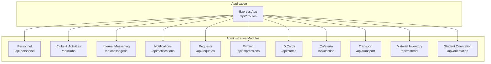
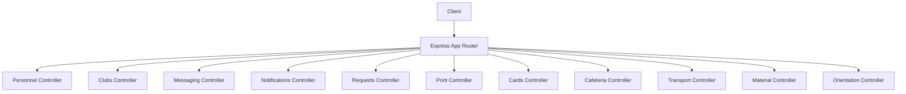
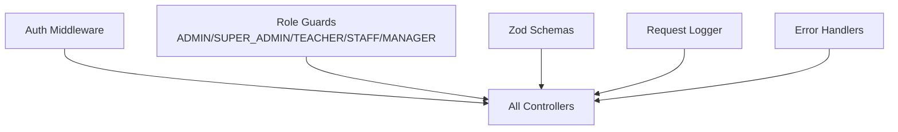

# Administrative Services API

<cite>
**Referenced Files in This Document**
- [personnel.controller.ts](file://backend/src/modules/personnel/controllers/personnel.controller.ts)
- [personnel.dto.ts](file://backend/src/modules/personnel/dto/personnel.dto.ts)
- [clubs.controller.ts](file://backend/src/modules/clubs/controllers/clubs.controller.ts)
- [club.dto.ts](file://backend/src/modules/clubs/dto/club.dto.ts)
- [messagerie.controller.ts](file://backend/src/modules/messagerie/controllers/messagerie.controller.ts)
- [messagerie.dto.ts](file://backend/src/modules/messagerie/dto/messagerie.dto.ts)
- [notifications.controller.ts](file://backend/src/modules/notifications/controllers/notifications.controller.ts)
- [requetes.controller.ts](file://backend/src/modules/requetes/controllers/requetes.controller.ts)
- [impressions.controller.ts](file://backend/src/modules/impressions/controllers/impressions.controller.ts)
- [cartes.controller.ts](file://backend/src/modules/cartes/controllers/cartes.controller.ts)
- [cantine.controller.ts](file://backend/src/modules/cantine/controllers/cantine.controller.ts)
- [transport.controller.ts](file://backend/src/modules/transport/controllers/transport.controller.ts)
- [materiel.controller.ts](file://backend/src/modules/materiel/controllers/materiel.controller.ts)
- [orientation.controller.ts](file://backend/src/modules/orientation/controllers/orientation.controller.ts)
- [app.ts](file://backend/src/app.ts)
</cite>

## Table of Contents
1. [Introduction](#introduction)
2. [Project Structure](#project-structure)
3. [Core Components](#core-components)
4. [Architecture Overview](#architecture-overview)
5. [Detailed Component Analysis](#detailed-component-analysis)
6. [Dependency Analysis](#dependency-analysis)
7. [Performance Considerations](#performance-considerations)
8. [Troubleshooting Guide](#troubleshooting-guide)
9. [Conclusion](#conclusion)
10. [Appendices](#appendices)

## Introduction
This document provides comprehensive API documentation for the Administrative Services module of the eLISAschool platform. It covers endpoints for personnel management, clubs and activities, internal messaging, notifications, administrative requests, printing services, ID cards, cafeteria management, transportation, material inventory, and student orientation. For each endpoint, you will find HTTP methods, URL patterns, request/response schemas, and operational workflows. The documentation also outlines approval processes, resource allocation, service delivery flows, inter-module communications, and administrative reporting capabilities.

## Project Structure
The backend is organized by feature modules under backend/src/modules. Administrative Services spans several modules, each exposing REST endpoints mounted under /api/<module> in the main application.

**Diagram sources**
- [app.ts:149-185](file://backend/src/app.ts#L149-L185)

**Section sources**
- [app.ts:149-185](file://backend/src/app.ts#L149-L185)

## Core Components
- Authentication and Authorization: All controllers apply middleware to enforce authentication and role-based access control. Controllers rely on shared guards and middlewares for roles such as ADMIN, SUPER_ADMIN, CHEF_ETABLISSEMENT, ENSEIGNANT, STAFF, and MANAGER.
- Validation: Each controller validates incoming payloads using Zod schemas defined in the module DTOs.
- Error Handling: Centralized error handling and not-found handlers ensure consistent responses across modules.

Key responsibilities per module:
- Personnel: Manage staff types and members, with role-gated creation, updates, and deletions.
- Clubs: CRUD for clubs, member enrollments, and events.
- Messaging: Conversations and messages with pagination and attachments.
- Notifications: User-centric notifications, bulk creation, read/unread management, and deletion.
- Requests: Submission, viewing, processing, and cancellation of administrative requests.
- Printing: Document templates, print queue, generation, and batch processing.
- ID Cards: Card lifecycle management (issue, disable, report loss).
- Cafeteria: Menus, student subscriptions, balance recharge, and consumption registration.
- Transport: Bus routes, student subscriptions, daily presence tracking.
- Material Inventory: Equipment catalog, current loans, and returns.
- Orientation: Student profiles, career guidance resources, and appointments.

**Section sources**
- [personnel.controller.ts:17-71](file://backend/src/modules/personnel/controllers/personnel.controller.ts#L17-L71)
- [clubs.controller.ts:10-51](file://backend/src/modules/clubs/controllers/clubs.controller.ts#L10-L51)
- [messagerie.controller.ts:16-61](file://backend/src/modules/messagerie/controllers/messagerie.controller.ts#L16-L61)
- [notifications.controller.ts:18-161](file://backend/src/modules/notifications/controllers/notifications.controller.ts#L18-L161)
- [requetes.controller.ts:10-55](file://backend/src/modules/requetes/controllers/requetes.controller.ts#L10-L55)
- [impressions.controller.ts:18-108](file://backend/src/modules/impressions/controllers/impressions.controller.ts#L18-L108)
- [cartes.controller.ts:10-67](file://backend/src/modules/cartes/controllers/cartes.controller.ts#L10-L67)
- [cantine.controller.ts:10-68](file://backend/src/modules/cantine/controllers/cantine.controller.ts#L10-L68)
- [transport.controller.ts:10-59](file://backend/src/modules/transport/controllers/transport.controller.ts#L10-L59)
- [materiel.controller.ts:10-59](file://backend/src/modules/materiel/controllers/materiel.controller.ts#L10-L59)
- [orientation.controller.ts:18-125](file://backend/src/modules/orientation/controllers/orientation.controller.ts#L18-L125)

## Architecture Overview
The API follows a layered architecture:
- Controllers handle HTTP requests, validate payloads, and delegate to services.
- Services encapsulate business logic and coordinate with repositories/data sources.
- DTOs define strict request/response schemas validated via Zod.
- Shared middlewares enforce authentication and role checks.
- Global middleware stack includes security headers, CORS, rate limiting, compression, and request logging.

**Diagram sources**
- [app.ts:149-185](file://backend/src/app.ts#L149-L185)
- [personnel.controller.ts:14-73](file://backend/src/modules/personnel/controllers/personnel.controller.ts#L14-L73)
- [clubs.controller.ts:7-68](file://backend/src/modules/clubs/controllers/clubs.controller.ts#L7-L68)
- [messagerie.controller.ts:13-63](file://backend/src/modules/messagerie/controllers/messagerie.controller.ts#L13-L63)
- [notifications.controller.ts:15-163](file://backend/src/modules/notifications/controllers/notifications.controller.ts#L15-L163)
- [requetes.controller.ts:7-64](file://backend/src/modules/requetes/controllers/requetes.controller.ts#L7-L64)
- [impressions.controller.ts:15-111](file://backend/src/modules/impressions/controllers/impressions.controller.ts#L15-L111)
- [cartes.controller.ts:7-69](file://backend/src/modules/cartes/controllers/cartes.controller.ts#L7-L69)
- [cantine.controller.ts:7-70](file://backend/src/modules/cantine/controllers/cantine.controller.ts#L7-L70)
- [transport.controller.ts:7-68](file://backend/src/modules/transport/controllers/transport.controller.ts#L7-L68)
- [materiel.controller.ts:7-61](file://backend/src/modules/materiel/controllers/materiel.controller.ts#L7-L61)
- [orientation.controller.ts:15-128](file://backend/src/modules/orientation/controllers/orientation.controller.ts#L15-L128)

## Detailed Component Analysis

### Personnel Management
Endpoints for managing staff types and members.

- GET /api/personnel/types
  - Description: List staff types.
  - Auth: Required.
  - Response: Array of types with code, name, and default permissions.

- POST /api/personnel/types
  - Description: Create a new staff type.
  - Auth: ADMIN or SUPER_ADMIN.
  - Request body: [CreateTypePersonnelDto:9-13](file://backend/src/modules/personnel/dto/personnel.dto.ts#L9-L13)
  - Response: Created type.

- GET /api/personnel
  - Description: List all personnel (optionally filtered by type).
  - Auth: ADMIN, SUPER_ADMIN, or CHEF_ETABLISSEMENT.
  - Query params: typeId (optional UUID).
  - Response: Array of personnel records.

- POST /api/personnel
  - Description: Add a new personnel member.
  - Auth: ADMIN or SUPER_ADMIN.
  - Request body: [CreatePersonnelDto:15-23](file://backend/src/modules/personnel/dto/personnel.dto.ts#L15-L23)
  - Response: Created member.

- PATCH /api/personnel/:id
  - Description: Update a personnel member.
  - Auth: ADMIN or SUPER_ADMIN.
  - Path params: id (UUID).
  - Request body: [UpdatePersonnelDto:25-29](file://backend/src/modules/personnel/dto/personnel.dto.ts#L25-L29)
  - Response: Updated member.

- DELETE /api/personnel/:id
  - Description: Remove a personnel member.
  - Auth: ADMIN or SUPER_ADMIN.
  - Path params: id (UUID).
  - Response: Deletion confirmation.

Operational notes:
- Validation uses Zod schemas to ensure data integrity.
- Role gating ensures only authorized administrators can manage types and members.

**Section sources**
- [personnel.controller.ts:26-71](file://backend/src/modules/personnel/controllers/personnel.controller.ts#L26-L71)
- [personnel.dto.ts:9-29](file://backend/src/modules/personnel/dto/personnel.dto.ts#L9-L29)

### Clubs and Activities
Endpoints for managing clubs, enrollments, and events.

- GET /api/clubs
  - Description: List all clubs.
  - Response: Array of clubs.

- GET /api/clubs/:id
  - Description: Get a specific club.
  - Path params: id (UUID).
  - Response: Club object.

- POST /api/clubs
  - Description: Create a new club.
  - Auth: ADMIN.
  - Request body: [CreateClubDto:3-11](file://backend/src/modules/clubs/dto/club.dto.ts#L3-L11)
  - Response: Created club.

- GET /api/clubs/:id/inscrits
  - Description: Get enrolled students for a club.
  - Auth: STAFF.
  - Path params: id (UUID).
  - Response: Array of enrollments.

- POST /api/clubs/inscriptions
  - Description: Enroll a student in a club.
  - Auth: STAFF.
  - Request body: [InscrireClubDto:13-16](file://backend/src/modules/clubs/dto/club.dto.ts#L13-L16)
  - Response: Enrollment record.

- GET /api/clubs/:id/evenements
  - Description: List events for a club.
  - Path params: id (UUID).
  - Response: Array of events.

- POST /api/clubs/:id/evenements
  - Description: Create an event for a club.
  - Auth: STAFF.
  - Path params: id (UUID).
  - Request body: [CreateEvenementDto:18-24](file://backend/src/modules/clubs/dto/club.dto.ts#L18-L24)
  - Response: Event record.

Approval and workflow:
- Creation of clubs and events requires ADMIN privileges.
- Enrollments require STAFF privileges and involve student consent and capacity checks.

**Section sources**
- [clubs.controller.ts:16-66](file://backend/src/modules/clubs/controllers/clubs.controller.ts#L16-L66)
- [club.dto.ts:3-24](file://backend/src/modules/clubs/dto/club.dto.ts#L3-L24)

### Internal Messaging
Endpoints for conversations and messages.

- GET /api/messagerie/conversations
  - Description: List user conversations with pagination and filtering.
  - Auth: Required.
  - Query: [QueryConversationsDto:26-30](file://backend/src/modules/messagerie/dto/messagerie.dto.ts#L26-L30)
  - Response: Paginated list of conversations.

- POST /api/messagerie/conversations
  - Description: Create a new conversation.
  - Auth: Required.
  - Request body: [CreateConversationDto:9-13](file://backend/src/modules/messagerie/dto/messagerie.dto.ts#L9-L13)
  - Response: Conversation object.

- GET /api/messagerie/conversations/:id/messages
  - Description: Retrieve messages with pagination and temporal filtering.
  - Auth: Required.
  - Path params: id (UUID).
  - Query: [QueryMessagesDto:32-36](file://backend/src/modules/messagerie/dto/messagerie.dto.ts#L32-L36)
  - Response: Paginated messages.

- POST /api/messagerie/conversations/:id/messages
  - Description: Send a message in a conversation.
  - Auth: Required.
  - Path params: id (UUID).
  - Request body: [SendMessageDto:15-24](file://backend/src/modules/messagerie/dto/messagerie.dto.ts#L15-L24)
  - Response: Message object.

- DELETE /api/messagerie/messages/:id
  - Description: Delete a message.
  - Auth: Required.
  - Path params: id (UUID).
  - Response: Deletion confirmation.

Operational notes:
- Attachments are supported for messages with metadata (name, URL, MIME type, size).
- Pagination defaults are applied when omitted.

**Section sources**
- [messagerie.controller.ts:24-61](file://backend/src/modules/messagerie/controllers/messagerie.controller.ts#L24-L61)
- [messagerie.dto.ts:9-41](file://backend/src/modules/messagerie/dto/messagerie.dto.ts#L9-L41)

### Notifications
Endpoints for user-centric notifications.

- GET /api/notifications
  - Description: List user notifications with pagination.
  - Auth: Required.
  - Query: [QueryNotificationsSchema:35-36](file://backend/src/modules/notifications/controllers/notifications.controller.ts#L35-L36)
  - Response: Paginated notifications.

- GET /api/notifications/count
  - Description: Count unread notifications.
  - Auth: Required.
  - Response: { unreadCount: number }.

- POST /api/notifications
  - Description: Create a notification (ADMIN only).
  - Auth: ADMIN.
  - Request body: [CreateNotificationSchema:72-73](file://backend/src/modules/notifications/controllers/notifications.controller.ts#L72-L73)
  - Response: Notification object.

- POST /api/notifications/bulk
  - Description: Create multiple notifications (ADMIN only).
  - Auth: ADMIN.
  - Request body: [CreateBulkNotificationSchema:90-93](file://backend/src/modules/notifications/controllers/notifications.controller.ts#L90-L93)
  - Response: { count: number }.

- PATCH /api/notifications/:id/read
  - Description: Mark a notification as read.
  - Auth: Required.
  - Path params: id (UUID).
  - Response: Notification object.

- PATCH /api/notifications/read-all
  - Description: Mark all notifications as read.
  - Auth: Required.
  - Response: { count: number }.

- DELETE /api/notifications/:id
  - Description: Delete a notification.
  - Auth: Required.
  - Path params: id (UUID).
  - Response: Deletion confirmation.

Operational notes:
- Read/unread tracking is user-scoped.
- Bulk creation supports administrative mass communication.

**Section sources**
- [notifications.controller.ts:33-161](file://backend/src/modules/notifications/controllers/notifications.controller.ts#L33-L161)

### Administrative Requests
Endpoints for submitting and processing requests.

- GET /api/requetes
  - Description: List all requests (MANAGER only).
  - Auth: MANAGER.
  - Query: [QueryRequetesSchema:20-21](file://backend/src/modules/requetes/controllers/requetes.controller.ts#L20-L21)
  - Response: Paginated requests.

- GET /api/requetes/mes-requetes
  - Description: List user’s own requests.
  - Auth: Required.
  - Query: [QueryRequetesSchema:28-29](file://backend/src/modules/requetes/controllers/requetes.controller.ts#L28-L29)
  - Response: Paginated requests.

- GET /api/requetes/:id
  - Description: Get a specific request.
  - Auth: Required.
  - Path params: id (UUID).
  - Response: Request object.

- POST /api/requetes
  - Description: Submit a new request.
  - Auth: Required.
  - Request body: [CreateRequeteSchema:43-44](file://backend/src/modules/requetes/controllers/requetes.controller.ts#L43-L44)
  - Response: Created request.

- POST /api/requetes/:id/traiter
  - Description: Process a request (MANAGER only).
  - Auth: MANAGER.
  - Path params: id (UUID).
  - Request body: [TraiterRequeteSchema:51-52](file://backend/src/modules/requetes/controllers/requetes.controller.ts#L51-L52)
  - Response: Updated request with status.

- POST /api/requetes/:id/annuler
  - Description: Cancel a request (submitter or authorized).
  - Auth: Required.
  - Path params: id (UUID).
  - Response: Cancelled request.

Approval process:
- Requests are submitted by users and processed by managers.
- Status updates are logged and notifications can be triggered by services.

**Section sources**
- [requetes.controller.ts:18-55](file://backend/src/modules/requetes/controllers/requetes.controller.ts#L18-L55)

### Printing Services
Endpoints for document templates and print queue.

- GET /api/impressions/modeles
  - Description: List print templates (filter by type optional).
  - Auth: Required.
  - Query: type (enum TypeDocument).
  - Response: Templates.

- GET /api/impressions/modeles/:id
  - Description: Get a template.
  - Auth: Required.
  - Path params: id (UUID).
  - Response: Template.

- POST /api/impressions/modeles
  - Description: Create a template (ADMIN only).
  - Auth: ADMIN.
  - Request body: [CreateModeleSchema:44-44](file://backend/src/modules/impressions/controllers/impressions.controller.ts#L44-L44)
  - Response: Template.

- PATCH /api/impressions/modeles/:id
  - Description: Update a template (ADMIN only).
  - Auth: ADMIN.
  - Path params: id (UUID).
  - Request body: [UpdateModeleSchema:52-52](file://backend/src/modules/impressions/controllers/impressions.controller.ts#L52-L52)
  - Response: Template.

- DELETE /api/impressions/modeles/:id
  - Description: Delete a template (ADMIN only).
  - Auth: ADMIN.
  - Path params: id (UUID).
  - Response: Deletion confirmation.

- GET /api/impressions/file
  - Description: Get current user’s print queue.
  - Auth: Required.
  - Response: Queue items.

- POST /api/impressions/file
  - Description: Add a print job.
  - Auth: Required.
  - Request body: [CreateImpressionSchema:76-76](file://backend/src/modules/impressions/controllers/impressions.controller.ts#L76-L76)
  - Response: Print job.

- GET /api/impressions/file/:id
  - Description: Get a specific print job.
  - Auth: Required.
  - Path params: id (UUID).
  - Response: Print job.

- POST /api/impressions/file/:id/annuler
  - Description: Cancel a print job.
  - Auth: Required.
  - Path params: id (UUID).
  - Response: Cancelled job.

- POST /api/impressions/file/:id/generer
  - Description: Generate the document for a print job.
  - Auth: Required.
  - Path params: id (UUID).
  - Response: { fichierUrl: string }.

- POST /api/impressions/traiter
  - Description: Process the print queue (ADMIN only).
  - Auth: ADMIN.
  - Response: { traites: number }.

Resource allocation:
- Templates define document structure and placeholders.
- Batch processing handles queued jobs asynchronously.

**Section sources**
- [impressions.controller.ts:27-108](file://backend/src/modules/impressions/controllers/impressions.controller.ts#L27-L108)

### ID Cards
Endpoints for card lifecycle management.

- GET /api/cartes/utilisateur/:utilisateurId
  - Description: List cards for a user.
  - Auth: Required.
  - Path params: utilisateurId (UUID).
  - Response: Cards.

- GET /api/cartes/numero/:numeroCarte
  - Description: Find a card by number (STAFF only).
  - Auth: STAFF.
  - Path params: numeroCarte (string).
  - Response: Card.

- GET /api/cartes/:id
  - Description: Get a specific card.
  - Auth: Required.
  - Path params: id (UUID).
  - Response: Card.

- POST /api/cartes
  - Description: Issue a new card (STAFF only).
  - Auth: STAFF.
  - Request body: [CreateCarteSchema:41-41](file://backend/src/modules/cartes/controllers/cartes.controller.ts#L41-L41)
  - Response: Card.

- PATCH /api/cartes/:id
  - Description: Update card details (STAFF only).
  - Auth: STAFF.
  - Path params: id (UUID).
  - Request body: [UpdateCarteSchema:49-49](file://backend/src/modules/cartes/controllers/cartes.controller.ts#L49-L49)
  - Response: Card.

- POST /api/cartes/:id/desactiver
  - Description: Disable a card (STAFF only).
  - Auth: STAFF.
  - Path params: id (UUID).
  - Response: Disabled card.

- POST /api/cartes/:id/perte
  - Description: Report a lost card.
  - Auth: Required.
  - Path params: id (UUID).
  - Response: Reported card.

**Section sources**
- [cartes.controller.ts:18-67](file://backend/src/modules/cartes/controllers/cartes.controller.ts#L18-L67)

### Cafeteria Management
Endpoints for menus, subscriptions, balances, and consumption.

- GET /api/cantine/menus
  - Description: List menus with filters.
  - Query: [QueryMenusSchema:18-18](file://backend/src/modules/cantine/controllers/cantine.controller.ts#L18-L18)
  - Response: Menus.

- GET /api/cantine/menus/aujourd-hui
  - Description: Get today’s menus.
  - Response: Menus.

- POST /api/cantine/menus
  - Description: Create a menu (STAFF only).
  - Auth: STAFF.
  - Request body: [CreateMenuSchema:33-33](file://backend/src/modules/cantine/controllers/cantine.controller.ts#L33-L33)
  - Response: Menu.

- POST /api/cantine/inscriptions
  - Description: Subscribe a student (STAFF only).
  - Auth: STAFF.
  - Request body: [CreateInscriptionSchema:41-41](file://backend/src/modules/cantine/controllers/cantine.controller.ts#L41-L41)
  - Response: Subscription.

- GET /api/cantine/inscriptions/:eleveId
  - Description: Get a student’s subscription.
  - Auth: Required.
  - Path params: eleveId (UUID).
  - Response: Subscription.

- POST /api/cantine/inscriptions/:id/recharger
  - Description: Recharge a subscription balance (STAFF only).
  - Auth: STAFF.
  - Path params: id (UUID).
  - Request body: [RechargerSoldeSchema:56-56](file://backend/src/modules/cantine/controllers/cantine.controller.ts#L56-L56)
  - Response: Subscription with updated balance.

- POST /api/cantine/consommations
  - Description: Record a consumption (STAFF only).
  - Auth: STAFF.
  - Request body: [EnregistrerConsommationSchema:64-64](file://backend/src/modules/cantine/controllers/cantine.controller.ts#L64-L64)
  - Response: Consumption record.

Resource allocation:
- Subscriptions track balances and validity periods.
- Consumption logs support reporting and analytics.

**Section sources**
- [cantine.controller.ts:16-68](file://backend/src/modules/cantine/controllers/cantine.controller.ts#L16-L68)

### Transportation
Endpoints for bus routes, subscriptions, and presence tracking.

- GET /api/transport/lignes
  - Description: List bus routes.
  - Response: Routes.

- GET /api/transport/lignes/:id
  - Description: Get a specific route.
  - Path params: id (UUID).
  - Response: Route.

- POST /api/transport/lignes
  - Description: Create a route (ADMIN only).
  - Auth: ADMIN.
  - Request body: [CreateLigneSchema:32-32](file://backend/src/modules/transport/controllers/transport.controller.ts#L32-L32)
  - Response: Route.

- GET /api/transport/lignes/:id/inscriptions
  - Description: Get enrollments for a route (STAFF only).
  - Auth: STAFF.
  - Path params: id (UUID).
  - Response: Enrollments.

- POST /api/transport/inscriptions
  - Description: Enroll a student (STAFF only).
  - Auth: STAFF.
  - Request body: [CreateInscriptionTransportSchema:47-47](file://backend/src/modules/transport/controllers/transport.controller.ts#L47-L47)
  - Response: Enrollment.

- POST /api/transport/presences
  - Description: Record daily presence (STAFF only).
  - Auth: STAFF.
  - Request body: [EnregistrerPresenceSchema:55-55](file://backend/src/modules/transport/controllers/transport.controller.ts#L55-L55)
  - Response: Presence record.

- GET /api/transport/lignes/:id/presences/aujourd-hui
  - Description: Get today’s presence list (STAFF only).
  - Auth: STAFF.
  - Path params: id (UUID).
  - Response: Presences.

**Section sources**
- [transport.controller.ts:16-66](file://backend/src/modules/transport/controllers/transport.controller.ts#L16-L66)

### Material Inventory
Endpoints for equipment catalog, current loans, and returns.

- GET /api/materiel
  - Description: List materials (filter by category optional).
  - Auth: Required.
  - Query: category (string).
  - Response: Materials.

- GET /api/materiel/prets
  - Description: List current loans (STAFF only).
  - Auth: STAFF.
  - Response: Loans.

- GET /api/materiel/:id
  - Description: Get a specific material.
  - Auth: Required.
  - Path params: id (UUID).
  - Response: Material.

- POST /api/materiel
  - Description: Add new material (STAFF only).
  - Auth: STAFF.
  - Request body: [CreateMaterielSchema:39-39](file://backend/src/modules/materiel/controllers/materiel.controller.ts#L39-L39)
  - Response: Material.

- POST /api/materiel/prets
  - Description: Loan material (STAFF only).
  - Auth: STAFF.
  - Request body: [PretMaterielSchema:47-47](file://backend/src/modules/materiel/controllers/materiel.controller.ts#L47-L47)
  - Response: Loan.

- POST /api/materiel/prets/:id/retour
  - Description: Return material (STAFF only).
  - Auth: STAFF.
  - Path params: id (UUID).
  - Request body: [RetourMaterielSchema:55-55](file://backend/src/modules/materiel/controllers/materiel.controller.ts#L55-L55)
  - Response: Loan with return details.

**Section sources**
- [materiel.controller.ts:16-59](file://backend/src/modules/materiel/controllers/materiel.controller.ts#L16-L59)

### Student Orientation
Endpoints for profiles, career resources, and appointments.

- GET /api/orientation/profils/:eleveId
  - Description: Get a student’s orientation profile.
  - Auth: Required.
  - Path params: eleveId (UUID).
  - Response: Profile.

- POST /api/orientation/profils
  - Description: Create a profile (TEACHER or ADMIN).
  - Auth: TEACHER or ADMIN.
  - Request body: [CreateProfilOrientationSchema:36-36](file://backend/src/modules/orientation/controllers/orientation.controller.ts#L36-L36)
  - Response: Profile.

- PATCH /api/orientation/profils/:eleveId
  - Description: Update a profile (TEACHER or ADMIN).
  - Auth: TEACHER or ADMIN.
  - Path params: eleveId (UUID).
  - Request body: [UpdateProfilOrientationSchema:44-44](file://backend/src/modules/orientation/controllers/orientation.controller.ts#L44-L44)
  - Response: Profile.

- GET /api/orientation/profils/:eleveId/suggestions
  - Description: Get field suggestions for a student.
  - Auth: Required.
  - Path params: eleveId (UUID).
  - Response: Suggestions.

- GET /api/orientation/fiches
  - Description: List career guides (filter by field optional).
  - Query: filiere (enum TypeFiliere).
  - Response: Guides.

- GET /api/orientation/fiches/search
  - Description: Search career guides.
  - Query: q (string).
  - Response: Guides.

- GET /api/orientation/fiches/:id
  - Description: Get a specific guide.
  - Path params: id (UUID).
  - Response: Guide.

- POST /api/orientation/fiches
  - Description: Create a guide (ADMIN only).
  - Auth: ADMIN.
  - Request body: [CreateFicheMetierSchema:83-83](file://backend/src/modules/orientation/controllers/orientation.controller.ts#L83-L83)
  - Response: Guide.

- GET /api/orientation/rdv/eleve/:eleveId
  - Description: Get a student’s appointments.
  - Auth: Required.
  - Path params: eleveId (UUID).
  - Response: Appointments.

- GET /api/orientation/rdv/conseiller/:conseillerId
  - Description: Get a counselor’s appointments (TEACHER or ADMIN).
  - Auth: TEACHER or ADMIN.
  - Path params: conseillerId (UUID).
  - Response: Appointments.

- POST /api/orientation/rdv
  - Description: Schedule an appointment (TEACHER or ADMIN).
  - Auth: TEACHER or ADMIN.
  - Request body: [CreateRdvSchema:106-106](file://backend/src/modules/orientation/controllers/orientation.controller.ts#L106-L106)
  - Response: Appointment.

- PATCH /api/orientation/rdv/:id
  - Description: Update an appointment (TEACHER or ADMIN).
  - Auth: TEACHER or ADMIN.
  - Path params: id (UUID).
  - Request body: [UpdateRdvSchema:114-114](file://backend/src/modules/orientation/controllers/orientation.controller.ts#L114-L114)
  - Response: Appointment.

- POST /api/orientation/rdv/:id/annuler
  - Description: Cancel an appointment (TEACHER or ADMIN).
  - Auth: TEACHER or ADMIN.
  - Path params: id (UUID).
  - Response: Appointment.

**Section sources**
- [orientation.controller.ts:27-125](file://backend/src/modules/orientation/controllers/orientation.controller.ts#L27-L125)

## Dependency Analysis
Inter-module communications and shared infrastructure:
- Authentication and authorization are enforced via middleware across all controllers.
- DTO validation ensures consistent request schemas and reduces coupling to raw HTTP bodies.
- Global middleware stack (security headers, CORS, rate limiting, compression, logging) applies uniformly to all routes.

**Diagram sources**
- [personnel.controller.ts:10-12](file://backend/src/modules/personnel/controllers/personnel.controller.ts#L10-L12)
- [clubs.controller.ts:4](file://backend/src/modules/clubs/controllers/clubs.controller.ts#L4)
- [messagerie.controller.ts:10](file://backend/src/modules/messagerie/controllers/messagerie.controller.ts#L10)
- [notifications.controller.ts:12](file://backend/src/modules/notifications/controllers/notifications.controller.ts#L12)
- [requetes.controller.ts:4](file://backend/src/modules/requetes/controllers/requetes.controller.ts#L4)
- [impressions.controller.ts:11](file://backend/src/modules/impressions/controllers/impressions.controller.ts#L11)
- [cartes.controller.ts:4](file://backend/src/modules/cartes/controllers/cartes.controller.ts#L4)
- [cantine.controller.ts:4](file://backend/src/modules/cantine/controllers/cantine.controller.ts#L4)
- [transport.controller.ts:4](file://backend/src/modules/transport/controllers/transport.controller.ts#L4)
- [materiel.controller.ts:4](file://backend/src/modules/materiel/controllers/materiel.controller.ts#L4)
- [orientation.controller.ts:11](file://backend/src/modules/orientation/controllers/orientation.controller.ts#L11)

**Section sources**
- [app.ts:65-118](file://backend/src/app.ts#L65-L118)

## Performance Considerations
- Rate limiting is enabled for /api/ routes to prevent abuse.
- Compression is enabled to reduce payload sizes.
- Pagination is supported in messaging, notifications, and requests to bound response sizes.
- Batch processing endpoints (printing) allow asynchronous handling of heavy tasks.

[No sources needed since this section provides general guidance]

## Troubleshooting Guide
Common issues and resolutions:
- Validation errors: Ensure request payloads match Zod schemas defined in each module’s DTOs. Errors return structured messages with validation context.
- Authentication failures: Verify tokens and session state; ensure the auth middleware is applied.
- Authorization failures: Confirm user roles meet endpoint requirements (ADMIN, SUPER_ADMIN, TEACHER, STAFF, MANAGER).
- Not found errors: Confirm correct URL patterns and that resources exist (e.g., IDs are valid UUIDs).

**Section sources**
- [personnel.controller.ts:17-23](file://backend/src/modules/personnel/controllers/personnel.controller.ts#L17-L23)
- [clubs.controller.ts:10-14](file://backend/src/modules/clubs/controllers/clubs.controller.ts#L10-L14)
- [messagerie.controller.ts:16-20](file://backend/src/modules/messagerie/controllers/messagerie.controller.ts#L16-L20)
- [notifications.controller.ts:18-24](file://backend/src/modules/notifications/controllers/notifications.controller.ts#L18-L24)
- [requetes.controller.ts:10-14](file://backend/src/modules/requetes/controllers/requetes.controller.ts#L10-L14)
- [impressions.controller.ts:18-24](file://backend/src/modules/impressions/controllers/impressions.controller.ts#L18-L24)
- [cartes.controller.ts:10-14](file://backend/src/modules/cartes/controllers/cartes.controller.ts#L10-L14)
- [cantine.controller.ts:10-14](file://backend/src/modules/cantine/controllers/cantine.controller.ts#L10-L14)
- [transport.controller.ts:10-14](file://backend/src/modules/transport/controllers/transport.controller.ts#L10-L14)
- [materiel.controller.ts:10-14](file://backend/src/modules/materiel/controllers/materiel.controller.ts#L10-L14)
- [orientation.controller.ts:18-24](file://backend/src/modules/orientation/controllers/orientation.controller.ts#L18-L24)

## Conclusion
The Administrative Services API provides a robust, role-aware set of endpoints covering core school operations. Each module adheres to consistent validation, authentication, and error-handling patterns, enabling reliable integration and maintainable workflows. Administrators can manage personnel, organize extracurricular activities, communicate internally, process requests, operate printing, issue ID cards, manage cafeteria and transport services, track materials, and support student orientation.

[No sources needed since this section summarizes without analyzing specific files]

## Appendices

### Endpoint Catalog by Module
- Personnel: Types, members CRUD.
- Clubs: Clubs CRUD, enrollments, events.
- Messaging: Conversations CRUD, messages CRUD, delete message.
- Notifications: List, count, create, bulk create, mark read, mark all read, delete.
- Requests: List all, list mine, get, create, process, cancel.
- Printing: Templates CRUD, queue, generate, batch process.
- ID Cards: Cards by user, by number, CRUD, disable, report loss.
- Cafeteria: Menus CRUD, subscriptions CRUD, balance recharge, consumption register.
- Transport: Routes CRUD, enrollments CRUD, presence register, today’s presence.
- Material Inventory: Catalog, current loans, CRUD, loan, return.
- Orientation: Profiles CRUD, suggestions, guides CRUD, search, appointments CRUD.

[No sources needed since this section aggregates without analyzing specific files]