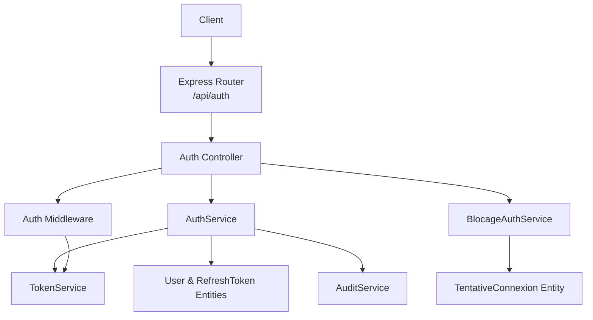
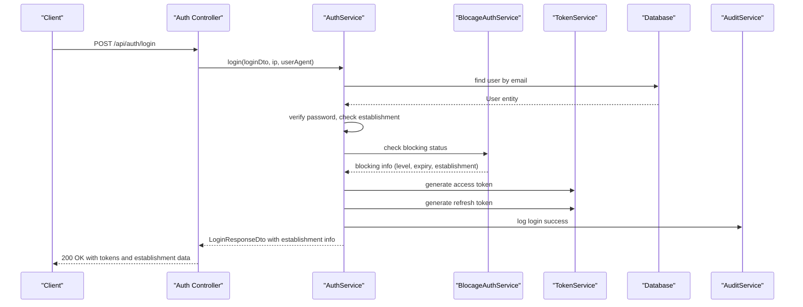
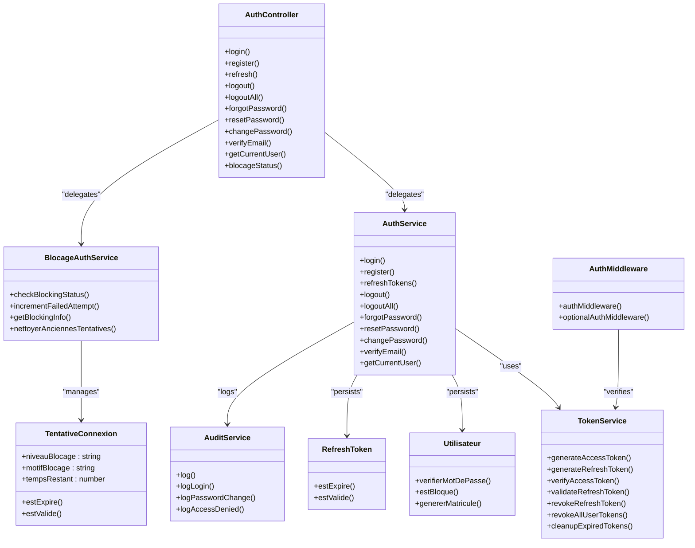

# Authentication API

<cite>
**Referenced Files in This Document**
- [auth.controller.ts](file://backend/src/modules/auth/controllers/auth.controller.ts)
- [auth.dto.ts](file://backend/src/modules/auth/dto/auth.dto.ts)
- [auth.service.ts](file://backend/src/modules/auth/services/auth.service.ts)
- [token.service.ts](file://backend/src/modules/auth/services/token.service.ts)
- [auth.middleware.ts](file://backend/src/modules/auth/middlewares/auth.middleware.ts)
- [utilisateur.entity.ts](file://backend/src/modules/auth/entities/utilisateur.entity.ts)
- [refresh-token.entity.ts](file://backend/src/modules/auth/entities/refresh-token.entity.ts)
- [tentative-connexion.entity.ts](file://backend/src/modules/auth/entities/tentative-connexion.entity.ts)
- [blocage-auth.service.ts](file://backend/src/modules/auth/services/blocage-auth.service.ts)
- [env.config.ts](file://backend/src/config/env.config.ts)
- [app.ts](file://backend/src/app.ts)
- [audit.service.ts](file://backend/src/modules/auth/services/audit.service.ts)
- [audit-log.entity.ts](file://backend/src/modules/auth/entities/audit-log.entity.ts)
- [roles.enum.ts](file://shared/src/enums/roles.enum.ts)
</cite>

## Update Summary
**Changes Made**
- Added new `/api/auth/blocage-status/:identifiant` endpoint for real-time blocking status polling
- Enhanced login flow with establishment switching capabilities
- Added comprehensive blocking status information with two-level blocking system
- Integrated new blocking management service with cron job cleanup functionality
- Updated authentication flow to handle establishment selection during login

## Table of Contents
1. [Introduction](#introduction)
2. [Project Structure](#project-structure)
3. [Core Components](#core-components)
4. [Architecture Overview](#architecture-overview)
5. [Detailed Component Analysis](#detailed-component-analysis)
6. [Dependency Analysis](#dependency-analysis)
7. [Performance Considerations](#performance-considerations)
8. [Troubleshooting Guide](#troubleshooting-guide)
9. [Conclusion](#conclusion)
10. [Appendices](#appendices)

## Introduction
This document provides comprehensive API documentation for the Authentication module of the eLISAschool platform. It covers all authentication endpoints including login, logout, register, password reset, token refresh, establishment switching, and real-time blocking status polling. The enhanced authentication system now includes a sophisticated two-level blocking mechanism with automatic cleanup, comprehensive establishment switching capabilities, and real-time blocking status monitoring for improved security and user experience.

## Project Structure
The Authentication module is organized around a controller, service, DTOs, middleware, and entities. The controller exposes REST endpoints under /api/auth, including new blocking status polling functionality. The service encapsulates business logic and integrates with the TokenService for JWT operations, BlocageAuthService for blocking management, and the database repositories for persistence. The middleware validates JWT access tokens and attaches user context to requests.

**Diagram sources**
- [auth.controller.ts:33-267](file://backend/src/modules/auth/controllers/auth.controller.ts#L33-L267)
- [auth.service.ts:34-484](file://backend/src/modules/auth/services/auth.service.ts#L34-L484)
- [blocage-auth.service.ts](file://backend/src/modules/auth/services/blocage-auth.service.ts)
- [token.service.ts:21-181](file://backend/src/modules/auth/services/token.service.ts#L21-L181)
- [auth.middleware.ts:30-92](file://backend/src/modules/auth/middlewares/auth.middleware.ts#L30-L92)
- [utilisateur.entity.ts:51-143](file://backend/src/modules/auth/entities/utilisateur.entity.ts#L51-L143)
- [refresh-token.entity.ts:23-72](file://backend/src/modules/auth/entities/refresh-token.entity.ts#L23-L72)
- [tentative-connexion.entity.ts](file://backend/src/modules/auth/entities/tentative-connexion.entity.ts)
- [audit.service.ts:37-197](file://backend/src/modules/auth/services/audit.service.ts#L37-L197)

**Section sources**
- [auth.controller.ts:33-267](file://backend/src/modules/auth/controllers/auth.controller.ts#L33-L267)
- [app.ts:150](file://backend/src/app.ts#L150)

## Core Components
- Auth Controller: Defines all authentication endpoints including the new blocking status polling endpoint and delegates to AuthService. It validates request bodies using Zod schemas and applies authMiddleware where required.
- AuthService: Implements core authentication logic including login, registration, password reset, token refresh, logout, establishment switching, and user profile retrieval. Integrates with TokenService, BlocageAuthService, and AuditService.
- BlocageAuthService: Manages the two-level blocking system with automatic cleanup, tracking failed login attempts, and providing real-time blocking status information.
- TokenService: Manages JWT access tokens and refresh tokens, including generation, verification, revocation, and cleanup.
- Auth Middleware: Extracts and verifies Bearer tokens from Authorization headers and attaches user context to requests.
- DTOs: Define request/response schemas and typed interfaces for validation and response modeling.
- Entities: Persist user accounts, refresh tokens, audit logs, and connection attempts with blocking information.
- TentativeConnexion Entity: Tracks failed login attempts with detailed blocking information including establishment-specific blocking.

**Section sources**
- [auth.controller.ts:39-49](file://backend/src/modules/auth/controllers/auth.controller.ts#L39-L49)
- [auth.service.ts:34-484](file://backend/src/modules/auth/services/auth.service.ts#L34-L484)
- [blocage-auth.service.ts](file://backend/src/modules/auth/services/blocage-auth.service.ts)
- [token.service.ts:21-181](file://backend/src/modules/auth/services/token.service.ts#L21-L181)
- [auth.middleware.ts:30-60](file://backend/src/modules/auth/middlewares/auth.middleware.ts#L30-L60)
- [auth.dto.ts:113-173](file://backend/src/modules/auth/dto/auth.dto.ts#L113-L173)
- [utilisateur.entity.ts:51-143](file://backend/src/modules/auth/entities/utilisateur.entity.ts#L51-L143)
- [refresh-token.entity.ts:23-72](file://backend/src/modules/auth/entities/refresh-token.entity.ts#L23-L72)
- [tentative-connexion.entity.ts](file://backend/src/modules/auth/entities/tentative-connexion.entity.ts)

## Architecture Overview
The enhanced authentication flow follows a layered architecture with two-level blocking management:
- HTTP Layer: Express routes in the controller including new blocking status endpoint.
- Business Logic Layer: AuthService orchestrates operations with establishment switching; BlocageAuthService manages blocking logic.
- Security Layer: TokenService handles JWT lifecycle; Auth Middleware validates tokens.
- Blocking Management Layer: BlocageAuthService tracks connection attempts and manages blocking states.
- Persistence Layer: TypeORM repositories manage entities including blocking attempts.
- Audit Layer: AuditService logs sensitive actions.

**Diagram sources**
- [auth.controller.ts:55-74](file://backend/src/modules/auth/controllers/auth.controller.ts#L55-L74)
- [auth.service.ts:61-161](file://backend/src/modules/auth/services/auth.service.ts#L61-L161)
- [blocage-auth.service.ts](file://backend/src/modules/auth/services/blocage-auth.service.ts)
- [token.service.ts:32-72](file://backend/src/modules/auth/services/token.service.ts#L32-L72)
- [audit.service.ts:67-77](file://backend/src/modules/auth/services/audit.service.ts#L67-L77)

## Detailed Component Analysis

### Endpoint Catalog
- POST /api/auth/login
- POST /api/auth/register
- POST /api/auth/refresh
- POST /api/auth/logout
- POST /api/auth/logout-all
- POST /api/auth/forgot-password
- POST /api/auth/reset-password
- POST /api/auth/change-password
- POST /api/auth/verify-email
- GET /api/auth/me
- **GET /api/auth/blocage-status/:identifiant** *(NEW)*

**Section sources**
- [auth.controller.ts:55-264](file://backend/src/modules/auth/controllers/auth.controller.ts#L55-L264)

### Endpoint Details

#### POST /api/auth/login
- Description: Authenticate a user, issue access and refresh tokens, and handle establishment switching.
- Authentication: None.
- Request Body Schema:
  - email: string (required, email format, max 255)
  - motDePasse: string (required, min 8 chars)
  - seRappelerDeMoi: boolean (optional, default false)
  - etablissementId: string (optional, for establishment switching)
- Response:
  - accessToken: string
  - refreshToken: string
  - expiresIn: number (seconds)
  - utilisateur: object with id, email, matricule, role, nom, prenom
  - etablissementCourant: object with establishment information
  - etablissementsDisponibles: array of available establishments
- Errors:
  - 400: VALIDATION_ERROR (invalid fields)
  - 401: INVALID_CREDENTIALS (invalid email/password)
  - 403: ACCOUNT_LOCKED, ACCOUNT_SUSPENDED, ACCOUNT_INACTIVE, ESTABLISHMENT_BLOCKED
- Security:
  - Password verification uses bcrypt.
  - Login attempts are tracked with two-level blocking system; excessive attempts lock the account temporarily.
  - Establishment switching requires proper permissions.
  - Audit logged on success/failure.

**Section sources**
- [auth.controller.ts:55-74](file://backend/src/modules/auth/controllers/auth.controller.ts#L55-L74)
- [auth.dto.ts:18-25](file://backend/src/modules/auth/dto/auth.dto.ts#L18-L25)
- [auth.service.ts:61-161](file://backend/src/modules/auth/services/auth.service.ts#L61-L161)
- [utilisateur.entity.ts:120-130](file://backend/src/modules/auth/entities/utilisateur.entity.ts#L120-L130)
- [audit.service.ts:67-77](file://backend/src/modules/auth/services/audit.service.ts#L67-L77)

#### GET /api/auth/blocage-status/:identifiant
- Description: Real-time blocking status polling endpoint for monitoring account blocking state.
- Authentication: None.
- Path Parameters:
  - identifiant: string (required, user identifier or email)
- Response Schema:
  - bloque: boolean (true if account is currently blocked)
  - niveauBlocage: string (BLOCKED_LEVEL_1 or BLOCKED_LEVEL_2)
  - tempsRestant: number (remaining blocking time in seconds)
  - motifBlocage: string (reason for blocking)
  - derniereTentative: Date (timestamp of last failed attempt)
  - etablissementId: string (blocking establishment if applicable)
  - nbDeblocagesAuto: number (number of automatic unlocks)
- Errors:
  - 404: USER_NOT_FOUND
  - 400: INVALID_IDENTIFIANT
- Security:
  - No increment of failed attempts (read-only status check).
  - Used for frontend polling during blocking periods.
  - Provides comprehensive blocking details for user feedback.

**Updated** Added new endpoint for real-time blocking status monitoring

**Section sources**
- [auth.controller.ts:230-236](file://backend/src/modules/auth/controllers/auth.controller.ts#L230-L236)
- [blocage-auth.service.ts](file://backend/src/modules/auth/services/blocage-auth.service.ts)
- [tentative-connexion.entity.ts](file://backend/src/modules/auth/entities/tentative-connexion.entity.ts)

#### POST /api/auth/register
- Description: Register a new user with profile details.
- Authentication: None.
- Request Body Schema:
  - email: string (required, email format, max 255)
  - motDePasse: string (required, 8–128 chars, must include uppercase, lowercase, digit)
  - confirmationMotDePasse: string (must match password)
  - nom: string (2–100 chars)
  - prenom: string (2–100 chars)
  - telephone: string (optional, E.164-like)
  - langue: string (default "fr")
- Response:
  - message: string
  - utilisateurId: string
- Errors:
  - 400: VALIDATION_ERROR, PASSWORD_TOO_SHORT
  - 409: EMAIL_ALREADY_EXISTS

**Section sources**
- [auth.controller.ts:80-95](file://backend/src/modules/auth/controllers/auth.controller.ts#L80-L95)
- [auth.dto.ts:30-54](file://backend/src/modules/auth/dto/auth.dto.ts#L30-L54)
- [auth.service.ts:166-234](file://backend/src/modules/auth/services/auth.service.ts#L166-L234)

#### POST /api/auth/refresh
- Description: Refresh access token using a valid refresh token.
- Authentication: None.
- Request Body Schema:
  - refreshToken: string (required)
- Response:
  - accessToken: string
  - refreshToken: string
- Errors:
  - 400: VALIDATION_ERROR
  - 401: INVALID_REFRESH_TOKEN, USER_NOT_AUTHORIZED

**Section sources**
- [auth.controller.ts:101-120](file://backend/src/modules/auth/controllers/auth.controller.ts#L101-L120)
- [auth.dto.ts:59-61](file://backend/src/modules/auth/dto/auth.dto.ts#L59-L61)
- [auth.service.ts:239-279](file://backend/src/modules/auth/services/auth.service.ts#L239-L279)
- [token.service.ts:96-113](file://backend/src/modules/auth/services/token.service.ts#L96-L113)

#### POST /api/auth/logout
- Description: Revoke a refresh token (single session logout).
- Authentication: None.
- Request Body Schema:
  - refreshToken: string (required)
- Response: success message.
- Errors: None (silent revocation if token not found).

**Section sources**
- [auth.controller.ts:126-142](file://backend/src/modules/auth/controllers/auth.controller.ts#L126-L142)
- [auth.service.ts:284-297](file://backend/src/modules/auth/services/auth.service.ts#L284-L297)
- [token.service.ts:119-136](file://backend/src/modules/auth/services/token.service.ts#L119-L136)

#### POST /api/auth/logout-all
- Description: Revoke all refresh tokens for the authenticated user (logout everywhere).
- Authentication: Required (Bearer token).
- Request Body: None.
- Response: success message.
- Errors:
  - 401: UNAUTHENTICATED, MISSING_TOKEN, INVALID_TOKEN
  - 403: INSUFFICIENT_PERMISSIONS (handled by permission guard if used elsewhere; endpoint itself does not enforce permissions)

**Section sources**
- [auth.controller.ts:149-161](file://backend/src/modules/auth/controllers/auth.controller.ts#L149-L161)
- [auth.middleware.ts:30-60](file://backend/src/modules/auth/middlewares/auth.middleware.ts#L30-L60)
- [auth.service.ts:302-305](file://backend/src/modules/auth/services/auth.service.ts#L302-L305)
- [token.service.ts:142-151](file://backend/src/modules/auth/services/token.service.ts#L142-L151)

#### POST /api/auth/forgot-password
- Description: Initiate password reset by sending a reset link if the email exists.
- Authentication: None.
- Request Body Schema:
  - email: string (required, email format)
- Response:
  - message: string (safe message for privacy)
- Errors: None (always returns success message).

**Section sources**
- [auth.controller.ts:167-181](file://backend/src/modules/auth/controllers/auth.controller.ts#L167-L181)
- [auth.dto.ts:66-68](file://backend/src/modules/auth/dto/auth.dto.ts#L66-L68)
- [auth.service.ts:310-338](file://backend/src/modules/auth/services/auth.service.ts#L310-L338)
- [audit.service.ts:328-333](file://backend/src/modules/auth/services/audit.service.ts#L328-L333)

#### POST /api/auth/reset-password
- Description: Complete password reset using a token.
- Authentication: None.
- Request Body Schema:
  - token: string (required)
  - nouveauMotDePasse: string (required, 8+ chars, uppercase, lowercase, digit)
  - confirmationMotDePasse: string (must match new password)
- Response:
  - message: string
- Errors:
  - 400: VALIDATION_ERROR, INVALID_TOKEN, TOKEN_EXPIRED, PASSWORD_TOO_SHORT
  - 401: USER_NOT_AUTHORIZED (if user not active)

**Section sources**
- [auth.controller.ts:187-201](file://backend/src/modules/auth/controllers/auth.controller.ts#L187-L201)
- [auth.dto.ts:73-84](file://backend/src/modules/auth/dto/auth.dto.ts#L73-L84)
- [auth.service.ts:343-378](file://backend/src/modules/auth/services/auth.service.ts#L343-L378)
- [utilisateur.entity.ts:380-381](file://backend/src/modules/auth/entities/utilisateur.entity.ts#L380-L381)

#### POST /api/auth/change-password
- Description: Change password for the authenticated user.
- Authentication: Required (Bearer token).
- Request Body Schema:
  - motDePasseActuel: string (required)
  - nouveauMotDePasse: string (required, 8+ chars, uppercase, lowercase, digit)
  - confirmationMotDePasse: string (must match new password)
- Response:
  - message: string
- Errors:
  - 400: VALIDATION_ERROR, INVALID_CURRENT_PASSWORD, PASSWORD_TOO_SHORT
  - 404: USER_NOT_FOUND

**Section sources**
- [auth.controller.ts:208-225](file://backend/src/modules/auth/controllers/auth.controller.ts#L208-L225)
- [auth.dto.ts:89-100](file://backend/src/modules/auth/dto/auth.dto.ts#L89-L100)
- [auth.middleware.ts:30-60](file://backend/src/modules/auth/middlewares/auth.middleware.ts#L30-L60)
- [auth.service.ts:383-421](file://backend/src/modules/auth/services/auth.service.ts#L383-L421)
- [audit.service.ts:82-89](file://backend/src/modules/auth/services/audit.service.ts#L82-L89)

#### POST /api/auth/verify-email
- Description: Verify user email using a verification token.
- Authentication: None.
- Request Body Schema:
  - token: string (required)
- Response:
  - message: string
- Errors:
  - 400: INVALID_TOKEN

**Section sources**
- [auth.controller.ts:231-245](file://backend/src/modules/auth/controllers/auth.controller.ts#L231-L245)
- [auth.dto.ts:105-107](file://backend/src/modules/auth/dto/auth.dto.ts#L105-L107)
- [auth.service.ts:426-447](file://backend/src/modules/auth/services/auth.service.ts#L426-L447)

#### GET /api/auth/me
- Description: Retrieve current authenticated user profile.
- Authentication: Required (Bearer token).
- Request Body: None.
- Response:
  - id, email, matricule, role, statut, emailVerifie, langue
  - profil: { nom, prenom, telephone, photo } or null
- Errors:
  - 401: UNAUTHENTICATED, MISSING_TOKEN, INVALID_TOKEN
  - 404: USER_NOT_FOUND

**Section sources**
- [auth.controller.ts:252-264](file://backend/src/modules/auth/controllers/auth.controller.ts#L252-L264)
- [auth.middleware.ts:30-60](file://backend/src/modules/auth/middlewares/auth.middleware.ts#L30-L60)
- [auth.service.ts:452-480](file://backend/src/modules/auth/services/auth.service.ts#L452-L480)

### JWT and Refresh Tokens

#### Access Token (JWT)
- Payload fields:
  - sub: string (user id)
  - email: string
  - role: string
  - etablissementId?: string
  - iat/exp: timestamps (issuer, audience configured)
- Expiration: Configured via JWT_EXPIRES_IN environment variable.

#### Refresh Token
- Stored in refresh_tokens table with:
  - token: unique hashed token
  - utilisateurId: foreign key
  - adresseIp, userAgent: optional client metadata
  - expireAt: timestamp (default 30 days)
  - revoque, revoqueAt: revocation flag and timestamp
- Generation: Random 64-byte hex token stored in DB.
- Validation: Checks validity and expiration; revocation is enforced.
- Revocation: Single revoke or revoke all for a user.

**Section sources**
- [auth.dto.ts:145-152](file://backend/src/modules/auth/dto/auth.dto.ts#L145-L152)
- [env.config.ts:138-142](file://backend/src/config/env.config.ts#L138-L142)
- [token.service.ts:32-72](file://backend/src/modules/auth/services/token.service.ts#L32-L72)
- [token.service.ts:96-151](file://backend/src/modules/auth/services/token.service.ts#L96-L151)
- [refresh-token.entity.ts:24-68](file://backend/src/modules/auth/entities/refresh-token.entity.ts#L24-L68)

### Session Management
- Login sets session duration based on configuration (sessionDuration in minutes).
- Refresh flow invalidates the old refresh token and issues a new one.
- Logout and logout-all revoke refresh tokens to terminate sessions.
- Two-level blocking system with automatic cleanup every 2 minutes.
- Establishment switching requires proper permissions and blocks specific establishments.

**Updated** Enhanced with two-level blocking system and establishment switching

**Section sources**
- [auth.service.ts:146](file://backend/src/modules/auth/services/auth.service.ts#L146)
- [auth.service.ts:239-279](file://backend/src/modules/auth/services/auth.service.ts#L239-L279)
- [auth.service.ts:284-305](file://backend/src/modules/auth/services/auth.service.ts#L284-L305)
- [utilisateur.entity.ts:83-87](file://backend/src/modules/auth/entities/utilisateur.entity.ts#L83-L87)
- [blocage-auth.service.ts](file://backend/src/modules/auth/services/blocage-auth.service.ts)

### Blocking Management System

#### Two-Level Blocking System
- Level 1 Blocking: Temporary blocking after first failed attempt (2-minute duration)
- Level 2 Blocking: Extended blocking after repeated failures (15-minute duration)
- Automatic Cleanup: Cron job removes old blocking attempts every 2 minutes
- Establishment-Specific Blocking: Blocks can be specific to individual establishments
- Real-Time Status Polling: Frontend can poll blocking status without incrementing attempts

#### Blocking Status Information
- bloque: boolean (current blocking state)
- niveauBlocage: enum (BLOCKED_LEVEL_1 or BLOCKED_LEVEL_2)
- tempsRestant: number (remaining blocking time in seconds)
- motifBlocage: string (reason for blocking)
- derniereTentative: Date (timestamp of last failed attempt)
- etablissementId: string (blocking establishment if applicable)
- nbDeblocagesAuto: number (number of automatic unlocks)

**Updated** Added comprehensive blocking management system with two-level blocking and real-time status polling

**Section sources**
- [tentative-connexion.entity.ts](file://backend/src/modules/auth/entities/tentative-connexion.entity.ts)
- [blocage-auth.service.ts](file://backend/src/modules/auth/services/blocage-auth.service.ts)
- [auth.controller.ts:230-236](file://backend/src/modules/auth/controllers/auth.controller.ts#L230-L236)

### Security Considerations
- Password hashing: bcrypt with 12 rounds.
- Token storage: Refresh tokens are stored server-side with metadata and revocation support.
- Rate limiting: Basic rate limiter applied to /api/.
- CORS and Helmet: Security headers and allowed origins configured.
- Audit logging: Sensitive actions (login, logout, password changes, access denied) are recorded.
- Environment validation: JWT secret and encryption key validated at startup.
- Two-level blocking system prevents brute-force attacks with automatic cleanup.
- Establishment switching requires proper authorization and audit logging.

**Updated** Enhanced with blocking system security measures

**Section sources**
- [utilisateur.entity.ts:107-122](file://backend/src/modules/auth/entities/utilisateur.entity.ts#L107-L122)
- [token.service.ts:119-151](file://backend/src/modules/auth/services/token.service.ts#L119-L151)
- [app.ts:66-97](file://backend/src/app.ts#L66-L97)
- [audit.service.ts:67-137](file://backend/src/modules/auth/services/audit.service.ts#L67-L137)
- [env.config.ts:29-58](file://backend/src/config/env.config.ts#L29-L58)
- [blocage-auth.service.ts](file://backend/src/modules/auth/services/blocage-auth.service.ts)

### Integration Patterns
- Client sends Authorization: Bearer <access_token> for protected endpoints.
- After successful login, client stores both access and refresh tokens and establishment information.
- On 401 INVALID_TOKEN, client should attempt refresh using refreshToken.
- On successful refresh, client replaces tokens and retries the original request.
- For logout, client sends refreshToken to /api/auth/logout or calls logout-all to invalidate all sessions.
- **Real-time blocking monitoring**: Client polls /api/auth/blocage-status/:identifiant during blocking periods.
- **Establishment switching**: Client can switch between available establishments during login.

**Updated** Added blocking status polling and establishment switching integration patterns

**Section sources**
- [auth.middleware.ts:30-60](file://backend/src/modules/auth/middlewares/auth.middleware.ts#L30-L60)
- [auth.controller.ts:101-120](file://backend/src/modules/auth/controllers/auth.controller.ts#L101-L120)
- [auth.service.ts:239-279](file://backend/src/modules/auth/services/auth.service.ts#L239-L279)
- [auth.controller.ts:230-236](file://backend/src/modules/auth/controllers/auth.controller.ts#L230-L236)

### Client-Side Implementation Examples
- Login:
  - POST /api/auth/login with { email, motDePasse, seRappelerDeMoi, etablissementId }
  - Store accessToken, refreshToken, and establishment information
- Refresh:
  - POST /api/auth/refresh with { refreshToken }
  - Replace tokens and retry failed request
- Protected request:
  - Add Authorization: Bearer <accessToken>
- Logout:
  - POST /api/auth/logout with { refreshToken }
  - Clear stored tokens
- Logout everywhere:
  - POST /api/auth/logout-all with Bearer token
  - Clear stored tokens
- **Blocking status polling**:
  - GET /api/auth/blocage-status/:identifiant (polling during blocking)
  - Display remaining blocking time and blocking level
- **Establishment switching**:
  - Include etablissementId in login request for establishment switching

**Updated** Added blocking status polling and establishment switching examples

**Section sources**
- [auth.controller.ts:55-264](file://backend/src/modules/auth/controllers/auth.controller.ts#L55-L264)
- [auth.middleware.ts:30-60](file://backend/src/modules/auth/middlewares/auth.middleware.ts#L30-L60)
- [auth.controller.ts:230-236](file://backend/src/modules/auth/controllers/auth.controller.ts#L230-L236)

## Dependency Analysis

**Diagram sources**
- [auth.controller.ts:34-267](file://backend/src/modules/auth/controllers/auth.controller.ts#L34-L267)
- [auth.service.ts:34-484](file://backend/src/modules/auth/services/auth.service.ts#L34-L484)
- [blocage-auth.service.ts](file://backend/src/modules/auth/services/blocage-auth.service.ts)
- [token.service.ts:21-181](file://backend/src/modules/auth/services/token.service.ts#L21-L181)
- [auth.middleware.ts:30-92](file://backend/src/modules/auth/middlewares/auth.middleware.ts#L30-L92)
- [utilisateur.entity.ts:51-143](file://backend/src/modules/auth/entities/utilisateur.entity.ts#L51-L143)
- [refresh-token.entity.ts:23-72](file://backend/src/modules/auth/entities/refresh-token.entity.ts#L23-L72)
- [tentative-connexion.entity.ts](file://backend/src/modules/auth/entities/tentative-connexion.entity.ts)
- [audit.service.ts:37-197](file://backend/src/modules/auth/services/audit.service.ts#L37-L197)

**Section sources**
- [auth.controller.ts:34-267](file://backend/src/modules/auth/controllers/auth.controller.ts#L34-L267)
- [auth.service.ts:34-484](file://backend/src/modules/auth/services/auth.service.ts#L34-L484)
- [blocage-auth.service.ts](file://backend/src/modules/auth/services/blocage-auth.service.ts)
- [token.service.ts:21-181](file://backend/src/modules/auth/services/token.service.ts#L21-L181)
- [auth.middleware.ts:30-92](file://backend/src/modules/auth/middlewares/auth.middleware.ts#L30-L92)
- [utilisateur.entity.ts:51-143](file://backend/src/modules/auth/entities/utilisateur.entity.ts#L51-L143)
- [refresh-token.entity.ts:23-72](file://backend/src/modules/auth/entities/refresh-token.entity.ts#L23-L72)
- [tentative-connexion.entity.ts](file://backend/src/modules/auth/entities/tentative-connexion.entity.ts)
- [audit.service.ts:37-197](file://backend/src/modules/auth/services/audit.service.ts#L37-L197)

## Performance Considerations
- Token verification is lightweight; keep JWT payloads minimal.
- Refresh token storage uses indexed fields; ensure database performance tuning for high concurrency.
- Consider background cleanup of expired tokens periodically.
- Rate limiting protects against abuse; tune limits according to deployment scale.
- **Blocking system optimization**: Database queries optimized for blocking status checks; consider caching frequently accessed blocking information.
- **Real-time polling**: Implement appropriate polling intervals to balance user experience with server load.

**Updated** Added blocking system performance considerations

## Troubleshooting Guide
- 400 Validation errors: Review request body against DTO schemas.
- 401 Missing/Invalid token: Ensure Authorization header is present and valid; verify token not expired or revoked.
- 403 Locked/Suspended/Inactive account: Check user status and unlock policy.
- 404 User not found: Confirm user exists and identifiers are correct.
- **Blocking system issues**: 
  - 423 Locked resource: Account is currently blocked (check blocking level and remaining time)
  - 429 Too many requests: Excessive polling detected (implement backoff strategy)
  - Blocking status polling: Use /api/auth/blocage-status endpoint for current blocking state
- Audit logs: Use audit endpoints to investigate suspicious activity.

**Updated** Added blocking system troubleshooting guidance

**Section sources**
- [auth.controller.ts:39-49](file://backend/src/modules/auth/controllers/auth.controller.ts#L39-L49)
- [auth.middleware.ts:30-60](file://backend/src/modules/auth/middlewares/auth.middleware.ts#L30-L60)
- [audit.service.ts:142-181](file://backend/src/modules/auth/services/audit.service.ts#L142-L181)
- [blocage-auth.service.ts](file://backend/src/modules/auth/services/blocage-auth.service.ts)

## Conclusion
The Authentication module provides a robust, secure, and auditable authentication system with comprehensive endpoints for login, registration, password management, and session control. The enhanced system now includes sophisticated two-level blocking management with automatic cleanup, real-time blocking status polling, establishment switching capabilities, and comprehensive audit logging. These improvements significantly enhance security while maintaining excellent user experience through intelligent blocking mechanisms and seamless establishment management.

## Appendices

### Request/Response Schemas

- Login Request
  - email: string
  - motDePasse: string
  - seRappelerDeMoi: boolean (optional)
  - etablissementId: string (optional for establishment switching)

- Login Response
  - accessToken: string
  - refreshToken: string
  - expiresIn: number
  - utilisateur: { id, email, matricule, role, nom, prenom }
  - etablissementCourant: object (current establishment info)
  - etablissementsDisponibles: array (available establishments)

- Blocage Status Response *(NEW)*
  - bloque: boolean
  - niveauBlocage: string (BLOCKED_LEVEL_1 | BLOCKED_LEVEL_2)
  - tempsRestant: number (seconds)
  - motifBlocage: string
  - derniereTentative: Date
  - etablissementId: string (if establishment-specific)
  - nbDeblocagesAuto: number

- Register Request
  - email: string
  - motDePasse: string
  - confirmationMotDePasse: string
  - nom: string
  - prenom: string
  - telephone: string (optional)
  - langue: string (default "fr")

- Refresh Request
  - refreshToken: string

- Forgot Password Request
  - email: string

- Reset Password Request
  - token: string
  - nouveauMotDePasse: string
  - confirmationMotDePasse: string

- Change Password Request
  - motDePasseActuel: string
  - nouveauMotDePasse: string
  - confirmationMotDePasse: string

- Verify Email Request
  - token: string

**Section sources**
- [auth.dto.ts:18-107](file://backend/src/modules/auth/dto/auth.dto.ts#L18-L107)
- [auth.dto.ts:128-162](file://backend/src/modules/auth/dto/auth.dto.ts#L128-L162)
- [tentative-connexion.entity.ts](file://backend/src/modules/auth/entities/tentative-connexion.entity.ts)

### JWT Payload Fields
- sub: string (user id)
- email: string
- role: string
- etablissementId?: string
- iat/exp: timestamps

**Section sources**
- [auth.dto.ts:145-152](file://backend/src/modules/auth/dto/auth.dto.ts#L145-L152)

### Environment Variables
- JWT_SECRET: string (min 32 chars)
- JWT_EXPIRES_IN: string (default "7d")
- JWT_REFRESH_EXPIRES_IN: string (default "30d")
- ENCRYPTION_KEY: string (32 chars)

**Section sources**
- [env.config.ts:29-58](file://backend/src/config/env.config.ts#L29-L58)

### Roles and Permissions
- Roles enum includes SUPER_ADMIN, ADMIN, CHEF_ETABLISSEMENT, ENSEIGNANT, PERSONNEL, RESPONSABLE_CANTINE, RESPONSABLE_TRANSPORT, PARENT, ELEVE.
- DEFAULT_ROLE_PERMISSIONS map defines default permissions per role.

**Section sources**
- [roles.enum.ts:12-39](file://shared/src/enums/roles.enum.ts#L12-L39)
- [roles.enum.ts:120-184](file://shared/src/enums/roles.enum.ts#L120-L184)

### Blocking Status Enum Values *(NEW)*
- BLOCKED_LEVEL_1: Temporary blocking (2 minutes)
- BLOCKED_LEVEL_2: Extended blocking (15 minutes)
- NO_BLOCK: Not blocked

**Section sources**
- [tentative-connexion.entity.ts](file://backend/src/modules/auth/entities/tentative-connexion.entity.ts)
- [blocage-auth.service.ts](file://backend/src/modules/auth/services/blocage-auth.service.ts)

### Establishment Switching Behavior *(NEW)*
- Requires proper authorization for target establishment
- Maintains session continuity across establishment changes
- Logs establishment switching events for audit purposes
- Supports multi-establishment user profiles

**Section sources**
- [auth.service.ts:61-161](file://backend/src/modules/auth/services/auth.service.ts#L61-L161)
- [audit.service.ts:67-77](file://backend/src/modules/auth/services/audit.service.ts#L67-L77)