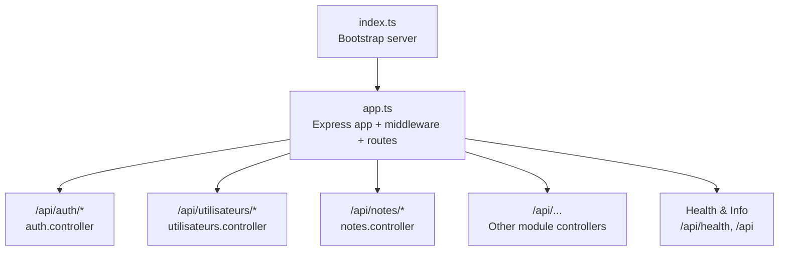
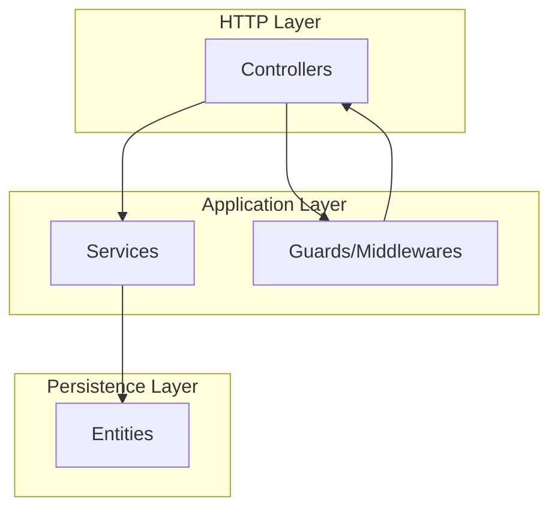
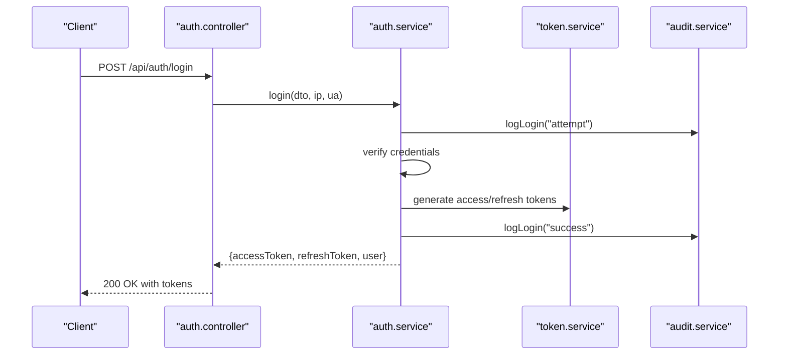
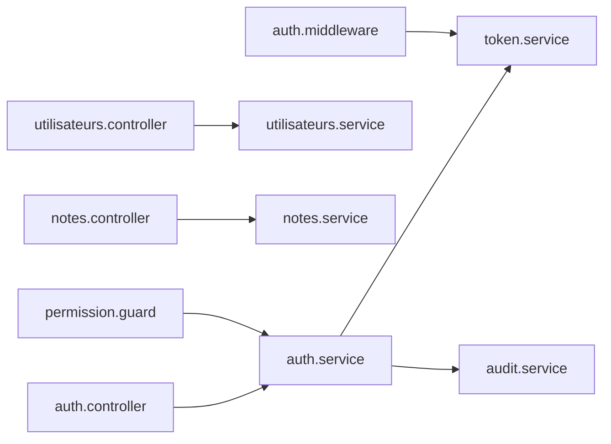

# Backend API Documentation

<cite>
**Referenced Files in This Document**
- [backend/src/app.ts](file://backend/src/app.ts)
- [backend/src/index.ts](file://backend/src/index.ts)
- [backend/src/common/utils/logger.util.ts](file://backend/src/common/utils/logger.util.ts)
- [backend/src/modules/auth/controllers/auth.controller.ts](file://backend/src/modules/auth/controllers/auth.controller.ts)
- [backend/src/modules/auth/dto/auth.dto.ts](file://backend/src/modules/auth/dto/auth.dto.ts)
- [backend/src/modules/auth/services/auth.service.ts](file://backend/src/modules/auth/services/auth.service.ts)
- [backend/src/modules/auth/middlewares/auth.middleware.ts](file://backend/src/modules/auth/middlewares/auth.middleware.ts)
- [backend/src/modules/auth/guards/permission.guard.ts](file://backend/src/modules/auth/guards/permission.guard.ts)
- [backend/src/modules/utilisateurs/controllers/utilisateurs.controller.ts](file://backend/src/modules/utilisateurs/controllers/utilisateurs.controller.ts)
- [backend/src/modules/utilisateurs/dto/utilisateur.dto.ts](file://backend/src/modules/utilisateurs/dto/utilisateur.dto.ts)
- [backend/src/modules/notes/controllers/notes.controller.ts](file://backend/src/modules/notes/controllers/notes.controller.ts)
- [backend/src/modules/notes/dto/note.dto.ts](file://backend/src/modules/notes/dto/note.dto.ts)
</cite>

## Table of Contents
1. [Introduction](#introduction)
2. [Project Structure](#project-structure)
3. [Core Components](#core-components)
4. [Architecture Overview](#architecture-overview)
5. [Detailed Component Analysis](#detailed-component-analysis)
6. [Dependency Analysis](#dependency-analysis)
7. [Performance Considerations](#performance-considerations)
8. [Troubleshooting Guide](#troubleshooting-guide)
9. [Conclusion](#conclusion)
10. [Appendices](#appendices)

## Introduction
This document provides comprehensive API documentation for the eLISAschool backend. It covers all REST endpoints across modules including authentication, users, students, grades, classes, subjects, and administrative functions. For each endpoint, you will find HTTP methods, URL patterns, request/response schemas, authentication requirements, and error responses. Additional topics include API versioning, pagination, filtering, rate limiting, CORS configuration, security considerations, and client integration examples.

## Project Structure
The backend is organized as a modular Express application. Each domain area (e.g., auth, users, notes) is structured with controllers, DTOs, services, and entities. The application bootstraps via a dedicated entry point and mounts module routers under the /api path.

**Diagram sources**
- [backend/src/index.ts:1-62](file://backend/src/index.ts#L1-L62)
- [backend/src/app.ts:124-185](file://backend/src/app.ts#L124-L185)

**Section sources**
- [backend/src/index.ts:1-62](file://backend/src/index.ts#L1-L62)
- [backend/src/app.ts:124-185](file://backend/src/app.ts#L124-L185)

## Core Components
- Express application creation and middleware pipeline
- Centralized health and info endpoints
- Module routing mounted under /api
- Global error and not-found handlers
- Security middleware: Helmet, CORS, rate limiting, compression
- Request logging interceptor

Key behaviors:
- Health endpoint returns version and metadata.
- Info endpoint returns API metadata and documentation link.
- Rate limiter applies to /api routes.
- Logging configured via Winston with console and file transports.

**Section sources**
- [backend/src/app.ts:58-204](file://backend/src/app.ts#L58-L204)
- [backend/src/common/utils/logger.util.ts:58-82](file://backend/src/common/utils/logger.util.ts#L58-L82)

## Architecture Overview
The API follows a layered architecture:
- Controllers handle HTTP requests and responses.
- Services encapsulate business logic and interact with repositories.
- DTOs define request/response schemas validated with Zod.
- Guards and middlewares enforce authentication and authorization.
- Entities represent database models.

**Diagram sources**
- [backend/src/modules/auth/controllers/auth.controller.ts:33-267](file://backend/src/modules/auth/controllers/auth.controller.ts#L33-L267)
- [backend/src/modules/auth/services/auth.service.ts:34-484](file://backend/src/modules/auth/services/auth.service.ts#L34-L484)
- [backend/src/modules/auth/middlewares/auth.middleware.ts:30-60](file://backend/src/modules/auth/middlewares/auth.middleware.ts#L30-L60)
- [backend/src/modules/auth/guards/permission.guard.ts:44-87](file://backend/src/modules/auth/guards/permission.guard.ts#L44-L87)

## Detailed Component Analysis

### Authentication API
Endpoints for login, registration, token refresh, logout, password management, email verification, and profile retrieval.

- POST /api/auth/login
  - Purpose: Authenticate a user.
  - Authentication: None.
  - Request body: See Login DTO.
  - Response: Access token, refresh token, expiry, and user summary.
  - Errors: INVALID_CREDENTIALS, ACCOUNT_LOCKED, ACCOUNT_SUSPENDED, ACCOUNT_INACTIVE.
  - Security: Attempts locked out after threshold; session duration configurable.

- POST /api/auth/register
  - Purpose: Register a new user.
  - Authentication: None.
  - Request body: See Register DTO.
  - Response: Operation message and new user identifier.
  - Errors: EMAIL_ALREADY_EXISTS, PASSWORD_TOO_SHORT.

- POST /api/auth/refresh
  - Purpose: Refresh access token using a valid refresh token.
  - Authentication: None.
  - Request body: Refresh token.
  - Response: New access and refresh tokens.
  - Errors: INVALID_REFRESH_TOKEN, USER_NOT_AUTHORIZED.

- POST /api/auth/logout
  - Purpose: Revoke current refresh token.
  - Authentication: None.
  - Request body: Refresh token.
  - Response: Success message.
  - Errors: None (best-effort revocation).

- POST /api/auth/logout-all
  - Purpose: Revoke all sessions for the authenticated user.
  - Authentication: Required (Bearer).
  - Request body: None.
  - Response: Success message.
  - Errors: None.

- POST /api/auth/forgot-password
  - Purpose: Initiate password reset; sends reset link if email exists.
  - Authentication: None.
  - Request body: Email.
  - Response: Success message.
  - Errors: None.

- POST /api/auth/reset-password
  - Purpose: Set new password using a reset token.
  - Authentication: None.
  - Request body: Token and new password.
  - Response: Success message.
  - Errors: INVALID_TOKEN, TOKEN_EXPIRED, PASSWORD_TOO_SHORT.

- POST /api/auth/change-password
  - Purpose: Change password for the authenticated user.
  - Authentication: Required (Bearer).
  - Request body: Current and new passwords.
  - Response: Success message.
  - Errors: INVALID_CURRENT_PASSWORD, PASSWORD_TOO_SHORT.

- POST /api/auth/verify-email
  - Purpose: Verify email using a verification token.
  - Authentication: None.
  - Request body: Verification token.
  - Response: Success message.
  - Errors: INVALID_TOKEN.

- GET /api/auth/me
  - Purpose: Retrieve current user profile.
  - Authentication: Required (Bearer).
  - Request body: None.
  - Response: User profile including personal details.
  - Errors: USER_NOT_FOUND.

Validation rules and schemas:
- Zod schemas define strict validation for all inputs, including length, format, and regex constraints.
- Password policies are enforced centrally via configuration parameters.

Security considerations:
- Access tokens are signed and carry minimal claims.
- Refresh tokens are bound to IP and User-Agent during generation.
- Configurable lockout thresholds and session durations.
- Audit logs track login attempts and sensitive actions.

Example request/response patterns:
- Use Authorization: Bearer <access-token> for protected endpoints.
- Successful responses include a top-level success flag and timestamp.

**Section sources**
- [backend/src/modules/auth/controllers/auth.controller.ts:55-264](file://backend/src/modules/auth/controllers/auth.controller.ts#L55-L264)
- [backend/src/modules/auth/dto/auth.dto.ts:18-107](file://backend/src/modules/auth/dto/auth.dto.ts#L18-L107)
- [backend/src/modules/auth/services/auth.service.ts:61-480](file://backend/src/modules/auth/services/auth.service.ts#L61-L480)
- [backend/src/modules/auth/middlewares/auth.middleware.ts:30-60](file://backend/src/modules/auth/middlewares/auth.middleware.ts#L30-L60)
- [backend/src/modules/auth/guards/permission.guard.ts:44-87](file://backend/src/modules/auth/guards/permission.guard.ts#L44-L87)

### Users Management API
Endpoints for listing, retrieving, creating, updating, changing status, and deleting users. Includes profile updates with granular permissions.

- GET /api/utilisateurs
  - Purpose: List users with pagination and filters.
  - Authentication: Required (Bearer).
  - Roles: SUPER_ADMIN, ADMIN, CHEF_ETABLISSEMENT.
  - Query parameters: page, limit, search, role, statut, etablissementId, sortBy, sortOrder.
  - Response: Paginated list of users.

- GET /api/utilisateurs/:id
  - Purpose: Retrieve a user by ID.
  - Authentication: Required (Bearer).
  - Permissions: Owner or admin roles.

- POST /api/utilisateurs
  - Purpose: Create a new user.
  - Authentication: Required (Bearer).
  - Roles: SUPER_ADMIN, ADMIN.

- PATCH /api/utilisateurs/:id
  - Purpose: Update a user.
  - Authentication: Required (Bearer).
  - Roles: SUPER_ADMIN, ADMIN.

- PATCH /api/utilisateurs/:id/profil
  - Purpose: Update user profile.
  - Authentication: Required (Bearer).
  - Permissions: Owner or admin roles.

- PATCH /api/utilisateurs/:id/statut
  - Purpose: Change user status.
  - Authentication: Required (Bearer).
  - Roles: SUPER_ADMIN, ADMIN.

- DELETE /api/utilisateurs/:id
  - Purpose: Delete a user.
  - Authentication: Required (Bearer).
  - Roles: SUPER_ADMIN.

Validation and filtering:
- Zod schemas define allowed fields and formats.
- Pagination defaults and sort order are standardized.

**Section sources**
- [backend/src/modules/utilisateurs/controllers/utilisateurs.controller.ts:47-203](file://backend/src/modules/utilisateurs/controllers/utilisateurs.controller.ts#L47-L203)
- [backend/src/modules/utilisateurs/dto/utilisateur.dto.ts:14-86](file://backend/src/modules/utilisateurs/dto/utilisateur.dto.ts#L14-L86)

### Notes Management API
Endpoints for CRUD operations on academic grades, including bulk creation.

- GET /api/notes
  - Purpose: List notes with filters.
  - Authentication: Required (Bearer).
  - Query parameters: page, limit, eleveId, matiereId, classeId, periodeId, anneeScolaireId, statut, typeEvaluation.

- GET /api/notes/:id
  - Purpose: Retrieve a note by ID.
  - Authentication: Required (Bearer).

- POST /api/notes
  - Purpose: Create a single note.
  - Authentication: Required (Bearer).
  - Roles: ENSEIGNANT, ADMIN, CHEF_ETABLISSEMENT.

- POST /api/notes/bulk
  - Purpose: Create multiple notes at once.
  - Authentication: Required (Bearer).
  - Roles: ENSEIGNANT, ADMIN, CHEF_ETABLISSEMENT.

- PATCH /api/notes/:id
  - Purpose: Update a note.
  - Authentication: Required (Bearer).
  - Roles: ENSEIGNANT, ADMIN, CHEF_ETABLISSEMENT.

- DELETE /api/notes/:id
  - Purpose: Delete a note.
  - Authentication: Required (Bearer).
  - Roles: ENSEIGNANT, ADMIN, CHEF_ETABLISSEMENT.

Validation:
- Strict Zod schemas define allowed fields, numeric bounds, and optional date formats.

**Section sources**
- [backend/src/modules/notes/controllers/notes.controller.ts:27-71](file://backend/src/modules/notes/controllers/notes.controller.ts#L27-L71)
- [backend/src/modules/notes/dto/note.dto.ts:10-56](file://backend/src/modules/notes/dto/note.dto.ts#L10-L56)

### Conceptual Overview
The following sequence illustrates a typical authentication flow.

**Diagram sources**
- [backend/src/modules/auth/controllers/auth.controller.ts:55-74](file://backend/src/modules/auth/controllers/auth.controller.ts#L55-L74)
- [backend/src/modules/auth/services/auth.service.ts:61-161](file://backend/src/modules/auth/services/auth.service.ts#L61-L161)

## Dependency Analysis
- Controllers depend on services and DTOs for validation.
- Services depend on repositories and token/audit services.
- Guards and middlewares enforce RBAC and JWT verification.
- Global middleware stack includes security, CORS, rate limiting, compression, and request logging.

**Diagram sources**
- [backend/src/modules/auth/controllers/auth.controller.ts:34-34](file://backend/src/modules/auth/controllers/auth.controller.ts#L34-L34)
- [backend/src/modules/auth/services/auth.service.ts:42-42](file://backend/src/modules/auth/services/auth.service.ts#L42-L42)
- [backend/src/modules/auth/middlewares/auth.middleware.ts:24-24](file://backend/src/modules/auth/middlewares/auth.middleware.ts#L24-L24)
- [backend/src/modules/auth/guards/permission.guard.ts:13-13](file://backend/src/modules/auth/guards/permission.guard.ts#L13-L13)

**Section sources**
- [backend/src/modules/auth/controllers/auth.controller.ts:34-34](file://backend/src/modules/auth/controllers/auth.controller.ts#L34-L34)
- [backend/src/modules/auth/services/auth.service.ts:42-42](file://backend/src/modules/auth/services/auth.service.ts#L42-L42)
- [backend/src/modules/auth/middlewares/auth.middleware.ts:24-24](file://backend/src/modules/auth/middlewares/auth.middleware.ts#L24-L24)
- [backend/src/modules/auth/guards/permission.guard.ts:13-13](file://backend/src/modules/auth/guards/permission.guard.ts#L13-L13)

## Performance Considerations
- Compression is enabled globally to reduce response sizes.
- JSON and URL-encoded bodies have size limits to prevent abuse.
- Rate limiting is applied to /api routes to mitigate brute-force attacks.
- Pagination is supported in user listings and notes queries to avoid large payloads.

[No sources needed since this section provides general guidance]

## Troubleshooting Guide
Common issues and resolutions:
- 401 Unauthorized: Missing or invalid Bearer token; ensure Authorization header is present and valid.
- 403 Forbidden: Insufficient permissions; verify role and required permissions.
- 400 Validation Error: Request body does not match schema; check field types, lengths, and formats.
- 404 Not Found: Resource not found; confirm identifiers and route correctness.
- 429 Too Many Requests: Exceeded rate limit; wait before retrying.

Operational checks:
- Health endpoint: GET /api/health to verify service availability and version.
- Logging: Review Winston logs for detailed error stacks and metadata.

**Section sources**
- [backend/src/app.ts:124-131](file://backend/src/app.ts#L124-L131)
- [backend/src/common/utils/logger.util.ts:58-82](file://backend/src/common/utils/logger.util.ts#L58-L82)

## Conclusion
The eLISAschool backend provides a secure, modular, and well-structured REST API. Authentication relies on JWT with robust validation and configurable security parameters. Controllers expose clear endpoints with standardized request/response patterns, Zod-based validation, and role-based access control. Pagination and filtering are consistently applied across list endpoints. The middleware stack ensures security and reliability, while logging supports operational visibility.

[No sources needed since this section summarizes without analyzing specific files]

## Appendices

### API Versioning Strategy
- Version is exposed in health and info endpoints.
- Base URL pattern: /api/{version}/{resource}. Current implementation mounts under /api without a version segment; version appears in responses.

**Section sources**
- [backend/src/app.ts:124-143](file://backend/src/app.ts#L124-L143)

### Pagination and Filtering
- Standardized pagination: page (default 1), limit (default varies per endpoint).
- Sorting: sortBy and sortOrder (ASC/DESC).
- Filters: Specific to each resource (e.g., user search, role, status; note filters by student, subject, class, period, year, status, type).

**Section sources**
- [backend/src/modules/utilisateurs/dto/utilisateur.dto.ts:71-80](file://backend/src/modules/utilisateurs/dto/utilisateur.dto.ts#L71-L80)
- [backend/src/modules/notes/dto/note.dto.ts:46-56](file://backend/src/modules/notes/dto/note.dto.ts#L46-L56)

### Rate Limiting
- Applied to /api routes with a sliding window policy.
- Default: 1000 requests per 15 minutes.

**Section sources**
- [backend/src/app.ts:87-97](file://backend/src/app.ts#L87-L97)

### CORS Configuration
- Allowed origins: configured from environment.
- Methods: GET, POST, PUT, PATCH, DELETE, OPTIONS.
- Headers: Content-Type, Authorization, X-Requested-With.
- Credentials: enabled.

**Section sources**
- [backend/src/app.ts:79-84](file://backend/src/app.ts#L79-L84)

### Security Considerations
- Helmet hardens HTTP headers.
- CSRF protection via Content-Security-Policy.
- CORS restricted to frontend origin.
- JWT access tokens with short-lived sessions.
- Refresh tokens bound to device/IP.
- Configurable lockout and session duration.
- Audit logs for sensitive actions.

**Section sources**
- [backend/src/app.ts:66-76](file://backend/src/app.ts#L66-L76)
- [backend/src/modules/auth/services/auth.service.ts:48-56](file://backend/src/modules/auth/services/auth.service.ts#L48-L56)

### Client Integration Examples
- Authentication:
  - POST /api/auth/login with email and password.
  - Store access and refresh tokens; use Authorization: Bearer for protected endpoints.
  - On token expiration, POST /api/auth/refresh with a valid refresh token.
- User Management:
  - GET /api/utilisateurs?page=1&limit=20 to list users.
  - POST /api/utilisateurs with role, contact details, and personal info.
- Notes Management:
  - POST /api/notes to create a single grade.
  - POST /api/notes/bulk to create multiple grades for a class.

[No sources needed since this section provides general guidance]