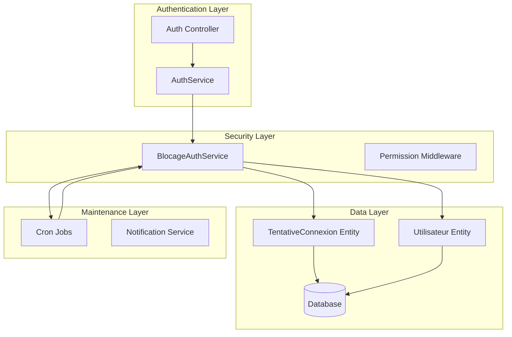
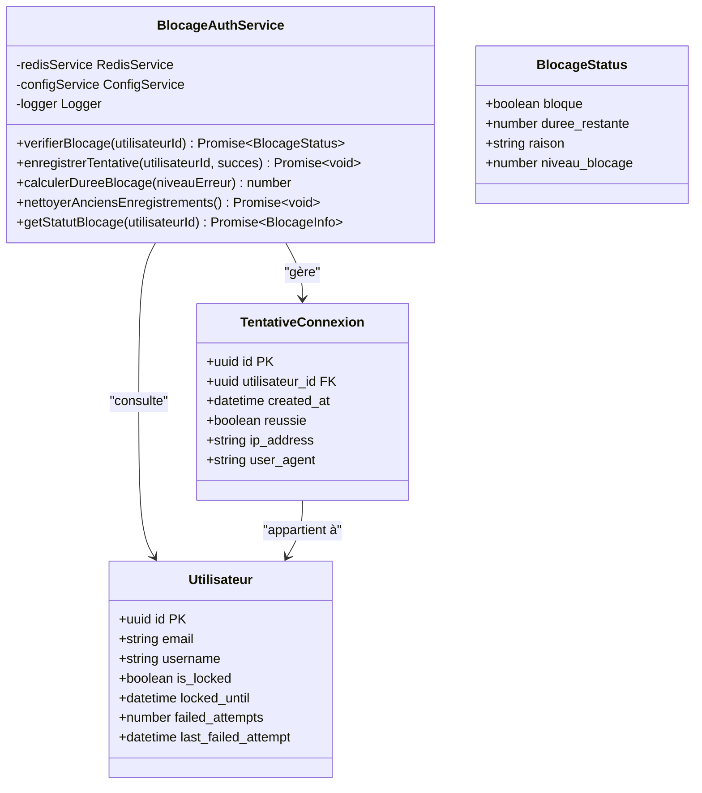
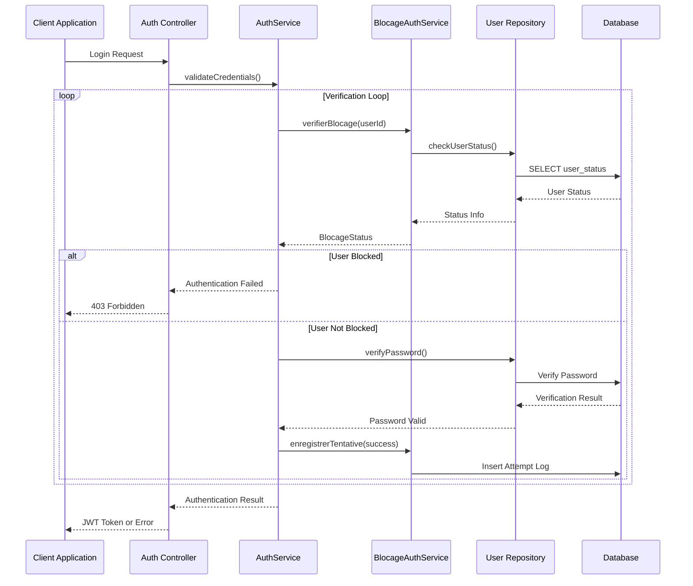
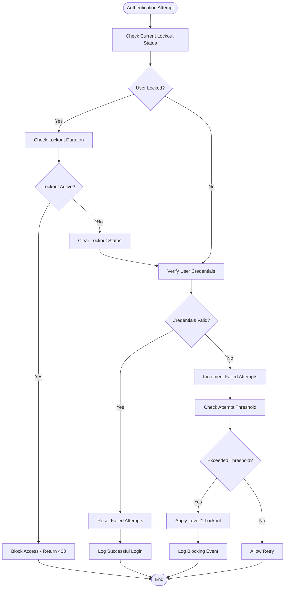
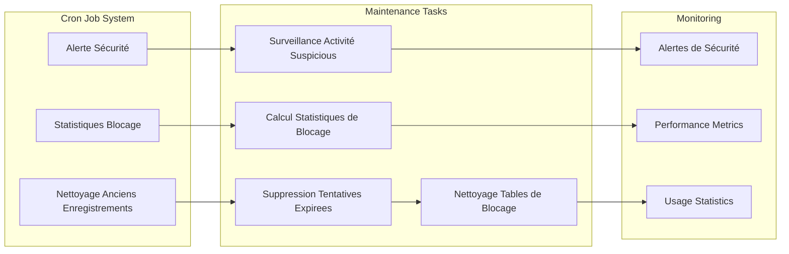

# BlocageAuthService Documentation

<cite>
**Referenced Files in This Document**
- [blocage-auth.service.ts](file://backend/src/modules/auth/services/blocage-auth.service.ts)
- [tentative-connexion.entity.ts](file://backend/src/modules/auth/entities/tentative-connexion.entity.ts)
- [utilisateur.entity.ts](file://backend/src/modules/auth/entities/utilisateur.entity.ts)
- [auth.service.ts](file://backend/src/modules/auth/services/auth.service.ts)
- [017-reduction-duree-blocage-auth.ts](file://backend/src/database/migrations/017-reduction-duree-blocage-auth.ts)
- [018-systeme-blocage-deux-niveaux.sql](file://backend/src/database/migrations/018-systeme-blocage-deux-niveaux.sql)
- [019-nettoyage-ancien-blocage.sql](file://backend/src/database/migrations/019-nettoyage-ancien-blocage.sql)
- [cron-jobs.ts](file://backend/src/modules/auth/cron-jobs.ts)
</cite>

## Table of Contents
1. [Introduction](#introduction)
2. [System Architecture](#system-architecture)
3. [Core Components](#core-components)
4. [Security Mechanisms](#security-mechanisms)
5. [Database Schema](#database-schema)
6. [Implementation Details](#implementation-details)
7. [Configuration Management](#configuration-management)
8. [Cron Jobs and Maintenance](#cron-jobs-and-maintenance)
9. [Integration Points](#integration-points)
10. [Troubleshooting Guide](#troubleshooting-guide)
11. [Conclusion](#conclusion)

## Introduction

The BlocageAuthService is a critical security component within the eLISAschool authentication system that manages user account lockout mechanisms and authentication attempt monitoring. This service implements a sophisticated two-level blocking system designed to prevent brute force attacks while maintaining system accessibility and user experience.

The service evolved from earlier migration efforts that reduced blocking duration and introduced a comprehensive two-level blocking mechanism. It integrates deeply with the authentication flow, user management, and database persistence layers to provide robust security against unauthorized access attempts.

## System Architecture

The BlocageAuthService operates as part of a layered authentication architecture within the backend system:

**Diagram sources**
- [auth.service.ts:30](file://backend/src/modules/auth/services/auth.service.ts#L30)
- [blocage-auth.service.ts:48](file://backend/src/modules/auth/services/blocage-auth.service.ts#L48)
- [tentative-connexion.entity.ts:1](file://backend/src/modules/auth/entities/tentative-connexion.entity.ts#L1)

The architecture demonstrates a clear separation of concerns with the BlocageAuthService positioned between the authentication controller and the data persistence layer, ensuring all authentication attempts are properly monitored and controlled.

## Core Components

### BlocageAuthService Class Structure

The BlocageAuthService is implemented as a singleton service that manages all aspects of authentication blocking:

**Diagram sources**
- [blocage-auth.service.ts:48](file://backend/src/modules/auth/services/blocage-auth.service.ts#L48)
- [tentative-connexion.entity.ts:1](file://backend/src/modules/auth/entities/tentative-connexion.entity.ts#L1)
- [utilisateur.entity.ts:1](file://backend/src/modules/auth/entities/utilisateur.entity.ts#L1)

**Section sources**
- [blocage-auth.service.ts:48](file://backend/src/modules/auth/services/blocage-auth.service.ts#L48)
- [blocage-auth.service.ts:407](file://backend/src/modules/auth/services/blocage-auth.service.ts#L407)

### Authentication Flow Integration

The BlocageAuthService integrates seamlessly with the authentication process through several key integration points:

**Diagram sources**
- [auth.service.ts:30](file://backend/src/modules/auth/services/auth.service.ts#L30)
- [blocage-auth.service.ts:48](file://backend/src/modules/auth/services/blocage-auth.service.ts#L48)

**Section sources**
- [auth.service.ts:30](file://backend/src/modules/auth/services/auth.service.ts#L30)

## Security Mechanisms

### Two-Level Blocking System

The BlocageAuthService implements a sophisticated two-level blocking mechanism designed to balance security with user accessibility:

#### Level 1: Temporary Lockout
- **Duration**: Configurable time-based lockout period
- **Trigger**: Excessive failed authentication attempts within a short timeframe
- **Purpose**: Immediate prevention of brute force attacks
- **Recovery**: Automatic unlock after predefined duration

#### Level 2: Enhanced Security Lockout
- **Duration**: Extended lockout period for repeated violations
- **Trigger**: Multiple Level 1 lockouts or particularly suspicious activity patterns
- **Purpose**: Comprehensive protection against coordinated attack campaigns
- **Recovery**: Requires administrative intervention or extended timeout

### Attempt Monitoring and Pattern Recognition

The service maintains detailed logs of authentication attempts to identify and respond to suspicious patterns:

**Diagram sources**
- [blocage-auth.service.ts:48](file://backend/src/modules/auth/services/blocage-auth.service.ts#L48)

**Section sources**
- [blocage-auth.service.ts:48](file://backend/src/modules/auth/services/blocage-auth.service.ts#L48)

## Database Schema

### TentativeConnexion Entity

The TentativeConnexion entity serves as the primary data structure for tracking authentication attempts:

| Column | Type | Description | Constraints |
|--------|------|-------------|-------------|
| id | UUID | Unique identifier for the attempt record | PRIMARY KEY |
| utilisateur_id | UUID | Foreign key linking to user | NOT NULL, FOREIGN KEY |
| created_at | TIMESTAMP | Timestamp of the authentication attempt | NOT NULL |
| reussie | BOOLEAN | Indicates if the authentication was successful | NOT NULL |
| ip_address | VARCHAR | IP address of the client attempting authentication | |
| user_agent | TEXT | Browser/user agent string | |

### Utilisateur Entity Enhancements

The Utilisateur entity has been enhanced to support the blocking mechanism:

| Column | Type | Description | Constraints |
|--------|------|-------------|-------------|
| is_locked | BOOLEAN | Global lockout status for the user | DEFAULT FALSE |
| locked_until | TIMESTAMP | Expiration timestamp for lockout period | |
| failed_attempts | INTEGER | Count of consecutive failed attempts | DEFAULT 0 |
| last_failed_attempt | TIMESTAMP | Timestamp of the most recent failed attempt | |

**Section sources**
- [tentative-connexion.entity.ts:1](file://backend/src/modules/auth/entities/tentative-connexion.entity.ts#L1)
- [utilisateur.entity.ts:92](file://backend/src/modules/auth/entities/utilisateur.entity.ts#L92)

## Implementation Details

### Blocking Logic Implementation

The BlocageAuthService implements sophisticated blocking logic through several key methods:

#### verifBlocage Method
The primary method responsible for checking user lockout status and determining access permissions. This method performs comprehensive validation including current lockout status, remaining duration calculations, and pattern recognition for suspicious activity.

#### enregistrerTentative Method
Handles logging of authentication attempts with detailed metadata including IP addresses, user agents, and timestamps. This method supports both successful and failed authentication scenarios.

#### calculerDureeBlocage Method
Determines appropriate lockout duration based on the level of security violation and historical pattern analysis. The calculation considers factors such as previous violations, time since last attempt, and system-wide security thresholds.

### Configuration Management

The service utilizes a dynamic configuration system that allows administrators to adjust blocking parameters without system downtime:

| Configuration Parameter | Default Value | Description | Impact |
|-------------------------|---------------|-------------|---------|
| auth.duree_blocage_general | 2 minutes | Base lockout duration for Level 1 blocks | Higher values increase security but reduce user experience |
| auth.duree_blocage_specifique | 1 minute | Additional lockout duration per failed attempt | Controls escalation speed |
| auth.tentatives_maximales | 5 attempts | Maximum failed attempts before blocking | Directly affects security vs accessibility balance |
| auth.période_surveillance | 15 minutes | Time window for attempt monitoring | Influences detection of coordinated attacks |

**Section sources**
- [018-systeme-blocage-deux-niveaux.sql:65](file://backend/src/database/migrations/018-systeme-blocage-deux-niveaux.sql#L65)
- [018-systeme-blocage-deux-niveaux.sql:71](file://backend/src/database/migrations/018-systeme-blocage-deux-niveaux.sql#L71)

## Configuration Management

### Migration-Based Configuration

The blocking system configuration is managed through database migrations that ensure consistent deployment across environments:

#### 017-reduction-duree-blocage-auth.ts Migration
This TypeScript migration reduces the default blocking duration from previous implementations, balancing security requirements with user accessibility. The migration updates existing configurations while preserving historical data integrity.

#### 018-systeme-blocage-deux-niveaux.sql Migration
Introduces the comprehensive two-level blocking system with configurable parameters stored in the database configuration table. This migration establishes the foundation for dynamic security policy management.

#### 019-nettoyage-ancien-blocage.sql Migration
Performs cleanup operations to remove deprecated blocking mechanisms and associated data structures, ensuring system performance and preventing conflicts with new blocking logic.

### Dynamic Configuration Loading

The service loads configuration parameters dynamically at runtime, allowing for real-time adjustments to security policies without requiring system restarts. This approach supports A/B testing of security policies and rapid response to emerging threats.

**Section sources**
- [017-reduction-duree-blocage-auth.ts:1](file://backend/src/database/migrations/017-reduction-duree-blocage-auth.ts#L1)
- [018-systeme-blocage-deux-niveaux.sql:1](file://backend/src/database/migrations/018-systeme-blocage-deux-niveaux.sql#L1)
- [019-nettoyage-ancien-blocage.sql:1](file://backend/src/database/migrations/019-nettoyage-ancien-blocage.sql#L1)

## Cron Jobs and Maintenance

### Automated Cleanup Operations

The BlocageAuthService includes automated maintenance operations performed through cron jobs to ensure optimal system performance and data integrity:

**Diagram sources**
- [cron-jobs.ts:11](file://backend/src/modules/auth/cron-jobs.ts#L11)

### Scheduled Maintenance Operations

The cron job system performs several critical maintenance tasks:

#### Nettoyage Anciens Enregistrements
Regular cleanup of expired authentication attempt records to maintain database performance and storage efficiency. This operation removes old entries that exceed retention policies while preserving essential statistical data.

#### Statistiques Blocage
Periodic generation of security statistics including block frequency, user patterns, and system-wide security metrics. These statistics inform security policy adjustments and help identify potential attack patterns.

#### Alerte Sécurité
Monitoring of unusual security events and automatic triggering of alerts for suspicious activity patterns. This includes detection of coordinated attack campaigns and unusual geographic access patterns.

**Section sources**
- [cron-jobs.ts:11](file://backend/src/modules/auth/cron-jobs.ts#L11)

## Integration Points

### Frontend Integration

The BlocageAuthService integrates with the frontend authentication system through several key interfaces:

#### Authentication State Management
The service works in conjunction with the frontend's authentication state management to provide real-time feedback about account lockout status. This includes displaying appropriate error messages and managing user interface elements during blocked periods.

#### User Experience Considerations
The blocking system includes user-friendly messaging that explains lockout reasons and provides estimated wait times. This helps maintain user trust while enforcing security measures.

### Administrative Interface

Administrators can monitor and manage the blocking system through dedicated administrative interfaces:

#### Real-Time Monitoring
Dashboard displays showing current lockout status, recent security events, and system performance metrics. This enables quick identification and response to security incidents.

#### Manual Intervention Capabilities
Administrative controls for manually unlocking accounts, adjusting security parameters, and investigating suspicious activity patterns. These capabilities provide flexibility in managing exceptional circumstances.

**Section sources**
- [blocage-auth.service.ts:407](file://backend/src/modules/auth/services/blocage-auth.service.ts#L407)

## Troubleshooting Guide

### Common Issues and Solutions

#### Account Frequently Locked Out
**Symptoms**: Users report being locked out despite legitimate access attempts
**Possible Causes**: 
- Aggressive security configuration settings
- Network issues causing repeated failed attempts
- Misconfigured client applications

**Solutions**:
- Review and adjust security threshold parameters
- Implement IP-based whitelisting for trusted networks
- Configure client applications to handle authentication errors gracefully

#### Delayed Unlock After Successful Login
**Symptoms**: Users cannot immediately access the system after successful authentication
**Possible Causes**:
- Database synchronization delays
- Redis caching inconsistencies
- Timing issues in lockout clearing logic

**Solutions**:
- Verify database connection health and performance
- Check Redis service availability and response times
- Review lockout clearing logic for timing issues

#### Inconsistent Lockout Behavior
**Symptoms**: Different users experience varying lockout durations and triggers
**Possible Causes**:
- Configuration drift between environments
- Race conditions in concurrent access scenarios
- Incomplete data migration during system updates

**Solutions**:
- Standardize configuration across all environments
- Implement proper concurrency controls and locking mechanisms
- Perform comprehensive data validation after system updates

### Diagnostic Procedures

#### Log Analysis
Enable detailed logging for authentication attempts and blocking decisions to identify patterns and troubleshoot issues. Monitor both successful and failed authentication attempts to understand user behavior and system performance.

#### Performance Monitoring
Track system performance metrics during peak authentication periods to identify bottlenecks in the blocking system. Pay particular attention to database query performance and Redis service responsiveness.

#### Security Audit
Conduct regular security audits of the blocking system to ensure it meets organizational security requirements while maintaining acceptable user experience levels.

## Conclusion

The BlocageAuthService represents a sophisticated approach to authentication security within the eLISAschool system. By implementing a two-level blocking mechanism with dynamic configuration management and automated maintenance operations, the service provides robust protection against unauthorized access attempts while maintaining system usability.

The service's integration with the broader authentication ecosystem ensures seamless operation without disrupting legitimate user workflows. Through careful configuration and ongoing monitoring, the BlocageAuthService contributes significantly to the overall security posture of the eLISAschool platform.

Key strengths of the implementation include:
- Flexible two-level blocking system adaptable to various threat scenarios
- Comprehensive logging and monitoring capabilities for security auditing
- Automated maintenance operations reducing administrative overhead
- Seamless integration with existing authentication infrastructure
- Configurable parameters supporting organizational security policies

The continued evolution of this service through migration-based updates and administrative oversight ensures it remains effective against emerging security threats while adapting to changing organizational requirements.