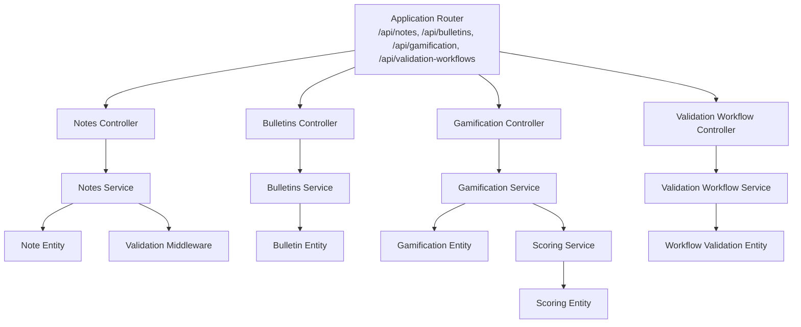
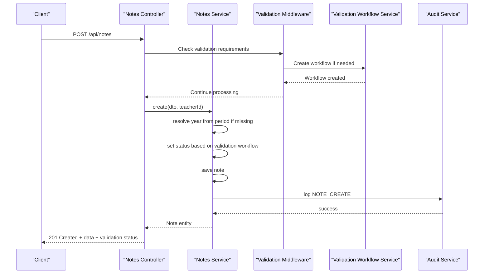
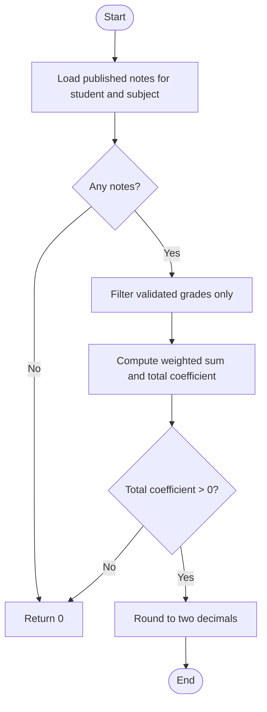
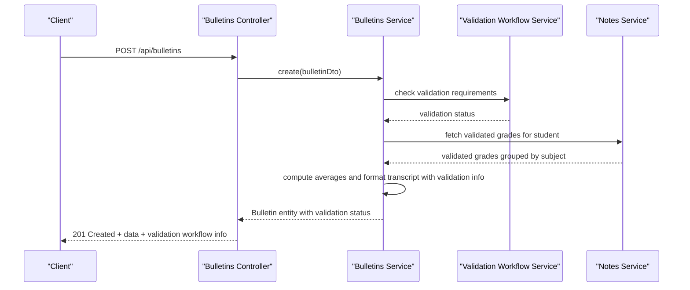
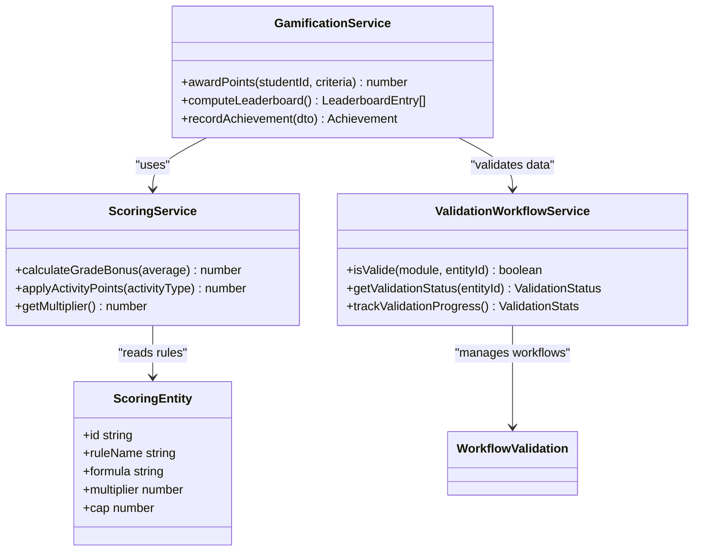
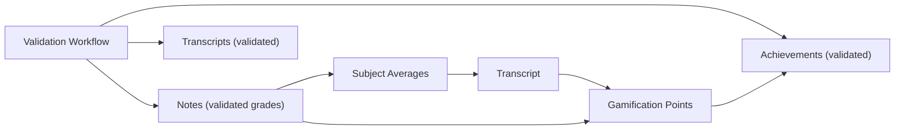
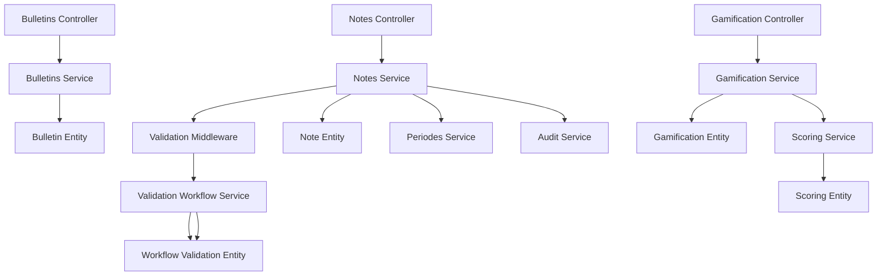

# Grading System API

<cite>
**Referenced Files in This Document**
- [app.ts](file://backend/src/app.ts)
- [notes.controller.ts](file://backend/src/modules/notes/controllers/notes.controller.ts)
- [notes.service.ts](file://backend/src/modules/notes/services/notes.service.ts)
- [bulletins.controller.ts](file://backend/src/modules/bulletins/controllers/bulletins.controller.ts)
- [bulletins.service.ts](file://backend/src/modules/bulletins/services/bulletins.service.ts)
- [gamification.controller.ts](file://backend/src/modules/gamification/controllers/gamification.controller.ts)
- [gamification.service.ts](file://backend/src/modules/gamification/services/gamification.service.ts)
- [scoring.service.ts](file://backend/src/modules/scoring/services/scoring.service.ts)
- [scoring.entity.ts](file://backend/src/modules/scoring/entities/scoring.entity.ts)
- [note.entity.ts](file://backend/src/modules/notes/entities/note.entity.ts)
- [bulletin.entity.ts](file://backend/src/modules/bulletins/entities/bulletin.entity.ts)
- [gamification.entity.ts](file://backend/src/modules/gamification/entities/gamification.entity.ts)
- [note.dto.ts](file://backend/src/modules/notes/dto/note.dto.ts)
- [bulletins.dto.ts](file://backend/src/modules/bulletins/dto/bulletins.dto.ts)
- [gamification.dto.ts](file://backend/src/modules/gamification/dto/gamification.dto.ts)
- [periodes.service.ts](file://backend/src/modules/periodes/services/periodes.service.ts)
- [audit.service.ts](file://backend/src/modules/auth/services/audit.service.ts)
- [validation-workflow.controller.ts](file://backend/src/modules/validation-workflow/controllers/validation-workflow.controller.ts)
- [validation-workflow.service.ts](file://backend/src/modules/validation-workflow/services/validation-workflow.service.ts)
- [validation-workflow.d.ts](file://backend/src/common/types/validation-workflow.d.ts)
- [workflow-validation.entity.ts](file://backend/src/modules/validation-workflow/entities/workflow-validation.entity.ts)
- [validation.middleware.ts](file://backend/src/modules/validation-workflow/middlewares/validation.middleware.ts)
</cite>

## Update Summary
**Changes Made**
- Added validation workflow integration documentation for the notes module
- Updated Notes API section to include automatic validation routing and status tracking
- Added new Validation Workflow module documentation
- Enhanced grade management endpoints with validation workflow support
- Updated architecture diagrams to reflect validation workflow integration

## Table of Contents
1. [Introduction](#introduction)
2. [Project Structure](#project-structure)
3. [Core Components](#core-components)
4. [Architecture Overview](#architecture-overview)
5. [Detailed Component Analysis](#detailed-component-analysis)
6. [Validation Workflow Integration](#validation-workflow-integration)
7. [Dependency Analysis](#dependency-analysis)
8. [Performance Considerations](#performance-considerations)
9. [Troubleshooting Guide](#troubleshooting-guide)
10. [Conclusion](#conclusion)

## Introduction
This document provides comprehensive API documentation for the Grading System module, covering grade management, transcript generation, gamification features, and validation workflow integration. It specifies HTTP endpoints, request/response schemas, and calculation algorithms used for grade entry, modification, transcript generation, point-based scoring systems, and student achievement tracking. The documentation also explains the relationships among grades, transcripts, gamification points, and the validation workflow system, including automatic validation routing and status tracking.

## Project Structure
The Grading System spans several modules with integrated validation workflow support:
- Notes: Grade entry, bulk operations, updates, deletions, averages, and validation workflow integration
- Bulletins: Transcript generation and management
- Gamification: Achievement tracking and point-based rewards
- Scoring: Point calculations and scoring rules
- Validation Workflow: Multi-level validation processes for all business entities

**Diagram sources**
- [app.ts:25-25](file://backend/src/app.ts#L25-L25)
- [app.ts:153-153](file://backend/src/app.ts#L153-L153)
- [notes.controller.ts:72-72](file://backend/src/modules/notes/controllers/notes.controller.ts#L72-L72)
- [bulletins.controller.ts](file://backend/src/modules/bulletins/controllers/bulletins.controller.ts)
- [gamification.controller.ts](file://backend/src/modules/gamification/controllers/gamification.controller.ts)
- [validation-workflow.controller.ts](file://backend/src/modules/validation-workflow/controllers/validation-workflow.controller.ts)
- [notes.service.ts:17-22](file://backend/src/modules/notes/services/notes.service.ts#L17-L22)
- [bulletins.service.ts](file://backend/src/modules/bulletins/services/bulletins.service.ts)
- [gamification.service.ts](file://backend/src/modules/gamification/services/gamification.service.ts)
- [validation-workflow.service.ts](file://backend/src/modules/validation-workflow/services/validation-workflow.service.ts)
- [scoring.service.ts](file://backend/src/modules/scoring/services/scoring.service.ts)
- [note.entity.ts](file://backend/src/modules/notes/entities/note.entity.ts)
- [bulletin.entity.ts](file://backend/src/modules/bulletins/entities/bulletin.entity.ts)
- [gamification.entity.ts](file://backend/src/modules/gamification/entities/gamification.entity.ts)
- [workflow-validation.entity.ts](file://backend/src/modules/validation-workflow/entities/workflow-validation.entity.ts)
- [validation.middleware.ts](file://backend/src/modules/validation-workflow/middlewares/validation.middleware.ts)

**Section sources**
- [app.ts:25-25](file://backend/src/app.ts#L25-L25)
- [app.ts:153-153](file://backend/src/app.ts#L153-L153)

## Core Components
- Notes Module: Handles individual grade creation, bulk grade creation, updates, deletions, averages, and automatic validation workflow integration
- Bulletins Module: Manages transcript generation and retrieval for students
- Gamification Module: Tracks achievements and computes points based on academic performance and activities
- Scoring Module: Provides scoring rules and point calculations used by gamification
- Validation Workflow Module: Provides multi-level validation processes for all business entities with automatic routing and status tracking

Key responsibilities:
- Grade Management: Create, update, delete, compute averages, and integrate with validation workflows
- Transcript Generation: Build and manage student transcripts with validation status
- Gamification: Award points and track achievements based on validated academic performance
- Validation Integration: Automatic validation routing, status tracking, and workflow management
- Analytics Integration: Audit logs, configuration-driven behavior, and validation statistics

**Section sources**
- [notes.service.ts:164-181](file://backend/src/modules/notes/services/notes.service.ts#L164-L181)
- [bulletins.service.ts](file://backend/src/modules/bulletins/services/bulletins.service.ts)
- [gamification.service.ts](file://backend/src/modules/gamification/services/gamification.service.ts)
- [scoring.service.ts](file://backend/src/modules/scoring/services/scoring.service.ts)
- [validation-workflow.service.ts:239-263](file://backend/src/modules/validation-workflow/services/validation-workflow.service.ts#L239-L263)

## Architecture Overview
The API follows a layered architecture with integrated validation workflow support:
- Controllers handle HTTP requests and delegate to Services
- Services encapsulate business logic, including calculations, persistence, and validation workflows
- Entities represent domain models with validation workflow integration
- DTOs define request/response schemas
- Validation middleware provides automatic workflow routing and status tracking
- Configuration and audit services support runtime behavior, logging, and validation statistics

**Diagram sources**
- [notes.controller.ts:42-48](file://backend/src/modules/notes/controllers/notes.controller.ts#L42-L48)
- [notes.service.ts:32-61](file://backend/src/modules/notes/services/notes.service.ts#L32-L61)
- [validation-workflow.service.ts:239-263](file://backend/src/modules/validation-workflow/services/validation-workflow.service.ts#L239-L263)
- [validation.middleware.ts](file://backend/src/modules/validation-workflow/middlewares/validation.middleware.ts)
- [audit.service.ts](file://backend/src/modules/auth/services/audit.service.ts)

## Detailed Component Analysis

### Notes API (Grade Management with Validation Workflow)
Endpoints:
- POST /api/notes
  - Purpose: Create a single grade record with automatic validation workflow integration
  - Authentication: Requires ENSIGNANT, ADMIN, CHEF_ETABLISSEMENT roles
  - Request body: CreateNoteDto (fields defined in note.dto.ts)
  - Response: 201 Created with success flag, created Note entity, and validation workflow status
  - Behavior: Resolves academic year from period if not provided; automatically creates validation workflow if validation is required; sets initial status according to workflow configuration; records validator metadata on approval
  - Validation Integration: Automatically routes to appropriate validation levels based on configuration
  - Audit: Logs NOTE_CREATE action with validation workflow metadata

- POST /api/notes/bulk
  - Purpose: Create multiple grade records for a class and subject with validation workflow support
  - Authentication: Same as above
  - Request body: CreateBulkNotesDto (fields defined in note.dto.ts)
  - Response: 201 Created with success flag, count, message, and validation workflow summaries
  - Behavior: Bulk insert with validation workflow integration; resolves academic year similarly; applies default scale and coefficient if not provided; automatically creates workflows for each grade; sets status according to workflow configuration
  - Validation Integration: Creates individual workflows for each grade in bulk operations
  - Audit: Logs bulk NOTE_CREATE action with validation workflow statistics

- PATCH /api/notes/:id
  - Purpose: Update an existing grade record with validation workflow tracking
  - Authentication: Same as above
  - Path parameters: id (grade identifier)
  - Request body: UpdateNoteDto (fields defined in note.dto.ts)
  - Response: 200 OK with updated Note entity and validation status
  - Behavior: On status change to VALIDEE, validator metadata is recorded; maintains validation workflow state; updates workflow progress
  - Validation Integration: Triggers validation workflow updates on status changes

- DELETE /api/notes/:id
  - Purpose: Delete a grade record with validation workflow cleanup
  - Authentication: Same as above
  - Path parameters: id (grade identifier)
  - Response: 200 OK with success flag, message, and validation workflow cleanup status
  - Behavior: Removes the grade record and associated validation workflow if no longer needed
  - Validation Integration: Cleans up orphaned validation workflows during deletion

Calculation Algorithm: Average computation per student and subject
- Input: Student ID, Subject ID, optional Period ID
- Filter: Published grades only (validated through workflow)
- Formula:
  - Convert each grade to a 20-point scale
  - Weighted sum = Σ(grade_on_20_scale × coefficient)
  - Total coefficient = Σ(coefficient)
  - Average = round_to_two_decimals(weighted_sum / total_coefficient) if total_coefficient > 0 else 0
- Output: Single numeric average
- Validation Integration: Only includes grades that have completed validation workflow

**Diagram sources**
- [notes.service.ts:164-181](file://backend/src/modules/notes/services/notes.service.ts#L164-L181)

**Section sources**
- [notes.controller.ts:42-74](file://backend/src/modules/notes/controllers/notes.controller.ts#L42-L74)
- [notes.service.ts:32-101](file://backend/src/modules/notes/services/notes.service.ts#L32-L101)
- [notes.service.ts:135-155](file://backend/src/modules/notes/services/notes.service.ts#L135-L155)
- [notes.service.ts:157-161](file://backend/src/modules/notes/services/notes.service.ts#L157-L161)
- [notes.service.ts:164-181](file://backend/src/modules/notes/services/notes.service.ts#L164-L181)
- [validation-workflow.service.ts:239-263](file://backend/src/modules/validation-workflow/services/validation-workflow.service.ts#L239-L263)
- [note.entity.ts](file://backend/src/modules/notes/entities/note.entity.ts)
- [note.dto.ts](file://backend/src/modules/notes/dto/note.dto.ts)

### Bulletins API (Transcript Generation)
Endpoints:
- GET /api/bulletins/:id
  - Purpose: Retrieve a transcript by ID with validation status
  - Authentication: Access controlled by role middleware
  - Path parameters: id (transcript identifier)
  - Response: 200 OK with Bulletin entity and validation workflow status
  - Behavior: Fetches a single transcript with validation information

- POST /api/bulletins
  - Purpose: Create a transcript with validation workflow integration
  - Authentication: Access controlled by role middleware
  - Request body: Bulletin creation DTO (fields defined in bulletins.dto.ts)
  - Response: 201 Created with success flag, created Bulletin entity, and validation workflow status
  - Behavior: Generates transcript data using validated grades and subjects; creates validation workflow if required

- PUT /api/bulletins/:id
  - Purpose: Update a transcript with validation workflow tracking
  - Authentication: Access controlled by role middleware
  - Path parameters: id (transcript identifier)
  - Request body: Bulletin update DTO (fields defined in bulletins.dto.ts)
  - Response: 200 OK with updated Bulletin entity and validation status
  - Behavior: Recompute transcript content if needed; maintains validation workflow state

- DELETE /api/bulletins/:id
  - Purpose: Delete a transcript with validation workflow cleanup
  - Authentication: Access controlled by role middleware
  - Path parameters: id (transcript identifier)
  - Response: 200 OK with success flag, message, and validation workflow cleanup status
  - Behavior: Removes the transcript and associated validation workflow

Transcript Generation Workflow:
- Input: Student ID, Academic Year ID, optional Period ID
- Steps:
  1. Gather all validated grades for the student within the specified period and year
  2. Group grades by subject and compute averages per subject using validated data only
  3. Aggregate subject averages to compute overall averages with validation tracking
  4. Format transcript content (subjects, averages, remarks, validation status) using configured templates
  5. Persist or return the generated transcript with validation workflow information

**Diagram sources**
- [bulletins.controller.ts](file://backend/src/modules/bulletins/controllers/bulletins.controller.ts)
- [bulletins.service.ts](file://backend/src/modules/bulletins/services/bulletins.service.ts)
- [validation-workflow.service.ts:239-263](file://backend/src/modules/validation-workflow/services/validation-workflow.service.ts#L239-L263)
- [notes.service.ts:164-181](file://backend/src/modules/notes/services/notes.service.ts#L164-L181)

**Section sources**
- [bulletins.controller.ts](file://backend/src/modules/bulletins/controllers/bulletins.controller.ts)
- [bulletins.service.ts](file://backend/src/modules/bulletins/services/bulletins.service.ts)
- [bulletin.entity.ts](file://backend/src/modules/bulletins/entities/bulletin.entity.ts)
- [bulletins.dto.ts](file://backend/src/modules/bulletins/dto/bulletins.dto.ts)

### Gamification API (Achievement Tracking and Points)
Endpoints:
- GET /api/gamification/points/:studentId
  - Purpose: Retrieve gamification points for a student with validation status
  - Authentication: Access controlled by role middleware
  - Path parameters: studentId (student identifier)
  - Response: 200 OK with points summary and validation-based point calculations
  - Behavior: Computes points based on validated academic performance and activities

- POST /api/gamification/achievements
  - Purpose: Record an achievement for a student with validation workflow integration
  - Authentication: Access controlled by role middleware
  - Request body: Achievement DTO (fields defined in gamification.dto.ts)
  - Response: 201 Created with success flag, created achievement entity, and validation workflow status
  - Behavior: Validates criteria against validated academic records and awards points accordingly

- GET /api/gamification/leaderboard
  - Purpose: Retrieve leaderboard ranking with validation status
  - Authentication: Access controlled by role middleware
  - Response: 200 OK with ranked list of students by points with validation-based calculations
  - Behavior: Uses scoring rules applied to validated academic performance and activities

Point-Based Scoring System:
- Scoring Rules: Defined in Scoring Service and Scoring Entity
- Validation Integration: Only counts validated grades and achievements toward point calculations
- Calculation:
  - Base points from validated grades (e.g., bonus for averages above thresholds)
  - Activity points from validated achievements (e.g., participation, attendance)
  - Multipliers and caps applied via configuration with validation status considerations
  - Final score rounded to integer points based on validated data only

**Diagram sources**
- [gamification.service.ts](file://backend/src/modules/gamification/services/gamification.service.ts)
- [scoring.service.ts](file://backend/src/modules/scoring/services/scoring.service.ts)
- [validation-workflow.service.ts:239-263](file://backend/src/modules/validation-workflow/services/validation-workflow.service.ts#L239-L263)
- [scoring.entity.ts](file://backend/src/modules/scoring/entities/scoring.entity.ts)
- [workflow-validation.entity.ts](file://backend/src/modules/validation-workflow/entities/workflow-validation.entity.ts)

**Section sources**
- [gamification.controller.ts](file://backend/src/modules/gamification/controllers/gamification.controller.ts)
- [gamification.service.ts](file://backend/src/modules/gamification/services/gamification.service.ts)
- [gamification.entity.ts](file://backend/src/modules/gamification/entities/gamification.entity.ts)
- [gamification.dto.ts](file://backend/src/modules/gamification/dto/gamification.dto.ts)
- [scoring.service.ts](file://backend/src/modules/scoring/services/scoring.service.ts)
- [scoring.entity.ts](file://backend/src/modules/scoring/entities/scoring.entity.ts)
- [validation-workflow.service.ts:239-263](file://backend/src/modules/validation-workflow/services/validation-workflow.service.ts#L239-L263)

### Relationship Between Grades, Transcripts, Gamification Points, and Validation Workflows
- Grades feed transcripts: Transcripts aggregate subject averages computed from validated grades through the workflow system
- Transcripts inform gamification: Validated academic performance influences point calculations and achievement tracking
- Gamification reinforces learning: Achievements and points motivate continued performance with validation guarantees
- Validation workflows ensure data integrity: All grades, transcripts, and achievements go through multi-level validation before being counted

[No sources needed since this diagram shows conceptual relationships, not specific code structure]

## Validation Workflow Integration

### Overview
The validation workflow system provides multi-level validation for all business entities including grades, transcripts, and achievements. The system automatically routes entities through appropriate validation levels based on configuration and tracks status throughout the process.

### Key Features
- **Automatic Routing**: System automatically determines validation requirements based on entity type and configuration
- **Multi-Level Validation**: Supports 1-3 level validation workflows with optional rejection paths
- **Status Tracking**: Comprehensive tracking of validation progress and completion status
- **Role-Based Validation**: Configurable validation roles at each workflow level
- **Notification Integration**: Automated notifications for validation actions and status changes

### Validation Workflow Types
- **Simple Validation (1 level)**: Creation → Validation → Complete
- **Standard Validation (2 levels)**: Creation → Level 1 → Level 2 → Complete
- **Advanced Validation (3 levels)**: Creation → Level 1 → Level 2 → Level 3 → Complete
- **Validation with Rejection**: Creation → Level 1 → Rejection → Return to Creation

### Validation Workflow Endpoints
- **GET /api/validation-workflows/check/:module/:entityId**: Check if an entity is fully validated
- **PUT /api/validation-workflows/config/:module**: Configure validation roles for a module
- **GET /api/validation-workflows/stats/:module**: Get validation statistics for a module
- **POST /api/validation-workflows/:module/:entityId**: Start validation workflow for an entity

**Section sources**
- [validation-workflow.controller.ts](file://backend/src/modules/validation-workflow/controllers/validation-workflow.controller.ts)
- [validation-workflow.service.ts:239-263](file://backend/src/modules/validation-workflow/services/validation-workflow.service.ts#L239-L263)
- [validation-workflow.d.ts](file://backend/src/common/types/validation-workflow.d.ts)
- [workflow-validation.entity.ts](file://backend/src/modules/validation-workflow/entities/workflow-validation.entity.ts)
- [validation.middleware.ts](file://backend/src/modules/validation-workflow/middlewares/validation.middleware.ts)

## Dependency Analysis
- Controllers depend on Services for business logic and Validation Middleware for workflow integration
- Services depend on Repositories, Entities, and Validation Workflow Service for persistence and validation
- Notes Service integrates with Validation Workflow Service for automatic validation routing
- Validation Middleware provides automatic workflow creation and status tracking
- Gamification Service depends on Validation Workflow Service to ensure only validated data contributes to point calculations

**Diagram sources**
- [notes.controller.ts:72-72](file://backend/src/modules/notes/controllers/notes.controller.ts#L72-L72)
- [bulletins.controller.ts](file://backend/src/modules/bulletins/controllers/bulletins.controller.ts)
- [gamification.controller.ts](file://backend/src/modules/gamification/controllers/gamification.controller.ts)
- [validation-workflow.controller.ts](file://backend/src/modules/validation-workflow/controllers/validation-workflow.controller.ts)
- [notes.service.ts:17-22](file://backend/src/modules/notes/services/notes.service.ts#L17-L22)
- [bulletins.service.ts](file://backend/src/modules/bulletins/services/bulletins.service.ts)
- [gamification.service.ts](file://backend/src/modules/gamification/services/gamification.service.ts)
- [validation-workflow.service.ts:239-263](file://backend/src/modules/validation-workflow/services/validation-workflow.service.ts#L239-L263)
- [scoring.service.ts](file://backend/src/modules/scoring/services/scoring.service.ts)
- [scoring.entity.ts](file://backend/src/modules/scoring/entities/scoring.entity.ts)
- [note.entity.ts](file://backend/src/modules/notes/entities/note.entity.ts)
- [bulletin.entity.ts](file://backend/src/modules/bulletins/entities/bulletin.entity.ts)
- [gamification.entity.ts](file://backend/src/modules/gamification/entities/gamification.entity.ts)
- [workflow-validation.entity.ts](file://backend/src/modules/validation-workflow/entities/workflow-validation.entity.ts)
- [validation.middleware.ts](file://backend/src/modules/validation-workflow/middlewares/validation.middleware.ts)
- [periodes.service.ts](file://backend/src/modules/periodes/services/periodes.service.ts)
- [audit.service.ts](file://backend/src/modules/auth/services/audit.service.ts)

**Section sources**
- [notes.service.ts:17-22](file://backend/src/modules/notes/services/notes.service.ts#L17-L22)
- [validation-workflow.service.ts:239-263](file://backend/src/modules/validation-workflow/services/validation-workflow.service.ts#L239-L263)
- [audit.service.ts](file://backend/src/modules/auth/services/audit.service.ts)

## Performance Considerations
- Bulk operations: Prefer POST /api/notes/bulk for mass grade entry to minimize round trips and validation overhead
- Validation caching: Cache validation workflow configurations and status checks for frequently accessed entities
- Filtering: Use query parameters in list endpoints to reduce payload size and validation processing
- Caching: Consider caching computed averages, leaderboards, and validation statistics for frequently accessed periods
- Indexing: Ensure database indexes on foreign keys (eleveId, matiereId, periodeId, anneeScolaireId, workflowId) for efficient queries
- Pagination: Implement pagination for list endpoints to avoid large result sets
- Validation optimization: Batch validation workflow operations where possible to reduce database round trips

[No sources needed since this section provides general guidance]

## Troubleshooting Guide
Common issues and resolutions:
- Unauthorized access: Ensure proper roles (ENSEIGNANT, ADMIN, CHEF_ETABLISSEMENT) for grade management endpoints
- Missing academic year: When creating grades without anneeScolaireId, ensure periodeId is provided so the system can resolve the year
- Validation errors: Verify request bodies conform to DTO schemas; invalid fields will cause validation failures; check validation workflow configuration
- Workflow conflicts: If grades show as pending validation, check validation workflow status and required roles
- Audit logs: Use audit entries to trace grade creation, modifications, and validation actions for debugging
- Configuration flags: Review configuration parameters controlling validation levels, roles, and ranking visibility
- Validation middleware: Ensure validation middleware is properly configured and not blocking legitimate operations

**Section sources**
- [notes.controller.ts:42-74](file://backend/src/modules/notes/controllers/notes.controller.ts#L42-L74)
- [notes.service.ts:24-30](file://backend/src/modules/notes/services/notes.service.ts#L24-L30)
- [validation-workflow.service.ts:239-263](file://backend/src/modules/validation-workflow/services/validation-workflow.service.ts#L239-L263)
- [audit.service.ts](file://backend/src/modules/auth/services/audit.service.ts)

## Conclusion
The Grading System API provides robust capabilities for managing grades, generating transcripts, implementing gamification, and ensuring data integrity through comprehensive validation workflows. By leveraging well-defined endpoints, DTOs, calculation algorithms, and integrated validation processes, administrators and educators can efficiently maintain academic records, produce standardized transcripts, motivate students through achievement tracking, and ensure all data undergoes appropriate multi-level validation before being counted in official records. The validation workflow integration ensures data quality, provides transparency through status tracking, and supports automated routing to appropriate validators based on configuration and business rules.