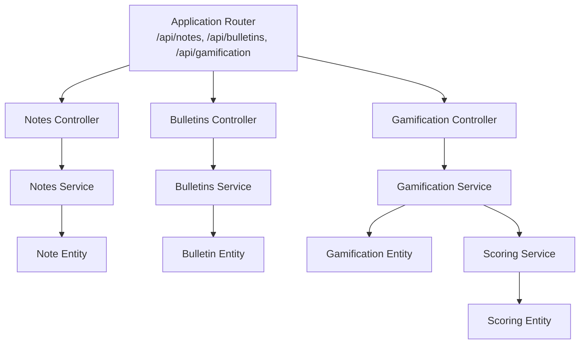
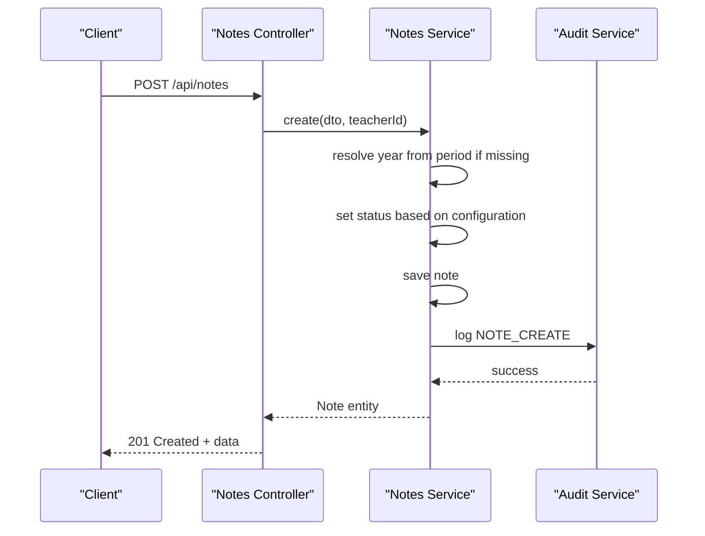
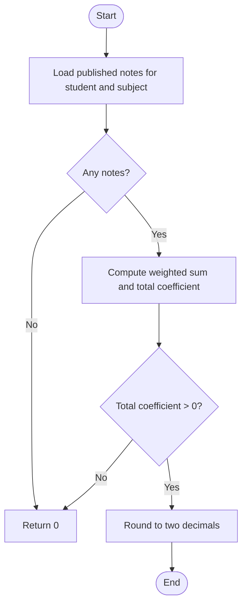
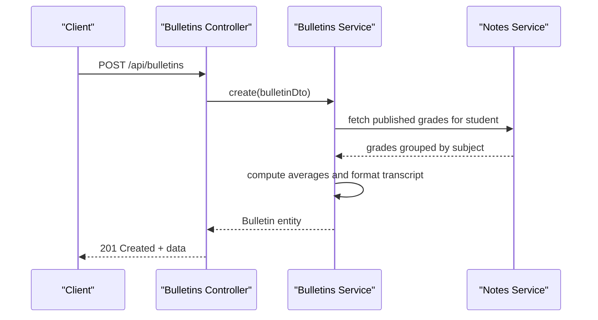
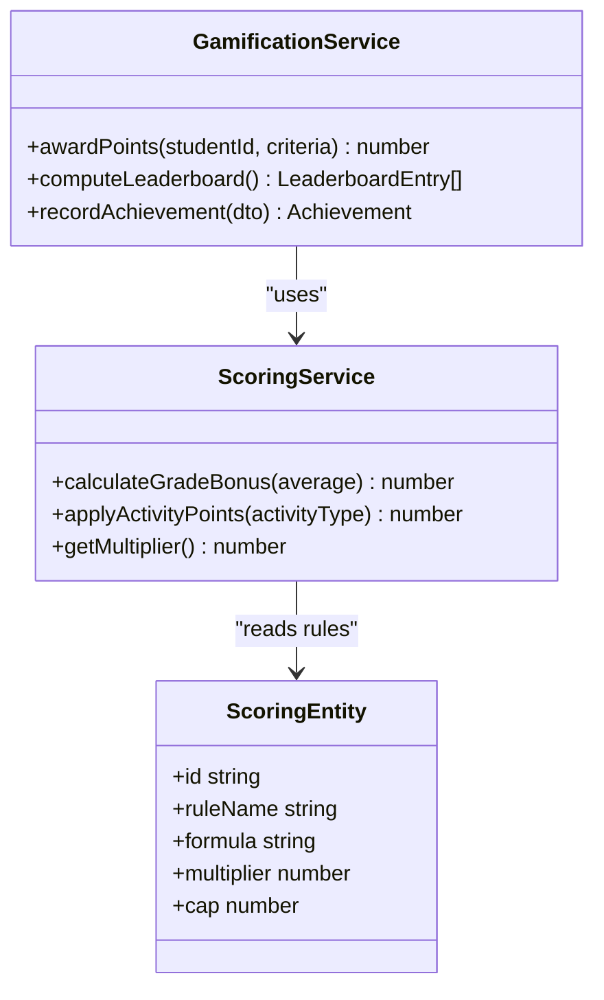
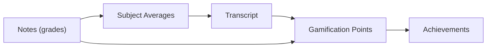
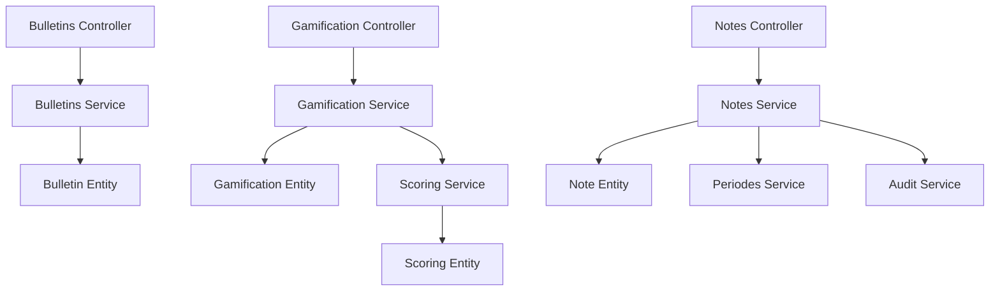

# Grading System API

<cite>
**Referenced Files in This Document**
- [app.ts](file://backend/src/app.ts)
- [notes.controller.ts](file://backend/src/modules/notes/controllers/notes.controller.ts)
- [notes.service.ts](file://backend/src/modules/notes/services/notes.service.ts)
- [bulletins.controller.ts](file://backend/src/modules/bulletins/controllers/bulletins.controller.ts)
- [bulletins.service.ts](file://backend/src/modules/bulletins/services/bulletins.service.ts)
- [gamification.controller.ts](file://backend/src/modules/gamification/controllers/gamification.controller.ts)
- [gamification.service.ts](file://backend/src/modules/gamification/services/gamification.service.ts)
- [scoring.service.ts](file://backend/src/modules/scoring/services/scoring.service.ts)
- [scoring.entity.ts](file://backend/src/modules/scoring/entities/scoring.entity.ts)
- [note.entity.ts](file://backend/src/modules/notes/entities/note.entity.ts)
- [bulletin.entity.ts](file://backend/src/modules/bulletins/entities/bulletin.entity.ts)
- [gamification.entity.ts](file://backend/src/modules/gamification/entities/gamification.entity.ts)
- [note.dto.ts](file://backend/src/modules/notes/dto/note.dto.ts)
- [bulletins.dto.ts](file://backend/src/modules/bulletins/dto/bulletins.dto.ts)
- [gamification.dto.ts](file://backend/src/modules/gamification/dto/gamification.dto.ts)
- [periodes.service.ts](file://backend/src/modules/periodes/services/periodes.service.ts)
- [audit.service.ts](file://backend/src/modules/auth/services/audit.service.ts)
</cite>

## Table of Contents
1. [Introduction](#introduction)
2. [Project Structure](#project-structure)
3. [Core Components](#core-components)
4. [Architecture Overview](#architecture-overview)
5. [Detailed Component Analysis](#detailed-component-analysis)
6. [Dependency Analysis](#dependency-analysis)
7. [Performance Considerations](#performance-considerations)
8. [Troubleshooting Guide](#troubleshooting-guide)
9. [Conclusion](#conclusion)

## Introduction
This document provides comprehensive API documentation for the Grading System module, covering grade management, transcript generation, and gamification features. It specifies HTTP endpoints, request/response schemas, and calculation algorithms used for grade entry, modification, transcript generation, point-based scoring systems, and student achievement tracking. The documentation also explains the relationships among grades, transcripts, and gamification points, and includes examples of grade processing workflows and transcript formatting.

## Project Structure
The Grading System spans several modules:
- Notes: Grade entry, bulk operations, updates, deletions, and averages.
- Bulletins: Transcript generation and management.
- Gamification: Achievement tracking and point-based rewards.
- Scoring: Point calculations and scoring rules.

**Diagram sources**
- [app.ts:25-25](file://backend/src/app.ts#L25-L25)
- [app.ts:153-153](file://backend/src/app.ts#L153-L153)
- [notes.controller.ts:72-72](file://backend/src/modules/notes/controllers/notes.controller.ts#L72-L72)
- [bulletins.controller.ts](file://backend/src/modules/bulletins/controllers/bulletins.controller.ts)
- [gamification.controller.ts](file://backend/src/modules/gamification/controllers/gamification.controller.ts)
- [notes.service.ts:17-22](file://backend/src/modules/notes/services/notes.service.ts#L17-L22)
- [bulletins.service.ts](file://backend/src/modules/bulletins/services/bulletins.service.ts)
- [gamification.service.ts](file://backend/src/modules/gamification/services/gamification.service.ts)
- [scoring.service.ts](file://backend/src/modules/scoring/services/scoring.service.ts)
- [note.entity.ts](file://backend/src/modules/notes/entities/note.entity.ts)
- [bulletin.entity.ts](file://backend/src/modules/bulletins/entities/bulletin.entity.ts)
- [gamification.entity.ts](file://backend/src/modules/gamification/entities/gamification.entity.ts)
- [scoring.entity.ts](file://backend/src/modules/scoring/entities/scoring.entity.ts)

**Section sources**
- [app.ts:25-25](file://backend/src/app.ts#L25-L25)
- [app.ts:153-153](file://backend/src/app.ts#L153-L153)

## Core Components
- Notes Module: Handles individual grade creation, bulk grade creation, updates, deletions, and average computation per period and subject.
- Bulletins Module: Manages transcript generation and retrieval for students.
- Gamification Module: Tracks achievements and computes points based on academic performance and activities.
- Scoring Module: Provides scoring rules and point calculations used by gamification.

Key responsibilities:
- Grade Management: Create, update, delete, and compute averages.
- Transcript Generation: Build and manage student transcripts.
- Gamification: Award points and track achievements.
- Analytics Integration: Audit logs and configuration-driven behavior.

**Section sources**
- [notes.service.ts:164-181](file://backend/src/modules/notes/services/notes.service.ts#L164-L181)
- [bulletins.service.ts](file://backend/src/modules/bulletins/services/bulletins.service.ts)
- [gamification.service.ts](file://backend/src/modules/gamification/services/gamification.service.ts)
- [scoring.service.ts](file://backend/src/modules/scoring/services/scoring.service.ts)

## Architecture Overview
The API follows a layered architecture:
- Controllers handle HTTP requests and delegate to Services.
- Services encapsulate business logic, including calculations and persistence.
- Entities represent domain models.
- DTOs define request/response schemas.
- Configuration and audit services support runtime behavior and logging.

**Diagram sources**
- [notes.controller.ts:42-48](file://backend/src/modules/notes/controllers/notes.controller.ts#L42-L48)
- [notes.service.ts:32-61](file://backend/src/modules/notes/services/notes.service.ts#L32-L61)
- [audit.service.ts](file://backend/src/modules/auth/services/audit.service.ts)

## Detailed Component Analysis

### Notes API (Grade Management)
Endpoints:
- POST /api/notes
  - Purpose: Create a single grade record.
  - Authentication: Requires ENSIGNANT, ADMIN, CHEF_ETABLISSEMENT roles.
  - Request body: CreateNoteDto (fields defined in note.dto.ts).
  - Response: 201 Created with success flag and created Note entity.
  - Behavior: Resolves academic year from period if not provided; sets status according to configuration (require validation).
  - Audit: Logs NOTE_CREATE action.

- POST /api/notes/bulk
  - Purpose: Create multiple grade records for a class and subject.
  - Authentication: Same as above.
  - Request body: CreateBulkNotesDto (fields defined in note.dto.ts).
  - Response: 201 Created with success flag, count, and message.
  - Behavior: Bulk insert; resolves academic year similarly; applies default scale and coefficient if not provided; sets status according to configuration.
  - Audit: Logs bulk NOTE_CREATE action.

- PATCH /api/notes/:id
  - Purpose: Update an existing grade record.
  - Authentication: Same as above.
  - Path parameters: id (grade identifier).
  - Request body: UpdateNoteDto (fields defined in note.dto.ts).
  - Response: 200 OK with updated Note entity.
  - Behavior: On status change to VALIDEE, validator metadata is recorded.

- DELETE /api/notes/:id
  - Purpose: Delete a grade record.
  - Authentication: Same as above.
  - Path parameters: id (grade identifier).
  - Response: 200 OK with success flag and message.
  - Behavior: Removes the grade record.

Calculation Algorithm: Average computation per student and subject
- Input: Student ID, Subject ID, optional Period ID.
- Filter: Published grades only.
- Formula:
  - Convert each grade to a 20-point scale.
  - Weighted sum = Σ(grade_on_20_scale × coefficient).
  - Total coefficient = Σ(coefficient).
  - Average = round_to_two_decimals(weighted_sum / total_coefficient) if total_coefficient > 0 else 0.
- Output: Single numeric average.

**Diagram sources**
- [notes.service.ts:164-181](file://backend/src/modules/notes/services/notes.service.ts#L164-L181)

**Section sources**
- [notes.controller.ts:42-74](file://backend/src/modules/notes/controllers/notes.controller.ts#L42-L74)
- [notes.service.ts:32-101](file://backend/src/modules/notes/services/notes.service.ts#L32-L101)
- [notes.service.ts:135-155](file://backend/src/modules/notes/services/notes.service.ts#L135-L155)
- [notes.service.ts:157-161](file://backend/src/modules/notes/services/notes.service.ts#L157-L161)
- [notes.service.ts:164-181](file://backend/src/modules/notes/services/notes.service.ts#L164-L181)
- [note.entity.ts](file://backend/src/modules/notes/entities/note.entity.ts)
- [note.dto.ts](file://backend/src/modules/notes/dto/note.dto.ts)

### Bulletins API (Transcript Generation)
Endpoints:
- GET /api/bulletins/:id
  - Purpose: Retrieve a transcript by ID.
  - Authentication: Access controlled by role middleware.
  - Path parameters: id (transcript identifier).
  - Response: 200 OK with Bulletin entity.
  - Behavior: Fetches a single transcript.

- POST /api/bulletins
  - Purpose: Create a transcript.
  - Authentication: Access controlled by role middleware.
  - Request body: Bulletin creation DTO (fields defined in bulletins.dto.ts).
  - Response: 201 Created with success flag and created Bulletin entity.
  - Behavior: Generates transcript data using grades and subjects.

- PUT /api/bulletins/:id
  - Purpose: Update a transcript.
  - Authentication: Access controlled by role middleware.
  - Path parameters: id (transcript identifier).
  - Request body: Bulletin update DTO (fields defined in bulletins.dto.ts).
  - Response: 200 OK with updated Bulletin entity.
  - Behavior: Recompute transcript content if needed.

- DELETE /api/bulletins/:id
  - Purpose: Delete a transcript.
  - Authentication: Access controlled by role middleware.
  - Path parameters: id (transcript identifier).
  - Response: 200 OK with success flag and message.
  - Behavior: Removes the transcript.

Transcript Generation Workflow:
- Input: Student ID, Academic Year ID, optional Period ID.
- Steps:
  1. Gather all published grades for the student within the specified period and year.
  2. Group grades by subject and compute averages per subject.
  3. Aggregate subject averages to compute overall averages (e.g., class rank if enabled via configuration).
  4. Format transcript content (subjects, averages, remarks, etc.) using configured templates.
  5. Persist or return the generated transcript.

**Diagram sources**
- [bulletins.controller.ts](file://backend/src/modules/bulletins/controllers/bulletins.controller.ts)
- [bulletins.service.ts](file://backend/src/modules/bulletins/services/bulletins.service.ts)
- [notes.service.ts:164-181](file://backend/src/modules/notes/services/notes.service.ts#L164-L181)

**Section sources**
- [bulletins.controller.ts](file://backend/src/modules/bulletins/controllers/bulletins.controller.ts)
- [bulletins.service.ts](file://backend/src/modules/bulletins/services/bulletins.service.ts)
- [bulletin.entity.ts](file://backend/src/modules/bulletins/entities/bulletin.entity.ts)
- [bulletins.dto.ts](file://backend/src/modules/bulletins/dto/bulletins.dto.ts)

### Gamification API (Achievement Tracking and Points)
Endpoints:
- GET /api/gamification/points/:studentId
  - Purpose: Retrieve gamification points for a student.
  - Authentication: Access controlled by role middleware.
  - Path parameters: studentId (student identifier).
  - Response: 200 OK with points summary.
  - Behavior: Computes points based on academic performance and activities.

- POST /api/gamification/achievements
  - Purpose: Record an achievement for a student.
  - Authentication: Access controlled by role middleware.
  - Request body: Achievement DTO (fields defined in gamification.dto.ts).
  - Response: 201 Created with success flag and created achievement entity.
  - Behavior: Validates criteria and awards points accordingly.

- GET /api/gamification/leaderboard
  - Purpose: Retrieve leaderboard ranking.
  - Authentication: Access controlled by role middleware.
  - Response: 200 OK with ranked list of students by points.
  - Behavior: Uses scoring rules to compute totals and ranks.

Point-Based Scoring System:
- Scoring Rules: Defined in Scoring Service and Scoring Entity.
- Calculation:
  - Base points from grades (e.g., bonus for averages above thresholds).
  - Activity points (e.g., participation, attendance).
  - Multipliers and caps applied via configuration.
  - Final score rounded to integer points.

**Diagram sources**
- [gamification.service.ts](file://backend/src/modules/gamification/services/gamification.service.ts)
- [scoring.service.ts](file://backend/src/modules/scoring/services/scoring.service.ts)
- [scoring.entity.ts](file://backend/src/modules/scoring/entities/scoring.entity.ts)

**Section sources**
- [gamification.controller.ts](file://backend/src/modules/gamification/controllers/gamification.controller.ts)
- [gamification.service.ts](file://backend/src/modules/gamification/services/gamification.service.ts)
- [gamification.entity.ts](file://backend/src/modules/gamification/entities/gamification.entity.ts)
- [gamification.dto.ts](file://backend/src/modules/gamification/dto/gamification.dto.ts)
- [scoring.service.ts](file://backend/src/modules/scoring/services/scoring.service.ts)
- [scoring.entity.ts](file://backend/src/modules/scoring/entities/scoring.entity.ts)

### Relationship Between Grades, Transcripts, and Gamification Points
- Grades feed transcripts: Transcripts aggregate subject averages computed from grades.
- Transcripts inform gamification: Academic performance influences point calculations.
- Gamification reinforces learning: Achievements and points motivate continued performance.

[No sources needed since this diagram shows conceptual relationships, not specific code structure]

## Dependency Analysis
- Controllers depend on Services for business logic.
- Services depend on Repositories and Entities for persistence.
- Notes Service depends on Periodes Service to resolve academic year when missing.
- Notes Service integrates with Audit Service for logging actions.
- Gamification Service depends on Scoring Service and Scoring Entity for point calculations.

**Diagram sources**
- [notes.controller.ts:72-72](file://backend/src/modules/notes/controllers/notes.controller.ts#L72-L72)
- [bulletins.controller.ts](file://backend/src/modules/bulletins/controllers/bulletins.controller.ts)
- [gamification.controller.ts](file://backend/src/modules/gamification/controllers/gamification.controller.ts)
- [notes.service.ts:17-22](file://backend/src/modules/notes/services/notes.service.ts#L17-L22)
- [bulletins.service.ts](file://backend/src/modules/bulletins/services/bulletins.service.ts)
- [gamification.service.ts](file://backend/src/modules/gamification/services/gamification.service.ts)
- [scoring.service.ts](file://backend/src/modules/scoring/services/scoring.service.ts)
- [scoring.entity.ts](file://backend/src/modules/scoring/entities/scoring.entity.ts)
- [note.entity.ts](file://backend/src/modules/notes/entities/note.entity.ts)
- [bulletin.entity.ts](file://backend/src/modules/bulletins/entities/bulletin.entity.ts)
- [gamification.entity.ts](file://backend/src/modules/gamification/entities/gamification.entity.ts)
- [periodes.service.ts](file://backend/src/modules/periodes/services/periodes.service.ts)
- [audit.service.ts](file://backend/src/modules/auth/services/audit.service.ts)

**Section sources**
- [notes.service.ts:17-22](file://backend/src/modules/notes/services/notes.service.ts#L17-L22)
- [audit.service.ts](file://backend/src/modules/auth/services/audit.service.ts)

## Performance Considerations
- Bulk operations: Prefer POST /api/notes/bulk for mass grade entry to minimize round trips.
- Filtering: Use query parameters in list endpoints to reduce payload size.
- Caching: Consider caching computed averages and leaderboards for frequently accessed periods.
- Indexing: Ensure database indexes on foreign keys (eleveId, matiereId, periodeId, anneeScolaireId) for efficient queries.
- Pagination: Implement pagination for list endpoints to avoid large result sets.

[No sources needed since this section provides general guidance]

## Troubleshooting Guide
Common issues and resolutions:
- Unauthorized access: Ensure proper roles (ENSEIGNANT, ADMIN, CHEF_ETABLISSEMENT) for grade management endpoints.
- Missing academic year: When creating grades without ansiennescolaireId, ensure periodeId is provided so the system can resolve the year.
- Validation errors: Verify request bodies conform to DTO schemas; invalid fields will cause validation failures.
- Audit logs: Use audit entries to trace grade creation and modifications for debugging.
- Configuration flags: Review configuration parameters controlling validation and ranking visibility.

**Section sources**
- [notes.controller.ts:42-74](file://backend/src/modules/notes/controllers/notes.controller.ts#L42-L74)
- [notes.service.ts:24-30](file://backend/src/modules/notes/services/notes.service.ts#L24-L30)
- [audit.service.ts](file://backend/src/modules/auth/services/audit.service.ts)

## Conclusion
The Grading System API provides robust capabilities for managing grades, generating transcripts, and implementing gamification. By leveraging well-defined endpoints, DTOs, and calculation algorithms, administrators and educators can efficiently maintain academic records, produce standardized transcripts, and motivate students through achievement tracking and point-based rewards. Integrations with configuration and audit services ensure flexible behavior and transparent operations.