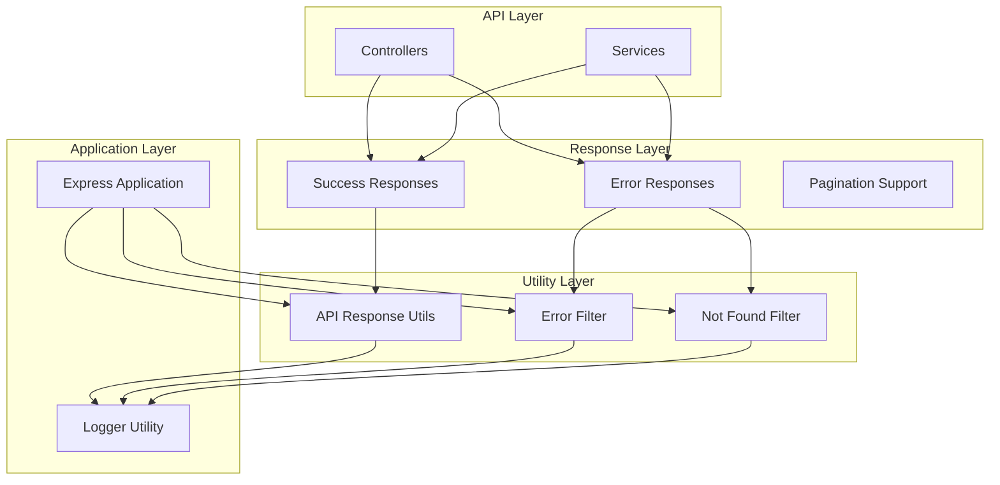
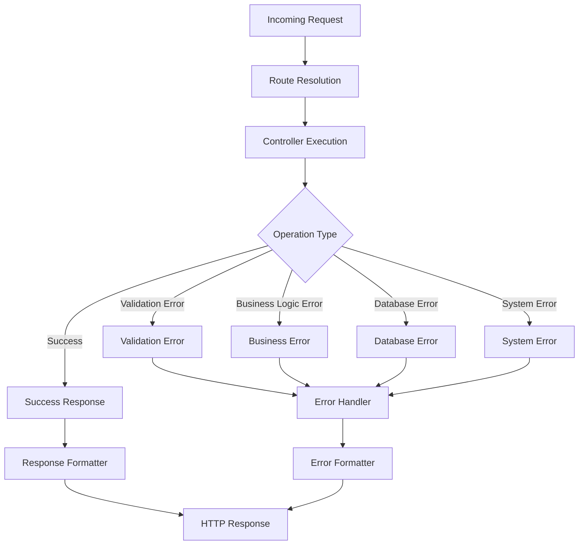
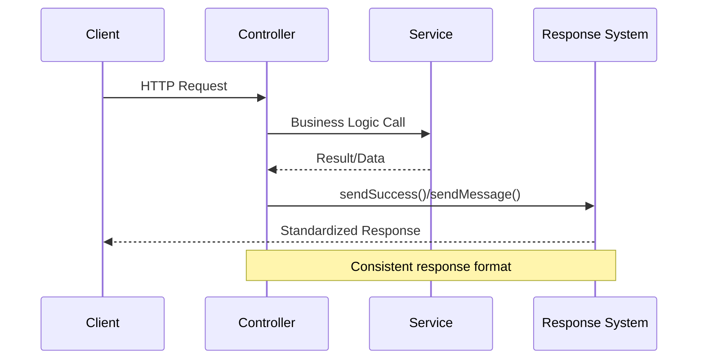
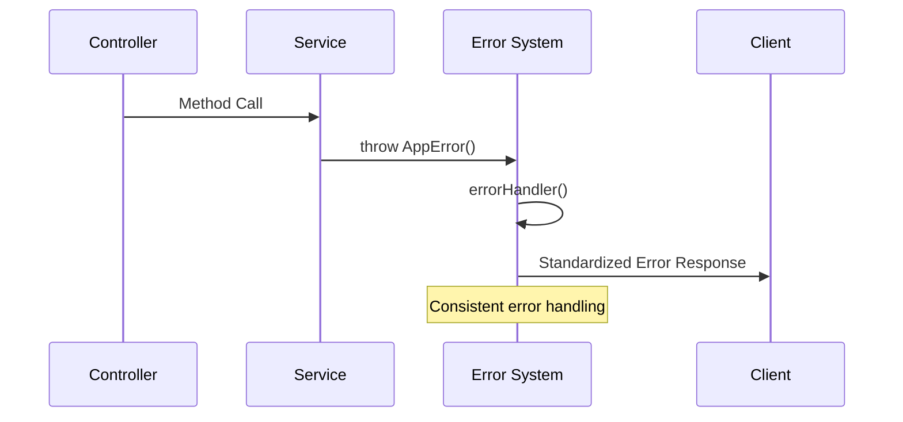

# Standardized API Response System

<cite>
**Referenced Files in This Document**
- [api-response.util.ts](file://backend/src/common/utils/api-response.util.ts)
- [error.filter.ts](file://backend/src/common/filters/error.filter.ts)
- [not-found.filter.ts](file://backend/src/common/filters/not-found.filter.ts)
- [app.ts](file://backend/src/app.ts)
- [index.ts](file://backend/src/common/utils/index.ts)
- [index.ts](file://backend/src/common/filters/index.ts)
- [index.ts](file://backend/src/common/interceptors/index.ts)
- [index.ts](file://backend/src/common/middlewares/index.ts)
</cite>

## Table of Contents
1. [Introduction](#introduction)
2. [System Architecture](#system-architecture)
3. [Core Components](#core-components)
4. [Response Format Specifications](#response-format-specifications)
5. [Error Management System](#error-management-system)
6. [Implementation Patterns](#implementation-patterns)
7. [Integration Examples](#integration-examples)
8. [Best Practices](#best-practices)
9. [Troubleshooting Guide](#troubleshooting-guide)
10. [Conclusion](#conclusion)

## Introduction

The Standardized API Response System is a comprehensive framework designed to provide consistent, predictable, and developer-friendly API responses across the eLISAschool backend application. This system ensures uniform response formats, standardized error handling, and reliable communication patterns between the server and client applications.

The system consists of three primary components: standardized success responses, unified error handling, and consistent pagination support. These components work together to create a robust API infrastructure that enhances maintainability, debugging capabilities, and overall developer experience.

## System Architecture

The API Response System follows a layered architecture pattern with clear separation of concerns:



**Diagram sources**
- [api-response.util.ts:1-67](file://backend/src/common/utils/api-response.util.ts#L1-L67)
- [error.filter.ts:1-133](file://backend/src/common/filters/error.filter.ts#L1-L133)
- [not-found.filter.ts:1-100](file://backend/src/common/filters/not-found.filter.ts#L1-L100)

## Core Components

### API Response Utilities

The API Response Utilities module provides the foundation for standardized success responses through a set of carefully designed utility functions and interfaces.

#### Response Interfaces

The system defines several key interfaces that ensure type safety and consistency:

- **ApiResponse<T>**: Base interface for simple success responses containing success flag and optional data
- **PaginatedResponse<T>**: Interface for paginated responses with metadata
- **PaginationMeta**: Interface defining pagination structure with page, limit, total, and totalPages

#### Success Response Functions

The utility module exposes two primary functions for sending success responses:

- **sendSuccess<T>**: Sends structured success responses with data payload
- **sendMessage**: Sends success responses with message-only payload

**Section sources**
- [api-response.util.ts:19-67](file://backend/src/common/utils/api-response.util.ts#L19-L67)

### Error Management System

The Error Management System provides comprehensive error handling with standardized error responses and logging capabilities.

#### AppError Class

The system introduces a custom error class that extends the native JavaScript Error:

- **statusCode**: HTTP status code associated with the error
- **code**: Machine-readable error code
- **isOperational**: Flag indicating if the error is operational vs. programming error
- **details**: Optional structured details about the error

#### Predefined Error Categories

The system categorizes errors into logical groups:

- **Authentication Errors** (401): UNAUTHORIZED, INVALID_TOKEN
- **Authorization Errors** (403): FORBIDDEN, INSUFFICIENT_PERMISSIONS
- **Resource Errors** (404): NOT_FOUND, USER_NOT_FOUND
- **Validation Errors** (400): BAD_REQUEST, VALIDATION_ERROR
- **Conflict Errors** (409): CONFLICT, DUPLICATE_ENTRY
- **Server Errors** (500): INTERNAL_ERROR, DATABASE_ERROR

#### Error Handler Middleware

The centralized error handler provides:

- Automatic error classification and status code determination
- Structured error response formatting
- Environment-aware stack trace inclusion
- Comprehensive logging with contextual information

**Section sources**
- [error.filter.ts:15-66](file://backend/src/common/filters/error.filter.ts#L15-L66)
- [error.filter.ts:86-133](file://backend/src/common/filters/error.filter.ts#L86-L133)

### Not Found Handler

The Not Found Handler specifically addresses 404 errors and provides consistent behavior for undefined routes:

- Captures requests to non-existent endpoints
- Returns standardized error responses
- Maintains consistency with the broader error handling system

**Section sources**
- [not-found.filter.ts:1-100](file://backend/src/common/filters/not-found.filter.ts#L1-L100)

## Response Format Specifications

### Success Response Format

Standardized success responses follow a consistent JSON structure:

```json
{
  "success": true,
  "data": {},
  "message": "string",
  "meta": {
    "page": 1,
    "limit": 10,
    "total": 100,
    "totalPages": 10
  }
}
```

### Error Response Format

Standardized error responses include comprehensive information:

```json
{
  "success": false,
  "error": {
    "code": "ERROR_CODE",
    "message": "Error description",
    "details": {},
    "stack": "Stack trace (development only)"
  },
  "timestamp": "ISO timestamp",
  "path": "/api/endpoint"
}
```

### Pagination Response Format

Paginated responses include metadata for client-side navigation:

```json
{
  "success": true,
  "data": [],
  "meta": {
    "page": 1,
    "limit": 10,
    "total": 100,
    "totalPages": 10
  }
}
```

## Error Management System

### Error Classification and Handling

The error management system provides sophisticated error handling through multiple layers:



**Diagram sources**
- [error.filter.ts:86-133](file://backend/src/common/filters/error.filter.ts#L86-L133)

### Logging and Monitoring

The system integrates comprehensive logging capabilities:

- **Development Environment**: Includes stack traces for debugging
- **Production Environment**: Omits sensitive information for security
- **Structured Logging**: Provides contextual information for monitoring
- **Severity Levels**: Differentiates between warnings and errors

**Section sources**
- [error.filter.ts:98-111](file://backend/src/common/filters/error.filter.ts#L98-L111)

## Implementation Patterns

### Controller Integration Pattern

Controllers integrate with the response system through standardized patterns:



**Diagram sources**
- [api-response.util.ts:52-67](file://backend/src/common/utils/api-response.util.ts#L52-L67)

### Error Propagation Pattern

Errors propagate consistently through the system:



**Diagram sources**
- [error.filter.ts:86-133](file://backend/src/common/filters/error.filter.ts#L86-L133)

## Integration Examples

### Basic Success Response

Controllers use the API response utilities to send standardized responses:

```typescript
// Example usage pattern
const data = await service.getData();
sendSuccess(res, data, 200);
```

### Message-Only Response

For operations that don't require data payload:

```typescript
// Example usage pattern
sendMessage(res, "Operation completed successfully", 201);
```

### Error Response Integration

Controllers can throw AppError instances for consistent error handling:

```typescript
// Example usage pattern
if (!validation.isValid) {
    throw new AppError('Invalid input data', 400, 'VALIDATION_ERROR');
}
```

**Section sources**
- [api-response.util.ts:52-67](file://backend/src/common/utils/api-response.util.ts#L52-L67)
- [error.filter.ts:15-37](file://backend/src/common/filters/error.filter.ts#L15-L37)

## Best Practices

### Response Design Guidelines

1. **Consistency**: Always use the standardized response format
2. **Clarity**: Provide meaningful messages and error codes
3. **Completeness**: Include all relevant metadata for paginated responses
4. **Security**: Never expose internal implementation details in production

### Error Handling Guidelines

1. **Specificity**: Use appropriate error codes for different scenarios
2. **Context**: Include relevant details for debugging
3. **Graceful Degradation**: Provide fallback responses when possible
4. **Logging**: Ensure all errors are properly logged with context

### Performance Considerations

1. **Minimal Payloads**: Only include necessary data in responses
2. **Efficient Serialization**: Use efficient JSON serialization
3. **Caching**: Implement appropriate caching strategies
4. **Compression**: Consider response compression for large payloads

## Troubleshooting Guide

### Common Issues and Solutions

#### Response Format Problems

**Issue**: Inconsistent response formats across endpoints
**Solution**: Ensure all controllers use the API response utilities

#### Error Handling Issues

**Issue**: Non-standard error responses
**Solution**: Use AppError instances and rely on the centralized error handler

#### Logging Problems

**Issue**: Missing or insufficient error logs
**Solution**: Verify logger configuration and error handler integration

### Debugging Strategies

1. **Enable Development Mode**: Stack traces are included for easier debugging
2. **Check Error Codes**: Use standardized error codes for quick identification
3. **Review Logs**: Examine structured logs for contextual information
4. **Test Edge Cases**: Verify error handling for various failure scenarios

**Section sources**
- [error.filter.ts:125-128](file://backend/src/common/filters/error.filter.ts#L125-L128)

## Conclusion

The Standardized API Response System provides a robust foundation for consistent API communication across the eLISAschool application. Through careful design and implementation, the system ensures:

- **Consistency**: Uniform response formats across all endpoints
- **Maintainability**: Centralized error handling and response generation
- **Developer Experience**: Clear error codes and meaningful messages
- **Reliability**: Comprehensive logging and monitoring capabilities
- **Scalability**: Extensible architecture supporting future enhancements

The system's modular design allows for easy maintenance and extension while maintaining backward compatibility and developer productivity. By following the established patterns and best practices, developers can create reliable, consistent APIs that enhance the overall quality of the application.