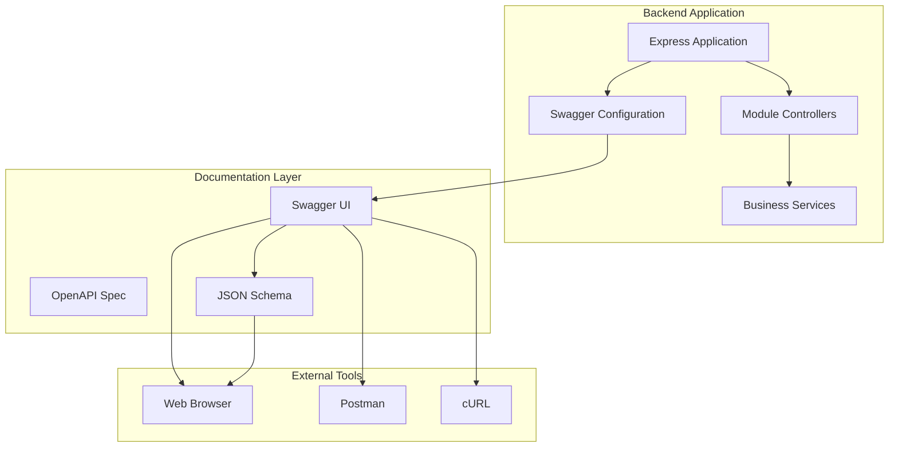
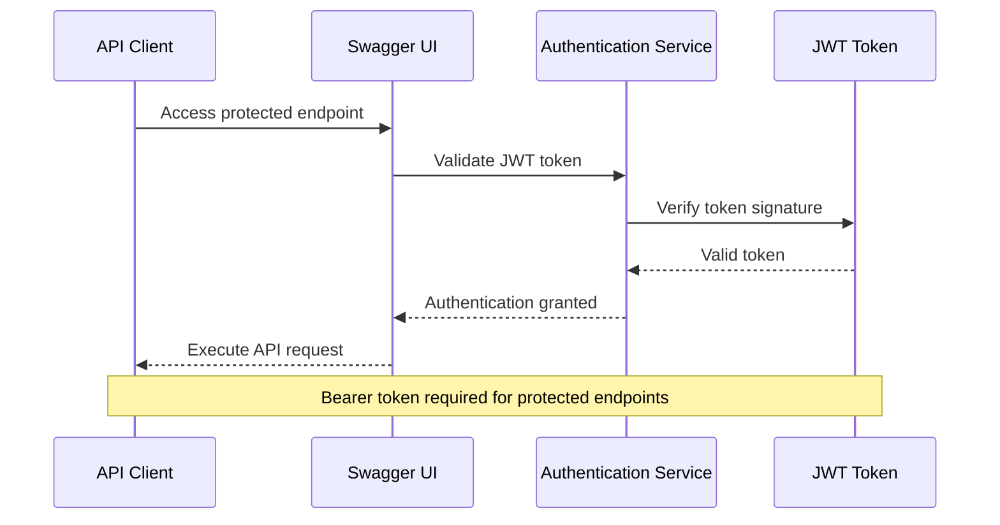
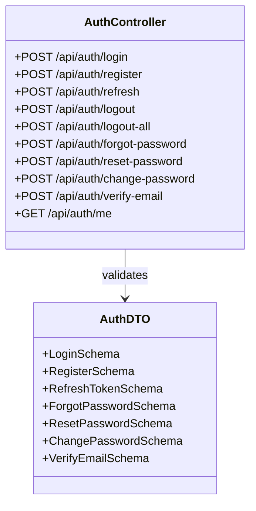
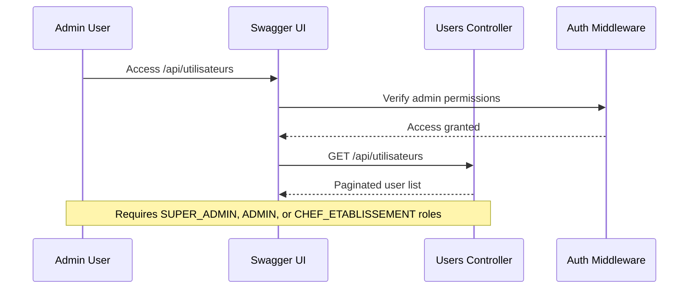
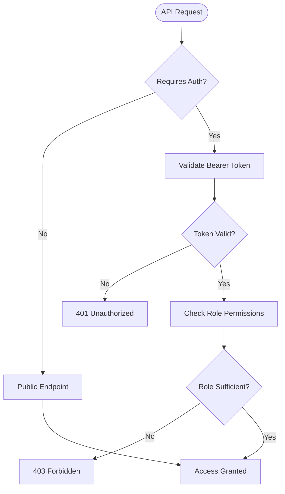
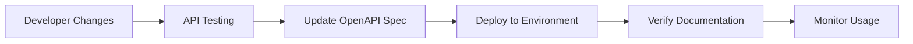

# Swagger/OpenAPI Documentation System

<cite>
**Referenced Files in This Document**
- [swagger.config.ts](file://backend/src/config/swagger.config.ts)
- [app.ts](file://backend/src/app.ts)
- [index.ts](file://backend/src/index.ts)
- [auth.controller.ts](file://backend/src/modules/auth/controllers/auth.controller.ts)
- [utilisateurs.controller.ts](file://backend/src/modules/utilisateurs/controllers/utilisateurs.controller.ts)
- [auth.dto.ts](file://backend/src/modules/auth/dto/auth.dto.ts)
- [utilisateur.dto.ts](file://backend/src/modules/utilisateurs/dto/utilisateur.dto.ts)
- [package.json](file://backend/package.json)
</cite>

## Table of Contents
1. [Introduction](#introduction)
2. [System Architecture](#system-architecture)
3. [Swagger Configuration](#swagger-configuration)
4. [Documentation Endpoints](#documentation-endpoints)
5. [API Specification Structure](#api-specification-structure)
6. [Controller Integration](#controller-integration)
7. [Data Validation Integration](#data-validation-integration)
8. [Security Implementation](#security-implementation)
9. [Development Workflow](#development-workflow)
10. [Best Practices](#best-practices)
11. [Troubleshooting Guide](#troubleshooting-guide)

## Introduction

The eLISAschool Swagger/OpenAPI Documentation System provides comprehensive interactive API documentation for the advanced school management system. This documentation system leverages Swagger UI Express to create dynamic, interactive documentation that allows developers to explore and test API endpoints in real-time.

The system integrates seamlessly with the backend architecture, providing standardized documentation across all 20+ modules including authentication, user management, academic records, and specialized services like canteen management and transportation.

## System Architecture

The Swagger/OpenAPI documentation system is built on a modular architecture that integrates with the existing Express.js backend:

**Diagram sources**
- [app.ts:58-217](file://backend/src/app.ts#L58-L217)
- [swagger.config.ts:8-231](file://backend/src/config/swagger.config.ts#L8-L231)

## Swagger Configuration

The documentation system is configured through a centralized OpenAPI specification that defines the complete API structure:

### Core Configuration Elements

The main configuration file establishes the foundation for the entire documentation system:

- **OpenAPI Version**: 3.0.3 for modern API documentation standards
- **Application Information**: Title, description, version, and contact information
- **Server Configuration**: Base URL `/api` for all endpoints
- **Security Scheme**: Bearer token authentication with JWT format
- **Tag Organization**: 19 distinct functional categories

### Security Implementation

The system implements comprehensive security documentation:

**Diagram sources**
- [swagger.config.ts:18-44](file://backend/src/config/swagger.config.ts#L18-L44)
- [auth.controller.ts:252-264](file://backend/src/modules/auth/controllers/auth.controller.ts#L252-L264)

**Section sources**
- [swagger.config.ts:8-65](file://backend/src/config/swagger.config.ts#L8-L65)

## Documentation Endpoints

The system provides multiple documentation delivery mechanisms:

### Interactive Documentation
- **Primary Endpoint**: `/api/docs` - Full Swagger UI interface
- **Custom Styling**: Minimalist design with hidden top bar
- **Browser Title**: "eLISAschool API Docs"

### Machine-Readable Specifications
- **JSON Endpoint**: `/api/docs.json` - Raw OpenAPI specification
- **Real-time Updates**: Automatically reflects current API state

### Application Integration
- **Health Check**: `/api/health` - System status verification
- **Info Endpoint**: `/api` - Basic application information

**Section sources**
- [app.ts:145-154](file://backend/src/app.ts#L145-L154)

## API Specification Structure

The OpenAPI specification organizes endpoints into logical categories representing the application's functional modules:

### Tag Categories

| Category | Endpoints Count | Description |
|----------|----------------|-------------|
| Système | 1 | Health check and system information |
| Authentification | 7 | User authentication and session management |
| Utilisateurs | 1 | User management operations |
| Configuration | 5 | Application configuration and settings |
| Notes | 3 | Academic grading and reporting |
| Cantine | 3 | Food service management |
| Transport | 1 | Student transportation services |
| Messagerie | 2 | Communication platform |
| Notifications | 2 | Alert and notification system |
| Clubs | 2 | Extracurricular activities |
| Gamification | 2 | Achievement and reward system |
| Matériel | 2 | Inventory and equipment management |
| Requêtes | 2 | Request and approval workflows |
| Cartes | 2 | Student identification cards |
| Académique | 9 | Academic administration |
| Orientation | 1 | Career guidance services |
| Impressions | 2 | Document generation |
| Monitoring | 1 | System monitoring |

**Section sources**
- [swagger.config.ts:45-65](file://backend/src/config/swagger.config.ts#L45-L65)

## Controller Integration

Each controller integrates with the documentation system through consistent patterns:

### Authentication Controller Integration

The authentication module demonstrates comprehensive documentation coverage:

**Diagram sources**
- [auth.controller.ts:55-264](file://backend/src/modules/auth/controllers/auth.controller.ts#L55-L264)
- [auth.dto.ts:18-107](file://backend/src/modules/auth/dto/auth.dto.ts#L18-L107)

### User Management Integration

The user management system showcases role-based access documentation:

**Diagram sources**
- [utilisateurs.controller.ts:47-60](file://backend/src/modules/utilisateurs/controllers/utilisateurs.controller.ts#L47-L60)

**Section sources**
- [auth.controller.ts:55-264](file://backend/src/modules/auth/controllers/auth.controller.ts#L55-L264)
- [utilisateurs.controller.ts:47-203](file://backend/src/modules/utilisateurs/controllers/utilisateurs.controller.ts#L47-L203)

## Data Validation Integration

The documentation system seamlessly integrates with the Zod validation framework:

### Validation Schema Documentation

Each endpoint automatically documents its input validation requirements:

| Validation Type | Purpose | Example |
|----------------|---------|---------|
| Email Validation | User email format | `email@domain.com` |
| Password Validation | Security requirements | Minimum 8 characters, mixed case, numbers |
| Phone Validation | International format | `+1234567890` |
| UUID Validation | Entity identification | `123e4567-e89b-12d3-a456-426614174000` |

### Automatic Schema Generation

The system automatically generates documentation for:
- Request body schemas
- Response structures
- Query parameters
- Path parameters
- Validation error responses

**Section sources**
- [auth.dto.ts:18-107](file://backend/src/modules/auth/dto/auth.dto.ts#L18-L107)
- [utilisateur.dto.ts:14-86](file://backend/src/modules/utilisateurs/dto/utilisateur.dto.ts#L14-L86)

## Security Implementation

The documentation system enforces comprehensive security measures:

### Authentication Requirements

**Diagram sources**
- [swagger.config.ts:18-44](file://backend/src/config/swagger.config.ts#L18-L44)
- [utilisateurs.controller.ts:40-40](file://backend/src/modules/utilisateurs/controllers/utilisateurs.controller.ts#L40-L40)

### Role-Based Access Control

The system documents role-specific access patterns:
- **PUBLIC**: No authentication required
- **AUTHENTICATED**: Basic user authentication
- **ADMIN**: Administrative privileges
- **SUPER_ADMIN**: Full system access

**Section sources**
- [utilisateurs.controller.ts:40-183](file://backend/src/modules/utilisateurs/controllers/utilisateurs.controller.ts#L40-L183)

## Development Workflow

The documentation system follows a structured development approach:

### Setup and Configuration

1. **Install Dependencies**: `npm install swagger-ui-express @types/swagger-ui-express`
2. **Configure Swagger**: Define OpenAPI specification in `swagger.config.ts`
3. **Mount Documentation**: Add routes in `app.ts`
4. **Test Integration**: Verify documentation accessibility

### Continuous Integration

### Best Practices

- Keep OpenAPI spec synchronized with actual endpoints
- Document all request/response schemas
- Include comprehensive error response examples
- Maintain consistent tag organization
- Regular documentation updates during development

**Section sources**
- [package.json:23-39](file://backend/package.json#L23-L39)
- [app.ts:145-154](file://backend/src/app.ts#L145-L154)

## Best Practices

### Documentation Standards

1. **Consistent Tagging**: Use predefined tag categories for all endpoints
2. **Clear Descriptions**: Provide meaningful summaries and descriptions
3. **Example Responses**: Include realistic example responses
4. **Error Documentation**: Document all possible error scenarios
5. **Security Notes**: Clearly indicate authentication requirements

### Maintenance Guidelines

- **Version Control**: Track documentation changes alongside code
- **Review Process**: Regular documentation reviews during sprint planning
- **User Feedback**: Monitor documentation usage and gather feedback
- **Automated Testing**: Include documentation tests in CI/CD pipeline

### Performance Considerations

- **Lazy Loading**: Load documentation only when needed
- **Caching**: Cache static documentation assets
- **Minification**: Minimize documentation bundle size
- **Compression**: Enable gzip compression for documentation responses

## Troubleshooting Guide

### Common Issues and Solutions

| Issue | Symptoms | Solution |
|-------|----------|----------|
| Documentation Not Loading | Blank page at `/api/docs` | Check Swagger UI installation and configuration |
| Authentication Errors | 401 responses in documentation | Verify JWT token format and expiration |
| Schema Mismatch | Validation errors in documentation | Update OpenAPI spec to match actual endpoints |
| CORS Issues | Cross-origin errors | Configure CORS properly for documentation endpoints |

### Debugging Steps

1. **Verify Installation**: Ensure `swagger-ui-express` is installed
2. **Check Configuration**: Validate OpenAPI specification syntax
3. **Test Endpoints**: Manually test documentation endpoints
4. **Review Logs**: Check server logs for documentation-related errors
5. **Network Analysis**: Use browser developer tools to inspect requests

### Performance Optimization

- **Bundle Optimization**: Minimize JavaScript bundle size
- **Asset Caching**: Implement proper caching headers
- **Lazy Loading**: Load documentation assets on demand
- **Compression**: Enable gzip compression for documentation responses

**Section sources**
- [app.ts:145-154](file://backend/src/app.ts#L145-L154)
- [index.ts:34-39](file://backend/src/index.ts#L34-L39)