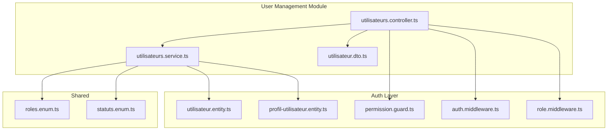
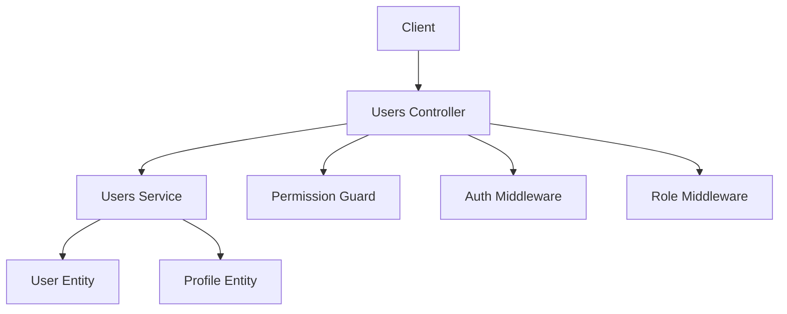
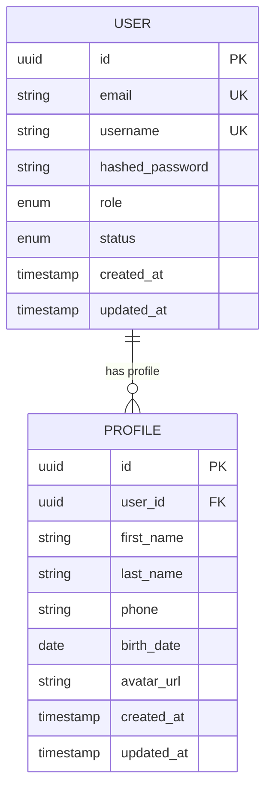
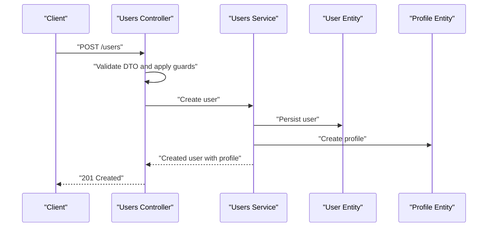
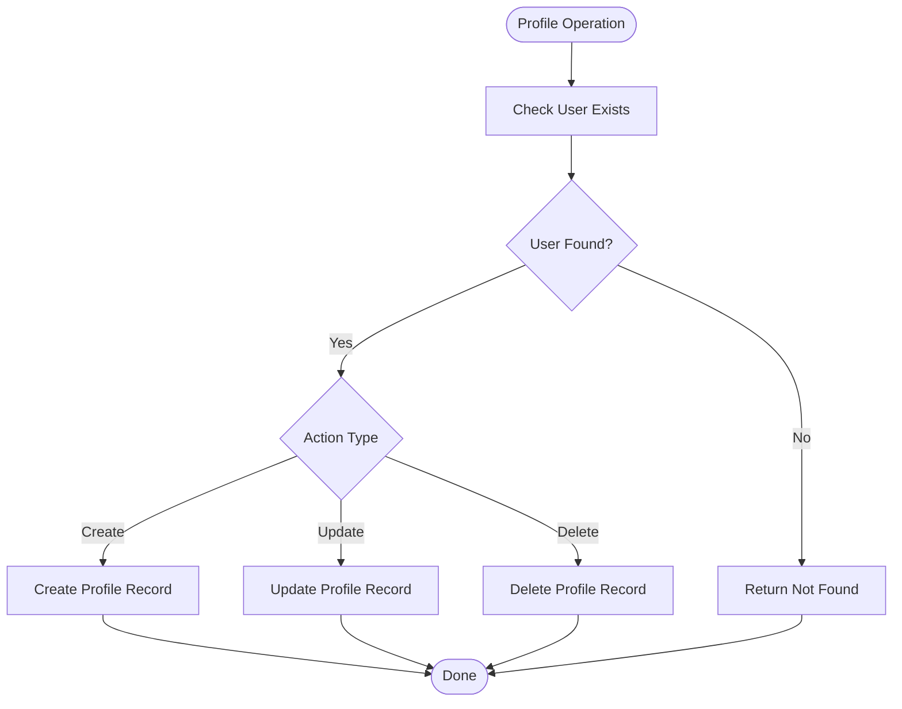
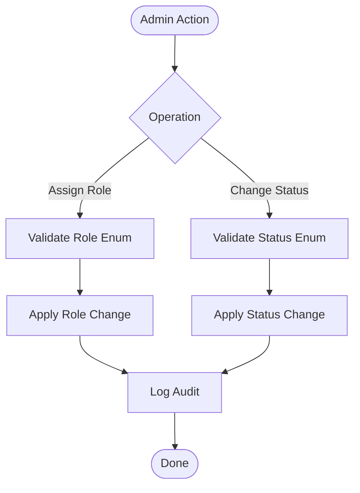
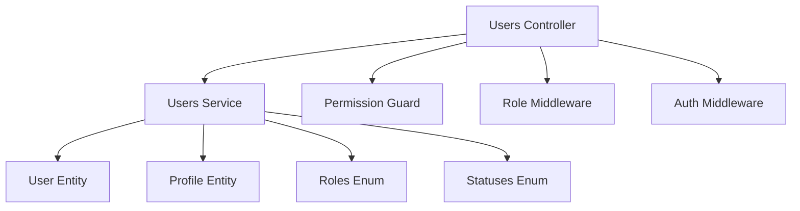

# User Management API

<cite>
**Referenced Files in This Document**
- [utilisateurs.controller.ts](file://backend/src/modules/utilisateurs/controllers/utilisateurs.controller.ts)
- [utilisateurs.service.ts](file://backend/src/modules/utilisateurs/services/utilisateurs.service.ts)
- [utilisateur.dto.ts](file://backend/src/modules/utilisateurs/dto/utilisateur.dto.ts)
- [utilisateur.entity.ts](file://backend/src/modules/auth/entities/utilisateur.entity.ts)
- [profil-utilisateur.entity.ts](file://backend/src/modules/auth/entities/profil-utilisateur.entity.ts)
- [roles.enum.ts](file://shared/src/enums/roles.enum.ts)
- [statuts.enum.ts](file://shared/src/enums/statuts.enum.ts)
- [permission.guard.ts](file://backend/src/modules/auth/guards/permission.guard.ts)
- [role.middleware.ts](file://backend/src/modules/auth/middlewares/role.middleware.ts)
- [auth.middleware.ts](file://backend/src/modules/auth/middlewares/auth.middleware.ts)
</cite>

## Table of Contents
1. [Introduction](#introduction)
2. [Project Structure](#project-structure)
3. [Core Components](#core-components)
4. [Architecture Overview](#architecture-overview)
5. [Detailed Component Analysis](#detailed-component-analysis)
6. [Dependency Analysis](#dependency-analysis)
7. [Performance Considerations](#performance-considerations)
8. [Troubleshooting Guide](#troubleshooting-guide)
9. [Conclusion](#conclusion)

## Introduction
This document provides comprehensive API documentation for the User Management module. It covers all user-related endpoints including CRUD operations, profile management, role assignments, and user status updates. It also documents the relationship between users and profiles, role-based access control, and administrative functions. The goal is to enable developers and integrators to effectively use the User Management APIs while understanding validation rules, request/response schemas, and operational flows.

## Project Structure
The User Management module is organized into three primary layers:
- Controllers: Expose HTTP endpoints and delegate work to services.
- Services: Implement business logic and orchestrate data access.
- DTOs: Define request/response schemas and validation constraints.
- Entities: Represent persisted data models for users and profiles.
- Guards and Middlewares: Enforce authentication and authorization policies.

**Diagram sources**
- [utilisateurs.controller.ts](file://backend/src/modules/utilisateurs/controllers/utilisateurs.controller.ts)
- [utilisateurs.service.ts](file://backend/src/modules/utilisateurs/services/utilisateurs.service.ts)
- [utilisateur.dto.ts](file://backend/src/modules/utilisateurs/dto/utilisateur.dto.ts)
- [utilisateur.entity.ts](file://backend/src/modules/auth/entities/utilisateur.entity.ts)
- [profil-utilisateur.entity.ts](file://backend/src/modules/auth/entities/profil-utilisateur.entity.ts)
- [permission.guard.ts](file://backend/src/modules/auth/guards/permission.guard.ts)
- [auth.middleware.ts](file://backend/src/modules/auth/middlewares/auth.middleware.ts)
- [role.middleware.ts](file://backend/src/modules/auth/middlewares/role.middleware.ts)
- [roles.enum.ts](file://shared/src/enums/roles.enum.ts)
- [statuts.enum.ts](file://shared/src/enums/statuts.enum.ts)

**Section sources**
- [utilisateurs.controller.ts](file://backend/src/modules/utilisateurs/controllers/utilisateurs.controller.ts)
- [utilisateurs.service.ts](file://backend/src/modules/utilisateurs/services/utilisateurs.service.ts)
- [utilisateur.dto.ts](file://backend/src/modules/utilisateurs/dto/utilisateur.dto.ts)
- [utilisateur.entity.ts](file://backend/src/modules/auth/entities/utilisateur.entity.ts)
- [profil-utilisateur.entity.ts](file://backend/src/modules/auth/entities/profil-utilisateur.entity.ts)
- [roles.enum.ts](file://shared/src/enums/roles.enum.ts)
- [statuts.enum.ts](file://shared/src/enums/statuts.enum.ts)
- [permission.guard.ts](file://backend/src/modules/auth/guards/permission.guard.ts)
- [auth.middleware.ts](file://backend/src/modules/auth/middlewares/auth.middleware.ts)
- [role.middleware.ts](file://backend/src/modules/auth/middlewares/role.middleware.ts)

## Core Components
- Controller: Defines HTTP endpoints for user management, applies guards/middlewares, and delegates to the service layer.
- Service: Implements business logic for user CRUD, profile operations, role assignment, status updates, and search/filtering.
- DTO: Specifies request/response schemas and validation rules for user creation, update, and search operations.
- Entities: Persisted models for users and profiles, including relationships and constraints.
- Guards/Middlewares: Enforce authentication and role-based authorization.

Key responsibilities:
- User CRUD: Create, retrieve, update, delete users.
- Profile management: Link and manage profile records per user.
- Role assignments: Assign and validate roles via middleware and guard.
- Status updates: Toggle user activity status using status enums.
- Search and filtering: Filter users by criteria such as role, status, and name/email.

**Section sources**
- [utilisateurs.controller.ts](file://backend/src/modules/utilisateurs/controllers/utilisateurs.controller.ts)
- [utilisateurs.service.ts](file://backend/src/modules/utilisateurs/services/utilisateurs.service.ts)
- [utilisateur.dto.ts](file://backend/src/modules/utilisateurs/dto/utilisateur.dto.ts)
- [utilisateur.entity.ts](file://backend/src/modules/auth/entities/utilisateur.entity.ts)
- [profil-utilisateur.entity.ts](file://backend/src/modules/auth/entities/profil-utilisateur.entity.ts)
- [roles.enum.ts](file://shared/src/enums/roles.enum.ts)
- [statuts.enum.ts](file://shared/src/enums/statuts.enum.ts)
- [permission.guard.ts](file://backend/src/modules/auth/guards/permission.guard.ts)
- [auth.middleware.ts](file://backend/src/modules/auth/middlewares/auth.middleware.ts)
- [role.middleware.ts](file://backend/src/modules/auth/middlewares/role.middleware.ts)

## Architecture Overview
The User Management module follows a layered architecture:
- Presentation: Controller exposes endpoints.
- Application: Service encapsulates business rules.
- Domain/Data: Entities represent persisted data and relationships.
- Security: Guards and middlewares enforce authentication and authorization.

**Diagram sources**
- [utilisateurs.controller.ts](file://backend/src/modules/utilisateurs/controllers/utilisateurs.controller.ts)
- [utilisateurs.service.ts](file://backend/src/modules/utilisateurs/services/utilisateurs.service.ts)
- [permission.guard.ts](file://backend/src/modules/auth/guards/permission.guard.ts)
- [auth.middleware.ts](file://backend/src/modules/auth/middlewares/auth.middleware.ts)
- [role.middleware.ts](file://backend/src/modules/auth/middlewares/role.middleware.ts)
- [utilisateur.entity.ts](file://backend/src/modules/auth/entities/utilisateur.entity.ts)
- [profil-utilisateur.entity.ts](file://backend/src/modules/auth/entities/profil-utilisateur.entity.ts)

## Detailed Component Analysis

### Users Controller Endpoints
The controller defines HTTP endpoints for user management. Each endpoint specifies method, path, guards, and response behavior.

- GET /users
  - Description: Retrieve paginated and filtered list of users.
  - Authentication: Requires authentication.
  - Authorization: Requires specific permissions.
  - Query parameters: Supports filtering by role, status, and search terms; pagination controls.
  - Response: Array of user summaries with metadata.

- GET /users/:id
  - Description: Retrieve a single user by ID.
  - Authentication: Requires authentication.
  - Authorization: Requires specific permissions.
  - Path parameters: id (user identifier).
  - Response: Full user record including profile.

- POST /users
  - Description: Create a new user.
  - Authentication: Requires authentication.
  - Authorization: Requires specific permissions.
  - Request body: User creation DTO with validation rules.
  - Response: Created user record.

- PUT /users/:id
  - Description: Update an existing user by ID.
  - Authentication: Requires authentication.
  - Authorization: Requires specific permissions.
  - Path parameters: id (user identifier).
  - Request body: Partial user update DTO with validation rules.
  - Response: Updated user record.

- DELETE /users/:id
  - Description: Delete a user by ID.
  - Authentication: Requires authentication.
  - Authorization: Requires specific permissions.
  - Path parameters: id (user identifier).
  - Response: Deletion confirmation.

- PATCH /users/:id/status
  - Description: Update user status (active/inactive).
  - Authentication: Requires authentication.
  - Authorization: Requires specific permissions.
  - Path parameters: id (user identifier).
  - Request body: Status update DTO using status enumeration.
  - Response: Updated user record with new status.

- PATCH /users/:id/role
  - Description: Assign or change user role.
  - Authentication: Requires authentication.
  - Authorization: Requires specific permissions.
  - Path parameters: id (user identifier).
  - Request body: Role assignment DTO using role enumeration.
  - Response: Updated user record with new role.

Validation rules and schemas are defined in the DTO layer and enforced by the controller.

**Section sources**
- [utilisateurs.controller.ts](file://backend/src/modules/utilisateurs/controllers/utilisateurs.controller.ts)
- [utilisateur.dto.ts](file://backend/src/modules/utilisateurs/dto/utilisateur.dto.ts)

### Users Service Operations
The service layer implements core business logic:
- Find users with pagination and filters (by role, status, search term).
- Load a user by ID with profile details.
- Create a new user with validation and persistence.
- Update an existing user with validation and persistence.
- Delete a user by ID.
- Update user status using status enumeration.
- Assign/update user role using role enumeration.

Operational notes:
- All operations are validated against DTO schemas.
- Role and status values are constrained by shared enumerations.
- Profile linkage is managed through profile entity relationships.

**Section sources**
- [utilisateurs.service.ts](file://backend/src/modules/utilisateurs/services/utilisateurs.service.ts)
- [utilisateur.entity.ts](file://backend/src/modules/auth/entities/utilisateur.entity.ts)
- [profil-utilisateur.entity.ts](file://backend/src/modules/auth/entities/profil-utilisateur.entity.ts)
- [roles.enum.ts](file://shared/src/enums/roles.enum.ts)
- [statuts.enum.ts](file://shared/src/enums/statuts.enum.ts)

### DTO Schemas and Validation
The DTO layer defines request/response schemas and validation rules:
- User Creation DTO: Fields for personal information, credentials, and role assignment with required/optional constraints.
- User Update DTO: Partial fields for updates with validation rules.
- User Search DTO: Filters for role, status, and search text; pagination parameters.
- Status Update DTO: Single field constrained to status enumeration.
- Role Assignment DTO: Single field constrained to role enumeration.

Validation ensures:
- Required fields are present during creation.
- Field formats meet business requirements.
- Enumerated values are valid.

**Section sources**
- [utilisateur.dto.ts](file://backend/src/modules/utilisateurs/dto/utilisateur.dto.ts)

### Entities and Relationships
The User and Profile entities define the data model:
- User entity: Contains user identity, credentials, status, role, and timestamps.
- Profile entity: Contains profile details linked to a user.
- Relationship: One-to-one or one-to-many between user and profile depending on design.

**Diagram sources**
- [utilisateur.entity.ts](file://backend/src/modules/auth/entities/utilisateur.entity.ts)
- [profil-utilisateur.entity.ts](file://backend/src/modules/auth/entities/profil-utilisateur.entity.ts)

**Section sources**
- [utilisateur.entity.ts](file://backend/src/modules/auth/entities/utilisateur.entity.ts)
- [profil-utilisateur.entity.ts](file://backend/src/modules/auth/entities/profil-utilisateur.entity.ts)

### Role-Based Access Control
Access control is enforced via:
- Permission Guard: Validates user permissions for protected routes.
- Role Middleware: Ensures caller has required role(s) for sensitive operations.
- Auth Middleware: Ensures requests are authenticated.

Authorization matrix:
- Read operations: Require authentication and appropriate permissions.
- Write operations: Require higher-level permissions and role alignment.
- Role/Status updates: Require elevated permissions aligned with role hierarchy.

**Section sources**
- [permission.guard.ts](file://backend/src/modules/auth/guards/permission.guard.ts)
- [role.middleware.ts](file://backend/src/modules/auth/middlewares/role.middleware.ts)
- [auth.middleware.ts](file://backend/src/modules/auth/middlewares/auth.middleware.ts)
- [roles.enum.ts](file://shared/src/enums/roles.enum.ts)

### User Creation Workflow
End-to-end flow for creating a user:
1. Client sends a request to POST /users with a valid creation DTO.
2. Controller validates request and applies guards/middlewares.
3. Service validates DTO, checks uniqueness constraints, and persists the user.
4. Service optionally creates or links a profile record.
5. Controller returns the created user with profile details.

**Diagram sources**
- [utilisateurs.controller.ts](file://backend/src/modules/utilisateurs/controllers/utilisateurs.controller.ts)
- [utilisateurs.service.ts](file://backend/src/modules/utilisateurs/services/utilisateurs.service.ts)
- [utilisateur.entity.ts](file://backend/src/modules/auth/entities/utilisateur.entity.ts)
- [profil-utilisateur.entity.ts](file://backend/src/modules/auth/entities/profil-utilisateur.entity.ts)

### Profile Management Flow
Profile operations include:
- Creating a profile during user registration.
- Updating profile details via PATCH endpoints.
- Linking/unlinking profiles to users.

**Diagram sources**
- [utilisateurs.service.ts](file://backend/src/modules/utilisateurs/services/utilisateurs.service.ts)
- [utilisateur.entity.ts](file://backend/src/modules/auth/entities/utilisateur.entity.ts)
- [profil-utilisateur.entity.ts](file://backend/src/modules/auth/entities/profil-utilisateur.entity.ts)

### Role Assignment and Status Update Flows
Role assignment and status updates follow strict validation:
- Role assignment: Validates against role enumeration and applies role middleware.
- Status update: Validates against status enumeration and applies permission guard.

**Diagram sources**
- [utilisateurs.service.ts](file://backend/src/modules/utilisateurs/services/utilisateurs.service.ts)
- [roles.enum.ts](file://shared/src/enums/roles.enum.ts)
- [statuts.enum.ts](file://shared/src/enums/statuts.enum.ts)
- [permission.guard.ts](file://backend/src/modules/auth/guards/permission.guard.ts)
- [role.middleware.ts](file://backend/src/modules/auth/middlewares/role.middleware.ts)

## Dependency Analysis
The User Management module depends on:
- Shared enumerations for roles and statuses.
- Auth entities for user and profile persistence.
- Guards and middlewares for security enforcement.

**Diagram sources**
- [utilisateurs.controller.ts](file://backend/src/modules/utilisateurs/controllers/utilisateurs.controller.ts)
- [utilisateurs.service.ts](file://backend/src/modules/utilisateurs/services/utilisateurs.service.ts)
- [utilisateur.entity.ts](file://backend/src/modules/auth/entities/utilisateur.entity.ts)
- [profil-utilisateur.entity.ts](file://backend/src/modules/auth/entities/profil-utilisateur.entity.ts)
- [roles.enum.ts](file://shared/src/enums/roles.enum.ts)
- [statuts.enum.ts](file://shared/src/enums/statuts.enum.ts)
- [permission.guard.ts](file://backend/src/modules/auth/guards/permission.guard.ts)
- [role.middleware.ts](file://backend/src/modules/auth/middlewares/role.middleware.ts)
- [auth.middleware.ts](file://backend/src/modules/auth/middlewares/auth.middleware.ts)

**Section sources**
- [utilisateurs.controller.ts](file://backend/src/modules/utilisateurs/controllers/utilisateurs.controller.ts)
- [utilisateurs.service.ts](file://backend/src/modules/utilisateurs/services/utilisateurs.service.ts)
- [utilisateur.entity.ts](file://backend/src/modules/auth/entities/utilisateur.entity.ts)
- [profil-utilisateur.entity.ts](file://backend/src/modules/auth/entities/profil-utilisateur.entity.ts)
- [roles.enum.ts](file://shared/src/enums/roles.enum.ts)
- [statuts.enum.ts](file://shared/src/enums/statuts.enum.ts)
- [permission.guard.ts](file://backend/src/modules/auth/guards/permission.guard.ts)
- [role.middleware.ts](file://backend/src/modules/auth/middlewares/role.middleware.ts)
- [auth.middleware.ts](file://backend/src/modules/auth/middlewares/auth.middleware.ts)

## Performance Considerations
- Pagination: Use query parameters to limit result sets for list endpoints.
- Filtering: Apply filters server-side to reduce payload sizes.
- Indexing: Ensure database indexes exist on frequently queried fields (email, role, status).
- Caching: Consider caching read-mostly user lists with invalidation on write operations.
- DTO validation: Keep validation lightweight and fail fast to avoid unnecessary processing.

## Troubleshooting Guide
Common issues and resolutions:
- Authentication failures: Ensure requests include valid authentication tokens and pass auth middleware.
- Authorization failures: Verify caller has required permissions and roles; check permission guard and role middleware configurations.
- Validation errors: Confirm request bodies match DTO schemas and enum values are valid.
- Not found errors: Verify resource IDs exist before performing updates or deletions.
- Duplicate entries: Check uniqueness constraints on email and username.

**Section sources**
- [utilisateurs.controller.ts](file://backend/src/modules/utilisateurs/controllers/utilisateurs.controller.ts)
- [utilisateurs.service.ts](file://backend/src/modules/utilisateurs/services/utilisateurs.service.ts)
- [permission.guard.ts](file://backend/src/modules/auth/guards/permission.guard.ts)
- [auth.middleware.ts](file://backend/src/modules/auth/middlewares/auth.middleware.ts)
- [role.middleware.ts](file://backend/src/modules/auth/middlewares/role.middleware.ts)

## Conclusion
The User Management API provides a robust, secure, and extensible set of endpoints for managing users, profiles, roles, and statuses. By leveraging DTOs, guards, and middlewares, the system enforces strong validation and access control. Integrators can rely on clear schemas, consistent error handling, and well-defined flows for common user management scenarios.