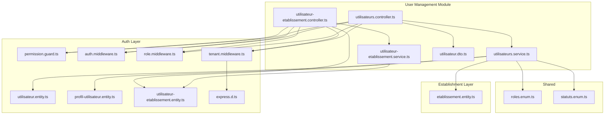
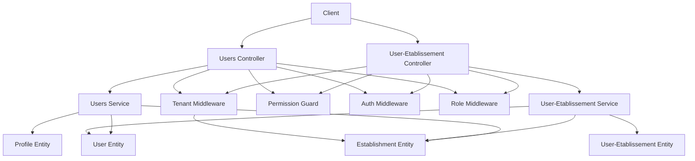
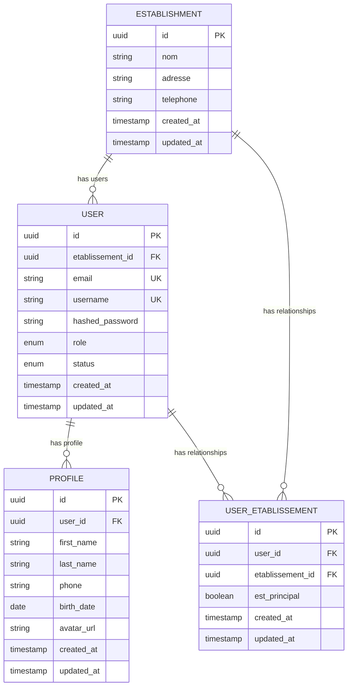
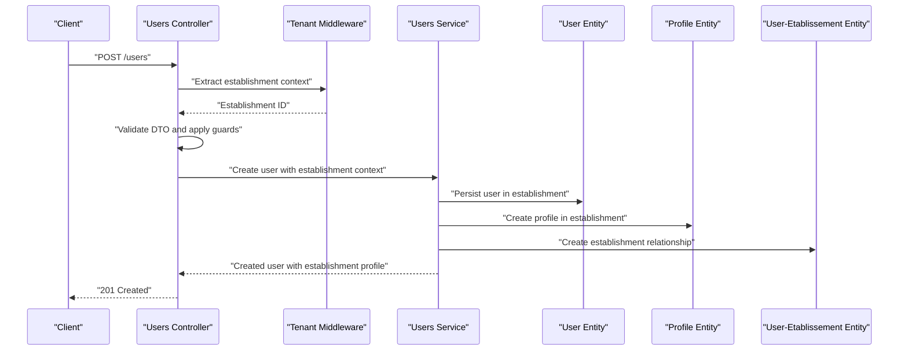
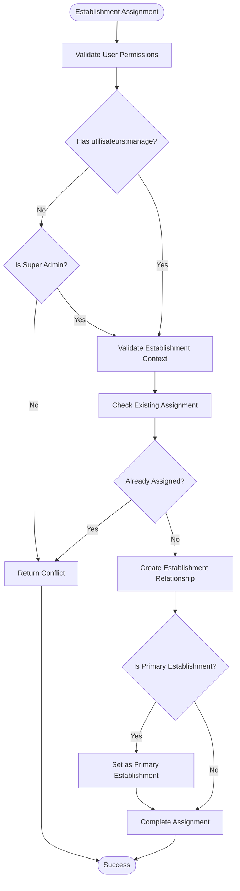
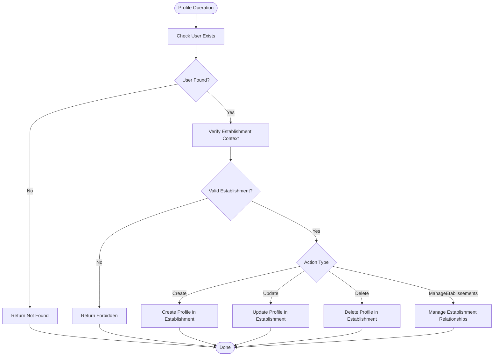
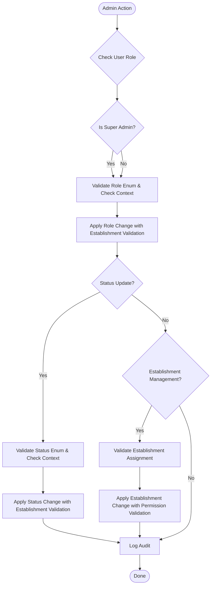
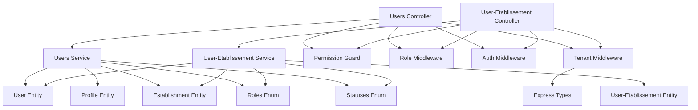

# User Management API

<cite>
**Referenced Files in This Document**
- [utilisateurs.controller.ts](file://backend/src/modules/utilisateurs/controllers/utilisateurs.controller.ts)
- [utilisateurs.service.ts](file://backend/src/modules/utilisateurs/services/utilisateurs.service.ts)
- [utilisateur.dto.ts](file://backend/src/modules/utilisateurs/dto/utilisateur.dto.ts)
- [utilisateur.entity.ts](file://backend/src/modules/auth/entities/utilisateur.entity.ts)
- [profil-utilisateur.entity.ts](file://backend/src/modules/auth/entities/profil-utilisateur.entity.ts)
- [etablissement.entity.ts](file://backend/src/modules/etablissement/entities/etablissement.entity.ts)
- [utilisateur-etablissement.controller.ts](file://backend/src/modules/auth/controllers/utilisateur-etablissement.controller.ts)
- [utilisateur-etablissement.entity.ts](file://backend/src/modules/auth/entities/utilisateur-etablissement.entity.ts)
- [utilisateur-etablissement.service.ts](file://backend/src/modules/auth/services/utilisateur-etablissement.service.ts)
- [roles.enum.ts](file://shared/src/enums/roles.enum.ts)
- [statuts.enum.ts](file://shared/src/enums/statuts.enum.ts)
- [permission.guard.ts](file://backend/src/modules/auth/guards/permission.guard.ts)
- [role.middleware.ts](file://backend/src/modules/auth/middlewares/role.middleware.ts)
- [auth.middleware.ts](file://backend/src/modules/auth/middlewares/auth.middleware.ts)
- [tenant.middleware.ts](file://backend/src/common/middlewares/tenant.middleware.ts)
- [express.d.ts](file://backend/src/common/types/express.d.ts)
</cite>

## Update Summary
**Changes Made**
- Added new multi-établissements (multi-establishment) user management endpoints
- Enhanced RBAC user management APIs with establishment-specific operations
- Introduced dedicated controller for utilisateur-etablissement management
- Added establishment assignment, removal, and primary establishment setting capabilities
- Expanded user management with establishment-aware role assignments and status updates

## Table of Contents
1. [Introduction](#introduction)
2. [Project Structure](#project-structure)
3. [Core Components](#core-components)
4. [Architecture Overview](#architecture-overview)
5. [Establishment and Multi-Tenant Context](#establishment-and-multi-tenant-context)
6. [Multi-Etablissements User Management](#multi-etablissements-user-management)
7. [Enhanced RBAC User Management APIs](#enhanced-rbac-user-management-apis)
8. [Detailed Component Analysis](#detailed-component-analysis)
9. [Dependency Analysis](#dependency-analysis)
10. [Performance Considerations](#performance-considerations)
11. [Troubleshooting Guide](#troubleshooting-guide)
12. [Conclusion](#conclusion)

## Introduction
This document provides comprehensive API documentation for the User Management module with enhanced establishment relationships, multi-établissements (multi-establishment) capabilities, and expanded RBAC user management APIs. The system now supports users being associated with multiple establishments while maintaining flexible establishment-specific access control. This enables sophisticated multi-tenant environments where users can be managed across various establishments with granular permissions and establishment-specific role assignments.

## Project Structure
The User Management module now operates within an advanced multi-tenant architecture with comprehensive establishment relationship management:
- Controllers: Expose HTTP endpoints with establishment-aware filtering, multi-establishment operations, and delegation to services
- Services: Implement business logic with establishment context, orchestrate data access, and manage establishment relationships
- DTOs: Define request/response schemas with establishment-specific validation constraints and multi-establishment workflows
- Entities: Represent persisted data models for users, profiles, establishments, and establishment-user relationships
- Guards and Middlewares: Enforce authentication, authorization, establishment-based access control, and multi-establishment permissions

**Diagram sources**
- [utilisateurs.controller.ts](file://backend/src/modules/utilisateurs/controllers/utilisateurs.controller.ts)
- [utilisateur-etablissement.controller.ts](file://backend/src/modules/auth/controllers/utilisateur-etablissement.controller.ts)
- [utilisateurs.service.ts](file://backend/src/modules/utilisateurs/services/utilisateurs.service.ts)
- [utilisateur-etablissement.service.ts](file://backend/src/modules/auth/services/utilisateur-etablissement.service.ts)
- [utilisateur.dto.ts](file://backend/src/modules/utilisateurs/dto/utilisateur.dto.ts)
- [utilisateur.entity.ts](file://backend/src/modules/auth/entities/utilisateur.entity.ts)
- [profil-utilisateur.entity.ts](file://backend/src/modules/auth/entities/profil-utilisateur.entity.ts)
- [utilisateur-etablissement.entity.ts](file://backend/src/modules/auth/entities/utilisateur-etablissement.entity.ts)
- [etablissement.entity.ts](file://backend/src/modules/etablissement/entities/etablissement.entity.ts)
- [permission.guard.ts](file://backend/src/modules/auth/guards/permission.guard.ts)
- [auth.middleware.ts](file://backend/src/modules/auth/middlewares/auth.middleware.ts)
- [role.middleware.ts](file://backend/src/modules/auth/middlewares/role.middleware.ts)
- [tenant.middleware.ts](file://backend/src/common/middlewares/tenant.middleware.ts)
- [express.d.ts](file://backend/src/common/types/express.d.ts)
- [roles.enum.ts](file://shared/src/enums/roles.enum.ts)
- [statuts.enum.ts](file://shared/src/enums/statuts.enum.ts)

**Section sources**
- [utilisateurs.controller.ts](file://backend/src/modules/utilisateurs/controllers/utilisateurs.controller.ts)
- [utilisateur-etablissement.controller.ts](file://backend/src/modules/auth/controllers/utilisateur-etablissement.controller.ts)
- [utilisateurs.service.ts](file://backend/src/modules/utilisateurs/services/utilisateurs.service.ts)
- [utilisateur-etablissement.service.ts](file://backend/src/modules/auth/services/utilisateur-etablissement.service.ts)
- [utilisateur.dto.ts](file://backend/src/modules/utilisateurs/dto/utilisateur.dto.ts)
- [utilisateur.entity.ts](file://backend/src/modules/auth/entities/utilisateur.entity.ts)
- [profil-utilisateur.entity.ts](file://backend/src/modules/auth/entities/profil-utilisateur.entity.ts)
- [utilisateur-etablissement.entity.ts](file://backend/src/modules/auth/entities/utilisateur-etablissement.entity.ts)
- [etablissement.entity.ts](file://backend/src/modules/etablissement/entities/etablissement.entity.ts)
- [roles.enum.ts](file://shared/src/enums/roles.enum.ts)
- [statuts.enum.ts](file://shared/src/enums/statuts.enum.ts)
- [permission.guard.ts](file://backend/src/modules/auth/guards/permission.guard.ts)
- [auth.middleware.ts](file://backend/src/modules/auth/middlewares/auth.middleware.ts)
- [role.middleware.ts](file://backend/src/modules/auth/middlewares/role.middleware.ts)
- [tenant.middleware.ts](file://backend/src/common/middlewares/tenant.middleware.ts)
- [express.d.ts](file://backend/src/common/types/express.d.ts)

## Core Components
- **Controller**: Defines HTTP endpoints for user management with establishment-aware filtering, multi-establishment operations, and delegation to the service layer
- **Service**: Implements business logic for user CRUD, profile operations, role assignment, status updates, establishment-specific search/filtering, and multi-establishment management
- **DTO**: Specifies request/response schemas with establishment validation rules for user creation, update, search operations, and establishment relationship management
- **Entities**: Persisted models for users, profiles, establishments, and establishment-user relationships, including relationships and establishment-based constraints
- **Guards/Middlewares**: Enforce authentication, role-based authorization, establishment-based access control, and multi-establishment permission validation

Key responsibilities with establishment context:
- **User CRUD with establishment associations**: Create, retrieve, update, delete users within specific establishments
- **Profile management**: Link and manage profile records per user with establishment context
- **Role assignments**: Assign and validate roles via middleware and guard with establishment boundaries
- **Status updates**: Toggle user activity status using status enums within establishment context
- **Search and filtering**: Filter users by criteria including establishment ID, role, status, and name/email
- **Multi-tenant access control**: Enforce establishment-based isolation with flexible admin capabilities
- **Multi-establishment management**: Handle establishment assignment, removal, and primary establishment setting
- **Establishment-aware RBAC**: Manage role assignments across multiple establishments with proper authorization

**Section sources**
- [utilisateurs.controller.ts](file://backend/src/modules/utilisateurs/controllers/utilisateurs.controller.ts)
- [utilisateur-etablissement.controller.ts](file://backend/src/modules/auth/controllers/utilisateur-etablissement.controller.ts)
- [utilisateurs.service.ts](file://backend/src/modules/utilisateurs/services/utilisateurs.service.ts)
- [utilisateur-etablissement.service.ts](file://backend/src/modules/auth/services/utilisateur-etablissement.service.ts)
- [utilisateur.dto.ts](file://backend/src/modules/utilisateurs/dto/utilisateur.dto.ts)
- [utilisateur.entity.ts](file://backend/src/modules/auth/entities/utilisateur.entity.ts)
- [profil-utilisateur.entity.ts](file://backend/src/modules/auth/entities/profil-utilisateur.entity.ts)
- [utilisateur-etablissement.entity.ts](file://backend/src/modules/auth/entities/utilisateur-etablissement.entity.ts)
- [etablissement.entity.ts](file://backend/src/modules/etablissement/entities/etablissement.entity.ts)
- [roles.enum.ts](file://shared/src/enums/roles.enum.ts)
- [statuts.enum.ts](file://shared/src/enums/statuts.enum.ts)
- [permission.guard.ts](file://backend/src/modules/auth/guards/permission.guard.ts)
- [auth.middleware.ts](file://backend/src/modules/auth/middlewares/auth.middleware.ts)
- [role.middleware.ts](file://backend/src/modules/auth/middlewares/role.middleware.ts)
- [tenant.middleware.ts](file://backend/src/common/middlewares/tenant.middleware.ts)

## Architecture Overview
The User Management module now follows an advanced multi-tenant layered architecture with comprehensive establishment relationship management:
- **Presentation**: Controllers expose endpoints with establishment-aware filtering and multi-establishment operations
- **Application**: Services encapsulate business rules with establishment context and orchestrate complex establishment relationships
- **Domain/Data**: Entities represent persisted data, relationships, establishment boundaries, and establishment-user associations
- **Security**: Guards, middlewares, and tenant middleware enforce authentication, authorization, establishment-based access control, and multi-establishment permissions

**Diagram sources**
- [utilisateurs.controller.ts](file://backend/src/modules/utilisateurs/controllers/utilisateurs.controller.ts)
- [utilisateur-etablissement.controller.ts](file://backend/src/modules/auth/controllers/utilisateur-etablissement.controller.ts)
- [utilisateurs.service.ts](file://backend/src/modules/utilisateurs/services/utilisateurs.service.ts)
- [utilisateur-etablissement.service.ts](file://backend/src/modules/auth/services/utilisateur-etablissement.service.ts)
- [permission.guard.ts](file://backend/src/modules/auth/guards/permission.guard.ts)
- [auth.middleware.ts](file://backend/src/modules/auth/middlewares/auth.middleware.ts)
- [role.middleware.ts](file://backend/src/modules/auth/middlewares/role.middleware.ts)
- [tenant.middleware.ts](file://backend/src/common/middlewares/tenant.middleware.ts)
- [utilisateur.entity.ts](file://backend/src/modules/auth/entities/utilisateur.entity.ts)
- [profil-utilisateur.entity.ts](file://backend/src/modules/auth/entities/profil-utilisateur.entity.ts)
- [utilisateur-etablissement.entity.ts](file://backend/src/modules/auth/entities/utilisateur-etablissement.entity.ts)
- [etablissement.entity.ts](file://backend/src/modules/etablissement/entities/etablissement.entity.ts)

## Establishment and Multi-Tenant Context

### Multi-Tenant Architecture
The system now implements an advanced multi-tenant architecture where:
- Each user can be associated with multiple establishments through the `utilisateur-etablissement` relationship table
- Tenant middleware automatically extracts establishment context from authenticated user tokens
- Super administrators can access multiple establishments, while regular users are restricted to their establishment relationships
- Establishment relationships support primary establishment designation for seamless multi-establishment operations

### Establishment Relationships
Enhanced relationships enable sophisticated multi-establishment management:
- **User-Etablissement Relationship**: Many-to-many relationship with establishment-user associations
- **Primary Establishment**: Designated establishment for user operations and context
- **Establishment-Aware Operations**: All operations respect establishment boundaries unless overridden by super administrators
- **Multi-Etablissement Filtering**: Users can be filtered and searched across their establishment relationships

### Tenant Middleware Functionality
The tenant middleware provides comprehensive establishment context management:
- Automatic establishment ID extraction from user JWT claims
- Super administrator bypass for multi-establishment access
- Establishment relationship validation for multi-establishment operations
- Optional tenant middleware for non-critical operations
- Establishment ID injection into request context for downstream processing

**Section sources**
- [tenant.middleware.ts](file://backend/src/common/middlewares/tenant.middleware.ts)
- [utilisateur.entity.ts](file://backend/src/modules/auth/entities/utilisateur.entity.ts)
- [utilisateur-etablissement.entity.ts](file://backend/src/modules/auth/entities/utilisateur-etablissement.entity.ts)
- [etablissement.entity.ts](file://backend/src/modules/etablissement/entities/etablissement.entity.ts)
- [express.d.ts](file://backend/src/common/types/express.d.ts)

## Multi-Etablissements User Management

### Establishment Assignment Operations
The system now supports comprehensive establishment assignment management through dedicated endpoints:

#### Add Establishment to User
- **Endpoint**: `POST /api/utilisateurs/:id/etablissements`
- **Description**: Add an establishment to a user's establishment relationships
- **Authentication**: Requires authentication
- **Authorization**: Requires `utilisateurs:manage` permission or SUPER_ADMIN role
- **Request Body**: Establishment assignment DTO with user ID and establishment ID
- **Response**: Created establishment assignment with success message

#### Remove Establishment from User
- **Endpoint**: `DELETE /api/utilisateurs/:id/etablissements/:etablissementId`
- **Description**: Remove an establishment from a user's establishment relationships (logical deactivation)
- **Authentication**: Requires authentication
- **Authorization**: Requires `utilisateurs:manage` permission or SUPER_ADMIN role
- **Path Parameters**: User ID and establishment ID
- **Response**: Success message indicating establishment removal

#### Set Primary Establishment
- **Endpoint**: `PATCH /api/utilisateurs/:id/etablissements/:etablissementId/principal`
- **Description**: Set a specific establishment as the user's primary establishment
- **Authentication**: Requires authentication
- **Authorization**: Requires `utilisateurs:manage` permission or SUPER_ADMIN role
- **Path Parameters**: User ID and establishment ID
- **Response**: Success message indicating primary establishment setting

### Establishment Listing and Management
Users can view and manage their establishment relationships:

#### List User Establishments
- **Endpoint**: `GET /api/utilisateurs/:id/etablissements`
- **Description**: List all establishments associated with a user
- **Authentication**: Requires authentication
- **Authorization**: Requires `utilisateurs:read` permission or user self-access
- **Path Parameters**: User ID
- **Response**: Array of establishment relationships with establishment details

### Establishment Management Workflows
Multi-establishment operations follow established security patterns:
- **Permission Validation**: All establishment operations require proper authorization
- **Establishment Context**: Operations respect establishment boundaries unless overridden
- **Primary Establishment Logic**: Ensures only one primary establishment per user
- **Relationship Integrity**: Maintains referential integrity across establishment relationships

**Section sources**
- [utilisateur-etablissement.controller.ts](file://backend/src/modules/auth/controllers/utilisateur-etablissement.controller.ts)
- [utilisateur-etablissement.service.ts](file://backend/src/modules/auth/services/utilisateur-etablissement.service.ts)
- [utilisateur-etablissement.entity.ts](file://backend/src/modules/auth/entities/utilisateur-etablissement.entity.ts)

## Enhanced RBAC User Management APIs

### Advanced Role-Based Access Control
The system now provides enhanced RBAC capabilities with establishment awareness:

#### Establishment-Aware Role Management
- **Role Assignment**: Roles can be assigned within specific establishment contexts
- **Permission Inheritance**: Permissions cascade through establishment relationships
- **Hierarchical Access Control**: Super administrators can override establishment boundaries
- **Multi-Etablissement Permissions**: Users with access to multiple establishments inherit appropriate permissions

#### Enhanced Permission System
- **utilisateurs:manage**: Full management permissions across established boundaries
- **utilisateurs:read**: Read-only access to user information within establishment context
- **Establishment-Specific Permissions**: Permissions tailored to individual establishment relationships
- **Role-Based Authorization**: Complex authorization matrices supporting multi-establishment scenarios

### RBAC Integration Patterns
Enhanced integration with existing RBAC infrastructure:
- **Permission Guard Enhancement**: Extended to handle establishment-aware permission validation
- **Role Middleware Updates**: Updated to support establishment-specific role hierarchies
- **Service Layer Integration**: Services now handle establishment-aware role assignments
- **Entity Relationship Support**: Establishment relationships integrate seamlessly with RBAC systems

**Section sources**
- [utilisateur-etablissement.controller.ts](file://backend/src/modules/auth/controllers/utilisateur-etablissement.controller.ts)
- [utilisateur-etablissement.service.ts](file://backend/src/modules/auth/services/utilisateur-etablissement.service.ts)
- [permission.guard.ts](file://backend/src/modules/auth/guards/permission.guard.ts)
- [role.middleware.ts](file://backend/src/modules/auth/middlewares/role.middleware.ts)
- [roles.enum.ts](file://shared/src/enums/roles.enum.ts)

## Detailed Component Analysis

### Users Controller Endpoints with Establishment Context
The controller defines HTTP endpoints for user management with comprehensive establishment awareness. Each endpoint specifies method, path, guards, establishment filtering, and response behavior.

- **GET /users**
  - Description: Retrieve paginated and filtered list of users with establishment filtering
  - Authentication: Requires authentication
  - Authorization: Requires specific permissions
  - Query parameters: Supports filtering by role, status, establishment ID, and search terms; pagination controls
  - Establishment context: Automatically filters results to user's establishment unless admin overrides
  - Response: Array of user summaries with establishment metadata

- **GET /users/:id**
  - Description: Retrieve a single user by ID with establishment verification
  - Authentication: Requires authentication
  - Authorization: Requires specific permissions
  - Path parameters: id (user identifier)
  - Establishment context: Verifies user belongs to requester's establishment
  - Response: Full user record including profile and establishment information

- **POST /users**
  - Description: Create a new user within establishment context
  - Authentication: Requires authentication
  - Authorization: Requires specific permissions
  - Request body: User creation DTO with establishment validation rules
  - Establishment context: Creates user in requester's establishment or specified establishment for admins
  - Response: Created user record with establishment association

- **PUT /users/:id**
  - Description: Update an existing user by ID with establishment verification
  - Authentication: Requires authentication
  - Authorization: Requires specific permissions
  - Path parameters: id (user identifier)
  - Request body: Partial user update DTO with establishment validation rules
  - Establishment context: Verifies user belongs to requester's establishment
  - Response: Updated user record with establishment context

- **DELETE /users/:id**
  - Description: Delete a user by ID with establishment verification
  - Authentication: Requires authentication
  - Authorization: Requires specific permissions
  - Path parameters: id (user identifier)
  - Establishment context: Verifies user belongs to requester's establishment
  - Response: Deletion confirmation

- **PATCH /users/:id/status**
  - Description: Update user status (active/inactive) within establishment context
  - Authentication: Requires authentication
  - Authorization: Requires specific permissions
  - Path parameters: id (user identifier)
  - Request body: Status update DTO using status enumeration
  - Establishment context: Verifies user belongs to requester's establishment
  - Response: Updated user record with new status and establishment context

- **PATCH /users/:id/role**
  - Description: Assign or change user role within establishment context
  - Authentication: Requires authentication
  - Authorization: Requires specific permissions
  - Path parameters: id (user identifier)
  - Request body: Role assignment DTO using role enumeration
  - Establishment context: Verifies user belongs to requester's establishment
  - Response: Updated user record with new role and establishment context

**Updated** Enhanced with establishment context and multi-tenant filtering capabilities

**Section sources**
- [utilisateurs.controller.ts](file://backend/src/modules/utilisateurs/controllers/utilisateurs.controller.ts)
- [utilisateur.dto.ts](file://backend/src/modules/utilisateurs/dto/utilisateur.dto.ts)
- [tenant.middleware.ts](file://backend/src/common/middlewares/tenant.middleware.ts)

### Multi-Etablissements Controller Endpoints
The new utilisateur-etablissement controller provides comprehensive establishment relationship management:

#### Establishment Assignment Endpoints
- **POST /api/utilisateurs/:id/etablissements**
  - Description: Add an establishment to a user's establishment relationships
  - Authentication: Requires authentication
  - Authorization: Requires `utilisateurs:manage` permission or SUPER_ADMIN role
  - Path parameters: id (user identifier)
  - Request body: Establishment assignment DTO with establishment ID
  - Response: Created establishment assignment with success message

- **DELETE /api/utilisateurs/:id/etablissements/:etablissementId**
  - Description: Remove an establishment from user's establishment relationships
  - Authentication: Requires authentication
  - Authorization: Requires `utilisateurs:manage` permission or SUPER_ADMIN role
  - Path parameters: id (user identifier), etablissementId (establishment identifier)
  - Response: Success message indicating establishment removal

- **PATCH /api/utilisateurs/:id/etablissements/:etablissementId/principal**
  - Description: Set establishment as user's primary establishment
  - Authentication: Requires authentication
  - Authorization: Requires `utilisateurs:manage` permission or SUPER_ADMIN role
  - Path parameters: id (user identifier), etablissementId (establishment identifier)
  - Response: Success message indicating primary establishment setting

#### Establishment Listing Endpoint
- **GET /api/utilisateurs/:id/etablissements**
  - Description: List all establishments associated with a user
  - Authentication: Requires authentication
  - Authorization: Requires `utilisateurs:read` permission or user self-access
  - Path parameters: id (user identifier)
  - Response: Array of establishment relationships with establishment details

**Section sources**
- [utilisateur-etablissement.controller.ts](file://backend/src/modules/auth/controllers/utilisateur-etablissement.controller.ts)

### Users Service Operations with Establishment Context
The service layer implements core business logic with comprehensive establishment awareness:
- Find users with pagination, filters, and establishment-specific queries (by role, status, establishment ID, search term)
- Load a user by ID with profile details and establishment verification
- Create a new user with establishment validation and persistence
- Update an existing user with establishment context and validation
- Delete a user by ID with establishment verification
- Update user status using status enumeration within establishment context
- Assign/update user role using role enumeration with establishment boundaries
- **NEW**: Manage establishment relationships including assignment, removal, and primary establishment setting
- **NEW**: Handle multi-establishment user operations with establishment-aware validation

Operational notes with establishment context:
- All operations respect establishment boundaries except for super administrators
- Establishment ID is automatically extracted from tenant middleware for non-admin users
- Admin users can override establishment context for multi-establishment operations
- Profile linkage maintains establishment relationships through entity constraints
- **NEW**: Establishment relationships support primary establishment designation
- **NEW**: Multi-establishment operations maintain referential integrity across relationships

**Updated** Enhanced with establishment-based access control, multi-tenant operations, and comprehensive establishment relationship management

**Section sources**
- [utilisateurs.service.ts](file://backend/src/modules/utilisateurs/services/utilisateurs.service.ts)
- [utilisateur-etablissement.service.ts](file://backend/src/modules/auth/services/utilisateur-etablissement.service.ts)
- [utilisateur.entity.ts](file://backend/src/modules/auth/entities/utilisateur.entity.ts)
- [profil-utilisateur.entity.ts](file://backend/src/modules/auth/entities/profil-utilisateur.entity.ts)
- [utilisateur-etablissement.entity.ts](file://backend/src/modules/auth/entities/utilisateur-etablissement.entity.ts)
- [etablissement.entity.ts](file://backend/src/modules/etablissement/entities/etablissement.entity.ts)
- [roles.enum.ts](file://shared/src/enums/roles.enum.ts)
- [statuts.enum.ts](file://shared/src/enums/statuts.enum.ts)
- [tenant.middleware.ts](file://backend/src/common/middlewares/tenant.middleware.ts)

### DTO Schemas and Validation with Establishment Context
The DTO layer defines request/response schemas with comprehensive establishment validation:
- User Creation DTO: Fields for personal information, credentials, role assignment, and establishment validation with required/optional constraints
- User Update DTO: Partial fields for updates with establishment validation rules
- User Search DTO: Filters for role, status, establishment ID, and search text; pagination parameters with establishment context
- Status Update DTO: Single field constrained to status enumeration
- Role Assignment DTO: Single field constrained to role enumeration
- **NEW**: Establishment Assignment DTO: User ID and establishment ID with validation rules
- **NEW**: Establishment Removal DTO: Establishment ID validation for removal operations
- **NEW**: Primary Establishment DTO: Establishment ID validation for primary establishment setting

Validation ensures establishment context:
- Required fields are present during creation
- Field formats meet business requirements
- Enumerated values are valid
- Establishment ID validation for multi-establishment operations
- Access control validation for establishment boundaries
- **NEW**: Establishment relationship validation for assignment operations
- **NEW**: Primary establishment validation to prevent duplicate primary establishments

**Updated** Enhanced with establishment-specific validation, multi-tenant constraints, and comprehensive establishment relationship management

**Section sources**
- [utilisateur.dto.ts](file://backend/src/modules/utilisateurs/dto/utilisateur.dto.ts)

### Entities and Relationships with Establishments
The User, Profile, Establishment, and User-Etablissement entities define the comprehensive data model:
- User entity: Contains user identity, credentials, status, role, establishment ID, and timestamps
- Profile entity: Contains profile details linked to a user with establishment relationships
- Establishment entity: Contains establishment information with user associations
- **NEW**: User-Etablissement entity: Manages many-to-many relationships between users and establishments with primary establishment flag
- Relationships: One-to-many between establishment and users, one-to-one between user and profile, many-to-many between user and establishment through relationship table

**Updated** Added establishment entity, user-etablissement relationship, and enhanced relationships

**Diagram sources**
- [etablissement.entity.ts](file://backend/src/modules/etablissement/entities/etablissement.entity.ts)
- [utilisateur.entity.ts](file://backend/src/modules/auth/entities/utilisateur.entity.ts)
- [profil-utilisateur.entity.ts](file://backend/src/modules/auth/entities/profil-utilisateur.entity.ts)
- [utilisateur-etablissement.entity.ts](file://backend/src/modules/auth/entities/utilisateur-etablissement.entity.ts)

**Section sources**
- [utilisateur.entity.ts](file://backend/src/modules/auth/entities/utilisateur.entity.ts)
- [profil-utilisateur.entity.ts](file://backend/src/modules/auth/entities/profil-utilisateur.entity.ts)
- [utilisateur-etablissement.entity.ts](file://backend/src/modules/auth/entities/utilisateur-etablissement.entity.ts)
- [etablissement.entity.ts](file://backend/src/modules/etablissement/entities/etablissement.entity.ts)

### Role-Based Access Control with Establishment Context
Access control is enforced via comprehensive security mechanisms:
- Permission Guard: Validates user permissions for protected routes with establishment awareness
- Role Middleware: Ensures caller has required role(s) for sensitive operations with establishment boundaries
- Auth Middleware: Ensures requests are authenticated
- Tenant Middleware: Extracts establishment context from user tokens and enforces multi-tenant access control
- **NEW**: Establishment-aware permission validation for multi-establishment operations

Authorization matrix with establishment context:
- Read operations: Require authentication, appropriate permissions, and establishment verification
- Write operations: Require higher-level permissions, role alignment, and establishment boundaries
- Role/Status updates: Require elevated permissions aligned with role hierarchy and establishment context
- Multi-establishment access: Super administrators can override establishment boundaries
- **NEW**: Establishment assignment operations: Require `utilisateurs:manage` permission or SUPER_ADMIN role
- **NEW**: Establishment relationship management: Comprehensive permission validation across establishment boundaries

**Updated** Enhanced with establishment-based access control, multi-tenant security, and comprehensive establishment relationship management

**Section sources**
- [utilisateur-etablissement.controller.ts](file://backend/src/modules/auth/controllers/utilisateur-etablissement.controller.ts)
- [permission.guard.ts](file://backend/src/modules/auth/guards/permission.guard.ts)
- [role.middleware.ts](file://backend/src/modules/auth/middlewares/role.middleware.ts)
- [auth.middleware.ts](file://backend/src/modules/auth/middlewares/auth.middleware.ts)
- [tenant.middleware.ts](file://backend/src/common/middlewares/tenant.middleware.ts)
- [roles.enum.ts](file://shared/src/enums/roles.enum.ts)

### User Creation Workflow with Establishment Context
Comprehensive end-to-end flow for creating a user with establishment association:
1. Client sends a request to POST /users with a valid creation DTO including establishment context
2. Controller validates request, applies guards/middlewares, and processes establishment validation
3. Service validates DTO, checks uniqueness constraints, verifies establishment access, and persists the user
4. Service optionally creates or links a profile record within the established establishment context
5. **NEW**: Service handles establishment relationship creation for multi-establishment scenarios
6. Controller returns the created user with establishment details and profile information

**Updated** Enhanced with establishment context, multi-tenant validation, and comprehensive establishment relationship management

**Diagram sources**
- [utilisateurs.controller.ts](file://backend/src/modules/utilisateurs/controllers/utilisateurs.controller.ts)
- [tenant.middleware.ts](file://backend/src/common/middlewares/tenant.middleware.ts)
- [utilisateurs.service.ts](file://backend/src/modules/utilisateurs/services/utilisateurs.service.ts)
- [utilisateur.entity.ts](file://backend/src/modules/auth/entities/utilisateur.entity.ts)
- [profil-utilisateur.entity.ts](file://backend/src/modules/auth/entities/profil-utilisateur.entity.ts)
- [utilisateur-etablissement.entity.ts](file://backend/src/modules/auth/entities/utilisateur-etablissement.entity.ts)

### Multi-Etablissements Management Flow
Enhanced establishment relationship management with comprehensive validation:
1. **Establishment Assignment**: Client sends POST request to assign establishment to user
2. **Permission Validation**: Controller validates `utilisateurs:manage` permission or SUPER_ADMIN role
3. **Establishment Context**: Tenant middleware ensures proper establishment boundaries
4. **Service Processing**: Service validates establishment assignment, checks existing relationships
5. **Primary Establishment Logic**: Handles primary establishment designation if needed
6. **Relationship Persistence**: Creates establishment-user relationship with proper validation
7. **Response**: Returns success message with establishment assignment details

**Updated** Enhanced with establishment context, comprehensive permission validation, and multi-establishment relationship management

**Diagram sources**
- [utilisateur-etablissement.controller.ts](file://backend/src/modules/auth/controllers/utilisateur-etablissement.controller.ts)
- [utilisateur-etablissement.service.ts](file://backend/src/modules/auth/services/utilisateur-etablissement.service.ts)
- [utilisateur-etablissement.entity.ts](file://backend/src/modules/auth/entities/utilisateur-etablissement.entity.ts)
- [tenant.middleware.ts](file://backend/src/common/middlewares/tenant.middleware.ts)

### Profile Management Flow with Establishment Context
Profile operations now include comprehensive establishment-aware management:
- Creating a profile during user registration within establishment context
- Updating profile details via PATCH endpoints with establishment verification
- Linking/unlinking profiles to users respecting establishment boundaries
- Establishing profile-user relationships within the same establishment
- **NEW**: Managing establishment relationships during profile operations

**Updated** Enhanced with establishment context, multi-tenant validation, and comprehensive establishment relationship management

**Diagram sources**
- [utilisateurs.service.ts](file://backend/src/modules/utilisateurs/services/utilisateurs.service.ts)
- [utilisateur-etablissement.service.ts](file://backend/src/modules/auth/services/utilisateur-etablissement.service.ts)
- [utilisateur.entity.ts](file://backend/src/modules/auth/entities/utilisateur.entity.ts)
- [profil-utilisateur.entity.ts](file://backend/src/modules/auth/entities/profil-utilisateur.entity.ts)
- [utilisateur-etablissement.entity.ts](file://backend/src/modules/auth/entities/utilisateur-etablissement.entity.ts)
- [tenant.middleware.ts](file://backend/src/common/middlewares/tenant.middleware.ts)

### Role Assignment and Status Update Flows with Establishment Context
Enhanced role assignment and status updates with comprehensive establishment validation:
- Role assignment: Validates against role enumeration, applies role middleware, and respects establishment boundaries
- Status update: Validates against status enumeration, applies permission guard, and maintains establishment context
- Multi-establishment operations: Super administrators can override establishment restrictions
- **NEW**: Establishment-aware role assignments with proper permission validation
- **NEW**: Multi-establishment role management with establishment boundary enforcement

**Updated** Enhanced with establishment validation, multi-tenant access control, and comprehensive establishment relationship management

**Diagram sources**
- [utilisateurs.service.ts](file://backend/src/modules/utilisateurs/services/utilisateurs.service.ts)
- [utilisateur-etablissement.service.ts](file://backend/src/modules/auth/services/utilisateur-etablissement.service.ts)
- [roles.enum.ts](file://shared/src/enums/roles.enum.ts)
- [statuts.enum.ts](file://shared/src/enums/statuts.enum.ts)
- [permission.guard.ts](file://backend/src/modules/auth/guards/permission.guard.ts)
- [role.middleware.ts](file://backend/src/modules/auth/middlewares/role.middleware.ts)
- [tenant.middleware.ts](file://backend/src/common/middlewares/tenant.middleware.ts)

## Dependency Analysis
The User Management module now depends on comprehensive multi-tenant infrastructure with establishment relationship management:
- Shared enumerations for roles and statuses
- Auth entities for user and profile persistence with establishment relationships
- Establishment entity for multi-tenant data isolation
- **NEW**: User-Etablissement entity for managing establishment relationships
- Enhanced guards and middlewares for security enforcement with establishment context
- Tenant middleware for automatic establishment context extraction
- **NEW**: Establishment-aware permission validation and role management

**Updated** Enhanced with establishment entity, user-etablissement relationship, and comprehensive establishment relationship management

**Diagram sources**
- [utilisateurs.controller.ts](file://backend/src/modules/utilisateurs/controllers/utilisateurs.controller.ts)
- [utilisateur-etablissement.controller.ts](file://backend/src/modules/auth/controllers/utilisateur-etablissement.controller.ts)
- [utilisateurs.service.ts](file://backend/src/modules/utilisateurs/services/utilisateurs.service.ts)
- [utilisateur-etablissement.service.ts](file://backend/src/modules/auth/services/utilisateur-etablissement.service.ts)
- [utilisateur.entity.ts](file://backend/src/modules/auth/entities/utilisateur.entity.ts)
- [profil-utilisateur.entity.ts](file://backend/src/modules/auth/entities/profil-utilisateur.entity.ts)
- [utilisateur-etablissement.entity.ts](file://backend/src/modules/auth/entities/utilisateur-etablissement.entity.ts)
- [etablissement.entity.ts](file://backend/src/modules/etablissement/entities/etablissement.entity.ts)
- [roles.enum.ts](file://shared/src/enums/roles.enum.ts)
- [statuts.enum.ts](file://shared/src/enums/statuts.enum.ts)
- [permission.guard.ts](file://backend/src/modules/auth/guards/permission.guard.ts)
- [role.middleware.ts](file://backend/src/modules/auth/middlewares/role.middleware.ts)
- [auth.middleware.ts](file://backend/src/modules/auth/middlewares/auth.middleware.ts)
- [tenant.middleware.ts](file://backend/src/common/middlewares/tenant.middleware.ts)
- [express.d.ts](file://backend/src/common/types/express.d.ts)

**Section sources**
- [utilisateurs.controller.ts](file://backend/src/modules/utilisateurs/controllers/utilisateurs.controller.ts)
- [utilisateur-etablissement.controller.ts](file://backend/src/modules/auth/controllers/utilisateur-etablissement.controller.ts)
- [utilisateurs.service.ts](file://backend/src/modules/utilisateurs/services/utilisateurs.service.ts)
- [utilisateur-etablissement.service.ts](file://backend/src/modules/auth/services/utilisateur-etablissement.service.ts)
- [utilisateur.entity.ts](file://backend/src/modules/auth/entities/utilisateur.entity.ts)
- [profil-utilisateur.entity.ts](file://backend/src/modules/auth/entities/profil-utilisateur.entity.ts)
- [utilisateur-etablissement.entity.ts](file://backend/src/modules/auth/entities/utilisateur-etablissement.entity.ts)
- [etablissement.entity.ts](file://backend/src/modules/etablissement/entities/etablissement.entity.ts)
- [roles.enum.ts](file://shared/src/enums/roles.enum.ts)
- [statuts.enum.ts](file://shared/src/enums/statuts.enum.ts)
- [permission.guard.ts](file://backend/src/modules/auth/guards/permission.guard.ts)
- [role.middleware.ts](file://backend/src/modules/auth/middlewares/role.middleware.ts)
- [auth.middleware.ts](file://backend/src/modules/auth/middlewares/auth.middleware.ts)
- [tenant.middleware.ts](file://backend/src/common/middlewares/tenant.middleware.ts)
- [express.d.ts](file://backend/src/common/types/express.d.ts)

## Performance Considerations
Enhanced performance considerations for advanced multi-tenant environment:
- Pagination: Use query parameters to limit result sets for list endpoints with establishment filtering
- Filtering: Apply establishment-aware filters server-side to reduce payload sizes and ensure data isolation
- Indexing: Ensure database indexes exist on frequently queried fields (email, role, status, etablissementId, user-etablissement relationships)
- Establishment caching: Cache establishment metadata for authenticated users to reduce database queries
- Multi-tenant optimization: Optimize queries with establishment ID predicates for better performance
- Tenant middleware efficiency: Minimize establishment context extraction overhead through efficient middleware design
- **NEW**: Establishment relationship caching: Cache user establishment relationships to reduce repeated queries
- **NEW**: Primary establishment optimization: Efficiently handle primary establishment queries and updates

**Updated** Enhanced with establishment-specific performance optimizations and comprehensive establishment relationship management

## Troubleshooting Guide
Enhanced troubleshooting guide for advanced multi-tenant environment:
- Authentication failures: Ensure requests include valid authentication tokens and pass auth middleware
- Authorization failures: Verify caller has required permissions and roles; check permission guard and role middleware configurations
- Establishment context errors: Verify tenant middleware is properly extracting establishment ID from user tokens
- Multi-establishment access issues: Check if super administrator privileges allow establishment ID override
- Validation errors: Confirm request bodies match DTO schemas, enum values are valid, and establishment context is properly specified
- Not found errors: Verify resource IDs exist and belong to the requesting user's establishment before performing updates or deletions
- Duplicate entries: Check uniqueness constraints on email and username within the specific establishment context
- Establishment boundary violations: Ensure operations respect establishment isolation except for authorized administrative overrides
- **NEW**: Establishment relationship conflicts: Verify user doesn't already have establishment relationship before assignment
- **NEW**: Primary establishment errors: Ensure only one primary establishment exists per user and validate establishment assignment
- **NEW**: Multi-establishment permission issues: Verify user has proper permissions for establishment-specific operations

**Updated** Enhanced with establishment context, multi-tenant troubleshooting scenarios, and comprehensive establishment relationship management

**Section sources**
- [utilisateurs.controller.ts](file://backend/src/modules/utilisateurs/controllers/utilisateurs.controller.ts)
- [utilisateur-etablissement.controller.ts](file://backend/src/modules/auth/controllers/utilisateur-etablissement.controller.ts)
- [utilisateurs.service.ts](file://backend/src/modules/utilisateurs/services/utilisateurs.service.ts)
- [utilisateur-etablissement.service.ts](file://backend/src/modules/auth/services/utilisateur-etablissement.service.ts)
- [permission.guard.ts](file://backend/src/modules/auth/guards/permission.guard.ts)
- [auth.middleware.ts](file://backend/src/modules/auth/middlewares/auth.middleware.ts)
- [role.middleware.ts](file://backend/src/modules/auth/middlewares/role.middleware.ts)
- [tenant.middleware.ts](file://backend/src/common/middlewares/tenant.middleware.ts)

## Conclusion
The enhanced User Management API provides a robust, secure, and extensible set of endpoints for managing users, profiles, roles, statuses, and establishment relationships within an advanced multi-tenant establishment context. The system now supports comprehensive establishment relationships with automatic tenant isolation while maintaining flexibility for administrative roles across multiple establishments. By leveraging enhanced DTOs, guards, middlewares, tenant middleware, and specialized establishment management controllers, the system enforces strong validation, access control, establishment-based data isolation, and sophisticated multi-establishment operations. The addition of utilisateur-etablissement management enables comprehensive establishment relationship handling, while enhanced RBAC APIs provide establishment-aware role assignments and permissions. Integrators can rely on clear schemas, consistent error handling, well-defined flows for common user management scenarios, comprehensive establishment-aware operations, and advanced multi-establishment management capabilities for modern, scalable multi-tenant applications.