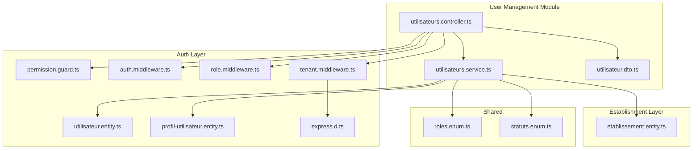
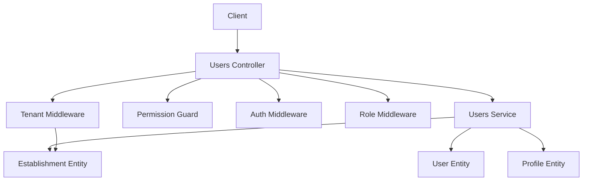
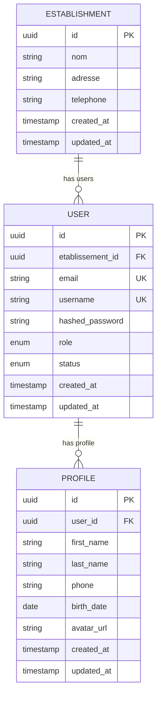
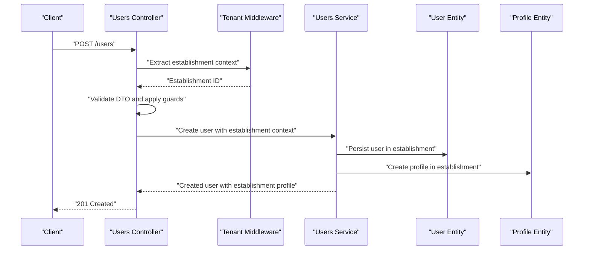
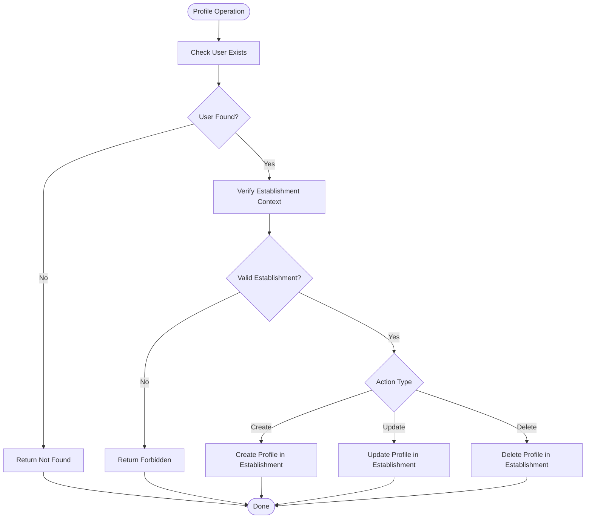
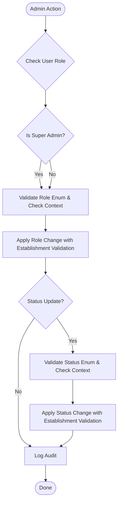
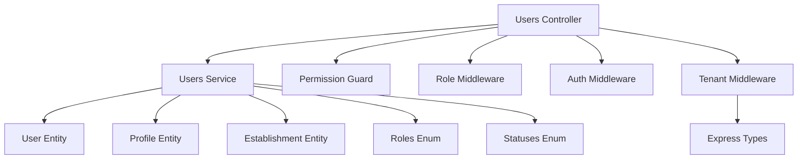

# User Management API

<cite>
**Referenced Files in This Document**
- [utilisateurs.controller.ts](file://backend/src/modules/utilisateurs/controllers/utilisateurs.controller.ts)
- [utilisateurs.service.ts](file://backend/src/modules/utilisateurs/services/utilisateurs.service.ts)
- [utilisateur.dto.ts](file://backend/src/modules/utilisateurs/dto/utilisateur.dto.ts)
- [utilisateur.entity.ts](file://backend/src/modules/auth/entities/utilisateur.entity.ts)
- [profil-utilisateur.entity.ts](file://backend/src/modules/auth/entities/profil-utilisateur.entity.ts)
- [etablissement.entity.ts](file://backend/src/modules/etablissement/entities/etablissement.entity.ts)
- [roles.enum.ts](file://shared/src/enums/roles.enum.ts)
- [statuts.enum.ts](file://shared/src/enums/statuts.enum.ts)
- [permission.guard.ts](file://backend/src/modules/auth/guards/permission.guard.ts)
- [role.middleware.ts](file://backend/src/modules/auth/middlewares/role.middleware.ts)
- [auth.middleware.ts](file://backend/src/modules/auth/middlewares/auth.middleware.ts)
- [tenant.middleware.ts](file://backend/src/common/middlewares/tenant.middleware.ts)
- [express.d.ts](file://backend/src/common/types/express.d.ts)
</cite>

## Update Summary
**Changes Made**
- Added establishment relationship support to user management API
- Integrated multi-tenant context with establishment-based access control
- Enhanced user search and filtering with establishment-specific queries
- Updated user creation and management workflows to include establishment associations
- Modified role-based access control to consider establishment boundaries

## Table of Contents
1. [Introduction](#introduction)
2. [Project Structure](#project-structure)
3. [Core Components](#core-components)
4. [Architecture Overview](#architecture-overview)
5. [Establishment and Multi-Tenant Context](#establishment-and-multi-tenant-context)
6. [Detailed Component Analysis](#detailed-component-analysis)
7. [Dependency Analysis](#dependency-analysis)
8. [Performance Considerations](#performance-considerations)
9. [Troubleshooting Guide](#troubleshooting-guide)
10. [Conclusion](#conclusion)

## Introduction
This document provides comprehensive API documentation for the User Management module with enhanced establishment relationships and multi-tenant context. The system now supports users being associated with specific establishments while maintaining flexibility for administrative roles across multiple establishments. This enables secure, isolated tenant environments where users can be managed within their respective establishments while allowing super administrators to oversee multiple locations.

## Project Structure
The User Management module now operates within a multi-tenant architecture with establishment relationships:
- Controllers: Expose HTTP endpoints with establishment-aware filtering and delegation to services.
- Services: Implement business logic with establishment context and orchestrate data access.
- DTOs: Define request/response schemas with establishment-specific validation constraints.
- Entities: Represent persisted data models for users, profiles, and establishments with relationships.
- Guards and Middlewares: Enforce authentication, authorization, and establishment-based access control.

**Diagram sources**
- [utilisateurs.controller.ts](file://backend/src/modules/utilisateurs/controllers/utilisateurs.controller.ts)
- [utilisateurs.service.ts](file://backend/src/modules/utilisateurs/services/utilisateurs.service.ts)
- [utilisateur.dto.ts](file://backend/src/modules/utilisateurs/dto/utilisateur.dto.ts)
- [utilisateur.entity.ts](file://backend/src/modules/auth/entities/utilisateur.entity.ts)
- [profil-utilisateur.entity.ts](file://backend/src/modules/auth/entities/profil-utilisateur.entity.ts)
- [etablissement.entity.ts](file://backend/src/modules/etablissement/entities/etablissement.entity.ts)
- [permission.guard.ts](file://backend/src/modules/auth/guards/permission.guard.ts)
- [auth.middleware.ts](file://backend/src/modules/auth/middlewares/auth.middleware.ts)
- [role.middleware.ts](file://backend/src/modules/auth/middlewares/role.middleware.ts)
- [tenant.middleware.ts](file://backend/src/common/middlewares/tenant.middleware.ts)
- [express.d.ts](file://backend/src/common/types/express.d.ts)
- [roles.enum.ts](file://shared/src/enums/roles.enum.ts)
- [statuts.enum.ts](file://shared/src/enums/statuts.enum.ts)

**Section sources**
- [utilisateurs.controller.ts](file://backend/src/modules/utilisateurs/controllers/utilisateurs.controller.ts)
- [utilisateurs.service.ts](file://backend/src/modules/utilisateurs/services/utilisateurs.service.ts)
- [utilisateur.dto.ts](file://backend/src/modules/utilisateurs/dto/utilisateur.dto.ts)
- [utilisateur.entity.ts](file://backend/src/modules/auth/entities/utilisateur.entity.ts)
- [profil-utilisateur.entity.ts](file://backend/src/modules/auth/entities/profil-utilisateur.entity.ts)
- [etablissement.entity.ts](file://backend/src/modules/etablissement/entities/etablissement.entity.ts)
- [roles.enum.ts](file://shared/src/enums/roles.enum.ts)
- [statuts.enum.ts](file://shared/src/enums/statuts.enum.ts)
- [permission.guard.ts](file://backend/src/modules/auth/guards/permission.guard.ts)
- [auth.middleware.ts](file://backend/src/modules/auth/middlewares/auth.middleware.ts)
- [role.middleware.ts](file://backend/src/modules/auth/middlewares/role.middleware.ts)
- [tenant.middleware.ts](file://backend/src/common/middlewares/tenant.middleware.ts)
- [express.d.ts](file://backend/src/common/types/express.d.ts)

## Core Components
- Controller: Defines HTTP endpoints for user management with establishment-aware filtering, applies guards/middlewares, and delegates to the service layer.
- Service: Implements business logic for user CRUD, profile operations, role assignment, status updates, and establishment-specific search/filtering.
- DTO: Specifies request/response schemas with establishment validation rules for user creation, update, and search operations.
- Entities: Persisted models for users, profiles, and establishments, including relationships and establishment-based constraints.
- Guards/Middlewares: Enforce authentication, role-based authorization, and establishment-based access control.

Key responsibilities with establishment context:
- User CRUD with establishment associations: Create, retrieve, update, delete users within specific establishments.
- Profile management: Link and manage profile records per user with establishment context.
- Role assignments: Assign and validate roles via middleware and guard with establishment boundaries.
- Status updates: Toggle user activity status using status enums within establishment context.
- Search and filtering: Filter users by criteria including establishment ID, role, status, and name/email.
- Multi-tenant access control: Enforce establishment-based isolation with flexible admin capabilities.

**Section sources**
- [utilisateurs.controller.ts](file://backend/src/modules/utilisateurs/controllers/utilisateurs.controller.ts)
- [utilisateurs.service.ts](file://backend/src/modules/utilisateurs/services/utilisateurs.service.ts)
- [utilisateur.dto.ts](file://backend/src/modules/utilisateurs/dto/utilisateur.dto.ts)
- [utilisateur.entity.ts](file://backend/src/modules/auth/entities/utilisateur.entity.ts)
- [profil-utilisateur.entity.ts](file://backend/src/modules/auth/entities/profil-utilisateur.entity.ts)
- [etablissement.entity.ts](file://backend/src/modules/etablissement/entities/etablissement.entity.ts)
- [roles.enum.ts](file://shared/src/enums/roles.enum.ts)
- [statuts.enum.ts](file://shared/src/enums/statuts.enum.ts)
- [permission.guard.ts](file://backend/src/modules/auth/guards/permission.guard.ts)
- [auth.middleware.ts](file://backend/src/modules/auth/middlewares/auth.middleware.ts)
- [role.middleware.ts](file://backend/src/modules/auth/middlewares/role.middleware.ts)
- [tenant.middleware.ts](file://backend/src/common/middlewares/tenant.middleware.ts)

## Architecture Overview
The User Management module now follows a multi-tenant layered architecture:
- Presentation: Controller exposes endpoints with establishment-aware filtering.
- Application: Service encapsulates business rules with establishment context.
- Domain/Data: Entities represent persisted data, relationships, and establishment boundaries.
- Security: Guards, middlewares, and tenant middleware enforce authentication, authorization, and establishment-based access control.

**Diagram sources**
- [utilisateurs.controller.ts](file://backend/src/modules/utilisateurs/controllers/utilisateurs.controller.ts)
- [utilisateurs.service.ts](file://backend/src/modules/utilisateurs/services/utilisateurs.service.ts)
- [permission.guard.ts](file://backend/src/modules/auth/guards/permission.guard.ts)
- [auth.middleware.ts](file://backend/src/modules/auth/middlewares/auth.middleware.ts)
- [role.middleware.ts](file://backend/src/modules/auth/middlewares/role.middleware.ts)
- [tenant.middleware.ts](file://backend/src/common/middlewares/tenant.middleware.ts)
- [utilisateur.entity.ts](file://backend/src/modules/auth/entities/utilisateur.entity.ts)
- [profil-utilisateur.entity.ts](file://backend/src/modules/auth/entities/profil-utilisateur.entity.ts)
- [etablissement.entity.ts](file://backend/src/modules/etablissement/entities/etablissement.entity.ts)

## Establishment and Multi-Tenant Context

### Multi-Tenant Architecture
The system now implements a multi-tenant architecture where:
- Each user is associated with a specific establishment through the `etablissementId` field.
- Tenant middleware automatically extracts establishment context from authenticated user tokens.
- Super administrators can access multiple establishments, while regular users are restricted to their establishment.

### Establishment Relationships
Users maintain a many-to-one relationship with establishments:
- User entity includes `etablissementId` foreign key constraint.
- Establishment entity can have multiple users.
- Establishment-based filtering ensures data isolation between tenants.

### Tenant Middleware Functionality
The tenant middleware provides:
- Automatic establishment ID extraction from user JWT claims.
- Super administrator bypass for multi-establishment access.
- Optional tenant middleware for non-critical operations.
- Establishment ID injection into request context for downstream processing.

**Section sources**
- [tenant.middleware.ts](file://backend/src/common/middlewares/tenant.middleware.ts)
- [utilisateur.entity.ts](file://backend/src/modules/auth/entities/utilisateur.entity.ts)
- [etablissement.entity.ts](file://backend/src/modules/etablissement/entities/etablissement.entity.ts)
- [express.d.ts](file://backend/src/common/types/express.d.ts)

## Detailed Component Analysis

### Users Controller Endpoints with Establishment Context
The controller defines HTTP endpoints for user management with establishment awareness. Each endpoint specifies method, path, guards, establishment filtering, and response behavior.

- GET /users
  - Description: Retrieve paginated and filtered list of users with establishment filtering.
  - Authentication: Requires authentication.
  - Authorization: Requires specific permissions.
  - Query parameters: Supports filtering by role, status, establishment ID, and search terms; pagination controls.
  - Establishment context: Automatically filters results to user's establishment unless admin overrides.
  - Response: Array of user summaries with establishment metadata.

- GET /users/:id
  - Description: Retrieve a single user by ID with establishment verification.
  - Authentication: Requires authentication.
  - Authorization: Requires specific permissions.
  - Path parameters: id (user identifier).
  - Establishment context: Verifies user belongs to requester's establishment.
  - Response: Full user record including profile and establishment information.

- POST /users
  - Description: Create a new user within establishment context.
  - Authentication: Requires authentication.
  - Authorization: Requires specific permissions.
  - Request body: User creation DTO with establishment validation rules.
  - Establishment context: Creates user in requester's establishment or specified establishment for admins.
  - Response: Created user record with establishment association.

- PUT /users/:id
  - Description: Update an existing user by ID with establishment verification.
  - Authentication: Requires authentication.
  - Authorization: Requires specific permissions.
  - Path parameters: id (user identifier).
  - Request body: Partial user update DTO with establishment validation rules.
  - Establishment context: Verifies user belongs to requester's establishment.
  - Response: Updated user record with establishment context.

- DELETE /users/:id
  - Description: Delete a user by ID with establishment verification.
  - Authentication: Requires authentication.
  - Authorization: Requires specific permissions.
  - Path parameters: id (user identifier).
  - Establishment context: Verifies user belongs to requester's establishment.
  - Response: Deletion confirmation.

- PATCH /users/:id/status
  - Description: Update user status (active/inactive) within establishment context.
  - Authentication: Requires authentication.
  - Authorization: Requires specific permissions.
  - Path parameters: id (user identifier).
  - Request body: Status update DTO using status enumeration.
  - Establishment context: Verifies user belongs to requester's establishment.
  - Response: Updated user record with new status and establishment context.

- PATCH /users/:id/role
  - Description: Assign or change user role within establishment context.
  - Authentication: Requires authentication.
  - Authorization: Requires specific permissions.
  - Path parameters: id (user identifier).
  - Request body: Role assignment DTO using role enumeration.
  - Establishment context: Verifies user belongs to requester's establishment.
  - Response: Updated user record with new role and establishment context.

**Updated** Enhanced with establishment context and multi-tenant filtering capabilities

**Section sources**
- [utilisateurs.controller.ts](file://backend/src/modules/utilisateurs/controllers/utilisateurs.controller.ts)
- [utilisateur.dto.ts](file://backend/src/modules/utilisateurs/dto/utilisateur.dto.ts)
- [tenant.middleware.ts](file://backend/src/common/middlewares/tenant.middleware.ts)

### Users Service Operations with Establishment Context
The service layer implements core business logic with establishment awareness:
- Find users with pagination, filters, and establishment-specific queries (by role, status, establishment ID, search term).
- Load a user by ID with profile details and establishment verification.
- Create a new user with establishment validation and persistence.
- Update an existing user with establishment context and validation.
- Delete a user by ID with establishment verification.
- Update user status using status enumeration within establishment context.
- Assign/update user role using role enumeration with establishment boundaries.

Operational notes with establishment context:
- All operations respect establishment boundaries except for super administrators.
- Establishment ID is automatically extracted from tenant middleware for non-admin users.
- Admin users can override establishment context for multi-establishment operations.
- Profile linkage maintains establishment relationships through entity constraints.

**Updated** Enhanced with establishment-based access control and multi-tenant operations

**Section sources**
- [utilisateurs.service.ts](file://backend/src/modules/utilisateurs/services/utilisateurs.service.ts)
- [utilisateur.entity.ts](file://backend/src/modules/auth/entities/utilisateur.entity.ts)
- [profil-utilisateur.entity.ts](file://backend/src/modules/auth/entities/profil-utilisateur.entity.ts)
- [etablissement.entity.ts](file://backend/src/modules/etablissement/entities/etablissement.entity.ts)
- [roles.enum.ts](file://shared/src/enums/roles.enum.ts)
- [statuts.enum.ts](file://shared/src/enums/statuts.enum.ts)
- [tenant.middleware.ts](file://backend/src/common/middlewares/tenant.middleware.ts)

### DTO Schemas and Validation with Establishment Context
The DTO layer defines request/response schemas with establishment validation:
- User Creation DTO: Fields for personal information, credentials, role assignment, and establishment validation with required/optional constraints.
- User Update DTO: Partial fields for updates with establishment validation rules.
- User Search DTO: Filters for role, status, establishment ID, and search text; pagination parameters with establishment context.
- Status Update DTO: Single field constrained to status enumeration.
- Role Assignment DTO: Single field constrained to role enumeration.

Validation ensures establishment context:
- Required fields are present during creation.
- Field formats meet business requirements.
- Enumerated values are valid.
- Establishment ID validation for multi-establishment operations.
- Access control validation for establishment boundaries.

**Updated** Enhanced with establishment-specific validation and multi-tenant constraints

**Section sources**
- [utilisateur.dto.ts](file://backend/src/modules/utilisateurs/dto/utilisateur.dto.ts)

### Entities and Relationships with Establishments
The User, Profile, and Establishment entities define the enhanced data model:
- User entity: Contains user identity, credentials, status, role, establishment ID, and timestamps.
- Profile entity: Contains profile details linked to a user with establishment relationships.
- Establishment entity: Contains establishment information with user associations.
- Relationships: One-to-many between establishment and users, one-to-one between user and profile.

**Updated** Added establishment entity and enhanced relationships

**Diagram sources**
- [etablissement.entity.ts](file://backend/src/modules/etablissement/entities/etablissement.entity.ts)
- [utilisateur.entity.ts](file://backend/src/modules/auth/entities/utilisateur.entity.ts)
- [profil-utilisateur.entity.ts](file://backend/src/modules/auth/entities/profil-utilisateur.entity.ts)

**Section sources**
- [utilisateur.entity.ts](file://backend/src/modules/auth/entities/utilisateur.entity.ts)
- [profil-utilisateur.entity.ts](file://backend/src/modules/auth/entities/profil-utilisateur.entity.ts)
- [etablissement.entity.ts](file://backend/src/modules/etablissement/entities/etablissement.entity.ts)

### Role-Based Access Control with Establishment Context
Access control is enforced via enhanced security mechanisms:
- Permission Guard: Validates user permissions for protected routes with establishment awareness.
- Role Middleware: Ensures caller has required role(s) for sensitive operations with establishment boundaries.
- Auth Middleware: Ensures requests are authenticated.
- Tenant Middleware: Extracts establishment context from user tokens and enforces multi-tenant access control.

Authorization matrix with establishment context:
- Read operations: Require authentication, appropriate permissions, and establishment verification.
- Write operations: Require higher-level permissions, role alignment, and establishment boundaries.
- Role/Status updates: Require elevated permissions aligned with role hierarchy and establishment context.
- Multi-establishment access: Super administrators can override establishment boundaries.

**Updated** Enhanced with establishment-based access control and multi-tenant security

**Section sources**
- [permission.guard.ts](file://backend/src/modules/auth/guards/permission.guard.ts)
- [role.middleware.ts](file://backend/src/modules/auth/middlewares/role.middleware.ts)
- [auth.middleware.ts](file://backend/src/modules/auth/middlewares/auth.middleware.ts)
- [tenant.middleware.ts](file://backend/src/common/middlewares/tenant.middleware.ts)
- [roles.enum.ts](file://shared/src/enums/roles.enum.ts)

### User Creation Workflow with Establishment Context
Enhanced end-to-end flow for creating a user with establishment association:
1. Client sends a request to POST /users with a valid creation DTO including establishment context.
2. Controller validates request, applies guards/middlewares, and processes establishment validation.
3. Service validates DTO, checks uniqueness constraints, verifies establishment access, and persists the user.
4. Service optionally creates or links a profile record within the established establishment context.
5. Controller returns the created user with establishment details and profile information.

**Updated** Enhanced with establishment context and multi-tenant validation

**Diagram sources**
- [utilisateurs.controller.ts](file://backend/src/modules/utilisateurs/controllers/utilisateurs.controller.ts)
- [tenant.middleware.ts](file://backend/src/common/middlewares/tenant.middleware.ts)
- [utilisateurs.service.ts](file://backend/src/modules/utilisateurs/services/utilisateurs.service.ts)
- [utilisateur.entity.ts](file://backend/src/modules/auth/entities/utilisateur.entity.ts)
- [profil-utilisateur.entity.ts](file://backend/src/modules/auth/entities/profil-utilisateur.entity.ts)

### Profile Management Flow with Establishment Context
Profile operations now include establishment-aware management:
- Creating a profile during user registration within establishment context.
- Updating profile details via PATCH endpoints with establishment verification.
- Linking/unlinking profiles to users respecting establishment boundaries.
- Establishing profile-user relationships within the same establishment.

**Updated** Enhanced with establishment context and multi-tenant validation

**Diagram sources**
- [utilisateurs.service.ts](file://backend/src/modules/utilisateurs/services/utilisateurs.service.ts)
- [utilisateur.entity.ts](file://backend/src/modules/auth/entities/utilisateur.entity.ts)
- [profil-utilisateur.entity.ts](file://backend/src/modules/auth/entities/profil-utilisateur.entity.ts)
- [tenant.middleware.ts](file://backend/src/common/middlewares/tenant.middleware.ts)

### Role Assignment and Status Update Flows with Establishment Context
Enhanced role assignment and status updates with establishment validation:
- Role assignment: Validates against role enumeration, applies role middleware, and respects establishment boundaries.
- Status update: Validates against status enumeration, applies permission guard, and maintains establishment context.
- Multi-establishment operations: Super administrators can override establishment restrictions.

**Updated** Enhanced with establishment validation and multi-tenant access control

**Diagram sources**
- [utilisateurs.service.ts](file://backend/src/modules/utilisateurs/services/utilisateurs.service.ts)
- [roles.enum.ts](file://shared/src/enums/roles.enum.ts)
- [statuts.enum.ts](file://shared/src/enums/statuts.enum.ts)
- [permission.guard.ts](file://backend/src/modules/auth/guards/permission.guard.ts)
- [role.middleware.ts](file://backend/src/modules/auth/middlewares/role.middleware.ts)
- [tenant.middleware.ts](file://backend/src/common/middlewares/tenant.middleware.ts)

## Dependency Analysis
The User Management module now depends on enhanced multi-tenant infrastructure:
- Shared enumerations for roles and statuses.
- Auth entities for user and profile persistence with establishment relationships.
- Establishment entity for multi-tenant data isolation.
- Enhanced guards and middlewares for security enforcement with establishment context.
- Tenant middleware for automatic establishment context extraction.

**Updated** Enhanced with establishment entity and tenant middleware dependencies

**Diagram sources**
- [utilisateurs.controller.ts](file://backend/src/modules/utilisateurs/controllers/utilisateurs.controller.ts)
- [utilisateurs.service.ts](file://backend/src/modules/utilisateurs/services/utilisateurs.service.ts)
- [utilisateur.entity.ts](file://backend/src/modules/auth/entities/utilisateur.entity.ts)
- [profil-utilisateur.entity.ts](file://backend/src/modules/auth/entities/profil-utilisateur.entity.ts)
- [etablissement.entity.ts](file://backend/src/modules/etablissement/entities/etablissement.entity.ts)
- [roles.enum.ts](file://shared/src/enums/roles.enum.ts)
- [statuts.enum.ts](file://shared/src/enums/statuts.enum.ts)
- [permission.guard.ts](file://backend/src/modules/auth/guards/permission.guard.ts)
- [role.middleware.ts](file://backend/src/modules/auth/middlewares/role.middleware.ts)
- [auth.middleware.ts](file://backend/src/modules/auth/middlewares/auth.middleware.ts)
- [tenant.middleware.ts](file://backend/src/common/middlewares/tenant.middleware.ts)
- [express.d.ts](file://backend/src/common/types/express.d.ts)

**Section sources**
- [utilisateurs.controller.ts](file://backend/src/modules/utilisateurs/controllers/utilisateurs.controller.ts)
- [utilisateurs.service.ts](file://backend/src/modules/utilisateurs/services/utilisateurs.service.ts)
- [utilisateur.entity.ts](file://backend/src/modules/auth/entities/utilisateur.entity.ts)
- [profil-utilisateur.entity.ts](file://backend/src/modules/auth/entities/profil-utilisateur.entity.ts)
- [etablissement.entity.ts](file://backend/src/modules/etablissement/entities/etablissement.entity.ts)
- [roles.enum.ts](file://shared/src/enums/roles.enum.ts)
- [statuts.enum.ts](file://shared/src/enums/statuts.enum.ts)
- [permission.guard.ts](file://backend/src/modules/auth/guards/permission.guard.ts)
- [role.middleware.ts](file://backend/src/modules/auth/middlewares/role.middleware.ts)
- [auth.middleware.ts](file://backend/src/modules/auth/middlewares/auth.middleware.ts)
- [tenant.middleware.ts](file://backend/src/common/middlewares/tenant.middleware.ts)
- [express.d.ts](file://backend/src/common/types/express.d.ts)

## Performance Considerations
Enhanced performance considerations for multi-tenant environment:
- Pagination: Use query parameters to limit result sets for list endpoints with establishment filtering.
- Filtering: Apply establishment-aware filters server-side to reduce payload sizes and ensure data isolation.
- Indexing: Ensure database indexes exist on frequently queried fields (email, role, status, etablissementId).
- Establishment caching: Cache establishment metadata for authenticated users to reduce database queries.
- Multi-tenant optimization: Optimize queries with establishment ID predicates for better performance.
- Tenant middleware efficiency: Minimize establishment context extraction overhead through efficient middleware design.

**Updated** Enhanced with establishment-specific performance optimizations

## Troubleshooting Guide
Enhanced troubleshooting guide for multi-tenant environment:
- Authentication failures: Ensure requests include valid authentication tokens and pass auth middleware.
- Authorization failures: Verify caller has required permissions and roles; check permission guard and role middleware configurations.
- Establishment context errors: Verify tenant middleware is properly extracting establishment ID from user tokens.
- Multi-establishment access issues: Check if super administrator privileges allow establishment ID override.
- Validation errors: Confirm request bodies match DTO schemas, enum values are valid, and establishment context is properly specified.
- Not found errors: Verify resource IDs exist and belong to the requesting user's establishment before performing updates or deletions.
- Duplicate entries: Check uniqueness constraints on email and username within the specific establishment context.
- Establishment boundary violations: Ensure operations respect establishment isolation except for authorized administrative overrides.

**Updated** Enhanced with establishment context and multi-tenant troubleshooting scenarios

**Section sources**
- [utilisateurs.controller.ts](file://backend/src/modules/utilisateurs/controllers/utilisateurs.controller.ts)
- [utilisateurs.service.ts](file://backend/src/modules/utilisateurs/services/utilisateurs.service.ts)
- [permission.guard.ts](file://backend/src/modules/auth/guards/permission.guard.ts)
- [auth.middleware.ts](file://backend/src/modules/auth/middlewares/auth.middleware.ts)
- [role.middleware.ts](file://backend/src/modules/auth/middlewares/role.middleware.ts)
- [tenant.middleware.ts](file://backend/src/common/middlewares/tenant.middleware.ts)

## Conclusion
The enhanced User Management API provides a robust, secure, and extensible set of endpoints for managing users, profiles, roles, and statuses within a multi-tenant establishment context. The system now supports establishment relationships with automatic tenant isolation while maintaining flexibility for administrative roles across multiple establishments. By leveraging enhanced DTOs, guards, middlewares, and tenant middleware, the system enforces strong validation, access control, and establishment-based data isolation. Integrators can rely on clear schemas, consistent error handling, well-defined flows for common user management scenarios, and comprehensive establishment-aware operations for modern multi-tenant applications.