# Announcement System

<cite>
**Referenced Files in This Document**
- [041-module-annonces.sql](file://backend/database/migrations/041-module-annonces.sql)
- [041-module-annonces-fix.sql](file://backend/database/migrations/041-module-annonces-fix.sql)
- [042-annonces-performance-optimization.sql](file://backend/database/migrations/042-annonces-performance-optimization.sql)
- [043-module-messagerie-complete.sql](file://backend/database/migrations/043-module-messagerie-complete.sql)
- [047-notifications-ameliorations.sql](file://backend/database/migrations/047-notifications-ameliorations.sql)
- [048-notifications-performance-optimizations.sql](file://backend/database/migrations/048-notifications-performance-optimizations.sql)
- [045-messagerie-fonctionnalites-avancees-v2.2.sql](file://backend/database/migrations/045-messagerie-fonctionnalites-avancees-v2.2.sql)
- [MODULE-ANNONCES.md](file://docs/MODULE-ANNONCES.md)
- [RAPPORT-FINAL-DEPLOIEMENT-ANNONCES.md](file://docs/rapports/RAPPORT-FINAL-DEPLOIEMENT-ANNONCES.md)
- [RAPPORT-OPTIMISATIONS-PERFORMANCE-ANNONCES-V2.1.md](file://docs/rapports/RAPPORT-OPTIMISATIONS-PERFORMANCE-ANNONCES-V2.1.md)
- [IMPLEMENTATION-ANNONCES-RESUME.md](file://docs/implementations/IMPLEMENTATION-ANNONCES-RESUME.md)
- [TEST-ANNONCES-COMMANDES.md](file://docs/autres/_divers/TEST-ANNONCES-COMMANDES.md)
- [NOTIFICATION-SYSTEM-GUIDE.md](file://docs/guides/NOTIFICATION-SYSTEM-GUIDE.md)
- [deploy-annonces.sh](file://scripts/deploy-annonces.sh)
</cite>

## Table of Contents
1. [Introduction](#introduction)
2. [Project Structure](#project-structure)
3. [Core Components](#core-components)
4. [Architecture Overview](#architecture-overview)
5. [Detailed Component Analysis](#detailed-component-analysis)
6. [Dependency Analysis](#dependency-analysis)
7. [Performance Considerations](#performance-considerations)
8. [Troubleshooting Guide](#troubleshooting-guide)
9. [Conclusion](#conclusion)
10. [Appendices](#appendices)

## Introduction
This document describes eLISAschool’s Announcement system: how announcements are created, targeted to specific user groups (students, parents, teachers, staff), scheduled for future delivery, and tracked via read receipts. It also covers the announcement lifecycle (draft → published → expired/archived), templates for standardized communications, visibility rules based on roles and permissions, attachment handling, notification integration upon publish/archive, and patterns for retrieving archived announcements.

The content synthesizes database migrations, deployment reports, implementation summaries, and operational guides present in the repository to provide a complete, code-grounded reference.

## Project Structure
Announcement-related artifacts are primarily located under:
- Database migrations: backend/database/migrations/*-module-annonces*.sql and related performance/notification migrations
- Documentation: docs/MODULE-ANNONCES.md and supporting reports/guides
- Deployment scripts: scripts/deploy-annonces.sh

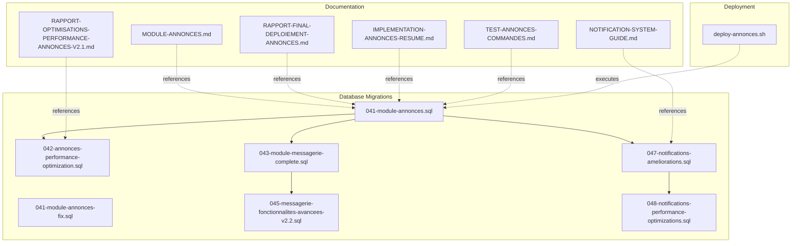

**Diagram sources**
- [041-module-annonces.sql](file://backend/database/migrations/041-module-annonces.sql)
- [041-module-annonces-fix.sql](file://backend/database/migrations/041-module-annonces-fix.sql)
- [042-annonces-performance-optimization.sql](file://backend/database/migrations/042-annonces-performance-optimization.sql)
- [043-module-messagerie-complete.sql](file://backend/database/migrations/043-module-messagerie-complete.sql)
- [045-messagerie-fonctionnalites-avancees-v2.2.sql](file://backend/database/migrations/045-messagerie-fonctionnalites-avancees-v2.2.sql)
- [047-notifications-ameliorations.sql](file://backend/database/migrations/047-notifications-ameliorations.sql)
- [048-notifications-performance-optimizations.sql](file://backend/database/migrations/048-notifications-performance-optimizations.sql)
- [MODULE-ANNONCES.md](file://docs/MODULE-ANNONCES.md)
- [RAPPORT-FINAL-DEPLOIEMENT-ANNONCES.md](file://docs/rapports/RAPPORT-FINAL-DEPLOIEMENT-ANNONCES.md)
- [RAPPORT-OPTIMISATIONS-PERFORMANCE-ANNONCES-V2.1.md](file://docs/rapports/RAPPORT-OPTIMISATIONS-PERFORMANCE-ANNONCES-V2.1.md)
- [IMPLEMENTATION-ANNONCES-RESUME.md](file://docs/implementations/IMPLEMENTATION-ANNONCES-RESUME.md)
- [TEST-ANNONCES-COMMANDES.md](file://docs/autres/_divers/TEST-ANNONCES-COMMANDES.md)
- [NOTIFICATION-SYSTEM-GUIDE.md](file://docs/guides/NOTIFICATION-SYSTEM-GUIDE.md)
- [deploy-annonces.sh](file://scripts/deploy-annonces.sh)

**Section sources**
- [041-module-annonces.sql](file://backend/database/migrations/041-module-annonces.sql)
- [042-annonces-performance-optimization.sql](file://backend/database/migrations/042-annonces-performance-optimization.sql)
- [043-module-messagerie-complete.sql](file://backend/database/migrations/043-module-messagerie-complete.sql)
- [045-messagerie-fonctionnalites-avancees-v2.2.sql](file://backend/database/migrations/045-messagerie-fonctionnalites-avancees-v2.2.sql)
- [047-notifications-ameliorations.sql](file://backend/database/migrations/047-notifications-ameliorations.sql)
- [048-notifications-performance-optimizations.sql](file://backend/database/migrations/048-notifications-performance-optimizations.sql)
- [MODULE-ANNONCES.md](file://docs/MODULE-ANNONCES.md)
- [RAPPORT-FINAL-DEPLOIEMENT-ANNONCES.md](file://docs/rapports/RAPPORT-FINAL-DEPLOIEMENT-ANNONCES.md)
- [RAPPORT-OPTIMISATIONS-PERFORMANCE-ANNONCES-V2.1.md](file://docs/rapports/RAPPORT-OPTIMISATIONS-PERFORMANCE-ANNONCES-V2.1.md)
- [IMPLEMENTATION-ANNONCES-RESUME.md](file://docs/implementations/IMPLEMENTATION-ANNONCES-RESUME.md)
- [TEST-ANNONCES-COMMANDES.md](file://docs/autres/_divers/TEST-ANNONCES-COMMANDES.md)
- [NOTIFICATION-SYSTEM-GUIDE.md](file://docs/guides/NOTIFICATION-SYSTEM-GUIDE.md)
- [deploy-annonces.sh](file://scripts/deploy-annonces.sh)

## Core Components
- Announcement entity and lifecycle states: draft, published, expired/archived
- Targeting model: users segmented by role (student, parent, teacher, staff) and optionally by class/group
- Scheduling: publishAt and optional archive/expiry time
- Read receipts: per-user tracking of views
- Templates: reusable announcement content structures
- Attachments: file references associated with announcements
- Notifications: integration with the notifications subsystem when announcements are published or archived
- Visibility and permissions: role-based access control to create, edit, publish, and view announcements

Key data models and relationships are defined in the announcement migrations and refined by messaging and notifications migrations.

**Section sources**
- [041-module-annonces.sql](file://backend/database/migrations/041-module-annonces.sql)
- [041-module-annonces-fix.sql](file://backend/database/migrations/041-module-annonces-fix.sql)
- [042-annonces-performance-optimization.sql](file://backend/database/migrations/042-annonces-performance-optimization.sql)
- [043-module-messagerie-complete.sql](file://backend/database/migrations/043-module-messagerie-complete.sql)
- [045-messagerie-fonctionnalites-avancees-v2.2.sql](file://backend/database/migrations/045-messagerie-fonctionnalites-avancees-v2.2.sql)
- [047-notifications-ameliorations.sql](file://backend/database/migrations/047-notifications-ameliorations.sql)
- [048-notifications-performance-optimizations.sql](file://backend/database/migrations/048-notifications-performance-optimizations.sql)

## Architecture Overview
The Announcement system integrates with the broader messaging and notifications modules. Announcements are persisted with metadata (title, body, target audience, scheduling, status). When an announcement transitions to published, the notifications subsystem is triggered to deliver real-time alerts to targeted recipients. Read receipts are recorded as users open announcements. Archived announcements remain queryable for historical reporting.

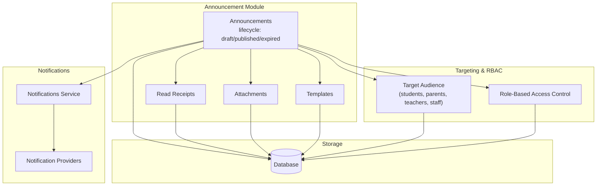

**Diagram sources**
- [041-module-annonces.sql](file://backend/database/migrations/041-module-annonces.sql)
- [043-module-messagerie-complete.sql](file://backend/database/migrations/043-module-messagerie-complete.sql)
- [045-messagerie-fonctionnalites-avancees-v2.2.sql](file://backend/database/migrations/045-messagerie-fonctionnalites-avancees-v2.2.sql)
- [047-notifications-ameliorations.sql](file://backend/database/migrations/047-notifications-ameliorations.sql)
- [048-notifications-performance-optimizations.sql](file://backend/database/migrations/048-notifications-performance-optimizations.sql)

## Detailed Component Analysis

### Announcement Lifecycle and Status Management
- States: draft, published, expired/archived
- Transitions:
  - Create → draft
  - Publish → published (may be immediate or scheduled via publishAt)
  - Archive/expiry → expired/archived (based on schedule or manual action)
- Visibility: only published announcements are visible to target audiences; drafts are restricted to authorized creators/editors

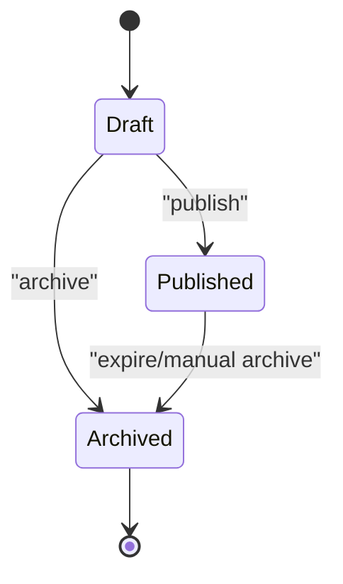

**Diagram sources**
- [041-module-annonces.sql](file://backend/database/migrations/041-module-annonces.sql)
- [041-module-annonces-fix.sql](file://backend/database/migrations/041-module-annonces-fix.sql)

**Section sources**
- [041-module-annonces.sql](file://backend/database/migrations/041-module-annonces.sql)
- [041-module-annonces-fix.sql](file://backend/database/migrations/041-module-annonces-fix.sql)

### Targeting Specific User Groups
- Audience segmentation by role: students, parents, teachers, staff
- Optional scoping by class/group where applicable
- Filtering logic ensures only eligible recipients receive notifications and can view the announcement

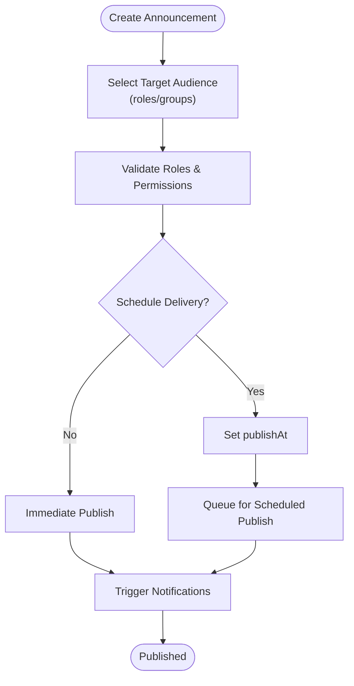

**Diagram sources**
- [041-module-annonces.sql](file://backend/database/migrations/041-module-annonces.sql)
- [043-module-messagerie-complete.sql](file://backend/database/migrations/043-module-messagerie-complete.sql)
- [045-messagerie-fonctionnalites-avancees-v2.2.sql](file://backend/database/migrations/045-messagerie-fonctionnalites-avancees-v2.2.sql)

**Section sources**
- [041-module-annonces.sql](file://backend/database/migrations/041-module-annonces.sql)
- [043-module-messagerie-complete.sql](file://backend/database/migrations/043-module-messagerie-complete.sql)
- [045-messagerie-fonctionnalites-avancees-v2.2.sql](file://backend/database/migrations/045-messagerie-fonctionnalites-avancees-v2.2.sql)

### Scheduling Announcements for Future Delivery
- publishAt field enables delayed publication
- Background processing triggers publication at the scheduled time
- Ensures consistent delivery windows across large recipient sets

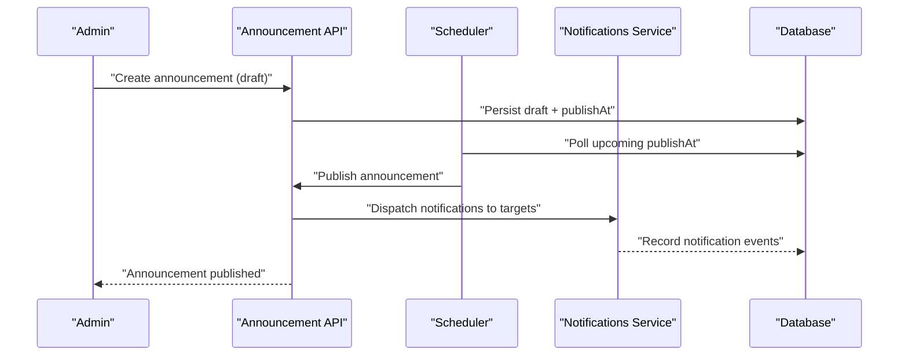

**Diagram sources**
- [041-module-annonces.sql](file://backend/database/migrations/041-module-annonces.sql)
- [047-notifications-ameliorations.sql](file://backend/database/migrations/047-notifications-ameliorations.sql)
- [048-notifications-performance-optimizations.sql](file://backend/database/migrations/048-notifications-performance-optimizations.sql)

**Section sources**
- [041-module-annonces.sql](file://backend/database/migrations/041-module-annonces.sql)
- [047-notifications-ameliorations.sql](file://backend/database/migrations/047-notifications-ameliorations.sql)
- [048-notifications-performance-optimizations.sql](file://backend/database/migrations/048-notifications-performance-optimizations.sql)

### Read Receipt Tracking
- Tracks which users have viewed announcements
- Supports analytics and compliance reporting
- Optimized indexing for high-volume read events

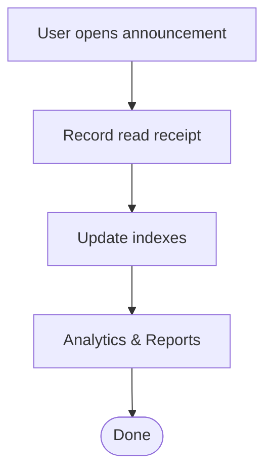

**Diagram sources**
- [041-module-annonces.sql](file://backend/database/migrations/041-module-annonces.sql)
- [042-annonces-performance-optimization.sql](file://backend/database/migrations/042-annonces-performance-optimization.sql)

**Section sources**
- [041-module-annonces.sql](file://backend/database/migrations/041-module-annonces.sql)
- [042-annonces-performance-optimization.sql](file://backend/database/migrations/042-annonces-performance-optimization.sql)

### Announcement Templates
- Reusable content structures for standardized communications
- Allow pre-defined fields and formatting
- Facilitate quick creation of recurring announcements

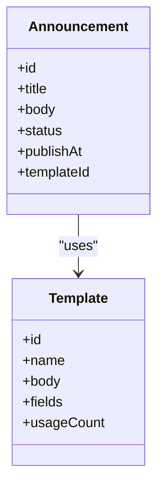

**Diagram sources**
- [041-module-annonces.sql](file://backend/database/migrations/041-module-annonces.sql)

**Section sources**
- [041-module-annonces.sql](file://backend/database/migrations/041-module-annonces.sql)

### Attachment Handling
- Attachments linked to announcements
- Stored references with metadata
- Controlled access based on announcement visibility and user permissions

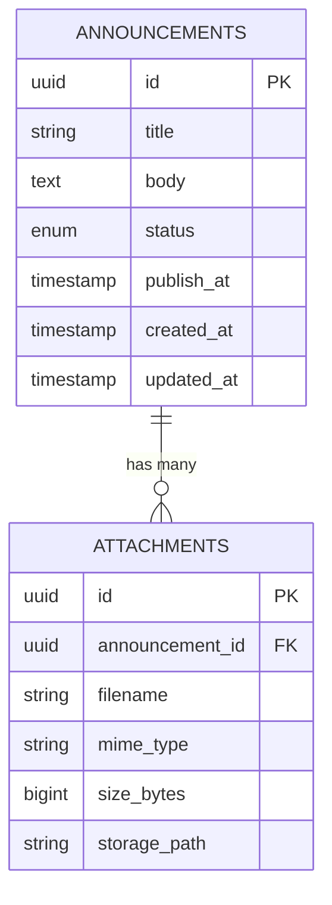

**Diagram sources**
- [041-module-annonces.sql](file://backend/database/migrations/041-module-annonces.sql)

**Section sources**
- [041-module-annonces.sql](file://backend/database/migrations/041-module-annonces.sql)

### Notification Integration
- On publish: notifications dispatched to targeted recipients
- On archive/expiry: notifications may inform recipients about changes or removal
- Performance optimizations ensure scalable delivery

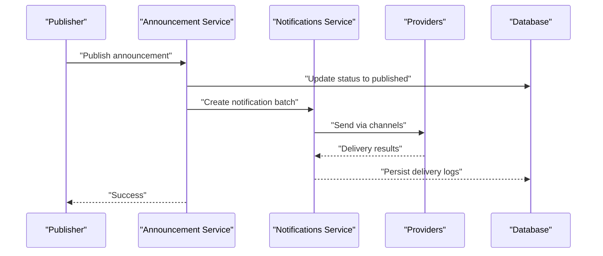

**Diagram sources**
- [047-notifications-ameliorations.sql](file://backend/database/migrations/047-notifications-ameliorations.sql)
- [048-notifications-performance-optimizations.sql](file://backend/database/migrations/048-notifications-performance-optimizations.sql)
- [043-module-messagerie-complete.sql](file://backend/database/migrations/043-module-messagerie-complete.sql)

**Section sources**
- [047-notifications-ameliorations.sql](file://backend/database/migrations/047-notifications-ameliorations.sql)
- [048-notifications-performance-optimizations.sql](file://backend/database/migrations/048-notifications-performance-optimizations.sql)
- [043-module-messagerie-complete.sql](file://backend/database/migrations/043-module-messagerie-complete.sql)

### Visibility Based on Roles and Permissions
- Role-based visibility controls who can create, edit, publish, and view announcements
- Target audience filtering ensures only relevant users see the announcement
- Auditability and compliance maintained through permission checks

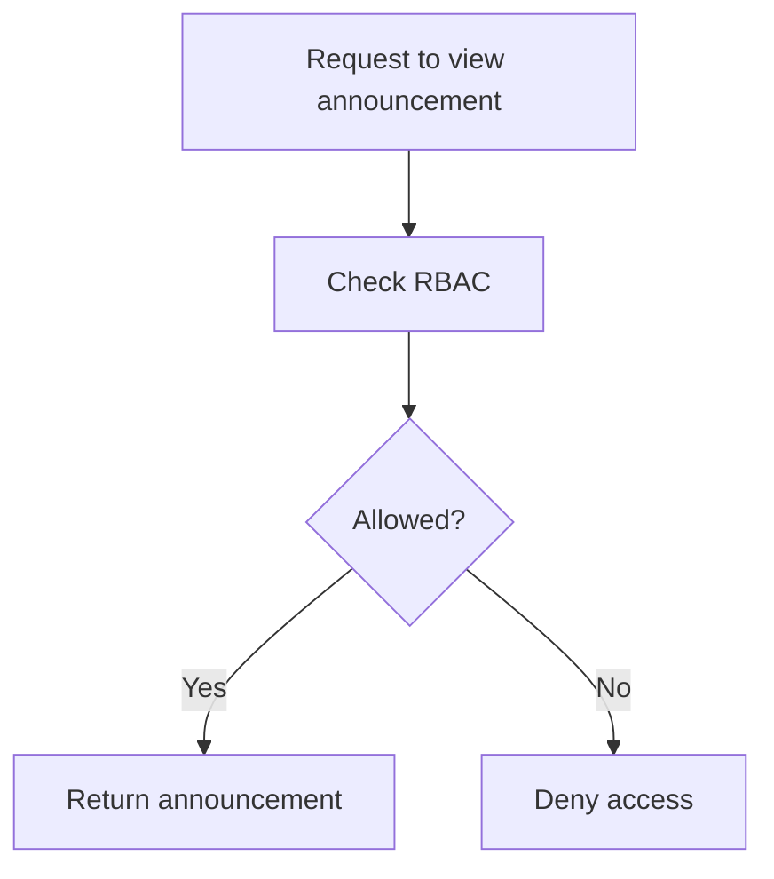

**Diagram sources**
- [041-module-annonces.sql](file://backend/database/migrations/041-module-annonces.sql)
- [043-module-messagerie-complete.sql](file://backend/database/migrations/043-module-messagerie-complete.sql)

**Section sources**
- [041-module-annonces.sql](file://backend/database/migrations/041-module-annonces.sql)
- [043-module-messagerie-complete.sql](file://backend/database/migrations/043-module-messagerie-complete.sql)

### Practical Examples
- Creating a targeted announcement for students and parents:
  - Define audience roles: student, parent
  - Optionally scope by class/group
  - Choose template if available
  - Attach documents if needed
  - Publish immediately or schedule via publishAt
- Managing visibility:
  - Ensure creator has publish permission
  - Confirm target roles are correctly assigned
  - Verify attachments are accessible to intended recipients
- Retrieving archived announcements:
  - Query by status archived/expired
  - Filter by date range and audience
  - Export for reporting

Operational examples and commands are documented in the testing guide.

**Section sources**
- [TEST-ANNONCES-COMMANDES.md](file://docs/autres/_divers/TEST-ANNONCES-COMMANDES.md)
- [MODULE-ANNONCES.md](file://docs/MODULE-ANNONCES.md)

## Dependency Analysis
The Announcement module depends on:
- Messaging infrastructure for advanced features
- Notifications service for real-time alerts
- Database schema with optimized indexes for performance

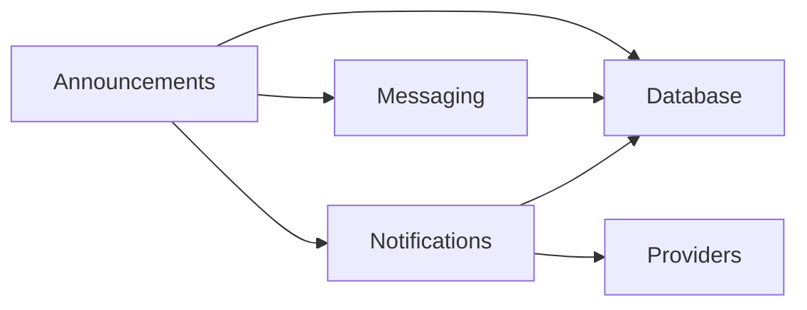

**Diagram sources**
- [041-module-annonces.sql](file://backend/database/migrations/041-module-annonces.sql)
- [043-module-messagerie-complete.sql](file://backend/database/migrations/043-module-messagerie-complete.sql)
- [045-messagerie-fonctionnalites-avancees-v2.2.sql](file://backend/database/migrations/045-messagerie-fonctionnalites-avancees-v2.2.sql)
- [047-notifications-ameliorations.sql](file://backend/database/migrations/047-notifications-ameliorations.sql)
- [048-notifications-performance-optimizations.sql](file://backend/database/migrations/048-notifications-performance-optimizations.sql)

**Section sources**
- [041-module-annonces.sql](file://backend/database/migrations/041-module-annonces.sql)
- [043-module-messagerie-complete.sql](file://backend/database/migrations/043-module-messagerie-complete.sql)
- [045-messagerie-fonctionnalites-avancees-v2.2.sql](file://backend/database/migrations/045-messagerie-fonctionnalites-avancees-v2.2.sql)
- [047-notifications-ameliorations.sql](file://backend/database/migrations/047-notifications-ameliorations.sql)
- [048-notifications-performance-optimizations.sql](file://backend/database/migrations/048-notifications-performance-optimizations.sql)

## Performance Considerations
- Indexes added for announcement queries and read receipt tracking
- Batch notification dispatch to reduce overhead
- Optimization strategies documented in performance reports

Recommendations:
- Use pagination for listing announcements
- Prefer filtered queries by status and publishAt ranges
- Monitor notification provider throughput and backpressure

**Section sources**
- [042-annonces-performance-optimization.sql](file://backend/database/migrations/042-annonces-performance-optimization.sql)
- [048-notifications-performance-optimizations.sql](file://backend/database/migrations/048-notifications-performance-optimizations.sql)
- [RAPPORT-OPTIMISATIONS-PERFORMANCE-ANNONCES-V2.1.md](file://docs/rapports/RAPPORT-OPTIMISATIONS-PERFORMANCE-ANNONCES-V2.1.md)

## Troubleshooting Guide
Common issues and resolutions:
- Announcement not appearing for target users:
  - Verify role assignments and audience targeting
  - Confirm publishAt timing and status
- Read receipts not updating:
  - Check indexing and write paths
  - Validate client-side view events
- Notification delivery failures:
  - Inspect provider logs and retry policies
  - Review performance optimizations and throttling

Operational guidance and deployment verification steps are provided in the deployment report and notification system guide.

**Section sources**
- [RAPPORT-FINAL-DEPLOIEMENT-ANNONCES.md](file://docs/rapports/RAPPORT-FINAL-DEPLOIEMENT-ANNONCES.md)
- [NOTIFICATION-SYSTEM-GUIDE.md](file://docs/guides/NOTIFICATION-SYSTEM-GUIDE.md)
- [deploy-annonces.sh](file://scripts/deploy-annonces.sh)

## Conclusion
The Announcement system provides robust broadcast communication capabilities within eLISAschool. It supports precise targeting, scheduling, read receipts, templates, attachments, and tight integration with notifications. The database schema and performance optimizations ensure scalability, while documentation and deployment scripts facilitate reliable operation.

## Appendices
- Deployment script: deploy-annonces.sh
- Implementation summary: IMPLEMENTATION-ANNONCES-RESUME.md
- Module overview: MODULE-ANNONCES.md

**Section sources**
- [deploy-annonces.sh](file://scripts/deploy-annonces.sh)
- [IMPLEMENTATION-ANNONCES-RESUME.md](file://docs/implementations/IMPLEMENTATION-ANNONCES-RESUME.md)
- [MODULE-ANNONCES.md](file://docs/MODULE-ANNONCES.md)