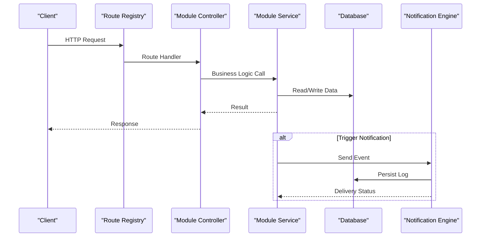
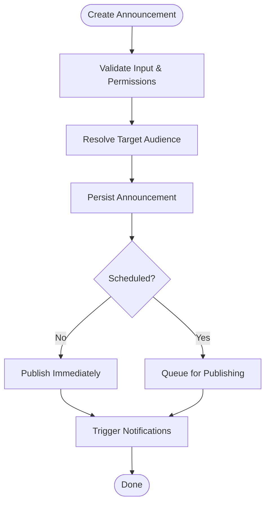
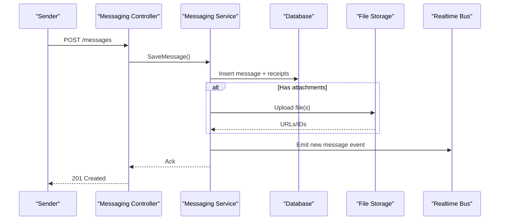
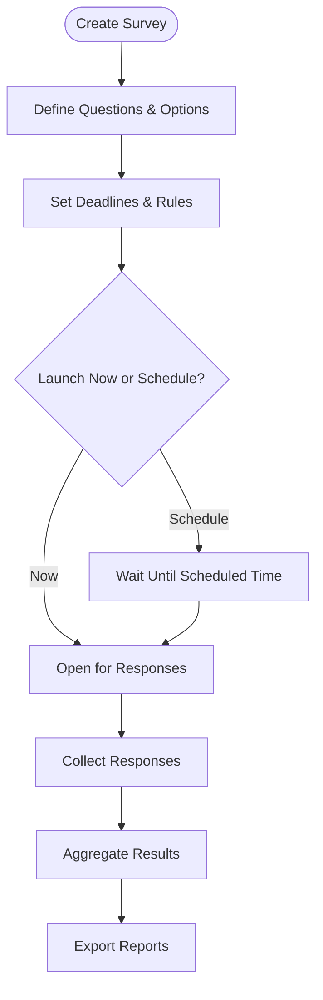
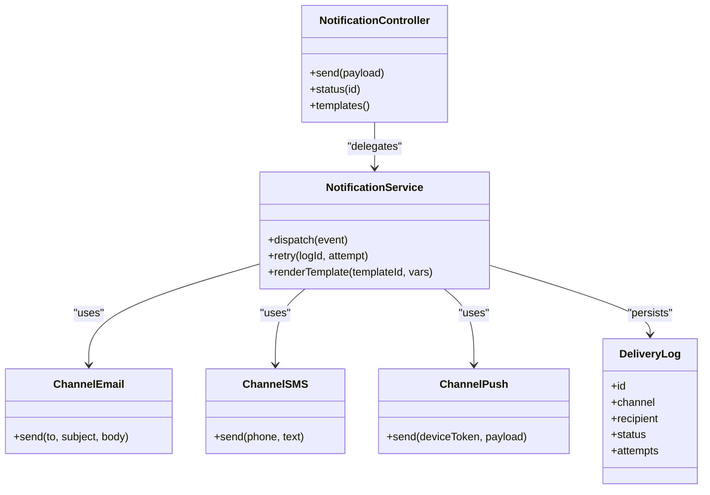
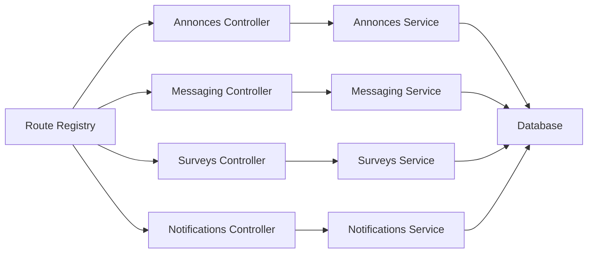

# Communication & Collaboration

<cite>
**Referenced Files in This Document**
- [041-module-annonces.sql](file://backend/database/migrations/041-module-annonces.sql)
- [041-module-annonces-fix.sql](file://backend/database/migrations/041-module-annonces-fix.sql)
- [042-annonces-performance-optimization.sql](file://backend/database/migrations/042-annonces-performance-optimization.sql)
- [041-module-sondages.sql](file://backend/database/migrations/041-module-sondages.sql)
- [042-sondages-recurrents.sql](file://backend/database/migrations/042-sondages-recurrents.sql)
- [043-module-messagerie-complete.sql](file://backend/database/migrations/043-module-messagerie-complete.sql)
- [044-messagerie-optimisations-v2.1.sql](file://backend/database/migrations/044-messagerie-optimisations-v2.1.sql)
- [045-messagerie-fonctionnalites-avancees-v2.2.sql](file://backend/database/migrations/045-messagerie-fonctionnalites-avancees-v2.2.sql)
- [047-notifications-ameliorations.sql](file://backend/database/migrations/047-notifications-ameliorations.sql)
- [048-notifications-performance-optimizations.sql](file://backend/database/migrations/048-notifications-performance-optimizations.sql)
- [annonces.controller.ts](file://backend/src/modules/annonces/controllers/annonces.controller.ts)
- [annonces.service.ts](file://backend/src/modules/annonces/services/annonces.service.ts)
- [messagerie.controller.ts](file://backend/src/modules/messagerie/controllers/messagerie.controller.ts)
- [messagerie.service.ts](file://backend/src/modules/messagerie/services/messagerie.service.ts)
- [sondages.controller.ts](file://backend/src/modules/sondages/controllers/sondages.controller.ts)
- [sondages.service.ts](file://backend/src/modules/sondages/services/sondages.service.ts)
- [notifications.controller.ts](file://backend/src/modules/notifications/controllers/notifications.controller.ts)
- [notifications.service.ts](file://backend/src/modules/notifications/services/notifications.service.ts)
- [route-registry.ts](file://backend/src/routes/route-registry.ts)
- [app.ts](file://backend/src/app.ts)
- [index.ts](file://backend/src/index.ts)
</cite>

## Table of Contents
1. [Introduction](#introduction)
2. [Project Structure](#project-structure)
3. [Core Components](#core-components)
4. [Architecture Overview](#architecture-overview)
5. [Detailed Component Analysis](#detailed-component-analysis)
6. [Dependency Analysis](#dependency-analysis)
7. [Performance Considerations](#performance-considerations)
8. [Troubleshooting Guide](#troubleshooting-guide)
9. [Conclusion](#conclusion)
10. [Appendices](#appendices)

## Introduction
This document describes eLISAschool’s communication and collaboration system, focusing on:
- Announcements for broadcast communications with targeting and read receipts
- Internal messaging supporting departmental groups, direct messages, and file sharing
- Surveys and polls for feedback collection and assessments
- A notification engine delivering via email, SMS, and push channels
It also covers real-time features, message archiving, compliance considerations, and practical workflows.

## Project Structure
The communication and collaboration capabilities are implemented as backend modules under src/modules, each exposing controllers and services, with database schema defined in migrations. Routes are registered centrally and the application bootstraps from a single entry point.

```mermaid
graph TB
subgraph "Backend Modules"
A["Annonces (Announcements)"]
M["Messagerie (Messaging)"]
S["Sondages (Surveys/Polls)"]
N["Notifications"]
end
subgraph "Data Layer"
DB["PostgreSQL Schema<br/>Migrations"]
end
subgraph "Routing & App"
RR["Route Registry"]
APP["App Bootstrap"]
ENTRY["Server Entry"]
end
A --> DB
M --> DB
S --> DB
N --> DB
RR --> A
RR --> M
RR --> S
RR --> N
APP --> RR
ENTRY --> APP
```

**Diagram sources**
- [route-registry.ts](file://backend/src/routes/route-registry.ts)
- [app.ts](file://backend/src/app.ts)
- [index.ts](file://backend/src/index.ts)
- [041-module-annonces.sql](file://backend/database/migrations/041-module-annonces.sql)
- [043-module-messagerie-complete.sql](file://backend/database/migrations/043-module-messagerie-complete.sql)
- [041-module-sondages.sql](file://backend/database/migrations/041-module-sondages.sql)
- [047-notifications-ameliorations.sql](file://backend/database/migrations/047-notifications-ameliorations.sql)

**Section sources**
- [route-registry.ts](file://backend/src/routes/route-registry.ts)
- [app.ts](file://backend/src/app.ts)
- [index.ts](file://backend/src/index.ts)

## Core Components
- Announcements module: Broadcast announcements to targeted audiences; supports scheduling, visibility control, and read receipts.
- Messaging module: Internal messaging with group chats (e.g., departments), direct messages, threading, attachments, and archival.
- Surveys/Polls module: Create surveys and polls, collect responses, support recurring schedules, and export results.
- Notifications module: Multi-channel delivery (email, SMS, push), templating, retry/backoff, and performance optimizations.

Key implementation files:
- Announcements: controller and service
- Messaging: controller and service
- Surveys: controller and service
- Notifications: controller and service

**Section sources**
- [annonces.controller.ts](file://backend/src/modules/annonces/controllers/annonces.controller.ts)
- [annonces.service.ts](file://backend/src/modules/annonces/services/annonces.service.ts)
- [messagerie.controller.ts](file://backend/src/modules/messagerie/controllers/messagerie.controller.ts)
- [messagerie.service.ts](file://backend/src/modules/messagerie/services/messagerie.service.ts)
- [sondages.controller.ts](file://backend/src/modules/sondages/controllers/sondages.controller.ts)
- [sondages.service.ts](file://backend/src/modules/sondages/services/sondages.service.ts)
- [notifications.controller.ts](file://backend/src/modules/notifications/controllers/notifications.controller.ts)
- [notifications.service.ts](file://backend/src/modules/notifications/services/notifications.service.ts)

## Architecture Overview
High-level flow:
- Clients call REST endpoints registered in route-registry.ts.
- Controllers validate requests and delegate to services.
- Services orchestrate business logic, persist data, and trigger notifications.
- Database schemas are defined by migrations; indexes optimize queries.
- Notifications may be sent synchronously or asynchronously depending on channel and configuration.

**Diagram sources**
- [route-registry.ts](file://backend/src/routes/route-registry.ts)
- [app.ts](file://backend/src/app.ts)
- [index.ts](file://backend/src/index.ts)
- [047-notifications-ameliorations.sql](file://backend/database/migrations/047-notifications-ameliorations.sql)

## Detailed Component Analysis

### Announcements Module
Capabilities:
- Create, update, schedule, publish, and archive announcements
- Targeting by roles, departments, classes, or custom segments
- Read receipts per recipient
- Performance-optimized indexing for large broadcasts

Data model highlights (from migrations):
- Announcement entities with fields for title, content, target scope, scheduling, status, and audit timestamps
- Recipient mapping and read receipt tracking tables
- Indexes for fast lookups by target and status

API surface (typical operations):
- List/search announcements with filters
- Create/update announcement with targeting rules
- Publish/schedule announcement
- Mark as read per user
- Retrieve read receipts summary

**Diagram sources**
- [041-module-annonces.sql](file://backend/database/migrations/041-module-annonces.sql)
- [041-module-annonces-fix.sql](file://backend/database/migrations/041-module-annonces-fix.sql)
- [042-annonces-performance-optimization.sql](file://backend/database/migrations/042-annonces-performance-optimization.sql)
- [annonces.controller.ts](file://backend/src/modules/annonces/controllers/annonces.controller.ts)
- [annonces.service.ts](file://backend/src/modules/annonces/services/annonces.service.ts)

Practical example:
- School admin creates an announcement targeting “All Teachers” and “Parents”, schedules it for next Monday, publishes automatically, and tracks who has read it.

Compliance notes:
- Retain audit logs and read receipts for regulatory reporting
- Ensure data retention policies apply to archived announcements

**Section sources**
- [041-module-annonces.sql](file://backend/database/migrations/041-module-annonces.sql)
- [041-module-annonces-fix.sql](file://backend/database/migrations/041-module-annonces-fix.sql)
- [042-annonces-performance-optimization.sql](file://backend/database/migrations/042-annonces-performance-optimization.sql)
- [annonces.controller.ts](file://backend/src/modules/annonces/controllers/annonces.controller.ts)
- [annonces.service.ts](file://backend/src/modules/annonces/services/annonces.service.ts)

### Internal Messaging Module
Capabilities:
- Direct messages and group chats (e.g., departments, committees)
- Message threading/replies
- File attachments with secure storage references
- Archival and search with pagination
- Real-time updates via WebSocket/SSE (integration points)

Data model highlights (from migrations):
- Conversations (direct/group), messages, replies/thread nodes, attachments, and read receipts
- Indexes for conversation membership, timestamps, and search fields
- Soft delete/archival flags and tenant scoping

API surface (typical operations):
- Create/join conversations
- Send messages and replies
- Upload/download attachments
- Archive/unarchive conversations
- Search messages within scope

**Diagram sources**
- [043-module-messagerie-complete.sql](file://backend/database/migrations/043-module-messagerie-complete.sql)
- [044-messagerie-optimisations-v2.1.sql](file://backend/database/migrations/044-messagerie-optimisations-v2.1.sql)
- [045-messagerie-fonctionnalites-avancees-v2.2.sql](file://backend/database/migrations/045-messagerie-fonctionnalites-avancees-v2.2.sql)
- [messagerie.controller.ts](file://backend/src/modules/messagerie/controllers/messagerie.controller.ts)
- [messagerie.service.ts](file://backend/src/modules/messagerie/services/messagerie.service.ts)

Practical example:
- Department head starts a group chat, invites members, shares a policy PDF, and archives the thread after resolution.

Compliance notes:
- Enforce retention and deletion policies for messages and attachments
- Maintain access logs for sensitive communications

**Section sources**
- [043-module-messagerie-complete.sql](file://backend/database/migrations/043-module-messagerie-complete.sql)
- [044-messagerie-optimisations-v2.1.sql](file://backend/database/migrations/044-messagerie-optimisations-v2.1.sql)
- [045-messagerie-fonctionnalites-avancees-v2.2.sql](file://backend/database/migrations/045-messagerie-fonctionnalites-avancees-v2.2.sql)
- [messagerie.controller.ts](file://backend/src/modules/messagerie/controllers/messagerie.controller.ts)
- [messagerie.service.ts](file://backend/src/modules/messagerie/services/messagerie.service.ts)

### Surveys and Polls Module
Capabilities:
- Create surveys/polls with various question types
- Set deadlines, anonymity, and scoring options
- Collect responses and generate summaries
- Support recurring surveys (e.g., weekly feedback)

Data model highlights (from migrations):
- Survey definitions, questions, options, responses, and response details
- Recurrence configuration and scheduled execution hooks

API surface (typical operations):
- CRUD for surveys and questions
- Submit responses
- Export results and analytics
- Manage recurrence

**Diagram sources**
- [041-module-sondages.sql](file://backend/database/migrations/041-module-sondages.sql)
- [042-sondages-recurrents.sql](file://backend/database/migrations/042-sondages-recurrents.sql)
- [sondages.controller.ts](file://backend/src/modules/sondages/controllers/sondages.controller.ts)
- [sondages.service.ts](file://backend/src/modules/sondages/services/sondages.service.ts)

Practical example:
- Faculty launches a recurring monthly satisfaction survey, collects anonymous responses, and exports aggregated insights.

Compliance notes:
- Honor anonymity settings and data minimization principles
- Provide export controls for auditors

**Section sources**
- [041-module-sondages.sql](file://backend/database/migrations/041-module-sondages.sql)
- [042-sondages-recurrents.sql](file://backend/database/migrations/042-sondages-recurrents.sql)
- [sondages.controller.ts](file://backend/src/modules/sondages/controllers/sondages.controller.ts)
- [sondages.service.ts](file://backend/src/modules/sondages/services/sondages.service.ts)

### Notifications Engine
Capabilities:
- Multi-channel delivery: email, SMS, push
- Template-based content and localization
- Retry/backoff and delivery status tracking
- Performance optimizations for high-volume dispatch

Data model highlights (from migrations):
- Notification templates, delivery logs, channel-specific configurations, and status tracking
- Indexes for efficient querying by recipient, channel, and time windows

API surface (typical operations):
- Send notification via API
- Query delivery status
- Manage templates and channel credentials

**Diagram sources**
- [047-notifications-ameliorations.sql](file://backend/database/migrations/047-notifications-ameliorations.sql)
- [048-notifications-performance-optimizations.sql](file://backend/database/migrations/048-notifications-performance-optimizations.sql)
- [notifications.controller.ts](file://backend/src/modules/notifications/controllers/notifications.controller.ts)
- [notifications.service.ts](file://backend/src/modules/notifications/services/notifications.service.ts)

Practical example:
- When an announcement is published, the system sends email and push notifications to all targeted recipients, logging delivery outcomes.

Compliance notes:
- Respect opt-out preferences and regional regulations (e.g., consent for SMS)
- Securely store credentials and PII

**Section sources**
- [047-notifications-ameliorations.sql](file://backend/database/migrations/047-notifications-ameliorations.sql)
- [048-notifications-performance-optimizations.sql](file://backend/database/migrations/048-notifications-performance-optimizations.sql)
- [notifications.controller.ts](file://backend/src/modules/notifications/controllers/notifications.controller.ts)
- [notifications.service.ts](file://backend/src/modules/notifications/services/notifications.service.ts)

## Dependency Analysis
Modules depend on shared routing and app bootstrap, and on the database layer. Cross-module interactions occur primarily through events (e.g., announcements triggering notifications).

**Diagram sources**
- [route-registry.ts](file://backend/src/routes/route-registry.ts)
- [app.ts](file://backend/src/app.ts)
- [index.ts](file://backend/src/index.ts)
- [annonces.controller.ts](file://backend/src/modules/annonces/controllers/annonces.controller.ts)
- [messagerie.controller.ts](file://backend/src/modules/messagerie/controllers/messagerie.controller.ts)
- [sondages.controller.ts](file://backend/src/modules/sondages/controllers/sondages.controller.ts)
- [notifications.controller.ts](file://backend/src/modules/notifications/controllers/notifications.controller.ts)

**Section sources**
- [route-registry.ts](file://backend/src/routes/route-registry.ts)
- [app.ts](file://backend/src/app.ts)
- [index.ts](file://backend/src/index.ts)

## Performance Considerations
- Announcements: Use targeted publishing and precomputed recipient sets; leverage indexes for filtering by role/class/department.
- Messaging: Paginate threads, index conversation membership and timestamps, and stream real-time updates efficiently.
- Surveys: Batch insert responses, aggregate results asynchronously, and cache frequent reads.
- Notifications: Implement retry/backoff, queue heavy work, and use connection pooling and indexes for delivery logs.

[No sources needed since this section provides general guidance]

## Troubleshooting Guide
Common issues and checks:
- Missing routes: Verify registration in route registry and ensure controllers are imported.
- Permission errors: Confirm RBAC permissions for users attempting to create announcements, send messages, or manage surveys.
- Notification failures: Inspect delivery logs for failed attempts, check channel credentials, and review retry counts.
- Slow queries: Validate that migration indexes exist for frequently filtered columns (e.g., audience, timestamps).

Operational tips:
- Enable detailed logs around controller/service boundaries
- Monitor delivery metrics and error rates
- Periodically verify migration state and index health

**Section sources**
- [route-registry.ts](file://backend/src/routes/route-registry.ts)
- [042-annonces-performance-optimization.sql](file://backend/database/migrations/042-annonces-performance-optimization.sql)
- [044-messagerie-optimisations-v2.1.sql](file://backend/database/migrations/044-messagerie-optimisations-v2.1.sql)
- [048-notifications-performance-optimizations.sql](file://backend/database/migrations/048-notifications-performance-optimizations.sql)

## Conclusion
eLISAschool’s communication and collaboration system provides robust tools for broadcasting announcements, internal messaging with rich features, structured surveys and polls, and a scalable notification engine. The modular architecture, backed by well-indexed schemas and clear separation of concerns, supports both everyday operations and high-volume scenarios while maintaining compliance and performance.

[No sources needed since this section summarizes without analyzing specific files]

## Appendices

### Practical Workflows

- Announcement workflow:
  - Author creates and targets an announcement
  - System schedules or publishes immediately
  - Recipients receive notifications and mark as read
  - Admin reviews read receipts and archives when appropriate

- Message threading workflow:
  - User opens a conversation and posts a reply
  - System persists thread node and updates read receipts
  - Real-time clients receive the new message
  - Conversation can be archived after resolution

- Survey lifecycle:
  - Designer defines questions and rules
  - Survey opens at launch or scheduled time
  - Participants submit responses
  - Analysts export results and insights

- Notification delivery pattern:
  - Event triggers notification dispatch
  - Service renders template and selects channels
  - Delivery logs track success/failure and retries
  - Operators monitor and remediate failures

[No sources needed since this section provides conceptual examples]