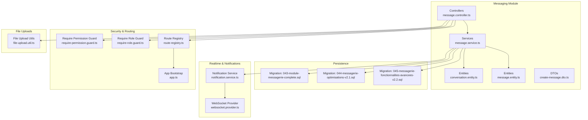
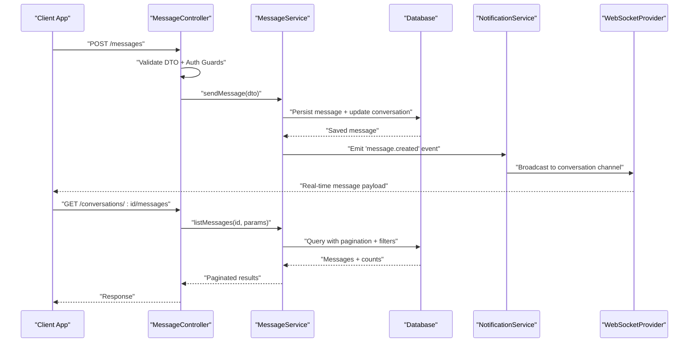
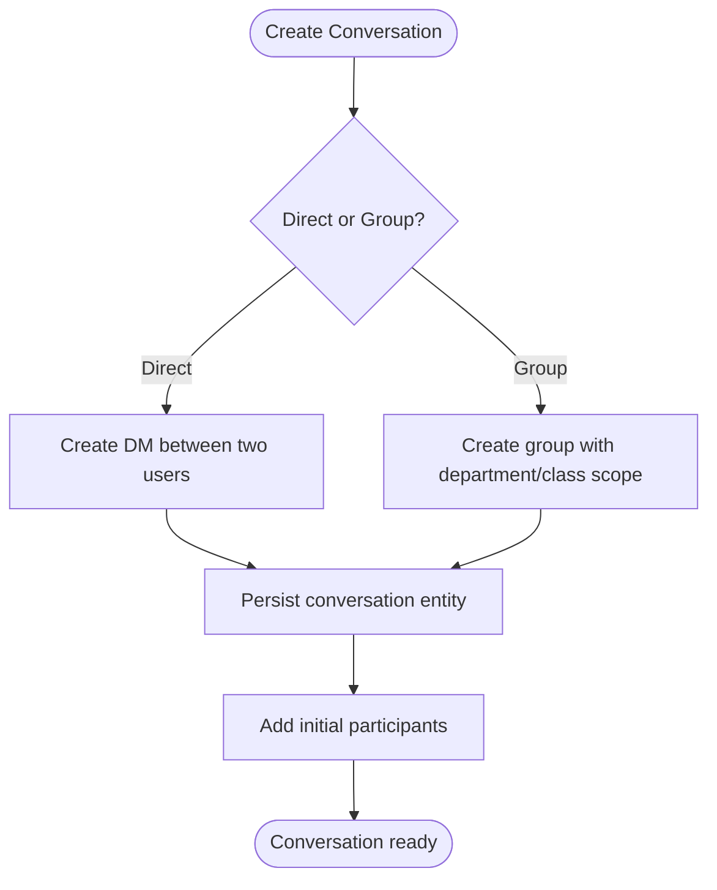
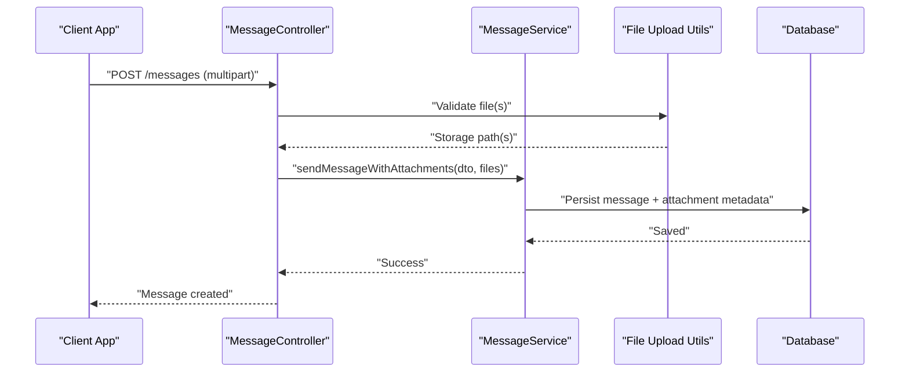
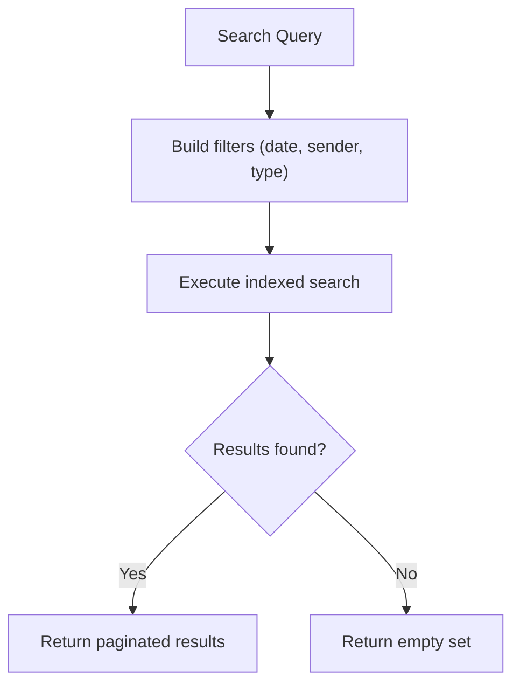
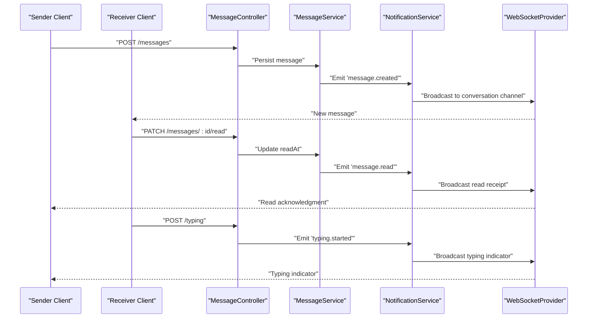
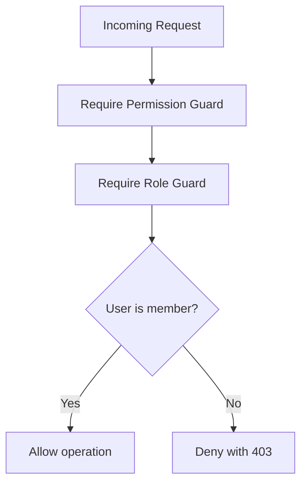
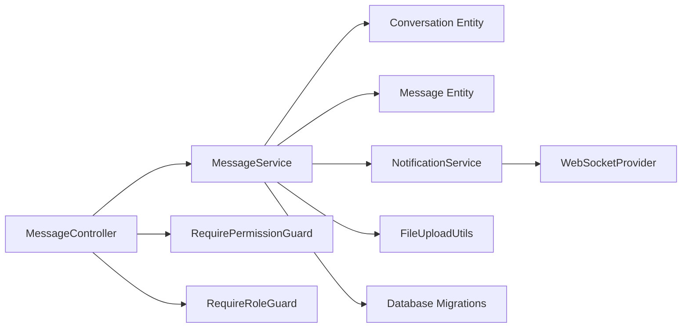

# Internal Messaging System

<cite>
**Referenced Files in This Document**
- [backend/src/modules/messagerie/index.ts](file://backend/src/modules/messagerie/index.ts)
- [backend/src/modules/messagerie/controllers/message.controller.ts](file://backend/src/modules/messagerie/controllers/message.controller.ts)
- [backend/src/modules/messagerie/services/message.service.ts](file://backend/src/modules/messagerie/services/message.service.ts)
- [backend/src/modules/messagerie/dto/create-message.dto.ts](file://backend/src/modules/messagerie/dto/create-message.dto.ts)
- [backend/src/modules/messagerie/entities/conversation.entity.ts](file://backend/src/modules/messagerie/entities/conversation.entity.ts)
- [backend/src/modules/messagerie/entities/message.entity.ts](file://backend/src/modules/messagerie/entities/message.entity.ts)
- [backend/database/migrations/043-module-messagerie-complete.sql](file://backend/database/migrations/043-module-messagerie-complete.sql)
- [backend/database/migrations/044-messagerie-optimisations-v2.1.sql](file://backend/database/migrations/044-messagerie-optimisations-v2.1.sql)
- [backend/database/migrations/045-messagerie-fonctionnalites-avancees-v2.2.sql](file://backend/database/migrations/045-messagerie-fonctionnalites-avancees-v2.2.sql)
- [backend/src/common/utils/file-upload.util.ts](file://backend/src/common/utils/file-upload.util.ts)
- [backend/src/config/env.config.ts](file://backend/src/config/env.config.ts)
- [backend/src/app.ts](file://backend/src/app.ts)
- [backend/src/routes/route-registry.ts](file://backend/src/routes/route-registry.ts)
- [backend/src/modules/auth/guards/require-permission.guard.ts](file://backend/src/modules/auth/guards/require-permission.guard.ts)
- [backend/src/modules/auth/guards/require-role.guard.ts](file://backend/src/modules/auth/guards/require-role.guard.ts)
- [backend/src/modules/notifications/services/notification.service.ts](file://backend/src/modules/notifications/services/notification.service.ts)
- [backend/src/modules/notifications/providers/websocket.provider.ts](file://backend/src/modules/notifications/providers/websocket.provider.ts)
- [backend/src/modules/monitoring/services/audit-log.service.ts](file://backend/src/modules/monitoring/services/audit-log.service.ts)
</cite>

## Table of Contents
1. [Introduction](#introduction)
2. [Project Structure](#project-structure)
3. [Core Components](#core-components)
4. [Architecture Overview](#architecture-overview)
5. [Detailed Component Analysis](#detailed-component-analysis)
6. [Dependency Analysis](#dependency-analysis)
7. [Performance Considerations](#performance-considerations)
8. [Troubleshooting Guide](#troubleshooting-guide)
9. [Conclusion](#conclusion)
10. [Appendices](#appendices)

## Introduction
This document describes eLISAschool’s internal messaging system, focusing on real-time direct messages and group conversations within departments or classes. It covers conversation management, message threading, file sharing, search, delivery features (read receipts, typing indicators, offline handling), privacy controls, encryption considerations, spam prevention, data retention compliance, WebSocket-based real-time updates, and persistence strategies. The content is grounded in the backend implementation and database migrations for the messaging module.

## Project Structure
The messaging feature is implemented as a dedicated module under the backend with controllers, services, DTOs, entities, and database migrations. Real-time capabilities integrate with the notifications subsystem via a WebSocket provider. File uploads are handled through shared utilities. Security and permissions are enforced by auth guards.



**Diagram sources**
- [backend/src/modules/messagerie/controllers/message.controller.ts](file://backend/src/modules/messagerie/controllers/message.controller.ts)
- [backend/src/modules/messagerie/services/message.service.ts](file://backend/src/modules/messagerie/services/message.service.ts)
- [backend/src/modules/messagerie/entities/conversation.entity.ts](file://backend/src/modules/messagerie/entities/conversation.entity.ts)
- [backend/src/modules/messagerie/entities/message.entity.ts](file://backend/src/modules/messagerie/entities/message.entity.ts)
- [backend/src/modules/messagerie/dto/create-message.dto.ts](file://backend/src/modules/messagerie/dto/create-message.dto.ts)
- [backend/database/migrations/043-module-messagerie-complete.sql](file://backend/database/migrations/043-module-messagerie-complete.sql)
- [backend/database/migrations/044-messagerie-optimisations-v2.1.sql](file://backend/database/migrations/044-messagerie-optimisations-v2.1.sql)
- [backend/database/migrations/045-messagerie-fonctionnalites-avancees-v2.2.sql](file://backend/database/migrations/045-messagerie-fonctionnalites-avancees-v2.2.sql)
- [backend/src/modules/notifications/providers/websocket.provider.ts](file://backend/src/modules/notifications/providers/websocket.provider.ts)
- [backend/src/modules/notifications/services/notification.service.ts](file://backend/src/modules/notifications/services/notification.service.ts)
- [backend/src/modules/auth/guards/require-permission.guard.ts](file://backend/src/modules/auth/guards/require-permission.guard.ts)
- [backend/src/modules/auth/guards/require-role.guard.ts](file://backend/src/modules/auth/guards/require-role.guard.ts)
- [backend/src/routes/route-registry.ts](file://backend/src/routes/route-registry.ts)
- [backend/src/app.ts](file://backend/src/app.ts)
- [backend/src/common/utils/file-upload.util.ts](file://backend/src/common/utils/file-upload.util.ts)

**Section sources**
- [backend/src/modules/messagerie/index.ts](file://backend/src/modules/messagerie/index.ts)
- [backend/src/app.ts](file://backend/src/app.ts)
- [backend/src/routes/route-registry.ts](file://backend/src/routes/route-registry.ts)

## Core Components
- Controllers: Expose REST endpoints for creating conversations, sending messages, listing history, searching, managing participants, and handling read receipts and typing indicators.
- Services: Implement business logic for conversation lifecycle, participant authorization checks, message persistence, threading, file attachment handling, and notification dispatch.
- Entities: Define persistent models for conversations and messages, including fields for type (direct/group), parent references for threading, attachments metadata, and status flags.
- DTOs: Validate incoming payloads for message creation and conversation operations.
- Database Migrations: Provide schema definitions, indexes, and advanced features such as threading, search support, and performance optimizations.
- Real-time Integration: Uses the notifications subsystem to broadcast events over WebSocket channels scoped by conversation IDs and user presence.
- Security: Guards enforce role and permission requirements before allowing access to messaging endpoints.
- File Uploads: Shared utilities manage upload validation, size limits, and storage paths.

**Section sources**
- [backend/src/modules/messagerie/controllers/message.controller.ts](file://backend/src/modules/messagerie/controllers/message.controller.ts)
- [backend/src/modules/messagerie/services/message.service.ts](file://backend/src/modules/messagerie/services/message.service.ts)
- [backend/src/modules/messagerie/dto/create-message.dto.ts](file://backend/src/modules/messagerie/dto/create-message.dto.ts)
- [backend/src/modules/messagerie/entities/conversation.entity.ts](file://backend/src/modules/messagerie/entities/conversation.entity.ts)
- [backend/src/modules/messagerie/entities/message.entity.ts](file://backend/src/modules/messagerie/entities/message.entity.ts)
- [backend/database/migrations/043-module-messagerie-complete.sql](file://backend/database/migrations/043-module-messagerie-complete.sql)
- [backend/database/migrations/044-messagerie-optimisations-v2.1.sql](file://backend/database/migrations/044-messagerie-optimisations-v2.1.sql)
- [backend/database/migrations/045-messagerie-fonctionnalites-avancees-v2.2.sql](file://backend/database/migrations/045-messagerie-fonctionnalites-avancees-v2.2.sql)
- [backend/src/modules/notifications/providers/websocket.provider.ts](file://backend/src/modules/notifications/providers/websocket.provider.ts)
- [backend/src/modules/notifications/services/notification.service.ts](file://backend/src/modules/notifications/services/notification.service.ts)
- [backend/src/modules/auth/guards/require-permission.guard.ts](file://backend/src/modules/auth/guards/require-permission.guard.ts)
- [backend/src/modules/auth/guards/require-role.guard.ts](file://backend/src/modules/auth/guards/require-role.guard.ts)
- [backend/src/common/utils/file-upload.util.ts](file://backend/src/common/utils/file-upload.util.ts)

## Architecture Overview
The messaging architecture combines REST APIs for CRUD operations with WebSocket events for real-time updates. Messages are persisted to the database with indexing for efficient retrieval and search. Conversations can be direct or group-based, supporting hierarchical threading via parent references. File attachments are stored separately with metadata persisted alongside messages. Read receipts and typing indicators are propagated via WebSocket channels tied to conversation IDs.



**Diagram sources**
- [backend/src/modules/messagerie/controllers/message.controller.ts](file://backend/src/modules/messagerie/controllers/message.controller.ts)
- [backend/src/modules/messagerie/services/message.service.ts](file://backend/src/modules/messagerie/services/message.service.ts)
- [backend/src/modules/notifications/services/notification.service.ts](file://backend/src/modules/notifications/services/notification.service.ts)
- [backend/src/modules/notifications/providers/websocket.provider.ts](file://backend/src/modules/notifications/providers/websocket.provider.ts)
- [backend/database/migrations/043-module-messagerie-complete.sql](file://backend/database/migrations/043-module-messagerie-complete.sql)
- [backend/database/migrations/044-messagerie-optimisations-v2.1.sql](file://backend/database/migrations/044-messagerie-optimisations-v2.1.sql)
- [backend/database/migrations/045-messagerie-fonctionnalites-avancees-v2.2.sql](file://backend/database/migrations/045-messagerie-fonctionnalites-avancees-v2.2.sql)

## Detailed Component Analysis

### Conversation Management
- Creation: Endpoints allow creating direct or group conversations. Group conversations are scoped to departments or classes, validated against organizational structures.
- Participant Management: Add/remove participants with role-based checks; only authorized users can modify membership.
- History: Paginated retrieval supports filtering by date ranges, types, and keywords.



**Diagram sources**
- [backend/src/modules/messagerie/controllers/message.controller.ts](file://backend/src/modules/messagerie/controllers/message.controller.ts)
- [backend/src/modules/messagerie/services/message.service.ts](file://backend/src/modules/messagerie/services/message.service.ts)
- [backend/src/modules/messagerie/entities/conversation.entity.ts](file://backend/src/modules/messagerie/entities/conversation.entity.ts)
- [backend/database/migrations/043-module-messagerie-complete.sql](file://backend/database/migrations/043-module-messagerie-complete.sql)

**Section sources**
- [backend/src/modules/messagerie/controllers/message.controller.ts](file://backend/src/modules/messagerie/controllers/message.controller.ts)
- [backend/src/modules/messagerie/services/message.service.ts](file://backend/src/modules/messagerie/services/message.service.ts)
- [backend/src/modules/messagerie/entities/conversation.entity.ts](file://backend/src/modules/messagerie/entities/conversation.entity.ts)
- [backend/database/migrations/043-module-messagerie-complete.sql](file://backend/database/migrations/043-module-messagerie-complete.sql)

### Message Threading
- Parent References: Messages can reference a parent message ID to form threads within a conversation.
- Display Logic: Clients render nested replies based on parent-child relationships.
- Performance: Indexes optimize queries for thread trees and recent activity.

```mermaid
classDiagram
class Conversation {
+string id
+enum type
+timestamp createdAt
+timestamp updatedAt
}
class Message {
+string id
+string conversationId
+string parentId
+string senderId
+string content
+enum status
+timestamp sentAt
+timestamp deliveredAt
+timestamp readAt
}
Conversation ||--o{ Message : "contains"
Message <|-- Message : "parent -> child"
```

**Diagram sources**
- [backend/src/modules/messagerie/entities/conversation.entity.ts](file://backend/src/modules/messagerie/entities/conversation.entity.ts)
- [backend/src/modules/messagerie/entities/message.entity.ts](file://backend/src/modules/messagerie/entities/message.entity.ts)
- [backend/database/migrations/045-messagerie-fonctionnalites-avancees-v2.2.sql](file://backend/database/migrations/045-messagerie-fonctionnalites-avancees-v2.2.sql)

**Section sources**
- [backend/src/modules/messagerie/entities/message.entity.ts](file://backend/src/modules/messagerie/entities/message.entity.ts)
- [backend/database/migrations/045-messagerie-fonctionnalites-avancees-v2.2.sql](file://backend/database/migrations/045-messagerie-fonctionnalites-avancees-v2.2.sql)

### File Sharing
- Upload Flow: Clients send multipart requests; server validates size/type and stores files using shared utilities.
- Metadata Persistence: Attachment metadata (URL, size, MIME type) is saved with the message record.
- Access Control: Only conversation participants can retrieve attachments.



**Diagram sources**
- [backend/src/modules/messagerie/controllers/message.controller.ts](file://backend/src/modules/messagerie/controllers/message.controller.ts)
- [backend/src/modules/messagerie/services/message.service.ts](file://backend/src/modules/messagerie/services/message.service.ts)
- [backend/src/common/utils/file-upload.util.ts](file://backend/src/common/utils/file-upload.util.ts)
- [backend/src/modules/messagerie/entities/message.entity.ts](file://backend/src/modules/messagerie/entities/message.entity.ts)

**Section sources**
- [backend/src/common/utils/file-upload.util.ts](file://backend/src/common/utils/file-upload.util.ts)
- [backend/src/modules/messagerie/controllers/message.controller.ts](file://backend/src/modules/messagerie/controllers/message.controller.ts)
- [backend/src/modules/messagerie/services/message.service.ts](file://backend/src/modules/messagerie/services/message.service.ts)
- [backend/src/modules/messagerie/entities/message.entity.ts](file://backend/src/modules/messagerie/entities/message.entity.ts)

### Message Search
- Capabilities: Full-text or keyword search across message content and optionally attachment names.
- Filters: Date range, sender, conversation type, and thread visibility.
- Performance: Optimized indexes and query plans ensure responsive searches at scale.



**Diagram sources**
- [backend/src/modules/messagerie/services/message.service.ts](file://backend/src/modules/messagerie/services/message.service.ts)
- [backend/database/migrations/044-messagerie-optimisations-v2.1.sql](file://backend/database/migrations/044-messagerie-optimisations-v2.1.sql)

**Section sources**
- [backend/src/modules/messagerie/services/message.service.ts](file://backend/src/modules/messagerie/services/message.service.ts)
- [backend/database/migrations/044-messagerie-optimisations-v2.1.sql](file://backend/database/migrations/044-messagerie-optimisations-v2.1.sql)

### Delivery Features: Read Receipts, Typing Indicators, Offline Handling
- Read Receipts: Clients emit read events; server updates message read timestamps and broadcasts acknowledgments.
- Typing Indicators: Clients emit typing events; server forwards them to other participants in the same conversation.
- Offline Handling: When clients reconnect, they fetch missed messages since last sync timestamp; server ensures ordering and deduplication.



**Diagram sources**
- [backend/src/modules/messagerie/controllers/message.controller.ts](file://backend/src/modules/messagerie/controllers/message.controller.ts)
- [backend/src/modules/messagerie/services/message.service.ts](file://backend/src/modules/messagerie/services/message.service.ts)
- [backend/src/modules/notifications/services/notification.service.ts](file://backend/src/modules/notifications/services/notification.service.ts)
- [backend/src/modules/notifications/providers/websocket.provider.ts](file://backend/src/modules/notifications/providers/websocket.provider.ts)

**Section sources**
- [backend/src/modules/messagerie/controllers/message.controller.ts](file://backend/src/modules/messagerie/controllers/message.controller.ts)
- [backend/src/modules/messagerie/services/message.service.ts](file://backend/src/modules/messagerie/services/message.service.ts)
- [backend/src/modules/notifications/services/notification.service.ts](file://backend/src/modules/notifications/services/notification.service.ts)
- [backend/src/modules/notifications/providers/websocket.provider.ts](file://backend/src/modules/notifications/providers/websocket.provider.ts)

### Privacy and Permissions
- Authorization: Guards enforce role and permission checks for all messaging endpoints.
- Scoping: Group conversations are restricted to members of specific departments or classes.
- Audit: Optional audit logging records sensitive actions like participant changes.



**Diagram sources**
- [backend/src/modules/auth/guards/require-permission.guard.ts](file://backend/src/modules/auth/guards/require-permission.guard.ts)
- [backend/src/modules/auth/guards/require-role.guard.ts](file://backend/src/modules/auth/guards/require-role.guard.ts)
- [backend/src/modules/messagerie/controllers/message.controller.ts](file://backend/src/modules/messagerie/controllers/message.controller.ts)

**Section sources**
- [backend/src/modules/auth/guards/require-permission.guard.ts](file://backend/src/modules/auth/guards/require-permission.guard.ts)
- [backend/src/modules/auth/guards/require-role.guard.ts](file://backend/src/modules/auth/guards/require-role.guard.ts)
- [backend/src/modules/messagerie/controllers/message.controller.ts](file://backend/src/modules/messagerie/controllers/message.controller.ts)

### Encryption and Data Retention
- Encryption: At-rest encryption can be enabled via configuration; ensure keys are managed securely.
- Data Retention: Policies should define how long messages and attachments are retained and when they are purged.
- Compliance: Align retention and deletion workflows with institutional policies and legal requirements.

**Section sources**
- [backend/src/config/env.config.ts](file://backend/src/config/env.config.ts)
- [backend/src/modules/monitoring/services/audit-log.service.ts](file://backend/src/modules/monitoring/services/audit-log.service.ts)

### Spam Prevention
- Rate Limiting: Apply per-user and per-conversation rate limits to prevent abuse.
- Content Validation: Enforce length limits and sanitize inputs.
- Moderation Hooks: Integrate moderation services to flag or block suspicious content.

**Section sources**
- [backend/src/modules/messagerie/controllers/message.controller.ts](file://backend/src/modules/messagerie/controllers/message.controller.ts)
- [backend/src/modules/messagerie/dto/create-message.dto.ts](file://backend/src/modules/messagerie/dto/create-message.dto.ts)

## Dependency Analysis
The messaging module depends on authentication guards for security, the notifications subsystem for real-time broadcasting, and shared utilities for file handling. Database migrations provide schema and indexes that influence query performance.



**Diagram sources**
- [backend/src/modules/messagerie/controllers/message.controller.ts](file://backend/src/modules/messagerie/controllers/message.controller.ts)
- [backend/src/modules/messagerie/services/message.service.ts](file://backend/src/modules/messagerie/services/message.service.ts)
- [backend/src/modules/messagerie/entities/conversation.entity.ts](file://backend/src/modules/messagerie/entities/conversation.entity.ts)
- [backend/src/modules/messagerie/entities/message.entity.ts](file://backend/src/modules/messagerie/entities/message.entity.ts)
- [backend/src/modules/notifications/services/notification.service.ts](file://backend/src/modules/notifications/services/notification.service.ts)
- [backend/src/modules/notifications/providers/websocket.provider.ts](file://backend/src/modules/notifications/providers/websocket.provider.ts)
- [backend/src/modules/auth/guards/require-permission.guard.ts](file://backend/src/modules/auth/guards/require-permission.guard.ts)
- [backend/src/modules/auth/guards/require-role.guard.ts](file://backend/src/modules/auth/guards/require-role.guard.ts)
- [backend/src/common/utils/file-upload.util.ts](file://backend/src/common/utils/file-upload.util.ts)
- [backend/database/migrations/043-module-messagerie-complete.sql](file://backend/database/migrations/043-module-messagerie-complete.sql)
- [backend/database/migrations/044-messagerie-optimisations-v2.1.sql](file://backend/database/migrations/044-messagerie-optimisations-v2.1.sql)
- [backend/database/migrations/045-messagerie-fonctionnalites-avancees-v2.2.sql](file://backend/database/migrations/045-messagerie-fonctionnalites-avancees-v2.2.sql)

**Section sources**
- [backend/src/modules/messagerie/index.ts](file://backend/src/modules/messagerie/index.ts)
- [backend/src/app.ts](file://backend/src/app.ts)
- [backend/src/routes/route-registry.ts](file://backend/src/routes/route-registry.ts)

## Performance Considerations
- Indexing: Ensure indexes exist on frequently queried columns (conversationId, parentId, senderId, timestamps).
- Pagination: Use cursor-based or offset pagination for large histories.
- Caching: Cache hot conversation metadata and unread counts where appropriate.
- Backpressure: Implement WebSocket backpressure to avoid flooding clients during high-volume periods.

[No sources needed since this section provides general guidance]

## Troubleshooting Guide
- Authentication Errors: Verify guards are applied correctly and roles/permissions match user context.
- WebSocket Issues: Confirm connection establishment, channel subscriptions, and event emission paths.
- File Upload Failures: Check size limits, MIME type validation, and storage permissions.
- Search Latency: Review query plans and indexes; consider full-text search configurations.

**Section sources**
- [backend/src/modules/auth/guards/require-permission.guard.ts](file://backend/src/modules/auth/guards/require-permission.guard.ts)
- [backend/src/modules/auth/guards/require-role.guard.ts](file://backend/src/modules/auth/guards/require-role.guard.ts)
- [backend/src/modules/notifications/providers/websocket.provider.ts](file://backend/src/modules/notifications/providers/websocket.provider.ts)
- [backend/src/common/utils/file-upload.util.ts](file://backend/src/common/utils/file-upload.util.ts)
- [backend/database/migrations/044-messagerie-optimisations-v2.1.sql](file://backend/database/migrations/044-messagerie-optimisations-v2.1.sql)

## Conclusion
eLISAschool’s messaging system provides robust real-time communication with strong security, scalable persistence, and practical features such as threading, file sharing, search, and delivery indicators. By leveraging the notifications subsystem and adhering to privacy and retention policies, the platform supports safe and efficient collaboration across departments and classes.

[No sources needed since this section summarizes without analyzing specific files]

## Appendices

### Practical Examples

#### Implementing Chat Interfaces
- Connect to WebSocket channels scoped by conversation ID.
- Subscribe to message, read receipt, and typing events.
- Render messages with threading UI based on parent references.

**Section sources**
- [backend/src/modules/notifications/providers/websocket.provider.ts](file://backend/src/modules/notifications/providers/websocket.provider.ts)
- [backend/src/modules/messagerie/entities/message.entity.ts](file://backend/src/modules/messagerie/entities/message.entity.ts)

#### Handling Large File Uploads
- Stream uploads to reduce memory usage.
- Validate sizes and types strictly.
- Store metadata alongside messages and restrict access to participants.

**Section sources**
- [backend/src/common/utils/file-upload.util.ts](file://backend/src/common/utils/file-upload.util.ts)
- [backend/src/modules/messagerie/controllers/message.controller.ts](file://backend/src/modules/messagerie/controllers/message.controller.ts)

#### Managing Conversation Privacy
- Enforce membership checks before any write operation.
- Restrict read access to participants only.
- Log sensitive operations for auditability.

**Section sources**
- [backend/src/modules/auth/guards/require-permission.guard.ts](file://backend/src/modules/auth/guards/require-permission.guard.ts)
- [backend/src/modules/auth/guards/require-role.guard.ts](file://backend/src/modules/auth/guards/require-role.guard.ts)
- [backend/src/modules/monitoring/services/audit-log.service.ts](file://backend/src/modules/monitoring/services/audit-log.service.ts)