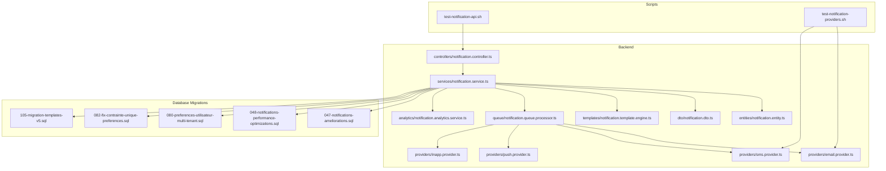
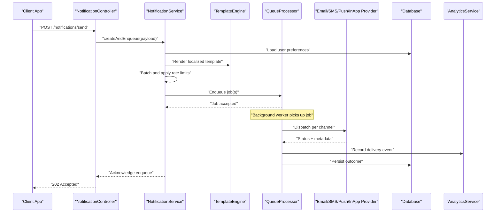
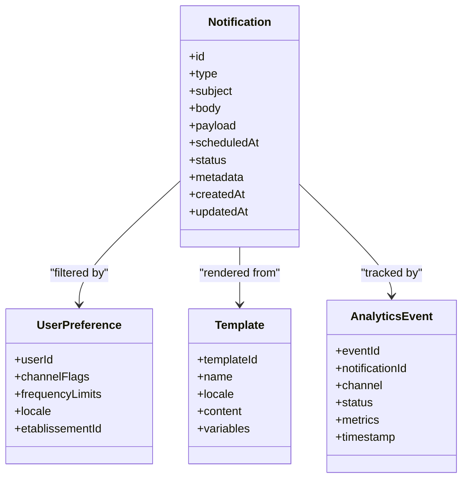
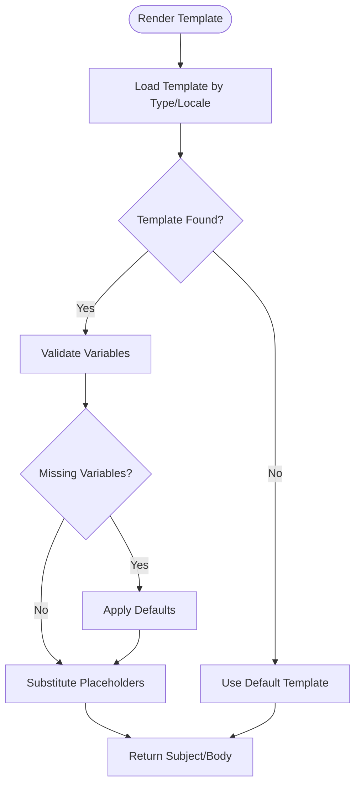
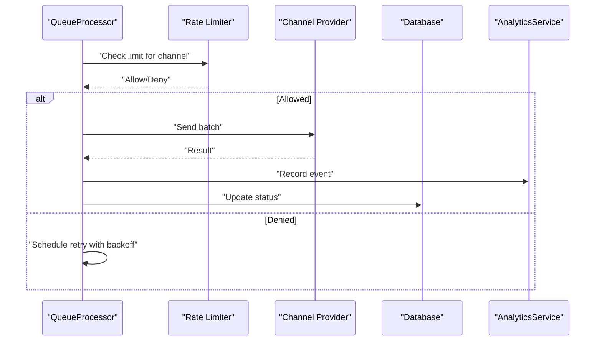
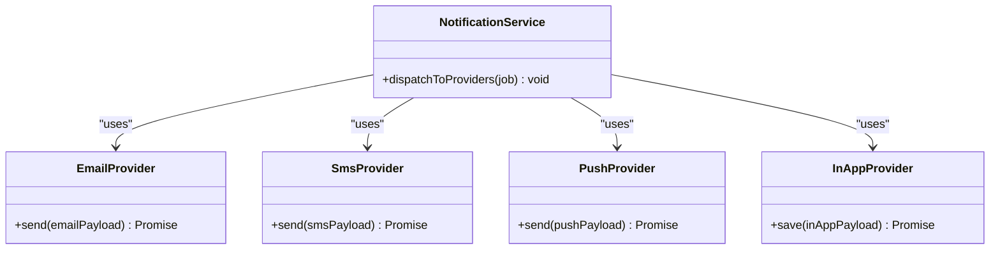
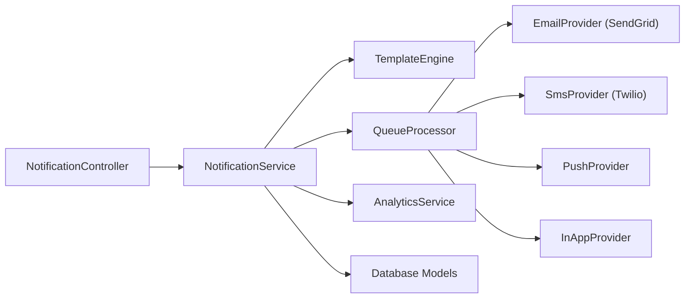

# Notification Engine

<cite>
**Referenced Files in This Document**
- [backend/src/modules/notifications/index.ts](file://backend/src/modules/notifications/index.ts)
- [backend/src/modules/notifications/controllers/notification.controller.ts](file://backend/src/modules/notifications/controllers/notification.controller.ts)
- [backend/src/modules/notifications/services/notification.service.ts](file://backend/src/modules/notifications/services/notification.service.ts)
- [backend/src/modules/notifications/entities/notification.entity.ts](file://backend/src/modules/notifications/entities/notification.entity.ts)
- [backend/src/modules/notifications/dto/notification.dto.ts](file://backend/src/modules/notifications/dto/notification.dto.ts)
- [backend/src/modules/notifications/templates/notification.template.engine.ts](file://backend/src/modules/notifications/templates/notification.template.engine.ts)
- [backend/src/modules/notifications/providers/email.provider.ts](file://backend/src/modules/notifications/providers/email.provider.ts)
- [backend/src/modules/notifications/providers/sms.provider.ts](file://backend/src/modules/notifications/providers/sms.provider.ts)
- [backend/src/modules/notifications/providers/push.provider.ts](file://backend/src/modules/notifications/providers/push.provider.ts)
- [backend/src/modules/notifications/providers/inapp.provider.ts](file://backend/src/modules/notifications/providers/inapp.provider.ts)
- [backend/src/modules/notifications/queue/notification.queue.processor.ts](file://backend/src/modules/notifications/queue/notification.queue.processor.ts)
- [backend/src/modules/notifications/analytics/notification.analytics.service.ts](file://backend/src/modules/notifications/analytics/notification.analytics.service.ts)
- [backend/database/migrations/047-notifications-ameliorations.sql](file://backend/database/migrations/047-notifications-ameliorations.sql)
- [backend/database/migrations/048-notifications-performance-optimizations.sql](file://backend/database/migrations/048-notifications-performance-optimizations.sql)
- [backend/database/migrations/080-preferences-utilisateur-multi-tenant.sql](file://backend/database/migrations/080-preferences-utilisateur-multi-tenant.sql)
- [backend/database/migrations/082-fix-contrainte-unique-preferences.sql](file://backend/database/migrations/082-fix-contrainte-unique-preferences.sql)
- [backend/database/migrations/105-migration-templates-v5.sql](file://backend/database/migrations/105-migration-templates-v5.sql)
- [scripts/test-notification-api.sh](file://scripts/test-notification-api.sh)
- [scripts/test-notification-providers.sh](file://scripts/test-notification-providers.sh)
</cite>

## Table of Contents
1. [Introduction](#introduction)
2. [Project Structure](#project-structure)
3. [Core Components](#core-components)
4. [Architecture Overview](#architecture-overview)
5. [Detailed Component Analysis](#detailed-component-analysis)
6. [Dependency Analysis](#dependency-analysis)
7. [Performance Considerations](#performance-considerations)
8. [Troubleshooting Guide](#troubleshooting-guide)
9. [Conclusion](#conclusion)
10. [Appendices](#appendices)

## Introduction
This document describes the eLISAschool notification engine, a multi-channel system that delivers notifications via email, SMS, push, and in-app channels. It covers the template system with dynamic content insertion and localization, the queuing and retry mechanisms for high-volume delivery, user preferences for channel selection and frequency, practical trigger examples (grade postings, payment confirmations, system alerts), batching and rate limiting strategies, delivery optimization techniques, analytics for success/open rates and engagement, and integrations with external providers such as SendGrid and Twilio.

## Project Structure
The notification engine is implemented under the backend modules directory and includes controllers, services, entities, DTOs, templates, providers, queue processing, and analytics. Database migrations define schema changes for notifications, performance optimizations, user preferences, and template management. Scripts provide testing utilities for API endpoints and provider integrations.

**Diagram sources**
- [backend/src/modules/notifications/controllers/notification.controller.ts](file://backend/src/modules/notifications/controllers/notification.controller.ts)
- [backend/src/modules/notifications/services/notification.service.ts](file://backend/src/modules/notifications/services/notification.service.ts)
- [backend/src/modules/notifications/entities/notification.entity.ts](file://backend/src/modules/notifications/entities/notification.entity.ts)
- [backend/src/modules/notifications/dto/notification.dto.ts](file://backend/src/modules/notifications/dto/notification.dto.ts)
- [backend/src/modules/notifications/templates/notification.template.engine.ts](file://backend/src/modules/notifications/templates/notification.template.engine.ts)
- [backend/src/modules/notifications/providers/email.provider.ts](file://backend/src/modules/notifications/providers/email.provider.ts)
- [backend/src/modules/notifications/providers/sms.provider.ts](file://backend/src/modules/notifications/providers/sms.provider.ts)
- [backend/src/modules/notifications/providers/push.provider.ts](file://backend/src/modules/notifications/providers/push.provider.ts)
- [backend/src/modules/notifications/providers/inapp.provider.ts](file://backend/src/modules/notifications/providers/inapp.provider.ts)
- [backend/src/modules/notifications/queue/notification.queue.processor.ts](file://backend/src/modules/notifications/queue/notification.queue.processor.ts)
- [backend/src/modules/notifications/analytics/notification.analytics.service.ts](file://backend/src/modules/notifications/analytics/notification.analytics.service.ts)
- [backend/database/migrations/047-notifications-ameliorations.sql](file://backend/database/migrations/047-notifications-ameliorations.sql)
- [backend/database/migrations/048-notifications-performance-optimizations.sql](file://backend/database/migrations/048-notifications-performance-optimizations.sql)
- [backend/database/migrations/080-preferences-utilisateur-multi-tenant.sql](file://backend/database/migrations/080-preferences-utilisateur-multi-tenant.sql)
- [backend/database/migrations/082-fix-contrainte-unique-preferences.sql](file://backend/database/migrations/082-fix-contrainte-unique-preferences.sql)
- [backend/database/migrations/105-migration-templates-v5.sql](file://backend/database/migrations/105-migration-templates-v5.sql)
- [scripts/test-notification-api.sh](file://scripts/test-notification-api.sh)
- [scripts/test-notification-providers.sh](file://scripts/test-notification-providers.sh)

**Section sources**
- [backend/src/modules/notifications/index.ts](file://backend/src/modules/notifications/index.ts)
- [backend/database/migrations/047-notifications-ameliorations.sql](file://backend/database/migrations/047-notifications-ameliorations.sql)
- [backend/database/migrations/048-notifications-performance-optimizations.sql](file://backend/database/migrations/048-notifications-performance-optimizations.sql)
- [backend/database/migrations/080-preferences-utilisateur-multi-tenant.sql](file://backend/database/migrations/080-preferences-utilisateur-multi-tenant.sql)
- [backend/database/migrations/082-fix-contrainte-unique-preferences.sql](file://backend/database/migrations/082-fix-contrainte-unique-preferences.sql)
- [backend/database/migrations/105-migration-templates-v5.sql](file://backend/database/migrations/105-migration-templates-v5.sql)
- [scripts/test-notification-api.sh](file://scripts/test-notification-api.sh)
- [scripts/test-notification-providers.sh](file://scripts/test-notification-providers.sh)

## Core Components
- Controller: Exposes REST endpoints to create, list, update, delete, and test notifications. Validates inputs using DTOs and delegates orchestration to the service layer.
- Service: Orchestrates notification lifecycle including template rendering, preference evaluation, batching, queueing, provider dispatch, retries, and analytics recording.
- Entity: Defines persistent fields for notifications, recipients, channels, status, scheduling, and metadata.
- DTO: Enforces request/response schemas for validation and documentation.
- Template Engine: Renders localized templates with dynamic placeholders and context data.
- Providers: Channel-specific implementations for email (SendGrid), SMS (Twilio), push, and in-app.
- Queue Processor: Consumes queued jobs, applies rate limits and backoff, and handles retries on failures.
- Analytics: Tracks delivery outcomes, open/click metrics, and engagement indicators.

**Section sources**
- [backend/src/modules/notifications/controllers/notification.controller.ts](file://backend/src/modules/notifications/controllers/notification.controller.ts)
- [backend/src/modules/notifications/services/notification.service.ts](file://backend/src/modules/notifications/services/notification.service.ts)
- [backend/src/modules/notifications/entities/notification.entity.ts](file://backend/src/modules/notifications/entities/notification.entity.ts)
- [backend/src/modules/notifications/dto/notification.dto.ts](file://backend/src/modules/notifications/dto/notification.dto.ts)
- [backend/src/modules/notifications/templates/notification.template.engine.ts](file://backend/src/modules/notifications/templates/notification.template.engine.ts)
- [backend/src/modules/notifications/providers/email.provider.ts](file://backend/src/modules/notifications/providers/email.provider.ts)
- [backend/src/modules/notifications/providers/sms.provider.ts](file://backend/src/modules/notifications/providers/sms.provider.ts)
- [backend/src/modules/notifications/providers/push.provider.ts](file://backend/src/modules/notifications/providers/push.provider.ts)
- [backend/src/modules/notifications/providers/inapp.provider.ts](file://backend/src/modules/notifications/providers/inapp.provider.ts)
- [backend/src/modules/notifications/queue/notification.queue.processor.ts](file://backend/src/modules/notifications/queue/notification.queue.processor.ts)
- [backend/src/modules/notifications/analytics/notification.analytics.service.ts](file://backend/src/modules/notifications/analytics/notification.analytics.service.ts)

## Architecture Overview
The notification engine follows a layered architecture:
- Controllers handle HTTP requests and delegate to services.
- Services coordinate business logic, template rendering, preference checks, batching, and queue submission.
- Queue processor executes deliveries asynchronously with retries and rate limiting.
- Providers encapsulate third-party integrations.
- Analytics records events for reporting and dashboards.
- Database migrations define schema evolution for notifications, preferences, and templates.

**Diagram sources**
- [backend/src/modules/notifications/controllers/notification.controller.ts](file://backend/src/modules/notifications/controllers/notification.controller.ts)
- [backend/src/modules/notifications/services/notification.service.ts](file://backend/src/modules/notifications/services/notification.service.ts)
- [backend/src/modules/notifications/templates/notification.template.engine.ts](file://backend/src/modules/notifications/templates/notification.template.engine.ts)
- [backend/src/modules/notifications/queue/notification.queue.processor.ts](file://backend/src/modules/notifications/queue/notification.queue.processor.ts)
- [backend/src/modules/notifications/providers/email.provider.ts](file://backend/src/modules/notifications/providers/email.provider.ts)
- [backend/src/modules/notifications/providers/sms.provider.ts](file://backend/src/modules/notifications/providers/sms.provider.ts)
- [backend/src/modules/notifications/providers/push.provider.ts](file://backend/src/modules/notifications/providers/push.provider.ts)
- [backend/src/modules/notifications/providers/inapp.provider.ts](file://backend/src/modules/notifications/providers/inapp.provider.ts)
- [backend/src/modules/notifications/analytics/notification.analytics.service.ts](file://backend/src/modules/notifications/analytics/notification.analytics.service.ts)

## Detailed Component Analysis

### Controller Layer
- Responsibilities:
  - Validate incoming payloads using DTOs.
  - Accept bulk send requests and return immediate acknowledgment.
  - Provide endpoints for listing, updating, deleting, and testing notifications.
- Key behaviors:
  - Input sanitization and schema enforcement.
  - Delegation to service for async processing.
  - Error mapping to consistent HTTP responses.

**Section sources**
- [backend/src/modules/notifications/controllers/notification.controller.ts](file://backend/src/modules/notifications/controllers/notification.controller.ts)
- [backend/src/modules/notifications/dto/notification.dto.ts](file://backend/src/modules/notifications/dto/notification.dto.ts)

### Service Layer
- Responsibilities:
  - Resolve recipient preferences and filter channels accordingly.
  - Render templates with dynamic content and localization.
  - Apply batching and rate limiting before enqueuing.
  - Record analytics events for each step.
- Key behaviors:
  - Preference resolution across tenant boundaries.
  - Template variable substitution and fallback handling.
  - Batch creation to reduce provider overhead.
  - Idempotency keys for safe retries.

**Section sources**
- [backend/src/modules/notifications/services/notification.service.ts](file://backend/src/modules/notifications/services/notification.service.ts)
- [backend/src/modules/notifications/templates/notification.template.engine.ts](file://backend/src/modules/notifications/templates/notification.template.engine.ts)
- [backend/database/migrations/080-preferences-utilisateur-multi-tenant.sql](file://backend/database/migrations/080-preferences-utilisateur-multi-tenant.sql)
- [backend/database/migrations/082-fix-contrainte-unique-preferences.sql](file://backend/database/migrations/082-fix-contrainte-unique-preferences.sql)

### Entities and Data Model
- Notification entity captures:
  - Type, subject/body, payload, scheduled time, status, and metadata.
  - Recipient identifiers and channel flags.
  - Delivery results and error details.
- Relationships:
  - Ties to users and tenants for multi-tenant isolation.
  - Links to template definitions and analytics records.

**Diagram sources**
- [backend/src/modules/notifications/entities/notification.entity.ts](file://backend/src/modules/notifications/entities/notification.entity.ts)
- [backend/database/migrations/080-preferences-utilisateur-multi-tenant.sql](file://backend/database/migrations/080-preferences-utilisateur-multi-tenant.sql)
- [backend/database/migrations/105-migration-templates-v5.sql](file://backend/database/migrations/105-migration-templates-v5.sql)
- [backend/src/modules/notifications/analytics/notification.analytics.service.ts](file://backend/src/modules/notifications/analytics/notification.analytics.service.ts)

**Section sources**
- [backend/src/modules/notifications/entities/notification.entity.ts](file://backend/src/modules/notifications/entities/notification.entity.ts)
- [backend/database/migrations/047-notifications-ameliorations.sql](file://backend/database/migrations/047-notifications-ameliorations.sql)
- [backend/database/migrations/048-notifications-performance-optimizations.sql](file://backend/database/migrations/048-notifications-performance-optimizations.sql)
- [backend/database/migrations/080-preferences-utilisateur-multi-tenant.sql](file://backend/database/migrations/080-preferences-utilisateur-multi-tenant.sql)
- [backend/database/migrations/082-fix-contrainte-unique-preferences.sql](file://backend/database/migrations/082-fix-contrainte-unique-preferences.sql)
- [backend/database/migrations/105-migration-templates-v5.sql](file://backend/database/migrations/105-migration-templates-v5.sql)

### Template System
- Features:
  - Dynamic placeholder substitution based on payload context.
  - Localization support via locale-aware templates.
  - Fallbacks when variables are missing or templates are unavailable.
- Usage patterns:
  - Select template by type and locale.
  - Inject variables like recipient name, grade values, payment details, alert severity.
  - Produce final subject and body strings for each channel.

**Diagram sources**
- [backend/src/modules/notifications/templates/notification.template.engine.ts](file://backend/src/modules/notifications/templates/notification.template.engine.ts)
- [backend/database/migrations/105-migration-templates-v5.sql](file://backend/database/migrations/105-migration-templates-v5.sql)

**Section sources**
- [backend/src/modules/notifications/templates/notification.template.engine.ts](file://backend/src/modules/notifications/templates/notification.template.engine.ts)
- [backend/database/migrations/105-migration-templates-v5.sql](file://backend/database/migrations/105-migration-templates-v5.sql)

### Queuing and Retry Mechanisms
- Queue processor responsibilities:
  - Consume jobs and dispatch to appropriate providers.
  - Apply per-channel rate limits and throttling.
  - Implement exponential backoff and max retry counts.
  - Persist delivery outcomes and errors.
- Batching:
  - Group recipients to minimize provider calls.
  - Respect provider quotas and avoid bursts.

**Diagram sources**
- [backend/src/modules/notifications/queue/notification.queue.processor.ts](file://backend/src/modules/notifications/queue/notification.queue.processor.ts)
- [backend/src/modules/notifications/providers/email.provider.ts](file://backend/src/modules/notifications/providers/email.provider.ts)
- [backend/src/modules/notifications/providers/sms.provider.ts](file://backend/src/modules/notifications/providers/sms.provider.ts)
- [backend/src/modules/notifications/providers/push.provider.ts](file://backend/src/modules/notifications/providers/push.provider.ts)
- [backend/src/modules/notifications/providers/inapp.provider.ts](file://backend/src/modules/notifications/providers/inapp.provider.ts)
- [backend/src/modules/notifications/analytics/notification.analytics.service.ts](file://backend/src/modules/notifications/analytics/notification.analytics.service.ts)

**Section sources**
- [backend/src/modules/notifications/queue/notification.queue.processor.ts](file://backend/src/modules/notifications/queue/notification.queue.processor.ts)
- [backend/database/migrations/048-notifications-performance-optimizations.sql](file://backend/database/migrations/048-notifications-performance-optimizations.sql)

### Provider Integrations
- Email Provider:
  - Uses SendGrid configuration for sending emails.
  - Supports HTML/text bodies and attachments where applicable.
- SMS Provider:
  - Uses Twilio credentials and phone number formatting.
  - Handles carrier-specific constraints and message length.
- Push Provider:
  - Manages device tokens and platform-specific payloads.
- In-App Provider:
  - Persists in-app notifications for UI display and read receipts.

**Diagram sources**
- [backend/src/modules/notifications/providers/email.provider.ts](file://backend/src/modules/notifications/providers/email.provider.ts)
- [backend/src/modules/notifications/providers/sms.provider.ts](file://backend/src/modules/notifications/providers/sms.provider.ts)
- [backend/src/modules/notifications/providers/push.provider.ts](file://backend/src/modules/notifications/providers/push.provider.ts)
- [backend/src/modules/notifications/providers/inapp.provider.ts](file://backend/src/modules/notifications/providers/inapp.provider.ts)
- [backend/src/modules/notifications/services/notification.service.ts](file://backend/src/modules/notifications/services/notification.service.ts)

**Section sources**
- [backend/src/modules/notifications/providers/email.provider.ts](file://backend/src/modules/notifications/providers/email.provider.ts)
- [backend/src/modules/notifications/providers/sms.provider.ts](file://backend/src/modules/notifications/providers/sms.provider.ts)
- [backend/src/modules/notifications/providers/push.provider.ts](file://backend/src/modules/notifications/providers/push.provider.ts)
- [backend/src/modules/notifications/providers/inapp.provider.ts](file://backend/src/modules/notifications/providers/inapp.provider.ts)

### User Preferences and Frequency Controls
- Capabilities:
  - Per-user channel toggles (email, SMS, push, in-app).
  - Frequency caps to prevent notification fatigue.
  - Locale settings for template selection.
  - Multi-tenant scoping by etablissementId.
- Enforcement:
  - Service filters recipients per preferences before batching.
  - Queue respects frequency windows and cooldowns.

**Section sources**
- [backend/database/migrations/080-preferences-utilisateur-multi-tenant.sql](file://backend/database/migrations/080-preferences-utilisateur-multi-tenant.sql)
- [backend/database/migrations/082-fix-contrainte-unique-preferences.sql](file://backend/database/migrations/082-fix-contrainte-unique-preferences.sql)
- [backend/src/modules/notifications/services/notification.service.ts](file://backend/src/modules/notifications/services/notification.service.ts)

### Practical Trigger Examples
- Grade Postings:
  - Triggered when grades are published; renders academic report template; sends email and in-app; optional SMS if enabled.
- Payment Confirmations:
  - Triggered upon successful payments; renders receipt template; sends email and push; includes payment summary variables.
- System Alerts:
  - High-severity alerts rendered with urgent template; sent via all enabled channels; may bypass frequency limits based on policy.

These flows use the same pipeline: controller receives event, service renders template, applies preferences, batches, enqueues, and providers deliver.

[No sources needed since this section provides conceptual usage patterns]

## Dependency Analysis
The notification module depends on:
- External providers: SendGrid (email), Twilio (SMS), push SDKs, and internal in-app storage.
- Database: Persistent models for notifications, preferences, templates, and analytics.
- Queue infrastructure: Background workers for asynchronous processing.
- Configuration: Environment variables for provider credentials and rate limits.

**Diagram sources**
- [backend/src/modules/notifications/controllers/notification.controller.ts](file://backend/src/modules/notifications/controllers/notification.controller.ts)
- [backend/src/modules/notifications/services/notification.service.ts](file://backend/src/modules/notifications/services/notification.service.ts)
- [backend/src/modules/notifications/templates/notification.template.engine.ts](file://backend/src/modules/notifications/templates/notification.template.engine.ts)
- [backend/src/modules/notifications/queue/notification.queue.processor.ts](file://backend/src/modules/notifications/queue/notification.queue.processor.ts)
- [backend/src/modules/notifications/providers/email.provider.ts](file://backend/src/modules/notifications/providers/email.provider.ts)
- [backend/src/modules/notifications/providers/sms.provider.ts](file://backend/src/modules/notifications/providers/sms.provider.ts)
- [backend/src/modules/notifications/providers/push.provider.ts](file://backend/src/modules/notifications/providers/push.provider.ts)
- [backend/src/modules/notifications/providers/inapp.provider.ts](file://backend/src/modules/notifications/providers/inapp.provider.ts)
- [backend/src/modules/notifications/analytics/notification.analytics.service.ts](file://backend/src/modules/notifications/analytics/notification.analytics.service.ts)

**Section sources**
- [backend/src/modules/notifications/index.ts](file://backend/src/modules/notifications/index.ts)

## Performance Considerations
- Batching:
  - Group recipients per channel to reduce provider calls and improve throughput.
- Rate Limiting:
  - Enforce per-channel limits to respect provider quotas and avoid throttling.
- Backpressure:
  - Queue depth monitoring and scaling workers based on load.
- Indexing:
  - Optimized database indexes for queries on notification status, timestamps, and recipient IDs.
- Caching:
  - Cache frequently accessed templates and preferences to reduce DB hits.

[No sources needed since this section provides general guidance]

## Troubleshooting Guide
- Common issues:
  - Provider authentication failures: verify environment credentials for SendGrid/Twilio.
  - Rate limit exceeded: adjust batch sizes and intervals; monitor provider response codes.
  - Template rendering errors: ensure required variables exist and locales are configured.
  - Preference misconfiguration: validate user toggles and frequency windows.
- Diagnostics:
  - Use provided scripts to test API endpoints and provider connectivity.
  - Inspect analytics events for failure reasons and retry attempts.

**Section sources**
- [scripts/test-notification-api.sh](file://scripts/test-notification-api.sh)
- [scripts/test-notification-providers.sh](file://scripts/test-notification-providers.sh)
- [backend/src/modules/notifications/analytics/notification.analytics.service.ts](file://backend/src/modules/notifications/analytics/notification.analytics.service.ts)

## Conclusion
The eLISAschool notification engine provides a robust, scalable, and configurable system for delivering multi-channel notifications. With strong template localization, preference-driven routing, efficient batching and rate limiting, reliable retries, and comprehensive analytics, it supports critical school operations such as grade postings, payment confirmations, and system alerts. Integrations with SendGrid and Twilio ensure dependable external delivery while maintaining operational control and observability.

[No sources needed since this section summarizes without analyzing specific files]

## Appendices

### API Testing Utilities
- End-to-end tests for notification endpoints and provider integrations are available via shell scripts.
- Use these scripts to validate configurations, simulate triggers, and inspect provider responses.

**Section sources**
- [scripts/test-notification-api.sh](file://scripts/test-notification-api.sh)
- [scripts/test-notification-providers.sh](file://scripts/test-notification-providers.sh)