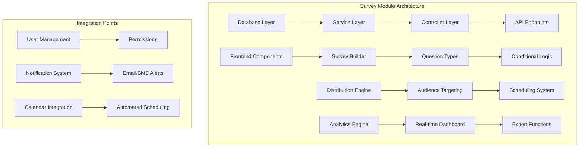
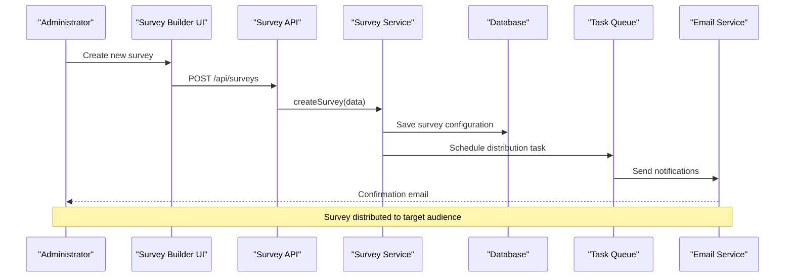
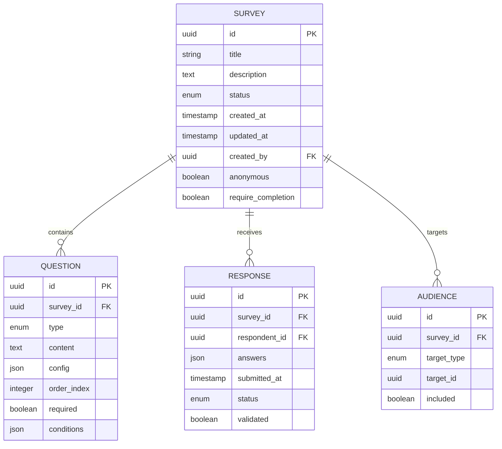
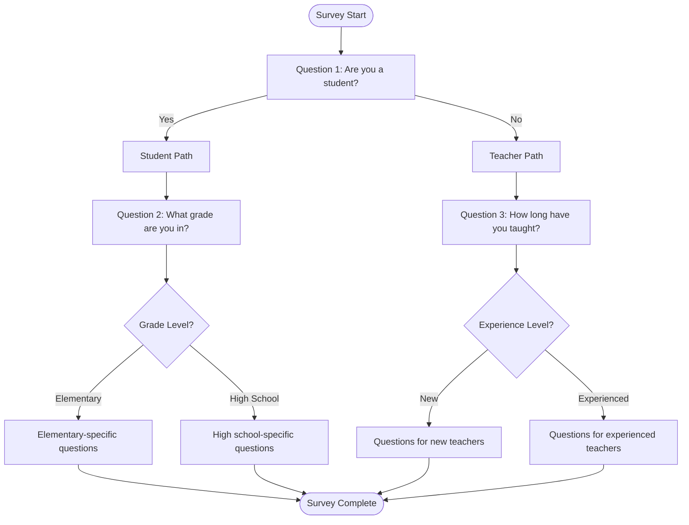

# Survey & Polling System

<cite>
**Referenced Files in This Document**
- [041-module-sondages.sql](file://backend/database/migrations/041-module-sondages.sql)
- [042-sondages-recurrents.sql](file://backend/database/migrations/042-sondages-recurrents.sql)
- [IMPLEMENTATION-MODULE-SONDAGES.md](file://docs/implementations/IMPLEMENTATION-MODULE-SONDAGES.md)
- [RESUME-FINAL-SONDAGES.md](file://docs/resumes/RESUME-FINAL-SONDAGES.md)
- [deploy-sondages.sh](file://scripts/deploy-sondages.sh)
</cite>

## Table of Contents
1. [Introduction](#introduction)
2. [Project Structure](#project-structure)
3. [Core Components](#core-components)
4. [Architecture Overview](#architecture-overview)
5. [Detailed Component Analysis](#detailed-component-analysis)
6. [Survey Creation Interface](#survey-creation-interface)
7. [Distribution System](#distribution-system)
8. [Response Collection System](#response-collection-system)
9. [Polling Feature](#polling-feature)
10. [Practical Examples](#practical-examples)
11. [Advanced Features](#advanced-features)
12. [Performance Considerations](#performance-considerations)
13. [Troubleshooting Guide](#troubleshooting-guide)
14. [Conclusion](#conclusion)

## Introduction

The eLISAschool Survey & Polling System is a comprehensive module designed to facilitate academic feedback collection, teacher evaluations, parent satisfaction surveys, and quick decision-making through polls. The system supports various question types, conditional branching logic, targeted distribution to specific audiences, real-time analytics, and automated workflows.

This module integrates seamlessly with eLISAschool's multi-tenant architecture, providing institutions with powerful tools for gathering insights from students, teachers, parents, and staff members.

## Project Structure

The survey and polling system follows eLISAschool's modular architecture pattern, with dedicated database migrations, backend services, and frontend components organized within the `sondages` module.

**Diagram sources**
- [041-module-sondages.sql](file://backend/database/migrations/041-module-sondages.sql)
- [042-sondages-recurrents.sql](file://backend/database/migrations/042-sondages-recurrents.sql)

**Section sources**
- [041-module-sondages.sql](file://backend/database/migrations/041-module-sondages.sql)
- [042-sondages-recurrents.sql](file://backend/database/migrations/042-sondages-recurrents.sql)

## Core Components

The survey and polling system consists of several core components that work together to provide comprehensive functionality:

### Database Schema
The system uses a normalized database design with tables for surveys, questions, responses, and distribution targeting.

### Question Type Engine
Supports multiple question formats including multiple choice, text input, rating scales, yes/no questions, and custom question types.

### Distribution Manager
Handles audience targeting, scheduling, and delivery of surveys to specific groups such as all students, specific classes, or parent groups.

### Response Analytics
Provides real-time analytics, response validation, export capabilities, and automated follow-up workflows.

### Polling System
Enables quick decision-making with instant results visualization and simple interface for creating temporary polls.

**Section sources**
- [IMPLEMENTATION-MODULE-SONDAGES.md](file://docs/implementations/IMPLEMENTATION-MODULE-SONDAGES.md)
- [RESUME-FINAL-SONDAGES.md](file://docs/resumes/RESUME-FINAL-SONDAGES.md)

## Architecture Overview

The survey and polling system follows a microservices-inspired architecture within the monolithic application structure, ensuring scalability and maintainability.

**Diagram sources**
- [041-module-sondages.sql](file://backend/database/migrations/041-module-sondages.sql)
- [042-sondages-recurrents.sql](file://backend/database/migrations/042-sondages-recurrents.sql)

## Detailed Component Analysis

### Survey Data Model

The survey system implements a flexible data model that supports various question types and complex survey logic:

**Diagram sources**
- [041-module-sondages.sql](file://backend/database/migrations/041-module-sondages.sql)

### Question Type Implementation

The system supports multiple question types with specialized validation and rendering logic:

#### Multiple Choice Questions
- Single selection from predefined options
- Support for custom option creation
- Validation rules for required fields

#### Text Input Questions
- Free-form text responses
- Character limits and format validation
- Rich text support for detailed feedback

#### Rating Scale Questions
- Numeric rating scales (1-5, 1-10)
- Customizable scale labels
- Statistical analysis support

#### Yes/No Questions
- Binary response options
- Quick completion workflow
- Simplified analytics

**Section sources**
- [041-module-sondages.sql](file://backend/database/migrations/041-module-sondages.sql)

## Survey Creation Interface

The survey creation interface provides an intuitive drag-and-drop builder that supports various question types and advanced logic features.

### Question Builder Features

#### Visual Question Editor
- Drag-and-drop interface for question arrangement
- Real-time preview of survey appearance
- Mobile-responsive design testing
- Multi-language support for international schools

#### Advanced Question Configuration
- Conditional branching based on previous answers
- Randomization of question order
- Skip logic for irrelevant sections
- Progress indicators and time estimates

#### Template System
- Pre-built survey templates for common use cases
- Academic feedback templates
- Teacher evaluation frameworks
- Parent satisfaction surveys
- Custom template creation and sharing

### Conditional Branching Logic

The system supports sophisticated conditional logic that adapts survey flow based on respondent answers:

**Diagram sources**
- [041-module-sondages.sql](file://backend/database/migrations/041-module-sondages.sql)

**Section sources**
- [IMPLEMENTATION-MODULE-SONDAGES.md](file://docs/implementations/IMPLEMENTATION-MODULE-SONDAGES.md)

## Distribution System

The distribution system enables precise targeting of surveys to specific audiences within the school ecosystem.

### Audience Targeting Options

#### All Students
- Distribute to entire student population
- Filter by grade level, class, or program
- Exclude specific student groups when needed

#### Specific Classes
- Target individual classes or groups of classes
- Include substitute teachers and class assistants
- Respect class schedules and availability

#### Parent Groups
- Distribute to parents of specific students
- Target parent associations or committees
- Support for guardian relationships and shared accounts

#### Staff Members
- Faculty-wide distributions
- Department-specific surveys
- Administrative staff targeting

### Scheduling and Automation

#### One-time Surveys
- Immediate distribution upon activation
- Manual start and stop controls
- Deadline enforcement with reminders

#### Recurring Surveys
- Weekly, monthly, or semester-based schedules
- Automatic renewal and archiving
- Historical data comparison across periods

#### Event-triggered Surveys
- Post-class evaluation triggers
- After-parent-teacher meeting surveys
- Incident response feedback collection

**Section sources**
- [042-sondages-recurrents.sql](file://backend/database/migrations/042-sondages-recurrents.sql)

## Response Collection System

The response collection system ensures data integrity, provides real-time analytics, and offers comprehensive export capabilities.

### Real-time Analytics Dashboard

#### Live Response Tracking
- Real-time response count and completion rates
- Geographic distribution mapping
- Demographic breakdowns
- Trend analysis and forecasting

#### Interactive Data Visualization
- Dynamic charts and graphs
- Drill-down capabilities for detailed analysis
- Comparative analysis across time periods
- Export-ready visualizations

#### Automated Insights
- AI-powered sentiment analysis
- Anomaly detection in response patterns
- Actionable recommendations generation
- Benchmark comparisons

### Response Validation

#### Data Quality Assurance
- Format validation for structured responses
- Plausibility checks for numerical ratings
- Duplicate response detection
- Incomplete response handling

#### Privacy and Compliance
- GDPR-compliant data handling
- Anonymous response processing
- Data retention policy enforcement
- Audit trail maintenance

### Export Capabilities

#### Multiple Format Support
- CSV export for spreadsheet analysis
- PDF reports for presentations
- JSON export for system integration
- Excel files with formatted worksheets

#### Custom Report Generation
- Template-based report creation
- Scheduled report delivery
- Watermarked confidential reports
- Multi-language report support

**Section sources**
- [IMPLEMENTATION-MODULE-SONDAGES.md](file://docs/implementations/IMPLEMENTATION-MODULE-SONDAGES.md)

## Polling Feature

The polling feature provides a lightweight solution for quick decision-making and immediate feedback collection.

### Quick Poll Creation

#### Simple Interface
- One-click poll creation
- Minimal setup requirements
- Instant sharing via links or QR codes
- Social media integration

#### Poll Types
- Yes/No decisions
- Multiple choice options
- Ranking preferences
- Open-ended suggestions

### Instant Results Visualization

#### Real-time Updates
- Live result counting
- Animated progress bars
- Percentage calculations
- Response rate tracking

#### Sharing and Embedding
- Shareable result pages
- Embedded widgets for websites
- Social media posting
- Email result summaries

### Use Cases

#### Classroom Decisions
- Voting on class activities
- Selecting group project topics
- Choosing presentation dates
- Evaluating teaching methods

#### Administrative Decisions
- Policy change feedback
- Facility improvement suggestions
- Event planning input
- Resource allocation priorities

**Section sources**
- [041-module-sondages.sql](file://backend/database/migrations/041-module-sondages.sql)

## Practical Examples

### Academic Feedback Surveys

#### Semester Evaluation Process
1. **Template Selection**: Choose academic feedback template
2. **Customization**: Adapt questions to specific subjects
3. **Targeting**: Assign to relevant student groups
4. **Scheduling**: Set up automatic distribution
5. **Analysis**: Review aggregated feedback

#### Subject-Specific Assessments
- Course effectiveness ratings
- Learning outcome evaluations
- Teaching methodology feedback
- Resource adequacy assessment

### Teacher Evaluation Framework

#### Peer Review System
- Confidential colleague assessments
- Standardized evaluation criteria
- Development-focused feedback
- Professional growth tracking

#### Student Feedback Collection
- Anonymous student evaluations
- Teaching style assessment
- Classroom environment feedback
- Learning support evaluation

### Parent Satisfaction Surveys

#### Annual Satisfaction Assessment
- Overall school experience rating
- Communication effectiveness
- Academic program quality
- Extracurricular activities feedback

#### Event-specific Surveys
- Parent-teacher conference feedback
- School event satisfaction
- Program participation evaluation
- Community engagement assessment

**Section sources**
- [IMPLEMENTATION-MODULE-SONDAGES.md](file://docs/implementations/IMPLEMENTATION-MODULE-SONDAGES.md)

## Advanced Features

### Response Anonymity Options

#### Anonymous Mode
- No personal identification collected
- IP address masking
- Device fingerprinting disabled
- Secure data transmission

#### Semi-anonymous Responses
- Group-level attribution without individual identification
- Demographic analysis without personal details
- Aggregated reporting with privacy protection

#### Controlled Access
- Role-based response viewing
- Permission-controlled analytics access
- Audit logging for data access
- Data retention policies

### Survey Completion Tracking

#### Progress Monitoring
- Real-time completion status
- Drop-off point analysis
- Time spent per question
- Mobile vs desktop completion rates

#### Automated Reminders
- Email notification system
- SMS reminder service
- In-app notification alerts
- Escalation protocols for non-response

### Automated Follow-up Workflows

#### Response-triggered Actions
- Automatic email acknowledgments
- Task assignment for critical feedback
- Alert systems for urgent issues
- Integration with case management

#### Workflow Integration
- CRM system synchronization
- Help desk ticket creation
- Performance review automation
- Continuous improvement cycles

**Section sources**
- [041-module-sondages.sql](file://backend/database/migrations/041-module-sondages.sql)
- [042-sondages-recurrents.sql](file://backend/database/migrations/042-sondages-recurrents.sql)

## Performance Considerations

### Scalability Architecture

#### Database Optimization
- Indexed query optimization for large datasets
- Partitioned tables for historical data
- Connection pooling for concurrent access
- Read replicas for analytics queries

#### Caching Strategies
- Redis caching for frequently accessed data
- CDN integration for static assets
- Query result caching
- Session state management

### Load Handling

#### Concurrent User Support
- Horizontal scaling capabilities
- Load balancing configuration
- Rate limiting implementation
- Graceful degradation under load

#### Data Processing Efficiency
- Asynchronous job processing
- Batch operations for bulk updates
- Streaming analytics computation
- Memory-efficient data handling

## Troubleshooting Guide

### Common Issues and Solutions

#### Survey Not Distributing
- Check audience targeting configuration
- Verify scheduling settings
- Confirm email service connectivity
- Review permission settings

#### Response Collection Problems
- Validate form submission endpoints
- Check database connectivity
- Monitor error logs for exceptions
- Verify response validation rules

#### Analytics Display Issues
- Clear browser cache
- Check data aggregation jobs
- Verify chart rendering libraries
- Test mobile responsiveness

### Performance Monitoring

#### Key Metrics to Track
- Response collection rate
- Average completion time
- System resource utilization
- Error rate monitoring

#### Diagnostic Tools
- Built-in health check endpoints
- Performance profiling utilities
- Error tracking and alerting
- Usage analytics dashboard

**Section sources**
- [deploy-sondages.sh](file://scripts/deploy-sondages.sh)

## Conclusion

The eLISAschool Survey & Polling System provides a comprehensive solution for educational institutions seeking to gather meaningful feedback and make data-driven decisions. With its flexible question types, sophisticated distribution mechanisms, real-time analytics, and robust security features, the system supports diverse use cases from academic evaluations to administrative decision-making.

The modular architecture ensures scalability and maintainability, while the intuitive interfaces enable users at all technical levels to create effective surveys and polls. The integration with existing school management systems and compliance with data protection regulations makes it a reliable choice for educational institutions worldwide.

Future enhancements may include advanced AI-powered analytics, expanded integration capabilities, and enhanced mobile experiences to further improve the user experience and analytical insights.