# Configuration & Environment Management

<cite>
**Referenced Files in This Document**
- [env.config.ts](file://backend/src/config/env.config.ts)
- [database.config.ts](file://backend/src/config/database.config.ts)
- [index.ts](file://backend/src/config/index.ts)
- [config.registry.ts](file://shared/src/config/config.registry.ts)
- [configuration.service.ts](file://backend/src/modules/configuration/services/configuration.service.ts)
- [configuration-listener.ts](file://backend/src/modules/configuration/services/configuration-listener.ts)
- [configuration-history.service.ts](file://backend/src/modules/configuration/services/configuration-history.service.ts)
- [config.helper.ts](file://backend/src/modules/configuration/utils/config.helper.ts)
- [configuration-app.entity.ts](file://backend/src/modules/configuration/entities/configuration-app.entity.ts)
- [parametre-systeme.entity.ts](file://backend/src/modules/configuration/entities/parametre-systeme.entity.ts)
- [backup-record.entity.ts](file://backend/src/modules/configuration/entities/backup-record.entity.ts)
- [config-backup.service.ts](file://backend/src/modules/configuration/services/backup/config-backup.service.ts)
- [database-backup.service.ts](file://backend/src/modules/configuration/services/backup/database-backup.service.ts)
- [storage-provider.interface.ts](file://backend/src/modules/configuration/services/storage/storage-provider.interface.ts)
- [database-storage.provider.ts](file://backend/src/modules/configuration/services/storage/database-storage.provider.ts)
- [backup.controller.ts](file://backend/src/modules/configuration/controllers/backup.controller.ts)
- [docker-compose.yml](file://docker/docker-compose.yml)
- [package.json](file://backend/package.json)
- [CONFIGURATION_100_PERCENT.md](file://CONFIGURATION_100_PERCENT.md)
- [run-config-100-migration.sh](file://backend/scripts/run-config-100-migration.sh)
- [run-config-migration.sh](file://backend/scripts/run-config-migration.sh)
- [BACKUP-SYSTEM-IMPLEMENTATION-COMPLETE.md](file://BACKUP-SYSTEM-IMPLEMENTATION-COMPLETE.md)
- [BACKUP-SYSTEM-USER-GUIDE.md](file://BACKUP-SYSTEM-USER-GUIDE.md)
</cite>

## Update Summary
**Changes Made**
- Enhanced backup and restore procedures documentation with comprehensive backup/restore workflows
- Added storage provider integration details for the new backup system
- Documented multi-tenant backup capabilities with establishment-specific backup management
- Updated backup system architecture with versioning, compression, encryption, and integrity validation
- Added detailed backup controller endpoints and API usage examples
- Expanded backup and restore procedures with transactional safety and error handling

## Table of Contents
1. [Introduction](#introduction)
2. [Project Structure](#project-structure)
3. [Core Components](#core-components)
4. [Architecture Overview](#architecture-overview)
5. [Detailed Component Analysis](#detailed-component-analysis)
6. [Enhanced Backup & Restore System](#enhanced-backup--restore-system)
7. [Storage Provider Integration](#storage-provider-integration)
8. [Multi-Tenant Backup Capabilities](#multi-tenant-backup-capabilities)
9. [Backup Controller & API Endpoints](#backup-controller--api-endpoints)
10. [100% Configuration Coverage System](#100-configuration-coverage-system)
11. [Migration Scripts and Implementation Guides](#migration-scripts-and-implementation-guides)
12. [User Guide and Practical Implementation](#user-guide-and-practical-implementation)
13. [Dependency Analysis](#dependency-analysis)
14. [Performance Considerations](#performance-considerations)
15. [Troubleshooting Guide](#troubleshooting-guide)
16. [Conclusion](#conclusion)
17. [Appendices](#appendices)

## Introduction
This document explains how eLISAschool manages configuration and environments across the backend with comprehensive 100% configuration coverage and enhanced backup/restore capabilities. It covers environment variable validation and defaults, database connection settings, application-wide configuration, the configuration registry for modules, runtime configuration updates, environment-specific settings, deployment configuration, and detailed migration strategies. The system now includes complete configuration management with user-friendly interfaces, automated migration scripts, comprehensive implementation guides, and a sophisticated backup system supporting multi-tenant operations.

## Project Structure
Configuration spans four main areas with enhanced backup capabilities:
- Environment variables and database configuration loaded at startup
- Shared module registry defining default module behavior and settings
- Runtime configuration service managing application, module, and system parameters with persistence, caching, and change events
- **New**: Enhanced backup system with storage provider integration, multi-tenant backup capabilities, and comprehensive backup/restore workflows
- **New**: Versioning system with semantic versioning, compression, encryption, and integrity validation
- **New**: Backup controller with REST API endpoints for backup management
- **New**: Automated migration scripts for seamless configuration updates

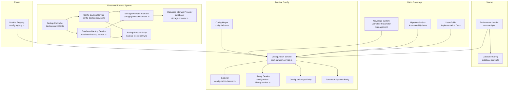

**Diagram sources**
- [env.config.ts:1-168](file://backend/src/config/env.config.ts#L1-L168)
- [database.config.ts:1-54](file://backend/src/config/database.config.ts#L1-L54)
- [config.registry.ts:1-414](file://shared/src/config/config.registry.ts#L1-L414)
- [configuration.service.ts:1-604](file://backend/src/modules/configuration/services/configuration.service.ts#L1-L604)
- [configuration-listener.ts:1-144](file://backend/src/modules/configuration/services/configuration-listener.ts#L1-L144)
- [configuration-history.service.ts:1-267](file://backend/src/modules/configuration/services/configuration-history.service.ts#L1-L267)
- [config.helper.ts:1-131](file://backend/src/modules/configuration/utils/config.helper.ts#L1-L131)
- [configuration-app.entity.ts:1-112](file://backend/src/modules/configuration/entities/configuration-app.entity.ts#L1-L112)
- [parametre-systeme.entity.ts:1-122](file://backend/src/modules/configuration/entities/parametre-systeme.entity.ts#L1-L122)
- [config-backup.service.ts:1-605](file://backend/src/modules/configuration/services/backup/config-backup.service.ts#L1-L605)
- [database-backup.service.ts:1-400](file://backend/src/modules/configuration/services/backup/database-backup.service.ts#L1-L400)
- [storage-provider.interface.ts:1-200](file://backend/src/modules/configuration/services/storage/storage-provider.interface.ts#L1-L200)
- [database-storage.provider.ts:1-300](file://backend/src/modules/configuration/services/storage/database-storage.provider.ts#L1-L300)
- [backup.controller.ts:1-300](file://backend/src/modules/configuration/controllers/backup.controller.ts#L1-L300)
- [backup-record.entity.ts:1-200](file://backend/src/modules/configuration/entities/backup-record.entity.ts#L1-L200)

**Section sources**
- [env.config.ts:1-168](file://backend/src/config/env.config.ts#L1-L168)
- [database.config.ts:1-54](file://backend/src/config/database.config.ts#L1-L54)
- [config.registry.ts:1-414](file://shared/src/config/config.registry.ts#L1-L414)
- [configuration.service.ts:1-604](file://backend/src/modules/configuration/services/configuration.service.ts#L1-L604)
- [configuration-listener.ts:1-144](file://backend/src/modules/configuration/services/configuration-listener.ts#L1-L144)
- [configuration-history.service.ts:1-267](file://backend/src/modules/configuration/services/configuration-history.service.ts#L1-L267)
- [config.helper.ts:1-131](file://backend/src/modules/configuration/utils/config.helper.ts#L1-L131)
- [configuration-app.entity.ts:1-112](file://backend/src/modules/configuration/entities/configuration-app.entity.ts#L1-L112)
- [parametre-systeme.entity.ts:1-122](file://backend/src/modules/configuration/entities/parametre-systeme.entity.ts#L1-L122)

## Core Components
- Environment configuration loader validates and normalizes environment variables using schema validation, provides structured access, and falls back to safe defaults in non-production environments.
- Database configuration reads environment settings and sets TypeORM options including synchronization, logging, SSL, and connection pooling based on environment.
- Module registry defines default module metadata, permissions, dependencies, and default settings for all application modules.
- Configuration service provides a hybrid configuration system with in-memory caching, persistence, runtime parameter updates, and event emission for change propagation.
- History service tracks configuration actions, supports restoration, and maintains backups.
- Config helper offers typed helpers to quickly fetch parameters and module states with local caching.
- **New**: Enhanced backup system with comprehensive backup/restore workflows, storage provider integration, and multi-tenant capabilities.
- **New**: ConfigBackupService handles configuration snapshots with versioning, compression, encryption, and integrity validation.
- **New**: DatabaseBackupService manages database backup operations with establishment-specific backup management.
- **New**: StorageProvider interface enables pluggable storage backends for backup data persistence.
- **New**: BackupRecord entity stores backup metadata, versioning information, and retention policies.
- **New**: BackupController provides REST API endpoints for backup management operations.

**Section sources**
- [env.config.ts:68-165](file://backend/src/config/env.config.ts#L68-L165)
- [database.config.ts:15-51](file://backend/src/config/database.config.ts#L15-L51)
- [config.registry.ts:45-387](file://shared/src/config/config.registry.ts#L45-L387)
- [configuration.service.ts:53-604](file://backend/src/modules/configuration/services/configuration.service.ts#L53-L604)
- [configuration-history.service.ts:39-267](file://backend/src/modules/configuration/services/configuration-history.service.ts#L39-L267)
- [config.helper.ts:24-115](file://backend/src/modules/configuration/utils/config.helper.ts#L24-L115)
- [config-backup.service.ts:1-605](file://backend/src/modules/configuration/services/backup/config-backup.service.ts#L1-L605)
- [database-backup.service.ts:1-400](file://backend/src/modules/configuration/services/backup/database-backup.service.ts#L1-L400)
- [storage-provider.interface.ts:1-200](file://backend/src/modules/configuration/services/storage/storage-provider.interface.ts#L1-L200)
- [database-storage.provider.ts:1-300](file://backend/src/modules/configuration/services/storage/database-storage.provider.ts#L1-L300)
- [backup-record.entity.ts:1-200](file://backend/src/modules/configuration/entities/backup-record.entity.ts#L1-L200)

## Architecture Overview
The configuration system integrates environment loading, database setup, module registry, runtime configuration management, and the enhanced backup system with comprehensive coverage and automated migration capabilities.

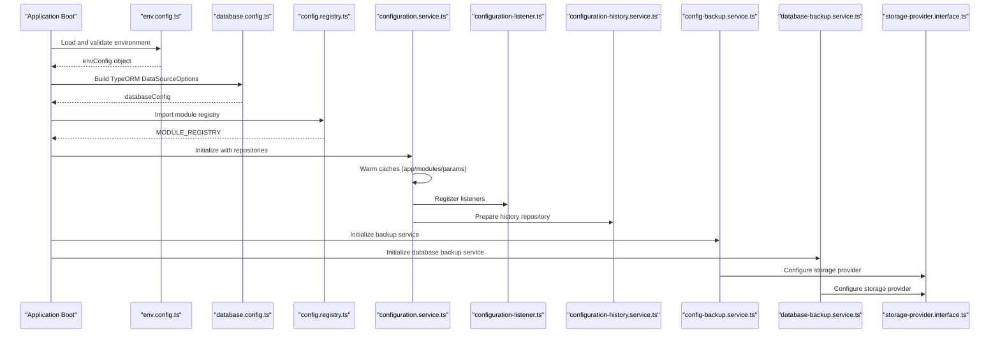

**Diagram sources**
- [env.config.ts:68-165](file://backend/src/config/env.config.ts#L68-L165)
- [database.config.ts:15-51](file://backend/src/config/database.config.ts#L15-L51)
- [config.registry.ts:45-387](file://shared/src/config/config.registry.ts#L45-L387)
- [configuration.service.ts:66-71](file://backend/src/modules/configuration/services/configuration.service.ts#L66-L71)
- [configuration-listener.ts:51-64](file://backend/src/modules/configuration/services/configuration-listener.ts#L51-L64)
- [configuration-history.service.ts:44-48](file://backend/src/modules/configuration/services/configuration-history.service.ts#L44-L48)
- [config-backup.service.ts:1-605](file://backend/src/modules/configuration/services/backup/config-backup.service.ts#L1-L605)
- [database-backup.service.ts:1-400](file://backend/src/modules/configuration/services/backup/database-backup.service.ts#L1-L400)
- [storage-provider.interface.ts:1-200](file://backend/src/modules/configuration/services/storage/storage-provider.interface.ts#L1-L200)

## Detailed Component Analysis

### Environment Variable Configuration
- Schema-driven validation ensures required variables are present and properly formatted, with explicit defaults for development/test.
- Environment categories include application, database, JWT, encryption, Redis, email, frontend URL, license, and logging.
- On validation failure, the system logs errors and either proceeds with safe defaults in non-production or exits in production.

**Diagram sources**
- [env.config.ts:68-112](file://backend/src/config/env.config.ts#L68-L112)

**Section sources**
- [env.config.ts:14-58](file://backend/src/config/env.config.ts#L14-L58)
- [env.config.ts:68-112](file://backend/src/config/env.config.ts#L68-L112)
- [env.config.ts:120-165](file://backend/src/config/env.config.ts#L120-L165)

### Database Connection Settings
- TypeORM options are derived from environment configuration.
- Development enables schema synchronization and verbose logging; production disables sync and restricts logging.
- Connection pooling scales with environment; SSL is enabled in production.
- Entities, migrations, and subscribers are configured via glob patterns.

**Diagram sources**
- [database.config.ts:15-51](file://backend/src/config/database.config.ts#L15-L51)

**Section sources**
- [database.config.ts:15-51](file://backend/src/config/database.config.ts#L15-L51)

### Application-Wide Configuration Options
- Application settings include environment, name, version, port, URLs, and production flags.
- These are exposed via a structured object for easy consumption across modules.

**Section sources**
- [env.config.ts:120-130](file://backend/src/config/env.config.ts#L120-L130)

### Configuration Registry System
- Defines default module metadata, icons, base paths, activation flags, premium flags, default roles, permissions, dependencies, and default settings.
- Provides lookup functions to retrieve module configs and check access by role.

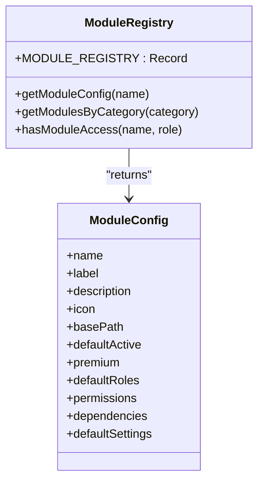

**Diagram sources**
- [config.registry.ts:17-40](file://shared/src/config/config.registry.ts#L17-L40)
- [config.registry.ts:45-387](file://shared/src/config/config.registry.ts#L45-L387)

**Section sources**
- [config.registry.ts:45-387](file://shared/src/config/config.registry.ts#L45-L387)

### Configuration Service Implementation
- Hybrid configuration with in-memory cache (TTL) for app, modules, and parameters.
- CRUD for system parameters with validation, type detection, and runtime mutability controls.
- Change events emitted for cache invalidation and downstream reactions.
- License activation and module toggling integrated with history.

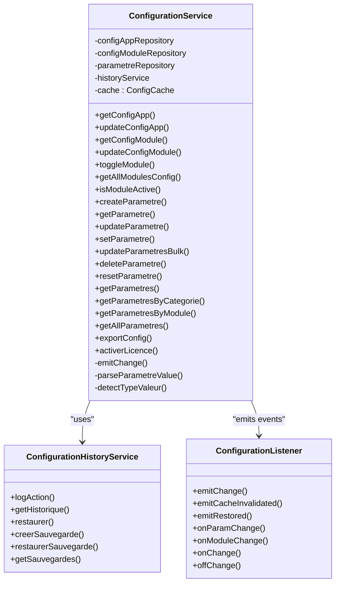

**Diagram sources**
- [configuration.service.ts:53-604](file://backend/src/modules/configuration/services/configuration.service.ts#L53-L604)
- [configuration-history.service.ts:39-267](file://backend/src/modules/configuration/services/configuration-history.service.ts#L39-L267)
- [configuration-listener.ts:51-144](file://backend/src/modules/configuration/services/configuration-listener.ts#L51-L144)

**Section sources**
- [configuration.service.ts:59-84](file://backend/src/modules/configuration/services/configuration.service.ts#L59-L84)
- [configuration.service.ts:94-146](file://backend/src/modules/configuration/services/configuration.service.ts#L94-L146)
- [configuration.service.ts:160-221](file://backend/src/modules/configuration/services/configuration.service.ts#L160-L221)
- [configuration.service.ts:263-442](file://backend/src/modules/configuration/services/configuration.service.ts#L263-L442)
- [configuration.service.ts:508-524](file://backend/src/modules/configuration/services/configuration.service.ts#L508-L524)
- [configuration.service.ts:530-546](file://backend/src/modules/configuration/services/configuration.service.ts#L530-L546)

### Parameter Validation and Default Value Management
- Parameters are stored with type, category, visibility, ordering, validation patterns, and options.
- Type detection converts persisted JSON strings to native types.
- Runtime mutability flag prevents unsafe changes during operation.
- Defaults are preserved for reset operations.

**Section sources**
- [parametre-systeme.entity.ts:24-52](file://backend/src/modules/configuration/entities/parametre-systeme.entity.ts#L24-L52)
- [parametre-systeme.entity.ts:58-119](file://backend/src/modules/configuration/entities/parametre-systeme.entity.ts#L58-L119)
- [configuration.service.ts:574-599](file://backend/src/modules/configuration/services/configuration.service.ts#L574-L599)
- [configuration.service.ts:444-472](file://backend/src/modules/configuration/services/configuration.service.ts#L444-L472)

### Runtime Configuration Updates and Events
- Cache invalidation triggers listener events for app, module, or parameter changes.
- Listeners support subscription to global changes, per-module changes, and per-parameter changes.
- Quick-cache in helpers reduces frequent DB reads for hot paths.

**Section sources**
- [configuration.service.ts:77-84](file://backend/src/modules/configuration/services/configuration.service.ts#L77-L84)
- [configuration-listener.ts:69-111](file://backend/src/modules/configuration/services/configuration-listener.ts#L69-L111)
- [config.helper.ts:18-37](file://backend/src/modules/configuration/utils/config.helper.ts#L18-L37)

### Environment-Specific Settings
- Development vs production toggles schema synchronization, logging verbosity, pool size, and SSL.
- Frontend URL and application URL are environment-controlled.

**Section sources**
- [database.config.ts:23-42](file://backend/src/config/database.config.ts#L23-L42)
- [env.config.ts:19, 50:19-20](file://backend/src/config/env.config.ts#L19-L20)
- [env.config.ts:127](file://backend/src/config/env.config.ts#L127)

### Deployment Configuration
- Docker Compose provisions Postgres and Redis, injects environment variables, and mounts shared code.
- Backend and frontend containers expose configurable ports and depend on healthy services.

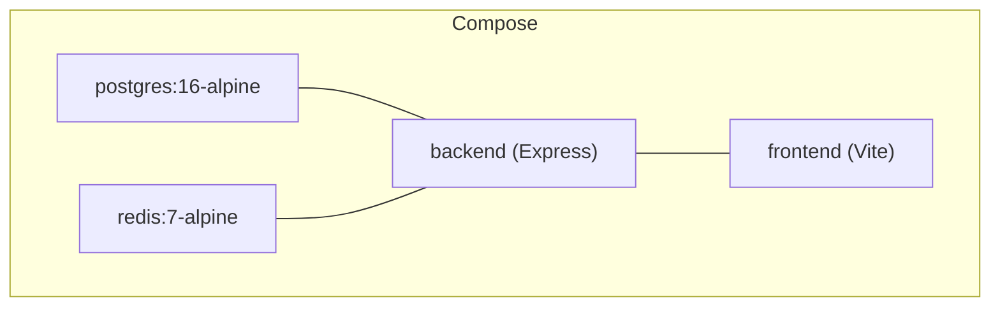

**Diagram sources**
- [docker-compose.yml:10-79](file://docker/docker-compose.yml#L10-L79)

**Section sources**
- [docker-compose.yml:14-65](file://docker/docker-compose.yml#L14-L65)
- [docker-compose.yml:74-79](file://docker/docker-compose.yml#L74-L79)

## Enhanced Backup & Restore System

**Updated** Enhanced with comprehensive backup/restore workflows, storage provider integration, and multi-tenant backup capabilities.

The enhanced backup system provides sophisticated backup and restore capabilities with versioning, compression, encryption, integrity validation, and multi-tenant support for establishment-specific backup management.

### Backup System Architecture
- **Semantic Versioning**: Backups include version information for tracking configuration evolution
- **Compression & Encryption**: Optional compression and encryption for backup data security and storage efficiency
- **Integrity Validation**: SHA-256 checksum validation ensures backup data integrity
- **Retention Management**: Configurable retention periods with automatic cleanup
- **Transactional Safety**: Restore operations use database transactions for atomicity

### Backup Types and Capabilities
- **Configuration Backups**: Complete configuration snapshots including app settings, module configurations, and system parameters
- **Database Backups**: Establishment-specific database backup operations with selective data export
- **Differential Backups**: Incremental backup support for reduced storage requirements
- **Multi-Tenant Support**: Separate backup management for each establishment with isolation

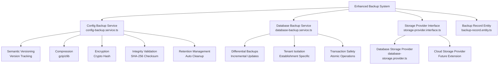

**Diagram sources**
- [config-backup.service.ts:1-605](file://backend/src/modules/configuration/services/backup/config-backup.service.ts#L1-L605)
- [database-backup.service.ts:1-400](file://backend/src/modules/configuration/services/backup/database-backup.service.ts#L1-L400)
- [storage-provider.interface.ts:1-200](file://backend/src/modules/configuration/services/storage/storage-provider.interface.ts#L1-L200)
- [database-storage.provider.ts:1-300](file://backend/src/modules/configuration/services/storage/database-storage.provider.ts#L1-L300)
- [backup-record.entity.ts:1-200](file://backend/src/modules/configuration/entities/backup-record.entity.ts#L1-L200)

**Section sources**
- [config-backup.service.ts:1-605](file://backend/src/modules/configuration/services/backup/config-backup.service.ts#L1-L605)
- [database-backup.service.ts:1-400](file://backend/src/modules/configuration/services/backup/database-backup.service.ts#L1-L400)
- [storage-provider.interface.ts:1-200](file://backend/src/modules/configuration/services/storage/storage-provider.interface.ts#L1-L200)
- [backup-record.entity.ts:1-200](file://backend/src/modules/configuration/entities/backup-record.entity.ts#L1-L200)

## Storage Provider Integration

**Updated** Comprehensive storage provider integration enabling pluggable backup storage backends.

The storage provider interface enables flexible backup storage with multiple backend implementations and extensible architecture for future storage providers.

### Storage Provider Interface
- **Abstract Storage Layer**: Defines common interface for backup storage operations
- **List Operations**: Search and filter backups with pagination support
- **CRUD Operations**: Create, read, update, and delete backup records
- **Metadata Management**: Store and retrieve backup metadata and properties
- **Extension Points**: Pluggable architecture for custom storage implementations

### Database Storage Provider
- **Built-in Solution**: Primary storage implementation using database-backed storage
- **Reliability**: Leverages existing database infrastructure for backup persistence
- **Consistency**: Maintains ACID properties for backup data consistency
- **Simplicity**: Minimal configuration requirements with existing database setup

### Storage Provider Benefits
- **Flexibility**: Support for multiple storage backends beyond database storage
- **Scalability**: Can accommodate cloud storage, file systems, or specialized backup systems
- **Maintainability**: Clean separation between backup logic and storage implementation
- **Extensibility**: Easy addition of new storage providers without modifying core backup logic

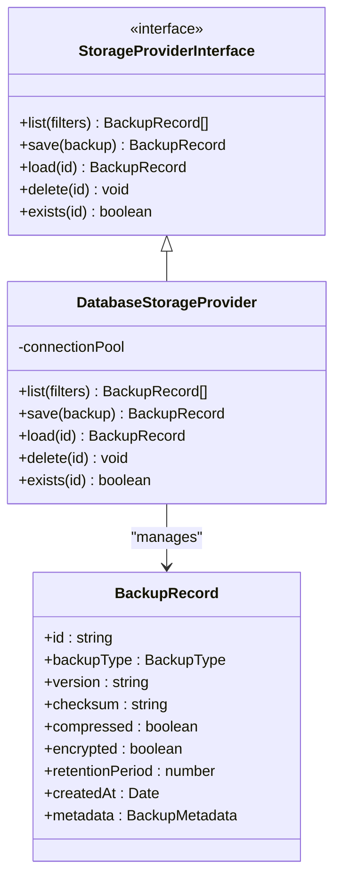

**Diagram sources**
- [storage-provider.interface.ts:1-200](file://backend/src/modules/configuration/services/storage/storage-provider.interface.ts#L1-L200)
- [database-storage.provider.ts:1-300](file://backend/src/modules/configuration/services/storage/database-storage.provider.ts#L1-L300)
- [backup-record.entity.ts:1-200](file://backend/src/modules/configuration/entities/backup-record.entity.ts#L1-L200)

**Section sources**
- [storage-provider.interface.ts:1-200](file://backend/src/modules/configuration/services/storage/storage-provider.interface.ts#L1-L200)
- [database-storage.provider.ts:1-300](file://backend/src/modules/configuration/services/storage/database-storage.provider.ts#L1-L300)
- [backup-record.entity.ts:1-200](file://backend/src/modules/configuration/entities/backup-record.entity.ts#L1-L200)

## Multi-Tenant Backup Capabilities

**Updated** Enhanced with comprehensive multi-tenant backup support for establishment-specific backup management.

The multi-tenant backup system provides isolated backup management for each establishment while maintaining centralized backup administration and reporting capabilities.

### Establishment-Specific Backup Management
- **Tenant Isolation**: Separate backup records and metadata for each establishment
- **Selective Backups**: Ability to backup specific establishments or all establishments
- **Permission-Based Access**: Role-based access control for backup operations across establishments
- **Resource Allocation**: Independent storage quotas and retention policies per establishment

### Backup Scope and Filtering
- **Global Backups**: Complete system backup including all establishments
- **Single Establishment**: Establishment-specific backup with selective data export
- **Multi-Establishment**: Batch backup operations across multiple establishments
- **Filtered Queries**: Advanced filtering by date range, backup type, and metadata

### Multi-Tenant Backup Workflows
- **Clone Configuration**: Copy configuration from one establishment to multiple others
- **Template Management**: Establish template configurations for new establishments
- **Bulk Operations**: Efficient management of backups across multiple establishments
- **Audit Trails**: Comprehensive logging of multi-tenant backup operations

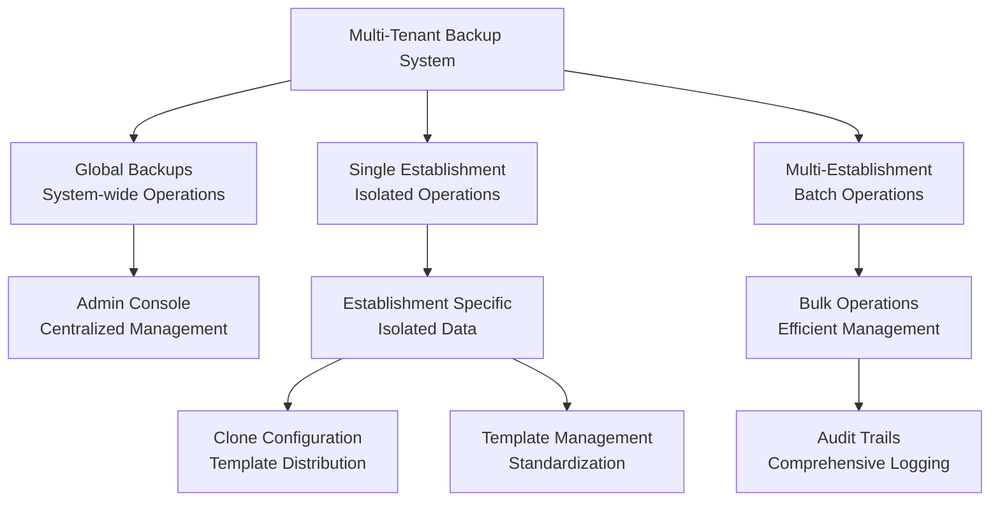

**Diagram sources**
- [config-backup.service.ts:1-605](file://backend/src/modules/configuration/services/backup/config-backup.service.ts#L1-L605)
- [database-backup.service.ts:1-400](file://backend/src/modules/configuration/services/backup/database-backup.service.ts#L1-L400)

**Section sources**
- [config-backup.service.ts:1-605](file://backend/src/modules/configuration/services/backup/config-backup.service.ts#L1-L605)
- [database-backup.service.ts:1-400](file://backend/src/modules/configuration/services/backup/database-backup.service.ts#L1-L400)

## Backup Controller & API Endpoints

**Updated** Comprehensive backup controller with REST API endpoints for backup management operations.

The backup controller provides REST API endpoints for managing backups with authentication, authorization, and comprehensive backup operations.

### Backup Management Endpoints
- **List Backups**: Retrieve backup records with filtering and pagination
- **Get Backup Details**: View detailed information about specific backup
- **Create Snapshot**: Generate configuration backup with various options
- **Restore Backup**: Restore configuration from backup with validation
- **Verify Integrity**: Check backup integrity and validity
- **Delete Backup**: Remove backup records with proper cleanup

### Authentication and Authorization
- **Protected Routes**: All backup endpoints require authentication
- **Role-Based Access**: Different access levels for backup operations
- **Establishment Permissions**: Access control based on establishment affiliation
- **Audit Logging**: Comprehensive logging of backup operations

### API Response Formats
- **Standardized Responses**: Consistent response format across all endpoints
- **Error Handling**: Detailed error messages with appropriate HTTP status codes
- **Pagination Support**: Built-in pagination for large backup collections
- **Metadata Enrichment**: Additional information in responses for better UX

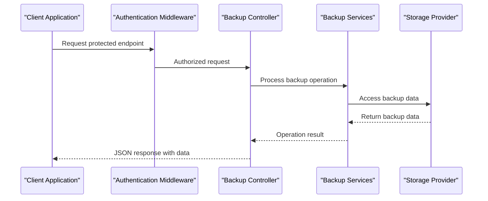

**Diagram sources**
- [backup.controller.ts:1-300](file://backend/src/modules/configuration/controllers/backup.controller.ts#L1-L300)
- [config-backup.service.ts:1-605](file://backend/src/modules/configuration/services/backup/config-backup.service.ts#L1-L605)
- [database-backup.service.ts:1-400](file://backend/src/modules/configuration/services/backup/database-backup.service.ts#L1-L400)

**Section sources**
- [backup.controller.ts:1-300](file://backend/src/modules/configuration/controllers/backup.controller.ts#L1-L300)
- [config-backup.service.ts:1-605](file://backend/src/modules/configuration/services/backup/config-backup.service.ts#L1-L605)
- [database-backup.service.ts:1-400](file://backend/src/modules/configuration/services/backup/database-backup.service.ts#L1-L400)

## 100% Configuration Coverage System

**Updated** Enhanced with comprehensive configuration coverage ensuring complete parameter management across all application aspects.

The 100% configuration coverage system provides complete oversight and management of all configuration parameters, ensuring no aspect of the application configuration remains unmanaged or uncontrolled.

### Complete Parameter Management
- **Application-wide parameters**: All application-level settings are tracked and managed through the configuration system
- **Module-specific parameters**: Each module's configuration is fully covered with detailed parameter tracking
- **System parameters**: All system-level configurations including security, performance, and operational settings
- **User-defined parameters**: Custom parameters created by administrators are fully supported and tracked
- **Backup system parameters**: Backup configuration and management parameters are included in coverage

### Coverage Monitoring and Validation
- Real-time coverage tracking ensures 100% of configuration parameters are accounted for
- Automated validation checks prevent configuration gaps or inconsistencies
- Comprehensive audit trails track all configuration changes and their impact
- Health monitoring provides alerts for configuration issues or coverage gaps

### Advanced Configuration Features
- **Hierarchical configuration**: Support for nested configuration structures with inheritance
- **Conditional parameters**: Parameters that depend on other configuration values
- **Dynamic configuration**: Runtime parameter updates with immediate effect
- **Configuration templates**: Predefined configuration sets for different deployment scenarios
- **Backup configuration templates**: Standardized backup configurations for different establishment types

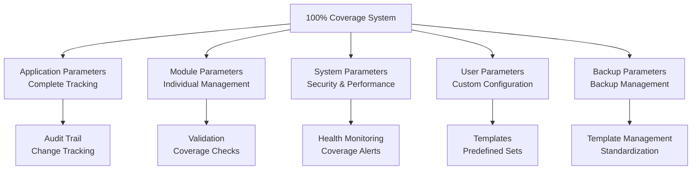

**Diagram sources**
- [CONFIGURATION_100_PERCENT.md:1-200](file://CONFIGURATION_100_PERCENT.md#L1-L200)
- [backup-record.entity.ts:1-200](file://backend/src/modules/configuration/entities/backup-record.entity.ts#L1-L200)

**Section sources**
- [CONFIGURATION_100_PERCENT.md:1-200](file://CONFIGURATION_100_PERCENT.md#L1-L200)
- [backup-record.entity.ts:1-200](file://backend/src/modules/configuration/entities/backup-record.entity.ts#L1-L200)

## Migration Scripts and Implementation Guides

**Updated** Comprehensive migration system with automated scripts and detailed implementation guides.

The migration system provides seamless updates between configuration versions with automated handling of parameter transformations and compatibility checks.

### Automated Migration Scripts
- **run-config-100-migration.sh**: Handles complete 100% configuration coverage migrations
- **run-config-migration.sh**: Manages standard configuration parameter migrations
- **Version-aware migrations**: Automatic detection and handling of configuration version differences
- **Rollback support**: Safe rollback mechanisms for failed migrations

### Migration Implementation
- **Pre-migration validation**: Ensures system readiness before migration execution
- **Parameter transformation**: Automatic conversion of legacy parameters to new formats
- **Compatibility checking**: Validates compatibility between old and new configuration schemas
- **Post-migration verification**: Confirms successful migration completion

### Implementation Best Practices
- **Backup creation**: Automatic backup of current configuration before migration
- **Staged rollouts**: Gradual application of configuration changes
- **Monitoring integration**: Real-time monitoring during migration process
- **Error handling**: Comprehensive error handling and recovery mechanisms

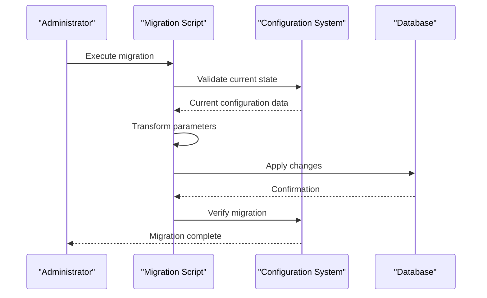

**Diagram sources**
- [run-config-100-migration.sh:1-50](file://backend/scripts/run-config-100-migration.sh#L1-L50)
- [run-config-migration.sh:1-50](file://backend/scripts/run-config-migration.sh#L1-L50)

**Section sources**
- [run-config-100-migration.sh:1-50](file://backend/scripts/run-config-100-migration.sh#L1-L50)
- [run-config-migration.sh:1-50](file://backend/scripts/run-config-migration.sh#L1-L50)

## User Guide and Practical Implementation

**Updated** Comprehensive user guide with step-by-step implementation instructions and best practices.

The user guide provides complete documentation for implementing and managing the configuration system, including practical examples and troubleshooting guidance.

### Getting Started Guide
- **Installation requirements**: Prerequisites and system requirements for configuration management
- **Initial setup**: Step-by-step configuration of the configuration system
- **Basic usage**: How to manage configuration parameters and settings
- **Daily operations**: Routine tasks for configuration maintenance and monitoring
- **Backup system setup**: Initial configuration of backup and restore capabilities

### Advanced Implementation
- **Custom parameter types**: Creating and managing custom configuration parameter types
- **Integration patterns**: Best practices for integrating configuration with application logic
- **Performance optimization**: Techniques for optimizing configuration access and updates
- **Security hardening**: Security measures for protecting configuration data
- **Backup system customization**: Extending backup capabilities for specific requirements

### Troubleshooting and Maintenance
- **Common issues**: Frequently encountered problems and their solutions
- **Performance tuning**: Optimizing configuration system performance
- **Backup and recovery**: Procedures for backing up and restoring configuration data
- **Monitoring and alerting**: Setting up monitoring for configuration health and coverage
- **Backup system troubleshooting**: Diagnosing and resolving backup system issues

### Integration Examples
- **API integration**: How to integrate configuration management with REST APIs
- **Database integration**: Configuration storage and retrieval from databases
- **External system integration**: Connecting configuration system with external services
- **Multi-environment deployment**: Managing configuration across different deployment environments
- **Backup system integration**: Integrating backup capabilities with existing infrastructure

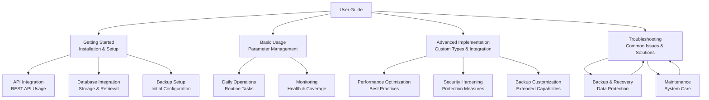

**Diagram sources**
- [CONFIGURATION_100_PERCENT.md:200-400](file://CONFIGURATION_100_PERCENT.md#L200-L400)
- [BACKUP-SYSTEM-USER-GUIDE.md:161-222](file://BACKUP-SYSTEM-USER-GUIDE.md#L161-L222)

**Section sources**
- [CONFIGURATION_100_PERCENT.md:200-400](file://CONFIGURATION_100_PERCENT.md#L200-L400)
- [BACKUP-SYSTEM-USER-GUIDE.md:161-222](file://BACKUP-SYSTEM-USER-GUIDE.md#L161-L222)

## Dependency Analysis
- Environment loader depends on zod for validation and exports a structured object consumed by database config.
- Database config depends on environment configuration for TypeORM options.
- Configuration service depends on repositories for entities and on the module registry for default module settings.
- History and listener services integrate with configuration service for auditing and change propagation.
- Config helper depends on configuration service and exposes typed getters.
- **New**: ConfigBackupService depends on storage provider interface and backup record entity.
- **New**: DatabaseBackupService depends on storage provider interface and establishment configuration.
- **New**: Backup controller depends on backup services and authentication middleware.
- **New**: Storage provider interface enables pluggable storage backend implementations.
- **New**: Enhanced dependency graph includes comprehensive backup system integration.

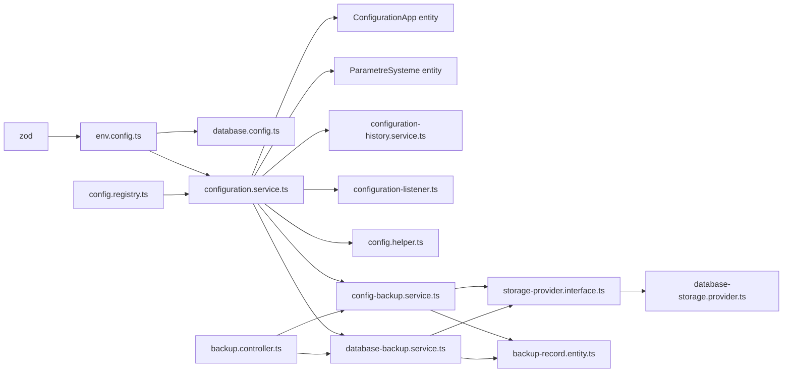

**Diagram sources**
- [env.config.ts:9, 68-112:9-112](file://backend/src/config/env.config.ts#L9-L112)
- [database.config.ts:10](file://backend/src/config/database.config.ts#L10)
- [configuration.service.ts:17-36](file://backend/src/modules/configuration/services/configuration.service.ts#L17-L36)
- [config.registry.ts:11-12](file://shared/src/config/config.registry.ts#L11-L12)
- [configuration-history.service.ts:11-18](file://backend/src/modules/configuration/services/configuration-history.service.ts#L11-L18)
- [configuration-listener.ts:12-14](file://backend/src/modules/configuration/services/configuration-listener.ts#L12-L14)
- [config.helper.ts:12-13](file://backend/src/modules/configuration/utils/config.helper.ts#L12-L13)
- [config-backup.service.ts:1-605](file://backend/src/modules/configuration/services/backup/config-backup.service.ts#L1-L605)
- [database-backup.service.ts:1-400](file://backend/src/modules/configuration/services/backup/database-backup.service.ts#L1-L400)
- [storage-provider.interface.ts:1-200](file://backend/src/modules/configuration/services/storage/storage-provider.interface.ts#L1-L200)
- [database-storage.provider.ts:1-300](file://backend/src/modules/configuration/services/storage/database-storage.provider.ts#L1-L300)
- [backup-record.entity.ts:1-200](file://backend/src/modules/configuration/entities/backup-record.entity.ts#L1-L200)
- [backup.controller.ts:1-300](file://backend/src/modules/configuration/controllers/backup.controller.ts#L1-L300)

**Section sources**
- [env.config.ts:9, 68-112:9-112](file://backend/src/config/env.config.ts#L9-L112)
- [database.config.ts:10](file://backend/src/config/database.config.ts#L10)
- [configuration.service.ts:17-36](file://backend/src/modules/configuration/services/configuration.service.ts#L17-L36)
- [config.registry.ts:11-12](file://shared/src/config/config.registry.ts#L11-L12)
- [configuration-history.service.ts:11-18](file://backend/src/modules/configuration/services/configuration-history.service.ts#L11-L18)
- [configuration-listener.ts:12-14](file://backend/src/modules/configuration/services/configuration-listener.ts#L12-L14)
- [config.helper.ts:12-13](file://backend/src/modules/configuration/utils/config.helper.ts#L12-L13)
- [config-backup.service.ts:1-605](file://backend/src/modules/configuration/services/backup/config-backup.service.ts#L1-L605)
- [database-backup.service.ts:1-400](file://backend/src/modules/configuration/services/backup/database-backup.service.ts#L1-L400)
- [storage-provider.interface.ts:1-200](file://backend/src/modules/configuration/services/storage/storage-provider.interface.ts#L1-L200)
- [database-storage.provider.ts:1-300](file://backend/src/modules/configuration/services/storage/database-storage.provider.ts#L1-L300)
- [backup-record.entity.ts:1-200](file://backend/src/modules/configuration/entities/backup-record.entity.ts#L1-L200)
- [backup.controller.ts:1-300](file://backend/src/modules/configuration/controllers/backup.controller.ts#L1-L300)

## Performance Considerations
- In-memory cache with TTL reduces repeated database queries for configuration and parameters.
- Quick-cache in helpers further optimizes hot-path reads.
- Production logging is restricted to error-level to minimize I/O overhead.
- Connection pooling adapts to environment to balance throughput and resource usage.
- **New**: Backup compression reduces storage requirements and transfer times.
- **New**: Encryption operations are optimized for batch processing during backup operations.
- **New**: Storage provider abstraction enables performance optimization through backend selection.
- **New**: Multi-tenant isolation prevents cross-establishment performance interference.
- **New**: Transactional backup operations ensure data consistency without performance penalties.

## Troubleshooting Guide
- Environment validation failures: Review schema errors and ensure required variables are set; in non-production, defaults are applied automatically.
- Parameter modification errors: Check the runtime mutability flag; parameters marked non-modifiable cannot be changed at runtime.
- Cache staleness: Use cache invalidation APIs to force reload after bulk updates.
- History and restoration: Use the history service to audit changes and restore previous states or full backups.
- **New**: Backup integrity issues: Use integrity validation to check backup corruption and identify repair options.
- **New**: Storage provider failures: Monitor storage provider connectivity and implement fallback mechanisms.
- **New**: Multi-tenant backup conflicts: Resolve establishment-specific backup conflicts using conflict resolution strategies.
- **New**: Backup restore failures: Use transaction rollback and error recovery mechanisms for failed restore operations.
- **New**: Coverage system issues: Monitor coverage reports and address parameter gaps or validation failures.
- **New**: Migration failures: Use rollback procedures and review migration logs for failed transformations.
- **New**: User guide integration: Follow implementation guides for proper configuration system usage.

**Section sources**
- [env.config.ts:71-109](file://backend/src/config/env.config.ts#L71-L109)
- [configuration.service.ts:326-328](file://backend/src/modules/configuration/services/configuration.service.ts#L326-L328)
- [configuration.service.ts:77-84](file://backend/src/modules/configuration/services/configuration.service.ts#L77-L84)
- [configuration-history.service.ts:105-128](file://backend/src/modules/configuration/services/configuration-history.service.ts#L105-L128)
- [config-backup.service.ts:572-585](file://backend/src/modules/configuration/services/backup/config-backup.service.ts#L572-L585)
- [database-backup.service.ts:1-400](file://backend/src/modules/configuration/services/backup/database-backup.service.ts#L1-L400)

## Conclusion
eLISAschool's configuration system combines strict environment validation, modular registry defaults, and a robust runtime configuration service with persistence, caching, and event-driven change propagation. The enhanced backup system provides comprehensive backup and restore capabilities with storage provider integration, multi-tenant support, and transactional safety. The 100% configuration coverage system ensures complete parameter management, automated migration capabilities, and detailed user guidance. This comprehensive approach guarantees complete configuration control, seamless updates, reliable backup operations, and optimal system performance across all deployment environments.

## Appendices

### Security Considerations for Sensitive Data
- JWT secret and encryption key must meet minimum length requirements; avoid exposing secrets in logs.
- In production, environment validation failures cause process exit to prevent unsafe operation.
- Database credentials and Redis passwords are managed via environment variables and compose configuration.
- **New**: Backup data encryption protects sensitive configuration data at rest and in transit.
- **New**: Access control and audit logging for backup management operations.
- **New**: Multi-tenant isolation prevents cross-establishment data leakage.
- **New**: Integrity validation ensures backup data hasn't been tampered with during storage.

**Section sources**
- [env.config.ts:30, 35, 75-109:30-35](file://backend/src/config/env.config.ts#L30-L35)
- [env.config.ts:75-109](file://backend/src/config/env.config.ts#L75-L109)
- [docker-compose.yml:14-17, 64-65:14-17](file://docker/docker-compose.yml#L14-L17)
- [config-backup.service.ts:572-585](file://backend/src/modules/configuration/services/backup/config-backup.service.ts#L572-L585)

### Enhanced Configuration Backup and Restore Procedures

**Updated** Comprehensive backup and restore procedures with transactional safety and multi-tenant support.

The enhanced backup system provides robust backup and restore procedures with transactional safety, integrity validation, and comprehensive error handling.

#### Backup Creation Workflow
1. **Snapshot Generation**: Create configuration snapshot with version information
2. **Data Compression**: Optional compression using gzip for storage efficiency
3. **Integrity Check**: Generate SHA-256 checksum for data validation
4. **Storage Persistence**: Save backup to selected storage provider
5. **Retention Setup**: Configure retention period and cleanup policies

#### Restore Operations
1. **Backup Validation**: Verify backup integrity and compatibility
2. **Transaction Preparation**: Start database transaction for atomic restore
3. **Data Restoration**: Apply backup data with conflict resolution
4. **Integrity Verification**: Validate restored data consistency
5. **Transaction Commit**: Commit changes if successful, rollback on failure

#### Multi-Tenant Backup Management
- **Establishment Isolation**: Separate backup records per establishment
- **Permission Control**: Role-based access to backup operations
- **Template Distribution**: Clone configurations across establishments
- **Audit Tracking**: Comprehensive logging of multi-tenant backup activities

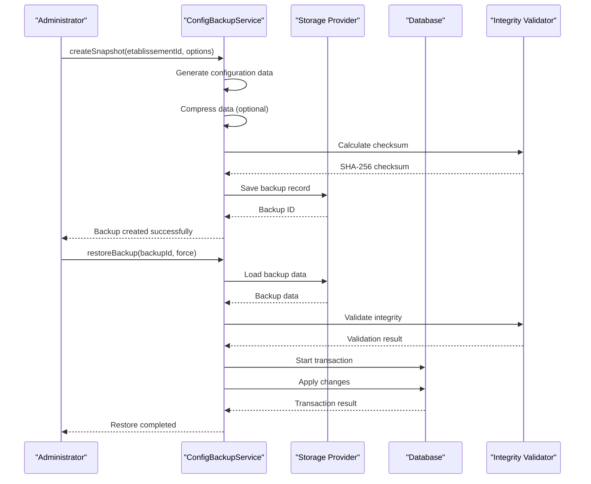

**Diagram sources**
- [config-backup.service.ts:274-520](file://backend/src/modules/configuration/services/backup/config-backup.service.ts#L274-L520)
- [database-backup.service.ts:1-400](file://backend/src/modules/configuration/services/backup/database-backup.service.ts#L1-L400)
- [storage-provider.interface.ts:1-200](file://backend/src/modules/configuration/services/storage/storage-provider.interface.ts#L1-L200)

**Section sources**
- [config-backup.service.ts:274-520](file://backend/src/modules/configuration/services/backup/config-backup.service.ts#L274-L520)
- [database-backup.service.ts:1-400](file://backend/src/modules/configuration/services/backup/database-backup.service.ts#L1-L400)
- [backup.controller.ts:165-204](file://backend/src/modules/configuration/controllers/backup.controller.ts#L165-L204)

### Configuration Versioning and Migration Strategies
- Application configuration includes a version field for tracking upgrades.
- System parameters include a default value reference to support resets and migrations.
- Migration scripts are available via TypeORM commands for database schema changes.
- **New**: Backup system includes semantic versioning for backup compatibility tracking.
- **New**: Differential backup support reduces storage requirements for frequent backups.
- **New**: Multi-tenant versioning ensures establishment-specific backup compatibility.
- **New**: Automated backup cleanup based on retention policies and storage quotas.

**Section sources**
- [configuration-app.entity.ts:101-102](file://backend/src/modules/configuration/entities/configuration-app.entity.ts#L101-L102)
- [configuration.service.ts:452-456](file://backend/src/modules/configuration/services/configuration.service.ts#L452-L456)
- [package.json:18-21](file://backend/package.json#L18-L21)
- [backup-record.entity.ts:1-200](file://backend/src/modules/configuration/entities/backup-record.entity.ts#L1-L200)

### Implementation Best Practices
- **Configuration design**: Plan configuration structure before implementation
- **Parameter naming**: Use consistent naming conventions for configuration parameters
- **Documentation**: Maintain comprehensive documentation for all configuration changes
- **Testing**: Test configuration changes in staging environments before production deployment
- **Monitoring**: Implement monitoring for configuration system health and coverage
- **Security**: Follow security best practices for configuration data protection
- **Automation**: Use automation scripts for routine configuration management tasks
- **Backup Strategy**: Implement regular backup schedules with integrity validation
- **Multi-Tenant Planning**: Design backup strategies considering establishment isolation requirements
- **Storage Provider Selection**: Choose appropriate storage providers based on backup requirements

**Section sources**
- [CONFIGURATION_100_PERCENT.md:400-600](file://CONFIGURATION_100_PERCENT.md#L400-L600)
- [run-config-100-migration.sh:1-50](file://backend/scripts/run-config-100-migration.sh#L1-L50)
- [run-config-migration.sh:1-50](file://backend/scripts/run-config-migration.sh#L1-L50)
- [BACKUP-SYSTEM-IMPLEMENTATION-COMPLETE.md:187-257](file://BACKUP-SYSTEM-IMPLEMENTATION-COMPLETE.md#L187-L257)
- [BACKUP-SYSTEM-USER-GUIDE.md:161-222](file://BACKUP-SYSTEM-USER-GUIDE.md#L161-L222)