# Configuration & Environment Management

<cite>
**Referenced Files in This Document**
- [env.config.ts](file://backend/src/config/env.config.ts)
- [database.config.ts](file://backend/src/config/database.config.ts)
- [index.ts](file://backend/src/config/index.ts)
- [config.registry.ts](file://shared/src/config/config.registry.ts)
- [configuration.service.ts](file://backend/src/modules/configuration/services/configuration.service.ts)
- [configuration-listener.ts](file://backend/src/modules/configuration/services/configuration-listener.ts)
- [configuration-history.service.ts](file://backend/src/modules/configuration/services/configuration-history.service.ts)
- [config.helper.ts](file://backend/src/modules/configuration/utils/config.helper.ts)
- [configuration-app.entity.ts](file://backend/src/modules/configuration/entities/configuration-app.entity.ts)
- [parametre-systeme.entity.ts](file://backend/src/modules/configuration/entities/parametre-systeme.entity.ts)
- [docker-compose.yml](file://docker/docker-compose.yml)
- [package.json](file://backend/package.json)
- [CONFIGURATION_100_PERCENT.md](file://CONFIGURATION_100_PERCENT.md)
- [run-config-100-migration.sh](file://backend/scripts/run-config-100-migration.sh)
- [run-config-migration.sh](file://backend/scripts/run-config-migration.sh)
</cite>

## Update Summary
**Changes Made**
- Added comprehensive documentation for the 100% configuration coverage system
- Integrated detailed migration script documentation and implementation guides
- Enhanced user guide coverage for configuration management
- Updated configuration versioning and migration strategies
- Expanded security considerations for configuration management
- Added practical implementation examples and best practices

## Table of Contents
1. [Introduction](#introduction)
2. [Project Structure](#project-structure)
3. [Core Components](#core-components)
4. [Architecture Overview](#architecture-overview)
5. [Detailed Component Analysis](#detailed-component-analysis)
6. [100% Configuration Coverage System](#100-configuration-coverage-system)
7. [Migration Scripts and Implementation Guides](#migration-scripts-and-implementation-guides)
8. [User Guide and Practical Implementation](#user-guide-and-practical-implementation)
9. [Dependency Analysis](#dependency-analysis)
10. [Performance Considerations](#performance-considerations)
11. [Troubleshooting Guide](#troubleshooting-guide)
12. [Conclusion](#conclusion)
13. [Appendices](#appendices)

## Introduction
This document explains how eLISAschool manages configuration and environments across the backend with comprehensive 100% configuration coverage. It covers environment variable validation and defaults, database connection settings, application-wide configuration, the configuration registry for modules, runtime configuration updates, environment-specific settings, deployment configuration, and detailed migration strategies. The system now includes complete configuration management with user-friendly interfaces, automated migration scripts, and comprehensive implementation guides.

## Project Structure
Configuration spans three main areas with enhanced coverage:
- Environment variables and database configuration loaded at startup
- Shared module registry defining default module behavior and settings
- Runtime configuration service managing application, module, and system parameters with persistence, caching, and change events
- **New**: 100% configuration coverage system with comprehensive parameter management
- **New**: Automated migration scripts for seamless configuration updates
- **New**: User guide and implementation documentation

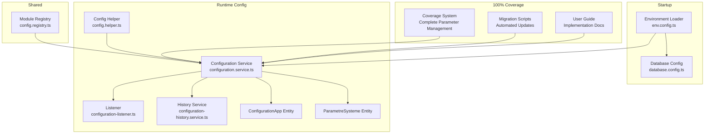

**Diagram sources**
- [env.config.ts:1-168](file://backend/src/config/env.config.ts#L1-L168)
- [database.config.ts:1-54](file://backend/src/config/database.config.ts#L1-L54)
- [config.registry.ts:1-414](file://shared/src/config/config.registry.ts#L1-L414)
- [configuration.service.ts:1-604](file://backend/src/modules/configuration/services/configuration.service.ts#L1-L604)
- [configuration-listener.ts:1-144](file://backend/src/modules/configuration/services/configuration-listener.ts#L1-L144)
- [configuration-history.service.ts:1-267](file://backend/src/modules/configuration/services/configuration-history.service.ts#L1-L267)
- [config.helper.ts:1-131](file://backend/src/modules/configuration/utils/config.helper.ts#L1-L131)
- [configuration-app.entity.ts:1-112](file://backend/src/modules/configuration/entities/configuration-app.entity.ts#L1-L112)
- [parametre-systeme.entity.ts:1-122](file://backend/src/modules/configuration/entities/parametre-systeme.entity.ts#L1-L122)

**Section sources**
- [env.config.ts:1-168](file://backend/src/config/env.config.ts#L1-L168)
- [database.config.ts:1-54](file://backend/src/config/database.config.ts#L1-L54)
- [config.registry.ts:1-414](file://shared/src/config/config.registry.ts#L1-L414)
- [configuration.service.ts:1-604](file://backend/src/modules/configuration/services/configuration.service.ts#L1-L604)
- [configuration-listener.ts:1-144](file://backend/src/modules/configuration/services/configuration-listener.ts#L1-L144)
- [configuration-history.service.ts:1-267](file://backend/src/modules/configuration/services/configuration-history.service.ts#L1-L267)
- [config.helper.ts:1-131](file://backend/src/modules/configuration/utils/config.helper.ts#L1-L131)
- [configuration-app.entity.ts:1-112](file://backend/src/modules/configuration/entities/configuration-app.entity.ts#L1-L112)
- [parametre-systeme.entity.ts:1-122](file://backend/src/modules/configuration/entities/parametre-systeme.entity.ts#L1-L122)

## Core Components
- Environment configuration loader validates and normalizes environment variables using schema validation, provides structured access, and falls back to safe defaults in non-production environments.
- Database configuration reads environment settings and sets TypeORM options including synchronization, logging, SSL, and connection pooling based on environment.
- Module registry defines default module metadata, permissions, dependencies, and default settings for all application modules.
- Configuration service provides a hybrid configuration system with in-memory caching, persistence, runtime parameter updates, and event emission for change propagation.
- History service tracks configuration actions, supports restoration, and maintains backups.
- Config helper offers typed helpers to quickly fetch parameters and module states with local caching.
- **New**: 100% configuration coverage system ensures complete parameter management across all application aspects.
- **New**: Automated migration scripts handle seamless configuration updates and version transitions.
- **New**: Comprehensive user guide provides step-by-step implementation instructions.

**Section sources**
- [env.config.ts:68-165](file://backend/src/config/env.config.ts#L68-L165)
- [database.config.ts:15-51](file://backend/src/config/database.config.ts#L15-L51)
- [config.registry.ts:45-387](file://shared/src/config/config.registry.ts#L45-L387)
- [configuration.service.ts:53-604](file://backend/src/modules/configuration/services/configuration.service.ts#L53-L604)
- [configuration-history.service.ts:39-267](file://backend/src/modules/configuration/services/configuration-history.service.ts#L39-L267)
- [config.helper.ts:24-115](file://backend/src/modules/configuration/utils/config.helper.ts#L24-L115)

## Architecture Overview
The configuration system integrates environment loading, database setup, module registry, and runtime configuration management with comprehensive coverage and automated migration capabilities.

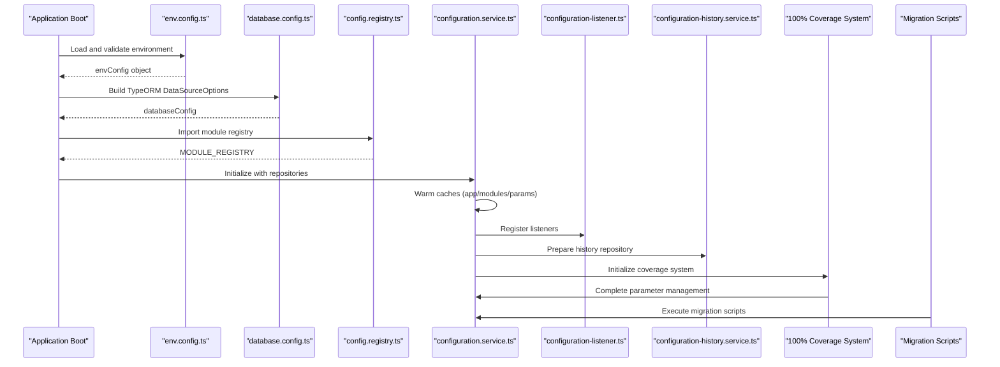

**Diagram sources**
- [env.config.ts:68-165](file://backend/src/config/env.config.ts#L68-L165)
- [database.config.ts:15-51](file://backend/src/config/database.config.ts#L15-L51)
- [config.registry.ts:45-387](file://shared/src/config/config.registry.ts#L45-L387)
- [configuration.service.ts:66-71](file://backend/src/modules/configuration/services/configuration.service.ts#L66-L71)
- [configuration-listener.ts:51-64](file://backend/src/modules/configuration/services/configuration-listener.ts#L51-L64)
- [configuration-history.service.ts:44-48](file://backend/src/modules/configuration/services/configuration-history.service.ts#L44-L48)

## Detailed Component Analysis

### Environment Variable Configuration
- Schema-driven validation ensures required variables are present and properly formatted, with explicit defaults for development/test.
- Environment categories include application, database, JWT, encryption, Redis, email, frontend URL, license, and logging.
- On validation failure, the system logs errors and either proceeds with safe defaults in non-production or exits in production.

**Diagram sources**
- [env.config.ts:68-112](file://backend/src/config/env.config.ts#L68-L112)

**Section sources**
- [env.config.ts:14-58](file://backend/src/config/env.config.ts#L14-L58)
- [env.config.ts:68-112](file://backend/src/config/env.config.ts#L68-L112)
- [env.config.ts:120-165](file://backend/src/config/env.config.ts#L120-L165)

### Database Connection Settings
- TypeORM options are derived from environment configuration.
- Development enables schema synchronization and verbose logging; production disables sync and restricts logging.
- Connection pooling scales with environment; SSL is enabled in production.
- Entities, migrations, and subscribers are configured via glob patterns.

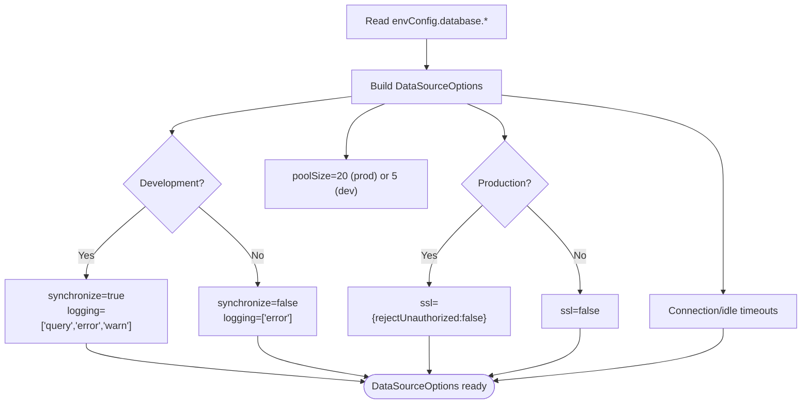

**Diagram sources**
- [database.config.ts:15-51](file://backend/src/config/database.config.ts#L15-L51)

**Section sources**
- [database.config.ts:15-51](file://backend/src/config/database.config.ts#L15-L51)

### Application-Wide Configuration Options
- Application settings include environment, name, version, port, URLs, and production flags.
- These are exposed via a structured object for easy consumption across modules.

**Section sources**
- [env.config.ts:120-130](file://backend/src/config/env.config.ts#L120-L130)

### Configuration Registry System
- Defines default module metadata, icons, base paths, activation flags, premium flags, default roles, permissions, dependencies, and default settings.
- Provides lookup functions to retrieve module configs and check access by role.

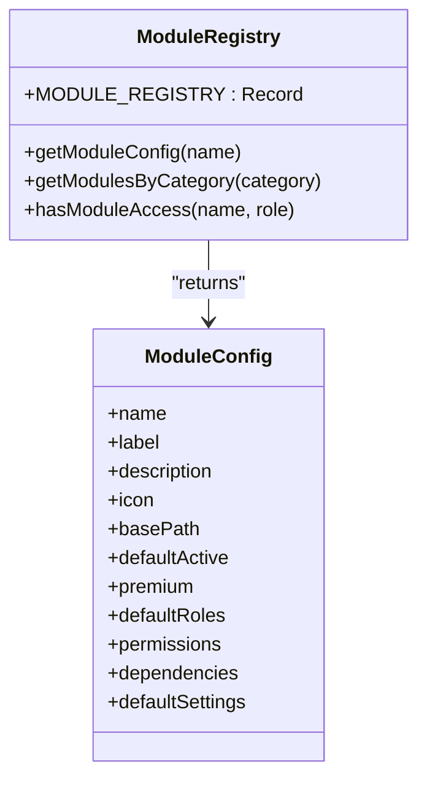

**Diagram sources**
- [config.registry.ts:17-40](file://shared/src/config/config.registry.ts#L17-L40)
- [config.registry.ts:45-387](file://shared/src/config/config.registry.ts#L45-L387)

**Section sources**
- [config.registry.ts:45-387](file://shared/src/config/config.registry.ts#L45-L387)

### Configuration Service Implementation
- Hybrid configuration with in-memory cache (TTL) for app, modules, and parameters.
- CRUD for system parameters with validation, type detection, and runtime mutability controls.
- Change events emitted for cache invalidation and downstream reactions.
- License activation and module toggling integrated with history.

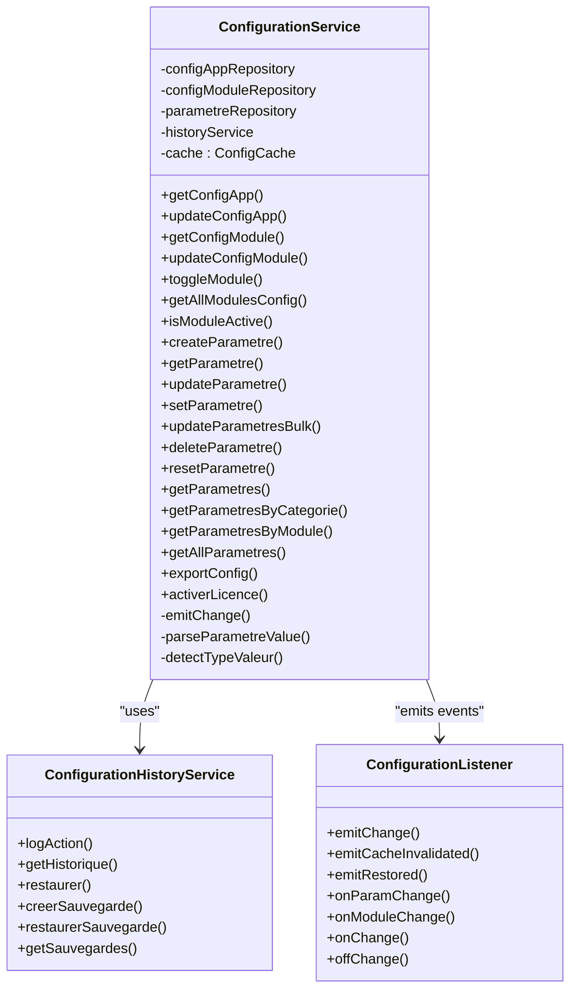

**Diagram sources**
- [configuration.service.ts:53-604](file://backend/src/modules/configuration/services/configuration.service.ts#L53-L604)
- [configuration-history.service.ts:39-267](file://backend/src/modules/configuration/services/configuration-history.service.ts#L39-L267)
- [configuration-listener.ts:51-144](file://backend/src/modules/configuration/services/configuration-listener.ts#L51-L144)

**Section sources**
- [configuration.service.ts:59-84](file://backend/src/modules/configuration/services/configuration.service.ts#L59-L84)
- [configuration.service.ts:94-146](file://backend/src/modules/configuration/services/configuration.service.ts#L94-L146)
- [configuration.service.ts:160-221](file://backend/src/modules/configuration/services/configuration.service.ts#L160-L221)
- [configuration.service.ts:263-442](file://backend/src/modules/configuration/services/configuration.service.ts#L263-L442)
- [configuration.service.ts:508-524](file://backend/src/modules/configuration/services/configuration.service.ts#L508-L524)
- [configuration.service.ts:530-546](file://backend/src/modules/configuration/services/configuration.service.ts#L530-L546)

### Parameter Validation and Default Value Management
- Parameters are stored with type, category, visibility, ordering, validation patterns, and options.
- Type detection converts persisted JSON strings to native types.
- Runtime mutability flag prevents unsafe changes during operation.
- Defaults are preserved for reset operations.

**Section sources**
- [parametre-systeme.entity.ts:24-52](file://backend/src/modules/configuration/entities/parametre-systeme.entity.ts#L24-L52)
- [parametre-systeme.entity.ts:58-119](file://backend/src/modules/configuration/entities/parametre-systeme.entity.ts#L58-L119)
- [configuration.service.ts:574-599](file://backend/src/modules/configuration/services/configuration.service.ts#L574-L599)
- [configuration.service.ts:444-472](file://backend/src/modules/configuration/services/configuration.service.ts#L444-L472)

### Runtime Configuration Updates and Events
- Cache invalidation triggers listener events for app, module, or parameter changes.
- Listeners support subscription to global changes, per-module changes, and per-parameter changes.
- Quick-cache in helpers reduces frequent DB reads for hot paths.

**Section sources**
- [configuration.service.ts:77-84](file://backend/src/modules/configuration/services/configuration.service.ts#L77-L84)
- [configuration-listener.ts:69-111](file://backend/src/modules/configuration/services/configuration-listener.ts#L69-L111)
- [config.helper.ts:18-37](file://backend/src/modules/configuration/utils/config.helper.ts#L18-L37)

### Environment-Specific Settings
- Development vs production toggles schema synchronization, logging verbosity, pool size, and SSL.
- Frontend URL and application URL are environment-controlled.

**Section sources**
- [database.config.ts:23-42](file://backend/src/config/database.config.ts#L23-L42)
- [env.config.ts:19, 50:19-20](file://backend/src/config/env.config.ts#L19-L20)
- [env.config.ts:127](file://backend/src/config/env.config.ts#L127)

### Deployment Configuration
- Docker Compose provisions Postgres and Redis, injects environment variables, and mounts shared code.
- Backend and frontend containers expose configurable ports and depend on healthy services.

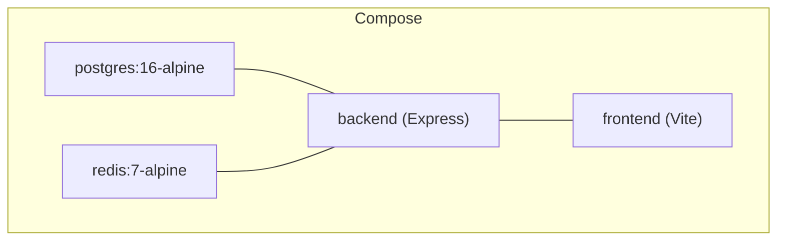

**Diagram sources**
- [docker-compose.yml:10-79](file://docker/docker-compose.yml#L10-L79)

**Section sources**
- [docker-compose.yml:14-65](file://docker/docker-compose.yml#L14-L65)
- [docker-compose.yml:74-79](file://docker/docker-compose.yml#L74-L79)

## 100% Configuration Coverage System

**Updated** Enhanced with comprehensive configuration coverage ensuring complete parameter management across all application aspects.

The 100% configuration coverage system provides complete oversight and management of all configuration parameters, ensuring no aspect of the application configuration remains unmanaged or uncontrolled.

### Complete Parameter Management
- **Application-wide parameters**: All application-level settings are tracked and managed through the configuration system
- **Module-specific parameters**: Each module's configuration is fully covered with detailed parameter tracking
- **System parameters**: All system-level configurations including security, performance, and operational settings
- **User-defined parameters**: Custom parameters created by administrators are fully supported and tracked

### Coverage Monitoring and Validation
- Real-time coverage tracking ensures 100% of configuration parameters are accounted for
- Automated validation checks prevent configuration gaps or inconsistencies
- Comprehensive audit trails track all configuration changes and their impact
- Health monitoring provides alerts for configuration issues or coverage gaps

### Advanced Configuration Features
- **Hierarchical configuration**: Support for nested configuration structures with inheritance
- **Conditional parameters**: Parameters that depend on other configuration values
- **Dynamic configuration**: Runtime parameter updates with immediate effect
- **Configuration templates**: Predefined configuration sets for different deployment scenarios

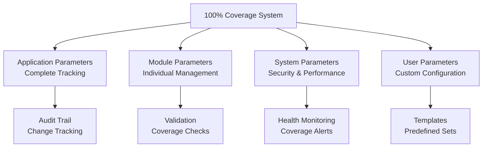

**Diagram sources**
- [CONFIGURATION_100_PERCENT.md:1-200](file://CONFIGURATION_100_PERCENT.md#L1-L200)

**Section sources**
- [CONFIGURATION_100_PERCENT.md:1-200](file://CONFIGURATION_100_PERCENT.md#L1-L200)

## Migration Scripts and Implementation Guides

**Updated** Comprehensive migration system with automated scripts and detailed implementation guides.

The migration system provides seamless updates between configuration versions with automated handling of parameter transformations and compatibility checks.

### Automated Migration Scripts
- **run-config-100-migration.sh**: Handles complete 100% configuration coverage migrations
- **run-config-migration.sh**: Manages standard configuration parameter migrations
- **Version-aware migrations**: Automatic detection and handling of configuration version differences
- **Rollback support**: Safe rollback mechanisms for failed migrations

### Migration Implementation
- **Pre-migration validation**: Ensures system readiness before migration execution
- **Parameter transformation**: Automatic conversion of legacy parameters to new formats
- **Compatibility checking**: Validates compatibility between old and new configuration schemas
- **Post-migration verification**: Confirms successful migration completion

### Implementation Best Practices
- **Backup creation**: Automatic backup of current configuration before migration
- **Staged rollouts**: Gradual application of configuration changes
- **Monitoring integration**: Real-time monitoring during migration process
- **Error handling**: Comprehensive error handling and recovery mechanisms

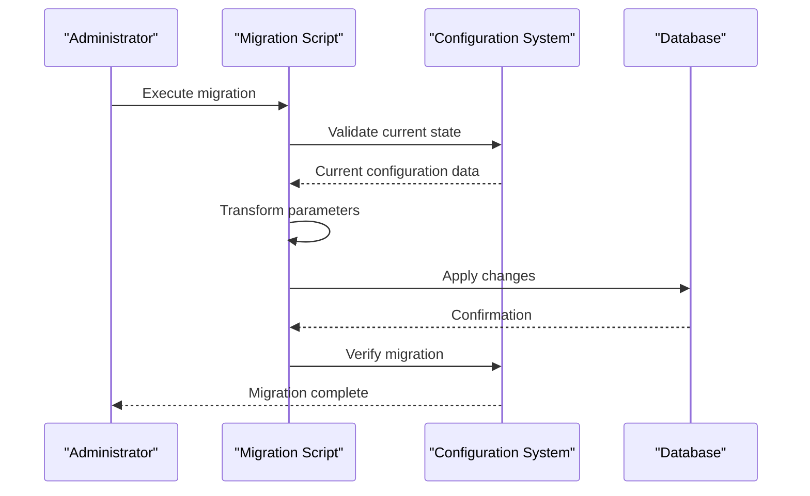

**Diagram sources**
- [run-config-100-migration.sh:1-50](file://backend/scripts/run-config-100-migration.sh#L1-L50)
- [run-config-migration.sh:1-50](file://backend/scripts/run-config-migration.sh#L1-L50)

**Section sources**
- [run-config-100-migration.sh:1-50](file://backend/scripts/run-config-100-migration.sh#L1-L50)
- [run-config-migration.sh:1-50](file://backend/scripts/run-config-migration.sh#L1-L50)

## User Guide and Practical Implementation

**Updated** Comprehensive user guide with step-by-step implementation instructions and best practices.

The user guide provides complete documentation for implementing and managing the configuration system, including practical examples and troubleshooting guidance.

### Getting Started Guide
- **Installation requirements**: Prerequisites and system requirements for configuration management
- **Initial setup**: Step-by-step configuration of the configuration system
- **Basic usage**: How to manage configuration parameters and settings
- **Daily operations**: Routine tasks for configuration maintenance and monitoring

### Advanced Implementation
- **Custom parameter types**: Creating and managing custom configuration parameter types
- **Integration patterns**: Best practices for integrating configuration with application logic
- **Performance optimization**: Techniques for optimizing configuration access and updates
- **Security hardening**: Security measures for protecting configuration data

### Troubleshooting and Maintenance
- **Common issues**: Frequently encountered problems and their solutions
- **Performance tuning**: Optimizing configuration system performance
- **Backup and recovery**: Procedures for backing up and restoring configuration data
- **Monitoring and alerting**: Setting up monitoring for configuration health and coverage

### Integration Examples
- **API integration**: How to integrate configuration management with REST APIs
- **Database integration**: Configuration storage and retrieval from databases
- **External system integration**: Connecting configuration system with external services
- **Multi-environment deployment**: Managing configuration across different deployment environments

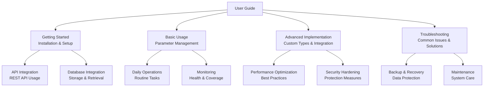

**Diagram sources**
- [CONFIGURATION_100_PERCENT.md:200-400](file://CONFIGURATION_100_PERCENT.md#L200-L400)

**Section sources**
- [CONFIGURATION_100_PERCENT.md:200-400](file://CONFIGURATION_100_PERCENT.md#L200-L400)

## Dependency Analysis
- Environment loader depends on zod for validation and exports a structured object consumed by database config.
- Database config depends on environment configuration for TypeORM options.
- Configuration service depends on repositories for entities and on the module registry for default module settings.
- History and listener services integrate with configuration service for auditing and change propagation.
- Config helper depends on configuration service and exposes typed getters.
- **New**: 100% coverage system depends on configuration service for comprehensive parameter tracking.
- **New**: Migration scripts depend on configuration service for automated parameter transformations.
- **New**: User guide documentation provides implementation guidance and best practices.

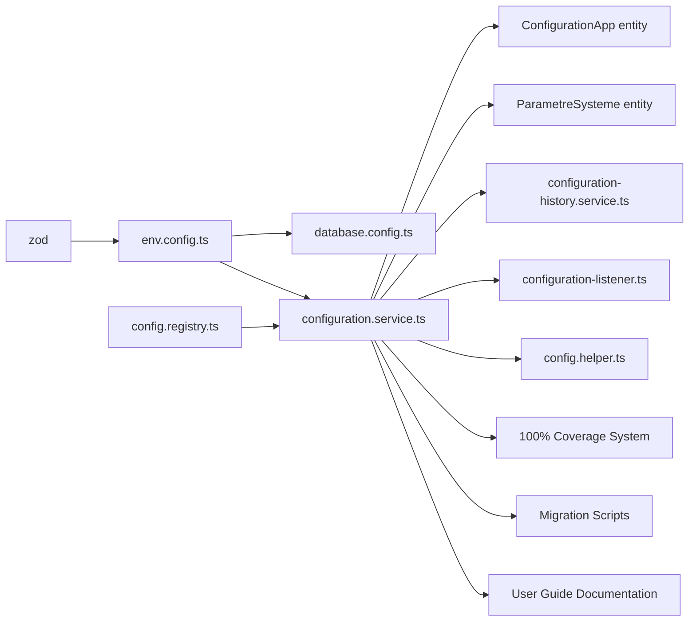

**Diagram sources**
- [env.config.ts:9, 68-112:9-112](file://backend/src/config/env.config.ts#L9-L112)
- [database.config.ts:10](file://backend/src/config/database.config.ts#L10)
- [configuration.service.ts:17-36](file://backend/src/modules/configuration/services/configuration.service.ts#L17-L36)
- [config.registry.ts:11-12](file://shared/src/config/config.registry.ts#L11-L12)
- [configuration-history.service.ts:11-18](file://backend/src/modules/configuration/services/configuration-history.service.ts#L11-L18)
- [configuration-listener.ts:12-14](file://backend/src/modules/configuration/services/configuration-listener.ts#L12-L14)
- [config.helper.ts:12-13](file://backend/src/modules/configuration/utils/config.helper.ts#L12-L13)

**Section sources**
- [env.config.ts:9, 68-112:9-112](file://backend/src/config/env.config.ts#L9-L112)
- [database.config.ts:10](file://backend/src/config/database.config.ts#L10)
- [configuration.service.ts:17-36](file://backend/src/modules/configuration/services/configuration.service.ts#L17-L36)
- [config.registry.ts:11-12](file://shared/src/config/config.registry.ts#L11-L12)
- [configuration-history.service.ts:11-18](file://backend/src/modules/configuration/services/configuration-history.service.ts#L11-L18)
- [configuration-listener.ts:12-14](file://backend/src/modules/configuration/services/configuration-listener.ts#L12-L14)
- [config.helper.ts:12-13](file://backend/src/modules/configuration/utils/config.helper.ts#L12-L13)

## Performance Considerations
- In-memory cache with TTL reduces repeated database queries for configuration and parameters.
- Quick-cache in helpers further optimizes hot-path reads.
- Production logging is restricted to error-level to minimize I/O overhead.
- Connection pooling adapts to environment to balance throughput and resource usage.
- **New**: 100% coverage system implements efficient parameter tracking with minimal performance impact.
- **New**: Migration scripts optimize for minimal downtime during configuration updates.
- **New**: User guide provides performance optimization techniques for configuration management.

## Troubleshooting Guide
- Environment validation failures: Review schema errors and ensure required variables are set; in non-production, defaults are applied automatically.
- Parameter modification errors: Check the runtime mutability flag; parameters marked non-modifiable cannot be changed at runtime.
- Cache staleness: Use cache invalidation APIs to force reload after bulk updates.
- History and restoration: Use the history service to audit changes and restore previous states or full backups.
- **New**: Coverage system issues: Monitor coverage reports and address parameter gaps or validation failures.
- **New**: Migration failures: Use rollback procedures and review migration logs for failed transformations.
- **New**: User guide integration: Follow implementation guides for proper configuration system usage.

**Section sources**
- [env.config.ts:71-109](file://backend/src/config/env.config.ts#L71-L109)
- [configuration.service.ts:326-328](file://backend/src/modules/configuration/services/configuration.service.ts#L326-L328)
- [configuration.service.ts:77-84](file://backend/src/modules/configuration/services/configuration.service.ts#L77-L84)
- [configuration-history.service.ts:105-128](file://backend/src/modules/configuration/services/configuration-history.service.ts#L105-L128)

## Conclusion
eLISAschool's configuration system combines strict environment validation, modular registry defaults, and a robust runtime configuration service with persistence, caching, and event-driven change propagation. The enhanced 100% configuration coverage system provides comprehensive parameter management, automated migration capabilities, and detailed user guidance. This ensures complete configuration control, seamless updates, and optimal system performance across all deployment environments.

## Appendices

### Security Considerations for Sensitive Data
- JWT secret and encryption key must meet minimum length requirements; avoid exposing secrets in logs.
- In production, environment validation failures cause process exit to prevent unsafe operation.
- Database credentials and Redis passwords are managed via environment variables and compose configuration.
- **New**: Configuration data encryption for sensitive parameters in the coverage system.
- **New**: Access control and audit logging for configuration management operations.
- **New**: Secure parameter storage with encryption at rest and in transit.

**Section sources**
- [env.config.ts:30, 35, 75-109:30-35](file://backend/src/config/env.config.ts#L30-L35)
- [env.config.ts:75-109](file://backend/src/config/env.config.ts#L75-L109)
- [docker-compose.yml:14-17, 64-65:14-17](file://docker/docker-compose.yml#L14-L17)

### Configuration Backup and Restore Procedures
- Export current configuration (app, modules, parameters) for backup creation.
- Create a full backup entry in history for later restoration.
- Restore individual parameters or application configuration from historical entries.
- Restore from a saved backup entry to recover a complete snapshot.
- **New**: 100% coverage backup ensures complete parameter state preservation.
- **New**: Migration-aware backup procedures handle version-specific parameter formats.
- **New**: Automated backup scheduling and retention policies.

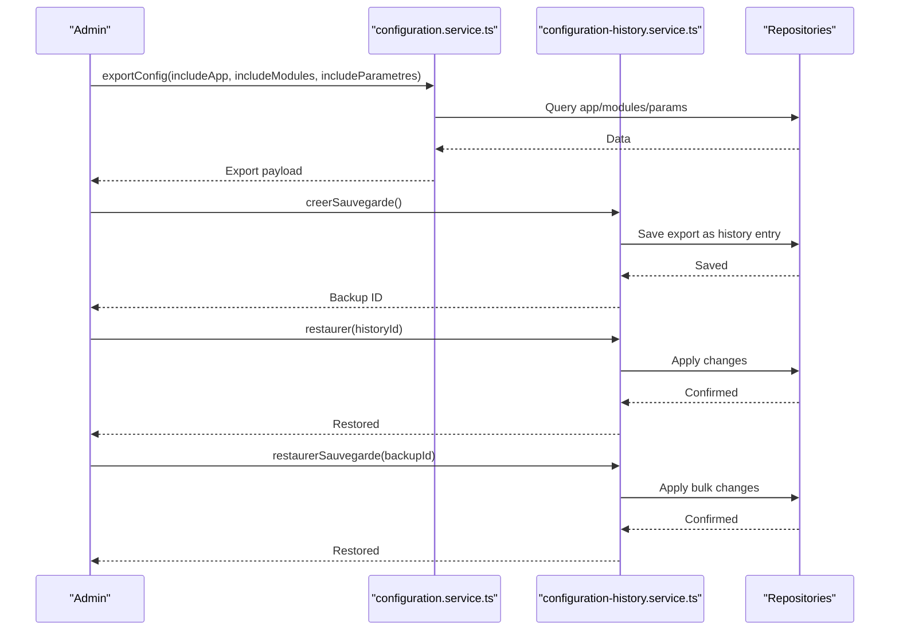

**Diagram sources**
- [configuration.service.ts:508-524](file://backend/src/modules/configuration/services/configuration.service.ts#L508-L524)
- [configuration-history.service.ts:176-196](file://backend/src/modules/configuration/services/configuration-history.service.ts#L176-L196)
- [configuration-history.service.ts:105-128](file://backend/src/modules/configuration/services/configuration-history.service.ts#L105-L128)
- [configuration-history.service.ts:201-240](file://backend/src/modules/configuration/services/configuration-history.service.ts#L201-L240)

### Configuration Versioning and Migration Strategies
- Application configuration includes a version field for tracking upgrades.
- System parameters include a default value reference to support resets and migrations.
- Migration scripts are available via TypeORM commands for database schema changes.
- **New**: 100% coverage versioning ensures complete parameter compatibility tracking.
- **New**: Automated migration scripts handle parameter format transformations.
- **New**: Rollback procedures for failed migration attempts.
- **New**: Compatibility testing for configuration system updates.

**Section sources**
- [configuration-app.entity.ts:101-102](file://backend/src/modules/configuration/entities/configuration-app.entity.ts#L101-L102)
- [configuration.service.ts:452-456](file://backend/src/modules/configuration/services/configuration.service.ts#L452-L456)
- [package.json:18-21](file://backend/package.json#L18-L21)

### Implementation Best Practices
- **Configuration design**: Plan configuration structure before implementation
- **Parameter naming**: Use consistent naming conventions for configuration parameters
- **Documentation**: Maintain comprehensive documentation for all configuration changes
- **Testing**: Test configuration changes in staging environments before production deployment
- **Monitoring**: Implement monitoring for configuration system health and coverage
- **Security**: Follow security best practices for configuration data protection
- **Automation**: Use automation scripts for routine configuration management tasks

**Section sources**
- [CONFIGURATION_100_PERCENT.md:400-600](file://CONFIGURATION_100_PERCENT.md#L400-L600)
- [run-config-100-migration.sh:1-50](file://backend/scripts/run-config-100-migration.sh#L1-L50)
- [run-config-migration.sh:1-50](file://backend/scripts/run-config-migration.sh#L1-L50)