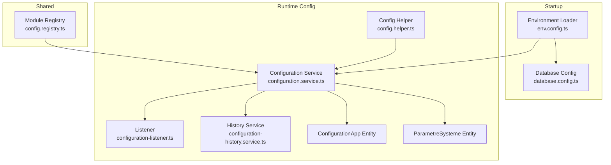
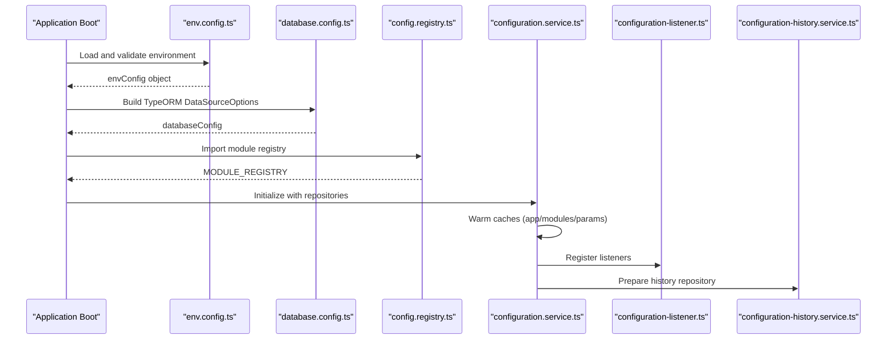
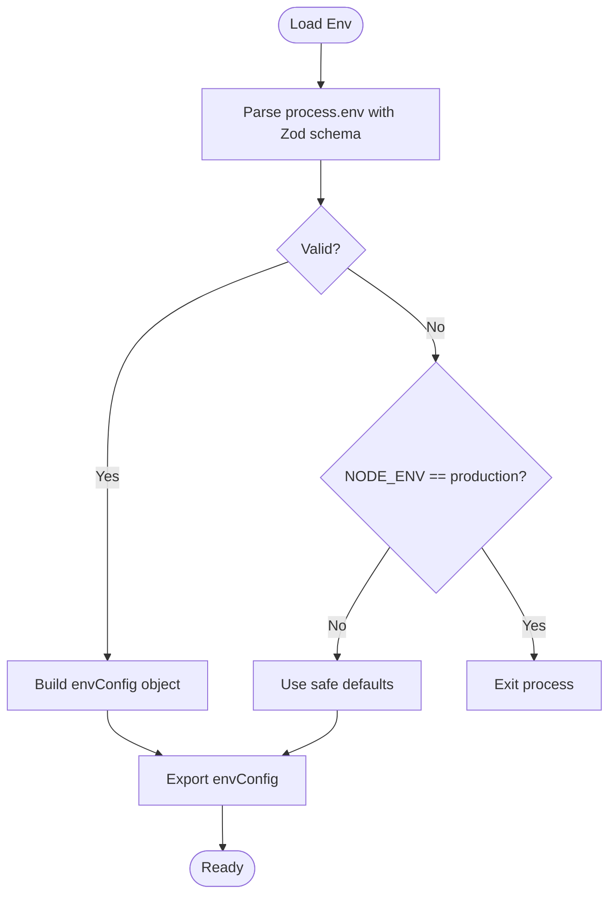
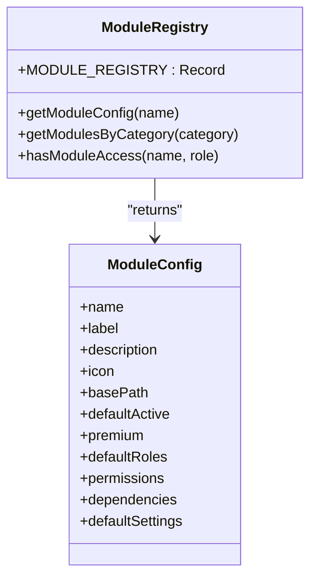
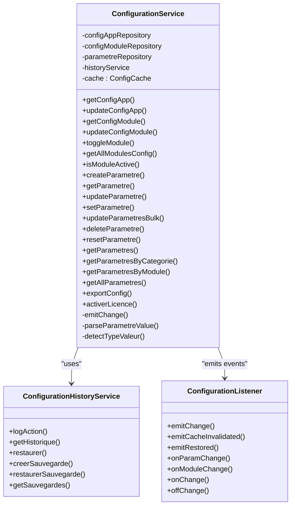
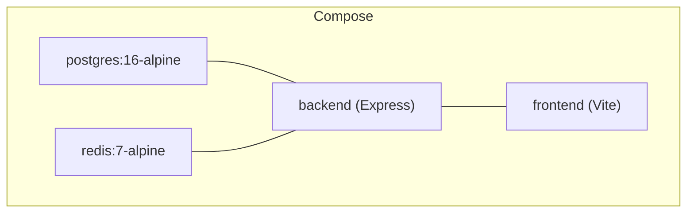
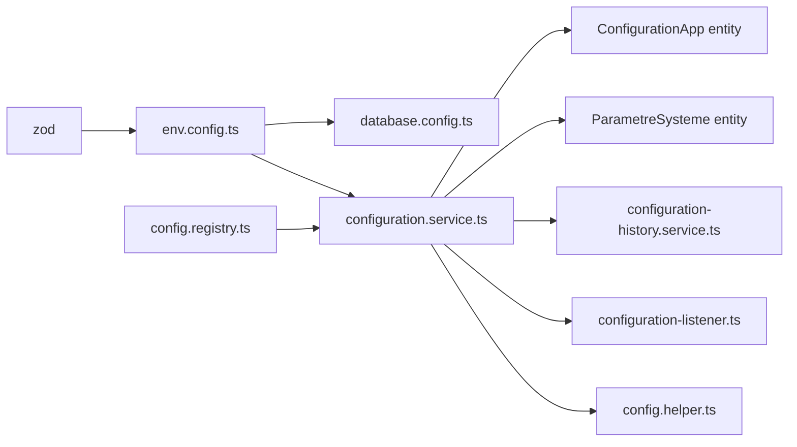
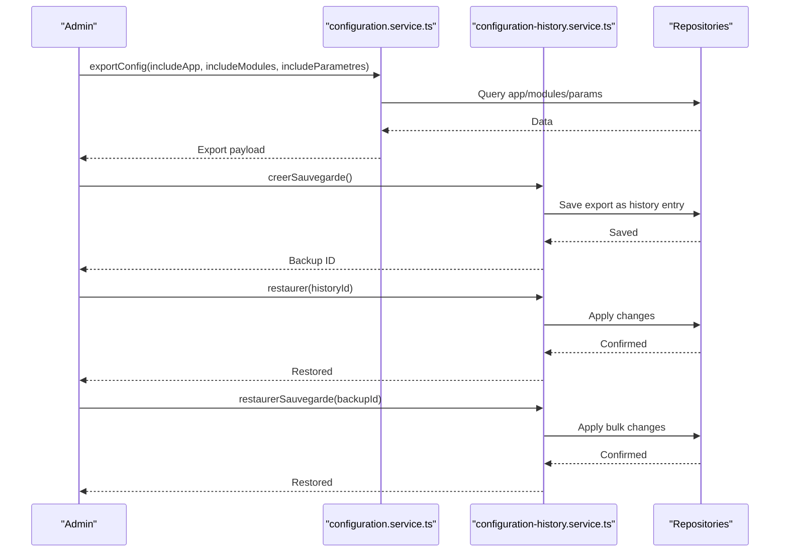

# Configuration & Environment Management

<cite>
**Referenced Files in This Document**
- [env.config.ts](file://backend/src/config/env.config.ts)
- [database.config.ts](file://backend/src/config/database.config.ts)
- [index.ts](file://backend/src/config/index.ts)
- [config.registry.ts](file://shared/src/config/config.registry.ts)
- [configuration.service.ts](file://backend/src/modules/configuration/services/configuration.service.ts)
- [configuration-listener.ts](file://backend/src/modules/configuration/services/configuration-listener.ts)
- [configuration-history.service.ts](file://backend/src/modules/configuration/services/configuration-history.service.ts)
- [config.helper.ts](file://backend/src/modules/configuration/utils/config.helper.ts)
- [configuration-app.entity.ts](file://backend/src/modules/configuration/entities/configuration-app.entity.ts)
- [parametre-systeme.entity.ts](file://backend/src/modules/configuration/entities/parametre-systeme.entity.ts)
- [docker-compose.yml](file://docker/docker-compose.yml)
- [package.json](file://backend/package.json)
</cite>

## Table of Contents
1. [Introduction](#introduction)
2. [Project Structure](#project-structure)
3. [Core Components](#core-components)
4. [Architecture Overview](#architecture-overview)
5. [Detailed Component Analysis](#detailed-component-analysis)
6. [Dependency Analysis](#dependency-analysis)
7. [Performance Considerations](#performance-considerations)
8. [Troubleshooting Guide](#troubleshooting-guide)
9. [Conclusion](#conclusion)
10. [Appendices](#appendices)

## Introduction
This document explains how eLISAschool manages configuration and environments across the backend. It covers environment variable validation and defaults, database connection settings, application-wide configuration, the configuration registry for modules, runtime configuration updates, environment-specific settings, and deployment configuration. It also addresses parameter validation, default value management, security considerations for sensitive data, backup and restore procedures, and configuration versioning and migration strategies.

## Project Structure
Configuration spans three main areas:
- Environment variables and database configuration loaded at startup
- Shared module registry defining default module behavior and settings
- Runtime configuration service managing application, module, and system parameters with persistence, caching, and change events

**Diagram sources**
- [env.config.ts:1-168](file://backend/src/config/env.config.ts#L1-L168)
- [database.config.ts:1-54](file://backend/src/config/database.config.ts#L1-L54)
- [config.registry.ts:1-414](file://shared/src/config/config.registry.ts#L1-L414)
- [configuration.service.ts:1-604](file://backend/src/modules/configuration/services/configuration.service.ts#L1-L604)
- [configuration-listener.ts:1-144](file://backend/src/modules/configuration/services/configuration-listener.ts#L1-L144)
- [configuration-history.service.ts:1-267](file://backend/src/modules/configuration/services/configuration-history.service.ts#L1-L267)
- [config.helper.ts:1-131](file://backend/src/modules/configuration/utils/config.helper.ts#L1-L131)
- [configuration-app.entity.ts:1-112](file://backend/src/modules/configuration/entities/configuration-app.entity.ts#L1-L112)
- [parametre-systeme.entity.ts:1-122](file://backend/src/modules/configuration/entities/parametre-systeme.entity.ts#L1-L122)

**Section sources**
- [env.config.ts:1-168](file://backend/src/config/env.config.ts#L1-L168)
- [database.config.ts:1-54](file://backend/src/config/database.config.ts#L1-L54)
- [config.registry.ts:1-414](file://shared/src/config/config.registry.ts#L1-L414)
- [configuration.service.ts:1-604](file://backend/src/modules/configuration/services/configuration.service.ts#L1-L604)
- [configuration-listener.ts:1-144](file://backend/src/modules/configuration/services/configuration-listener.ts#L1-L144)
- [configuration-history.service.ts:1-267](file://backend/src/modules/configuration/services/configuration-history.service.ts#L1-L267)
- [config.helper.ts:1-131](file://backend/src/modules/configuration/utils/config.helper.ts#L1-L131)
- [configuration-app.entity.ts:1-112](file://backend/src/modules/configuration/entities/configuration-app.entity.ts#L1-L112)
- [parametre-systeme.entity.ts:1-122](file://backend/src/modules/configuration/entities/parametre-systeme.entity.ts#L1-L122)

## Core Components
- Environment configuration loader validates and normalizes environment variables using schema validation, provides structured access, and falls back to safe defaults in non-production environments.
- Database configuration reads environment settings and sets TypeORM options including synchronization, logging, SSL, and connection pooling based on environment.
- Module registry defines default module metadata, permissions, dependencies, and default settings for all application modules.
- Configuration service provides a hybrid configuration system with in-memory caching, persistence, runtime parameter updates, and event emission for change propagation.
- History service tracks configuration actions, supports restoration, and maintains backups.
- Config helper offers typed helpers to quickly fetch parameters and module states with local caching.

**Section sources**
- [env.config.ts:68-165](file://backend/src/config/env.config.ts#L68-L165)
- [database.config.ts:15-51](file://backend/src/config/database.config.ts#L15-L51)
- [config.registry.ts:45-387](file://shared/src/config/config.registry.ts#L45-L387)
- [configuration.service.ts:53-604](file://backend/src/modules/configuration/services/configuration.service.ts#L53-L604)
- [configuration-history.service.ts:39-267](file://backend/src/modules/configuration/services/configuration-history.service.ts#L39-L267)
- [config.helper.ts:24-115](file://backend/src/modules/configuration/utils/config.helper.ts#L24-L115)

## Architecture Overview
The configuration system integrates environment loading, database setup, module registry, and runtime configuration management.

**Diagram sources**
- [env.config.ts:68-165](file://backend/src/config/env.config.ts#L68-L165)
- [database.config.ts:15-51](file://backend/src/config/database.config.ts#L15-L51)
- [config.registry.ts:45-387](file://shared/src/config/config.registry.ts#L45-L387)
- [configuration.service.ts:66-71](file://backend/src/modules/configuration/services/configuration.service.ts#L66-L71)
- [configuration-listener.ts:51-64](file://backend/src/modules/configuration/services/configuration-listener.ts#L51-L64)
- [configuration-history.service.ts:44-48](file://backend/src/modules/configuration/services/configuration-history.service.ts#L44-L48)

## Detailed Component Analysis

### Environment Variable Configuration
- Schema-driven validation ensures required variables are present and properly formatted, with explicit defaults for development/test.
- Environment categories include application, database, JWT, encryption, Redis, email, frontend URL, license, and logging.
- On validation failure, the system logs errors and either proceeds with safe defaults in non-production or exits in production.

**Diagram sources**
- [env.config.ts:68-112](file://backend/src/config/env.config.ts#L68-L112)

**Section sources**
- [env.config.ts:14-58](file://backend/src/config/env.config.ts#L14-L58)
- [env.config.ts:68-112](file://backend/src/config/env.config.ts#L68-L112)
- [env.config.ts:120-165](file://backend/src/config/env.config.ts#L120-L165)

### Database Connection Settings
- TypeORM options are derived from environment configuration.
- Development enables schema synchronization and verbose logging; production disables sync and restricts logging.
- Connection pooling scales with environment; SSL is enabled in production.
- Entities, migrations, and subscribers are configured via glob patterns.

**Diagram sources**
- [database.config.ts:15-51](file://backend/src/config/database.config.ts#L15-L51)

**Section sources**
- [database.config.ts:15-51](file://backend/src/config/database.config.ts#L15-L51)

### Application-Wide Configuration Options
- Application settings include environment, name, version, port, URLs, and production flags.
- These are exposed via a structured object for easy consumption across modules.

**Section sources**
- [env.config.ts:120-130](file://backend/src/config/env.config.ts#L120-L130)

### Configuration Registry System
- Defines default module metadata, icons, base paths, activation flags, premium flags, default roles, permissions, dependencies, and default settings.
- Provides lookup functions to retrieve module configs and check access by role.

**Diagram sources**
- [config.registry.ts:17-40](file://shared/src/config/config.registry.ts#L17-L40)
- [config.registry.ts:45-387](file://shared/src/config/config.registry.ts#L45-L387)

**Section sources**
- [config.registry.ts:45-387](file://shared/src/config/config.registry.ts#L45-L387)

### Configuration Service Implementation
- Hybrid configuration with in-memory cache (TTL) for app, modules, and parameters.
- CRUD for system parameters with validation, type detection, and runtime mutability controls.
- Change events emitted for cache invalidation and downstream reactions.
- License activation and module toggling integrated with history.

**Diagram sources**
- [configuration.service.ts:53-604](file://backend/src/modules/configuration/services/configuration.service.ts#L53-L604)
- [configuration-history.service.ts:39-267](file://backend/src/modules/configuration/services/configuration-history.service.ts#L39-L267)
- [configuration-listener.ts:51-144](file://backend/src/modules/configuration/services/configuration-listener.ts#L51-L144)

**Section sources**
- [configuration.service.ts:59-84](file://backend/src/modules/configuration/services/configuration.service.ts#L59-L84)
- [configuration.service.ts:94-146](file://backend/src/modules/configuration/services/configuration.service.ts#L94-L146)
- [configuration.service.ts:160-221](file://backend/src/modules/configuration/services/configuration.service.ts#L160-L221)
- [configuration.service.ts:263-442](file://backend/src/modules/configuration/services/configuration.service.ts#L263-L442)
- [configuration.service.ts:508-524](file://backend/src/modules/configuration/services/configuration.service.ts#L508-L524)
- [configuration.service.ts:530-546](file://backend/src/modules/configuration/services/configuration.service.ts#L530-L546)

### Parameter Validation and Default Value Management
- Parameters are stored with type, category, visibility, ordering, validation patterns, and options.
- Type detection converts persisted JSON strings to native types.
- Runtime mutability flag prevents unsafe changes during operation.
- Defaults are preserved for reset operations.

**Section sources**
- [parametre-systeme.entity.ts:24-52](file://backend/src/modules/configuration/entities/parametre-systeme.entity.ts#L24-L52)
- [parametre-systeme.entity.ts:58-119](file://backend/src/modules/configuration/entities/parametre-systeme.entity.ts#L58-L119)
- [configuration.service.ts:574-599](file://backend/src/modules/configuration/services/configuration.service.ts#L574-L599)
- [configuration.service.ts:444-472](file://backend/src/modules/configuration/services/configuration.service.ts#L444-L472)

### Runtime Configuration Updates and Events
- Cache invalidation triggers listener events for app, module, or parameter changes.
- Listeners support subscription to global changes, per-module changes, and per-parameter changes.
- Quick-cache in helpers reduces frequent DB reads for hot paths.

**Section sources**
- [configuration.service.ts:77-84](file://backend/src/modules/configuration/services/configuration.service.ts#L77-L84)
- [configuration-listener.ts:69-111](file://backend/src/modules/configuration/services/configuration-listener.ts#L69-L111)
- [config.helper.ts:18-37](file://backend/src/modules/configuration/utils/config.helper.ts#L18-L37)

### Environment-Specific Settings
- Development vs production toggles schema synchronization, logging verbosity, pool size, and SSL.
- Frontend URL and application URL are environment-controlled.

**Section sources**
- [database.config.ts:23-42](file://backend/src/config/database.config.ts#L23-L42)
- [env.config.ts:19, 50:19-20](file://backend/src/config/env.config.ts#L19-L20)
- [env.config.ts:127](file://backend/src/config/env.config.ts#L127)

### Deployment Configuration
- Docker Compose provisions Postgres and Redis, injects environment variables, and mounts shared code.
- Backend and frontend containers expose configurable ports and depend on healthy services.

**Diagram sources**
- [docker-compose.yml:10-79](file://docker/docker-compose.yml#L10-L79)

**Section sources**
- [docker-compose.yml:14-65](file://docker/docker-compose.yml#L14-L65)
- [docker-compose.yml:74-79](file://docker/docker-compose.yml#L74-L79)

## Dependency Analysis
- Environment loader depends on zod for validation and exports a structured object consumed by database config.
- Database config depends on environment configuration for TypeORM options.
- Configuration service depends on repositories for entities and on the module registry for default module settings.
- History and listener services integrate with configuration service for auditing and change propagation.
- Config helper depends on configuration service and exposes typed getters.

**Diagram sources**
- [env.config.ts:9, 68-112:9-112](file://backend/src/config/env.config.ts#L9-L112)
- [database.config.ts:10](file://backend/src/config/database.config.ts#L10)
- [configuration.service.ts:17-36](file://backend/src/modules/configuration/services/configuration.service.ts#L17-L36)
- [config.registry.ts:11-12](file://shared/src/config/config.registry.ts#L11-L12)
- [configuration-history.service.ts:11-18](file://backend/src/modules/configuration/services/configuration-history.service.ts#L11-L18)
- [configuration-listener.ts:12-14](file://backend/src/modules/configuration/services/configuration-listener.ts#L12-L14)
- [config.helper.ts:12-13](file://backend/src/modules/configuration/utils/config.helper.ts#L12-L13)

**Section sources**
- [env.config.ts:9, 68-112:9-112](file://backend/src/config/env.config.ts#L9-L112)
- [database.config.ts:10](file://backend/src/config/database.config.ts#L10)
- [configuration.service.ts:17-36](file://backend/src/modules/configuration/services/configuration.service.ts#L17-L36)
- [config.registry.ts:11-12](file://shared/src/config/config.registry.ts#L11-L12)
- [configuration-history.service.ts:11-18](file://backend/src/modules/configuration/services/configuration-history.service.ts#L11-L18)
- [configuration-listener.ts:12-14](file://backend/src/modules/configuration/services/configuration-listener.ts#L12-L14)
- [config.helper.ts:12-13](file://backend/src/modules/configuration/utils/config.helper.ts#L12-L13)

## Performance Considerations
- In-memory cache with TTL reduces repeated database queries for configuration and parameters.
- Quick-cache in helpers further optimizes hot-path reads.
- Production logging is restricted to error-level to minimize I/O overhead.
- Connection pooling adapts to environment to balance throughput and resource usage.

[No sources needed since this section provides general guidance]

## Troubleshooting Guide
- Environment validation failures: Review schema errors and ensure required variables are set; in non-production, defaults are applied automatically.
- Parameter modification errors: Check the runtime mutability flag; parameters marked non-modifiable cannot be changed at runtime.
- Cache staleness: Use cache invalidation APIs to force reload after bulk updates.
- History and restoration: Use the history service to audit changes and restore previous states or full backups.

**Section sources**
- [env.config.ts:71-109](file://backend/src/config/env.config.ts#L71-L109)
- [configuration.service.ts:326-328](file://backend/src/modules/configuration/services/configuration.service.ts#L326-L328)
- [configuration.service.ts:77-84](file://backend/src/modules/configuration/services/configuration.service.ts#L77-L84)
- [configuration-history.service.ts:105-128](file://backend/src/modules/configuration/services/configuration-history.service.ts#L105-L128)

## Conclusion
eLISAschool’s configuration system combines strict environment validation, modular registry defaults, and a robust runtime configuration service with persistence, caching, and event-driven change propagation. It supports secure deployments, safe parameter management, and auditable configuration lifecycle through history and backups.

[No sources needed since this section summarizes without analyzing specific files]

## Appendices

### Security Considerations for Sensitive Data
- JWT secret and encryption key must meet minimum length requirements; avoid exposing secrets in logs.
- In production, environment validation failures cause process exit to prevent unsafe operation.
- Database credentials and Redis passwords are managed via environment variables and compose configuration.

**Section sources**
- [env.config.ts:30, 35, 75-109:30-35](file://backend/src/config/env.config.ts#L30-L35)
- [env.config.ts:75-109](file://backend/src/config/env.config.ts#L75-L109)
- [docker-compose.yml:14-17, 64-65:14-17](file://docker/docker-compose.yml#L14-L17)

### Configuration Backup and Restore Procedures
- Export current configuration (app, modules, parameters) for backup creation.
- Create a full backup entry in history for later restoration.
- Restore individual parameters or application configuration from historical entries.
- Restore from a saved backup entry to recover a complete snapshot.

**Diagram sources**
- [configuration.service.ts:508-524](file://backend/src/modules/configuration/services/configuration.service.ts#L508-L524)
- [configuration-history.service.ts:176-196](file://backend/src/modules/configuration/services/configuration-history.service.ts#L176-L196)
- [configuration-history.service.ts:105-128](file://backend/src/modules/configuration/services/configuration-history.service.ts#L105-L128)
- [configuration-history.service.ts:201-240](file://backend/src/modules/configuration/services/configuration-history.service.ts#L201-L240)

### Configuration Versioning and Migration Strategies
- Application configuration includes a version field for tracking upgrades.
- System parameters include a default value reference to support resets and migrations.
- Migration scripts are available via TypeORM commands for database schema changes.

**Section sources**
- [configuration-app.entity.ts:101-102](file://backend/src/modules/configuration/entities/configuration-app.entity.ts#L101-L102)
- [configuration.service.ts:452-456](file://backend/src/modules/configuration/services/configuration.service.ts#L452-L456)
- [package.json:18-21](file://backend/package.json#L18-L21)