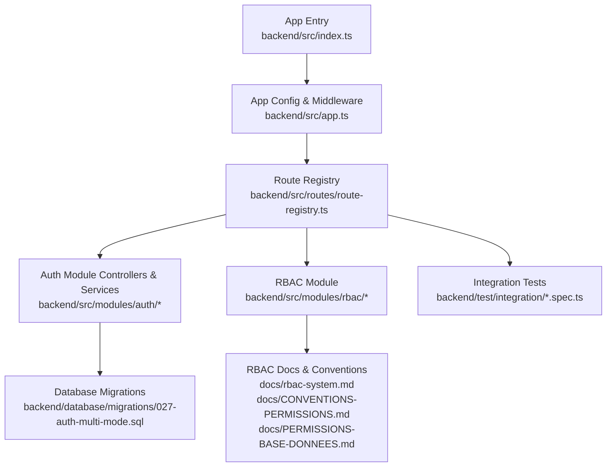
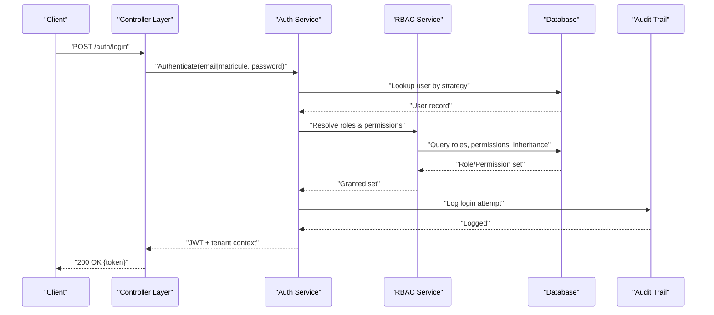
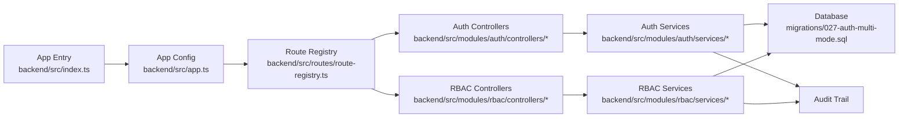

# Authentication & Authorization

<cite>
**Referenced Files in This Document**
- [app.ts](file://backend/src/app.ts)
- [index.ts](file://backend/src/index.ts)
- [route-registry.ts](file://backend/src/routes/route-registry.ts)
- [auth-multi-etablissement.spec.ts](file://backend/test/integration/auth-multi-etablissement.spec.ts)
- [configuration-multi-tenant.spec.ts](file://backend/test/integration/configuration-multi-tenant.spec.ts)
- [027-auth-multi-mode.sql](file://backend/database/migrations/027-auth-multi-mode.sql)
- [rbac-system.md](file://docs/rbac-system.md)
- [CONVENTIONS-PERMISSIONS.md](file://docs/CONVENTIONS-PERMISSIONS.md)
- [PERMISSIONS-BASE-DONNEES.md](file://docs/PERMISSIONS-BASE-DONNEES.md)
- [GUIDE-AUTHENTIFICATION.md](file://docs/guides/GUIDE-AUTHENTIFICATION.md)
- [IMPLÉMENTATION-AUTH-COMPLETE.md](file://docs/implementations/IMPLÉMENTATION-AUTH-COMPLETE.md)
- [SYSTEME-BLOCAGE-AUTH-DEUX-NIVEAUX.md](file://docs/SYSTEME-BLOCAGE-AUTH-DEUX-NIVEAUX.md)
- [IMPLEMENTATION-SESSION-RESUME-FINAL.md](file://docs/implementations/IMPLEMENTATION-SESSION-RESUME-FINAL.md)
- [CORRECTION-401-JWT-SECRET-DYNAMIQUE.md](file://docs/corrections/CORRECTION-401-JWT-SECRET-DYNAMIQUE.md)
- [CORRECTION-PERMISSIONS-COMPLETE-LOGIN.md](file://docs/corrections/CORRECTION-PERMISSIONS-COMPLETE-LOGIN.md)
- [CORRECTION-SUPER-ADMIN-ALL-PERMISSION.md](file://docs/corrections/CORRECTION-SUPER-ADMIN-ALL-PERMISSION.md)
- [guards-exemples-implémentation.ts](file://docs/guards-exemples-implémentation.ts)
- [guide-implémentation-permissions.ts](file://docs/guide-implémentation-permissions.ts)
</cite>

## Table of Contents
1. [Introduction](#introduction)
2. [Project Structure](#project-structure)
3. [Core Components](#core-components)
4. [Architecture Overview](#architecture-overview)
5. [Detailed Component Analysis](#detailed-component-analysis)
6. [Dependency Analysis](#dependency-analysis)
7. [Performance Considerations](#performance-considerations)
8. [Troubleshooting Guide](#troubleshooting-guide)
9. [Conclusion](#conclusion)
10. [Appendices](#appendices)

## Introduction
This document explains eLISAschool’s authentication and authorization system with a focus on:
- Multi-strategy authentication supporting email/password and matricule-based login
- Multi-tenant JWT handling across establishments
- Role-based access control (RBAC) with permission inheritance, granular permissions, and dynamic evaluation
- Guard system including PermissionGuard, RoleGuard, and custom guards for tenant isolation
- Practical flows for registration, login/logout, token management, and permission checks
- Audit trail integration for security events
- Session management, password policies, account lockout mechanisms, and security best practices
- Extensibility patterns for custom strategies and permission rules

The goal is to provide both high-level understanding and actionable guidance for developers integrating or extending the auth system.

## Project Structure
Authentication and authorization are implemented primarily under backend/src/modules/auth and related RBAC components. The application bootstraps middleware, routes, and guards from the app entry points and route registry. Tests validate multi-tenant behavior and configuration.

**Diagram sources**
- [index.ts](file://backend/src/index.ts)
- [app.ts](file://backend/src/app.ts)
- [route-registry.ts](file://backend/src/routes/route-registry.ts)
- [027-auth-multi-mode.sql](file://backend/database/migrations/027-auth-multi-mode.sql)
- [rbac-system.md](file://docs/rbac-system.md)
- [CONVENTIONS-PERMISSIONS.md](file://docs/CONVENTIONS-PERMISSIONS.md)
- [PERMISSIONS-BASE-DONNEES.md](file://docs/PERMISSIONS-BASE-DONNEES.md)
- [auth-multi-etablissement.spec.ts](file://backend/test/integration/auth-multi-etablissement.spec.ts)
- [configuration-multi-tenant.spec.ts](file://backend/test/integration/configuration-multi-tenant.spec.ts)

**Section sources**
- [index.ts](file://backend/src/index.ts)
- [app.ts](file://backend/src/app.ts)
- [route-registry.ts](file://backend/src/routes/route-registry.ts)
- [auth-multi-etablissement.spec.ts](file://backend/test/integration/auth-multi-etablissement.spec.ts)
- [configuration-multi-tenant.spec.ts](file://backend/test/integration/configuration-multi-tenant.spec.ts)

## Core Components
- Multi-strategy authentication
  - Email/password strategy
  - Matricule-based strategy
  - Strategy selection based on request context and user lookup
- Multi-tenant JWT handling
  - Tenant-aware claims and scoping
  - Establishment context propagation through requests
- RBAC engine
  - Roles, permissions, and inheritance
  - Granular permission model and dynamic evaluation
- Guard system
  - PermissionGuard for fine-grained checks
  - RoleGuard for role-based checks
  - Custom guards for tenant isolation and policy enforcement
- Audit trail integration
  - Security event logging for authz decisions and failures
- Session and token lifecycle
  - Token issuance, refresh, rotation, and revocation
  - Lockout and rate limiting around login attempts

Key implementation references:
- Auth module controllers/services and strategies
- RBAC module services and decorators
- Route-level guard composition
- Database schema for multi-mode auth and RBAC tables

**Section sources**
- [027-auth-multi-mode.sql](file://backend/database/migrations/027-auth-multi-mode.sql)
- [rbac-system.md](file://docs/rbac-system.md)
- [CONVENTIONS-PERMISSIONS.md](file://docs/CONVENTIONS-PERMISSIONS.md)
- [PERMISSIONS-BASE-DONNEES.md](file://docs/PERMISSIONS-BASE-DONNEES.md)

## Architecture Overview
The system uses a layered approach:
- HTTP layer: Controllers receive requests and delegate to services
- Service layer: Orchestrates authentication, RBAC checks, and tenant scoping
- Guard layer: Enforces policies at route/controller boundaries
- Persistence layer: Stores users, roles, permissions, audit logs, and tenant metadata
- Test layer: Validates multi-tenant behavior and configuration

**Diagram sources**
- [route-registry.ts](file://backend/src/routes/route-registry.ts)
- [027-auth-multi-mode.sql](file://backend/database/migrations/027-auth-multi-mode.sql)
- [rbac-system.md](file://docs/rbac-system.md)

## Detailed Component Analysis

### Multi-Strategy Authentication
- Strategies supported:
  - Email/password
  - Matricule-based login
- Strategy resolution:
  - Request body fields determine strategy
  - User lookup adapts to strategy
  - Password verification and account status checks
- Output:
  - JWT containing user identity, roles, permissions, and tenant context

Practical flow:
- Registration creates user with credentials and default role(s)
- Login selects strategy, verifies credentials, resolves RBAC, issues JWT
- Logout invalidates token or clears session state per policy

Security considerations:
- Rate limiting and lockout after repeated failures
- Secure password hashing and policy enforcement
- Tenant isolation enforced via claims and middleware

**Section sources**
- [027-auth-multi-mode.sql](file://backend/database/migrations/027-auth-multi-mode.sql)
- [GUIDE-AUTHENTIFICATION.md](file://docs/guides/GUIDE-AUTHENTIFICATION.md)
- [IMPLÉMENTATION-AUTH-COMPLETE.md](file://docs/implementations/IMPLÉMENTATION-AUTH-COMPLETE.md)
- [SYSTEME-BLOCAGE-AUTH-DEUX-NIVEAUX.md](file://docs/SYSTEME-BLOCAGE-AUTH-DEUX-NIVEAUX.md)

### Multi-Tenant JWT Handling
- JWT payload includes:
  - User identifier
  - Roles and permissions
  - Tenant/establishment identifiers
- Middleware validates tenant context and scopes queries accordingly
- Cross-tenant access prevented unless explicitly allowed by policy

Operational notes:
- Token refresh preserves tenant context
- Switching tenants requires re-authentication or explicit token update

**Section sources**
- [auth-multi-etablissement.spec.ts](file://backend/test/integration/auth-multi-etablissement.spec.ts)
- [configuration-multi-tenant.spec.ts](file://backend/test/integration/configuration-multi-tenant.spec.ts)
- [CORRECTION-401-JWT-SECRET-DYNAMIQUE.md](file://docs/corrections/CORRECTION-401-JWT-SECRET-DYNAMIQUE.md)

### RBAC: Roles, Permissions, Inheritance, and Dynamic Evaluation
- Data model:
  - Roles define sets of permissions
  - Permissions are granular actions/resources
  - Inheritance allows hierarchical role structures
- Evaluation:
  - Static checks for common cases
  - Dynamic evaluation for complex policies
- Super-admin behavior:
  - All-permission flag for administrative operations

Implementation references:
- RBAC documentation and conventions
- Database schema for RBAC entities
- Decorators and guards for declarative checks

**Section sources**
- [rbac-system.md](file://docs/rbac-system.md)
- [CONVENTIONS-PERMISSIONS.md](file://docs/CONVENTIONS-PERMISSIONS.md)
- [PERMISSIONS-BASE-DONNEES.md](file://docs/PERMISSIONS-BASE-DONNEES.md)
- [CORRECTION-SUPER-ADMIN-ALL-PERMISSION.md](file://docs/corrections/CORRECTION-SUPER-ADMIN-ALL-PERMISSION.md)

### Guard System: PermissionGuard, RoleGuard, and Custom Guards
- PermissionGuard:
  - Checks specific permissions against current user’s resolved set
- RoleGuard:
  - Checks required roles against current user’s roles
- Custom guards:
  - Tenant isolation guard enforces establishment scoping
  - Policy-based guards evaluate contextual conditions

Usage patterns:
- Apply guards at controller or route level
- Combine guards for layered security
- Extend guards for domain-specific checks

Extensibility:
- Implement new guards by following existing interfaces
- Register guards in dependency injection container
- Compose guards for complex scenarios

**Section sources**
- [guards-exemples-implémentation.ts](file://docs/guards-exemples-implémentation.ts)
- [guide-implémentation-permissions.ts](file://docs/guide-implémentation-permissions.ts)
- [rbac-system.md](file://docs/rbac-system.md)

### Audit Trail Integration for Security Events
- Logged events include:
  - Successful and failed login attempts
  - Permission denials
  - Token issuance and revocation
  - Tenant switching and scope changes
- Storage:
  - Dedicated audit table(s) with timestamps and actor context
- Consumption:
  - Admin dashboards and compliance reports

Best practices:
- Avoid logging sensitive data (passwords, tokens)
- Ensure audit writes do not block critical paths
- Retention policies aligned with compliance requirements

**Section sources**
- [SYSTEME-BLOCAGE-AUTH-DEUX-NIVEAUX.md](file://docs/SYSTEME-BLOCAGE-AUTH-DEUX-NIVEAUX.md)
- [rbac-system.md](file://docs/rbac-system.md)

### Session Management, Password Policies, and Account Lockout
- Sessions:
  - Stateless JWT-based sessions with optional server-side revocation lists
  - Refresh tokens for seamless renewal
- Password policies:
  - Complexity requirements and history checks
  - Secure storage using modern hashing algorithms
- Account lockout:
  - Two-level blocking mechanism configurable by admin
  - Temporary locks after repeated failures
  - Recovery workflows for administrators

References:
- Session implementation summary
- Lockout system documentation

**Section sources**
- [IMPLEMENTATION-SESSION-RESUME-FINAL.md](file://docs/implementations/IMPLEMENTATION-SESSION-RESUME-FINAL.md)
- [SYSTEME-BLOCAGE-AUTH-DEUX-NIVEAUX.md](file://docs/SYSTEME-BLOCAGE-AUTH-DEUX-NIVEAUX.md)

### Practical Examples and Patterns
- User registration flow:
  - Validate input, hash password, assign default role(s), create user, log audit event
- Login/logout processes:
  - Strategy selection, credential verification, RBAC resolution, JWT issuance
  - Logout invalidation or client-side token removal
- Token management:
  - Issuance, refresh, rotation, revocation
  - Tenant context preservation
- Permission checking patterns:
  - Declarative guards for endpoints
  - Programmatic checks in service logic
  - Dynamic evaluation for complex policies

Code example references:
- Guard examples file
- Permission implementation guide
- Auth complete implementation doc

**Section sources**
- [guards-exemples-implémentation.ts](file://docs/guards-exemples-implémentation.ts)
- [guide-implémentation-permissions.ts](file://docs/guide-implémentation-permissions.ts)
- [IMPLÉMENTATION-AUTH-COMPLETE.md](file://docs/implementations/IMPLÉMENTATION-AUTH-COMPLETE.md)
- [CORRECTION-PERMISSIONS-COMPLETE-LOGIN.md](file://docs/corrections/CORRECTION-PERMISSIONS-COMPLETE-LOGIN.md)

## Dependency Analysis
High-level dependencies among core components:

**Diagram sources**
- [index.ts](file://backend/src/index.ts)
- [app.ts](file://backend/src/app.ts)
- [route-registry.ts](file://backend/src/routes/route-registry.ts)
- [027-auth-multi-mode.sql](file://backend/database/migrations/027-auth-multi-mode.sql)

**Section sources**
- [index.ts](file://backend/src/index.ts)
- [app.ts](file://backend/src/app.ts)
- [route-registry.ts](file://backend/src/routes/route-registry.ts)
- [027-auth-multi-mode.sql](file://backend/database/migrations/027-auth-multi-mode.sql)

## Performance Considerations
- Minimize RBAC lookups by caching resolved permissions where safe
- Use efficient database indexes for user, role, and permission joins
- Batch permission checks when possible
- Avoid heavy computations in hot paths; defer to background jobs if needed
- Keep audit writes asynchronous to prevent latency spikes

[No sources needed since this section provides general guidance]

## Troubleshooting Guide
Common issues and resolutions:
- 401 Unauthorized due to dynamic JWT secret misconfiguration
  - Verify secret configuration and environment variables
  - Check token signing algorithm and expiration settings
- Permission denied during login flows
  - Confirm role assignments and permission inheritance
  - Validate super-admin all-permission flags
- Multi-tenant isolation failures
  - Ensure tenant context is present in JWT and propagated
  - Review tenant isolation guard logic

Diagnostic resources:
- JWT secret correction guide
- Permissions completion for login
- Super-admin all-permission fix

**Section sources**
- [CORRECTION-401-JWT-SECRET-DYNAMIQUE.md](file://docs/corrections/CORRECTION-401-JWT-SECRET-DYNAMIQUE.md)
- [CORRECTION-PERMISSIONS-COMPLETE-LOGIN.md](file://docs/corrections/CORRECTION-PERMISSIONS-COMPLETE-LOGIN.md)
- [CORRECTION-SUPER-ADMIN-ALL-PERMISSION.md](file://docs/corrections/CORRECTION-SUPER-ADMIN-ALL-PERMISSION.md)

## Conclusion
eLISAschool’s authentication and authorization system combines flexible multi-strategy login, robust RBAC with inheritance and dynamic evaluation, and strong multi-tenant isolation. The guard system enables declarative and programmatic access control, while audit trails ensure visibility into security events. With clear extensibility points, teams can implement custom strategies and permission rules to meet evolving business needs.

[No sources needed since this section summarizes without analyzing specific files]

## Appendices

### Appendix A: RBAC Data Model Overview
- Entities:
  - Users
  - Roles
  - Permissions
  - Role-Permission mappings
  - Inheritance relationships
- Key attributes:
  - Unique identifiers
  - Descriptive names and codes
  - Timestamps for auditing

**Section sources**
- [PERMISSIONS-BASE-DONNEES.md](file://docs/PERMISSIONS-BASE-DONNEES.md)
- [rbac-system.md](file://docs/rbac-system.md)

### Appendix B: Guard Implementation Checklist
- Define guard interface and constructor parameters
- Implement decision logic using current user context
- Register guard in DI container
- Apply guard at route/controller level
- Add unit tests for edge cases and policy variations

**Section sources**
- [guards-exemples-implémentation.ts](file://docs/guards-exemples-implémentation.ts)
- [guide-implémentation-permissions.ts](file://docs/guide-implémentation-permissions.ts)