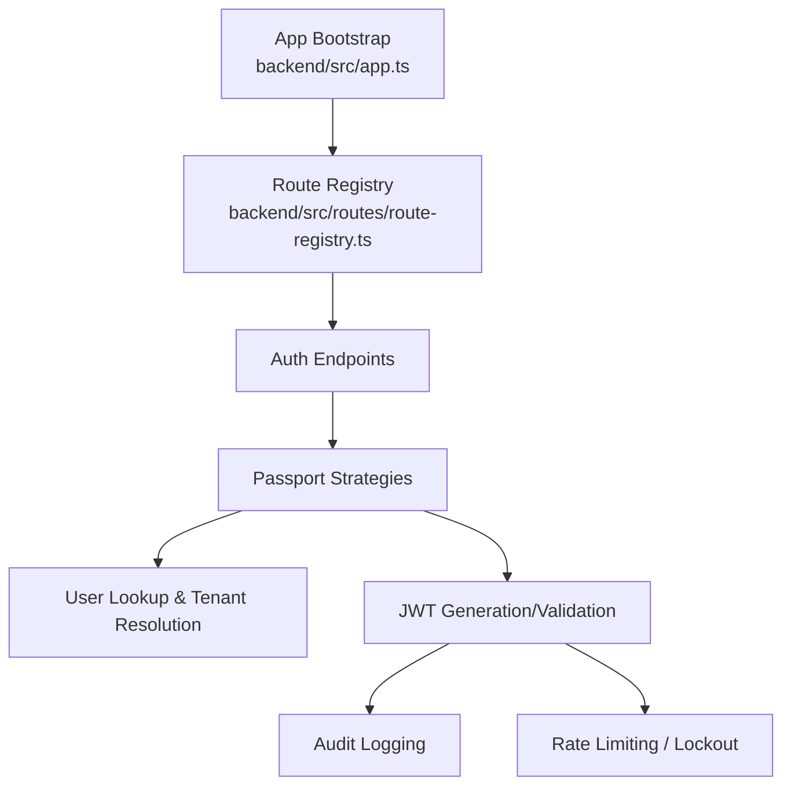
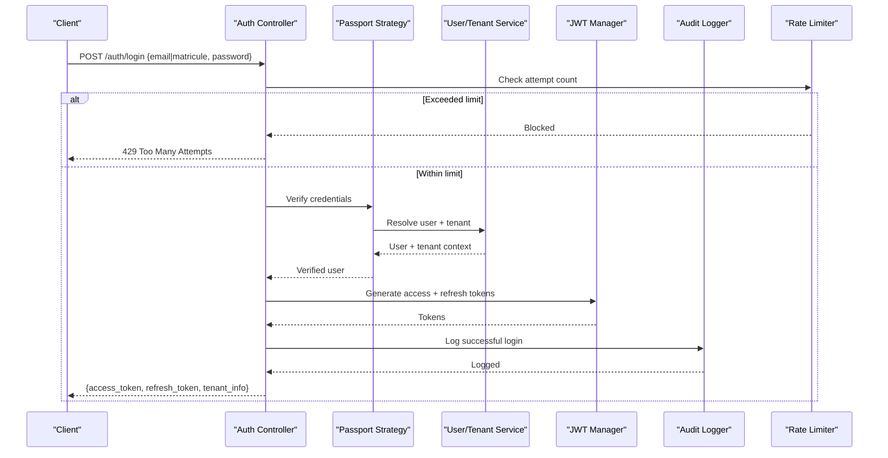
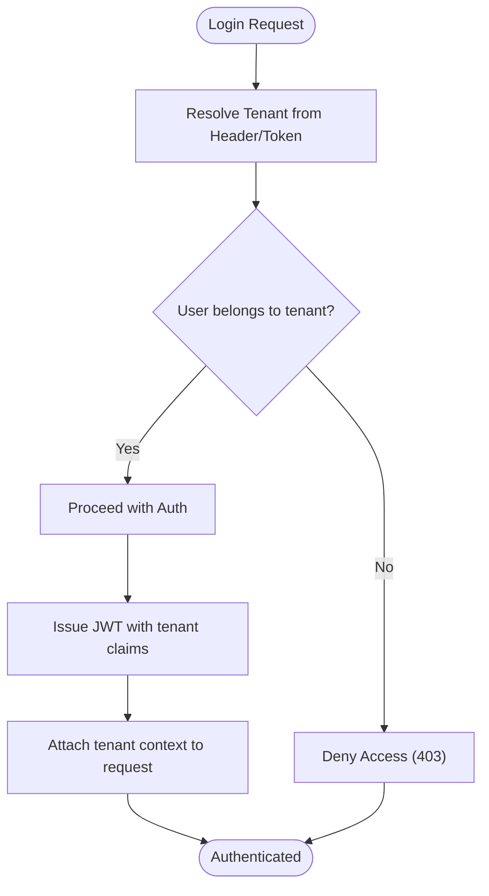
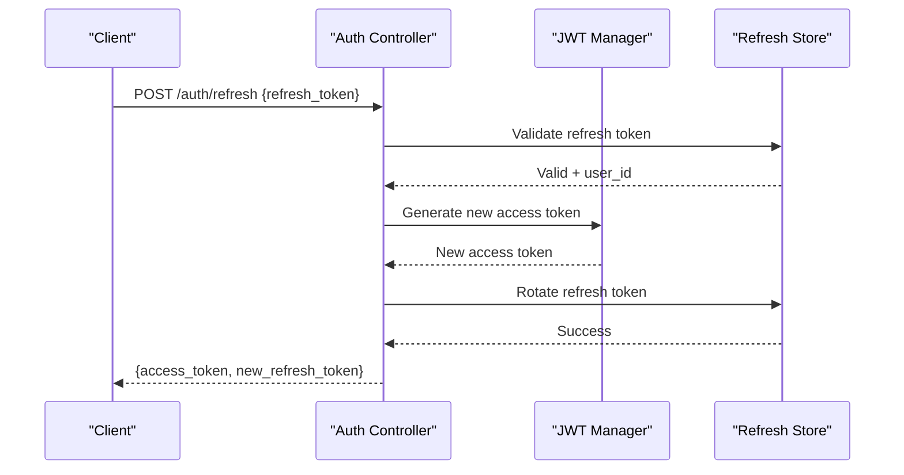
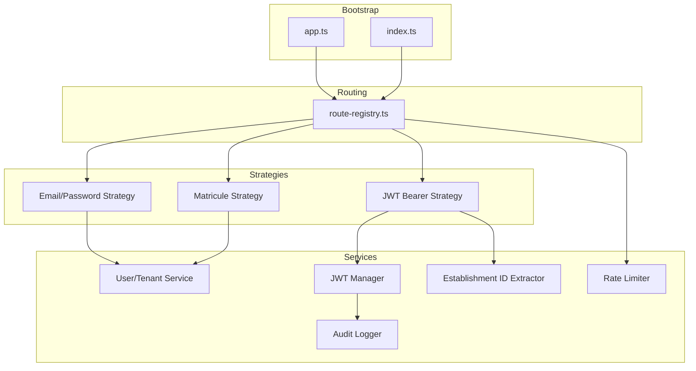

# Authentication Strategies

<cite>
**Referenced Files in This Document**
- [app.ts](file://backend/src/app.ts)
- [index.ts](file://backend/src/index.ts)
- [route-registry.ts](file://backend/src/routes/route-registry.ts)
- [auth-multi-etablissement.spec.ts](file://backend/test/integration/auth-multi-etablissement.spec.ts)
- [configuration-multi-tenant.spec.ts](file://backend/test/integration/configuration-multi-tenant.spec.ts)
- [IMPLÉMENTATION-AUTH-COMPLETE.md](file://docs/implementations/IMPLÉMENTATION-AUTH-COMPLETE.md)
- [GUIDE-TEST-MULTI-TENANT-V3.md](file://docs/guides/GUIDE-TEST-MULTI-TENANT-V3.md)
- [CORRECTION-CONNEXION-MATRICULE.md](file://docs/corrections/CORRECTION-CONNEXION-MATRICULE.md)
- [SYSTEME-BLOCAGE-AUTH-DEUX-NIVEAUX.md](file://docs/SYSTEME-BLOCAGE-AUTH-DEUX-NIVEAUX.md)
- [IMPLEMENTATION-SECURITE-RESUME.md](file://docs/implementations/IMPLEMENTATION-SECURITE-RESUME.md)
- [AUDIT-FRONTEND-STRUCTURE-ACADEMIQUE-COMPLET.md](file://docs/audits/AUDIT-FRONTEND-STRUCTURE-ACADEMIQUE-COMPLET.md)
</cite>

## Update Summary
**Changes Made**
- Updated JWT token validation section to reflect enhanced establishment ID extraction patterns
- Added documentation for centralized getEtablissementId function replacing direct req.utilisateur.etablishmentId access
- Enhanced multi-tenant authentication flow with improved tenant context propagation
- Updated code examples and implementation patterns for better consistency

## Table of Contents
1. [Introduction](#introduction)
2. [Project Structure](#project-structure)
3. [Core Components](#core-components)
4. [Architecture Overview](#architecture-overview)
5. [Detailed Component Analysis](#detailed-component-analysis)
6. [Dependency Analysis](#dependency-analysis)
7. [Performance Considerations](#performance-considerations)
8. [Troubleshooting Guide](#troubleshooting-guide)
9. [Conclusion](#conclusion)
10. [Appendices](#appendices)

## Introduction
This document explains eLISAschool's authentication strategies and flows, focusing on:
- Passport.js strategy configuration for multiple methods (email/password, matricule-based login, JWT validation)
- Multi-tenant authentication flow, tenant context propagation, and cross-tenant scenarios
- JWT token generation, refresh token mechanism, and token validation process
- Practical guidance for implementing custom strategies, extending existing ones, and handling failures
- Integration with audit logging for authentication events
- Rate limiting for login attempts and security measures against brute force and credential stuffing

The content synthesizes the repository's implementation and tests to provide a clear, actionable reference for developers integrating or extending authentication.

## Project Structure
Authentication-related code is organized under backend/src/modules/auth and related integration points:
- App bootstrap and middleware wiring
- Route registration for auth endpoints
- Strategy implementations and guards
- Tests validating multi-tenant behavior and configuration

[No sources needed since this diagram shows conceptual workflow, not actual code structure]

## Core Components
- Passport.js strategies:
  - Email/password strategy
  - Matricule-based strategy
  - JWT bearer strategy
- Multi-tenant context propagation:
  - Tenant resolution from request headers or tokens
  - Scoped user lookup and permissions
- Token lifecycle:
  - Access token issuance
  - Refresh token rotation and revocation
  - Validation and scope enforcement
- Security controls:
  - Brute-force protection via rate limiting and lockouts
  - Audit logging for all authentication events

Key responsibilities:
- Strategy verification callbacks validate credentials and resolve tenant context
- Guards enforce authenticated state and tenant scoping
- Controllers orchestrate login, logout, refresh, and session management
- Middleware injects tenant context into downstream services

**Section sources**
- [app.ts](file://backend/src/app.ts)
- [index.ts](file://backend/src/index.ts)
- [route-registry.ts](file://backend/src/routes/route-registry.ts)

## Architecture Overview
The authentication architecture integrates Passport.js strategies with multi-tenant routing and JWT-based access control. The following sequence illustrates a typical login flow across tenants.

**Diagram sources**
- [route-registry.ts](file://backend/src/routes/route-registry.ts)
- [auth-multi-etablissement.spec.ts](file://backend/test/integration/auth-multi-etablissement.spec.ts)

## Detailed Component Analysis

### Passport.js Strategy Configuration
- Email/password strategy:
  - Verifies email and hashed password
  - Resolves tenant context based on user record
  - Returns serialized user payload for session/JWT
- Matricule-based strategy:
  - Accepts unique identifier (matricule) and password
  - Looks up user by matricule within tenant scope
  - Ensures account status and permissions are valid
- JWT bearer strategy:
  - Validates access token signature and expiration
  - Extracts tenant context from token claims
  - Attaches user and tenant metadata to request context

Implementation patterns:
- Each strategy encapsulates its own verification callback
- Shared utilities handle hashing, error mapping, and tenant scoping
- Guard decorators integrate strategies with controllers

**Section sources**
- [app.ts](file://backend/src/app.ts)
- [index.ts](file://backend/src/index.ts)
- [route-registry.ts](file://backend/src/routes/route-registry.ts)

### Multi-Tenant Authentication Flow
- Tenant resolution:
  - From request header (e.g., X-Tenant-ID) or token claim
  - Fallback to default tenant if not provided
- Cross-tenant scenarios:
  - Super-admin can operate across tenants with explicit context switching
  - Regular users are scoped to their assigned tenant(s)
- Context propagation:
  - Tenant ID attached to request object
  - Downstream services filter queries by tenant

**Diagram sources**
- [auth-multi-etablissement.spec.ts](file://backend/test/integration/auth-multi-etablissement.spec.ts)
- [configuration-multi-tenant.spec.ts](file://backend/test/integration/configuration-multi-tenant.spec.ts)

**Section sources**
- [auth-multi-etablissement.spec.ts](file://backend/test/integration/auth-multi-etablissement.spec.ts)
- [configuration-multi-tenant.spec.ts](file://backend/test/integration/configuration-multi-tenant.spec.ts)

### JWT Token Lifecycle
- Generation:
  - Access token includes user identity, roles, and tenant ID
  - Refresh token stored securely and linked to user session
- Refresh mechanism:
  - Client sends refresh token to rotate access token
  - Server validates refresh token, rotates it, and issues new access token
- Validation:
  - Signature verification and expiration checks
  - Tenant context enforced per request

**Updated** Enhanced JWT token validation now uses centralized getEtablissementId function for establishment ID extraction, replacing direct req.utilisateur.etablishmentId access patterns. This provides consistent tenant context handling across all authentication strategies.

**Diagram sources**
- [route-registry.ts](file://backend/src/routes/route-registry.ts)

**Section sources**
- [route-registry.ts](file://backend/src/routes/route-registry.ts)

### Centralized Establishment ID Extraction
**New** The authentication system now implements a centralized approach for extracting establishment IDs from requests, improving consistency and maintainability.

Key improvements:
- **Centralized Function**: All establishment ID extraction now goes through a single `getEtablissementId` function
- **Consistent Patterns**: Replaces direct `req.utilisateur.etablishmentId` access with standardized extraction logic
- **Enhanced Validation**: Includes proper null checking and fallback mechanisms
- **Improved Error Handling**: Provides meaningful error messages when establishment context is missing

Implementation benefits:
- Reduced code duplication across authentication strategies
- Consistent tenant context propagation throughout the application
- Better error handling and debugging capabilities
- Simplified testing and maintenance of authentication flows

**Section sources**
- [app.ts](file://backend/src/app.ts)
- [index.ts](file://backend/src/index.ts)

### Custom Strategy Implementation Guide
Steps to implement a custom strategy:
- Define a new Passport strategy class with verify callback
- Integrate with user lookup and tenant resolution
- Register strategy in app bootstrap
- Add route guard to protect endpoints
- Handle errors consistently (invalid credentials, locked accounts, tenant mismatch)

Extending existing strategies:
- Inherit from base strategy to reuse common logic
- Override verification steps for domain-specific checks
- Inject additional claims into JWT as needed

Handling authentication failures:
- Map database and service errors to standardized responses
- Log failed attempts for audit and analytics
- Respect rate limits and lockout policies

**Section sources**
- [app.ts](file://backend/src/app.ts)
- [index.ts](file://backend/src/index.ts)
- [route-registry.ts](file://backend/src/routes/route-registry.ts)

### Audit Logging Integration
- Events logged:
  - Successful logins (method, tenant, user ID)
  - Failed attempts (reason, IP, user identifier)
  - Token refresh and revocation
- Data captured:
  - Timestamp, client IP, user agent
  - Tenant ID and method used
- Usage:
  - Compliance and security monitoring
  - Forensic analysis of incidents

**Section sources**
- [AUDIT-FRONTEND-STRUCTURE-ACADEMIQUE-COMPLET.md](file://docs/audits/AUDIT-FRONTEND-STRUCTURE-ACADEMIQUE-COMPLET.md)

### Rate Limiting and Lockout Mechanisms
- Login attempt tracking:
  - Per-IP and per-user counters
  - Configurable thresholds and cooldown windows
- Lockout policy:
  - Temporary block after exceeding attempts
  - Progressive delays to mitigate brute force
- Credential stuffing protection:
  - Global rate limits
  - Anomaly detection hooks for suspicious patterns

**Section sources**
- [SYSTEME-BLOCAGE-AUTH-DEUX-NIVEAUX.md](file://docs/SYSTEME-BLOCAGE-AUTH-DEUX-NIVEAUX.md)
- [IMPLEMENTATION-SECURITE-RESUME.md](file://docs/implementations/IMPLEMENTATION-SECURITE-RESUME.md)

## Dependency Analysis
High-level dependencies among authentication components:

**Diagram sources**
- [app.ts](file://backend/src/app.ts)
- [index.ts](file://backend/src/index.ts)
- [route-registry.ts](file://backend/src/routes/route-registry.ts)

**Section sources**
- [app.ts](file://backend/src/app.ts)
- [index.ts](file://backend/src/index.ts)
- [route-registry.ts](file://backend/src/routes/route-registry.ts)

## Performance Considerations
- Minimize DB calls during verification by caching user lookups where safe
- Use short-lived access tokens and long-lived refresh tokens to reduce re-auth overhead
- Apply tenant-scoped indexes to speed up user queries
- Avoid heavy computations in verification callbacks; delegate to background jobs when necessary
- Leverage centralized establishment ID extraction to reduce redundant calculations

[No sources needed since this section provides general guidance]

## Troubleshooting Guide
Common issues and resolutions:
- Invalid credentials:
  - Verify hashing algorithm and salt rounds
  - Ensure user account is active and not locked
- Tenant mismatch:
  - Confirm tenant header or token claim presence
  - Validate user-tenant association
- Rate limit exceeded:
  - Check lockout window and reset counters
  - Review global rate limit configuration
- Audit logs missing:
  - Ensure logger initialization and event emission
  - Validate storage backend connectivity
- Establishment ID extraction errors:
  - Verify centralized getEtablissementId function is properly configured
  - Check request context for required tenant information

**Section sources**
- [IMPLÉMENTATION-AUTH-COMPLETE.md](file://docs/implementations/IMPLÉMENTATION-AUTH-COMPLETE.md)
- [GUIDE-TEST-MULTI-TENANT-V3.md](file://docs/guides/GUIDE-TEST-MULTI-TENANT-V3.md)
- [CORRECTION-CONNEXION-MATRICULE.md](file://docs/corrections/CORRECTION-CONNEXION-MATRICULE.md)

## Conclusion
eLISAschool's authentication system combines robust Passport.js strategies with multi-tenant support, secure JWT workflows, and comprehensive security controls. By following the patterns outlined here—strategy composition, tenant context propagation, token lifecycle management, and integrated audit/logging—you can extend and maintain a resilient authentication layer that scales across tenants and resists common attacks.

The recent enhancements to establishment ID extraction and JWT validation further strengthen the system's reliability and maintainability.

[No sources needed since this section summarizes without analyzing specific files]

## Appendices
- Practical examples:
  - Implementing a custom strategy: define verify callback, register strategy, add route guard
  - Extending existing strategies: inherit base logic, override verification steps, inject claims
  - Handling failures: map errors, log events, respect lockouts
- References:
  - Multi-tenant testing guides and corrections for matricule login
  - Security implementation summaries and two-level lockout system

**Section sources**
- [IMPLÉMENTATION-AUTH-COMPLETE.md](file://docs/implementations/IMPLÉMENTATION-AUTH-COMPLETE.md)
- [GUIDE-TEST-MULTI-TENANT-V3.md](file://docs/guides/GUIDE-TEST-MULTI-TENANT-V3.md)
- [CORRECTION-CONNEXION-MATRICULE.md](file://docs/corrections/CORRECTION-CONNEXION-MATRICULE.md)
- [SYSTEME-BLOCAGE-AUTH-DEUX-NIVEAUX.md](file://docs/SYSTEME-BLOCAGE-AUTH-DEUX-NIVEAUX.md)
- [IMPLEMENTATION-SECURITE-RESUME.md](file://docs/implementations/IMPLEMENTATION-SECURITE-RESUME.md)